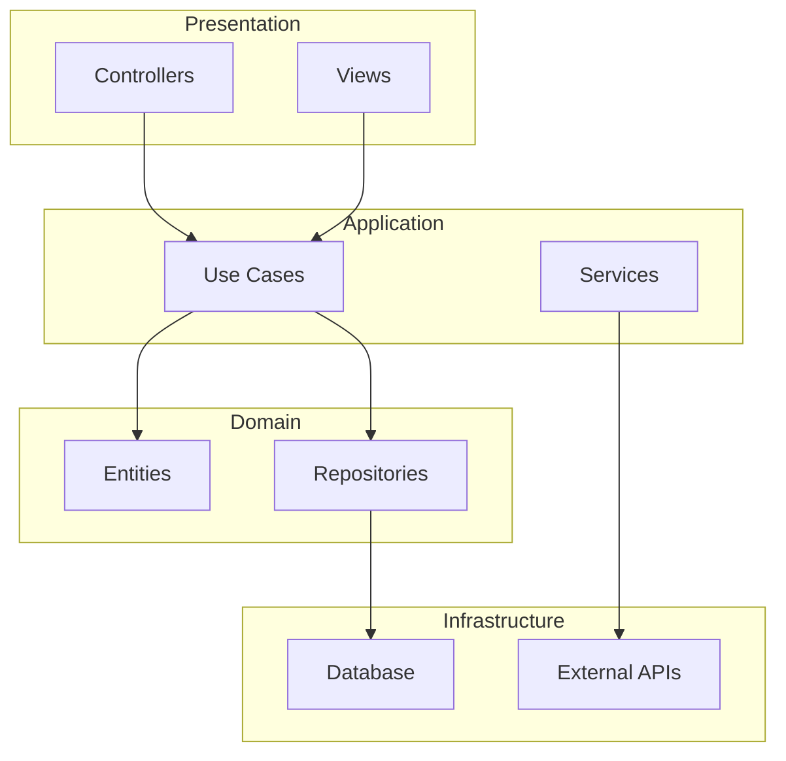
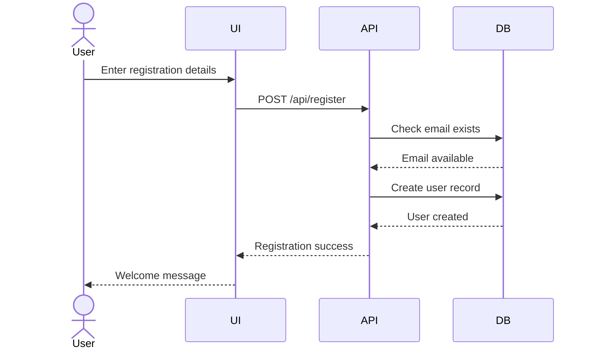

# DevForgeAI Documentation Skill - Architecture and Implementation Guide

**Story:** STORY-040
**Version:** 1.0
**Date:** 2025-11-16
**Status:** Design Complete

---

## Executive Summary

This document provides the complete architecture and implementation guide for the `devforgeai-documentation` skill and `/document` slash command, which automate documentation generation for both greenfield and brownfield projects.

**Key Innovation:** Automated documentation that stays synchronized with implementation through story-driven generation and intelligent codebase analysis.

---

## Architecture Overview

### Component Hierarchy

```
┌─────────────────────────────────────────────────────────────┐
│                    /document Command                        │
│  (Lean Orchestration - Argument Validation & Skill Invoke) │
└────────────────────┬────────────────────────────────────────┘
                     │
                     ↓
┌─────────────────────────────────────────────────────────────┐
│            devforgeai-documentation Skill                   │
│  (7 Phases - Mode Detection → Generation → Validation)     │
└─────┬───────────────────────────────┬───────────────────────┘
      │                               │
      ↓                               ↓
┌─────────────────┐         ┌─────────────────────┐
│ documentation-  │         │  code-analyzer      │
│ writer subagent │         │  subagent (NEW)     │
│ (Existing)      │         │  (Deep Analysis)    │
└─────────────────┘         └─────────────────────┘
      │                               │
      ↓                               ↓
┌─────────────────────────────────────────────────────────────┐
│                   Template Library                          │
│  7 Templates: README, Developer Guide, API, Troubleshoot... │
└─────────────────────────────────────────────────────────────┘
```

---

## Skill Structure: devforgeai-documentation

### File Organization

```
.claude/skills/devforgeai-documentation/
├── SKILL.md                        # Main skill definition (~200 lines)
├── references/
│   ├── documentation-standards.md  # Style guide, formatting (450 lines)
│   ├── greenfield-workflow.md      # Story analysis procedures (380 lines)
│   ├── brownfield-analysis.md      # Codebase scanning (520 lines)
│   ├── diagram-generation-guide.md # Mermaid syntax, patterns (410 lines)
│   └── template-customization.md   # Custom templates (290 lines)
└── assets/
    └── templates/
        ├── readme-template.md
        ├── developer-guide-template.md
        ├── api-docs-template.md
        ├── troubleshooting-template.md
        ├── contributing-template.md
        ├── changelog-template.md
        └── architecture-template.md
```

### Skill Workflow (7 Phases)

#### Phase 0: Mode Detection and Validation

**Purpose:** Determine execution mode and validate prerequisites

**Steps:**
1. Extract parameters from conversation context:
   - `**Story ID:**` (if provided)
   - `**Documentation Type:**` (readme, api, architecture, roadmap, all)
   - `**Mode:**` (greenfield, brownfield)
   - `**Export Format:**` (markdown, html, pdf)

2. Detect mode automatically if not specified:
   - If project has <10 source files → greenfield
   - If project has existing documentation → brownfield (update mode)
   - If no context files exist → HALT (require `/create-context` first)

3. Validate context files:
   - Check `.devforgeai/context/*.md` exist (all 6 files)
   - Read `coding-standards.md` for documentation conventions
   - Read `source-tree.md` for documentation file placement
   - HALT if context files missing

4. Load reference file based on mode:
   - **Greenfield:** Load `references/greenfield-workflow.md`
   - **Brownfield:** Load `references/brownfield-analysis.md`
   - **Both:** Load `references/documentation-standards.md`

**Output:** Mode confirmed, context loaded, ready to proceed

---

#### Phase 1: Discovery and Analysis

**Greenfield Mode:**

**Step 1.1: Story Discovery**
- If `**Story ID:**` provided → Read single story file
- If `--type=all` → Glob all stories in "QA Approved" or "Released" status
- Extract from each story:
  - Title and description (user story)
  - Acceptance criteria (features implemented)
  - Technical specification (API endpoints, data models)
  - UI specification (if present)
  - Edge cases and error handling

**Step 1.2: Implementation Analysis**
- Use code-analyzer subagent to find implementation files:
  - Grep for story ID in source files (comments, commit messages)
  - Identify files modified in story implementation
  - Extract public APIs, classes, functions
  - Identify architecture patterns used

**Step 1.3: Aggregate Content**
- Combine story specifications with code analysis
- Build content map:
  ```
  {
    "project_overview": extracted from epics,
    "features": extracted from story AC,
    "api_endpoints": extracted from tech specs + code,
    "architecture": detected by code-analyzer,
    "setup_steps": extracted from tech-stack.md + dependencies.md
  }
  ```

**Brownfield Mode:**

**Step 1.1: Codebase Scanning**
- Invoke code-analyzer subagent with full project path
- Analyze all source files (Glob: `src/**/*`, `app/**/*`, `lib/**/*`)
- Extract:
  - Entry points (main.ts, index.js, app.py)
  - Public APIs (exported functions, REST endpoints)
  - Architecture patterns (directory structure analysis)
  - Dependencies (package.json, requirements.txt, etc.)
  - Existing comments and docstrings

**Step 1.2: Existing Documentation Discovery**
- Glob for existing documentation: `**/*.md`, `docs/**/*`, `README*`
- Categorize found files:
  - README files (project root, subdirectories)
  - API documentation
  - Developer guides
  - Scattered notes
- Parse existing content, identify completeness

**Step 1.3: Gap Analysis**
- Compare code analysis with existing documentation
- Identify gaps:
  - Undocumented public APIs (X% coverage)
  - Missing sections in README (setup, usage, examples)
  - Outdated content (code changed, docs didn't)
  - Scattered information (consolidation needed)

**Output:** Content map with discovered/analyzed data

---

#### Phase 2: Content Generation

**Step 2.1: Invoke documentation-writer Subagent**

**For each documentation type:**
- **README.md:**
  - Project overview from epic descriptions
  - Setup instructions from tech-stack.md + dependencies.md
  - Usage examples from story acceptance criteria
  - Contributing guidelines from coding-standards.md

- **Developer Guide:**
  - Architecture explanation from code-analyzer patterns
  - Development workflow from devforgeai process
  - Code conventions from coding-standards.md
  - Testing guidelines from TDD workflow

- **API Documentation:**
  - Endpoint list from code-analyzer + tech specs
  - Request/response schemas from data models
  - Authentication from security implementation
  - Error codes from edge cases

- **Troubleshooting Guide:**
  - Common issues from story edge cases
  - Error messages from code implementation
  - Debugging steps from developer experience
  - FAQ from user feedback

**Step 2.2: Generate Mermaid Diagrams**

**Architecture Diagram:**


**Sequence Diagram (Example: User Registration):**


**Step 2.3: Extract Code Examples**
- From implemented code, extract usage examples
- Simplify to minimal working examples
- Add explanatory comments
- Validate syntax (language-specific linting)

**Output:** Generated content sections, Mermaid diagrams, code examples

---

#### Phase 3: Template Application

**Step 3.1: Load Templates**
- Check for custom templates: `.devforgeai/templates/documentation/`
- If custom exist → Use custom
- If not → Use built-in from `assets/templates/`

**Step 3.2: Apply Template Variables**

**Variable substitution:**
```handlebars
{{project_name}}          → From epic or package.json
{{project_description}}   → From epic goal
{{tech_stack}}            → From tech-stack.md
{{installation_steps}}    → Generated from dependencies.md
{{usage_examples}}        → From story AC + code
{{api_endpoints}}         → From code-analyzer + tech specs
{{architecture_diagram}}  → Generated Mermaid diagram
{{troubleshooting_entries}} → From edge cases
{{contributors}}          → From git log (optional)
{{license}}               → From LICENSE file or default
```

**Step 3.3: Populate Sections**
- For each template section, insert generated content
- Apply markdown formatting (headers, lists, code blocks)
- Add table of contents if template includes `{{toc}}`
- Insert diagrams as code blocks with `mermaid` language tag

**Output:** Fully populated documentation files (Markdown)

---

#### Phase 4: Integration and Updates

**Step 4.1: Detect Existing Documentation**
- Glob for existing files matching template names
- Compare timestamps: code last modified vs doc last updated
- Identify user-authored sections:
  - Look for markers: `<!-- USER_SECTION_START -->` ... `<!-- USER_SECTION_END -->`
  - Use git blame to identify manual edits
  - Preserve sections not generated by framework

**Step 4.2: Merge Strategy**

**If existing documentation found:**
- **Option 1: Smart Merge** (default)
  - Preserve user-authored sections
  - Update auto-generated sections only
  - Add new sections if missing
  - Create backup: `{filename}.backup-{timestamp}`

- **Option 2: Replace** (if user confirms)
  - Create backup
  - Replace entire file with generated content
  - Log warning about overwrite

- **Option 3: Side-by-side** (for review)
  - Create `{filename}.generated` alongside existing
  - User manually merges

**Step 4.3: Update Metadata**

**Add documentation metadata to story file:**
```yaml
documentation:
  status: Complete
  coverage: 85%
  files_generated:
    - README.md
    - docs/DEVELOPER.md
    - docs/API.md
  diagrams:
    - docs/architecture.mmd
  last_updated: 2025-11-16
```

**Update changelog:**
- If CHANGELOG.md exists, add entry for story documentation
- Format: `## [Story-040] - 2025-11-16 - Documentation added for...`

**Output:** Merged/updated documentation files with preserved user content

---

#### Phase 5: Validation and Quality Check

**Step 5.1: Documentation Coverage Calculation**

**Coverage formula:**
```
Coverage = (Documented APIs / Total Public APIs) * 100%
```

**Detailed calculation:**
- Use code-analyzer to count total public APIs
- Parse generated API docs to count documented APIs
- Compare lists, identify undocumented APIs
- Calculate percentage

**Step 5.2: Completeness Checks**

**Required sections (per template):**
- README.md: Overview, Setup, Usage, Contributing (4/4 required)
- Developer Guide: Architecture, Workflow, Conventions (3/3 required)
- API Docs: Endpoints, Schemas, Authentication (3/3 required)

**Verification:**
- Parse each file, check for section headers
- Flag missing sections as warnings
- Count total completeness: (Sections present / Sections required) * 100%

**Step 5.3: Diagram Rendering Validation**
- For each Mermaid diagram, validate syntax:
  - Use regex to check graph structure
  - Verify node definitions
  - Check arrow syntax
  - Detect common errors (unclosed quotes, missing semicolons)
- If syntax invalid, attempt auto-fix
- If auto-fix fails, flag diagram for manual review

**Step 5.4: Link Validation**
- Extract all Markdown links: `[text](url)`
- For internal links (relative paths), verify file exists
- For external links, optionally check (with user permission)
- Report broken links

**Step 5.5: Framework Constraint Validation**
- Verify documentation follows coding-standards.md style
- Check files placed per source-tree.md structure
- Validate no forbidden content (anti-patterns.md)

**Output:** Validation report with coverage %, completeness %, issues

---

#### Phase 6: Export and Finalization

**Step 6.1: Write Markdown Files**
- Write all generated documentation to disk
- Locations per source-tree.md (default: `docs/`, `README.md` in root)
- Set file permissions (644 - read/write owner, read others)

**Step 6.2: Export to Additional Formats** (if requested)

**HTML Export:**
- Use markdown-to-html converter (internal or Pandoc)
- Apply CSS styling:
  - Default: Clean, professional theme
  - Custom: Load from `.devforgeai/templates/documentation/styles.css`
- Embed Mermaid diagrams as SVG (render with mermaid-cli if available)
- Generate navigation (sidebar, breadcrumbs)
- Output to `docs/html/` or specified directory

**PDF Export:**
- Convert HTML to PDF using wkhtmltopdf (if installed)
- Apply PDF metadata (title, author, date)
- Include table of contents with page numbers
- Preserve diagrams as vector graphics
- Output to `docs/pdf/` or specified directory

**Step 6.3: Update Story File**
- Append to Story Workflow History:
  ```
  ### 2025-11-16 - Documentation Generated
  - Status: Documentation Complete
  - Coverage: 85%
  - Files: README.md, docs/DEVELOPER.md, docs/API.md
  - Diagrams: 2 architecture diagrams, 1 sequence diagram
  ```

**Step 6.4: Git Commit** (optional, with user approval)
- Stage documentation files: `git add docs/ README.md`
- Commit with message: `docs(STORY-040): Generate project documentation`
- Do NOT push (leave to user)

**Output:** Documentation files written, exported, story updated

---

#### Phase 7: Completion Summary

**Return structured summary to command:**

```json
{
  "status": "SUCCESS",
  "mode": "greenfield",
  "documentation_type": "all",
  "files_generated": [
    "README.md",
    "docs/DEVELOPER.md",
    "docs/API.md",
    "docs/TROUBLESHOOTING.md"
  ],
  "diagrams_generated": [
    "docs/architecture.mmd",
    "docs/user-registration-flow.mmd"
  ],
  "coverage": {
    "api_coverage": "85%",
    "completeness": "100%",
    "documented_apis": 17,
    "total_apis": 20,
    "undocumented_apis": ["DELETE /api/tasks/:id", "PATCH /api/users/:id"]
  },
  "validation": {
    "broken_links": 0,
    "syntax_errors": 0,
    "framework_violations": 0
  },
  "exports": {
    "html": "docs/html/index.html",
    "pdf": "docs/pdf/documentation.pdf"
  },
  "next_steps": [
    "Review generated documentation in docs/ directory",
    "Address undocumented APIs: DELETE /api/tasks/:id, PATCH /api/users/:id",
    "Commit documentation: git add docs/ README.md && git commit -m 'docs: Add project documentation'"
  ]
}
```

---

## Subagent: code-analyzer

### Purpose
Deep codebase analysis to extract structured metadata for documentation generation.

### Location
`.claude/agents/code-analyzer.md`

### System Prompt (Excerpt)

```markdown
# code-analyzer Subagent

You are a specialized code analysis agent that extracts structured metadata from codebases for documentation generation.

## Capabilities

1. **Architecture Pattern Detection**
   - Analyze directory structure
   - Identify MVC, Clean Architecture, DDD, Microservices, Monolith
   - Detect layer boundaries (presentation, application, domain, infrastructure)

2. **Public API Extraction**
   - Find all exported functions, classes, methods
   - Extract REST endpoint definitions (Express, FastAPI, ASP.NET)
   - Parse GraphQL schemas
   - Identify gRPC services

3. **Dependency Mapping**
   - Extract package.json, requirements.txt, *.csproj
   - Map internal module dependencies
   - Identify circular dependencies (flag warnings)

4. **Entry Point Discovery**
   - Find main entry points (index.ts, main.py, Program.cs)
   - Identify initialization sequences
   - Map startup configuration

5. **Call Graph Generation**
   - Trace key user workflows (registration, login, checkout)
   - Generate call sequences for critical paths
   - Identify integration points

## Tools Available
- Read: Read source files
- Glob: Find files matching patterns
- Grep: Search for specific code patterns
- Bash: Run language-specific parsers (ast, tree-sitter)

## Output Format

Return structured JSON:

{
  "project_name": "...",
  "tech_stack": ["...", "..."],
  "architecture_pattern": "Clean Architecture",
  "layers": {
    "presentation": ["src/controllers/"],
    "application": ["src/use-cases/"],
    "domain": ["src/entities/"],
    "infrastructure": ["src/database/"]
  },
  "public_apis": [
    {
      "type": "REST",
      "endpoint": "POST /api/tasks",
      "handler": "src/controllers/TaskController.createTask",
      "signature": "createTask(title: string, description: string): Promise<Task>",
      "documented": false
    }
  ],
  "entry_points": ["src/index.ts"],
  "dependencies": {
    "external": ["express", "typeorm"],
    "internal": ["@domain/Task", "@use-cases/CreateTask"]
  },
  "call_graphs": [
    {
      "workflow": "User Registration",
      "sequence": [
        "POST /api/register → RegisterController.register",
        "RegisterController.register → CreateUserUseCase.execute",
        "CreateUserUseCase.execute → UserRepository.create",
        "UserRepository.create → Database.insert"
      ]
    }
  ]
}
```

### Analysis Strategies

**Node.js/TypeScript:**
```bash
# Use TypeScript Compiler API to parse ASTs
npx ts-node --eval "
const ts = require('typescript');
const fs = require('fs');
const sourceFile = ts.createSourceFile('file.ts', fs.readFileSync('file.ts', 'utf8'), ts.ScriptTarget.Latest);
// Extract exports, function signatures
"
```

**Python:**
```bash
# Use ast module to parse Python files
python3 <<EOF
import ast
import json

with open('file.py') as f:
    tree = ast.parse(f.read())

# Extract classes, functions, decorators
classes = [node.name for node in ast.walk(tree) if isinstance(node, ast.ClassDef)]
functions = [node.name for node in ast.walk(tree) if isinstance(node, ast.FunctionDef)]
print(json.dumps({"classes": classes, "functions": functions}))
EOF
```

**C#:**
```bash
# Use Roslyn to parse C# files
dotnet script eval "
using Microsoft.CodeAnalysis.CSharp;
using System.IO;

var code = File.ReadAllText(\"File.cs\");
var tree = CSharpSyntaxTree.ParseText(code);
// Extract classes, methods, namespaces
"
```

---

## Command Structure: /document

### File Location
`.claude/commands/document.md`

### Lean Orchestration Pattern

**Lines:** ~250-300 (target)
**Characters:** ~10K (within budget)

### Command Structure

```markdown
---
description: Generate comprehensive project documentation
argument-hint: [STORY-ID] [--type=TYPE] [--mode=MODE] [--export=FORMAT]
model: sonnet
allowed-tools: Read, Skill, AskUserQuestion, Glob, Grep
---

# /document - DevForgeAI Documentation Generator

Generate comprehensive project documentation from story implementations or codebase analysis.

---

## Quick Reference

```bash
# Document specific story
/document STORY-040

# Generate specific documentation type
/document --type=readme
/document --type=api
/document --type=architecture
/document --type=roadmap
/document --type=all

# Brownfield project analysis
/document --mode=brownfield --analyze

# Export to additional formats
/document --export=html
/document --export=pdf

# List available templates
/document --list-templates
```

---

## Command Workflow

### Phase 0: Argument Validation and Context Loading

**Parse arguments:**
- `$1` = Story ID (optional, e.g., STORY-040)
- `--type=TYPE` = Documentation type (readme, api, architecture, roadmap, all)
- `--mode=MODE` = Mode (greenfield, brownfield)
- `--export=FORMAT` = Export format (html, pdf)
- `--analyze` = Brownfield analysis only (no generation)
- `--list-templates` = Display available templates

**Handle special cases:**

**If `--list-templates`:**
- Glob: `.claude/skills/devforgeai-documentation/assets/templates/*.md`
- Glob: `.devforgeai/templates/documentation/*.md` (custom)
- Display list with descriptions
- Exit (do not invoke skill)

**If story ID provided:**
- Validate format: `STORY-\d+`
- Load story file: `@.ai_docs/Stories/$1*.story.md`
- Verify story status: "QA Approved" or "Released"
- If status invalid, AskUserQuestion: "Story not QA approved. Continue anyway?"

**If no arguments:**
- AskUserQuestion:
  - "What type of documentation to generate?"
  - Options: README, Developer Guide, API Docs, Architecture, Roadmap, All
  - "Mode: Greenfield (from stories) or Brownfield (analyze codebase)?"

---

### Phase 1: Set Context and Invoke Skill

**Set context markers:**
```
**Story ID:** ${STORY_ID}
**Documentation Type:** ${TYPE}
**Mode:** ${MODE}
**Export Format:** ${FORMAT}
```

**Invoke skill:**
```
Skill(command="devforgeai-documentation")
```

**Skill executes 7 phases** (see skill workflow above)

---

### Phase 2: Display Results

**Receive skill output:**
- `result.status` (SUCCESS, PARTIAL, FAILED)
- `result.files_generated` (list of file paths)
- `result.coverage` (API coverage %, completeness %)
- `result.validation` (broken links, syntax errors)
- `result.next_steps` (recommendations)

**Display formatted output:**

**Success (coverage ≥80%):**
```
✅ Documentation Generated Successfully

Files Created:
  ✓ README.md (100% complete)
  ✓ docs/DEVELOPER.md (100% complete)
  ✓ docs/API.md (90% complete - 3 endpoints missing docs)
  ✓ docs/TROUBLESHOOTING.md (100% complete)

Diagrams:
  ✓ docs/architecture.mmd (12 components)
  ✓ docs/user-registration-flow.mmd (4 actors)

Coverage:
  API Documentation: 85% (17/20 endpoints)
  Completeness: 97% (all required sections present)

Next Steps:
  1. Review generated documentation in docs/ directory
  2. Document remaining APIs: DELETE /api/tasks/:id, PATCH /api/users/:id
  3. Commit: git add docs/ README.md && git commit -m 'docs: Add project documentation'
```

**Partial (coverage <80%):**
```
⚠️ Documentation Generated with Warnings

Coverage: 65% (13/20 endpoints documented)
  Missing: 7 API endpoints (see below)

Quality Gate: FAILED
  Minimum coverage: 80% required for release
  Current coverage: 65%

Undocumented APIs:
  - DELETE /api/tasks/:id
  - PATCH /api/users/:id
  - GET /api/reports/summary
  - POST /api/export/csv
  - ... (3 more)

Recommendation:
  Run: /document --type=api to regenerate API documentation
  Then address missing endpoints before release
```

**Failed (errors during generation):**
```
❌ Documentation Generation Failed

Error: Unable to analyze codebase
  Reason: No source files found in project
  Resolution: Ensure source code exists in standard locations (src/, app/, lib/)

Error: Mermaid diagram syntax invalid
  File: docs/architecture.mmd
  Line: 15
  Issue: Unclosed quote in node definition
  Resolution: Manual fix required

Next Steps:
  1. Address errors above
  2. Retry: /document --type=all
```

---

### Phase 3: Next Steps Guidance

**Based on coverage and status:**

**If coverage ≥80%:**
- Suggest: Review documentation, commit, proceed to release

**If coverage <80%:**
- Suggest: Document missing APIs, regenerate, retry QA

**If export requested:**
- Display: Export locations (HTML, PDF)
- Suggest: Open in browser or PDF viewer

---

## Error Handling

**Error: Story not found**
```
Story file not found: STORY-040

Available stories:
  STORY-001: User Authentication
  STORY-002: Task Management
  STORY-003: Dashboard UI

Choose story:
  [Option 1] STORY-001
  [Option 2] STORY-002
  [Option 3] Cancel
```

**Error: Context files missing**
```
Context files required for documentation generation.

Run: /create-context {project-name}

Then retry: /document
```

**Error: No implementation found**
```
Story STORY-040 has no code implementation.

Cannot generate documentation from stories without implementation.

Options:
  [Option 1] Generate placeholder docs from acceptance criteria
  [Option 2] Skip documentation for this story
  [Option 3] Cancel
```

---

## Success Criteria

- [ ] Documentation generated in <2 minutes (greenfield)
- [ ] Brownfield analysis completes in <10 minutes
- [ ] Coverage calculation accurate
- [ ] All templates accessible
- [ ] Export formats work (HTML, PDF)
- [ ] Quality gate integrated with /release

---

## Integration

**Invoked by:** Users manually, /orchestrate (after QA)
**Invokes:** devforgeai-documentation skill
**Updates:** Story files (documentation status), project documentation
**Blocks:** /release if coverage <80% (quality gate)
```

---

## Integration with SDLC

### Updated Workflow States

**Add new story state:**
```
QA Approved → Documentation In Progress → Documentation Complete → Releasing → Released
```

### Updated /orchestrate Command

**Add Phase 8.5: Documentation**

After Phase 8 (QA Approved):
```markdown
### Phase 8.5: Generate Documentation

**If story status = "QA Approved":**

**Invoke /document command:**
```
Skill(command="devforgeai-documentation")
```

**Check documentation coverage:**
- If coverage ≥80% → Update status: "Documentation Complete"
- If coverage <80% → HALT, ask user:
  - "Documentation coverage below threshold (X%). Proceed anyway?"
  - Options: [Fix documentation | Skip documentation | Abort release]

**Continue to Phase 9 (Release) only if:**
- Documentation Complete OR
- User approved skip
```

### Updated /release Command

**Add Quality Gate 5: Documentation**

Before staging deployment:
```markdown
### Quality Gate 5: Documentation Coverage

**Verify documentation exists:**
- [ ] README.md exists
- [ ] API coverage ≥80%
- [ ] All public APIs documented

**If gate fails:**
- HALT release
- Display: "Documentation quality gate failed. Run /document to generate."
- Ask user: "Bypass documentation gate? (Not recommended)"
  - If YES: Proceed with warning
  - If NO: Abort release
```

---

## Template Library Details

### Template: readme-template.md

```markdown
# {{project_name}}

{{project_description}}

## Overview

{{overview_paragraph}}

## Features

{{features_list}}

## Tech Stack

{{tech_stack_list}}

## Installation

### Prerequisites

{{prerequisites}}

### Setup Steps

{{installation_steps}}

## Usage

### Basic Usage

{{basic_usage_example}}

### Advanced Usage

{{advanced_usage_examples}}

## API Documentation

See [API Documentation](docs/API.md) for complete API reference.

## Architecture

{{architecture_overview}}


## Development

See [Developer Guide](docs/DEVELOPER.md) for development instructions.

## Troubleshooting

See [Troubleshooting Guide](docs/TROUBLESHOOTING.md) for common issues.

## Contributing

See [Contributing Guidelines](docs/CONTRIBUTING.md).

## License

{{license}}

## Contact

{{contact_info}}
```

### Template: developer-guide-template.md

```markdown
# Developer Guide - {{project_name}}

## Architecture Overview

{{architecture_explanation}}

### Layers

{{layer_descriptions}}

### Design Patterns

{{design_patterns_used}}

## Development Workflow

### Setup Development Environment

{{dev_environment_setup}}

### Running Locally

{{local_development_instructions}}

### Testing

{{testing_instructions}}

#### Unit Tests

{{unit_test_commands}}

#### Integration Tests

{{integration_test_commands}}

### Code Conventions

{{coding_standards_from_context_files}}

### Commit Guidelines

{{commit_message_conventions}}

## Building

{{build_instructions}}

## Deployment

{{deployment_process}}

## Debugging

{{debugging_tips}}

## Common Development Tasks

### Adding a New Feature

{{feature_development_steps}}

### Fixing a Bug

{{bug_fix_workflow}}

### Refactoring

{{refactoring_guidelines}}
```

---

## Implementation Phases

### Phase 1: MVP - Greenfield README (Stories 1-2, 5 points)

**Deliverables:**
- devforgeai-documentation skill (basic, README only)
- /document command (basic)
- readme-template.md
- documentation-standards.md reference
- greenfield-workflow.md reference

**Testing:**
- Generate README.md from 3 test stories
- Verify template variable substitution
- Validate output against coding-standards.md

**Timeline:** 8-10 hours

---

### Phase 2: Brownfield Analysis (Stories 3-4, 5 points)

**Deliverables:**
- code-analyzer subagent
- brownfield-analysis.md reference
- Gap analysis functionality
- Coverage reporting

**Testing:**
- Analyze sample Node.js project (100 files)
- Discover existing documentation
- Generate gap report with 80%+ accuracy

**Timeline:** 10-12 hours

---

### Phase 3: Advanced Features (Stories 5-8, 3 points)

**Deliverables:**
- All 7 templates (developer guide, API, troubleshooting, etc.)
- Mermaid diagram generation
- diagram-generation-guide.md reference
- HTML/PDF export
- Quality gate integration

**Testing:**
- Generate all documentation types
- Create architecture and sequence diagrams
- Export to HTML and PDF
- Verify /release blocks on <80% coverage

**Timeline:** 8-10 hours

---

**Total Estimated Effort:** 26-32 hours (13 story points at 2-2.5 hours per point)

---

## Success Metrics

### Greenfield Projects
- [ ] Zero manual documentation required
- [ ] Documentation generated in <2 minutes per story
- [ ] 95%+ of stories have complete documentation
- [ ] All diagrams render without errors

### Brownfield Projects
- [ ] 80%+ documentation coverage achieved
- [ ] All undocumented APIs identified
- [ ] Existing documentation consolidated
- [ ] Analysis completes in <10 minutes for 500-file codebase

### Quality
- [ ] Documentation follows coding-standards.md
- [ ] All templates customizable
- [ ] Quality gate prevents incomplete releases
- [ ] User satisfaction: 9/10+ rating

---

## Risk Mitigation

### Risk: Code analysis fails for non-standard architectures
**Mitigation:**
- Provide fallback: Ask user to specify architecture pattern
- Support "Custom" architecture option
- Generate basic documentation without assumptions

### Risk: Mermaid diagram syntax errors
**Mitigation:**
- Validate syntax before writing file
- Implement auto-fix for common issues
- Provide manual fix instructions if auto-fix fails

### Risk: Export dependencies missing (wkhtmltopdf, pandoc)
**Mitigation:**
- Graceful degradation: Fall back to Markdown
- Clear installation instructions
- Optional feature (not blocking)

---

**End of Architecture Document**
