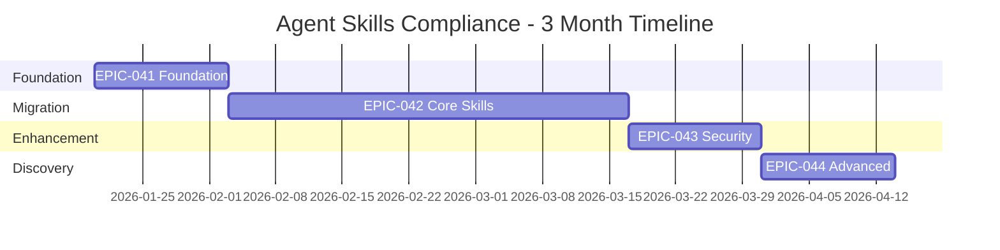

# Agent Skills Specification Compliance - Requirements Specification

**Version:** 1.0
**Date:** 2026-01-18
**Status:** Approved
**Author:** DevForgeAI Ideation
**Complexity Score:** 26/60 (Tier 2 - Moderate)
**Source Brainstorm:** BRAINSTORM-004

---

## 1. Project Overview

### 1.1 Project Context
**Type:** Brownfield (existing DevForgeAI framework enhancement)
**Domain:** Developer tooling / Framework compliance
**Timeline:** 3 months (aggressive)
**Team:** 1 (Claude Code + user)

### 1.2 Problem Statement

> *"DevForgeAI framework users experience maintenance burden due to inconsistent skill metadata and lack of validation, resulting in version drift, security blind spots, and QA gaps that slow development velocity, cause quality issues, limit framework adoption, and constrain ecosystem growth."*

**Root Cause:** Skills were created before Agent Skills specification (Dec 2025); no retroactive compliance process exists.

### 1.3 Solution Overview

Enhance the DevForgeAI framework with full Agent Skills specification compliance through:
1. Standardized skill metadata (version, allowed-tools, categories)
2. Automated validation (skills-ref validate integration)
3. Phased migration of all 17 non-compliant skills
4. Security enforcement via tool whitelisting
5. Improved discoverability through categorization

### 1.4 Success Criteria

| Metric | Target | Measurement Method |
|--------|--------|-------------------|
| Skills compliant | 18/18 (100%) | skills-ref validate passes |
| QA integration | 100% | skills-ref in /qa Phase 1 |
| Version tracking | 18/18 | All skills have metadata.version |
| allowed-tools coverage | 18/18 | All skills have tool whitelist |
| Token efficiency | <5% increase | Compare before/after metadata |

---

## 2. Stakeholder Analysis

### 2.1 Primary Stakeholders

| Stakeholder | Goals | Concerns |
|-------------|-------|----------|
| **Framework Owner** | Full spec compliance, cross-platform portability, security | Migration effort, backward compatibility |
| **Power Users** | Fast discovery, version visibility, predictable tool boundaries | Workflow disruption, learning curve |

### 2.2 Secondary Stakeholders

| Stakeholder | Goals | Concerns |
|-------------|-------|----------|
| Claude Code Team | Ecosystem standardization | DevForgeAI setting good precedent |
| Contributors | Clear guidelines, automated validation | YAML complexity, merge conflicts |
| QA Engineers | Automated validation, clear pass/fail | Integration complexity |

### 2.3 Stakeholder Conflicts & Resolutions

| Conflict | Resolution |
|----------|------------|
| Migration disruption | Phased rollout with backward compatibility |
| Validation strictness | FAIL on non-compliance (per user requirement) |
| Extensions vs Portability | Metadata segregation (portable vs extended) |

---

## 3. Functional Requirements

### 3.1 User Stories

#### Epic 041: Agent Skills Foundation

| ID | Story | Priority |
|----|-------|----------|
| US-041-01 | As a framework owner, I want an ADR documenting Agent Skills adoption, so that the decision is recorded | MUST |
| US-041-02 | As a contributor, I want the skill-creator template to generate compliant skills, so new skills auto-comply | MUST |
| US-041-03 | As a QA engineer, I want skills-ref validate in /qa workflow, so compliance is automatically checked | MUST |
| US-041-04 | As a framework owner, I want an audit command, so I can see compliance status of all skills | SHOULD |

#### Epic 042: Core Skills Migration

| ID | Story | Priority |
|----|-------|----------|
| US-042-01 | As a user, I want devforgeai-development to be Agent Skills compliant, so it has version tracking | MUST |
| US-042-02 | As a user, I want devforgeai-qa to be Agent Skills compliant, so validation is consistent | MUST |
| US-042-03 | As a user, I want devforgeai-orchestration to be Agent Skills compliant | MUST |
| US-042-04 through US-042-17 | Migration stories for remaining 14 skills | MUST |

#### Epic 043: Security & Quality Enhancement

| ID | Story | Priority |
|----|-------|----------|
| US-043-01 | As a security-conscious user, I want allowed-tools enforced, so skills only use approved tools | SHOULD |
| US-043-02 | As a token-conscious user, I want progressive disclosure audit, so skills are token-efficient | SHOULD |
| US-043-03 | As a framework owner, I want token budget validation, so skills stay within limits | SHOULD |

#### Epic 044: Discovery & Advanced Features

| ID | Story | Priority |
|----|-------|----------|
| US-044-01 | As a new user, I want skills organized by category, so I can find what I need | COULD |
| US-044-02 | As a user, I want devforgeai-release to require explicit invocation, so I don't accidentally release | COULD |
| US-044-03 | As a framework owner, I want a compliance dashboard, so I can monitor status | COULD |

### 3.2 Feature Requirements

#### F1: ADR Creation
- Create ADR-011 following DevForgeAI ADR template
- Document: Context, Decision, Consequences
- Include: Migration strategy, backward compatibility guarantees
- Store in: devforgeai/specs/adrs/ADR-011-agent-skills-adoption.md

#### F2: Template Update
- Add metadata.version field (framework-aligned versioning)
- Add allowed-tools section with tool whitelist
- Add all Agent Skills spec required fields
- Ensure generated skills pass skills-ref validate

#### F3: QA Integration
- Call skills-ref validate during /qa Phase 1 preflight
- FAIL behavior on non-compliance (no WARN option)
- Display compliance status in QA report

#### F4: Skill Migration
- Update YAML frontmatter with Agent Skills fields
- Add metadata.version (match framework version)
- Add allowed-tools section
- Validate with skills-ref
- Maintain full backward compatibility

#### F5: Security Enforcement
- Audit current tool usage per skill
- Define minimal tool sets per skill
- Apply principle of least privilege
- Document rationale for each tool

#### F6: Discovery Enhancement
- Define skill categories (lifecycle, workflow, utility, meta, integration)
- Create category registry
- Update CLAUDE.md with categorized skill list

---

## 4. Data Requirements

### 4.1 Data Model

**Entities:**

| Entity | Attributes | Purpose |
|--------|------------|---------|
| Skill | name, description, version, allowed-tools, category | Core framework component |
| ADR | id, title, status, date, context, decision, consequences | Architecture decision record |
| Compliance Report | skill_id, status (pass/fail), timestamp, errors | Validation output |

**Relationships:**
- ADR-011 governs all skill migrations (1:N)
- skill-creator template generates skills (1:N)
- Compliance reports validate skills (1:N)

### 4.2 YAML Frontmatter Schema

```yaml
---
name: skill-name                    # Required: kebab-case identifier
description: Brief description      # Required: When to use this skill
version: "1.0.0"                    # Required: Semantic version (framework-aligned)
allowed-tools:                      # Required: Tool whitelist
  - Read
  - Write
  - Edit
  - Glob
  - Grep
category: workflow                  # Optional: lifecycle|workflow|utility|meta|integration
disable-model-invocation: false     # Optional: Safety flag for dangerous skills
---
```

---

## 5. Integration Requirements

### 5.1 External Services

| Integration | Purpose | Protocol | Authentication |
|-------------|---------|----------|----------------|
| skills-ref CLI | Skill validation | CLI invocation | None (local tool) |

### 5.2 Integration Workflow

```
/qa [STORY-ID]
    → Phase 1: Preflight Validation
        → Step: skills-ref validate
            → IF pass: Continue
            → IF fail: HALT with error details
    → Phase 2: Continue normal QA...
```

### 5.3 Error Handling

| Error | Action |
|-------|--------|
| skills-ref not installed | Display installation instructions, HALT |
| Validation fails | Display specific failures, HALT QA |
| Timeout (>30s) | Retry once, then HALT with timeout error |

---

## 6. Non-Functional Requirements

### 6.1 Performance

| Metric | Target | Rationale |
|--------|--------|-----------|
| skills-ref validate per skill | <5 seconds | Fast feedback loop |
| Full compliance audit | <60 seconds | Reasonable wait time |

### 6.2 Backward Compatibility

| Requirement | Priority |
|-------------|----------|
| Old skills continue working during migration | MUST |
| No workflow disruption for users | MUST |
| Migration can be done incrementally | SHOULD |

### 6.3 Security

| Requirement | Priority |
|-------------|----------|
| Principle of least privilege for tool access | SHOULD |
| Dangerous tools require explicit documentation | SHOULD |
| devforgeai-release requires explicit user invocation | COULD |

### 6.4 Token Efficiency

| Metric | Target |
|--------|--------|
| SKILL.md size | 500-800 lines (target), 1000 lines (max) |
| Metadata overhead | <5% increase from current |

---

## 7. Complexity Assessment

### 7.1 Score Breakdown

| Dimension | Score | Assessment |
|-----------|-------|------------|
| Functional Complexity | 14/20 | 5 stakeholders, ~73 files, 3 integrations |
| Technical Complexity | 6/20 | File-based, single user, no real-time |
| Team/Org Complexity | 3/10 | 1 developer, AI-assisted |
| NFR Complexity | 3/10 | No performance constraints, internal compliance |
| **TOTAL** | **26/60** | **Tier 2 (Moderate)** |

### 7.2 Architecture Tier

**Tier 2: Moderate Application**
- Architecture: Modular documentation updates
- Layers: SKILL.md → references/
- Deployment: In-place framework file updates
- Validation: skills-ref CLI

---

## 8. Feasibility Analysis

### 8.1 Technical Feasibility: ✅ FEASIBLE

| Factor | Assessment |
|--------|------------|
| Technology | Markdown + YAML (already in tech-stack.md) |
| Tools | skills-ref CLI (external, works with DevForgeAI) |
| Existing Patterns | claude-code-terminal-expert v3.0.0 as reference |
| Constraints | Works in Claude Code Terminal |

**Hypothesis H1 Validated:** skills-ref validate works with DevForgeAI skills (tested on claude-code-terminal-expert).

### 8.2 Business Feasibility: ✅ FEASIBLE

| Factor | Assessment |
|--------|------------|
| Budget | Zero (Claude Code native, no licensing) |
| Timeline | 3 months aggressive (22+ stories, ~2/week) |
| Resources | 1 developer capacity sufficient |

### 8.3 Resource Feasibility: ✅ FEASIBLE

| Factor | Assessment |
|--------|------------|
| Team size | 1 (sufficient for scope) |
| Skills | Markdown/YAML proficiency (available) |
| Tooling | skills-ref CLI (available) |

### 8.4 Overall: ✅ FEASIBLE

**Recommendation:** Proceed with implementation

---

## 9. Risk Register

| ID | Risk | Category | Probability | Impact | Severity | Mitigation |
|----|------|----------|-------------|--------|----------|------------|
| R1 | Merge conflicts during migration | Technical | HIGH | LOW | MEDIUM | Migrate one skill at a time |
| R2 | skills-ref breaking changes | Technical | LOW | HIGH | MEDIUM | Pin version, test before upgrade |
| R3 | Workflow disruption during migration | Business | MEDIUM | MEDIUM | MEDIUM | Phased rollout, full backward compat |
| R4 | Token budget impact of metadata | Technical | LOW | MEDIUM | LOW | Measure before/after |
| R5 | Backward compatibility breaks | Technical | LOW | HIGH | MEDIUM | Full testing before release |

---

## 10. Constraints & Assumptions

### 10.1 Technical Constraints

| Constraint | Source |
|------------|--------|
| Must work in Claude Code Terminal | tech-stack.md |
| Must use Markdown with YAML frontmatter | tech-stack.md |
| No external dependencies for core framework | dependencies.md |
| skills-ref is optional CLI tool | dependencies.md |

### 10.2 Business Constraints

| Constraint | Value |
|------------|-------|
| Timeline | 3 months |
| Budget | Zero (no external costs) |
| Team | 1 developer |

### 10.3 Assumptions (Validated)

| Assumption | Status | Validation |
|------------|--------|------------|
| skills-ref works with DevForgeAI | ✅ Validated | Tested on claude-code-terminal-expert |
| Phased migration won't break workflows | Assumption | Test with old skills during migration |
| allowed-tools doesn't break functionality | Assumption | Add to one skill, test all functions |
| Version tracking adds minimal overhead | Assumption | Measure token usage before/after |

---

## 11. Epic Breakdown

### 11.1 Implementation Roadmap



### 11.2 Epic Summaries

| Epic | Name | Features | Points | Timeline |
|------|------|----------|--------|----------|
| EPIC-041 | Agent Skills Foundation | 4 | 13 | Month 1, Week 1-2 |
| EPIC-042 | Core Skills Migration | 6 | 51 | Month 1-2 |
| EPIC-043 | Security & Quality | 3 | 13 | Month 2-3 |
| EPIC-044 | Discovery & Advanced | 3 | 8 | Month 3 |
| **TOTAL** | | **16** | **85** | **12 weeks** |

### 11.3 Dependencies

```
EPIC-041 (Foundation)
    ↓
EPIC-042 (Migration)
    ↓
EPIC-043 (Security) ──┬── EPIC-044 (Discovery)
```

---

## 12. Next Steps

1. **Create ADR-011:** `/create-story ADR-011 Agent Skills Adoption Decision`
2. **Update skill-creator:** First story in EPIC-041
3. **Begin migration:** Start with devforgeai-development
4. **Sprint planning:** `/create-sprint 1` to schedule first stories

**Recommended Command:**
```
/create-sprint 1 --epic=EPIC-041
```

---

## Appendices

### A. Glossary

| Term | Definition |
|------|------------|
| Agent Skills | Claude Code specification for skill metadata and structure |
| skills-ref | CLI tool for validating Agent Skills compliance |
| allowed-tools | YAML field listing tools a skill is permitted to use |
| Progressive disclosure | Pattern of loading deep documentation on-demand |
| YAML frontmatter | Metadata block at top of Markdown files |

### B. References

- [Agent Skills Specification](https://agentskills.io)
- [Claude Code Documentation](https://docs.anthropic.com/claude-code)
- [DevForgeAI tech-stack.md](devforgeai/specs/context/tech-stack.md)
- [BRAINSTORM-004](devforgeai/specs/brainstorms/BRAINSTORM-004-agent-skills-compliance.brainstorm.md)

### C. Open Questions

| Question | Status | Owner |
|----------|--------|-------|
| Should allowed-tools be validated at runtime? | Open | Architecture |
| How to handle skills with no references/ directory? | Open | Migration |
| Should compliance dashboard be a command or file? | Open | Discovery |

---

## Change Log

| Date | Version | Change | Author |
|------|---------|--------|--------|
| 2026-01-18 | 1.0 | Initial creation from BRAINSTORM-004 ideation | DevForgeAI |
