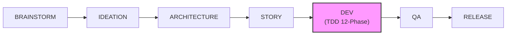
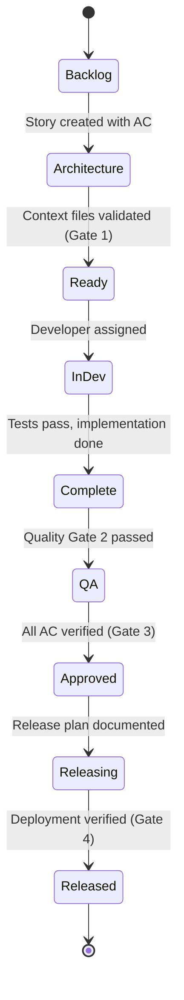
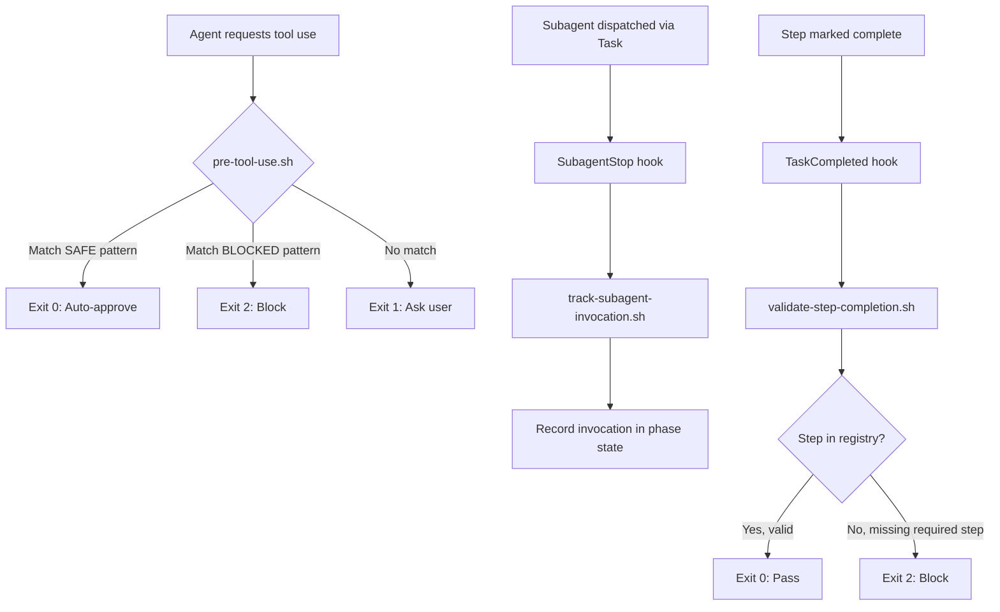
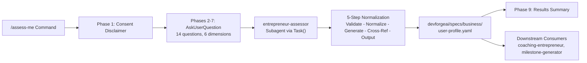
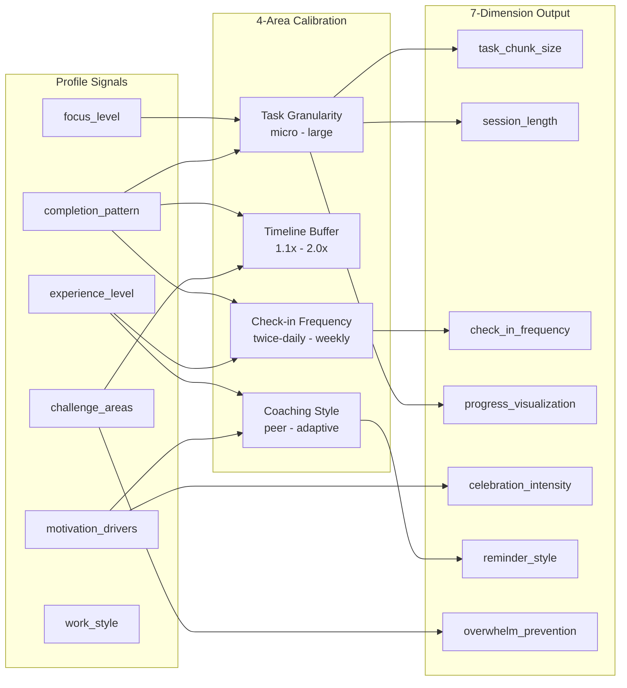
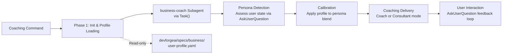
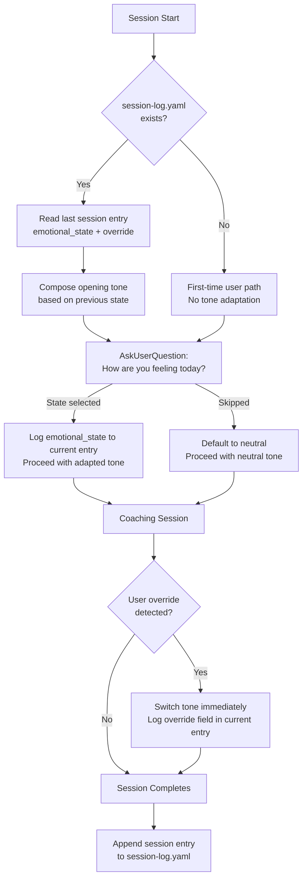

# DevForgeAI Architecture Documentation

**Version**: 1.0
**Date**: 2026-03-03
**Status**: Current

---

## Table of Contents

1. [System Overview](#system-overview)
2. [Component Architecture](#component-architecture)
3. [Workflow Architecture](#workflow-architecture)
4. [TDD Development Pipeline (12-Phase)](#tdd-development-pipeline-12-phase)
5. [Hook System (EPIC-086)](#hook-system-epic-086)
6. [Quality Gates](#quality-gates)
7. [Key Design Decisions](#key-design-decisions)

---

## System Overview

DevForgeAI is a **spec-driven meta-framework** for AI-assisted software development. It operates on a constitutional model: six immutable context files constrain all AI agent behavior, preventing technical debt by design rather than detection.

The framework is **technology-agnostic** -- it does not mandate any backend, frontend, or database technology. Instead, it provides the scaffolding for consistent, quality-gated development workflows using any stack the user selects.

(Source: devforgeai/specs/context/tech-stack.md, lines 7-9)

### Core Principles

- **Constitutional constraints**: 6 immutable context files define the law; agents must comply or HALT
- **Spec-driven development**: Every artifact traces to a specification (epic, story, acceptance criteria)
- **Zero technical debt by design**: Immutable specs, mandatory TDD, and strict quality gates prevent debt accumulation
- **Markdown-first**: All framework components are Markdown with YAML frontmatter, interpreted as natural language by AI agents
- **Framework-agnostic**: Works with any technology stack selected by the user

---

## Component Architecture

```mermaid
graph TB
    subgraph "Layer 3: User Interface"
        Commands["Slash Commands<br/>(User Workflows)"]
    end

    subgraph "Layer 2: Framework Implementation"
        Skills["26 Skills<br/>(Inline Prompt Expansions)"]
    end

    subgraph "Layer 1: Execution"
        Subagents["44 Subagents<br/>(Isolated Specialists)"]
    end

    subgraph "Constitution"
        Context["6 Immutable Context Files"]
    end

    subgraph "Infrastructure"
        CLI["devforgeai-validate CLI<br/>(Python)"]
        Hooks["Hook System<br/>(Shell Scripts)"]
        Registry["Phase Steps Registry<br/>(72 steps / 12 phases)"]
    end

    User((User)) -->|invokes| Commands
    Commands -->|delegates to| Skills
    Commands -->|dispatches| Subagents
    Skills -->|invokes| Skills
    Skills -->|dispatches via Task()| Subagents

    Skills -.->|reads| Context
    Subagents -.->|reads| Context
    Commands -.->|reads| Context

    Skills -->|validates via| CLI
    Hooks -->|enforces| Registry

    Subagents -.x|CANNOT invoke| Skills
    Skills -.x|CANNOT invoke| Commands
```

(Source: devforgeai/specs/context/architecture-constraints.md, lines 9-26)

### Orchestrator (opus)

The orchestrator is the top-level agent identity. It delegates all work to skills and subagents. Core responsibilities:

- Creates task lists for all work
- Provides context to subagents (they cannot see the full picture independently)
- HALTs on ambiguity and uses AskUserQuestion
- Never performs manual labor directly

### Skills (26 total)

Skills are **inline prompt expansions**, not background processes. When invoked via `Skill(command="...")`, the skill's SKILL.md content expands inline and the orchestrator executes its phases sequentially.

| Category | Skills |
|----------|--------|
| **Discovery** | discovering-requirements, brainstorming, assessing-entrepreneur |
| **Architecture** | designing-systems, devforgeai-orchestration |
| **Story Management** | devforgeai-story-creation, story-remediation, validating-epic-coverage |
| **Development** | implementing-stories (12-phase TDD) |
| **Quality** | devforgeai-qa, devforgeai-qa-remediation |
| **Release** | devforgeai-release |
| **Diagnostics** | root-cause-diagnosis, devforgeai-rca, devforgeai-feedback, devforgeai-insights |
| **Tooling** | claude-code-terminal-expert, skill-creator, devforgeai-subagent-creation, devforgeai-mcp-cli-converter |
| **Documentation** | devforgeai-documentation |
| **Other** | cross-ai-collaboration, devforgeai-github-actions, spec-driven-research, spec-driven-ui, spec-driven-w3-compliance |

Each skill follows the progressive disclosure pattern:
- `SKILL.md`: Core instructions (target 500-800 lines)
- `references/`: Deep documentation loaded on demand

(Source: devforgeai/specs/context/architecture-constraints.md, lines 28-46)

### Subagents (44 total)

Subagents are isolated, domain-specialized agents dispatched via `Task()`. They follow the principle of least privilege -- each receives only the tools needed for its domain.

| Domain | Subagents |
|--------|-----------|
| **Testing** | test-automator, integration-tester |
| **Architecture** | backend-architect, frontend-developer, api-designer, architect-reviewer |
| **Code Quality** | code-reviewer, code-analyzer, code-quality-auditor, refactoring-specialist, anti-pattern-scanner, dead-code-detector |
| **Compliance** | ac-compliance-verifier, context-validator, context-preservation-validator, pattern-compliance-auditor, alignment-auditor |
| **Analysis** | framework-analyst, diagnostic-analyst, coverage-analyzer, dependency-graph-analyzer, technical-debt-analyzer |
| **Validation** | deferral-validator, git-validator, file-overlap-detector, security-auditor |
| **Interpretation** | dev-result-interpreter, qa-result-interpreter, ideation-result-interpreter, epic-coverage-result-interpreter, observation-extractor |
| **Planning** | sprint-planner, requirements-analyst, stakeholder-analyst, story-requirements-analyst, entrepreneur-assessor |
| **Operations** | deployment-engineer, git-worktree-manager, documentation-writer, session-miner, agent-generator, tech-stack-detector, ui-spec-formatter, internet-sleuth |

**Key constraints:**
- Single responsibility per subagent
- No shared state between parallel subagents
- Designed for parallel invocation (4-6 recommended, 10 max concurrent)

(Source: devforgeai/specs/context/architecture-constraints.md, lines 48-65)

### Constitutional Context Files (6 immutable)

These files are **THE LAW**. They cannot be modified without an Architecture Decision Record (ADR).

| File | Purpose |
|------|---------|
| `tech-stack.md` | Locked technology decisions and tool constraints |
| `source-tree.md` | Canonical directory structure and file locations |
| `dependencies.md` | Approved dependency list |
| `coding-standards.md` | Code style and conventions |
| `architecture-constraints.md` | Three-layer architecture rules, design patterns |
| `anti-patterns.md` | Forbidden patterns with detection rules |

Location: `devforgeai/specs/context/`

(Source: devforgeai/specs/context/architecture-constraints.md, lines 83-101)

### CLI (devforgeai-validate)

Python CLI for phase state management and validation:

```bash
# Initialize phase state for a story
devforgeai-validate phase-init STORY-XXX

# Transition between phases
devforgeai-validate phase-check STORY-XXX --from=01 --to=02

# Mark phase complete
devforgeai-validate phase-complete STORY-XXX --phase=01 --checkpoint-passed

# Validate DoD format
devforgeai-validate validate-dod <story-file>
```

---

## Workflow Architecture



### Story Lifecycle States



### Workflow-to-Skill Mapping

| Workflow Phase | Primary Skill | Key Subagents |
|----------------|---------------|---------------|
| Brainstorm | brainstorming | internet-sleuth |
| Ideation | discovering-requirements | requirements-analyst, stakeholder-analyst |
| Architecture | designing-systems | architect-reviewer, tech-stack-detector |
| Story | devforgeai-story-creation | story-requirements-analyst |
| Dev | implementing-stories | test-automator, backend-architect, frontend-developer, code-reviewer, integration-tester |
| QA | devforgeai-qa | anti-pattern-scanner, coverage-analyzer, security-auditor |
| Release | devforgeai-release | deployment-engineer |

---

## TDD Development Pipeline (12-Phase)

The `implementing-stories` skill executes a strict 12-phase TDD pipeline. No phase can be skipped without explicit user authorization.

| Phase | Name | Key Steps | Gate |
|-------|------|-----------|------|
| 01 | Pre-Flight Validation | Load context files, validate story, init phase state | phase-init |
| 02 | Test-First (Red) | test-automator writes failing tests, verify RED state, create integrity snapshot | All tests fail |
| 03 | Implementation (Green) | backend-architect/frontend-developer implements, verify GREEN state | All tests pass |
| 04 | Refactoring | refactoring-specialist improves, code-reviewer validates, light QA | Coverage thresholds met |
| 04.5 | AC Compliance (Post-Refactor) | ac-compliance-verifier checks no AC regression | All ACs pass |
| 05 | Integration & Validation | integration-tester writes integration tests, coverage validation | Coverage 95/85/80% |
| 05.5 | AC Compliance (Post-Integration) | ac-compliance-verifier re-checks | All ACs pass |
| 06 | Deferral Challenge | deferral-validator reviews, user approval for each deferral | User consent |
| 07 | DoD Update | Mark story DoD items, validate format | DoD validator passes |
| 08 | Git Workflow | Stage files, commit with validation | Commit succeeds |
| 09 | Feedback Hook | Collect observations, framework-analyst analyzes | Report written |
| 10 | Result Interpretation | dev-result-interpreter produces final result | Status updated |

**Total registered steps: 72** (tracked in `.claude/hooks/phase-steps-registry.json`)

---

## Hook System (EPIC-086)

The hook system provides external enforcement of workflow discipline through shell scripts that intercept tool usage, track subagent invocations, and validate step completion.



### Hook Components

| Hook | Script | Trigger | Purpose |
|------|--------|---------|---------|
| **pre-tool-use** | `pre-tool-use.sh` | Before any Bash command | Auto-approve safe commands (63 patterns), block dangerous ones (6 patterns) |
| **SubagentStop** | `track-subagent-invocation.sh` | After subagent completes | Record which subagents were invoked per phase for audit |
| **TaskCompleted** | `validate-step-completion.sh` | After step completion claim | Validate step exists in registry, enforce required steps |
| **post-qa-***.sh** | Various | After QA pass/fail/warn | Automated post-QA actions (reports, notifications) |
| **post-edit-write-check** | `post-edit-write-check.sh` | After Edit/Write | Enforce file location constraints |

### Phase Steps Registry

The registry at `.claude/hooks/phase-steps-registry.json` defines 72 steps across 12 phases. Each step specifies:

```json
{
  "id": "03.2",
  "check": "backend-architect OR frontend-developer subagent invoked",
  "subagent": ["backend-architect", "frontend-developer"],
  "conditional": false
}
```

- **id**: Phase.Step identifier
- **check**: Human-readable description of what must happen
- **subagent**: Required subagent(s) or null for non-subagent steps
- **conditional**: Whether the step can be skipped based on context

### Exit Code Convention

| Code | Meaning | Behavior |
|------|---------|----------|
| 0 | Pass / No-op | Proceed normally |
| 1 | Warning | Log and continue (or ask user for pre-tool-use) |
| 2 | Block | HALT workflow, require fix |

---

## Quality Gates

Four sequential gates enforce quality at each lifecycle transition. Gates cannot be skipped.

| Gate | Transition | Enforced By | Requirements |
|------|-----------|-------------|--------------|
| **1. Context Validation** | Architecture -> Ready | devforgeai-orchestration | All 6 context files present, valid syntax, no conflicts |
| **2. Test Passing** | Dev Complete -> QA | devforgeai-qa | All tests pass (exit 0), coverage 95/85/80%, no Critical/High violations |
| **3. QA Approval** | QA -> Releasing | devforgeai-release | Story has "QA APPROVED", all AC verified, runtime smoke test passes |
| **4. Release Readiness** | Releasing -> Released | devforgeai-release | Smoke tests pass, deployment verified, rollback plan documented |

### Coverage Thresholds (Strict)

Coverage gaps are **CRITICAL blockers**, not warnings (per ADR-010):

| Layer | Threshold | Enforcement |
|-------|-----------|-------------|
| Business Logic | 95% | CRITICAL - blocks QA |
| Application | 85% | CRITICAL - blocks QA |
| Infrastructure | 80% | CRITICAL - blocks QA |

---

## Key Design Decisions

### Markdown-First

All framework components (skills, subagents, commands, context files, ADRs) use Markdown with YAML frontmatter. Claude interprets natural language better than structured formats, with documented 60-80% token savings through progressive disclosure.

(Source: devforgeai/specs/context/tech-stack.md, lines 29-46)

### Framework-Agnostic

DevForgeAI constrains its own implementation (Markdown, Git, Claude Code Terminal) but imposes no technology choices on projects. The `designing-systems` skill asks the user to select their stack and locks it in the project's own `tech-stack.md`.

(Source: devforgeai/specs/context/tech-stack.md, lines 7-9)

### TDD Mandatory

Tests are written before implementation (Red-Green-Refactor). This is enforced structurally: Phase 02 (Red) must complete before Phase 03 (Green) can begin. Test integrity snapshots detect any tampering with tests after the Red phase.

### Immutable Context Files

The 6 constitutional files cannot be edited directly. Changes require an ADR to be accepted first, then propagated via the `/create-context` workflow. This prevents ad-hoc constraint relaxation that leads to technical debt.

(Source: devforgeai/specs/context/architecture-constraints.md, lines 83-101)

### Three-Layer Dependency Rules

Strict directional dependencies prevent circular coupling:

- Commands -> Skills -> Subagents (allowed)
- Subagents -> Skills (forbidden)
- Skills -> Commands (forbidden)
- Circular dependencies (forbidden)

(Source: devforgeai/specs/context/architecture-constraints.md, lines 19-26)

### Parallel Execution Model

Subagents are stateless and isolated, enabling parallel dispatch (4-6 recommended, 10 max). No shared state between parallel tasks. Sequential execution is the fallback if parallel fails, with a 50% success threshold to continue.

(Source: devforgeai/specs/context/architecture-constraints.md, lines 155-186)

### Native Tools Over Bash

Framework mandates Claude Code native tools (Read, Write, Edit, Glob, Grep) over Bash equivalents, achieving 40-73% token savings. Bash is reserved for test execution, builds, git operations, and package management.

(Source: devforgeai/specs/context/tech-stack.md, lines 246-258)

---

## Directory Structure (Abridged)

```
DevForgeAI2/
+-- .claude/
|   +-- agents/           # 44 subagent definitions (.md)
|   +-- commands/          # Slash commands (.md)
|   +-- hooks/             # Shell hooks + phase-steps-registry.json
|   +-- memory/            # Runtime memory files
|   +-- skills/            # 26 skills (SKILL.md + references/)
|   +-- scripts/           # Python CLI (devforgeai-validate)
|   +-- settings.json      # Hook registration
+-- devforgeai/
|   +-- specs/
|   |   +-- context/       # 6 constitutional files (IMMUTABLE)
|   |   +-- adrs/          # Architecture Decision Records
|   |   +-- Stories/       # Story files (.story.md)
|   |   +-- Epics/         # Epic files
|   +-- workflows/         # Phase state JSON files
|   +-- feedback/          # AI analysis reports
+-- src/                   # Source implementations
+-- tests/                 # Test files (write-protected)
+-- docs/                  # Documentation output
```

(Source: devforgeai/specs/context/source-tree.md, lines 17-27)

---

<!-- SECTION: assessing-entrepreneur START -->
## Assessing Entrepreneur

The assessing-entrepreneur skill guides solo developers and aspiring entrepreneurs through a 6-dimension self-assessment questionnaire. It produces a structured `user-profile.yaml` consumed by downstream coaching and planning workflows.

**Story:** STORY-465 (Guided Self-Assessment Skill)
**Epic:** EPIC-072

### Components

| Component | Type | Path | Lines | Constraints |
|-----------|------|------|-------|-------------|
| `SKILL.md` | Skill (inline expansion) | `src/claude/skills/assessing-entrepreneur/SKILL.md` | ~196 | < 1000 lines |
| `entrepreneur-assessor.md` | Subagent | `src/claude/agents/entrepreneur-assessor.md` | ~128 | < 500 lines |
| `work-style-questionnaire.md` | Reference | `src/claude/skills/assessing-entrepreneur/references/` | ~270 | Loaded Phases 2-7 |
| `adhd-adaptation-framework.md` | Reference | `src/claude/skills/assessing-entrepreneur/references/` | ~95 | Loaded Phases 8-9 (conditional) |
| `confidence-assessment-workflow.md` | Reference | `src/claude/skills/assessing-entrepreneur/references/` | ~121 | Loaded Phases 8-9 (conditional) |
| `plan-calibration-engine.md` | Reference | `src/claude/skills/assessing-entrepreneur/references/` | ~132 | Loaded Phases 8-9 |

(Source: devforgeai/specs/Stories/archive/STORY-465-guided-self-assessment-skill.story.md, lines 393-406)

### Data Flow



### Assessment Dimensions

The questionnaire covers 6 dimensions with 14 total questions. All questions use AskUserQuestion with bounded options (2-7 choices per question). No free-text input.

| Dimension | Questions | Option Count | Multi-Select |
|-----------|-----------|-------------|--------------|
| Work Style | Q1.1 Daily Structure, Q1.2 Environment, Q1.3 Collaboration | 5, 5, 5 | No |
| Task Completion | Q2.1 Multi-Step Projects, Q2.2 Interruptions | 5, 5 | No |
| Motivation | Q3.1 Primary Drivers, Q3.2 Losing Motivation | 6, 6 | Yes |
| Energy Management | Q4.1 Peak Focus Time, Q4.2 Energy Recovery | 7, 6 | Q4.2: Yes |
| Previous Attempts | Q5.1 Experience Level, Q5.2 Lessons Learned | 5, 7 | Q5.2: Yes (conditional) |
| Self-Reported Challenges | Q6.1 Primary Challenges, Q6.2 Support Preferences | 8, 6 | Yes |

(Source: src/claude/skills/assessing-entrepreneur/references/work-style-questionnaire.md, lines 13-263)

### Profile Output Schema

The entrepreneur-assessor subagent writes a 7-dimension adaptive profile to `devforgeai/specs/business/user-profile.yaml`:

```yaml
adaptive_profile:
  task_chunk_size: micro | standard | extended     # 5-60 min per task
  session_length: short | medium | long            # 15-60 min per session
  check_in_frequency: frequent | moderate | minimal  # every 1-5 tasks
  progress_visualization: per_task | daily | weekly
  celebration_intensity: high | medium | low
  reminder_style: specific | balanced | gentle
  overwhelm_prevention: strict | moderate | open     # next-3-tasks-only to full-roadmap
```

(Source: src/claude/skills/assessing-entrepreneur/SKILL.md, lines 159-184)

### Calibration Pipeline

The plan-calibration-engine maps 6 profile signals through a 4-area intermediate calibration to the 7-dimension adaptive profile:



Cross-dimension adjustments apply after initial mapping: motivation drops with routine tasks combined with consistency challenges increase check-in frequency; failed previous attempts due to scope reduce task granularity by one level; variable energy patterns add flexibility buffers.

(Source: src/claude/skills/assessing-entrepreneur/references/plan-calibration-engine.md, lines 63-96)

### Subagent: entrepreneur-assessor

| Property | Value |
|----------|-------|
| **Tools** | Read, Glob, Grep, AskUserQuestion |
| **Responsibility** | Response normalization only (no plan generation) |
| **Input** | Raw responses from 6 dimensions |
| **Output** | `user-profile.yaml` (sole authorized writer) |
| **AskUserQuestion usage** | Clarify ambiguous or missing responses only |

The subagent processes responses through 5 steps:

1. **Validate** -- Ensure all 6 dimensions present; request missing via AskUserQuestion
2. **Normalize** -- Categorical responses to profile tags, multi-select to weighted lists
3. **Generate** -- Produce YAML profile with dimension-level adaptations
4. **Cross-reference** -- Identify reinforcing or contradicting patterns across dimensions
5. **Output** -- Write `user-profile.yaml` and return summary to the skill

(Source: src/claude/agents/entrepreneur-assessor.md, lines 37-109)

### Integration Points

| Direction | Component | Mechanism | Constraint |
|-----------|-----------|-----------|------------|
| **Invoked by** | `/assess-me` command | `Skill(command="assessing-entrepreneur")` | Thin orchestrator |
| **Invoked by** | Business coaching workflows | Direct skill invocation | Optional pre-coaching step |
| **Writes to** | `devforgeai/specs/business/user-profile.yaml` | entrepreneur-assessor subagent | BR-001: sole writer |
| **Read by** | coaching-entrepreneur skill | `Read()` -- read-only | Never modifies profile |
| **Read by** | Plan calibration, milestone generator | `Read()` -- read-only | Downstream consumers |

### Design Decisions

| Decision | Rationale |
|----------|-----------|
| Progressive disclosure (4 reference files) | Token efficiency; SKILL.md stays at 196 lines, deep content loaded on demand |
| Subagent for normalization | Single responsibility; SKILL.md orchestrates, entrepreneur-assessor transforms |
| AskUserQuestion for all input | Bounded options (2-7 per question) eliminate free-text parsing |
| 7-dimension enum profile | Discrete values consumable by any downstream workflow without parsing |
| Non-clinical framing | Ethical requirement; skill NEVER diagnoses mental health conditions |
| Gerund naming (`assessing-entrepreneur`) | Per ADR-017 skill naming convention |
| Sole writer rule (BR-001) | Prevents race conditions; entrepreneur-assessor is the only writer of `user-profile.yaml` |
<!-- SECTION: assessing-entrepreneur END -->

<!-- SECTION: coaching-entrepreneur START -->
## Coaching Entrepreneur

The coaching-entrepreneur skill provides adaptive business coaching through dynamic persona blending. It shifts between Coach mode (empathetic, supportive, celebration-focused) and Consultant mode (structured, deliverable-oriented, framework-driven) based on user emotional state and readiness level. The skill reads user adaptation profiles from STORY-466 to calibrate coaching intensity, task granularity, and communication style. It also reads the session log from STORY-468 to adapt its opening tone based on the user's self-reported emotional state from the previous session.

**Stories:** STORY-467 (Dynamic Persona Blend Engine), STORY-468 (Emotional State Tracking)
**Epic:** EPIC-072
**Depends on:** STORY-466 (Adaptive Profile Generation), STORY-467 (Dynamic Persona Blend Engine)

### Components

| Component | Type | Path | Lines | Constraints |
|-----------|------|------|-------|-------------|
| `SKILL.md` | Skill (inline expansion) | `src/claude/skills/coaching-entrepreneur/SKILL.md` | target ≤1000 | < 1000 lines |
| `business-coach.md` | Subagent | `src/claude/agents/business-coach.md` | target ≤500 | < 500 lines, Read/Grep/Glob/AskUserQuestion only |

(Source: devforgeai/specs/Stories/archive/STORY-467-dynamic-persona-blend-engine.story.md, lines 52-100)

### Data Flow


### Persona Architecture

| Dimension | Coach Mode | Consultant Mode |
|-----------|-----------|-----------------|
| **Language** | Empathetic, encouraging, personal | Professional, framework-driven, structured |
| **Celebration** | Celebrates every win, emphasizes effort | Acknowledges progress, focuses on outputs |
| **Self-Doubt** | Directly addresses confidence gaps | Reframes as problem-solving opportunities |
| **Trigger Conditions** | Low energy, early stage, first attempt | High focus, clear direction, experienced |

(Source: devforgeai/specs/Stories/archive/STORY-467-dynamic-persona-blend-engine.story.md, lines 72-75)

### Business Rules

| Rule | Constraint | Enforcement |
|------|-----------|-------------|
| **BR-001** | Coach mode uses empathetic language; Consultant mode uses structured language | Both personas defined with explicit language guides in SKILL.md |
| **BR-002** | Coaching skill reads user-profile.yaml but NEVER writes to it | No Write() calls; read-only Read() only |
| **BR-003** | Default to Coach mode if profile unavailable | Graceful fallback without profile |
| **BR-EST-001** | Emotional state is self-reported only — the AI never infers emotional state | AskUserQuestion used for all emotional state collection; no inference logic permitted |
| **BR-EST-002** | User overrides are respected immediately within the same session and logged for future reference | Override detected via AskUserQuestion response; tone switches without delay; override field written to session-log.yaml |

### Integration Points

| Direction | Component | Mechanism | Constraint |
|-----------|-----------|-----------|------------|
| **Invoked by** | Coaching commands | `Skill(command="coaching-entrepreneur")` | Thin orchestrator |
| **Reads from** | User profile | `Read("devforgeai/specs/business/user-profile.yaml")` | Optional (defaults gracefully) |
| **Reads from** | Session log | `Read("devforgeai/specs/business/coaching/session-log.yaml")` | Optional; absent on first session |
| **Writes to** | Session log | `Write("devforgeai/specs/business/coaching/session-log.yaml")` | Appends one entry per completed session |
| **Uses subagent** | business-coach | `Task(subagent_type="business-coach")` | Isolated coaching context |
| **Depends on** | STORY-466 profile | Profile creation via `/assess-me` command | Upstream dependency |
| **Depends on** | STORY-467 persona engine | Dynamic persona blend logic | Upstream dependency |

---

### Emotional State Tracking (STORY-468)

#### Session Log Data Model

**File path:** `devforgeai/specs/business/coaching/session-log.yaml`

```yaml
sessions:
  - date: "2026-03-01T10:14:00Z"
    emotional_state: frustrated
    override: null
  - date: "2026-03-03T09:02:00Z"
    emotional_state: energized
    override: "Actually feeling tired today, let's keep it light"
```

| Field | Type | Required | Enum / Notes |
|-------|------|----------|--------------|
| `sessions` | Array | Yes | One entry per completed session; chronological order |
| `sessions[].date` | DateTime | Yes | ISO 8601 UTC timestamp of session start |
| `sessions[].emotional_state` | String | Yes | `energized` \| `focused` \| `neutral` \| `tired` \| `frustrated` \| `anxious` \| `overwhelmed` |
| `sessions[].override` | String | No | Verbatim user override text; `null` when no override occurred |

#### Emotional State Check-in Flow



#### Tone Adaptation Examples

| Previous `emotional_state` | Opening Tone | Example Opening Line |
|---------------------------|--------------|----------------------|
| `energized` | Momentum-building | "You were on fire last time — ready to keep that momentum going?" |
| `focused` | Continuity | "Last session you were locked in. Let's build on that focus." |
| `neutral` | Standard | "Welcome back. Where would you like to pick up today?" |
| `tired` | Lighter, supportive | "Last session you were running low. No pressure today." |
| `frustrated` | Lighter, empathetic | "Last session felt tough. Let's start somewhere achievable." |
| `anxious` | Grounding, reassuring | "Things felt uncertain last time. Let's slow down and find solid ground." |
| `overwhelmed` | Minimal, one thing only | "Last session was a lot. Today we find one thing and only one thing." |

#### Design Decisions (STORY-468)

| Decision | Rationale |
|----------|-----------|
| Self-reported state only | AI inference of emotional/mental state raises ethical concerns; explicit reporting preserves user trust |
| Bounded enum over free text | Seven discrete states produce consistent tone mappings |
| Default to `neutral` on skip | Graceful degradation; avoids forcing disclosure |
| Override logged verbatim | Preserves user's exact words for future sessions |
| File persistence over memory | YAML file survives context window clears and Claude Code restarts (NFR-001) |
| Append-only session entries | Historical record enables future trend awareness without rewriting past data |

---

### Design Decisions (Skill-Wide)

| Decision | Rationale |
|----------|-----------|
| Two distinct personas | Some users need encouragement (Coach); others need structure (Consultant); adaptive blend serves both |
| Subagent for detection | Business logic isolated from SKILL.md orchestration; single responsibility |
| Profile read-only in coaching | Assessment skill is sole writer (BR-001); prevents data coordination bugs |
| Graceful fallback if profile missing | New users can start coaching before assessment; Coach mode is safer default |
| AskUserQuestion for all input | Bounded options eliminate free-text parsing; aligns with assessing-entrepreneur pattern |
| Session log written by coaching skill | Assessment skill owns user-profile.yaml; coaching skill owns session-log.yaml — clear write ownership per file |
<!-- SECTION: coaching-entrepreneur END -->

---

## References

- **Tech Stack**: `devforgeai/specs/context/tech-stack.md`
- **Architecture Constraints**: `devforgeai/specs/context/architecture-constraints.md`
- **Source Tree**: `devforgeai/specs/context/source-tree.md`
- **Phase Steps Registry**: `.claude/hooks/phase-steps-registry.json`
- **Hook README**: `.claude/hooks/README.md`
- **Quality Gates**: `.claude/rules/core/quality-gates.md`
- **Story Lifecycle**: `.claude/rules/workflow/story-lifecycle.md`
- **TDD Workflow**: `.claude/rules/workflow/tdd-workflow.md`
