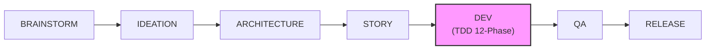
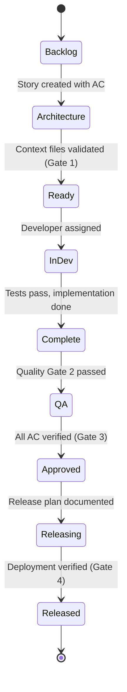
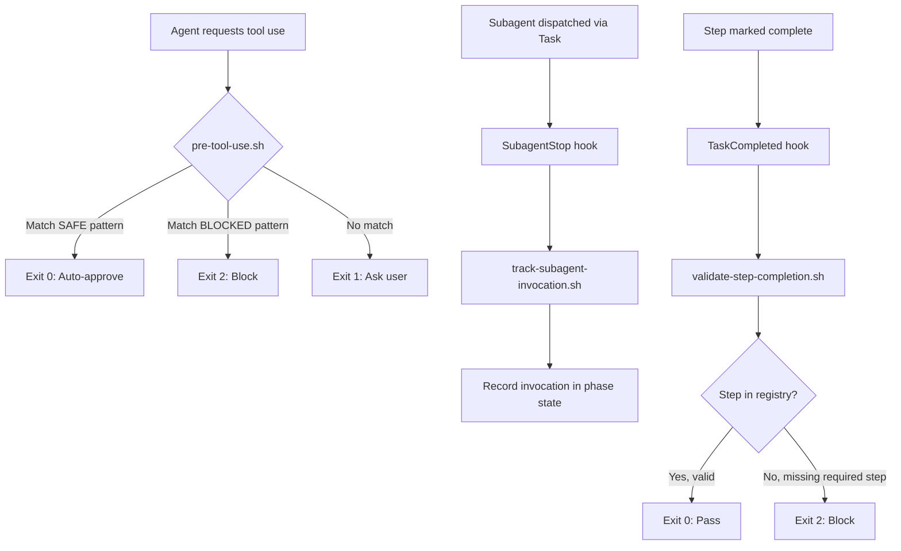

# DevForgeAI Architecture Documentation

**Version**: 1.0
**Date**: 2026-03-03
**Status**: Current

---

## Table of Contents

1. [System Overview](#system-overview)
2. [Component Architecture](#component-architecture)
3. [Workflow Architecture](#workflow-architecture)
4. [TDD Development Pipeline (12-Phase)](#tdd-development-pipeline-12-phase)
5. [Hook System (EPIC-086)](#hook-system-epic-086)
6. [Quality Gates](#quality-gates)
7. [Key Design Decisions](#key-design-decisions)

---

## System Overview

DevForgeAI is a **spec-driven meta-framework** for AI-assisted software development. It operates on a constitutional model: six immutable context files constrain all AI agent behavior, preventing technical debt by design rather than detection.

The framework is **technology-agnostic** -- it does not mandate any backend, frontend, or database technology. Instead, it provides the scaffolding for consistent, quality-gated development workflows using any stack the user selects.

(Source: devforgeai/specs/context/tech-stack.md, lines 7-9)

### Core Principles

- **Constitutional constraints**: 6 immutable context files define the law; agents must comply or HALT
- **Spec-driven development**: Every artifact traces to a specification (epic, story, acceptance criteria)
- **Zero technical debt by design**: Immutable specs, mandatory TDD, and strict quality gates prevent debt accumulation
- **Markdown-first**: All framework components are Markdown with YAML frontmatter, interpreted as natural language by AI agents
- **Framework-agnostic**: Works with any technology stack selected by the user

---

## Component Architecture

```mermaid
graph TB
    subgraph "Layer 3: User Interface"
        Commands["Slash Commands<br/>(User Workflows)"]
    end

    subgraph "Layer 2: Framework Implementation"
        Skills["26 Skills<br/>(Inline Prompt Expansions)"]
    end

    subgraph "Layer 1: Execution"
        Subagents["44 Subagents<br/>(Isolated Specialists)"]
    end

    subgraph "Constitution"
        Context["6 Immutable Context Files"]
    end

    subgraph "Infrastructure"
        CLI["devforgeai-validate CLI<br/>(Python)"]
        Hooks["Hook System<br/>(Shell Scripts)"]
        Registry["Phase Steps Registry<br/>(72 steps / 12 phases)"]
    end

    User((User)) -->|invokes| Commands
    Commands -->|delegates to| Skills
    Commands -->|dispatches| Subagents
    Skills -->|invokes| Skills
    Skills -->|dispatches via Task()| Subagents

    Skills -.->|reads| Context
    Subagents -.->|reads| Context
    Commands -.->|reads| Context

    Skills -->|validates via| CLI
    Hooks -->|enforces| Registry

    Subagents -.x|CANNOT invoke| Skills
    Skills -.x|CANNOT invoke| Commands
```

(Source: devforgeai/specs/context/architecture-constraints.md, lines 9-26)

### Orchestrator (opus)

The orchestrator is the top-level agent identity. It delegates all work to skills and subagents. Core responsibilities:

- Creates task lists for all work
- Provides context to subagents (they cannot see the full picture independently)
- HALTs on ambiguity and uses AskUserQuestion
- Never performs manual labor directly

### Skills (26 total)

Skills are **inline prompt expansions**, not background processes. When invoked via `Skill(command="...")`, the skill's SKILL.md content expands inline and the orchestrator executes its phases sequentially.

| Category | Skills |
|----------|--------|
| **Discovery** | discovering-requirements, brainstorming, assessing-entrepreneur |
| **Architecture** | designing-systems, devforgeai-orchestration |
| **Story Management** | devforgeai-story-creation, story-remediation, validating-epic-coverage |
| **Development** | implementing-stories (12-phase TDD) |
| **Quality** | devforgeai-qa, devforgeai-qa-remediation |
| **Release** | devforgeai-release |
| **Diagnostics** | root-cause-diagnosis, devforgeai-rca, devforgeai-feedback, devforgeai-insights |
| **Tooling** | claude-code-terminal-expert, skill-creator, devforgeai-subagent-creation, devforgeai-mcp-cli-converter |
| **Documentation** | devforgeai-documentation |
| **Other** | cross-ai-collaboration, devforgeai-github-actions, devforgeai-research, devforgeai-ui-generator, auditing-w3-compliance |

Each skill follows the progressive disclosure pattern:
- `SKILL.md`: Core instructions (target 500-800 lines)
- `references/`: Deep documentation loaded on demand

(Source: devforgeai/specs/context/architecture-constraints.md, lines 28-46)

### Subagents (44 total)

Subagents are isolated, domain-specialized agents dispatched via `Task()`. They follow the principle of least privilege -- each receives only the tools needed for its domain.

| Domain | Subagents |
|--------|-----------|
| **Testing** | test-automator, integration-tester |
| **Architecture** | backend-architect, frontend-developer, api-designer, architect-reviewer |
| **Code Quality** | code-reviewer, code-analyzer, code-quality-auditor, refactoring-specialist, anti-pattern-scanner, dead-code-detector |
| **Compliance** | ac-compliance-verifier, context-validator, context-preservation-validator, pattern-compliance-auditor, alignment-auditor |
| **Analysis** | framework-analyst, diagnostic-analyst, coverage-analyzer, dependency-graph-analyzer, technical-debt-analyzer |
| **Validation** | deferral-validator, git-validator, file-overlap-detector, security-auditor |
| **Interpretation** | dev-result-interpreter, qa-result-interpreter, ideation-result-interpreter, epic-coverage-result-interpreter, observation-extractor |
| **Planning** | sprint-planner, requirements-analyst, stakeholder-analyst, story-requirements-analyst, entrepreneur-assessor |
| **Operations** | deployment-engineer, git-worktree-manager, documentation-writer, session-miner, agent-generator, tech-stack-detector, ui-spec-formatter, internet-sleuth |

**Key constraints:**
- Single responsibility per subagent
- No shared state between parallel subagents
- Designed for parallel invocation (4-6 recommended, 10 max concurrent)

(Source: devforgeai/specs/context/architecture-constraints.md, lines 48-65)

### Constitutional Context Files (6 immutable)

These files are **THE LAW**. They cannot be modified without an Architecture Decision Record (ADR).

| File | Purpose |
|------|---------|
| `tech-stack.md` | Locked technology decisions and tool constraints |
| `source-tree.md` | Canonical directory structure and file locations |
| `dependencies.md` | Approved dependency list |
| `coding-standards.md` | Code style and conventions |
| `architecture-constraints.md` | Three-layer architecture rules, design patterns |
| `anti-patterns.md` | Forbidden patterns with detection rules |

Location: `devforgeai/specs/context/`

(Source: devforgeai/specs/context/architecture-constraints.md, lines 83-101)

### CLI (devforgeai-validate)

Python CLI for phase state management and validation:

```bash
# Initialize phase state for a story
devforgeai-validate phase-init STORY-XXX

# Transition between phases
devforgeai-validate phase-check STORY-XXX --from=01 --to=02

# Mark phase complete
devforgeai-validate phase-complete STORY-XXX --phase=01 --checkpoint-passed

# Validate DoD format
devforgeai-validate validate-dod <story-file>
```

---

## Workflow Architecture



### Story Lifecycle States



### Workflow-to-Skill Mapping

| Workflow Phase | Primary Skill | Key Subagents |
|----------------|---------------|---------------|
| Brainstorm | brainstorming | internet-sleuth |
| Ideation | discovering-requirements | requirements-analyst, stakeholder-analyst |
| Architecture | designing-systems | architect-reviewer, tech-stack-detector |
| Story | devforgeai-story-creation | story-requirements-analyst |
| Dev | implementing-stories | test-automator, backend-architect, frontend-developer, code-reviewer, integration-tester |
| QA | devforgeai-qa | anti-pattern-scanner, coverage-analyzer, security-auditor |
| Release | devforgeai-release | deployment-engineer |

---

## TDD Development Pipeline (12-Phase)

The `implementing-stories` skill executes a strict 12-phase TDD pipeline. No phase can be skipped without explicit user authorization.

| Phase | Name | Key Steps | Gate |
|-------|------|-----------|------|
| 01 | Pre-Flight Validation | Load context files, validate story, init phase state | phase-init |
| 02 | Test-First (Red) | test-automator writes failing tests, verify RED state, create integrity snapshot | All tests fail |
| 03 | Implementation (Green) | backend-architect/frontend-developer implements, verify GREEN state | All tests pass |
| 04 | Refactoring | refactoring-specialist improves, code-reviewer validates, light QA | Coverage thresholds met |
| 04.5 | AC Compliance (Post-Refactor) | ac-compliance-verifier checks no AC regression | All ACs pass |
| 05 | Integration & Validation | integration-tester writes integration tests, coverage validation | Coverage 95/85/80% |
| 05.5 | AC Compliance (Post-Integration) | ac-compliance-verifier re-checks | All ACs pass |
| 06 | Deferral Challenge | deferral-validator reviews, user approval for each deferral | User consent |
| 07 | DoD Update | Mark story DoD items, validate format | DoD validator passes |
| 08 | Git Workflow | Stage files, commit with validation | Commit succeeds |
| 09 | Feedback Hook | Collect observations, framework-analyst analyzes | Report written |
| 10 | Result Interpretation | dev-result-interpreter produces final result | Status updated |

**Total registered steps: 72** (tracked in `.claude/hooks/phase-steps-registry.json`)

---

## Hook System (EPIC-086)

The hook system provides external enforcement of workflow discipline through shell scripts that intercept tool usage, track subagent invocations, and validate step completion.



### Hook Components

| Hook | Script | Trigger | Purpose |
|------|--------|---------|---------|
| **pre-tool-use** | `pre-tool-use.sh` | Before any Bash command | Auto-approve safe commands (63 patterns), block dangerous ones (6 patterns) |
| **SubagentStop** | `track-subagent-invocation.sh` | After subagent completes | Record which subagents were invoked per phase for audit |
| **TaskCompleted** | `validate-step-completion.sh` | After step completion claim | Validate step exists in registry, enforce required steps |
| **post-qa-***.sh** | Various | After QA pass/fail/warn | Automated post-QA actions (reports, notifications) |
| **post-edit-write-check** | `post-edit-write-check.sh` | After Edit/Write | Enforce file location constraints |

### Phase Steps Registry

The registry at `.claude/hooks/phase-steps-registry.json` defines 72 steps across 12 phases. Each step specifies:

```json
{
  "id": "03.2",
  "check": "backend-architect OR frontend-developer subagent invoked",
  "subagent": ["backend-architect", "frontend-developer"],
  "conditional": false
}
```

- **id**: Phase.Step identifier
- **check**: Human-readable description of what must happen
- **subagent**: Required subagent(s) or null for non-subagent steps
- **conditional**: Whether the step can be skipped based on context

### Exit Code Convention

| Code | Meaning | Behavior |
|------|---------|----------|
| 0 | Pass / No-op | Proceed normally |
| 1 | Warning | Log and continue (or ask user for pre-tool-use) |
| 2 | Block | HALT workflow, require fix |

---

## Quality Gates

Four sequential gates enforce quality at each lifecycle transition. Gates cannot be skipped.

| Gate | Transition | Enforced By | Requirements |
|------|-----------|-------------|--------------|
| **1. Context Validation** | Architecture -> Ready | devforgeai-orchestration | All 6 context files present, valid syntax, no conflicts |
| **2. Test Passing** | Dev Complete -> QA | devforgeai-qa | All tests pass (exit 0), coverage 95/85/80%, no Critical/High violations |
| **3. QA Approval** | QA -> Releasing | devforgeai-release | Story has "QA APPROVED", all AC verified, runtime smoke test passes |
| **4. Release Readiness** | Releasing -> Released | devforgeai-release | Smoke tests pass, deployment verified, rollback plan documented |

### Coverage Thresholds (Strict)

Coverage gaps are **CRITICAL blockers**, not warnings (per ADR-010):

| Layer | Threshold | Enforcement |
|-------|-----------|-------------|
| Business Logic | 95% | CRITICAL - blocks QA |
| Application | 85% | CRITICAL - blocks QA |
| Infrastructure | 80% | CRITICAL - blocks QA |

---

## Key Design Decisions

### Markdown-First

All framework components (skills, subagents, commands, context files, ADRs) use Markdown with YAML frontmatter. Claude interprets natural language better than structured formats, with documented 60-80% token savings through progressive disclosure.

(Source: devforgeai/specs/context/tech-stack.md, lines 29-46)

### Framework-Agnostic

DevForgeAI constrains its own implementation (Markdown, Git, Claude Code Terminal) but imposes no technology choices on projects. The `designing-systems` skill asks the user to select their stack and locks it in the project's own `tech-stack.md`.

(Source: devforgeai/specs/context/tech-stack.md, lines 7-9)

### TDD Mandatory

Tests are written before implementation (Red-Green-Refactor). This is enforced structurally: Phase 02 (Red) must complete before Phase 03 (Green) can begin. Test integrity snapshots detect any tampering with tests after the Red phase.

### Immutable Context Files

The 6 constitutional files cannot be edited directly. Changes require an ADR to be accepted first, then propagated via the `/create-context` workflow. This prevents ad-hoc constraint relaxation that leads to technical debt.

(Source: devforgeai/specs/context/architecture-constraints.md, lines 83-101)

### Three-Layer Dependency Rules

Strict directional dependencies prevent circular coupling:

- Commands -> Skills -> Subagents (allowed)
- Subagents -> Skills (forbidden)
- Skills -> Commands (forbidden)
- Circular dependencies (forbidden)

(Source: devforgeai/specs/context/architecture-constraints.md, lines 19-26)

### Parallel Execution Model

Subagents are stateless and isolated, enabling parallel dispatch (4-6 recommended, 10 max). No shared state between parallel tasks. Sequential execution is the fallback if parallel fails, with a 50% success threshold to continue.

(Source: devforgeai/specs/context/architecture-constraints.md, lines 155-186)

### Native Tools Over Bash

Framework mandates Claude Code native tools (Read, Write, Edit, Glob, Grep) over Bash equivalents, achieving 40-73% token savings. Bash is reserved for test execution, builds, git operations, and package management.

(Source: devforgeai/specs/context/tech-stack.md, lines 246-258)

---

## Directory Structure (Abridged)

```
DevForgeAI2/
+-- .claude/
|   +-- agents/           # 44 subagent definitions (.md)
|   +-- commands/          # Slash commands (.md)
|   +-- hooks/             # Shell hooks + phase-steps-registry.json
|   +-- memory/            # Runtime memory files
|   +-- skills/            # 26 skills (SKILL.md + references/)
|   +-- scripts/           # Python CLI (devforgeai-validate)
|   +-- settings.json      # Hook registration
+-- devforgeai/
|   +-- specs/
|   |   +-- context/       # 6 constitutional files (IMMUTABLE)
|   |   +-- adrs/          # Architecture Decision Records
|   |   +-- Stories/       # Story files (.story.md)
|   |   +-- Epics/         # Epic files
|   +-- workflows/         # Phase state JSON files
|   +-- feedback/          # AI analysis reports
+-- src/                   # Source implementations
+-- tests/                 # Test files (write-protected)
+-- docs/                  # Documentation output
```

(Source: devforgeai/specs/context/source-tree.md, lines 17-27)

---

## References

- **Tech Stack**: `devforgeai/specs/context/tech-stack.md`
- **Architecture Constraints**: `devforgeai/specs/context/architecture-constraints.md`
- **Source Tree**: `devforgeai/specs/context/source-tree.md`
- **Phase Steps Registry**: `.claude/hooks/phase-steps-registry.json`
- **Hook README**: `.claude/hooks/README.md`
- **Quality Gates**: `.claude/rules/core/quality-gates.md`
- **Story Lifecycle**: `.claude/rules/workflow/story-lifecycle.md`
- **TDD Workflow**: `.claude/rules/workflow/tdd-workflow.md`
