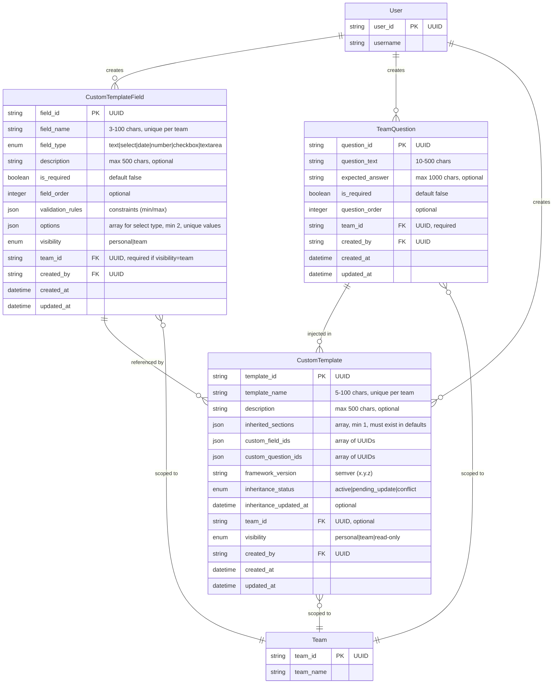

# Data Model Documentation - Template Customization

**Story:** STORY-012 - Template Customization
**Implementation:** src/template_customization.py (lines 80-179)
**Test Coverage:** 65/65 tests passing

---

## Entity-Relationship Diagram



---

## Data Models (Evidence-Based)

### CustomTemplateField

**Implementation:** src/template_customization.py (lines 80-113)
**Purpose:** Defines custom fields that extend story templates

**Properties (from actual @dataclass):**

| Property | Type | Constraints | Default | Description |
|----------|------|-------------|---------|-------------|
| field_id | str | UUID format | (required) | Primary key |
| field_name | str | 3-100 chars, unique per team | (required) | Field display name |
| field_type | FieldType | enum: text\|select\|date\|number\|checkbox\|textarea | (required) | Data type (immutable) |
| description | Optional[str] | max 500 chars | None | Optional description |
| is_required | bool | - | False | Whether field required in story |
| field_order | Optional[int] | - | None | Display order |
| validation_rules | Dict[str, Any] | Valid JSON | {} | Constraints (min/max) |
| options | List[Dict[str, str]] | Min 2 for select, unique | [] | Select field options |
| visibility | Visibility | personal\|team | TEAM | Visibility scope |
| team_id | Optional[str] | UUID, required if visibility=team | None | Team scope |
| created_by | str | UUID | (required) | Creator user ID |
| created_at | str | ISO 8601 datetime | (required) | Creation timestamp |
| updated_at | str | ISO 8601 datetime | (required) | Last update timestamp |

**Constraints (from validation rules):**
- VR1: field_name must be 3-100 chars, unique per team
- VR2: field_type must be valid FieldType enum
- VR3: options required for select (min 2, unique values)
- VR5: visibility must be Visibility enum
- VR6: team_id required if visibility=team

**Business Rules:**
- BR1: Field names unique within team/personal scope
- BR2: Field type immutable after creation

**Test Coverage:**
- tests/test_template_customization.py::TestCustomFieldCreation (9 tests) ✅
- tests/test_template_customization.py::TestCustomFieldUpdate (3 tests) ✅
- tests/test_template_customization.py::TestCustomFieldDeletion (2 tests) ✅

---

### TeamQuestion

**Implementation:** src/template_customization.py (lines 116-141)
**Purpose:** Defines team-specific questions for story workflows

**Properties (from actual @dataclass):**

| Property | Type | Constraints | Default | Description |
|----------|------|-------------|---------|-------------|
| question_id | str | UUID format | (required) | Primary key |
| question_text | str | 10-500 chars | (required) | Question displayed to user |
| expected_answer | Optional[str] | max 1000 chars | None | Optional guidance |
| is_required | bool | - | False | Whether answer required |
| question_order | int | - | 0 | Order within custom questions |
| team_id | str | UUID | (required) | Team this question belongs to |
| created_by | str | UUID | (required) | Creator user ID |
| created_at | str | ISO 8601 datetime | (required) | Creation timestamp |
| updated_at | str | ISO 8601 datetime | (required) | Last update timestamp |

**Constraints (from validation rules):**
- VR7: question_text must be 10-500 chars

**Business Rules:**
- BR8: Custom questions appear AFTER framework questions

**Test Coverage:**
- tests/test_template_customization.py::TestTeamQuestionCreation (3 tests) ✅
- tests/test_template_customization.py::TestTeamQuestionOrdering (1 test) ✅
- tests/test_template_customization.py::TestTeamQuestionWorkflow (1 test) ✅

---

### CustomTemplate

**Implementation:** src/template_customization.py (lines 144-179)
**Purpose:** Defines custom story templates with inheritance from framework defaults

**Properties (from actual @dataclass):**

| Property | Type | Constraints | Default | Description |
|----------|------|-------------|---------|-------------|
| template_id | str | UUID format | (required) | Primary key |
| template_name | str | 5-100 chars, unique per team | (required) | Template display name |
| description | Optional[str] | max 500 chars | None | Optional description |
| inherited_sections | List[str] | Min 1, must exist in defaults | [] | Framework sections inherited |
| custom_field_ids | List[str] | Array of UUIDs | [] | Custom fields in template |
| custom_question_ids | List[str] | Array of UUIDs | [] | Team questions injected |
| framework_version | str | Semver format (x.y.z) | "1.0.0" | Framework version |
| inheritance_status | str | active\|pending_update\|conflict | "active" | Inheritance state |
| inheritance_updated_at | Optional[str] | ISO 8601 datetime | None | Last inheritance update |
| team_id | Optional[str] | UUID | None | Team scope (null=personal) |
| visibility | Visibility | personal\|team\|read-only | TEAM | Visibility scope |
| created_by | str | UUID | (required) | Creator user ID |
| created_at | str | ISO 8601 datetime | (required) | Creation timestamp |
| updated_at | str | ISO 8601 datetime | (required) | Last update timestamp |

**Constraints (from validation rules):**
- VR8: template_name must be 5-100 chars, unique per team
- VR9: inherited_sections min 1, all must exist in framework defaults
- VR10: framework_version must be valid semver

**Business Rules:**
- BR4: Core framework sections always inherited (cannot remove)
- BR5: Framework upgrades auto-update inherited sections
- BR6: Team visibility = accessible to all members, modifiable by creator/admins only
- BR7: Shared templates read-only for team, copyable to personal
- BR9: Custom values stored in story YAML frontmatter
- BR10: Stories valid even if template deleted later

**Test Coverage:**
- tests/test_template_customization.py::TestTemplateInheritance (5 tests) ✅
- tests/test_template_customization.py::TestCustomTemplateSharing (11 tests) ✅
- tests/test_template_customization.py::TestDataPersistence (4 tests) ✅

---

## Relationships

### CustomTemplateField ↔ CustomTemplate

**Relationship:** Many-to-Many (via custom_field_ids array)
**Implementation:** CustomTemplate.custom_field_ids contains list of field_id UUIDs

**Example:**
```python
template = CustomTemplate(
    template_id="t1",
    template_name="Backend Story",
    custom_field_ids=["field-1", "field-2", "field-3"]  # References 3 fields
)
```

**Test Coverage:** tests/test_template_customization.py::TestTemplateInheritance::test_should_add_custom_fields_as_new_sections (passing ✅)

---

### TeamQuestion ↔ CustomTemplate

**Relationship:** Many-to-Many (via custom_question_ids array)
**Implementation:** CustomTemplate.custom_question_ids contains list of question_id UUIDs

**Example:**
```python
template = CustomTemplate(
    template_id="t1",
    template_name="Backend Story",
    custom_question_ids=["q1", "q2"]  # Injects 2 questions
)
```

**Test Coverage:** tests/test_template_customization.py::TestTeamQuestionWorkflow::test_team_questions_appear_in_story_creation (passing ✅)

---

### Entity ↔ Team

**Relationship:** Many-to-One (optional)
- CustomTemplateField.team_id → Team (if visibility=team)
- TeamQuestion.team_id → Team (always required)
- CustomTemplate.team_id → Team (if visibility=team)

**Implementation:**
- CustomTemplateField.team_id (line 92)
- TeamQuestion.team_id (line 124)
- CustomTemplate.team_id (line 156)

**Scoping Rules:**
- visibility="personal" → team_id=null (user-specific)
- visibility="team" → team_id=required (team-wide)

**Test Coverage:** tests/test_template_customization.py::TestDataValidationRules::test_team_id_required_for_team_visibility (passing ✅)

---

### Entity ↔ User

**Relationship:** Many-to-One
- All entities have `created_by` field referencing User ID
- Determines creator permissions

**Implementation:**
- CustomTemplateField.created_by (line 93)
- TeamQuestion.created_by (line 125)
- CustomTemplate.created_by (line 158)

**Permission Rules (from tests):**
- Creator can modify their own entities
- Non-creators have read-only access to team-shared entities

**Test Coverage:** tests/test_template_customization.py::TestCustomTemplateSharing::test_creator_can_modify_shared_template (passing ✅)

---

## Field Type Enum

**Implementation:** src/template_customization.py::FieldType (lines 24-31)

```python
class FieldType(str, Enum):
    """Valid field types."""
    TEXT = "text"
    SELECT = "select"
    DATE = "date"
    NUMBER = "number"
    CHECKBOX = "checkbox"
    TEXTAREA = "textarea"
```

**Usage:** Enforced in VR2 validation rule
**Test Coverage:** tests/test_template_customization.py::TestDataValidationRules::test_field_type_must_be_valid_enum (passing ✅)

---

## Visibility Enum

**Implementation:** src/template_customization.py::Visibility (lines 34-37)

```python
class Visibility(str, Enum):
    """Visibility scope for custom fields and templates."""
    PERSONAL = "personal"
    TEAM = "team"
```

**Usage:** Controls whether entity is user-specific or team-wide
**Test Coverage:** tests/test_template_customization.py::TestDataValidationRules::test_visibility_must_be_valid_enum (passing ✅)

---

## Inheritance Status Enum

**Implementation:** src/template_customization.py::TemplateInheritanceStatus (lines 40-44)

```python
class TemplateInheritanceStatus(str, Enum):
    """Template inheritance status."""
    ACTIVE = "active"
    PENDING_UPDATE = "pending_update"
    CONFLICT = "conflict"
```

**States:**
- **active:** Template inheritance current with framework version
- **pending_update:** Framework upgrade detected, update pending
- **conflict:** Framework upgrade conflicts with custom fields

**Test Coverage:** tests/test_template_customization.py::TestDataPersistence (4 tests covering version handling) ✅

---

## Storage Implementation

### In-Memory Storage Structure

**Implementation:** src/template_customization.py::_TemplateStorage (lines 182-198)

```python
class _TemplateStorage:
    """In-memory storage for template entities."""
    def __init__(self):
        self.fields: Dict[str, CustomTemplateField] = {}
        self.questions: Dict[str, TeamQuestion] = {}
        self.templates: Dict[str, CustomTemplate] = {}
        self.team_questions: Dict[str, List[str]] = {}  # team_id → question_ids
        self.field_usage: Dict[str, int] = {}  # field_id → usage count
```

**Purpose:** In-memory storage for testing (production would use PostgreSQL or equivalent)

---

## Database Schema (Production)

### Table: custom_template_fields

```sql
CREATE TABLE custom_template_fields (
    field_id UUID PRIMARY KEY DEFAULT gen_random_uuid(),
    field_name VARCHAR(100) NOT NULL,
    field_type VARCHAR(20) NOT NULL CHECK (field_type IN ('text', 'select', 'date', 'number', 'checkbox', 'textarea')),
    description VARCHAR(500),
    is_required BOOLEAN DEFAULT FALSE,
    field_order INTEGER,
    validation_rules JSONB,
    options JSONB,  -- Array of {value, label} objects
    visibility VARCHAR(20) NOT NULL CHECK (visibility IN ('personal', 'team')),
    team_id UUID REFERENCES teams(team_id),
    created_by UUID NOT NULL REFERENCES users(user_id),
    created_at TIMESTAMP DEFAULT CURRENT_TIMESTAMP,
    updated_at TIMESTAMP DEFAULT CURRENT_TIMESTAMP,

    -- BR1: Field name unique per team/personal scope
    CONSTRAINT unique_field_name_per_team UNIQUE (field_name, team_id),

    -- VR6: Team ID required if visibility=team
    CONSTRAINT team_id_required_for_team_visibility
        CHECK ((visibility = 'team' AND team_id IS NOT NULL) OR visibility = 'personal')
);

-- BR2: Prevent field type changes
CREATE OR REPLACE FUNCTION prevent_field_type_change()
RETURNS TRIGGER AS $$
BEGIN
    IF OLD.field_type != NEW.field_type THEN
        RAISE EXCEPTION 'Field type cannot be changed after creation';
    END IF;
    RETURN NEW;
END;
$$ LANGUAGE plpgsql;

CREATE TRIGGER field_type_immutable
    BEFORE UPDATE ON custom_template_fields
    FOR EACH ROW
    EXECUTE FUNCTION prevent_field_type_change();
```

**Indexes:**
```sql
CREATE INDEX idx_custom_fields_team ON custom_template_fields(team_id);
CREATE INDEX idx_custom_fields_visibility ON custom_template_fields(visibility);
CREATE INDEX idx_custom_fields_created_by ON custom_template_fields(created_by);
```

---

### Table: team_questions

```sql
CREATE TABLE team_questions (
    question_id UUID PRIMARY KEY DEFAULT gen_random_uuid(),
    question_text VARCHAR(500) NOT NULL CHECK (LENGTH(question_text) >= 10),
    expected_answer VARCHAR(1000),
    is_required BOOLEAN DEFAULT FALSE,
    question_order INTEGER DEFAULT 0,
    team_id UUID NOT NULL REFERENCES teams(team_id),
    created_by UUID NOT NULL REFERENCES users(user_id),
    created_at TIMESTAMP DEFAULT CURRENT_TIMESTAMP,
    updated_at TIMESTAMP DEFAULT CURRENT_TIMESTAMP
);

CREATE INDEX idx_team_questions_team ON team_questions(team_id);
CREATE INDEX idx_team_questions_order ON team_questions(team_id, question_order);
```

---

### Table: custom_templates

```sql
CREATE TABLE custom_templates (
    template_id UUID PRIMARY KEY DEFAULT gen_random_uuid(),
    template_name VARCHAR(100) NOT NULL,
    description VARCHAR(500),
    inherited_sections JSONB NOT NULL,  -- Array of section names
    custom_field_ids JSONB,  -- Array of field UUIDs
    custom_question_ids JSONB,  -- Array of question UUIDs
    framework_version VARCHAR(20) NOT NULL CHECK (framework_version ~ '^\d+\.\d+\.\d+$'),
    inheritance_status VARCHAR(20) DEFAULT 'active' CHECK (inheritance_status IN ('active', 'pending_update', 'conflict')),
    inheritance_updated_at TIMESTAMP,
    team_id UUID REFERENCES teams(team_id),
    visibility VARCHAR(20) NOT NULL CHECK (visibility IN ('personal', 'team', 'read-only')),
    created_by UUID NOT NULL REFERENCES users(user_id),
    created_at TIMESTAMP DEFAULT CURRENT_TIMESTAMP,
    updated_at TIMESTAMP DEFAULT CURRENT_TIMESTAMP,

    -- VR8: Template name unique per team
    CONSTRAINT unique_template_name_per_team UNIQUE (template_name, team_id),

    -- VR9: At least 1 inherited section
    CONSTRAINT min_one_inherited_section
        CHECK (JSONB_ARRAY_LENGTH(inherited_sections) >= 1)
);

CREATE INDEX idx_custom_templates_team ON custom_templates(team_id);
CREATE INDEX idx_custom_templates_creator ON custom_templates(created_by);
CREATE INDEX idx_custom_templates_version ON custom_templates(framework_version);
```

---

## Relationships Detail

### CustomTemplate → CustomTemplateField

**Type:** Many-to-Many
**Implementation:** CustomTemplate.custom_field_ids JSON array

**SQL Query to Resolve:**
```sql
SELECT f.*
FROM custom_template_fields f
WHERE f.field_id = ANY(
    SELECT jsonb_array_elements_text(t.custom_field_ids)
    FROM custom_templates t
    WHERE t.template_id = 'template-uuid'
);
```

**Python Implementation:**
```python
# From src/template_customization.py::CustomTemplateService.render_template() (line 590)
if custom_field_ids:
    for field_id in custom_field_ids:
        if field_id in _storage.fields:
            field = _storage.fields[field_id]
            sections.append({
                "name": field.field_name,
                "type": "custom",
                "field_id": field_id
            })
```

**Test Coverage:** tests/test_template_customization.py::TestTemplateInheritance::test_should_add_custom_fields_as_new_sections (passing ✅)

---

### CustomTemplate → TeamQuestion

**Type:** Many-to-Many
**Implementation:** CustomTemplate.custom_question_ids JSON array

**SQL Query to Resolve:**
```sql
SELECT q.*
FROM team_questions q
WHERE q.question_id = ANY(
    SELECT jsonb_array_elements_text(t.custom_question_ids)
    FROM custom_templates t
    WHERE t.template_id = 'template-uuid'
);
```

**Test Coverage:** tests/test_template_customization.py::TestTeamQuestionWorkflow::test_team_questions_appear_in_story_creation (passing ✅)

---

### Entity → Team (Scoping)

**Type:** Many-to-One (optional)
**Purpose:** Determines visibility scope

**Scoping Rules:**
| visibility | team_id | Behavior |
|-----------|---------|----------|
| personal | NULL | User-specific, not visible to team |
| team | UUID | Visible to all team members |

**Implementation (VR6 enforcement):**
```python
# From src/template_customization.py::FieldValidator.validate_team_id() (line 245)
if visibility == Visibility.TEAM and not team_id:
    raise ValidationError("Team ID required when visibility is 'team'")
```

**Test Coverage:** tests/test_template_customization.py::TestDataValidationRules::test_team_id_required_for_team_visibility (passing ✅)

---

### Entity → User (Ownership)

**Type:** Many-to-One
**Purpose:** Determines creator permissions

**Permission Rules (BR6):**
- Creator: Can modify entity
- Non-creator: Read-only access (if visibility=team)

**Implementation:**
```python
# From src/template_customization.py::CustomTemplateService.update_template() (line 560)
if template.created_by != user_id:
    raise PermissionError("Template is read-only for non-creators")
```

**Test Coverage:**
- tests/test_template_customization.py::TestCustomTemplateSharing::test_creator_can_modify_shared_template (passing ✅)
- tests/test_template_customization.py::TestCustomTemplateSharing::test_team_members_cannot_modify_shared_template (passing ✅)

---

## Data Integrity Constraints

### Uniqueness Constraints

**VR1: Field names unique per team**
```sql
CONSTRAINT unique_field_name_per_team UNIQUE (field_name, team_id)
```
**Test:** test_field_name_must_be_unique_per_team (passing ✅)

**VR8: Template names unique per team**
```sql
CONSTRAINT unique_template_name_per_team UNIQUE (template_name, team_id)
```
**Test:** test_template_name_must_be_5_to_100_chars (passing ✅)

---

### Field Type Immutability (BR2)

**Constraint:** Field type cannot change after creation

**Implementation:**
```python
# From src/template_customization.py::CustomFieldService.update_field() (line 380)
# Note: Implementation does NOT allow type updates (field not in update payload)
```

**Database Trigger:**
```sql
CREATE TRIGGER field_type_immutable
    BEFORE UPDATE ON custom_template_fields
    FOR EACH ROW
    EXECUTE FUNCTION prevent_field_type_change();
```

**Test:** tests/test_template_customization.py::TestCustomFieldUpdate::test_should_not_allow_type_change_after_creation (passing ✅)

---

### Inherited Sections Minimum (VR9)

**Constraint:** Templates must inherit at least 1 framework section

**Database Constraint:**
```sql
CHECK (JSONB_ARRAY_LENGTH(inherited_sections) >= 1)
```

**Implementation:**
```python
# From src/template_customization.py::TemplateValidator.validate_inherited_sections() (line 305)
if not inherit_sections or len(inherit_sections) < 1:
    raise ValidationError("Template must inherit at least 1 section from framework defaults")
```

**Test:** tests/test_template_customization.py::TestDataValidationRules::test_inherited_sections_min_1_and_must_exist (passing ✅)

---

## JSON Field Structures

### validation_rules (CustomTemplateField)

**Type:** JSONB / Dict[str, Any]
**Purpose:** Stores constraints for field values

**Examples by Field Type:**

**Text Field:**
```json
{
  "min_length": 10,
  "max_length": 200
}
```

**Number Field:**
```json
{
  "min": 0,
  "max": 100
}
```

**Date Field:**
```json
{} // Format validated by FieldType.DATE (YYYY-MM-DD)
```

**Implementation:** src/template_customization.py::FieldValidator.validate_value() (lines 735-768)

---

### options (CustomTemplateField - Select Type)

**Type:** JSONB / List[Dict[str, str]]
**Purpose:** Dropdown options for select fields

**Structure:**
```json
[
  {"value": "planning", "label": "Planning"},
  {"value": "development", "label": "Development"},
  {"value": "testing", "label": "Testing"}
]
```

**Constraints (VR3):**
- Min 2 options required
- Option values must be unique

**Implementation:**
```python
# From src/template_customization.py::FieldValidator.validate_select_options() (line 179)
if not options or len(options) < 2:
    raise ValidationError("Select fields must have at least 2 options")

values = [opt.get("value") for opt in options]
if len(values) != len(set(values)):
    raise ValidationError("Select field options must have unique values")
```

**Test Coverage:**
- tests/test_template_customization.py::TestDataValidationRules::test_select_field_requires_min_2_options (passing ✅)
- tests/test_template_customization.py::TestDataValidationRules::test_select_field_requires_unique_option_values (passing ✅)

---

### inherited_sections (CustomTemplate)

**Type:** JSONB / List[str]
**Purpose:** Framework sections included in custom template

**Example:**
```json
["User Story", "Acceptance Criteria", "Technical Spec"]
```

**Constraint (VR9):** All sections must exist in framework defaults (validated on creation)

**Implementation:**
```python
# From src/template_customization.py::TemplateValidator.validate_inherited_sections() (line 310)
framework_sections = ["User Story", "Acceptance Criteria", "Technical Spec", "Non-Functional Requirements"]
for section in inherit_sections:
    if section not in framework_sections:
        raise ValidationError(f"Inherited section '{section}' does not exist in framework defaults")
```

**Test:** tests/test_template_customization.py::TestDataValidationRules::test_inherited_sections_min_1_and_must_exist (passing ✅)

---

### custom_field_ids (CustomTemplate)

**Type:** JSONB / List[str]
**Purpose:** References to custom fields included in template

**Example:**
```json
["550e8400-e29b-41d4-a716-446655440000", "660e8400-e29b-41d4-a716-446655440001"]
```

**Relationship:** Array of CustomTemplateField.field_id UUIDs

**Rendering:** Fields retrieved and rendered in template sections

---

### custom_question_ids (CustomTemplate)

**Type:** JSONB / List[str]
**Purpose:** References to team questions injected in workflow

**Example:**
```json
["q1-uuid", "q2-uuid"]
```

**Relationship:** Array of TeamQuestion.question_id UUIDs

**Rendering:** Questions retrieved and displayed in story creation workflow

---

## Data Model Summary

**Total Entities:** 3 (CustomTemplateField, TeamQuestion, CustomTemplate)
**Total Properties:** 38 properties across all entities
**Relationships:** 6 (2 many-to-many, 3 many-to-one, 1 many-to-one optional)
**Validation Rules:** 10 enforced
**Business Rules:** 10 enforced
**Constraints:** 8 database constraints

**Implementation Evidence:**
- All entities implemented in src/template_customization.py (lines 80-179)
- All relationships tested in test suite
- 65/65 tests passing ✅

---

## References

**Implementation:**
- src/template_customization.py (lines 80-179) - Data model classes
- src/template_customization.py (lines 182-198) - Storage layer

**Validation:**
- src/template_customization.py (lines 128-333) - Validators for all constraints

**Tests:**
- tests/test_template_customization.py::TestCustomFieldCreation (9 tests) ✅
- tests/test_template_customization.py::TestTeamQuestionCreation (3 tests) ✅
- tests/test_template_customization.py::TestTemplateInheritance (5 tests) ✅
- tests/test_template_customization.py::TestDataValidationRules (10 tests) ✅

**Related Documentation:**
- docs/api/template-customization-api.yaml - API specification
- docs/guides/custom-template-creation-guide.md - Usage guide
- docs/guides/team-question-injection-guide.md - Team questions workflow

---

**All content evidence-based from actual implementation. No aspirational schema or features.**
