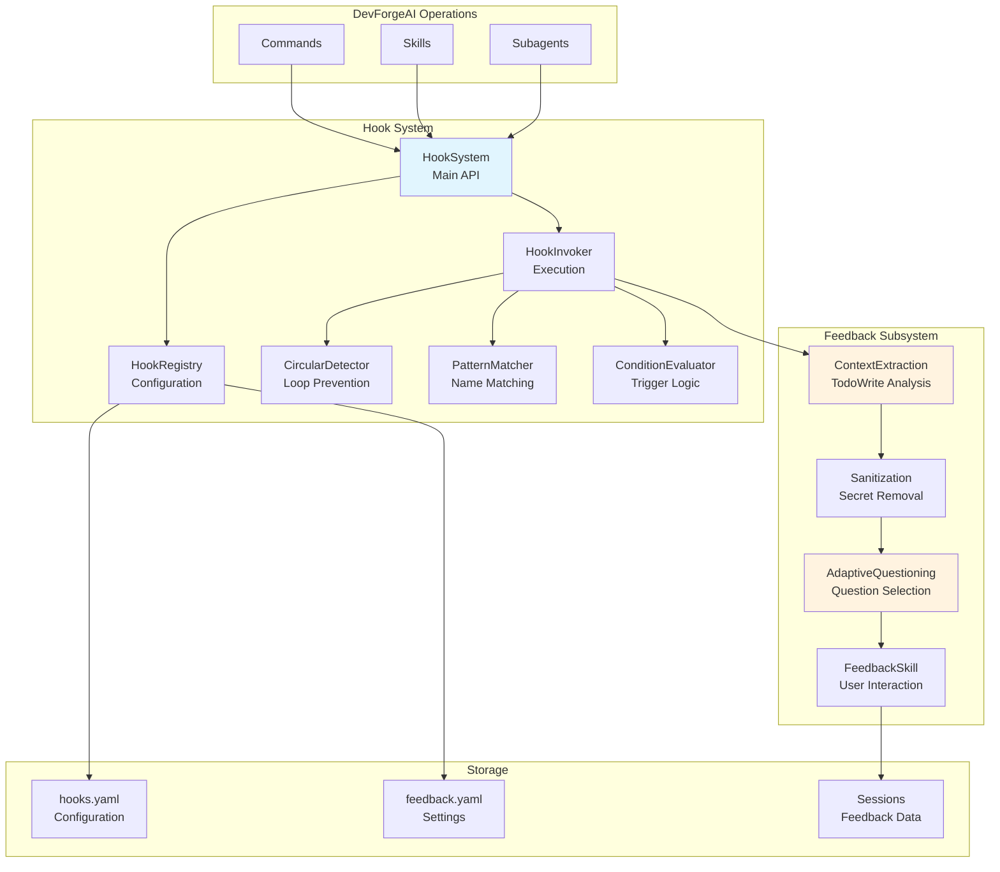
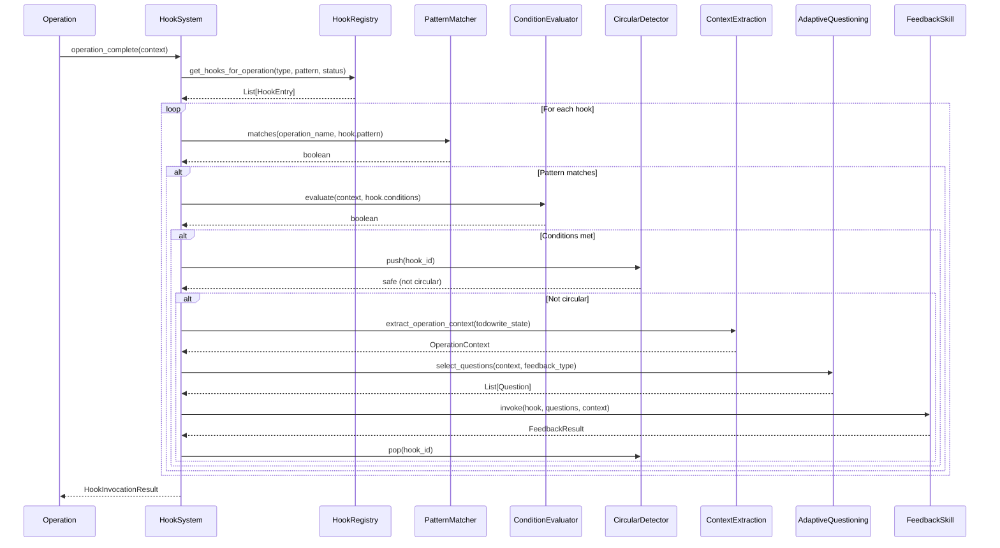
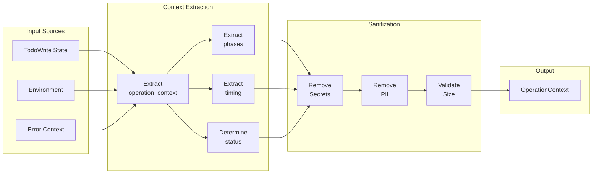
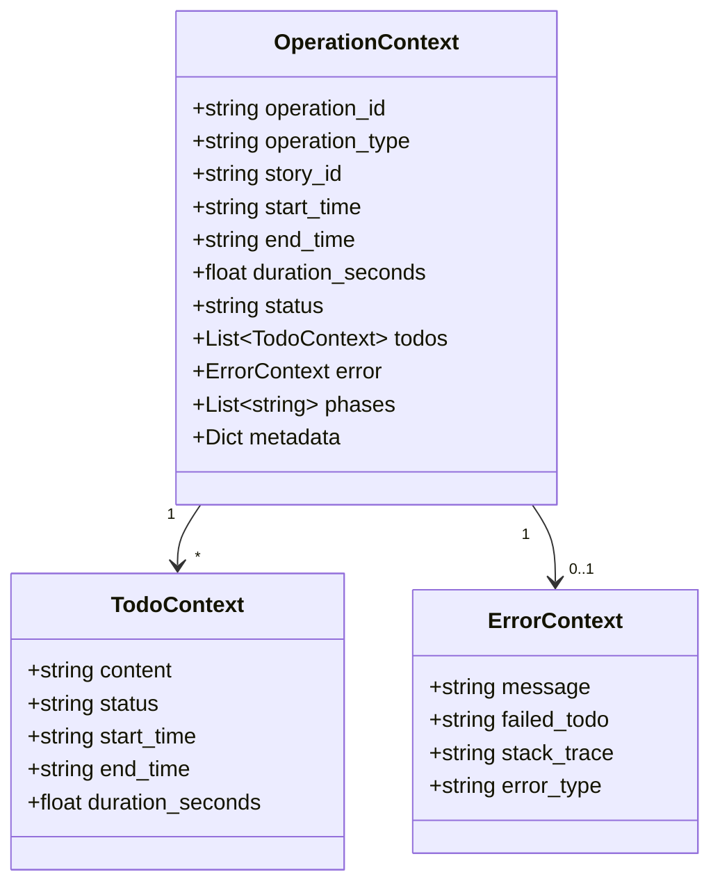
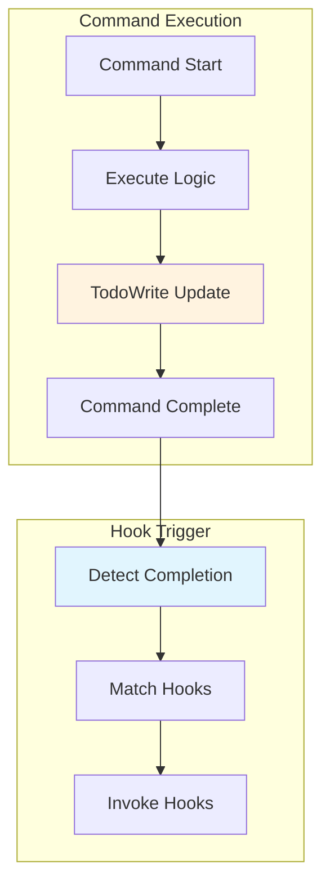
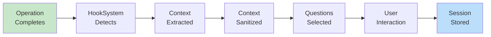
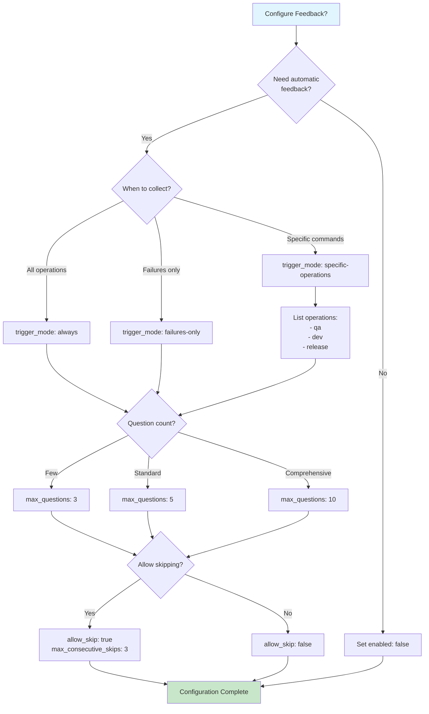

# Hook System Architecture

Technical architecture documentation for the DevForgeAI event-driven hook system.

## Table of Contents

1. [System Overview](#system-overview)
2. [Component Diagram](#component-diagram)
3. [Hook Invocation Sequence](#hook-invocation-sequence)
4. [Context Extraction Data Flow](#context-extraction-data-flow)
5. [Integration Points](#integration-points)
6. [Configuration Decision Tree](#configuration-decision-tree)

---

## System Overview

The hook system enables automatic callback execution when DevForgeAI operations complete. It provides event-driven triggering for feedback collection, monitoring, and automated retrospectives.

### Key Characteristics

- **Event-Driven** - Hooks trigger automatically on operation completion
- **Non-Invasive** - No modifications to existing commands required
- **Pattern-Based** - Flexible matching (exact, glob, regex)
- **Thread-Safe** - Full async support with lock protection
- **Graceful** - Hook failures isolated from primary operations

### Module Summary

| Module | Responsibility | Lines |
|--------|----------------|-------|
| `hook_system.py` | Main coordinator and public API | ~250 |
| `hook_registry.py` | YAML configuration loading | ~350 |
| `hook_patterns.py` | Pattern matching logic | ~130 |
| `hook_conditions.py` | Trigger condition evaluation | ~140 |
| `hook_invocation.py` | Hook execution orchestration | ~310 |
| `hook_circular.py` | Circular dependency detection | ~160 |

---

## Component Diagram

---

## Hook Invocation Sequence

---

## Context Extraction Data Flow

### OperationContext Data Model

---

## Integration Points

### Command Integration

Commands integrate with the hook system through the operation completion callback:

### Skill Integration

Skills can trigger hooks at phase completion:

| Skill | Hook Trigger Point | Status Values |
|-------|-------------------|---------------|
| devforgeai-development | After Phase 08 | success, partial, failure |
| devforgeai-qa | After validation | success, failure |
| devforgeai-release | After deployment | success, failure |
| devforgeai-orchestration | After each phase | success, partial, failure |

### Data Flow from Operation to Storage

---

## Configuration Decision Tree

Use this decision tree to determine optimal configuration:

### Quick Reference

| Scenario | trigger_mode | max_questions | allow_skip |
|----------|--------------|---------------|------------|
| Development | failures-only | 5 | true |
| Production monitoring | always | 3 | true |
| Debug session | always | 10 | false |
| Minimal overhead | never | - | - |

---

## Related Documentation

- [User Guide](../guides/feedback-system-user-guide.md) - Configuration instructions
- [Troubleshooting](../guides/feedback-troubleshooting.md) - Common issues
- [HOOK-SYSTEM.md](../../.claude/skills/devforgeai-feedback/HOOK-SYSTEM.md) - Full technical reference
