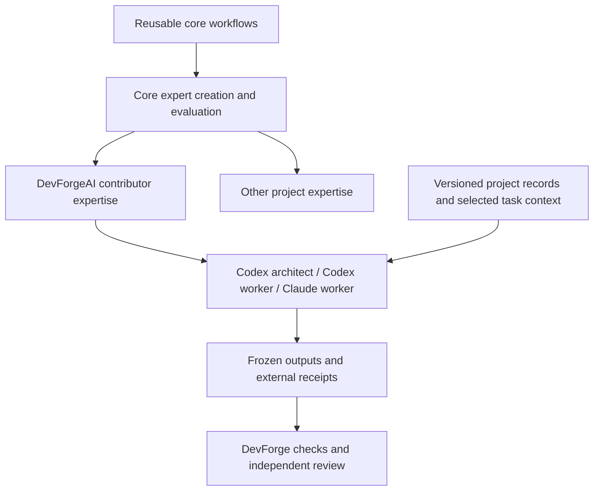

# DevForgeAI contributor expertise proposal

Status: DISCUSSION PROPOSAL, 2026-09-05. User-origin direction: make DevForgeAI's own contributor workflow a concrete use of its adaptive, spec-driven software engineering approach. The capability names, composition, packaging, and pilot below are assistant proposals awaiting disposition. No new skill, authority assignment, contract amendment, or acceptance is established by this document.

DevForgeAI should be a project that consumes its own core workflows and develops the contributor expertise it needs. The current Codex architect/integration terminal, separate Codex worker, and Claude worker provide a concrete first use case. The aim is to make useful project knowledge recoverable, scoped, and testable across sessions, while preserving explicit ownership and independent review.

## What the existing roster already provides

The [roster](../mvp/roster.md) proposes twelve core skills. Four logical skills have draft source packages for each provider; the roster does not establish their behavioral acceptance. Current author candidates and their evidence remain separately identified in their assigned worktrees.

| Core responsibility | Existing proposed skills | Current source status |
| --- | --- | --- |
| Explore and define intent | brainstorm; define-product | Brainstorm draft; define-product proposed |
| Resolve design and technical uncertainty | design; prototype; architect | Proposed |
| Prepare work and expertise | plan; project-expert-creator; evaluate-expert | Creator draft; plan/evaluator proposed |
| Deliver and maintain | develop; review; release; change | Develop/review drafts; release/change proposed |

The [expert creator specification](../mvp/specifications/skill-007-devforge-project-expert-creator.md) already permits expertise for a concrete project goal or recurring capability gap, and requires checking reuse first. An organizational title alone does not justify a skill. The [architecture template](../mvp/templates/devforge-architect/architecture-contract.md) already has an expertise map; the [story template](../mvp/templates/devforge-plan/story.md) separates capability needs, bounded context, and execution readiness.

The missing contributor layer is therefore a missing application and specification of the existing design. The inspected roster and provider source inventories contain no dedicated DevForgeAI contributor expert set. Contributor procedures are currently distributed across root guidance, shared contracts, native creator instructions, assignments, review reports, and the operator's interpretation.

## One framework, three skill portfolios

| Portfolio | Question it helps answer | Source of its knowledge | Intended audience |
| --- | --- | --- | --- |
| Core workflows | How do we turn a goal into specified, evaluated, delivered work? | Framework workflow specifications and common artifact/execution contracts | Projects using DevForgeAI |
| DevForgeAI contributor expertise | How do we safely and correctly change this framework and its provider packages? | DevForgeAI's architecture, authoring contracts, source layout, evaluator behavior, and reviewed contribution history | People and sessions contributing to DevForgeAI |
| Other project expertise | What rules and technical knowledge does this particular project need for its work? | That project's adopted requirements, architecture, source, selected dependencies, and verified references | People and sessions working on that project |

The contributor portfolio is a concrete specialization of the project-expertise mechanism. The companion DevForge repository is a related consuming project with its own code, policy, tests, and authority. Cross-repository work must retain those distinct owners and assignments.

DevForge supplies the deterministic foundation beneath these portfolios. Skill instructions can explain a gate or prepare its inputs; executable checks establish mechanical observations. Human authority determines which decisions and assignments apply. A session's expertise does not grant it permission to modify a gate, accept its own output, or take another session's worktree.

This is a proposed composition, not an implemented automatic sequencer. Core workflows also guide other project workers through the same artifact and evidence contracts.

## Contributor capabilities worth exploring

These are capability hypotheses and working names. Their specifications should establish whether each needs a separate skill or focused references within another skill.

| Working name | Concrete trigger and expertise | Reviewable output | Boundary |
| --- | --- | --- | --- |
| devforgeai-framework-contracts | A contribution changes a workflow, template, provenance rule, or interpretation. Understand the twelve-skill lifecycle and exact selected contract clauses. | Requirement/source map, affected artifacts, and a proposed change or conformance assessment | Does not silently amend governing meaning |
| devforgeai-skill-engineering | Author or repair a native framework skill. Understand provider sources, activation descriptions, package-local resources, derivation, and the native creator workflow. | Bounded candidate package and reproducible authoring cases | Provider-specific guidance and evaluations; native creator remains an authoring tool |
| devforgeai-evaluation-evidence | Assess a skill candidate, a grader, or an apparent PASS. Understand A/B/C distinctions, equal raw facts, fixture visibility, independent expectations, and exact receipts. | Scoped evaluation plan/report, discriminating grader tests, evidence-backed findings | Candidate authoring, grading, and independent acceptance remain separately assigned |
| devforgeai-contribution-integration | Start, resume, hand off, or combine a contribution across the three terminals. Understand this repository's assignment map, frozen inputs, finding IDs, and integration dependencies. | Proposed/verified task context, handoff, ownership discrepancy, or integration-impact report | Assignments and Git actions require the actual operator's authority; coordination records do not self-authorize |
| devforge-runtime-maintenance | An explicitly assigned change affects the companion CLI, installer, isolation, fixed runner, or policy validation. Understand its actual code and supported guarantees. | Scoped DevForge implementation/review and deterministic test evidence | Belongs to the companion project; unavailable to a skill-only worker as a route around a failing gate |

Core plan/review/change/release still provide the general workflows. Contributor skills add DevForgeAI-specific knowledge and procedures to those workflows. They should reference governing records and reusable checks instead of copying their full contents into each package.

A future external contributor could use the same portfolio to propose a core change, a provider integration, or a project expert package. Each contribution type would declare its specification owner, source location, supported runtimes, and required evidence. Begin with our current three-terminal workflow before designing distribution or community automation.

## The three terminals are three assignments

| Current participant | Current responsibility | Expertise it would select for a task | Authority remains supplied by |
| --- | --- | --- | --- |
| This Codex terminal | Architect and integration operator | Framework contracts, contribution integration, and scoped evidence review | User decisions and the operator assignment |
| Separate Codex terminal | Codex skill author under SESSION-002 | Relevant contracts, skill engineering with Codex references, and evaluation preparation | Its exact selected session record and write fence |
| Claude terminal | Claude skill author under SESSION-001 | Relevant contracts, skill engineering with Claude references, and evaluation preparation | Its exact selected session record and write fence |

Provider, session identity, assigned task role, selected expert package, and permissions are distinct facts. Either provider could fill another role under a new assignment and suitable evaluated expertise. Using the same model in two terminals does not share their project context. Using different models does not, by itself, establish independent review.

The replacement objective is concrete: another authorized architect session should be able to recover the project state from records and continue the integration task without requiring this conversation. Workers should retrieve their relevant slice of those records and recognize when a required fact is absent.

## What makes context recoverable

Skills hold stable procedures and project knowledge with provenance. Mutable operational state belongs in the project's existing artifacts and external assignment/evidence store.

| Information | Existing home or starting point | What the contributor experience should expose |
| --- | --- | --- |
| Project intent and adopted rules | Product/architecture records and selected contracts | Applicable decisions, rationale, source revision and scope; proposals remain distinguishable |
| Needed and available expertise | ARCH expertise map, XPKG and EVREPORT | Required capability, candidate/evaluated package, provider support, and relevant freshness |
| Who may change what | External SESSION assignment | Owner, provider, worktree, base, fence, selected inputs, permitted delivery, and integration owner |
| Why this task exists | Story/goal, change request, findings and their source evidence | A bounded objective, concrete defect or gap, expected behavior and unresolved decisions |
| What a session actually observed | Run manifests, outputs, evaluation/review reports and receipts | Exact candidate, check coverage, failures, unavailable observations and remaining prerequisites |
| Where work resumes | HANDOFF and the selected execution record | Current phase, consumed inputs, delivered outputs, retained ownership and one next task |

Build an index or read-only view over these records rather than another independently editable readiness ledger. The current [artifact contract](../mvp/artifact-contract.md) already defines availability as a view over capability declarations, packages, and evaluation records. The [session](../mvp/templates/shared/session-record.md) and [handoff](../mvp/templates/shared/handoff.md) templates already provide most transport fields.

The general protocol for selecting context and recording handoffs applies to every project. Its DevForgeAI-specific sources and failure cases belong in contributor expertise. Missing general tooling belongs to its separately owned implementation scope. The [execution contract](../mvp/execution-contract.md) explicitly does not claim an implemented registry, general outbox, or provider hooks; present state remains partly operator-maintained.

Each task should expose a small manifest of required records and expert packages, plus relevant excerpts and resolvable source references. The worker reads back the selected identities, reports missing prerequisites, and loads further references only as needed. An acknowledgement is useful evidence of selection, not proof of understanding or enforcement.

The first packet should explicitly distinguish task role from provider and list the selected expert packages. Those values can initially travel through the existing SESSION/HANDOFF fields and a declared context manifest; any standardized new fields need an owned contract revision. Test that workers can actually resolve their selected records inside their assigned filesystem boundary. A list of inaccessible absolute paths is an incomplete handoff.

The companion's current `expert prepare` operation emits policy-selected context, and `expert status` distinguishes structural MISSING/CURRENT/STALE while reporting behavior separately. They do not implement the architect's semantic interpretation, a general work-assignment registry, or automatic expert selection. Broader context and transition enforcement would need a separately specified implementation.

A newly available main-branch document must not silently replace the revision selected for an active author. Preserve the assignment, assess the change's impact, and let its owner select any refresh. Durable shared context does not mean sharing the author's private deliberation or held-out expected answers with independent evaluators.

## How other projects get their own experts

Concrete goal -> relevant accepted project rules -> capability gap -> reuse, bounded context, refresh, or new expert specification -> native candidate -> structural checks and independent behavioral evaluation -> selected execution binding -> observed work -> targeted reassessment when inputs or behavior change.

Expertise can concern business rules, architecture, implementation, verification, or operations. It need not be a coding persona or a fixed department. For an illustrative maintenance-scheduling project, recurring needs might justify an equipment-domain expert, an offline-synchronization expert, or a test-fixture expert. Those names are possibilities; the project's actual tasks and accepted decisions determine whether any is needed.

The existing [SQLite expert](../../examples/notes-sqlite/seed/experts/notes-sqlite-persistence/SKILL.md) and [JSON expert](../../examples/notes-json/seed/experts/notes-json-persistence/SKILL.md) illustrate different knowledge for the same persistence task. Their [POC scope](../POC.md) says the demo copies pre-authored synthetic fixtures; it does not prove live expert generation or native behavioral evaluation. A stronger proof must actually author/evaluate expertise for the selected project.

Do not bake live story IDs, assignment owners, current grades, or a whole conversation into an expert's enduring instructions. Relevant corrections can become reviewed regression cases and proposed reference updates. A changed package gets a new identity and the affected evaluation; historical results stay bound to their original inputs.

## Packaging and bootstrap decisions still needed

Contributor expertise should be opt-in for contribution work and excluded from ordinary application core exports. The current installer explicitly supports portable example experts; arbitrary provider-specific project-expert source/install mapping remains an open design point in the [authoring contract](../mvp/skill-authoring-contract.md). Define that mapping and package ownership before creating new runtime paths. No contributor plugin name, installation command, or support claim is established here.

Share a capability specification and appropriate source facts across providers. Select and evaluate the actual native package for each runtime. Text authored by Codex is not automatically Codex-only, and Claude behavior does not establish Codex support.

The standalone evaluator is still proposed. Existing native creators/operator-led evaluation may bootstrap this work using the common authoring contract, with truthful producer and evidence records. Creating an expert that helps evaluate other skills does not let it accept its own generation or prove the complete adaptive lifecycle.

## First proof and continuation

Start with one bounded contributor capability: recover the applicable contribution context and prepare a correct handoff. This exercises the knowledge currently concentrated in the architect/integration terminal. First make the required facts available through a bounded context packet. A standing expert is justified when recurring interpretation or decision work adds value beyond that packet; the five capability ideas above do not require five immediate implementations.

| Proposed experiment | Discriminating observation |
| --- | --- |
| Fresh-session recovery | Fresh Codex and Claude sessions receive a bounded task and record locators, without this chat. They identify the selected rules, actual owner/fence, candidate, open findings and next authorized action; they do not invent missing facts. |
| Drift and ownership pair | Change only an applicable revision/assignment condition in a synthetic case. The session preserves the selected basis, identifies affected work, and stops only dependent unauthorized writes while preserving other work. |
| Handoff and grader challenge | A plausible artifact has an abbreviated receipt or a reference/table shape previously skipped by grading. The observation remains failed or unresolved without the actual required check and delivery; a convincing summary cannot pass it. A later recovery receipt does not retroactively change the frozen trial. |
| Transfer to another project | Use a project with different adopted rules and expertise. Core workflow semantics remain reusable, and DevForgeAI contributor assumptions do not become application requirements. |

Use a baseline of the core workflow plus the same selected task records, without the contributor expert. Compare it with that identical setup plus the candidate expert, separately per provider. This isolates the expert's contribution from the benefit of finally supplying missing facts. If the packet alone meets the need, retain that simpler result.

Freeze expectations before native runs, preserve failed attempts, and record results separately per provider. Measure correct output, missing/incorrect assertions, required operator interventions, and actual time/resource observations. Do not infer general reliability or hallucination reduction from a small pilot. Define worker and independent-reviewer isolation separately; a new worktree or different provider alone is insufficient, and current author sessions do not become independent reviewers by changing their role labels. Evaluated workers must not receive held-out expected answers. Appointed graders receive the independently authored evaluation criteria they need, along with task facts, applicable rules and actual outputs; exclude the candidate author's desired solution and private deliberation.

| Order | Owner | Next action | Completion evidence |
| --- | --- | --- | --- |
| 1 — You are here | User and architect | Review this framing and choose the initial contributor capability and package boundary | Explicit disposition of this proposal; unresolved choices stay proposals |
| 2 | Assigned specification owner | Write the concrete capability map/first expert specification and independent cases | Reviewable specification, input map, source/install mapping and evaluation scope |
| 3 | Separately assigned author and evaluator | Author and evaluate the bounded contributor package on the selected provider runtimes | Exact package, A/B/C observations, raw outputs, and independent review |
| 4 | Integration owner | Use the suitable package in a real contribution, then assess targeted refresh needs | Evidence that another session can perform the bounded task from shared records |

This discussion does not revise the active SESSION-001@4 or SESSION-002@4 assignments. Their selected governing inputs and current bounded iterations continue under their own records. The new proposal can inform a later authorized specification/assignment.

Source basis: inspected local DevForgeAI main at c9298bd34ebb73bf598deec6253068d7f8b0ed59 and companion DevForge at 6983f1de3e06f9b422546fd6944888dcd34e56a1, including explicitly recorded working-tree contract bytes. Exact inputs and this document's external SHA-256 are in the [source and custody receipt](20260905-contributor-expertise-proposal.receipt.json). This is repository-grounded design exploration; no new native evaluation or provider-capability certification was performed.
