# Adaptive spec-driven engineering framework for development

Design visualization of how a **project-agnostic core** becomes a **project-specific engineering system**, then carries selected work from intent to qualified candidate without treating a chat prompt as the source of truth.

Governing planning documents: [framework index](../specs/framework/index.md), [foundation](../specs/framework/foundation.md), [core workflows](../specs/framework/core-workflows.md), [work items](../specs/framework/work-items-and-dependencies.md), [project context and policy](../specs/framework/project-context-and-policy.md), [skills and expertise](../specs/framework/skills-and-project-expertise.md), [quality and delivery](../specs/framework/quality-and-delivery.md).

This file does not install skills, enforce gates, or issue acceptance. Python, Markdown, and mermaid are evidence of design intent only.

## 1. What the diagrams are showing

Three layers sit under every product-development step:

| Layer | What it supplies | What it does not supply |
| --- | --- | --- |
| **Core workflows** | Reusable methods and document handoffs | Product facts, language, layout, quality numbers |
| **Project policy and expertise** | This project's stack, standards, domain rules | Permission to weaken policy or accept a candidate |
| **Guardrails** | Protected checks and receipts when the Rust authority exists | Successful reasoning, or a substitute PASS when authority is absent |

**Adaptive** means: install the same cores in any project, then *discover* that project's conventions, *select* a skill set, and *specialize* only when a variant or expertise package has a distinct evidenced responsibility. See the conversation-level definition in [skills and project expertise](../specs/framework/skills-and-project-expertise.md).

**Spec-driven** means: the selected specification (and its derived story/architecture/policy documents) is the oracle. Implementation, tests, and QA are consumers of that oracle. A later passing test does not rewrite the spec.

## 2. Skill and command map

Invocation names are conversational skill selections, not claimed CLI binaries. Legacy Claude slash commands are shown only as historical entry points; they are not the forward Codex contract.

| Step | Capability | Skill | Command / mode | Status | Document templates |
| --- | --- | --- | --- | --- | --- |
| 0 | Adapt core to project | `skill-builder` | `propose`, then `author_set` | Current | [adaptation-proposal.md](templates/adaptation-proposal.md) |
| 0b | Assess skill packages | `skill-validator` | standalone or set validation | Current | validator report (skill QA, not product QA) |
| 1 | Discover problem | planned core `discover` | planned; legacy `/brainstorm`, `/research` | Planned core | [business-analysis.md](templates/business-analysis.md), [research-finding.md](templates/research-finding.md) |
| 2 | Specify product | planned core `specify` | planned; legacy `/ideate` | Planned core | [product-requirements.md](templates/product-requirements.md) |
| 3 | Architect | planned core `architect` | planned; legacy `/create-system-architecture` | Planned core | [system-architecture.md](templates/system-architecture.md), [project-policy.md](templates/project-policy.md) |
| 4 | Plan work | `story-create` | story / batch authoring | Current | [work-set.md](templates/work-set.md), [story.md](templates/story.md) |
| 5 | Implement | `dev` | implement selected specs/stories | Current | [development-context.md](templates/development-context.md), [development-slice-plan.md](templates/development-slice-plan.md), [development-traceability.md](templates/development-traceability.md), [development-delivery.md](templates/development-delivery.md) |
| 6 | Assess independently | `qa` | `run` / `plan` / `execute` / `retest` | Current | [qa-test-plan.md](templates/qa-test-plan.md), [qa-report.md](templates/qa-report.md), [qa-fix.md](templates/qa-fix.md) |
| 7 | Deliver | planned core `release` | planned; legacy `/release` | Planned core | [release-record.md](templates/release-record.md) |
| 8 | Follow up | planned cores `feedback`, `rca` | planned; legacy `/feedback`, `/rca` | Planned core | [feedback.md](templates/feedback.md), [rca.md](templates/rca.md) |
| * | Resume / interrupt | all product skills | checkpoint on stop | Current in `dev`/`qa` | [checkpoint.md](templates/checkpoint.md) |

`advisor` is an optional second-opinion skill. It produces evidence only. It does not author product documents or accept work.

## 3. Overview: entry points, not a waterfall

An adequate existing specification may enter at work planning or development. An uncertain idea starts at discovery. A confirmed QA defect returns to `dev` with a fix packet. Interrupted work resumes from a checkpoint. Optional services (index, MCP, Git, plugin) are never prerequisites of the core.

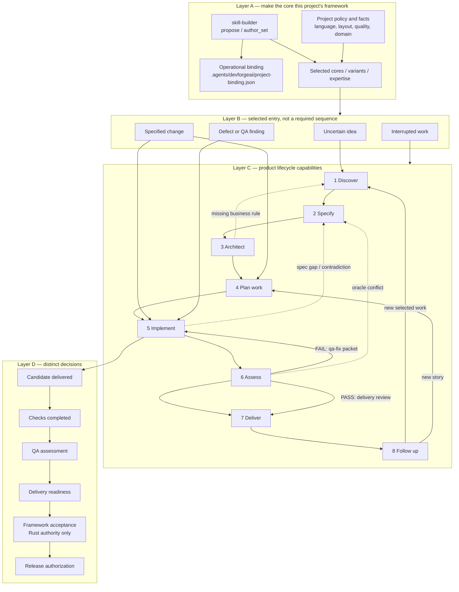

A later box is not implied by an earlier one. Passing developer tests is not QA. A QA PASS is not release authorization. Missing Rust authority is `NOT_EVALUATED` / unavailable, not a Markdown PASS.

## 4. Adaptation layer (why the core can be installed anywhere)

The reusable packages contain no project UUID and no hardcoded language or quality floor. Adaptation *recommends a skill set* from bounded project evidence, then a separately authorized setup writes the operational binding.

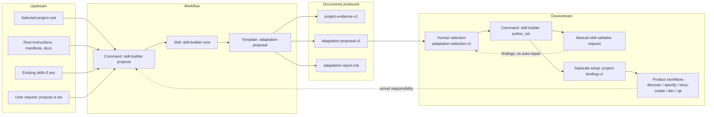

Rules encoded in this expansion:

- `core` discovers conventions; it does not invent a stack.
- `project_variant` keeps parent bytes and a lineage row per parent requirement.
- `expertise` needs distinct ownership and domain evidence; a job title is not a package.
- Binding is operational identity. Portable source must not embed it.
- `skill-validator` assesses the packages. It does not implement the product and does not invoke the builder.

## 5. Step expansions

Each expansion uses the same shape: **upstream → command/skill/template → documents → downstream**, plus dotted **return** paths.

### 5.1 Discover — business analysis and research

**Purpose:** agree what problem is being solved, for whom, and which outcomes/uncertainties exist. A small defect with an existing contract skips this step.

**Skill:** planned core `discover`. Supporting: planned `research`. Legacy: `/brainstorm`, `/research`.

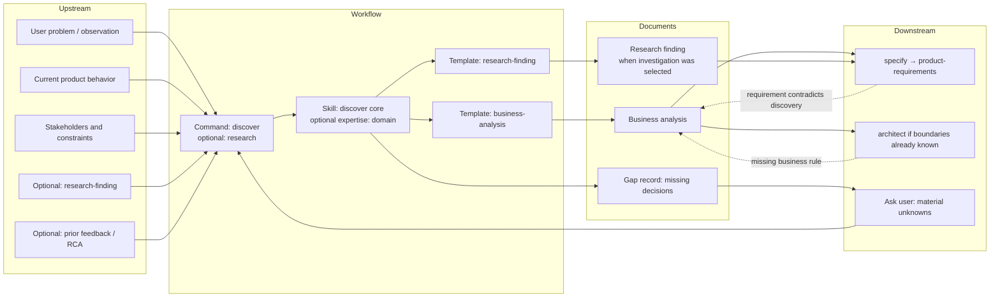

**Handoff contract:** downstream needs agreed outcomes, in/out of scope, stakeholder conflicts, and named uncertainties. It does not need a persona essay. Unanswered race/eligibility questions block only dependent behavior, not unrelated confirmed work.

### 5.2 Specify — product requirements

**Purpose:** turn agreed outcomes into testable requirements, exclusions, and acceptance scenarios. This document is an implementation target, not proof that the software exists.

**Skill:** planned core `specify`. Legacy: `/ideate`.

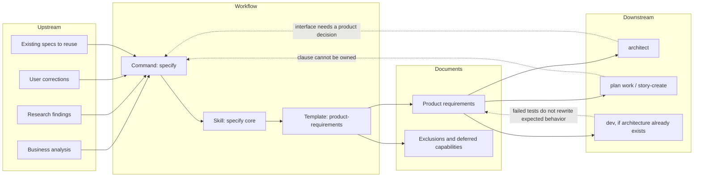

**Handoff contract:** every normative clause has a stable ID, observable acceptance, failure behavior, and explicit out-of-scope. Examples are labeled examples. Historical claims are labeled historical. `dev` must not treat a proposed command signature as an existing executable.

### 5.3 Architect — system design and project policy

**Purpose:** lock boundaries, interfaces, state ownership, and the quality/stack policy this project actually uses. Policy is selected, not inherited from DevForgeAI's own 95%/Rust rules unless this project *is* DevForgeAI.

**Skill:** planned core `architect`. Legacy: `/create-system-architecture`.

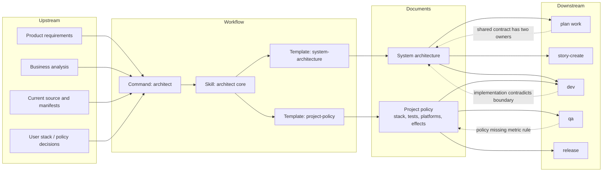

**Handoff contract:** one owner per shared interface. Concurrency, data, and authority boundaries are explicit. Quality measures name numerator, denominator, exclusions, and required platforms. An expert recommendation cannot lower a floor.

### 5.4 Plan work — work set and stories

**Purpose:** decompose selected requirements into independently assessable stories without fragmenting a specification into one file per paragraph, platform, or TDD phase.

**Skill:** current `story-create`. Planned companion: work-set / epic planner. Legacy: `/create-story`, `/create-sprint`.

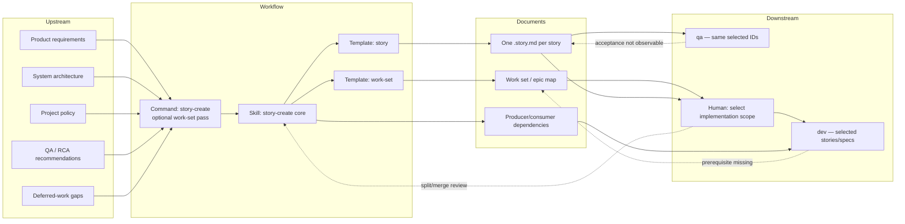

**Handoff contract:** each story has one observable outcome, in/out of scope, source-qualified acceptance, technical (and UI when applicable) specification, dependencies, and verification obligations in **one file**. Shared canonical specs stay external; stories reference them. Authoring a story does not implement it. `story-create` does not invoke `dev`.

Operational authoring template: `src/agents/skills/story-create/assets/templates/story-template.md`.

### 5.5 Implement — `dev`

**Purpose:** implement the explicitly selected specifications/stories through red → green → refactor → developer QA. Cold session: do not supply missing requirements from memory.

**Skill:** current `dev`. Legacy: `/dev`.

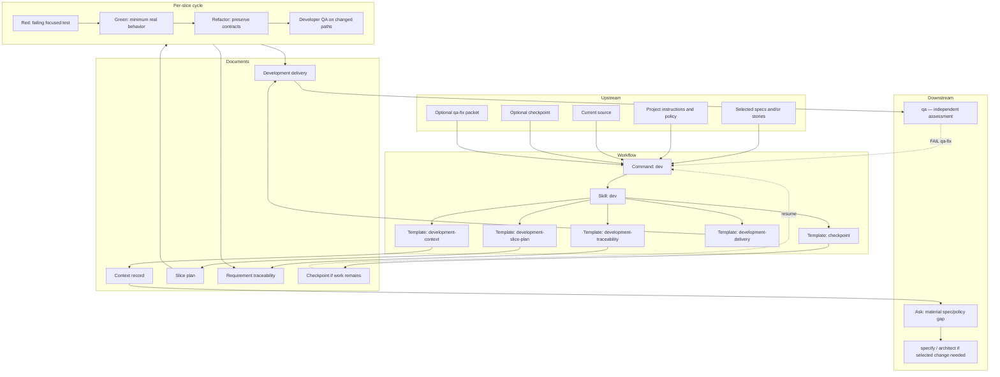

**Handoff contract for QA:** identified candidate bytes, source-qualified requirement accounting, executed check receipts, remaining gaps, and exact evidence paths. Development completion is not protected acceptance and is not a QA verdict. `dev` does not invoke `skill-builder` for application code and does not require `skill-validator` for product tests.

Operational templates: `src/agents/skills/dev/assets/`.

### 5.6 Assess — independent `qa`

**Purpose:** assess the selected candidate against requirements, independently of development completion claims. Oracle is the spec/story, not the developer's report.

**Skill:** current `qa`. Modes: `run` (default), `plan`, `execute`, `retest`. Legacy: `/qa`.

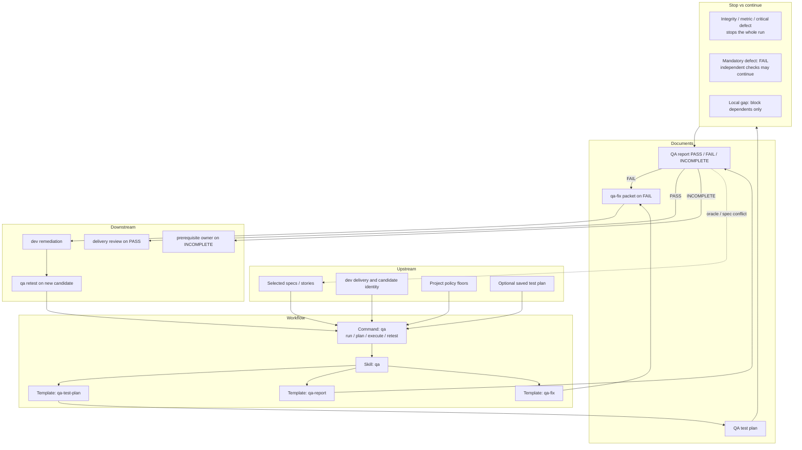

**Handoff contract:**

| QA outcome | Next owner | Required artifact |
| --- | --- | --- |
| PASS | delivery review (human / `release`) | QA report bound to candidate hashes |
| FAIL | `dev` | qa-fix packet + copyable remediating prompt |
| INCOMPLETE | prerequisite owner | exact missing input/tool/platform |
| NOT_EVALUATED | none | planning-only; not a product verdict |

QA must not repair product source. Only an independent retest can close a QA finding. Reports are not framework acceptance.

Operational templates: `src/agents/skills/qa/assets/`.

### 5.7 Deliver — release record

**Purpose:** perform the selected publication/deployment effect only with matching authorization, after delivery readiness. This is a separate effect from QA PASS.

**Skill:** planned core `release`. Legacy: `/release`.

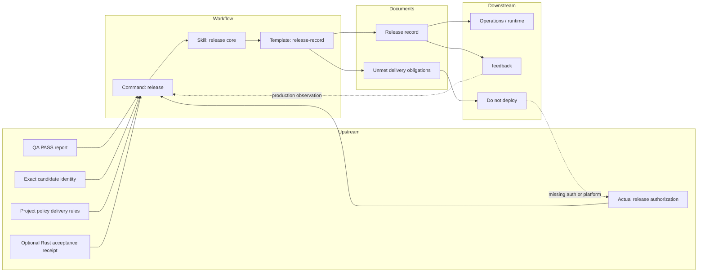

**Handoff contract:** candidate identity must match the assessed bytes. A required unavailable platform remains a gap. No authorization means the workflow records the blocked effect; it does not deploy. Rust acceptance, when required, must be a live authority result — not an editable field in this template.

### 5.8 Follow up — feedback and RCA

**Purpose:** turn observed outcomes into selected new work without silently rewriting policy. Feedback can spawn discovery or stories. RCA is for repeated or systemic failure, not the first red test.

**Skills:** planned `feedback`, `rca`. Legacy: `/feedback`, `/rca`.

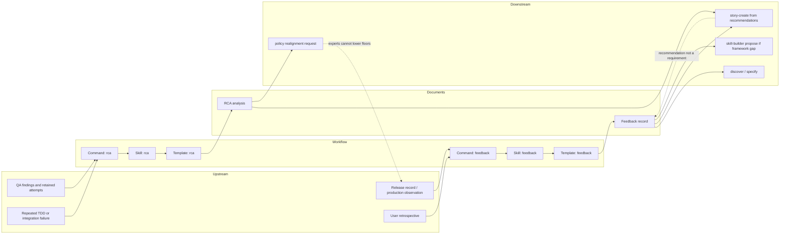

**Handoff contract:** recommendations are proposed work. They do not become requirements until selected. RCA must cite evidence and remaining uncertainty. A feedback item that only restates a goal without an observable behavior is incomplete.

## 6. End-to-end handoff graph

This is the document flow the expansions implement. Solid arrows are the producer → consumer contract. Dotted arrows are return paths.

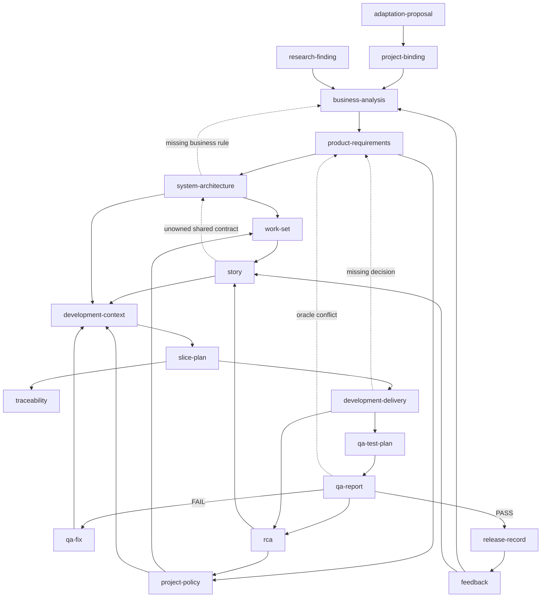

Continuity: any stop writes [checkpoint.md](templates/checkpoint.md). Resume rereads identities and invalidates stale candidate-bound claims. A checkpoint is a navigation aid, not current truth.

## 7. Shared handoff fields

Every template in this pack uses the same envelope so a consumer can reject an incomplete packet without guessing:

| Field | Meaning |
| --- | --- |
| Producer skill / command | Who authored the document |
| Input locators and SHA-256 | Exact upstream bytes |
| Requirement / clause IDs | Stable identities, source-qualified when reused |
| In scope / out of scope | Selected effect boundary |
| Downstream consumer | Named next owner, not an automatic invocation |
| Required artifact properties | What the consumer must be able to observe |
| Failure behavior | `block_consumer` vs `report_optional_absence` vs independent work continues |
| Gaps | Missing input, contradiction, missing decision, unavailable capability, denied operation, changed input |
| Non-claims | Explicit list of decisions this document does **not** make |

Manual handoff does not invoke the consumer skill. The user selects the next workflow.

## 8. OrderDesk walkthrough (same facts, four consumers)

Fictional example from the foundation document. Selected change: permit cancellation **before** dispatch; deny it **after**; racing cancellation and dispatch must not yield contradictory states.

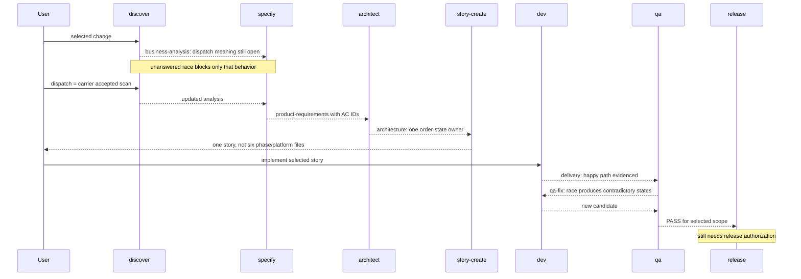

What this walkthrough forbids: a storage expert deciding customer eligibility; copying two cancellation rules into different stories; treating the original unit pass as closing the race; deploying because QA passed.

## 9. What remains outside these diagrams

- Compiled-Rust authority, hooks, and protected receipts — [guardrails](../specs/framework/guardrails-and-rust-runtime.md).
- Installer / update / uninstall — [installation](../specs/framework/installation-and-integrations.md); binding setup is a separate authorized effect.
- Index/query daemon — optional knowledge, not a skill prerequisite.
- Skill-package evaluation campaigns — `skill-validator`, not product `qa`.
- Legacy Claude phase files and `devforgeai-validate` subcommands — historical surface, not the portable core.

Fill the templates under [templates/](templates/) when authoring design documents in a managed project. Do not treat a completed template as implemented software, independent QA, or release permission.
