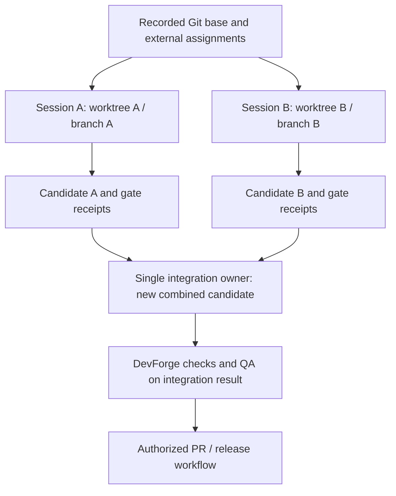

# Terminal, worktree, and external execution contract

Status: DRAFT MVP requirements with accepted VPR-2 utility record transcription, revision 3, 2026-09-08 UTC. This contract adds required behavior to the design; it does not claim the existing POC has a worktree registry, general outbox, provider hooks, or full stack adapters. The v2 utility amendment is opt-in and does not change brainstorm or other-provider execution.

## Terminal operating model

The user runs a normal subscribed Codex or Claude Code session. Native skills guide the work. The separate DevForge executable performs supported deterministic checks. Human-operated transitions are a valid MVP path; a background agent service or model API is not required.

Each target terminal must separately demonstrate installation, discovery, activation, supporting-resource loading, and representative output. Native creator and plugin packaging helpers are authoring tools. Successful package validation or a CLI version probe does not establish runtime behavior.

Commands are thin entry points to skills. Do not invent a slash command or DevForge subcommand in a handoff: use the actual installed skill selector or a plain-language request naming the skill. The current Rust command surface is listed by its real --help output.

## Worktree assignment for concurrent sessions

User requirement: worktrees are important when multiple AI sessions work in one repository. For the MVP, each concurrent writing session must use its own declared worktree and unique branch, or a recorded detached commit when appropriate. One session is the writer for an assigned worktree; read-only reviewers may inspect a frozen snapshot.

Worktrees share Git metadata. They reduce working-file collisions but do not isolate shared refs, Git configuration, credentials, external services, or validator authority. The external control boundary must be tested separately. [OpenAI worktree guide](https://learn.chatgpt.com/docs/environments/git-worktrees).

The authority owner records a [session assignment](templates/shared/session-record.md) containing:
- Session ID, task/story, owner, provider, and ownership/lease state.
- Repository identity, Git common directory, absolute worktree path, branch or detached state, and base commit.
- Declared write fence, protected paths, installed skill identities, and required context revisions.
- External policy/runner/state references and report delivery path.
- Any shared port, database, service, or fixture allocation.
- Integration target and continuation owner.

Assignment records reside in the external authority store. A worker-authored session ID is not proof of ownership. The MVP may use a single human operator to serialize assignments and Git integration; an automated registry would require its own implementation and tests.

For an uncommitted greenfield idea, an observably assigned single writer may use bootstrap mode. Missing session metadata does not prove exclusive ownership; record the task authorization and inspect collision evidence before writes. Before concurrent Git work begins, an actual initial commit and recorded base are required. Do not invent a base SHA or automatically commit user work as a precondition.

Native Git supports manual allocation from a committed base. These are parameterized operator examples, not installed DevForge commands:

```bash
git -C "<repository>" worktree list --porcelain
git -C "<repository>" worktree add -b "<unique-task-branch>" "<new-worktree-path>" "<base-commit>"
```

Inspect current paths and branches first; do not reuse an occupied branch or overwrite a directory. The desktop app's automatic worktree setup, handoff, and ignored-file copying are not assumed for Git worktrees created manually in either terminal. Install required project skills in each task worktree using the accepted installation method; do not copy credentials merely because a setup file was ignored.

When protection makes the Git common directory read-only to the worker, the worker edits its assigned files and hands off the candidate; the operator performs commits and ref updates. Do not relax shared Git metadata permissions merely to make a worker command succeed.

## Per-session workflow

1. Allocate or verify the assignment before writes; capture the base and upstream identities.
2. Install and identify the actual skills needed in that worktree.
3. Complete allowed preparation before initializing a production candidate baseline.
4. Run the assigned bounded task; write reports through the declared delivery path.
5. Freeze the result and preserve external receipts before another session evaluates it.
6. Integrate under a single owner and test the combined candidate on its actual integration base.
7. Record completion and handoff before releasing ownership.

A rebase, conflict resolution, changed upstream context, or changed integration base creates a new candidate. Passing evidence from an earlier task branch is insufficient for the combined result. Cleanup is separate from completion: preserve dirty work and evidence, and never automatically delete a worktree used by another session.

## Concurrent story flow



This describes permitted parallel sessions; it does not automatically launch subagents. A subagent receives only the task-relevant inputs and its declared scope. Read-only review and behavioral evaluation require the actual isolation conditions requested for that task.

## Hooks

Hooks may improve context loading, early feedback, and handoff capture. They do not own acceptance. The current Codex documentation says non-managed hooks require trust, matching command hooks may run concurrently, and unavailable MCP hook tools/errors do not necessarily block an operation. [Hook behavior and trust](https://learn.chatgpt.com/docs/hooks).

Any future adapter must test the installed terminal version's event/tool coverage, trust state, timeout/error behavior, and actual denial behavior. A skipped or failed hook cannot be treated as a completed required check. External acceptance independently rechecks the candidate. This design installs no hooks and does not rely on a hook configuration the worker can edit.

## GitHub CI and the subscription-only boundary

Ordinary GitHub Actions can run DevForge's deterministic build/tests and artifact checks. Their workflow definitions belong to the separate DevForge repository, with selected authority revision and candidate revision recorded.

The documented Codex GitHub Action lists an OpenAI API key as a prerequisite. It is therefore deferred from this subscription-only MVP; no account session credentials are exported to CI. [Codex GitHub Action prerequisites](https://learn.chatgpt.com/docs/github-action).

The release skill can prepare a PR locally and use an existing authorized GitHub interface when available. PR creation, protected-branch configuration, hosted CI success, merge, and deployment require their own observed records. The existing local POC does not establish any of those hosted outcomes.

## Failure and recovery cases required before adoption

| Condition | Required result |
| --- | --- |
| Another writer owns the worktree/branch | Stop dependent writes; preserve both sessions' work. |
| Base commit or source revision changed | Re-evaluate scope and initialize the applicable new run. |
| Skill updated only in source | Reinstall safely, observe loaded identity, and repeat affected evaluation. |
| Hook disabled, skipped, failed, or unsupported | Do not claim enforcement; external required checks still control acceptance. |
| Authority policy/CLI writable by worker | The intended protected execution claim fails. |
| Conflicting changes from separate worktrees | Integration owner resolves a new candidate and reruns relevant QA/gates. |
| Agent cannot write the external report store | Use the declared outbox or operator-saved terminal record; no silent path substitution. |
| Target terminal or required check unavailable | Record COULD_NOT_RUN with the cause and block only the dependent claim/action. |

## Provider authoring and bootstrap evaluation

Use the [authoring contract](skill-authoring-contract.md) for canonical provider sources and A/B/C evidence. Every writing assignment names one worktree, branch/base, provider, skill paths, evaluation-output root, and integration owner. Shared specifications and sibling provider sources stay outside a skill-only write fence. Source ownership is organizational unless an independently verified filesystem boundary enforces it.

The integration owner may allocate assignments and perform local Git operations when the user's task authorizes that setup. This is different from a skill worker manufacturing a baseline or claiming ownership to escape a conflict. Initial commits contain only reviewed intended project files; keep credentials and disposable client/evaluation state out of Git. Record actual commit identities after creation. Git worktrees share metadata and do not isolate subscription caches or provider settings by themselves.

An author's worktree is not a clean evaluation context merely because it is a new directory. Stage candidate/baseline and raw fixtures into separate disposable consuming projects; record what other skills, project instructions, and tools are visible. For implicit tests, supply an ordinary user request and observe actual native consultation. For tier C, use a tested isolation boundary when claiming source docs were inaccessible. If it is unavailable, report the limitation and do not substitute a changed CWD for that evidence.

B7 uses an operator-authored synthetic assignment conflict in a disposable project, with protected-tree hashes before/after. It does not create two active writers or test an unimplemented lease service. The author has a real external session record; each evaluation run separately identifies its own context and permitted output. Operator-created fixtures are evidence, not authority to change real assignments.

A discovered sibling, a proposed continuation, and an invoked sibling are separate facts. The current pilot includes four draft skills per provider and no devforge-change implementation. Negative activation can be measured without installing nonexistent routing targets. Keep required provider checks distinct from checks excluded from an explicitly single-provider scope.

## VPR-2 record contract

This is the normative G1 schema freeze for implementing the [accepted validation policy](skill-authoring-contract.md#opt-in-vpr-2-validation-policy). It is authored contract material, not evidence of implemented parsing, native support, active enforcement or qualification. Policy source: DevForgeAI `8ede26450ae737a5e928c5f70a945aa995969b30`, `docs/skill-authoring/proposals/validation-policy-v1-20260908/policy-revision.md` and `requirement-diff.md`. Compatibility reference for existing strict runtime records: DevForge `c7b2a62696c7f3764fdea3313182b9e896339a2a`, `runtime/delivery/{utility_state,utility_evidence,utility_schedule,native_process,native_schedule}.py`. Existing skill asset shapes are pinned to the same DevForgeAI base above. An explicit “v1 keys plus” below means exactly that immutable key set plus the listed additions, with only the stated semantic changes; it is not permission for unknown keys or future fallback.

### Common types and binding rules

All objects reject duplicate/unknown/missing keys, unknown versions, nonfinite numbers, booleans in integer fields, duplicate identities, escaping/noncanonical paths and changed pinned bytes before dependent state writes. `Pin` is exactly `{path, sha256}`: canonical absolute path to immutable bytes and lowercase 64-hex SHA-256. `Pin?` permits null only where explicitly stated. `Identity` is exactly `{candidate, environment}`, both Pins (candidate is a complete source/installed manifest as applicable; environment is the effective capability/configuration manifest). `Outcome` is one of `PASS`, `FAIL`, `NOT_RUN`, `COULD_NOT_RUN`, `NOT_APPLICABLE`. `Selection` is one of `REQUIRED`, `NOT_SELECTED`, `NOT_APPLICABLE`. `Disposition` is one of `SATISFIED`, `SATISFIED_BY_REVIEWED_SELECTION`, `BLOCKED`, `NOT_RUN`. Lists of IDs are unique; identifiers are nonempty strings. Times are explicit UTC ISO-8601 strings; monotonic nanoseconds are nonnegative integers bound to the same clock instance. Objects/lists retain existing bounded file/parser limits; a limit overflow is refusal, never truncated accepted coverage.

Authority, accepted policy/scope/base, frozen plan, selection reviewer and funding originate outside every worker-writable root. The existing external assignment and its session pin select them; worker proposal text cannot issue them. The delivery contract is frozen after the plan, before T04; T04 binds the plan/delivery digests without the plan pointing back to the future review. Subsequent results bind plan and actual review. This acyclic order is mandatory. Every selected pin is rechecked on admission, transition, resume and final reduction. A correct digest authenticates selected bytes only; independent semantic adequacy remains separately evidenced.

### Schema inventory and cross-version matrix

| Schema | Exact use in this revision |
| --- | --- |
| `devforge.utility-session/v1`, `devforge.utility-checkpoint/v1` | Unchanged strict fields, challenges, deadlines and transport. Session pins an explicitly supported v1 or v2 delivery. Checkpoint binds its exact delivery digest. |
| `devforge.utility-state/v1`, `devforge.utility-head/v1`, existing journal envelope | Unchanged custody/framing; replay chooses semantics from the frozen delivery version. No existing record is migrated or reinterpreted. |
| `devforge.utility-receipt/v1` | Unchanged custody-only receipt and key set. Existing `outputs` binds v2 results when selected; `gate_outcomes` remains actual outcomes, never selection dispositions. Creation-time publication/readback and receiving fields retain their original meaning. |
| `devforge.utility-delivery/v2` | Validator only: v1 keys plus `validation_policy`; definitions below. Builder and brainstorm delivery are unchanged. |
| `devforge.utility-gate-input/v2` | Validator v2 gates only: v1 keys plus `gate_id`, `selection`, `disposition`, `validation_plan_sha256`, `review_sha256`. |
| `devforge.skill-validation-plan/v2` | Existing plan keys plus `validation_policy`; full definition below. |
| `devforge.skill-ai-review/v2` | Existing review keys plus `plan`, `selection_review`; existing R01–R10 records remain. |
| `devforge.skill-validation-results/v2` | Existing results keys plus `task_results`, `assertion_results`, `report_completion`, `validation_disposition`, `routine_adoption_eligible`, `lineage`, `owner_acceptance_ref`, `receiving_transfer`. |
| `devforge.skill-validation-decision/v2` | Existing decision keys plus the same eight result additions; `overall`, `coverage_complete`, groups and dispositions follow the v2 reduction below. |
| `devforge.skill-run/v2` | Existing shared run keys plus `validation_plan_ref`, `observation_id`, `assertion_ids`, `selection`, `evidence_kind`, `conditions`, `integrity`, `raw_output_refs`. |
| `devforge.skill-case-grade/v2` | Existing per-case/per-arm grade keys plus `assertion_judgments`; one batch reviewer may produce several such records, without extra review calls. |
| `devforge.utility-native-plan/v2` | Existing native plan keys plus `validation_plan`; native attempts only, never static reviewer placeholders. |
| `devforge.utility-native-schedule/v2` | Existing schedule keys plus `validation_plan`, `review`, `allocation`; conditional dependencies below. |
| `devforge.utility-native-allocation/v2` | Explicit funded complete typed graph; exact keys below. |
| `devforge.native-runtime-configuration/v2` | Exactly the existing keys `schema_version`, `allocation`, `attempts`; allocation pin now selects v2 limits/graph and attempts are its native projection. |
| Native boundary/effective-runtime/process receipt, answer-policy and operator transport schemas | Retain their existing supported versions and meanings. v2 funding/selection does not authorize a new launcher, authentication mechanism, callback source or nested transport. |

Allowed chains: legacy v1 delivery consumes v1 gates and its existing v1 plan/schedule/allocation/results path exclusively. Opt-in v2 delivery consumes v2 validator plan/review/gates/results; selected native work consumes v2 native plan/schedule/allocation/runtime-configuration. Its unchanged raw boundary/process/transport records use their existing supported versions with exact candidate/attempt/producer bindings. Source structure/case definitions and historical raw evidence can retain original schemas; they are input evidence, never implicit v2 authority. No-native v2 uses null native plan and no campaign binding/reservation. A v1 receipt can attest custody of either explicitly selected delivery version without claiming either's semantic success. Reject mixed authority/selection versions, v2 fields on strict v1 inputs and every unknown version. No global switch, downgrade or unknown-version fallback is allowed.

### External delivery and existing assignment

`utility-delivery/v2` exact top-level keys are `schema_version`, `task_id`, `project_root`, `workflow`, `mode`, `inputs`, `outputs`, `phases`, `gate_inputs`, `questions`, `validation_policy`. Require `workflow=skill-validator`, `mode=utility`. Preserve existing phase/output/question/gate specification key sets. Every P1–P6 phase is applicable and `Enforced`, with exactly its existing Enforced T01–T12 mapping. All six gate IDs remain: `deterministic-inspection`, `independent-review`, `native-prerequisites`, `native-C`, `native-B`, `native-A`.

`validation_policy` in delivery is exactly `{version, policy_ref, acceptance_ref, plan}`. Require `version=VPR-2`; three Pins select accepted policy bytes, actual external acceptance and frozen `skill-validation-plan/v2`. These must equal plan policy bindings and existing assignment selections. The assignment's existing authorization payload must explicitly bind `validation_policy` to this same object and `selection_reviewer` to the existing independent-review gate's producer. No new approval artifact type is needed. The acceptance pin must identify actual owner acceptance of the exact policy revision, not the proposal's self-description.

### Frozen plan selection object

`skill-validation-plan/v2` retains the exact v1 top-level keys `schema_version`, `run_id`, `provider`, `candidate_root`, `input_refs`, `baseline`, `assignment`, `runtime`, `budget`, `checks`, `findings_from_previous_iteration`, `criteria_freeze_record`, `scope_exclusions`, `plan_scope`, plus `validation_policy`. Require provider `codex`. Native-only runtime/budget values may be null when no native work is selected; this never relaxes a selected native prerequisite or independently authorized workspace preparation. Existing checks remain requirement-derived and their IDs must correspond to selected assertion/check records; no convenience default list establishes Full coverage.

The plan's `validation_policy` has exactly these keys:

| Key | Exact value/type |
| --- | --- |
| `version`, `policy_ref`, `acceptance_ref` | `VPR-2`, Pin, Pin; equal delivery and assignment selections. |
| `mode` | `Routine` or `Full`. |
| `requested_claim` | `{kind, text, requires_full, contract_ref}`; kind `scoped_update`, `qualification`, `release_support`, or `diagnostic`; nonempty actual text; boolean; Pin? to applicable claim contract. Explicit qualification sets requires_full true. |
| `accepted_scope_ref` | Pin? to actual accepted capability/environment scope; null prevents Routine suitability/adoption. |
| `baseline_identity`, `candidate_identity` | Identity? and Identity; null baseline is allowed for first Full qualification, never Routine. The comparison treatment remains separately in the existing `baseline.kind`. |
| `lineage` | The lineage object below. |
| `impact` | The impact object below. |
| `compatibility` | Four CP rows below, once each CP-01–CP-04. |
| `catalog_refs` | Nonempty Pins to immutable original cases/specification/assertion oracles. Never replace original eval catalogs with the VPI regression supplement. |
| `catalog_assertions` | Complete independently reviewed catalog projection, using CatalogRow below. |
| `assertions` | Exactly one SelectionRow per catalog assertion ID, including excluded scope and Routine-unselected rows. |
| `task_selection` | Exactly twelve TaskSelection rows in T01–T12 order. |
| `observations` | ObservationSelection rows for selected/reused raw evidence conditions; may be empty for an unattempted/no-native plan only when selected D/S work remains explicitly represented in assertions and calls. |
| `call_graph` | Complete Call rows for all charged initial/continued generations selected by this plan, including T04; no automatic inner suite. Mechanical work without a model generation does not invent a charged node. |
| `selection_reviewer` | Nonempty external producer identity matching assignment and independent-review gate; cannot equal author or measured workers. |

`lineage` is exactly `{qualified_anchor, accepted_unqualified_baseline, current_routinely_accepted, previous_acceptance, acceptance_chain}`. `qualified_anchor` is `{status, identity, evidence}`: status `QUALIFIED` requires Identity and Full evidence Pin; `ABSENT`/`UNKNOWN` require both null and preserve that distinction. `accepted_unqualified_baseline` is Identity?; it is required as the cumulative anchor for Routine without a qualified anchor. `current_routinely_accepted` is Identity? and must equal Routine `baseline_identity`; null remains valid for first qualification. `previous_acceptance` is Pin?; Routine requires actual baseline acceptance. `acceptance_chain` is ordered unique Pins from the fixed anchor through previous acceptance, with exact predecessor/candidate/scope links. Neither Routine PASS nor helper output changes these owner records.

`impact` is exactly `{immediate_diff, cumulative_diff, immediate_requirements, cumulative_requirements, dependency_closure, matched_rules, bounded, full_triggers}`. Diff values are Pins to mechanically computed complete changes between the named identities (including configuration/install/provider effects). Requirements and closure are unique ID lists. `matched_rules` is the union of CI-01–CI-09 IDs matched across both diffs. `bounded` is boolean; false precludes Routine PASS. `full_triggers` is a unique list from `FIRST_QUALIFICATION`, `EXPLICIT_QUALIFICATION`, `NEW_CAPABILITY_ENVIRONMENT`, `CONTROL_AUTHORITY_CHANGE`, `TRANSFER_CHANGE`, `FULL_CLAIM_CONTRACT`, `UNBOUNDED_IMPACT`. Any applicable trigger requires Full; unresolved evidence may still prevent Full PASS. Each changed requirement and its transitive dependencies must occur in the selected assertion union or a genuine independently reviewed scope exclusion.

A CP row is exactly `{id, disposition, old_environment, new_environment, used_capabilities, affected_assertions, evidence, reason}`. ID is CP-01–CP-04; disposition is `UNCHANGED`, `EVIDENCED`, `UNRESOLVED` or `NOT_APPLICABLE`; environments are Pins (null old is allowed for first qualification only); capabilities/assertions are unique IDs; evidence is Pins; reason is nonempty. `UNCHANGED` requires exact relevant equality evidence, not a version-label assertion. `EVIDENCED` CP-03 requires actual eligible N load/task plus every affected denial/activation/failure observation. `NOT_APPLICABLE` needs a real scope basis. Unknown changed used capability remains `UNRESOLVED`; it cannot support Routine adoption. T04 reviews sufficiency against CP-01–CP-04, and runtime checks required bindings/kinds/outcomes.

`CatalogRow` is exactly `{assertion_id, case_id, source_ref, source_pointer, variant, arm, repetition, requirement_ids, evidence_kinds}`. `source_ref` is one of catalog_refs, and `source_pointer` resolves an original expectation using an RFC 6901 JSON pointer, or an exact requirement/section ID for a non-JSON specification. Preserve the original expectation bytes and case identity. `assertion_id` uniquely names this assertion/variant/arm/repetition instance. `variant` is a nonempty frozen label; `arm` is `candidate`, `baseline` or `none`; repetition is a positive integer. `evidence_kinds` is a nonempty unique subset of D/S/N fixed by the source requirements. T04 must establish complete projection of every source assertion/variant, including explicit native assertions; a model-created projection alone cannot establish completeness. Runtime compares selection/results exactly with this protected complete inventory, verifies source locators and refuses omissions/duplicates or evidence-kind weakening.

`SelectionRow` is exactly `{assertion_id, task_id, tier, selection, rule_ids, reason, expectation, dependency_ids, observation_ids}`. Task is T01–T12; tier is D, S, C, B or A. `selection` is Selection; rule_ids are the applicable CI/CP IDs; reason is nonempty and supported by impact/compatibility evidence. `expectation` is `pass` or `observation` (baseline quality may use observation). Dependencies are assertion IDs; observations are ObservationSelection IDs. `NOT_SELECTED` is permitted only for Routine under the reviewed impact rule; Full uses REQUIRED or genuine NOT_APPLICABLE. A selected original N assertion cannot be satisfied with D/S-only observations.

`TaskSelection` is exactly `{task_id, classification, selection, assertion_ids, reason}`. Classification is always `Enforced`. T01–T04 and T09–T12 are REQUIRED. T05–T08 may be NOT_SELECTED only for a reviewed Routine branch with no corresponding required native work; the obligation to record that disposition remains enforced. A native task with genuinely no applicable assertions may record NOT_APPLICABLE with its scope basis. Every assertion is assigned once to its task. Task selection freezes before measured observations and cannot be changed to hide a failure.

`ObservationSelection` is exactly `{observation_id, evidence_kind, assertion_ids, conditions, prerequisite_observation_ids, reuse_ref}`. Evidence kind is D, S or N; assertion IDs exist in the catalog, and reuse_ref is Pin? to actual retained observation. `conditions` is exactly `{identity, input_refs, prompt_ref, arm, variant, repetition, invocation, visibility_ref, freshness_ref, before_task}`. Identity is Identity; input_refs are Pins; prompt_ref is Pin? (required for a model/native observation); arm/variant/repetition match the catalog instances; invocation is `explicit`, `implicit`, `loaded`, or `none`; visibility_ref/freshness_ref are Pins specifying the actual source/tool/history boundary and its validity conditions; before_task is the earliest consuming task ID. Shared evidence must match all conditions, required kind and temporal prerequisites; opposite arms, incompatible variants and explicit/implicit conditions cannot share one observation. N reuse requires actual original collector/receiver evidence, never a clean synthetic transcript. Evidence obtained after its consuming gate is too late for that gate.

`Call` is exactly `{call_id, kind, parent_call_id, attempt_id, assertion_ids, observation_ids, depends_on, producer, reviewer, review_path, interaction, managed_worker_required, max_seconds}`. Kind is `native_worker`, `static_review`, `grader`, `parent_return`, `continuation`, `control`, `probe` or `receiving`. Each row is exactly one externally dispatched/resumed generation. parent_call_id is required for a continuation and otherwise null. attempt_id is the corresponding unique native-attempt ID when the row launches a native process, otherwise null. Non-native reviewers must not be represented as installed target attempts. depends_on contains graph call IDs, acyclic and transitively complete for selected assertion prerequisites. Producer is externally selected; reviewer and review_path are nonempty identity/canonical external destination when a grade is required, otherwise null. Interaction is `single-turn` or `awaiting-user`; managed_worker_required is boolean; max_seconds is positive integer. Continuation/parent-return reasoning is charged; mechanical transport alone is not a model call. No unknown/orphan/duplicate graph node, omitted review/meaningful return or unallocated continuation is admissible. A required but unsupported dispatch method remains COULD_NOT_RUN, not an invented native projection.

### Review, gates, results and reduction

`skill-ai-review/v2` retains all v1 keys/criterion meanings, adds `plan` (Pin) and `selection_review` exactly `{outcome, reason, evidence, reviewed_assertion_ids, reviewed_rule_ids, invariant_ids}`. Outcome is Outcome; evidence is Pins to complete actual review output. Reviewed assertion/rule IDs equal the applicable selected/dependent set; invariant_ids is exactly R01–R10. All ten criteria retain their own outcome, reason and evidence. A passing selection_review requires actual independent review of completeness, exclusions, immediate/cumulative interactions, compatibility, condition sharing and all invariants. Unknown model metadata stays unknown. The external producer must match selection_reviewer and the gate producer; the measured author/worker cannot supply its own approving review.

`utility-gate-input/v2` exact keys are `schema_version`, `task_id`, `phase`, `producer`, `inputs_sha256`, `outcome`, `reason`, `evidence`, `gate_id`, `selection`, `disposition`, `validation_plan_sha256`, `review_sha256`. Existing fields retain their v1 meanings and protected producer/path rules. gate_id matches the declared gate, inputs_sha256 the delivery digest, validation_plan_sha256 the selected plan. review_sha256 is null at deterministic-inspection and independent-review (the latter's evidence contains the exact review), and is the actual admitted T04 review digest for P4 gates. Nonempty evidence consists of acyclic Pins. Deterministic-inspection and independent-review require REQUIRED selection; their outcomes do not become PASS by exclusion.

For a REQUIRED native gate, SATISFIED requires its actual prerequisite/observation evidence, complete native plan when applicable and authenticated imported intact result plus selected grade for executed C/B/A. FAIL/COULD_NOT_RUN/NOT_RUN remains BLOCKED or NOT_RUN, never SATISFIED. For a pre-run reviewed NOT_SELECTED native gate, require outcome NOT_RUN, disposition SATISFIED_BY_REVIEWED_SELECTION and the exact plan/review evidence. For genuine NOT_APPLICABLE, require that outcome and the reviewed scope basis; its disposition is SATISFIED_BY_REVIEWED_SELECTION. No-native native-prerequisites uses the latter reviewed-selection mechanism with NOT_SELECTED/NOT_RUN; it admits reporting only and forbids schedule bind/reserve/launch. The external gate's allowed_outcomes still applies and cannot weaken these predicates. Admission failure performs no partial writes; honest P4 dispositions may advance reporting but never bypass selected execution prerequisites.

`skill-validation-results/v2` retains `schema_version`, `run_id`, `plan`, `structural_report`, `ai_review`, `results`, `findings` and adds the eight fields in the inventory. Existing result rows keep their v1 fields and native case-grade references. `task_results` is twelve exact rows `{task_id, classification, selection, disposition, outcome, reason, evidence}`, using the fixed plan classification/selection. A task can satisfy reporting/selection while its native observation remains NOT_RUN. `assertion_results` is exactly one row per catalog assertion: `{assertion_id, selection, outcome, integrity, observation_refs, grade_refs, reason}`. Integrity is `INTACT`, `UNOBTAINABLE`, `CONTAMINATED` or `NOT_OBSERVED`; refs are Pins. Only matching intact evidence can supply PASS/FAIL. NOT_SELECTED must remain NOT_RUN/NOT_OBSERVED; genuine NOT_APPLICABLE retains its scope reason. Missing selected observations preserve NOT_RUN or COULD_NOT_RUN.

`report_completion` is `COMPLETE`, `PARTIAL` or `BLOCKED`; COMPLETE means all task obligations and honest output records are accounted for, not that observations passed. `validation_disposition` is `ROUTINE_PASS`, `FULL_PASS`, `FAIL` or `INSUFFICIENT_EVIDENCE`. `routine_adoption_eligible` is boolean, true only for ROUTINE_PASS with all policy scope, lineage, compatibility and required destination/post-install conditions satisfied; it grants no human decision. `lineage` exactly copies the frozen input lineage: evidence qualification does not silently modify its owner acceptance chain. `owner_acceptance_ref` is Pin? to an actual external decision, never helper-created. A later owner decision creates a successor acceptance record; Full PASS can support a new qualified anchor there only for its exact candidate/environment.

`receiving_transfer` is exactly `{selection, outcome, target_output, receiver_contract, receiver_observation, completed_action, observed_at_utc, reason}`. Pins are nullable only when missing/unselected; actual required transfer requires all four Pins, actual UTC time before T09, eligibility of target-produced output, observed receiver load and required completed action or expected negative disposition. Native observation truth remains independently required. T12 prepared handoff is not this evidence and creates no recursive campaign.

`skill-validation-decision/v2` retains the immutable v1 decision key set and adds these same eight fields, mechanically derived rather than trusted from claimed summary values. `overall=PASS` only for ROUTINE_PASS/FULL_PASS, `FAIL` for a required candidate/protocol violation, otherwise COULD_NOT_RUN when unavailable required evidence exists or NOT_RUN when merely unattempted. `coverage_complete` means all REQUIRED assertions have admissible required kinds/judgments and all reviewed exclusions are accounted for; unselected native groups remain NOT_RUN. A complete intact failing comparison can have coverage_complete true. An intact baseline outcome under expectation=observation does not overwrite its candidate's judgment. Existing display disposition remains `revise`, `suitable_for_stated_scope` or `insufficient_evidence` consistently; `external_acceptance=NOT_GRANTED` remains mandatory for the helper. Groups report observed tier outcomes, without averaging or mapping NOT_SELECTED to native PASS.

`skill-run/v2` uses the unchanged v1 run fields plus the eight additions in the inventory. validation_plan_ref is Pin; observation_id/assertion_ids join the frozen map; selection is Selection; evidence_kind is D/S/N; conditions is the exact frozen Conditions object above; integrity uses the result enum; raw_output_refs contains complete actual raw-output Pins. This template is for v2 opted-in validator observations only; legacy/provider runs continue the exact v1 key set. `skill-case-grade/v2` keeps each original case/arm record and adds `assertion_judgments`, unique rows `{assertion_id, outcome, reason, evidence}` for that arm, with actual raw-output Pins. A single independent review may emit multiple arm records; incomplete arms, author-as-grader, prewritten judgments or a bare aggregate grade cannot establish sufficiency.

### Selected native schedule and distinct funding

`utility-native-plan/v2` has exactly the v1 keys `schema_version`, `task_id`, `candidate`, `baseline`, `specification`, `cases`, `runtime_configuration`, `client`, `model`, `authentication`, `repetitions`, `max_attempts`, `max_seconds`, `observation_methods`, `boundary_evidence`, `attempts`, plus `validation_plan` Pin. All actual readiness, no-credential-copying, client, boundary and nonoverlap predicates remain. Cases bind the selected original oracle; the complete assertion/typed-call inventory comes independently from validation_plan, not the convenient attempt projection. Attempts retain the exact v1 row shape and equal the native subset of the reviewed call graph. Selected native input may not remain null or unknown. Static-only selection creates no native-plan document.

`utility-native-schedule/v2` exact keys are `schema_version`, `task_id`, `plan`, `required_predecessors`, `validation_plan`, `review`, `allocation`; all references are Pins. required_predecessors maps every native attempt ID exactly once to required prior native attempt IDs. Derive it from the complete reviewed assertion/observation/call graph, not a caller's convenient list. Within each arm/repetition every selected B/A requires matching C; every selected B preceding A remains a predecessor. Routine A may omit B only when T07's unselected disposition and assertions were reviewed before launch. Selected C needs intact PASS; selected B predecessors need intact completed observations (PASS or FAIL), with required candidate failures retained for final disposition. Full retains all required earlier tiers. Cross-arm reuse, empty required C coverage, graph cycles, stale plan/review/allocation and post-hoc exclusions reject admission. Existing exclusive reservation, import-before-grade, settlement and original-clock replay remain mandatory.

`utility-native-allocation/v2` exact keys are `schema_version`, `task_id`, `cases_sha256`, `validation_plan`, `funding`, `max_total_attempts`, `preparation_attempts`, `max_seconds`, `per_attempt_max_seconds`, `required_calls`. validation_plan is Pin; cases_sha256 equals the native plan's cases digest. required_calls is exactly the entire reviewed `call_graph` using Call rows, including non-native semantic workers and continuations. `funding` is exactly `{grant_id, authority_ref, owner, purpose, origin_utc, deadline_utc, clock_id, origin_monotonic_ns, deadline_monotonic_ns, prior_ledgers}`. authority_ref is Pin to actual distinct external owner funding; owner matches its producer; purpose must explicitly authorize the native campaign being requested. prior_ledgers is an ordered list of Pins to preserved earlier terminal ledgers and cannot be substituted as new authority. A reused/exhausted grant_id or authority rejects; owner-selected new limits must be contained in that distinct grant.

max_total_attempts, max_seconds and per_attempt_max_seconds are positive integers (no hard-coded v1 ceiling for explicitly funded v2); preparation_attempts is a nonnegative integer with already charged setup-generation evidence in the funding record, covering only calls outside the frozen graph. Graph calls completed before native campaign binding, such as T04, retain their selected actual completion evidence and count once in required_calls, never again as preparation_attempts. Every graph node counts one initial or resumed generation. Require `preparation_attempts + len(required_calls) <= max_total_attempts`; continuation rows count once and cannot also be hidden inside an uncounted initial node. Each call max_seconds is at most per_attempt_max_seconds and at most max_seconds. Native plan max_attempts covers exactly its native projection and cannot exceed the complete cap; plan max_seconds equals allocation max_seconds. The original UTC/monotonic origins and cutoffs include preparation, waiting and closeout and persist across resume; neither can be reset. The grant's UTC and monotonic elapsed ceilings may not exceed max_seconds, and clock_id must match the observed monotonic source. Admissible dispatch/settlement uses the earliest remaining session, grant, campaign and per-unit cutoff on both observed clocks.

The collector, scheduler, journal reducer, managed-worker/router and capability consumers must all consume the same validated v2 limits and graph binding. Preserve collector authenticity, exclusive one-use launch claims, launch/import/grade separation, owned-process settlement, supported callback-origin constraints and unsupported-method refusal. An externally hosted static reviewer remains explicitly counted without pretending to be a native installed worker; its selected external producer must supply actual bounded completion evidence before dependent gates. Existing transport `continuation_units`, where required, is the ordered projection of matching continuation call IDs for that parent; frozen answer-policy units must match it exactly. No unallocated retry, followup, return or implicit child is permitted. Failed allocated launch remains charged; a reservation is never relaunched on replay.

v1 retains its original 24-total/600-per-unit/14,400-second ceilings in allocation validation, schedule and collector. Historical ledgers remain original 24/24/0, R2-REVIEW 1/1/0 and CMP-2.A 2/2/0. The separately approved nine engineering generations do not fund a native campaign. Stage A is COMPLETE with preserved measurement limits and its 3.785463266-second monotonic closeout overrun; the failed final check was not retried. Internal token/request/retry/compaction and human active/waiting person-time that were unobservable remain NOT_OBSERVABLE, not zero. This supplies no subscription-affordability claim.

### Implementation and observation boundary

G2 implements strict policy/state/reduction against this freeze; G3 implements typed graph/funding/schedule consumers; G4 updates canonical validator assets/helper against the same shapes; G5 carries the claim/lineage distinction into builder authoring; G6 owns integration and generated-copy reconciliation. The [frozen VPI discriminator table](../skill-authoring/skill-validator-design.md#vpi-01-frozen-discriminator-expectations) is the behavior oracle; expected values are not produced by the new implementation. Required consumer work outside the allocated fence is a concrete blocker, not authority to broaden writes. This enforcement change itself triggers CI-05 Full before operational adoption. Native qualification, supported authentication/transport, actual control/receiving observations and final Full observation count remain deferred to a separately funded admitted campaign.
