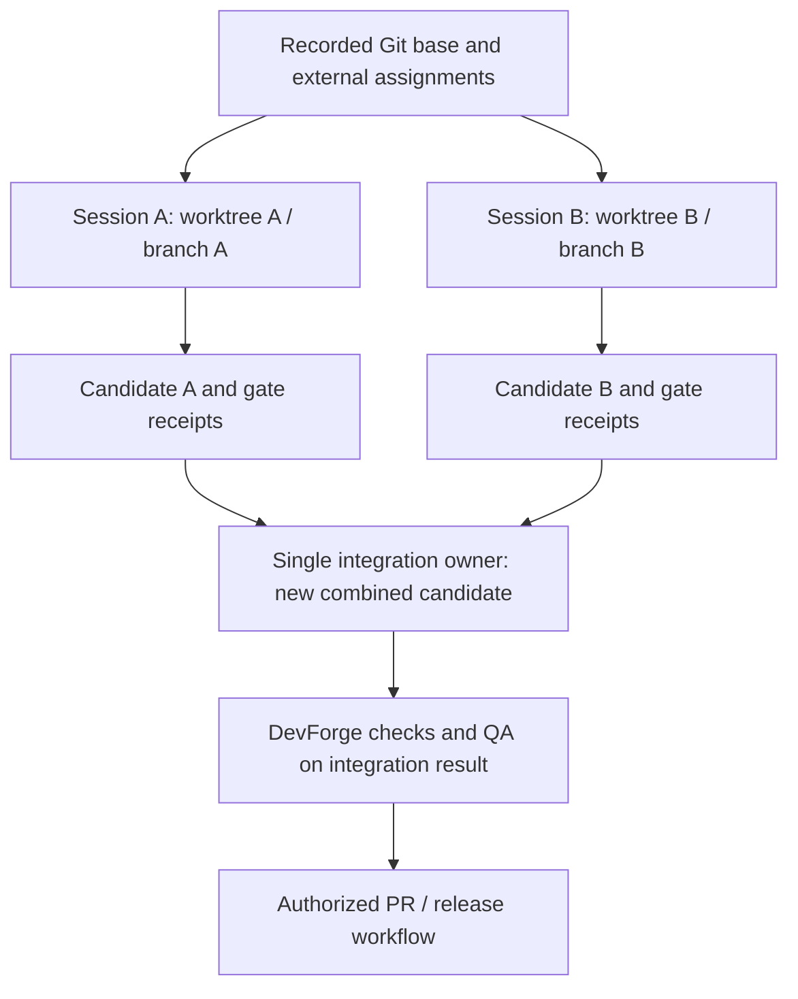

# Terminal, worktree, and external execution contract

Status: DRAFT MVP requirements, revision 2, 2026-09-05 UTC. This contract adds required behavior to the design; it does not claim the existing POC has a worktree registry, general outbox, provider hooks, or full stack adapters.

## Terminal operating model

The user runs a normal subscribed Codex or Claude Code session. Native skills guide the work. The separate DevForge executable performs supported deterministic checks. Human-operated transitions are a valid MVP path; a background agent service or model API is not required.

Each target terminal must separately demonstrate installation, discovery, activation, supporting-resource loading, and representative output. Native creator and plugin packaging helpers are authoring tools. Successful package validation or a CLI version probe does not establish runtime behavior.

Commands are thin entry points to skills. Do not invent a slash command or DevForge subcommand in a handoff: use the actual installed skill selector or a plain-language request naming the skill. The current Rust command surface is listed by its real --help output.

## Worktree assignment for concurrent sessions

User requirement: worktrees are important when multiple AI sessions work in one repository. For the MVP, each concurrent writing session must use its own declared worktree and unique branch, or a recorded detached commit when appropriate. One session is the writer for an assigned worktree; read-only reviewers may inspect a frozen snapshot.

Worktrees share Git metadata. They reduce working-file collisions but do not isolate shared refs, Git configuration, credentials, external services, or validator authority. The external control boundary must be tested separately. [OpenAI worktree guide](https://learn.chatgpt.com/docs/environments/git-worktrees).

The authority owner records a [session assignment](templates/shared/session-record.md) containing:
- Session ID, task/story, owner, provider, and ownership/lease state.
- Repository identity, Git common directory, absolute worktree path, branch or detached state, and base commit.
- Declared write fence, protected paths, installed skill identities, and required context revisions.
- External policy/runner/state references and report delivery path.
- Any shared port, database, service, or fixture allocation.
- Integration target and continuation owner.

Assignment records reside in the external authority store. A worker-authored session ID is not proof of ownership. The MVP may use a single human operator to serialize assignments and Git integration; an automated registry would require its own implementation and tests.

For an uncommitted greenfield idea, an observably assigned single writer may use bootstrap mode. Missing session metadata does not prove exclusive ownership; record the task authorization and inspect collision evidence before writes. Before concurrent Git work begins, an actual initial commit and recorded base are required. Do not invent a base SHA or automatically commit user work as a precondition.

Native Git supports manual allocation from a committed base. These are parameterized operator examples, not installed DevForge commands:

```bash
git -C "<repository>" worktree list --porcelain
git -C "<repository>" worktree add -b "<unique-task-branch>" "<new-worktree-path>" "<base-commit>"
```

Inspect current paths and branches first; do not reuse an occupied branch or overwrite a directory. The desktop app's automatic worktree setup, handoff, and ignored-file copying are not assumed for Git worktrees created manually in either terminal. Install required project skills in each task worktree using the accepted installation method; do not copy credentials merely because a setup file was ignored.

When protection makes the Git common directory read-only to the worker, the worker edits its assigned files and hands off the candidate; the operator performs commits and ref updates. Do not relax shared Git metadata permissions merely to make a worker command succeed.

## Per-session workflow

1. Allocate or verify the assignment before writes; capture the base and upstream identities.
2. Install and identify the actual skills needed in that worktree.
3. Complete allowed preparation before initializing a production candidate baseline.
4. Run the assigned bounded task; write reports through the declared delivery path.
5. Freeze the result and preserve external receipts before another session evaluates it.
6. Integrate under a single owner and test the combined candidate on its actual integration base.
7. Record completion and handoff before releasing ownership.

A rebase, conflict resolution, changed upstream context, or changed integration base creates a new candidate. Passing evidence from an earlier task branch is insufficient for the combined result. Cleanup is separate from completion: preserve dirty work and evidence, and never automatically delete a worktree used by another session.

## Concurrent story flow



This describes permitted parallel sessions; it does not automatically launch subagents. A subagent receives only the task-relevant inputs and its declared scope. Read-only review and behavioral evaluation require the actual isolation conditions requested for that task.

## Hooks

Hooks may improve context loading, early feedback, and handoff capture. They do not own acceptance. The current Codex documentation says non-managed hooks require trust, matching command hooks may run concurrently, and unavailable MCP hook tools/errors do not necessarily block an operation. [Hook behavior and trust](https://learn.chatgpt.com/docs/hooks).

Any future adapter must test the installed terminal version's event/tool coverage, trust state, timeout/error behavior, and actual denial behavior. A skipped or failed hook cannot be treated as a completed required check. External acceptance independently rechecks the candidate. This design installs no hooks and does not rely on a hook configuration the worker can edit.

## GitHub CI and the subscription-only boundary

Ordinary GitHub Actions can run DevForge's deterministic build/tests and artifact checks. Their workflow definitions belong to the separate DevForge repository, with selected authority revision and candidate revision recorded.

The documented Codex GitHub Action lists an OpenAI API key as a prerequisite. It is therefore deferred from this subscription-only MVP; no account session credentials are exported to CI. [Codex GitHub Action prerequisites](https://learn.chatgpt.com/docs/github-action).

The release skill can prepare a PR locally and use an existing authorized GitHub interface when available. PR creation, protected-branch configuration, hosted CI success, merge, and deployment require their own observed records. The existing local POC does not establish any of those hosted outcomes.

## Failure and recovery cases required before adoption

| Condition | Required result |
| --- | --- |
| Another writer owns the worktree/branch | Stop dependent writes; preserve both sessions' work. |
| Base commit or source revision changed | Re-evaluate scope and initialize the applicable new run. |
| Skill updated only in source | Reinstall safely, observe loaded identity, and repeat affected evaluation. |
| Hook disabled, skipped, failed, or unsupported | Do not claim enforcement; external required checks still control acceptance. |
| Authority policy/CLI writable by worker | The intended protected execution claim fails. |
| Conflicting changes from separate worktrees | Integration owner resolves a new candidate and reruns relevant QA/gates. |
| Agent cannot write the external report store | Use the declared outbox or operator-saved terminal record; no silent path substitution. |
| Target terminal or required check unavailable | Record COULD_NOT_RUN with the cause and block only the dependent claim/action. |

## Provider authoring and bootstrap evaluation

Use the [authoring contract](skill-authoring-contract.md) for canonical provider sources and A/B/C evidence. Every writing assignment names one worktree, branch/base, provider, skill paths, evaluation-output root, and integration owner. Shared specifications and sibling provider sources stay outside a skill-only write fence. Source ownership is organizational unless an independently verified filesystem boundary enforces it.

The integration owner may allocate assignments and perform local Git operations when the user's task authorizes that setup. This is different from a skill worker manufacturing a baseline or claiming ownership to escape a conflict. Initial commits contain only reviewed intended project files; keep credentials and disposable client/evaluation state out of Git. Record actual commit identities after creation. Git worktrees share metadata and do not isolate subscription caches or provider settings by themselves.

An author's worktree is not a clean evaluation context merely because it is a new directory. Stage candidate/baseline and raw fixtures into separate disposable consuming projects; record what other skills, project instructions, and tools are visible. For implicit tests, supply an ordinary user request and observe actual native consultation. For tier C, use a tested isolation boundary when claiming source docs were inaccessible. If it is unavailable, report the limitation and do not substitute a changed CWD for that evidence.

B7 uses an operator-authored synthetic assignment conflict in a disposable project, with protected-tree hashes before/after. It does not create two active writers or test an unimplemented lease service. The author has a real external session record; each evaluation run separately identifies its own context and permitted output. Operator-created fixtures are evidence, not authority to change real assignments.

A discovered sibling, a proposed continuation, and an invoked sibling are separate facts. The current pilot includes four draft skills per provider and no devforge-change implementation. Negative activation can be measured without installing nonexistent routing targets. Keep required provider checks distinct from checks excluded from an explicitly single-provider scope.
