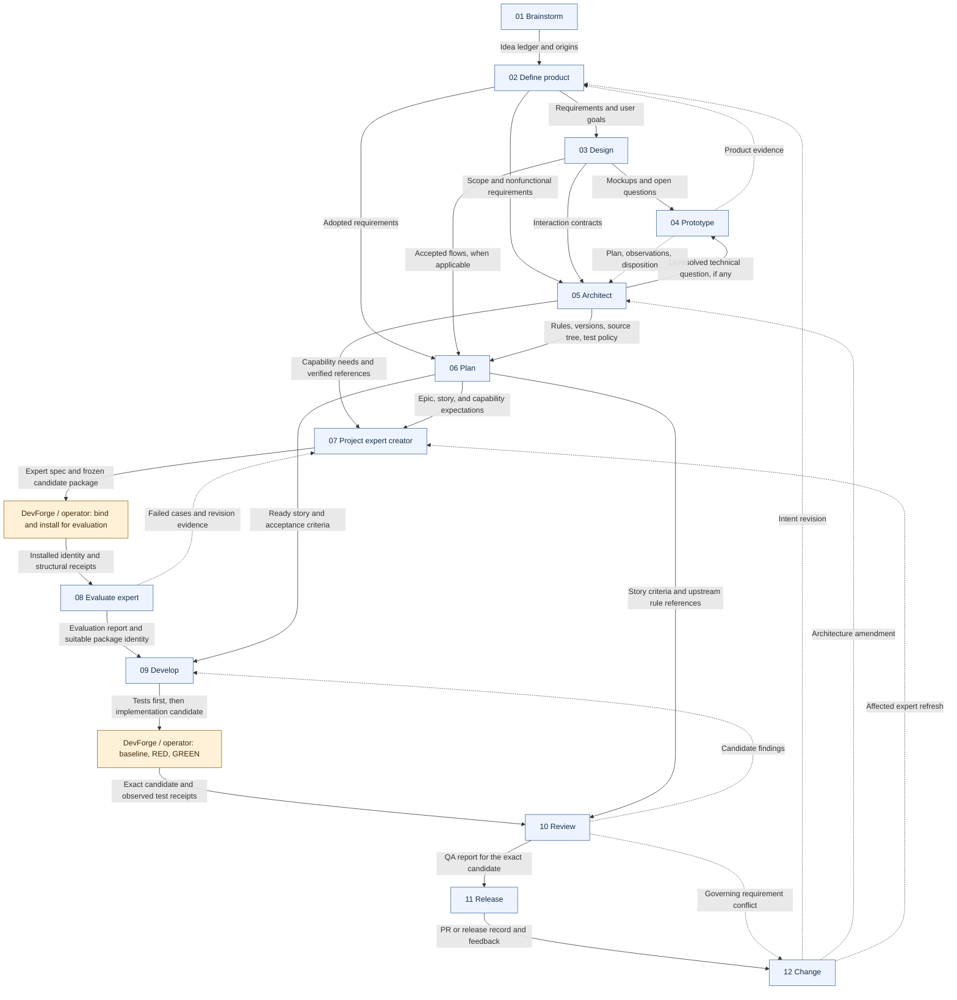

# DevForgeAI MVP skill roster and provenance

Status: DRAFT design, refreshed 2026-09-05. Twelve core skills are proposed for the MVP lifecycle. Four have draft instruction files in the current POC; none is promoted to terminal-validated status by this document. Generated project experts are additional project-specific outputs, not mandatory roles in a fixed organization chart.

The MVP uses explicit native skill invocation, local artifacts, and external DevForge checks. Design and prototype are conditional. Research is performed within the skill that needs it. Sprint scheduling, autonomous deployment, scheduled skill rewriting, and API-backed model CI are deferred.

## Adaptive design

DevForgeAI's adaptive, spec-driven design responds to the task, accepted project decisions, and observed evidence:

| Aspect | Adaptation in the proposed lifecycle |
| --- | --- |
| Workflow | Select relevant stages and reuse applicable accepted artifacts. A consequential uncertainty can call for a prototype; an unchanged accepted design can be reused. |
| Expertise | Reuse suitable current skills, create expertise for a concrete capability gap, and refresh it when relevant inputs or observed failures justify a change. Evaluate each new or changed package for its intended tasks before selecting it as suitable. |
| Context | Give each task the relevant rules and source references while retaining their exact upstream identities. |
| Evidence | Identify affected dependents when governing inputs or candidates change, retain historical results, and obtain the relevant new checks or evaluations before relying on them for changed work. |

Adaptation operates within accepted specifications and recorded authority. Governing changes follow the [change workflow](specifications/skill-012-devforge-change.md); affected expertise follows the [creation and refresh](specifications/skill-007-devforge-project-expert-creator.md) and [evaluation](specifications/skill-008-devforge-evaluate-expert.md) workflows. Required acceptance criteria and external DevForge checks continue to govern progression.

This describes the intended architecture. The current POC and draft implementation states below still apply; claims of adaptive behavior require evidence for the exact capability, scope, and provider tested.

## Roster

| ID | Skill / user goal | Main output | Current source |
| --- | --- | --- | --- |
| SKILL-001 | [devforge-brainstorm](specifications/skill-001-devforge-brainstorm.md): Explore and preserve ideas | idea-ledger | Draft instructions exist |
| SKILL-002 | [devforge-define-product](specifications/skill-002-devforge-define-product.md): Define a useful delivery scope | product-brief | Proposed |
| SKILL-003 | [devforge-design](specifications/skill-003-devforge-design.md): Design and iterate the user experience | design-spec | Proposed |
| SKILL-004 | [devforge-prototype](specifications/skill-004-devforge-prototype.md): Test a consequential uncertainty | experiment-plan; prototype-report | Proposed |
| SKILL-005 | [devforge-architect](specifications/skill-005-devforge-architect.md): Establish the project contract | architecture-contract | Proposed |
| SKILL-006 | [devforge-plan](specifications/skill-006-devforge-plan.md): Derive epics and implementable stories | epic; story | Proposed |
| SKILL-007 | [devforge-project-expert-creator](specifications/skill-007-devforge-project-expert-creator.md): Create or refresh project expertise | expert-spec; expert-package; native skill instructions | Codex promotion candidate; Claude draft unchanged |
| SKILL-008 | [devforge-evaluate-expert](specifications/skill-008-devforge-evaluate-expert.md): Measure expert skill behavior | expert-evaluation-plan; expert-evaluation-report | Codex promotion candidate; Claude proposed |
| SKILL-009 | [devforge-develop](specifications/skill-009-devforge-develop.md): Implement one governed story | development-record | Draft instructions exist |
| SKILL-010 | [devforge-review](specifications/skill-010-devforge-review.md): Review correctness and readiness | review-report | Draft instructions exist |
| SKILL-011 | [devforge-release](specifications/skill-011-devforge-release.md): Prepare and record delivery | release-record | Proposed |
| SKILL-012 | [devforge-change](specifications/skill-012-devforge-change.md): Assess changes and refresh their dependents | change-request | Proposed |

Use [the specification index](README.md) for the authoring package and [the templates](templates/README.md) for consistent output documents.

## Provenance flow

Edges name the durable artifacts or evidence passed between skills. Solid edges describe the main derivation path; dashed edges are conditional feedback or amendment paths. Blue nodes are skills; amber nodes are external operator/CLI activities. This is a required data-flow design, not an automatic runtime sequencer.

All skill outputs retain the exact upstream references defined by the [artifact contract](artifact-contract.md), including relevant adopted decisions. Plan supplies bounded references to the contract and design; develop and review can resolve the full sources when needed. Release independently verifies the reviewed candidate before any authorized external action.

The diagram depicts common paths, not a demand to traverse every node on every change. An accepted existing design can be reused; a backend-only change can omit UI work; change routes to the owning skill for the affected artifact. A declined change remains recorded without revising accepted sources.

## Project-specific expert loop

A concrete goal or story plus project rules -> expert specification -> candidate SKILL.md and references -> native installation for evaluation -> observed evaluation -> selection for implementation -> targeted refresh when relevant inputs or behavior change.

The package is frozen before evaluation. Results reference it without mutating it. Execution binds the chosen evaluated package to the story, avoiding a cycle in which updating skill readiness repeatedly rewrites the story that generated it.

## Worktree and concurrency requirement

Every concurrent writing session uses a separate assigned worktree and branch/base, with one writer per worktree. Worktrees share Git metadata; external policy and acceptance evidence remain protected separately. Review and integration bind to exact candidates and recheck the combined result. The [execution contract](execution-contract.md) includes the worktree flow and [session template](templates/shared/session-record.md).

## Skills versus tools and roles

- Native skill creators author and refine the core skills; DevForgeAI's project expert creator adds project-specific input selection and provenance.
- Plugin packaging distributes skills and their package-local templates. It is not a project workflow skill.
- DevForge owns deterministic policy, test, freshness, installation, and acceptance operations. Missing adapters remain missing capabilities.
- A skill can run in the primary terminal session. An optional subagent gets a bounded task and declared access; one skill does not require one permanent subagent.
- Readiness and status are views over artifacts and evidence, not another mandatory conversational skill.

## Authoring and proof order

1. Prove expert creation, actual native discovery/evaluation, and one governed story using the existing small project fixtures and truthful runtime evidence.
2. Author and evaluate brainstorming, product definition, architecture, and story planning against realistic user requests and their templates.
3. Add the conditional design/prototype loop, final QA/delivery records, and change/refresh behavior.
4. Exercise concurrent worktree ownership, integration conflict handling, stale-context detection, and both terminals before claiming the full MVP.

The entire roster is specified now. Completing these authoring documents does not complete the implementation or the terminal proof.
