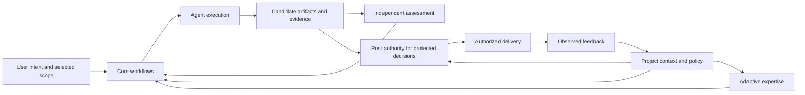

# Framework foundation

[Framework index](index.md) · [Decisions and iterations](roadmap-and-decisions.md)

## Purpose and ownership

DevForgeAI Adaptive Spec-Driven Engineering Framework supplies connected engineering guidance, project expertise, and executable guardrails. It supports an agent doing useful work with appropriate freedom while protecting user scope, project assets, evidence integrity, and truthful delivery claims. It does not prescribe every reasoning step, require an agent per phase, or treat an instruction to behave correctly as enforcement.

This document owns the framework vocabulary, architectural boundaries, and product intent. It is a planning baseline authorized in the 2026-09-15 conversation. Requirements below describe the intended framework; implementation readiness remains blocked by the named decisions in the linked capability documents. Existing packages are reusable assets, not proof that this complete architecture exists.

## Architecture and interfaces

| Part | Supplies | Consumes | Does not own |
| --- | --- | --- | --- |
| Core workflows | Reusable methods and artifact handoffs | User intent, selected work, project context | Product-specific facts invented from a persona |
| Project context and policy | Grounded business/technical facts, standards and allowed effects | Selected project evidence and explicit decisions | An editable substitute for protected authority |
| Adaptive expertise | Domain knowledge, specialized methods and bounded responsibilities | Core lineage, project facts, observed outcomes | Automatic permission to change a project or its policies |
| Agent execution | Investigation, proposals, candidate changes and observations | A selected task and relevant context | Self-issued protected acceptance |
| Rust guardrails | Validated protected operations and state transitions | Approved policy, authenticated requests, bound evidence | Guaranteeing successful reasoning or forcing an interrupted user to continue |

All parts exchange the work and artifact references defined in [work items](work-items-and-dependencies.md). They use one [project policy](project-context-and-policy.md) and one [authority boundary](guardrails-and-rust-runtime.md), rather than independent policy engines per skill. Knowledge retrieval supplies observations through [project knowledge](knowledge-and-continuity.md); it does not authorize actions.

The arrows describe information and decision dependencies, not automatic invocation or installation. Feedback enters review; it does not silently replace approved facts or policies.

## Codex and ChatGPT Pro operating boundary

The user requires the base framework to work through supported Codex capabilities with an individual ChatGPT Pro subscription. This is an acceptance constraint, not a claim that this account's every feature or model was inspected. The local Codex CLI supports ChatGPT subscription sign-in; API-key access is a separate usage-based path. The base design cannot require a paid API account, Enterprise administration, undocumented endpoints, extracted subscription credentials, or an always-running LLM service. [Official authentication](https://learn.chatgpt.com/docs/auth)

Pro usage is bounded by current account/model limits. Do not promise unlimited agents, tokens, concurrent sessions or automatic continuation after every interruption. Check actual host/account capability before selecting a feature; lack of evidence is an explicit gap. No silent API switch or paid-credit purchase is a fallback. [Official usage documentation](https://learn.chatgpt.com/docs/pricing)

Local Rust programs and ordinary project tools can support Codex without making direct LLM API calls. Required compilers, OS permissions and supported host features must nevertheless be declared and qualified. A protected service requiring a distinct OS identity needs an explicit local provisioning design; a Pro subscription does not supply that identity. The base workflow must not depend on an unproven protection/automation capability. Such a capability remains blocked for implementation readiness until resolved, with the dependent behavior and feasible advisory work recorded in [the ambiguity register](roadmap-and-decisions.md#ambiguity-register).

The current docs are incomplete planning contracts with named questions, not an aspirational feature list represented as deliverable. Every proposed base capability needs a supported terminal path, concrete dependencies, failure behavior and a native verification case before it can advance to implementation-ready.

## Canonical vocabulary

| Term | Meaning |
| --- | --- |
| Workflow / skill | A reusable way to perform a selected engineering responsibility; a skill is a host-packaged delivery of such guidance |
| Expertise | Evidence-backed project/domain knowledge and a distinct responsibility; it is not model training or a guarantee of competence |
| Subagent | An execution context to which a bounded task can be delegated; a role name is not a security principal |
| Policy | Selected, versioned standards and permitted-effect constraints with a recorded source of authority |
| Guardrail | An observable check or protected boundary with defined inputs, decisions and failure behavior |
| Candidate | Exact proposed bytes or other identified outputs under assessment |
| Evidence | Attributed observations bound to inputs, execution conditions and results; an observation is not permission |
| Readiness | Satisfaction of a named consumer's prerequisites, such as readiness for independent QA |
| Acceptance | A decision for an explicitly declared scope; protected framework acceptance requires its actual Rust authority |
| Qualification | Executed evidence for a named build, policy, host and capability; it is not universal support |

Work-item terminology and completion accounting are owned by [DFF-03](work-items-and-dependencies.md); execution/check/assessment states are owned by [DFF-08](quality-and-delivery.md). Documents must reference these owners rather than create conflicting definitions.

## Agreed boundaries

1. The managed product's language, stack, business domain, layout and quality policy are project inputs. Rust is mandatory for DevForgeAI framework runtime/authority implementation, not for every managed application.
2. Core capabilities cover the lifecycle, but a task enters at the appropriate point. An adequate existing specification is reused; a small defect does not require a new PRD merely to traverse a diagram.
3. Project specialization preserves reusable core ownership and recorded lineage. A new expert requires distinct useful responsibility; an organization chart is not a reason to generate dozens of workers.
4. Ordinary reasoning and authorized draft work remain flexible. Protected effects, evidence and declared completion are checked outside model-authored status text.
5. Guidance can be useful when optional services are absent. A protected operation cannot fall back to prose, Python authority, or an editable PASS when its required authority is unavailable.
6. Installation, operational updates, publication and delivery effects retain their applicable authorization boundaries. This documentation does not perform those effects.

## Connected walkthrough and failure cases

OrderDesk is a fictional example, not a discovered project. Its selected change permits cancellation before dispatch, denies cancellation after dispatch, and must not allow a cancellation/dispatch race to produce contradictory states. A business-analysis responsibility resolves the business boundary; architecture resolves concurrency and interface consequences; development implements the selected contract; independent QA challenges the race and boundary cases. These roles share the same facts and requirement identities.

A reviewer finding that the previous QA expert assumed a different cancellation rule records a contradiction and requests scoped realignment. It does not rewrite production policy. A passing cancellation unit test does not satisfy the race scenario or authorize deployment. A small defect with an existing contract can enter directly through investigation and repair, preserving those same downstream obligations.

## Existing assets and compatibility

The [adaptive builder contract](../../plan/skill-builder-adaptive-enhancement-spec.md) already distinguishes core, project variants and expertise. The [Rust design](../../plan/devforgeai-codex-rust-enforcement-design.md) separates guidance, evaluation and protected authority. Current [dev](../../../src/agents/skills/dev/SKILL.md) and [qa](../../../src/agents/skills/qa/SKILL.md) packages provide selected responsibilities, not the whole lifecycle. Their current policies are not silently superseded by this planning set; migration differences are recorded in [the roadmap](roadmap-and-decisions.md).

## Open decisions and next expansion

Resolve the minimal first-release capability set, supported host profiles, and the concrete boundary between advisory use and protected operation before defining an installer or runtime schema. Next, walk one brownfield change and one new-product idea through DFF-02/03/04/08, identifying every producer, consumer, blocking decision and permitted alternate entry. This is the first cross-capability check against silos.
