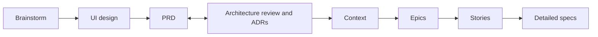

# ADR-007 — Add a UI design step between the brainstorm and the PRD

## Context and problem statement

The chain is brainstorm → prd ⇄ architecture → context → epic → story → spec (ADR-002, ADR-004 D5). A product with
screens has a gap at its start. A user can draw the whole release's screens in Claude Design as soon as the brainstorm has
converged, long before any story exists, and nothing in the chain records that work:

- the PRD's section 8 (User experience) can only link the canvas by a raw URL, and no skill reads the link;
- the architecture description's evidence can cite a research note about the screens, but not the screens themselves;
- `ui-mockups.md` (CTX-017) can name the canvas in its section 2, but its section 3 only indexes designs that a story
  records (SPEC-009 BEH-12), so a release-level design has no row;
- the story skill's design gate (SPEC-009 BEH-11) asks for a design one story at a time, and counts only a design that
  `ui-mockups.md` indexes or a story records, so the sixteen boards a user already drew do not count for any story.

**The evidence is one project's, not a hypothesis.** The OmniWatchAI (Krepion) session built a configuration-management
platform's mockup by hand, as sixteen boards in four flows, between its brainstorm and its PRD. Its spec page for this
step names four changes that came after the boards existed. Three came from documents the boards could not see, and one
from a review. In each case the project's own documents are named below as Krepion's, as they are not this repository's:

1. Krepion's ADR-009 (one write pipeline) lists the consequence: "Bad: a manual edit of a source-owned attribute surfaces as
   a conflict; the UI must say so and offer 'make manual authoritative for this attribute'". The boards show "authoritative"
   only on two of them (CI-Add and Discovery), for a source.
2. Krepion's ADR-007 (identity) lists the consequence: "Bad: MFA for SSO users relies on the provider's policy; Krepion
   enforces MFA itself only for local accounts and verifies the provider's MFA claim for admins where available". The boards
   predate that decision.
3. Krepion's PRD-001 FR-006 reads: "The system shall report data health as separate completeness, correctness and compliance
   scores plus a relationship-health score, using a staleness window set per class." The boards show one health score, and
   the brainstorm idea that asked for the split (IDEA-07) never reached the canvas.
4. Krepion's research note records: "Version 19 made the rail consistent: all ten inner screens show Home, CMDB, Monitor,
   Triage, Vault, Recover with Admin pinned at the bottom", and "Not yet reviewed visually". The change came from a review;
   no document had asked for it.

So the design of a release is not written once. It is recorded after the brainstorm, and it is amended when a PRD
requirement, an accepted ADR's consequence or a review names a screen.

**Bryan's decisions** (2026-10-08 and 2026-10-09; the quotes are his):
- One new skill for release design, after the brainstorm and before the PRD. Story-level design stays with the story skill.
- Its name: "release-design-ui-mockups is too long. stick with ui-mockups or ui", then "ui (Recommended)". `ui-mockups` would
  collide with `ui-mockups.md` (CTX-017). The command is `/devforgeai:ui`, lowercase: `/design` is Claude Code's
  built-in command and is not this skill.
- Scope: "UI will cover terminal screens such as CLI as i previously found it more useful than claude designing without
  claude design. claude design is so much nicer. our command will be /devforgeai:ui not /design".
- 2026-10-09, on the plan for this work: "Yes, add ADR-007 (Recommended)" and "Four cycles A–D (Recommended)".
- 2026-10-10, on version 1 of this ADR and of SPEC-017 (which said the skill never fetches the canvas and never uses
  `/design`): "that's wrong! /devforgeai:ui is meant to use /design this is the entire excercise/purpose of this skill. you
  proved to me that claude code terminal has design issues. the spec is wrong".
- 2026-10-10, after the platform probe below: "Option a is the path, based on your research": the skill drafts a brief from
  the brainstorm, creates the Claude Design canvas itself through the Artifact tool's Design type, the user iterates on the
  canvas, and the skill then imports the canvas's files into the repository and records the DSN.
- 2026-10-10, after comparing the probe's canvas with his first mockup: "Yes. Approved" (the flow as probed, with the fix
  to the skill's trigger description in the same version).
- 2026-10-10, on the independent review's four held questions: "Yes, that's Claude Design (Recommended)" (the session's
  model writes the first boards through the Design type from the confirmed brief, the user iterates in Claude Design, the
  skill imports what the user ends with; the path that the `/design` skill's own text prescribes: "Call the `Artifact` tool
  with `action: "quickstart"` and `intent: "design"` ..., then do what its result says: create the new Artifact from the type
  it names ... and fill it by following those instructions", shown in a session when Bryan invoked `/design` on 2026-10-06
  (the DevForgeAI Drive mockup); the terminal never stands in for the canvas); "Wait, with a way out (Recommended)" (after the canvas one question stays open, 'Import now' or 'Iterate
  later', which ends the run with the line that resumes it); "No fire in 9 of 10 runs (Recommended)" (the trigger cases that
  must not fire; recorded in SPEC-017 §9 as a departure from PRD-001 NFR-003's 3 runs); "Derived: a storyboard per flow
  (Recommended)" (the screens the ideas name are grouped into flows that the user confirms before any canvas, one brief for
  each confirmed flow, three directions of each flow's key screen first).

**What version 1 got wrong, and what the platform allows** (probed 2026-10-10; the record is in the plan
`tmp/plans/2026-10-09-ui-skill.md`, checkpoints 4d to 4f). Version 1 read "our command will be /devforgeai:ui not /design"
as "the skill never calls `/design`". Bryan meant that the command is `/devforgeai:ui` and that the skill exists to get real
Claude Design boards. The probe found:
- The Skill tool refuses `/design`: "Skill design cannot be used with Skill tool due to disable-model-invocation. Ask the
  user to run /design themselves — it cannot be invoked via the Skill tool. Do not replicate this skill's workflow by other
  means — it is reserved for explicit user invocation." So no skill can run the `/design` skill. The route chosen below is not
  that skill's workflow: it is the Artifact tool's own documented path for any new design (quickstart, publish, read), and it
  copies none of `/design`'s internals. But the refusal's last sentence states the platform's intent for `/design`, and a
  later platform change, or a classifier, could read a skill-made canvas as "replicating by other means". Bryan chose with the
  probe's output in front of him; the risk is recorded here, and the fallback is the user typing `/design` with the brief that
  the skill shows (SPEC-017 ERR-19 and ERR-23) and the skill importing the canvas by its URL.
- The Artifact tool's own instructions make every new design from its **Design type**: `quickstart` with `intent: design`
  (it lists the user's design systems and attaches the default one's README), then `publish` with the Design type and a
  title, writing `project/canvas.json` and one `project/<name>.dc.html` for each board. The canvas is a private page on the
  user's claude.ai account, and every publish and read result carries its version identifier.
- An Artifact `read` of `project/canvas.json` and the named boards, with an output folder, saves them in the repository.
  The result also returns each file's full text and its SHA-256.
- `claude -p`, which `claude plugin eval` runs, has no Artifact tool, and `/design` inside it is a different command.
- The first canvas made this way (three directions of a terminal screen, from a brief) was compared by Bryan with the
  mockup he had made by hand, and approved.

## Decision drivers

- **A release's screens exist before its stories.** The step must come early, from the brainstorm, and feed the PRD,
  architecture and context steps that follow.
- **The result must be a document the chain can cite and re-review,** with a version, so a later change shows as a
  suspect link (ADR-004 D6, templates README §2.6), not a URL a skill never opens.
- **The boards must be Claude Design boards** (Bryan, 2026-10-10): Claude drawing mockups in the terminal has design
  issues, and the skill exists to avoid them. The session's model writes the boards from a brief the user confirms (the
  probe's boards were written that way), and the Artifact tool's Design type hosts them as a Claude Design canvas where the
  user iterates: the canvas editor, comments, remixes. The skill never puts a mockup in a reply and never stands in for the
  canvas in the terminal (Bryan: "Yes, that's Claude Design (Recommended)"). What Bryan compared and approved was the probe's output, so a change of session model or of the
  type's instructions changes the boards, and is not a Claude Design regression.
- **The recording must stay qualifiable.** The eval sandbox has no Artifact tool, so the half that makes and imports the
  canvas cannot be graded there and is verified by hand. The half that records a DSN reads a committed copy of the boards
  (the same files the import leaves) and is graded on seeded copies; a live canvas changes under a run, so the DSN records
  the copy and the version it came from.
- **Decisions stay the user's** (PRD-001 FR-003): which flow to draw, the brief, which board shows which flow and which
  idea, and when a design is approved.
- **Sending content to claude.ai is outward-facing:** the brief and the boards made from it leave the repository, so the
  user confirms the brief first and the canvas stays private to the user's account.
- **Terminal screens count** (Bryan's scope). ADR-004 D2 already counts a CLI as a user interface (`front-end.md`
  covers "command structure, flags, output formats" for one).
- **The step must stay cheap when little changes,** as ADR-002 requires of the architecture step: a product with no screens
  skips it, and a re-run only amends.

## Considered options

1. **A `ui` skill between the brainstorm and the PRD that drafts a brief, makes the Claude Design canvas through the
   Artifact tool's Design type, imports the canvas's boards into the repository once the user has iterated on them, and
   writes a design document (DSN) from that committed copy, with one slot per brainstorm and an amend path.**
2. No step (the status quo): the PRD's section 8 links the canvas by URL, as Krepion's did.
3. Design inside the architecture step.
4. A separate design-story skill, for story-level design.
5. A second design slot after the PRD, for the changes the PRD and ADRs cause.
6. The skill that version 1 of this ADR chose: it records board files the user copies into the repository by hand, never
   touches the canvas and never uses `/design`. Bryan rejected it on 2026-10-10 ("the spec is wrong").
7. The skill drafts the brief and hands the user a `/design <brief>` line to type, then reads the canvas afterwards. The
   probe found this the only way to run the `/design` command itself, as the Skill tool refuses it. Bryan chose option 1's
   Artifact route instead ("Option a is the path, based on your research").

## Decision outcome

**Chosen option:** option 1, on Bryan's decisions of 2026-10-08, 2026-10-09 and 2026-10-10.
- Option 2 leaves four changes (evidence above) with no place to be recorded, and keeps a link that no skill reads.
- Option 3 enlarges the skill that was hardest to make reliable (ADR-004 option 2 gives the same reason), and puts a
  design before the PRD whose requirements it should follow. The architecture step also begins after the PRD.
- Option 4 duplicates SPEC-009: PRD-001 FR-016 and SPEC-009 BEH-11 and BEH-12 already give story-level design to the
  story skill (the design gate, the approved-design record).
- Option 5 puts the second look after the PRD, but the amend path already reaches the same result without a second
  skill step: a later run of the one skill amends the one document.
- Option 6 does not do what the skill is for: the boards would still be drawn by whoever has the time, and the skill would
  only file them.
- Option 7 leaves the canvas to a command the skill cannot run, so the user would type it. The Artifact route lets the skill
  make the canvas itself, read its version from the tool and import it. The brief serves both routes unchanged, and a
  run without the Artifact tool shows it so that the user can paste it into `/design` by hand (SPEC-017 ERR-19).

### D1. The chain

The workflow becomes brainstorm → **ui** → prd ⇄ architecture → context → epic → story → spec.

- The step is **optional.** A product with no screens, a library or a back-end service, goes from the brainstorm to
  the PRD as today. The brainstorm's hand-off recommends the step when a promoted idea names a screen, a flow or a user
  interface (SPEC-017 §13). It is never a gate, and the prd skill works with no DSN.
- ADR-002 and ADR-004 are not superseded. Where they list the chain, this order governs.

### D2. The document: a DSN

- **Type and place:** a design document, type `design`, ID prefix `DSN`, at `docs/specs/design/DSN-NNN.md`, with the
  common frontmatter and these design-specific fields: the canvas URL, the canvas version imported, the format of the copied
  `canvas.json`, and the boards folder (SPEC-017 §4).
- **Items:** one board item (`BRD-NN`) for each board of the canvas, numbered in canvas order and never renumbered. A flow's
  step order is a mapping the user confirms (the skill proposes it from the boards' positions on the canvas), recorded by the
  order of the flow's items in the DSN: neither the canvas's `order` list, which is the stacking order, nor the order of its keys
  is the step order. A board that leaves the canvas is deprecated, not deleted. A board names its file, title, flow, surface (`web`, `desktop`, `mobile` or
  `terminal`), the brainstorm ideas it illustrates, the PRD requirements and accepted ADRs it answers, and the digest of its file.
- **Provenance:** the common keys and links. The document derives from the brainstorm it was written from (`derives`, as a PRD
  does), and item links name the promoted ideas the boards illustrate. The requirements and ADRs a board answers are plain
  item fields, not links: the PRD's section 8 links the DSN, so a link back would make each bump the other's suspect link for
  ever (SPEC-017 §13, w).
- **No design system.** The DSN holds the screen designs. The conventions, including the design system's tokens, stay in
  `front-end.md`, where ADR-004 D2 puts "the design system" (the Krepion session's page states the same scope:
  front-end.md keeps the conventions, the DSN holds the screen designs). The DSN carries no tokens block, so there is one
  owner and no second place to drift.

### D3. The skill makes the canvas in Claude Design, imports its boards, and records the committed copy

*Version 1 said the skill never fetches the canvas and never uses `/design`. Bryan reversed that on 2026-10-10 (Context).*
- **The canvas is made through the Artifact tool's Design type, from a brief the user confirms.** The skill lists the screens
  that the brainstorm's promoted ideas name, proposes how they group into flows, and has the user confirm the grouping
  before any canvas (the skill never decides the flows); it then drafts one brief for each confirmed flow (a single confirmed
  flow gives one brief for the whole release), in the shape of Anthropic's guidance for Claude Design (a line saying what and
  for whom; the context and the one job; real content, the flow's screens in order and the states to show; two to four hard
  constraints; the style by reference to the user's design system; a request for three distinctly different directions of the
  flow's key screen first). The user confirms the briefs, because they are a decision and they leave the repository. The
  number of screens is not known up front: the brainstorm gives the first count, and PRD requirements and accepted ADRs'
  consequences add more through the amend path. The skill then makes the canvas
  as the tool's instructions for the Design type say, and gives the user the link: the session's model writes the board files
  from the confirmed brief in the session's scratchpad, never in the repository, and publishes them through the Design type,
  which hosts them as the canvas. It never invokes the `/design` skill (the Skill tool refuses it), never puts a mockup of a
  screen in a reply, and never stands in for the canvas: a board exists only as a file of the canvas.
- **The user iterates on the canvas,** which has one row for each flow (picks a direction for each flow, asks Claude Design to
  carry it across the flow's other screens and for more variants, deletes the boards not wanted): the DSN records every board
  the canvas holds when it is imported, and within a flow the step order is the user's to confirm. After the canvas, one question
  stays open, 'Import now' or 'Iterate later'; 'Iterate later' ends the run with the line that resumes it, and nothing is
  written in the repository until the import.
- **The skill imports the canvas into the repository.** It reads `project/canvas.json` and the boards it names through the
  Artifact tool, and places them in `docs/specs/design/DSN-NNN/boards/`: a `canvas.json` and the board files it names, read
  by contract (SPEC-017 DM-04). The canvas version comes from the tool's result, never from the user.
- **The DSN records the committed copy,** not the live canvas: the canvas URL, the version imported, and a digest for
  each board. A run without the Artifact tool still records a copy that is already in the folder, says that it could not
  check the canvas, and takes a version only if the request states it, else null with a marker (the skill never asks for it).
  That is how the recording half is graded headless.
- The skill's own writes in the repository are the DSN and the boards copy it imports; the files it publishes are written in
  the session's scratchpad. The canvas changes only through the Design type, by the skill's publish of a confirmed brief, and
  the skill never shares, pins or deletes it.

### D4. One slot, re-runnable

- One DSN per brainstorm. A run for a brainstorm that no active DSN cites **creates** the DSN. A run for one an active
  DSN cites **amends** it: version plus one, a Change Log row, and every unconfirmed change asked about.
- An amend run also reads the PRDs and accepted ADRs, read-only, for requirements and consequences that name a screen, so
  a change they cause (the evidence above) reaches the boards' list as a proposal. Three things prompt an amend: a revision
  right after the brainstorm, a PRD extension that names a screen, and an accepted ADR's consequence (SPEC-017 §6 gives an
  example of each). In every case the user iterates on the canvas, or has the skill add a screen to it from a brief the user
  confirms, and the skill imports the canvas again; a board changed on the canvas and not imported again never reaches the
  DSN.
- There is no second slot after the PRD (option 5): the amend path is the second look.
- The skill watches nothing: a run happens when the user starts it, usually prompted by the report of the prd or
  architecture skill (D5).

### D5. A bumped DSN is a suspect upstream

- The prd, architecture and context skills each re-review a bumped DSN, as they do any suspect upstream (ADR-004 D6). The
  documents are the PRD's section 8, the architecture description's evidence record for the DSN and `ui-mockups.md`'s
  section 2.
- **The ui skill edits none of those documents.** After an amend it reports which documents cite the DSN at an older
  version and which skill owns each, and it starts none of them.
- When a PRD change, or an accepted ADR's consequence, names a screen, the prd and architecture skills' reports name
  `/devforgeai:ui` to amend the DSN. They never amend it.
- A board decides no architecture question. The DSN is evidence for the architecture step, never a decision (ADR-003, the
  paragraph after A1: observed practice is not policy).
- **This ADR extends two decisions of ADR-004 and leaves ADR-004 at version 2.** It adds the DSN to the inputs of the context
  step (ADR-004 D5, which lists the ARCH, accepted ADRs, approved policy, bounded inspection and an interview) and to the links
  a context document may carry for its design-system section (D6, which names the ARCH and ADRs): `ui-mockups.md` section 2
  cites the DSN. ADR-007 is the authority for both, as it is for the PRD's and the ARCH's reading of a DSN. The alternative is
  an ADR-004 version 3 at cycle C, for Bryan to choose (Open).

### D6. Story-level design stays with the story skill

- SPEC-009 keeps BEH-11 (the design gate) and BEH-12 (the approved-design record). Its next version adds the check of each
  export's path (it exists, ends in `.png` or `.pdf`, and lies under `docs/specs/story/design/STORY-NNN/`), and the DSN as
  an input, reached through the PRD's section 8.
- The user exports by hand and names the files. The framework gets no browser-automation dependency.
- Version 2 of this ADR changes nothing here. Whether the story skill should also make a story's canvas through the Design
  type, instead of writing a brief for the user to run, is not decided by it (SPEC-009 §13).
- A story's approved design is its own record, and `ui-mockups.md` section 3 indexes it as today. A DSN's boards are never
  indexed as approved story designs.

### D7. Who decides what

The skill proposes and the user decides: which flow to draw, the brief that goes to Claude Design, which board belongs to
which flow and which promoted idea, which boards change in an amend run, and the approval of the DSN, on the user's explicit
words and with a named approver. A mapping the user has not confirmed is written as unknown (`null`) with a marker, never
as a guess. The skill sends nothing to claude.ai before the user has confirmed the brief.

### Consequences

- **Good:** the release's screens have one versioned, citable home. A change that comes after the boards shows as a suspect
  link in the documents that rely on them, and one run of one skill amends them.
- **Good:** the boards are real Claude Design boards, made from a brief that follows Anthropic's guidance, not mockups
  drawn in the terminal (Bryan, 2026-10-10).
- **Good:** the recording half is evaluated headless on seeded copies of the boards, and stays deterministic.
- **Good:** CLI and other terminal screens get the same design record as graphical ones.
- **Good:** story-level design keeps its one owner (SPEC-009).
- **Bad:** one more skill and one more step in the chain. Mitigated: it is optional, and a re-run only amends.
- **Bad:** the half that makes and imports the canvas cannot run in the eval sandbox, which has no Artifact tool. It is
  verified by hand (SPEC-017 §9), and a regression there shows only in a manual run.
- **Bad:** the skill depends on the Artifact tool's Design type and on Claude Design's undocumented `canvas.json` (format 3
  only), and both can change. Mitigated: an unknown format stops the run (SPEC-017 ERR-05), and the DSN records the copy.
- **Bad:** the boards' quality depends on the session's model and on the Design type's instructions, not on Claude Design's
  own generation; the user iterates on the canvas (editor, comments, remixes), and a change of model or of instructions is
  not a regression of the platform.
- **Bad:** the Skill tool's refusal says "Do not replicate this skill's workflow by other means" (Context). The route is the
  Artifact tool's own, but a platform change could close it; the fallback is the user typing `/design` with the brief and the
  skill importing by URL.
- **Bad:** the brief and the boards leave the repository for the user's claude.ai account. Mitigated: the user confirms the
  brief first, the canvas is private, and the skill never shares it.
- **Bad:** the import puts the boards' full text into the session's context. Reading at most 4 boards a call limits one
  call, not the total, which is unknown until a canvas of sixteen boards is imported by hand (SPEC-017 VER-47).
- **Bad:** the neighbouring skills change, and each change needs its skill requalified (cycle C below).
- **Bad:** it adds a document type and two ID prefixes (`DSN`, `BRD`) to the shared vocabulary.

**Follow-up work this ADR requires** (each needs Bryan's yes; the cycles are Bryan's choice of 2026-10-09):
- **Cycle A (this change, documents only):** this ADR; PRD-001 version 13 (FR-023); SPEC-017, the ui skill's spec (SKL-013
  reserved); SPEC-009 version 3; `src/schemas/design.schema.json`.
- **Cycle B (the build):** SKL-013, the ui skill, its eval suite and the next plugin version. The same change adds the DSN
  template and the templates README rows for it: §1.2, §2.1 and §2.5, and a DSN → BRN `derives` pair in §2.4 (`derives` is PRD
  → BRN only today), as ADR-004's follow-up M2 did for `CTX`. Until cycle C, the skill's hand-off tells the user to link the
  DSN in the PRD's section 8 by hand, and after an amend to review the documents that cite it against the new version by hand (SPEC-017 BEH-18).
  **Version 2 of this ADR (2026-10-10)** sends cycle B back to the build: the skill built to SPEC-017 version 1 (draft PR
  #110, held) is reworked to SPEC-017 version 2. The checker, the template and the recording half carry over; the brief,
  the canvas, the import and the trigger description are new (SPEC-017 §11).
- **Cycle C (the neighbours), each with a requalification:** SPEC-001 and SKL-001 (the brainstorm's hand-off names the ui
  step); SPEC-002 and SKL-002 (the PRD's section 8 links the DSN, and the hand-off after an extension names the ui step
  when a requirement names a screen); SPEC-003 and SKL-003 (the DSN as evidence, and the report's hand-off); SPEC-011 and
  SKL-010 (the context step re-reviews a bumped DSN). The shared schemas change in this cycle too: `DSN` joins the document
  ID pattern and `BRD` the item ID pattern in `common.schema.json`, in the byte-identical copies the prd, architecture and
  context skills carry (`src/tests/prd/test_shared_files.py`) and in the one inline copy of the ID list in
  `brainstorm.schema.json`. The cycle also removes the exemption that cycle B's eval fixtures need for the documents that
  cite a DSN (SPEC-017 §9), restores the hand-off wording of the page (SPEC-017 version 3, the first after the build), and
  lets SPEC-003 version 12 decide how the architecture description records a DSN.
- **Cycle D (the dashboard):** SPEC-016 version 4, an eighth tile for the ui phase, and the dashboard pane, which waits
  for this step's place in the chain. SPEC-012 version 19 (BEH-13 and `evaluate.py` order the chain without `ui`) is a
  candidate, decided when cycle D starts; until then the tracker gives a ui run no `next` and the brainstorm's `next` stays
  `prd`, on purpose, since the step is optional.
- **Not changed by this decision:** the research step (the six notes in `docs/research/` are input, and the user said the
  research "will be slated for another skill"), the epic skill, the decision rules and the other ADRs, and the boards
  themselves. `chain_state.py` lists documents of any folder under `docs/specs/`, so `design/` needs no change there.

### Confirmation

**Structural:** `src/schemas/design.schema.json` validates a DSN's frontmatter and board items; SPEC-017 validates against
`spec.schema.json` with every behaviour, error and quality item covered by a verification item.

**Behavioural** (planned): SPEC-017's eval suite, generated in cycle B, writes a DSN from fixture boards and a converged
brainstorm, amends it when a board file changes, drafts a brief in the guidance's shape, stops with a clear message when
the boards are unreadable or of an unknown format, or when there are neither boards nor an Artifact tool, writes no mapping
the user did not confirm, and names `/devforgeai:prd` as the next step. Those cases run headless on seeded copies. The
half that needs the Artifact tool (confirming the brief, making the canvas, importing it, re-importing it in an amend run)
cannot run there: SPEC-017's manual items verify it, live, on a real canvas. Cycle C's cases cover each neighbour's new
sentence. Version 1's suite has run (SPEC-017 §9) against the old rule; it does not qualify version 2.

## Pros and cons of the options

### Option 1: a `ui` skill and a DSN
- Good, because it gives the release's screens a versioned home that the chain can re-review.
- Good, because the boards are real Claude Design boards, made from a confirmed brief (Bryan, 2026-10-10).
- Good, because the DSN records a committed copy, so the recording half is deterministic and evaluable.
- Bad, because it adds a skill, a document type and a dependency on the Artifact tool, changes four neighbours, and leaves
  the canvas half to manual verification.

### Option 6: record boards the user copies by hand (version 1)
- Good, because it was fully evaluable and needed no outside tool.
- Bad, because it does not get Claude Design boards made, which is what the skill is for (Bryan, 2026-10-10).

### Option 7: hand the user a `/design` line
- Good, because it runs the real command.
- Bad, because the Skill tool refuses it: the user types it and brings the canvas back, and the skill does not make the
  canvas Bryan wants made for him.

### Option 2: no step
- Good, because nothing changes.
- Bad, because the screens stay a URL that no skill reads, and the changes that come after them have nowhere to go.

### Option 3: design inside the architecture step
- Good, because there is one step fewer.
- Bad, because it follows the PRD, so the PRD cannot cite it, and it enlarges the skill that was hardest to make reliable.

### Option 4: a design-story skill
- Good, because a story's design would have its own skill.
- Bad, because SPEC-009 already owns it, and two skills would write the same record.

### Option 5: a second slot after the PRD
- Good, because the PRD's requirements would be known.
- Bad, because the amend path already does it, and the PRD would have no design to link when it is written.

## Open

Choices the drafter made beyond Bryan's quoted words, accepted by Bryan on 2026-10-09 ('Approve all (Recommended)'):
- **The step is optional,** not a gate (D1). Source: the page's hand-off rule, which recommends the step only when a promoted
  idea names a screen.
- **One DSN holds one brainstorm's design** (D4). A design for two brainstorms is two DSNs; this is recorded in SPEC-017 §13.
- **A board's requirement and ADR references are plain fields, not links** (D2), and **an amend of a draft DSN raises its
  version too** (SPEC-017 §13, u and w).
- **An amended approved DSN returns to review** (SPEC-017 BEH-13), as the prd skill does for an extended PRD (SPEC-002
  BEH-09).
- **ADR-004 stays at version 2** (D5), with ADR-007 as the authority for the context step reading a DSN; ADR-002 needs no bump.
- **One direction in each pair of citations:** SPEC-009 and SPEC-017 cite this ADR, and this ADR names them in prose, so a
  bump of either never leaves the other's link suspect (SPEC-017 §13, z).
- **The DSN carries no tokens** (D2): the page's draft had a tokens block that `front-end.md` section 6 would copy, which
  contradicts "front-end.md keeps the conventions". The other choices are in SPEC-017 §13.
- **The evidence is one project's.** The four cases are Krepion's and are quoted above. They show the need; they do not size
  it for projects without screens.
- **This ADR changes the chain without superseding ADR-002 or ADR-004,** which list the chain as it stood. If Bryan wants
  those two records to say so, it is a version bump of each (ADR-004 has `version: 2`).

Version 2's choices, beyond Bryan's quoted words of 2026-10-10, for his accept or challenge; (ak), (al), (as) and (au) carry
his later answers (each has its alternative in SPEC-017 §13, items ak to az):
- **The run waits at one open question, with a way out** (Bryan, "Wait, with a way out (Recommended)"): 'Import now' or
  'Iterate later'; 'Iterate later' ends the run with the exact line that resumes it, carrying the canvas URL. No DSN is
  written until boards are imported, so the URL is not stored anywhere between the runs.
- **A storyboard for each flow, one canvas for one DSN** (Bryan, "Derived: a storyboard per flow (Recommended)"): the user
  confirms the grouping of screens into flows before any canvas, one brief for each confirmed flow, one row for each flow on
  the canvas; flows and screens are added later through the amend path.
- **A copy already in the boards folder is recorded as it is,** with or without the Artifact tool. Without the tool and
  without a copy the run stops (SPEC-017 ERR-19). That keeps the recording half evaluable, and the old hand-copy route
  working.
- **The import stages in `project/` and a checker subcommand places the files in `boards/`,** because the tool saves a
  published path under the output folder and the checker's folder is `boards/`.
- **A board whose path has a folder segment is refused,** and the user renames it on the canvas.
- **The brief is not recorded in the DSN:** it is shown, confirmed and sent to the canvas, and the run that resumes an
  earlier one could not quote it. This is an open question for Bryan (SPEC-017 §13), not a settled choice: the brief is a
  decision (D7) that leaves the repository, and nothing in the repository shows what was asked.
- **Version 2 reverses D3 in place; the templates README (§2.5) says an ADR is changed by a new ADR that supersedes it.**
  Repository practice is in-place versions of accepted ADRs on Bryan's word (ADR-001 version 4, ADR-004 version 2, ADR-006
  version 2), but none of them reversed a decision. The alternative is an ADR-008 that supersedes ADR-007 and restates D1, D2
  and D4 to D7 unchanged: it would mark ADR-007 superseded, and every link to it (PRD-001, SPEC-009, SPEC-017, CLAUDE.md, the
  context links) would move, for one changed decision, with the Status history row already recording the reversal. Bryan
  chooses; this draft keeps ADR-007 in place and `accepted`, as ADR-006 version 2 did while it awaited acceptance.

## Status history

| Date | Status | Note |
|---|---|---|
| 2026-10-09 | proposed | Drafted from Bryan's decisions of 2026-10-08 and 2026-10-09 and the Krepion session's spec page (version 6); cycle A of four |
| 2026-10-09 | proposed | Revised before Bryan's review after an independent review: the four cases quoted, ADR-004 D5 and D6 extended by D5, the tracker's `next`, one direction of citation |
| 2026-10-09 | accepted | Accepted by Bryan ('Approve all (Recommended)': ADR-007, SPEC-017 version 1, PRD-001 version 13 and SPEC-009 version 3, with every drafter's choice as recommended: FR-023 should and current, ADR-004 extended at version 2, one direction of citation, canvas format 3 only, the approval command, `ui` out of the tracker's `next`, the shared approved-design line, `considered`, the `head` subcommand, no tokens in the DSN, the cycle B hand-off wording, and the report-only check deferred to version 2) |
| 2026-10-10 | accepted | Version 2, by claude-code (session 7637882f-b2ec-465e-988a-9602340d1023), on Bryan's decisions of 2026-10-10 ("that's wrong! /devforgeai:ui is meant to use /design this is the entire excercise/purpose of this skill. you proved to me that claude code terminal has design issues. the spec is wrong"; "Option a is the path, based on your research"; "Yes. Approved"): D3 reversed, so the skill drafts a brief, makes the canvas through the Artifact tool's Design type, imports its boards and records the copy; the context, drivers, options 6 and 7, D4, D6, D7, the consequences, the confirmation and the follow-up work follow. The status stays accepted, as ADR-006's did while its version 2 awaited acceptance, because D1, D2 and D4 to D7 stand; the revised text awaits Bryan's acceptance. PRD-001 version 14 (FR-023), SPEC-017 version 2 and SPEC-009 version 4 are drafted with it |
| 2026-10-10 | accepted | Version 2, fix round 2, after the independent review of the drafts (`tmp/plans/ui-skill/review-drafts-v2.md`): who writes the boards is said plainly (the session's model, hosted by the Design type), the Skill tool's refusal is quoted in full with the risk and the fallback, the batches line no longer claims a bound, and the Open list carries the ADR-008 alternative and the brief as an open question. No decision changes |
| 2026-10-10 | accepted | Version 2, fix round 3, on Bryan's answers of 2026-10-10 to the independent review's four held questions ("Yes, that's Claude Design (Recommended)"; "Wait, with a way out (Recommended)"; "No fire in 9 of 10 runs (Recommended)"; "Derived: a storyboard per flow (Recommended)"): D3 now has the user confirm a grouping of screens into flows before any canvas, one brief for each confirmed flow, a canvas row for each flow, and one open question after the canvas ('Import now' or 'Iterate later'). No decision of D1, D2 or D4 to D7 changes |
| 2026-10-10 | accepted | Version 2, fix round 4, after the re-review: the step order of a flow is a mapping the user confirms and the DSN records by the order of its items (D2, D3); the `/design` skill's own text is cited for the Artifact path (Context); the first canvas is capped at 3 boards for each flow and 4 flows. No decision of D1, D2 or D4 to D7 changes |
