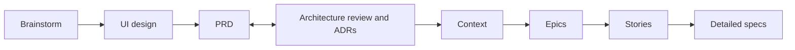

# ADR-007 — Add a UI design step between the brainstorm and the PRD

## Context and problem statement

The chain is brainstorm → prd ⇄ architecture → context → epic → story → spec (ADR-002, ADR-004 D5). A product with
screens has a gap at its start. A user can draw the whole release's screens in Claude Design as soon as the brainstorm has
converged, long before any story exists, and nothing in the chain records that work:

- the PRD's section 8 (User experience) can only link the canvas by a raw URL, and no skill reads the link;
- the architecture description's evidence can cite a research note about the screens, but not the screens themselves;
- `ui-mockups.md` (CTX-017) can name the canvas in its section 2, but its section 3 only indexes designs that a story
  records (SPEC-009 BEH-12), so a release-level design has no row;
- the story skill's design gate (SPEC-009 BEH-11) asks for a design one story at a time, and counts only a design that
  `ui-mockups.md` indexes or a story records, so the sixteen boards a user already drew do not count for any story.

**The evidence is one project's, not a hypothesis.** The OmniWatchAI (Krepion) session built a configuration-management
platform's mockup by hand, as sixteen boards in four flows, between its brainstorm and its PRD. Its spec page for this
step names four changes that came after the boards existed. Three came from documents the boards could not see, and one
from a review. In each case the project's own documents are named below as Krepion's, as they are not this repository's:

1. Krepion's ADR-009 (one write pipeline) has a consequence that the UI must say when a manual edit of a source-owned
   attribute conflicts, and offer "make manual authoritative for this attribute". The boards show "authoritative" only on
   two of them (CI-Add and Discovery), for a source.
2. Krepion's ADR-007 (identity) has a consequence that MFA for SSO users relies on the provider's policy. The boards
   predate that decision.
3. Krepion's PRD-001 FR-006 requires separate completeness, correctness and compliance scores plus a relationship-health
   score. The boards show one health score, and the brainstorm idea that asked for the split (IDEA-07) never reached the
   canvas.
4. A review of the navigation rail made it consistent across the ten inner screens (canvas version 19). No document had
   asked for it, and a rendered visual review at desktop and phone widths was still pending.

So the design of a release is not written once. It is recorded after the brainstorm, and it is amended when a PRD
requirement, an accepted ADR's consequence or a review names a screen.

**Bryan's decisions** (2026-10-08 and 2026-10-09; the quotes are his):
- One new skill for release design, after the brainstorm and before the PRD. Story-level design stays with the story skill.
- Its name: "release-design-ui-mockups is too long. stick with ui-mockups or ui", then "ui (Recommended)". `ui-mockups` would
  collide with `ui-mockups.md` (CTX-017). The command is `/devforgeai:ui`, lowercase: `/design` is Claude Code's
  built-in command and is not this skill.
- Scope: "UI will cover terminal screens such as CLI as i previously found it more useful than claude designing without
  claude design. claude design is so much nicer. our command will be /devforgeai:ui not /design".
- 2026-10-09, on the plan for this work: "Yes, add ADR-007 (Recommended)" and "Four cycles A–D (Recommended)".

## Decision drivers

- **A release's screens exist before its stories.** The step must come early, from the brainstorm, and feed the PRD,
  architecture and context steps that follow.
- **The result must be a document the chain can cite and re-review,** with a version, so a later change shows as a
  suspect link (ADR-004 D6, templates README §2.6), not a URL a skill never opens.
- **The skill must be qualifiable.** The eval sandbox cannot reach a private design canvas, so a skill that read the
  canvas could not be evaluated, and a live canvas changes under it.
- **No documented interface lets a skill drive Claude Design** (SPEC-009 §2, "calling `/design`"). The user draws the
  boards; the skill reads what they leave in the repository.
- **Decisions stay the user's** (PRD-001 FR-003): which board shows which flow and which idea, and when a design is
  approved.
- **Terminal screens count** (Bryan's scope). ADR-004 D2 already counts a CLI as a user interface (`front-end.md`
  covers "command structure, flags, output formats" for one).
- **The step must stay cheap when little changes,** as ADR-002 requires of the architecture step: a product with no screens
  skips it, and a re-run only amends.

## Considered options

1. **A `ui` skill between the brainstorm and the PRD, writing a design document (DSN) from board files committed to the
   repository, with one slot per brainstorm and an amend path.**
2. No step (the status quo): the PRD's section 8 links the canvas by URL, as Krepion's did.
3. Design inside the architecture step.
4. A separate design-story skill, for story-level design.
5. A second design slot after the PRD, for the changes the PRD and ADRs cause.

## Decision outcome

**Chosen option:** option 1, on Bryan's decisions of 2026-10-08 and 2026-10-09.
- Option 2 leaves four changes (evidence above) with no place to be recorded, and keeps a link that no skill reads.
- Option 3 enlarges the skill that was hardest to make reliable (ADR-004 option 2 gives the same reason), and puts a
  design before the PRD whose requirements it should follow. The architecture step also begins after the PRD.
- Option 4 duplicates SPEC-009: PRD-001 FR-016 and SPEC-009 BEH-11 and BEH-12 already give story-level design to the
  story skill (the design gate, the approved-design record).
- Option 5 puts the second look after the PRD, but the amend path already reaches the same result without a second
  skill step: a later run of the one skill amends the one document.

### D1. The chain

The workflow becomes brainstorm → **ui** → prd ⇄ architecture → context → epic → story → spec.

- The step is **optional.** A product with no screens, a library or a back-end service, goes from the brainstorm to
  the PRD as today. The brainstorm's hand-off recommends the step when a promoted idea names a screen, a flow or a user
  interface (SPEC-017 §13). It is never a gate, and the prd skill works with no DSN.
- ADR-002 and ADR-004 are not superseded. Where they list the chain, this order governs.

### D2. The document: a DSN

- **Type and place:** a design document, type `design`, ID prefix `DSN`, at `docs/specs/design/DSN-NNN.md`, with the
  common frontmatter and these design-specific fields: the canvas URL, the canvas version copied, the format of the copied
  `canvas.json`, and the boards folder (SPEC-017 §4).
- **Items:** one board item (`BRD-NN`) for each board of the canvas, in canvas order, never renumbered. A board that
  leaves the canvas is deprecated, not deleted. A board names its file, title, flow, surface (`web`, `desktop`, `mobile` or
  `terminal`), the brainstorm ideas it illustrates, the PRD requirements and accepted ADRs it answers, and the digest of its file.
- **Provenance:** the common keys and links. The document derives from the brainstorm it was written from (`derives`, as a PRD
  does), and item links name the promoted ideas the boards illustrate. The requirements and ADRs a board answers are plain
  item fields, not links: the PRD's section 8 links the DSN, so a link back would make each bump the other's suspect link for
  ever (SPEC-017 §13, w).
- **No design system.** The DSN holds the screen designs. The conventions, including the design system's tokens, stay in
  `front-end.md`, where ADR-004 D2 puts "the design system" (the Krepion session's page states the same scope:
  front-end.md keeps the conventions, the DSN holds the screen designs). The DSN carries no tokens block, so there is one
  owner and no second place to drift.

### D3. The boards are committed files, read by contract

- The boards live in `docs/specs/design/DSN-NNN/boards/`: a `canvas.json` and the board files it names. The user, or a
  session at the user's request, copies them there from the canvas. The skill reads `canvas.json`, then each board file it
  names, and stops with a clear message when the folder is missing or empty. **It never fetches from the canvas.**
- The reasons are Bryan's decision of 2026-10-08, and the drivers above: only repository files let the skill be
  evaluated, and a committed copy is deterministic where the live canvas changes.
- The DSN records the canvas URL and the canvas version copied. A new copy of the boards means a new run, which amends the
  DSN and bumps its version.
- The skill never draws a board and never calls `/design`.

### D4. One slot, re-runnable

- One DSN per brainstorm. A run for a brainstorm that no active DSN cites **creates** the DSN. A run for one an active
  DSN cites **amends** it: version plus one, a Change Log row, and every unconfirmed change asked about.
- An amend run also reads the PRDs and accepted ADRs, read-only, for requirements and consequences that name a screen, so
  a change they cause (the evidence above) reaches the boards' list as a proposal. Three things prompt an amend: a revision
  right after the brainstorm, a PRD extension that names a screen, and an accepted ADR's consequence (SPEC-017 §6 gives an
  example of each). In every case the user draws in Claude Design and copies the boards again; a board changed on the
  canvas and not copied again never reaches the skill.
- There is no second slot after the PRD (option 5): the amend path is the second look.
- The skill watches nothing: a run happens when the user starts it, usually prompted by the report of the prd or
  architecture skill (D5).

### D5. A bumped DSN is a suspect upstream

- The prd, architecture and context skills each re-review a bumped DSN, as they do any suspect upstream (ADR-004 D6). The
  documents are the PRD's section 8, the architecture description's evidence record for the DSN and `ui-mockups.md`'s
  section 2.
- **The ui skill edits none of those documents.** After an amend it reports which documents cite the DSN at an older
  version and which skill owns each, and it starts none of them.
- When a PRD change, or an accepted ADR's consequence, names a screen, the prd and architecture skills' reports name
  `/devforgeai:ui` to amend the DSN. They never amend it.
- A board decides no architecture question. The DSN is evidence for the architecture step, never a decision (ADR-003 A1).

### D6. Story-level design stays with the story skill

- SPEC-009 keeps BEH-11 (the design gate) and BEH-12 (the approved-design record). Its next version adds the check of each
  export's path (it exists, ends in `.png` or `.pdf`, and lies under `docs/specs/story/design/STORY-NNN/`), and the DSN as
  an input, reached through the PRD's section 8.
- The user exports by hand and names the files. The framework gets no browser-automation dependency.
- A story's approved design is its own record, and `ui-mockups.md` section 3 indexes it as today. A DSN's boards are never
  indexed as approved story designs.

### D7. Who decides what

The skill proposes and the user decides: which board belongs to which flow and which promoted idea, which boards change in
an amend run, and the approval of the DSN, on the user's explicit words and with a named approver. A mapping the user has
not confirmed is written as unknown (`null`) with a marker, never as a guess.

### Consequences

- **Good:** the release's screens have one versioned, citable home. A change that comes after the boards shows as a suspect
  link in the documents that rely on them, and one run of one skill amends them.
- **Good:** the skill can be evaluated, because it reads repository files, and it stays deterministic.
- **Good:** CLI and other terminal screens get the same design record as graphical ones.
- **Good:** story-level design keeps its one owner (SPEC-009).
- **Bad:** one more skill and one more step in the chain. Mitigated: it is optional, and a re-run only amends.
- **Bad:** a manual copy step. Mitigated: the skill's stop message names the exact folder and the next free DSN number.
- **Bad:** the neighbouring skills change, and each change needs its skill requalified (cycle C below).
- **Bad:** it adds a document type and two ID prefixes (`DSN`, `BRD`) to the shared vocabulary.

**Follow-up work this ADR requires** (each needs Bryan's yes; the cycles are Bryan's choice of 2026-10-09):
- **Cycle A (this change, documents only):** this ADR; PRD-001 version 13 (FR-023); SPEC-017, the ui skill's spec (SKL-013
  reserved); SPEC-009 version 3; `src/schemas/design.schema.json`.
- **Cycle B (the build):** SKL-013, the ui skill, its eval suite and the next plugin version. The same change adds the DSN
  template and the templates README rows for it: §1.2 and §2.1, and a DSN → BRN `derives` pair in §2.4 (`derives` is PRD →
  BRN only today), as ADR-004's follow-up M2 did for `CTX`.
- **Cycle C (the neighbours), each with a requalification:** SPEC-001 and SKL-001 (the brainstorm's hand-off names the ui
  step); SPEC-002 and SKL-002 (the PRD's section 8 links the DSN, and the hand-off after an extension names the ui step
  when a requirement names a screen); SPEC-003 and SKL-003 (the DSN as evidence, and the report's hand-off); SPEC-011 and
  SKL-010 (the context step re-reviews a bumped DSN). The shared schemas change in this cycle too: `DSN` joins the document
  ID pattern and `BRD` the item ID pattern in `common.schema.json`, in the byte-identical copies the prd, architecture and
  context skills carry (`src/tests/prd/test_shared_files.py`) and in the one inline copy of the ID list in
  `brainstorm.schema.json`.
- **Cycle D (the dashboard):** SPEC-016 version 4, an eighth tile for the ui phase, and the dashboard pane, which waits
  for this step's place in the chain.
- **Not changed by this decision:** the research step (the six notes in `docs/research/` are input, and the user said the
  research "will be slated for another skill"), the epic skill, the decision rules and the other ADRs, and the boards
  themselves. `chain_state.py` lists documents of any folder under `docs/specs/`, so `design/` needs no change there.

### Confirmation

**Structural:** `src/schemas/design.schema.json` validates a DSN's frontmatter and board items; SPEC-017 validates against
`spec.schema.json` with every behaviour, error and quality item covered by a verification item.

**Behavioural** (planned; nothing has run): SPEC-017's eval suite, generated in cycle B, writes a DSN from fixture boards
and a converged brainstorm, amends it when a board file changes, stops with a clear message when the boards are missing,
unreadable or of an unknown format, writes no mapping the user did not confirm, and names `/devforgeai:prd` as the next
step; cycle C's cases cover each neighbour's new sentence.

## Pros and cons of the options

### Option 1: a `ui` skill and a DSN
- Good, because it gives the release's screens a versioned home that the chain can re-review.
- Good, because boards read from files make the skill deterministic and evaluable.
- Bad, because it adds a skill, a document type and a copy step, and changes four neighbours.

### Option 2: no step
- Good, because nothing changes.
- Bad, because the screens stay a URL that no skill reads, and the changes that come after them have nowhere to go.

### Option 3: design inside the architecture step
- Good, because there is one step fewer.
- Bad, because it follows the PRD, so the PRD cannot cite it, and it enlarges the skill that was hardest to make reliable.

### Option 4: a design-story skill
- Good, because a story's design would have its own skill.
- Bad, because SPEC-009 already owns it, and two skills would write the same record.

### Option 5: a second slot after the PRD
- Good, because the PRD's requirements would be known.
- Bad, because the amend path already does it, and the PRD would have no design to link when it is written.

## Open

Choices the drafter made beyond Bryan's quoted words, for his accept or challenge:
- **The step is optional,** not a gate (D1). Source: the page's hand-off rule, which recommends the step only when a promoted
  idea names a screen.
- **One DSN holds one brainstorm's design** (D4). A design for two brainstorms is two DSNs; this is recorded in SPEC-017 §13.
- **A board's requirement and ADR references are plain fields, not links** (D2), and **an amend of a draft DSN raises its
  version too** (SPEC-017 §13, u and w).
- **An amended approved DSN returns to review** (SPEC-017 BEH-10), as the prd skill does for an extended PRD (SPEC-002
  BEH-09).
- **The DSN carries no tokens** (D2): the page's draft had a tokens block that `front-end.md` section 6 would copy, which
  contradicts "front-end.md keeps the conventions". The other choices are in SPEC-017 §13.
- **The evidence is one project's.** The four cases are Krepion's. They show the need; they do not size it for projects
  without screens, and they are untracked, local notes.
- **This ADR changes the chain without superseding ADR-002 or ADR-004,** which list the chain as it stood. If Bryan wants
  those two records to say so, it is a version bump of each (ADR-004 has `version: 2`).

## Status history

| Date | Status | Note |
|---|---|---|
| 2026-10-09 | proposed | Drafted from Bryan's decisions of 2026-10-08 and 2026-10-09 and the Krepion session's spec page (version 6); cycle A of four |
