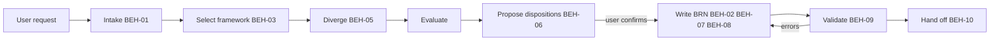

# SPEC-001 — Brainstorm skill (MVP)

## 1. Overview

The `brainstorm` skill ships in the `devforgeai` Claude Code plugin and is invoked as
`/devforgeai:brainstorm [topic]`, or automatically when a user asks to brainstorm. It runs a
conversational session: take in the topic, capture problems and ideas, evaluate them with a
selected framework, propose dispositions, **have the user confirm them**, then write a BRN
document from the brainstorm template, validate it and hand off.

Brainstorming frameworks are **reference files the skill selects from**. The MVP ships the
extension point and one default framework. The catalog is chosen later (PRD-001 §12), and
adding a framework never changes `SKILL.md`.

This skill implements the spec and is recorded as `SKL-001` in its `provenance.yaml`.

## 2. Constraints

- **NFR-001:** `SKILL.md` stays short. Framework detail, output rules and examples live in
  `references/`, which loads only on demand.
- **NFR-002:** the frontmatter follows the Agent Skills spec plus Claude Code fields only.
  Provenance lives in the sidecar, and `metadata` holds only the two quoted DevForgeAI keys.
- **NFR-003:** behavior is proven by the eval suite in §9, not by inspecting the instructions.

## 3. Architecture and components

```
src/claude/DevForgeAI/                    # plugin source (ADR-001); deployed to .claude/skills/devforgeai/
├── .claude-plugin/plugin.json
├── skills/brainstorm/
│   ├── SKILL.md                          # workflow checklist, judgment rules, output contract
│   ├── provenance.yaml                   # SKL-001, implements SPEC-001
│   ├── assets/
│   │   └── brainstorm.md                 # THE brainstorm template (canonical; lives only here)
│   └── references/
│       ├── output-rules.md               # YAML item-block rules (quoting, IDs, one key per fence)
│       └── frameworks/
│           ├── INDEX.md                  # catalog: one row per framework, with selection criteria
│           └── diverge-converge.md       # MVP default framework
└── evals/brainstorm/                     # eval cases, one per VER item (§9)
```



## 4. Data model

The skill has no database. It has two data contracts:

**Output: the BRN document.** Written to `docs/specs/brainstorm/BRN-NNN.md` from the brainstorm
template. The file name is the ID only; the topic lives in the document's `title`. It must validate against `schemas/brainstorm.schema.json`. It uses only the
`problems`, `ideas` and `assumptions` collections and their defined fields.

**Extension point: a framework reference.** Each file in `references/frameworks/` has these sections,
in order:

| Section | Content |
|---|---|
| When to use / When not to use | Selection criteria that the index repeats in one line each |
| Steps | The facilitation sequence the skill follows |
| Questions to ask | Prompts to put to the user at each step |
| Mapping to the BRN | Which steps fill `problems`, `ideas` or `assumptions`, and how to fill `value`, `effort`, `risk` and `score` |
| Evaluation method text | The sentence written into the BRN's evaluation-method section |
| Example | One short worked input and output |

`INDEX.md` is a table with columns *framework, file, use when, avoid when*. `SKILL.md` links only
to `INDEX.md` and `output-rules.md`. Framework files are reached through the index, which the
skill reads first. That is one level of indirection, accepted so that adding a framework
touches only the index and the new file.

## 5. Interfaces and contracts

The skill's interface is its invocation, not an API.

```yaml
# Proposed SKILL.md frontmatter (validated by schemas/skill-frontmatter.schema.json)
name: brainstorm
description: Runs a structured brainstorming session and writes a DevForgeAI brainstorm (BRN) document with identified problems, ideas, assumptions and user-confirmed dispositions. Use when the user wants to brainstorm, explore ideas or options, generate ideas for a product or feature, or start the DevForgeAI planning chain before a PRD.
argument-hint: "[topic]"
metadata:
  devforgeai-id: "SKL-001"
  devforgeai-version: "1"
```

- **Arguments:** `$ARGUMENTS` is the topic, and may be empty (BEH-01).
- **Triggers:** automatic invocation stays enabled. The description names the trigger phrases, and
  AC-05 plus its eval case guard against false triggers.
- **Downstream contract (consumed by the PRD workflow):** the BRN path pattern and `BRN-NNN` ID
  from BEH-02; stable item IDs (BEH-11); `disposition` and `reason` on every idea, with only
  user-confirmed values (BEH-06); `status: converged` only after the user confirms convergence. The
  PRD skill cites BRN items through `upstream` links such as `{id: BRN-001, item: IDEA-03, relation: derives}`,
  so the brainstorm skill must never change an item's meaning under an existing ID.
- **Tools:** Read, Glob, Write and Edit for files, and AskUserQuestion for confirmations.
  No `allowed-tools` pre-approval in the MVP, so writes go through normal permission prompts.

## 6. Behavior

```yaml items
behaviors:
  - id: BEH-01
    status: active
    rule: "Take the topic from $ARGUMENTS or the conversation. If there is none, ask for it and write nothing until it is given. Ask at most three clarifying questions (trigger, affected users, constraints) before diverging, and skip any question the request already answers. When the request says to proceed without questions, ask none. Record anything still unknown as [NEEDS CLARIFICATION] markers, not guesses."
  - id: BEH-02
    status: active
    rule: "Allocate the ID by scanning docs/specs/brainstorm/ for BRN-NNN.md files and using the highest number plus one (BRN-001 if none). Write the document to docs/specs/brainstorm/BRN-NNN.md. Never ask for or accept an output file name. Keep the descriptive topic in the title. Create the directory if it is missing."
  - id: BEH-03
    status: active
    rule: "Read references/frameworks/INDEX.md and choose the framework whose use-when criteria best fit the topic, or the one the user names. Use diverge-converge when nothing fits better. Tell the user which framework was chosen and why, and switch if they ask."
  - id: BEH-04
    status: active
    rule: "Whatever the framework, write only into the problems, ideas and assumptions collections and their defined fields. Record framework-specific reasoning in the evaluation-method and convergence prose sections, never as new YAML keys."
  - id: BEH-05
    status: active
    rule: "During divergence, record the user's ideas in their own words alongside generated ones. Generate between 5 and 15 ideas unless the user asks otherwise. Every idea starts with disposition open."
  - id: BEH-06
    status: active
    rule: "At convergence, propose a disposition (promoted, parked or rejected) and a reason for each idea, then ask the user to confirm or change them. Write only dispositions the user confirmed; leave the rest open. Set status to converged only when the user confirms convergence; otherwise leave it draft."
  - id: BEH-07
    status: active
    rule: "Fill the frontmatter: generated_by.tool claude-code, generated_by.model the current model ID, generated_by.session the session ID; authors the user and claude-code; reviewed_by empty; every hash null; created and updated today's date. Ask for owner only if it cannot be determined."
  - id: BEH-08
    status: active
    rule: "Build the document from ${CLAUDE_SKILL_DIR}/assets/brainstorm.md. Keep every section heading. Replace each placeholder or mark it [NEEDS CLARIFICATION]. Delete author comments."
  - id: BEH-09
    status: active
    rule: "Validate after writing. If the devforgeai CLI is on PATH, run devforgeai check --json on the file and fix what it reports. Otherwise check against references/output-rules.md: frontmatter keys, ID patterns, quoted free text, one top-level key per item block, no leftover placeholders. Repeat until clean, at most three attempts."
  - id: BEH-10
    status: active
    rule: "Hand off with counts of problems, ideas and assumptions, the ideas promoted, the open questions and the BRN file path. Then name the next workflow step: if ${CLAUDE_PLUGIN_ROOT}/skills/prd/SKILL.md exists, tell the user to run /devforgeai:prd with the BRN path; otherwise say the PRD workflow (planned as /devforgeai:prd) is not built yet and that this BRN is its input. Never start writing a PRD."
  - id: BEH-11
    status: active
    rule: "When extending an existing BRN, keep every existing item ID and its meaning. Give new items the next free number in their collection. Retire an item by setting status deprecated, never by deleting or renumbering it, because PRD requirements cite these IDs."
```

## 7. Errors and edge cases

```yaml items
errors:
  - id: ERR-01
    status: active
    condition: "A BRN on the same or a closely similar topic already exists"
    handling: "Show it and ask whether to extend it (version plus one, with a change-log entry) or create a new BRN"
    user_result: "A choice between update and new; nothing is overwritten silently"
  - id: ERR-02
    status: active
    condition: "The user stops mid-session"
    handling: "Ask whether to save what has been captured as a draft BRN; if yes, write it with every disposition open"
    user_result: "Either a draft file or no file, as the user chose"
  - id: ERR-03
    status: active
    condition: "The project has no docs/specs/ directory"
    handling: "Create docs/specs/brainstorm/ and state that this was done"
    user_result: "The file path, and a note that the directory was created"
  - id: ERR-04
    status: active
    condition: "The frameworks index is missing, or the chosen framework file is missing or malformed"
    handling: "Fall back to diverge-converge and tell the user which file was the problem"
    user_result: "The session continues with the default framework"
  - id: ERR-05
    status: active
    condition: "Validation still fails after three fix attempts"
    handling: "Stop, leave status draft, and list the remaining errors"
    user_result: "The file path and the unresolved errors"
```

## 8. Non-functional design

```yaml items
quality_responses:
  - id: QR-01
    status: active
    response: "SKILL.md holds only the workflow checklist, judgment rules, output contract and links; frameworks and output rules live in references/"
    measured_by: "devforgeai check line and character limits on SKILL.md"
    upstream:
      - {id: PRD-001, item: NFR-001, relation: satisfies, version: 6, hash: null}
  - id: QR-02
    status: active
    response: "Frontmatter limited to the fields in §5; provenance kept in provenance.yaml; metadata values quoted"
    measured_by: "skill-frontmatter.schema.json and skill.schema.json validation"
    upstream:
      - {id: PRD-001, item: NFR-002, relation: satisfies, version: 6, hash: null}
  - id: QR-03
    status: active
    response: "One eval case per VER item, tagged brainstorm and ver-NN, run against the no-plugin baseline"
    measured_by: "claude plugin eval --threshold 0.8 over 3 runs"
    upstream:
      - {id: PRD-001, item: NFR-003, relation: satisfies, version: 6, hash: null}
```

## 9. Verification

Each automated VER item has exactly one eval case under `evals/brainstorm/`, tagged `brainstorm`
and `ver-NN`. Eval runs are non-interactive, so no user is there to confirm. That is why
VER-02 can check that nothing gets promoted.

```yaml items
verifications:
  - id: VER-01
    status: active
    obligation: "Asked to brainstorm a named topic in an empty workspace, the skill fires, creates docs/specs/brainstorm/BRN-001.md containing problems and ideas item blocks, and hands off. Eval case writes-valid-brn: tool_used Skill, file_exists, regex on the file, llm rubric."
    level: e2e
    covers:
      - BEH-01
      - BEH-02
      - BEH-05
      - BEH-08
      - BEH-09
      - ERR-03
    upstream:
      - {id: STORY-001, item: AC-01, relation: verifies, version: 3, hash: null}
  - id: VER-02
    status: active
    obligation: "With no user present to confirm, no idea in the written file has disposition promoted, parked or rejected, and status is not converged. Eval case no-unconfirmed-dispositions: regex not_contains on the file."
    level: e2e
    covers:
      - BEH-06
    upstream:
      - {id: STORY-001, item: AC-02, relation: verifies, version: 3, hash: null}
  - id: VER-03
    status: active
    obligation: "The written file's generated_by has non-empty tool, model and session, reviewed_by is empty and every hash is null. Eval case records-provenance: regex on the file."
    level: e2e
    covers:
      - BEH-07
    upstream:
      - {id: STORY-001, item: AC-03, relation: verifies, version: 3, hash: null}
  - id: VER-04
    status: active
    obligation: "Asked to brainstorm with the diverge-converge framework, the skill names the framework in its reply, and the written file uses only the brainstorm schema's collections and fields and explains the selected method in section 5. Eval case uses-named-framework: an llm grader on the reply; on the file, regex graders and an llm grader. The regex graders are partial structural checks (allowed collection keys, one key per item block, field names from the combined brainstorm field list, framework named in section 5), not schema validation. The file llm grader receives the complete document and each collection's allowed fields separately, checks collection-specific fields and whether section 5 explains the selected method, and must cite the offending passage or field and the violated requirement when it fails. Interim until devforgeai check exists: CLI validation is recorded as NOT_RUN; the CLI will provide deterministic validation and the llm will continue to assess meaning and method quality."
    level: e2e
    covers:
      - BEH-03
      - BEH-04
    upstream:
      - {id: STORY-001, item: AC-04, relation: verifies, version: 3, hash: null}
  - id: VER-05
    status: active
    obligation: "Adding a test framework file and index row, with SKILL.md unchanged, lets the skill select it; removing the file makes the skill fall back to the default and say so."
    level: manual
    covers:
      - BEH-03
      - ERR-04
    upstream:
      - {id: STORY-001, item: AC-04, relation: verifies, version: 3, hash: null}
  - id: VER-06
    status: active
    obligation: "An unrelated request that mentions ideas (for example: review the ideas in this pull request description) does not invoke the skill. Eval case ignores-unrelated-request: tool_used Skill min 0 max 0 arm both."
    level: e2e
    covers:
      - QR-02
      - QR-03
    upstream:
      - {id: STORY-001, item: AC-05, relation: verifies, version: 3, hash: null}
  - id: VER-07
    status: active
    obligation: "Invoked with no topic, the skill asks for one and creates no file. Eval case asks-for-topic: file_exists exists false, llm rubric."
    level: e2e
    covers:
      - BEH-01
    upstream:
      - {id: STORY-001, item: AC-06, relation: verifies, version: 3, hash: null}
  - id: VER-08
    status: active
    obligation: "With docs/specs/brainstorm/BRN-001.md on the same topic seeded by scaffold, the skill asks whether to extend it or create a new one, and does not overwrite it. Eval case existing-brn: scaffold, llm rubric, regex that BRN-001 is unchanged."
    level: e2e
    covers:
      - ERR-01
      - BEH-02
      - BEH-11
    upstream:
      - {id: STORY-001, item: AC-01, relation: verifies, version: 3, hash: null}
  - id: VER-09
    status: active
    obligation: "Stopping mid-session offers a draft save; a document that cannot be fixed within three attempts is left as draft with the errors listed. SKILL.md is within the NFR-001 limits and its frontmatter validates."
    level: manual
    covers:
      - ERR-02
      - ERR-05
      - QR-01
    upstream:
      - {id: STORY-001, item: AC-01, relation: verifies, version: 3, hash: null}
  - id: VER-10
    status: active
    obligation: "After writing the BRN, the final reply names the PRD workflow as the next step with the BRN path. In the MVP plugin, which has no prd skill, it says the step is not yet available and names no runnable command. Eval case hands-off-to-prd: regex on last_message for the BRN path and for 'not yet available' or equivalent, llm rubric."
    level: e2e
    covers:
      - BEH-10
    upstream:
      - {id: STORY-001, item: AC-07, relation: verifies, version: 3, hash: null}
```

## 10. Rollout, migration and rollback

The skill is new, so there is nothing to migrate. Removing the plugin, or the skill directory within
it, rolls it back. BRN documents it wrote stay valid because they depend only on the template and schema.

## 11. Implementation plan

1. Create a worktree for STORY-001 and the plugin skeleton `src/claude/DevForgeAI/.claude-plugin/plugin.json` (with `author`), following ADR-001.
2. Copy the skill template to `skills/brainstorm/`, fill `SKILL.md` from §5–§7 and `provenance.yaml` as SKL-001 (implements SPEC-001).
3. Move `src/staging/templates/brainstorm.md` into `assets/` with `git mv`; the skill is its only home (implements BEH-08). The canonical schemas are in `src/schemas/` (ADR-001). The skill ships no schema: nothing in it executes one, and BEH-09 checks against `references/output-rules.md`.
4. Write `references/output-rules.md` from `src/staging/templates/README.md` §1.1–§1.2 and `src/schemas/brainstorm.schema.json` (implements BEH-09).
5. Write `references/frameworks/INDEX.md` and `diverge-converge.md` in the §4 shape (implements BEH-03, BEH-04).
6. Write the eval cases for VER-01 to VER-04, VER-06 to VER-08 and VER-10 from the skill template's `evals/` (implements QR-03).
7. Deploy and validate per ADR-001 steps 2–5, iterating until each eval case scores at least 0.8. Perform VER-05 and VER-09 by hand.

## 12. Alternatives considered

| Option | Why not chosen |
|---|---|
| Plain project skill in `.claude/skills/brainstorm/` (no plugin manifest) | `claude plugin eval` targets plugins only, and the bare name `/brainstorm` collides with other installed brainstorming skills |
| Plugin installed from a marketplace at project scope | Chosen instead: a skills-directory plugin deployed from src (ADR-001). A project-scope install would also load in every worktree |
| Name `devforgeai-brainstorm` or the gerund `brainstorming` | The plugin namespace already supplies `devforgeai:`. A short verb keeps later skills consistent (`prd`, `epic`, `story`, `spec`) |
| A shared templates folder (such as `src/staging/templates/`) at runtime | That path doesn't exist in other projects or in eval workspaces, and a second copy would drift. Each template lives only in the skill that produces its document |
| Frameworks listed in SKILL.md | Every addition would change SKILL.md and grow it; the index keeps SKILL.md fixed (FR-002) |
| Letting the skill set dispositions itself | Idea selection is a user decision (FR-003); unconfirmed AI dispositions would pass structural checks while being unjustified |

## 13. Open questions

- [NEEDS CLARIFICATION: eval pass threshold — 0.8 is proposed in PRD-001#NFR-003]

## Change Log

| Version | Date | Author | Change | Items affected |
|---|---|---|---|---|
| 1 | 2026-09-22 | claude-code | Initial draft | all |
| 2 | 2026-09-22 | claude-code | Decision: templates live only in their skill's assets/; removed the sync question | §3, §11, §12, §13 |
| 3 | 2026-09-22 | claude-code | Layout and build steps follow ADR-001; plugin location resolved | frontmatter, §3, §11, §12, §13 |
| 4 | 2026-09-22 | claude-code | Handoff to the PRD workflow (BEH-10, VER-10), stable IDs (BEH-11), downstream contract, BEH-01 skips answered questions, schema not shipped in assets, framework source moved to src/staging/templates and src/schemas; links re-reviewed at PRD v2, STORY v2 | §5, §6, §9, §11 |
| 5 | 2026-09-22 | claude-code | BRN path is ID-only: docs/specs/brainstorm/BRN-NNN.md, never a user-supplied name, topic kept in title (agreed with Bryan); VER-04 documents interim regex plus llm file grading, CLI NOT_RUN; links re-reviewed at STORY v3 | §4, BEH-02, ERR-03, VER-01, VER-04, VER-08 |
