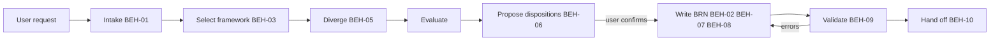

# SPEC-001 — Brainstorm skill (MVP)

## 1. Overview

The `brainstorm` skill ships in the `devforgeai` Claude Code plugin and is invoked as
`/devforgeai:brainstorm [topic]`, or automatically when a user asks to brainstorm. It runs a
conversational session: take in the topic, capture problems and ideas, evaluate them with a
selected framework, propose dispositions, **have the user confirm them**, then write a BRN
document from the brainstorm template, validate it and hand off.

Brainstorming frameworks are **reference files the skill selects from**. The MVP ships the
extension point and one default framework. The catalog is chosen later (PRD-001 §12), and
adding a framework never changes `SKILL.md`.

This skill implements the spec and is recorded as `SKL-001` in its `provenance.yaml`.

**Version 11** (2026-10-03) has the skill keep its workflow checklist in Claude Code's task list when the session
has one, as the progress tracker's task-list convention asks (SPEC-012 §4), so that each answer is credited to
the step that asked for it (BEH-12).

**Version 12** (2026-10-03) runs the validator as a command of its own, so its exit status is the validator's: a
run joined to another command, such as `; echo "exit=$?"`, proves nothing, and the progress tracker rightly
credits none (BEH-09; SPEC-012 BEH-06).

**Version 13** (2026-10-03) tags each question with its step, as SPEC-012 version 9's convention asks: hidden in
AskUserQuestion's metadata, where the progress tracker checks it against the step marked in progress, and shown
in each question's header, where you see it (BEH-12).

**Version 14** (2026-10-04) asks the waiver (Bryan, 2026-10-04). When your request says to proceed without questions,
the skill first asks whether it should, in a question of its own with two fixed answers, "Proceed without questions"
and "Ask me as usual". Your answer is recorded, so the progress tracker sees the choice your request made (SPEC-012
version 11, SPEC-013 version 10). In a brainstorm it changes nothing the tracker checks: dispositions and convergence
still need your confirmation either way (BEH-06). Without the question tool, as in eval runs, nothing is asked and the
request is followed as before (BEH-13).

**Version 15** (2026-10-04) keeps two promises (Bryan, 2026-10-04). "Proceed without questions" said "I ask nothing
more", yet a missing topic and an existing BRN on the topic were still asked about; its description now names those
two, as architecture's already names its exceptions (BEH-13). And step 5's proposals were a table printed just before
the question, where the question dialog hid it; they now sit inside the question, in each option's preview (BEH-06).

## 2. Constraints

- **NFR-001:** `SKILL.md` stays short. Framework detail, output rules and examples live in
  `references/`, which loads only on demand.
- **NFR-002:** the frontmatter follows the Agent Skills spec plus Claude Code fields only.
  Provenance lives in the sidecar, and `metadata` holds only the two quoted DevForgeAI keys.
- **NFR-003:** behavior is proven by the eval suite in §9, not by inspecting the instructions.

## 3. Architecture and components

```
src/claude/DevForgeAI/                    # plugin source (ADR-001); deployed to .claude/skills/devforgeai/
├── .claude-plugin/plugin.json
├── skills/brainstorm/
│   ├── SKILL.md                          # workflow checklist, judgment rules, output contract
│   ├── provenance.yaml                   # SKL-001, implements SPEC-001
│   ├── assets/
│   │   └── brainstorm.md                 # THE brainstorm template (canonical; lives only here)
│   ├── scripts/
│   │   └── validate_brn.py               # standard-library validator for the output rules (BEH-09)
│   └── references/
│       ├── output-rules.md               # YAML item-block rules (quoting, IDs, one key per fence)
│       └── frameworks/
│           ├── INDEX.md                  # catalog: one row per framework, with selection criteria
│           └── diverge-converge.md       # MVP default framework
└── evals/brainstorm/                     # eval cases, one per VER item (§9)
```


```mermaid
flowchart LR
    U[User request] --> I[Intake BEH-01]
    I --> F[Select framework BEH-03]
    F --> D[Diverge BEH-05]
    D --> E[Evaluate]
    E --> C[Propose dispositions BEH-06]
    C -->|user confirms| W[Write BRN BEH-02 BEH-07 BEH-08]
    W --> V[Validate BEH-09]
    V -->|errors| W
    V --> H[Hand off BEH-10]
```

## 4. Data model

The skill has no database. It has two data contracts:

**Output: the BRN document.** Written to `docs/specs/brainstorm/BRN-NNN.md` from the brainstorm
template. The file name is the ID only; the topic lives in the document's `title`. It must validate against `src/schemas/brainstorm.schema.json`. It uses only the
`problems`, `ideas` and `assumptions` collections and their defined fields.

**Extension point: a framework reference.** Each file in `references/frameworks/` has these sections,
in order:

| Section | Content |
|---|---|
| When to use / When not to use | Selection criteria that the index repeats in one line each |
| Steps | The facilitation sequence the skill follows |
| Questions to ask | Prompts to put to the user at each step |
| Mapping to the BRN | Which steps fill `problems`, `ideas` or `assumptions`, and how to fill `value`, `effort`, `risk` and `score` |
| Evaluation method text | The sentence written into the BRN's evaluation-method section |
| Example | One short worked input and output |

`INDEX.md` is a table with columns *framework, file, use when, avoid when*. `SKILL.md` links only
to `INDEX.md` and `output-rules.md`. Framework files are reached through the index, which the
skill reads first. That is one level of indirection, accepted so that adding a framework
touches only the index and the new file.

## 5. Interfaces and contracts

The skill's interface is its invocation, not an API.

```yaml
# Proposed SKILL.md frontmatter (validated by src/schemas/skill-frontmatter.schema.json)
name: brainstorm
description: Runs a structured brainstorming session and writes a DevForgeAI brainstorm (BRN) document with identified problems, ideas, assumptions and user-confirmed dispositions. Use whenever the user asks to brainstorm, explore ideas or options, come up with ways to solve a problem, or generate ideas for a product, feature or process, even when they don't mention a document, and to start the DevForgeAI planning chain before a PRD.
argument-hint: "[topic]"
metadata:
  devforgeai-id: "SKL-001"
  devforgeai-version: "6"
```

- **Arguments:** `$ARGUMENTS` is the topic, and may be empty (BEH-01).
- **Triggers:** automatic invocation stays enabled. The description names the trigger phrases, and
  AC-05 plus its eval case guard against false triggers.
- **Downstream contract (consumed by the PRD workflow):** the BRN path pattern and `BRN-NNN` ID
  from BEH-02; stable item IDs (BEH-11); `disposition` and `reason` on every idea, with only
  user-confirmed values (BEH-06); `status: converged` only after the user confirms convergence. The
  PRD skill cites BRN items through `upstream` links such as `{id: BRN-001, item: IDEA-03, relation: derives}`,
  so the brainstorm skill must never change an item's meaning under an existing ID.
- **Tools:** Read, Glob, Write and Edit for files, and AskUserQuestion for confirmations; when the session has
  them, the task-list tools (TaskCreate and TaskUpdate, or TodoWrite) for the workflow checklist (BEH-12).
  No `allowed-tools` pre-approval in the MVP, so writes go through normal permission prompts.

## 6. Behavior

```yaml items
behaviors:
  - id: BEH-01
    status: active
    rule: "Take the topic from $ARGUMENTS or the conversation. If there is none, ask for it and write nothing until it is given. Ask at most three clarifying questions (trigger, affected users, constraints) before diverging, and skip any question the request already answers. When the request says to proceed without questions, ask none, once the waiver question (BEH-13) has been answered Proceed without questions or couldn't be asked. Record anything still unknown as [NEEDS CLARIFICATION] markers, not guesses."
  - id: BEH-02
    status: active
    rule: "Allocate the ID by scanning docs/specs/brainstorm/ for BRN-NNN.md files and using the highest number plus one (BRN-001 if none). Write the document to docs/specs/brainstorm/BRN-NNN.md. Never ask for or accept an output file name. Keep the descriptive topic in the title. Create the directory if it is missing."
  - id: BEH-03
    status: active
    rule: "Read references/frameworks/INDEX.md and choose the framework whose use-when criteria best fit the topic, or the one the user names. Use diverge-converge when nothing fits better. Tell the user which framework was chosen and why, and switch if they ask."
  - id: BEH-04
    status: active
    rule: "Whatever the framework, write only into the problems, ideas and assumptions collections and their defined fields. Record framework-specific reasoning in the evaluation-method and convergence prose sections, never as new YAML keys."
  - id: BEH-05
    status: active
    rule: "During divergence, record the user's ideas in their own words alongside generated ones. Generate between 5 and 15 ideas unless the user asks otherwise. Every idea starts with disposition open."
  - id: BEH-06
    status: active
    rule: "At convergence, propose a disposition (promoted, parked or rejected) and a reason for each idea, then ask the user to confirm or change them. With AskUserQuestion, put the proposals inside the question form, never only in text before it, which the dialog hides (version 15; Bryan, 2026-10-04: 'Fold it in'): one question, 'Confirm these dispositions?', whose options are 'Accept all as proposed' (Recommended) and 'Leave them open', each option's preview holding the table of idea ID, title, proposed disposition and one-line reason, with the user's changes typed under Other; and in the same form a second question, 'Has the brainstorm converged?', with the options 'Converged' and 'Not yet'. Write only dispositions the user confirmed; leave the rest open. Set status to converged only when the user confirms convergence; otherwise leave it draft."
  - id: BEH-07
    status: active
    rule: "Fill the frontmatter: generated_by.tool claude-code, generated_by.model the current model ID, generated_by.session the session ID; authors the user and claude-code; reviewed_by empty; every hash null; created and updated today's date. Ask for owner only if it cannot be determined. Write the author of each Change Log row the skill adds as claude-code (session <session ID>): the ID names the conversation's transcript, so claude --resume <ID> can reopen the conversation behind that version while the transcript is retained (30 days by default)."
  - id: BEH-08
    status: active
    rule: "Build the document from ${CLAUDE_SKILL_DIR}/assets/brainstorm.md. Keep every section heading. Replace each placeholder or mark it [NEEDS CLARIFICATION]. Delete author comments."
  - id: BEH-09
    status: active
    rule: "Validate after writing. Run scripts/validate_brn.py on the file (standard library only; it applies references/output-rules.md mechanically: frontmatter keys, ID patterns, quoted free text, one top-level key per item block, no leftover placeholders) and fix what it reports. Run it as a command of its own, not joined to another with ;, a pipe or a background &, so its exit status is the validator's (&& and 2>&1 are fine): the progress tracker credits no run whose status another command hides (SPEC-012 BEH-06; version 12). Only without a shell or Python, check against references/output-rules.md by hand. Then read the file back and confirm that every disposition other than open, and status converged, was confirmed by the user, because the script cannot check this. Never run a devforgeai command: the CLI doesn't exist and a program by that name on PATH can't be trusted (SPEC-004 §2). Repeat until clean, at most three attempts."
  - id: BEH-10
    status: active
    rule: "Hand off with counts of problems, ideas and assumptions, the ideas promoted, the open questions and the BRN file path. Then name the next workflow step: if ${CLAUDE_PLUGIN_ROOT}/skills/prd/SKILL.md exists, tell the user to run /devforgeai:prd with the BRN ID (for example /devforgeai:prd BRN-001; the prd skill takes an ID, never a path, per SPEC-002 §5) and give the BRN path as its input; otherwise say the PRD workflow (planned as /devforgeai:prd) is not built yet and that, once it is, /devforgeai:prd with this BRN's ID runs on it. The next step comes last in the final reply, as its own paragraph outside any code block, starting with the words Next step; nothing follows it. Never start writing a PRD."
  - id: BEH-11
    status: active
    rule: "When extending an existing BRN, keep every existing item ID and its meaning. Give new items the next free number in their collection. Retire an item by setting status deprecated, never by deleting or renumbering it, because PRD requirements cite these IDs. Set generated_by.session to the extending session and add a Change Log row naming it; never edit earlier Change Log rows, which keep the sessions that wrote earlier versions."
  - id: BEH-12
    status: active
    rule: "When the session has task-list tools (TaskCreate and TaskUpdate, or TodoWrite; they may need loading through ToolSearch), keep the workflow checklist there, as SPEC-012 §4's task-list convention says. Before anything else, the question asking for a topic included, create one task per checklist step: its subject the step's checklist line without the box ('<N>. <title>'), its metadata devforgeai_step: N (with TodoWrite, the content '<N>. <title>'). Mark a step in_progress when its work starts. Before asking the user any question, mark the step the question belongs to in_progress: the topic, clarifying and extend-or-new questions belong to step 1, the confirmation of dispositions and convergence to step 5. Never put two steps' questions in one question form. Tag each question form with its step: the AskUserQuestion call's metadata source 'devforgeai_step:N', which the user doesn't see and the progress tracker checks against the step marked in progress, and each of its questions' header 'Step N', which the user sees (SPEC-012 §4, version 9). Mark each step completed as soon as it is done, one at a time, a step with nothing to do included. Without task-list tools, copy the checklist into the reply and tick items off as before. SKILL.md names the tag devforgeai_step, which tells the progress tracker that the skill follows the convention."
  - id: BEH-13
    status: active
    rule: "The waiver (version 14; Bryan, 2026-10-04). When the request says to proceed without questions (or not to ask, or to skip questions) and the session has AskUserQuestion, ask it once, at the start of step 1, before any other question, with step 1 marked in_progress (BEH-12): one question, alone in its form, the one question BEH-12's tag rule leaves out, with metadata source devforgeai_waiver (not devforgeai_step:1, so the progress tracker records it as the waiver and never as a step's answer), header 'Step 1', the question 'Your request says to proceed without questions. Should I?' and exactly two options, in this order: 'Proceed without questions' (description: 'I ask nothing more, except which topic and whether to extend an existing BRN, when open; decisions that need you stay open.') and 'Ask me as usual' (description: 'I ask about each decision as it comes up.'). On Proceed without questions, follow the request: ask no other question (BEH-01, BEH-06), except BEH-01's topic question when no topic is given and ERR-01's extend-or-new question when a BRN on the topic exists, which are still asked when open (version 15; Bryan, 2026-10-04: 'Align with architecture', as SPEC-003 BEH-18 keeps its gates). On Ask me as usual, on anything typed instead, or on a dismissal, ask as if the request hadn't said so. Ask it at most once in a run. Without AskUserQuestion, ask nothing, in plain text or otherwise, and follow the request as before; when the request doesn't say to proceed without questions, never ask it."
```

## 7. Errors and edge cases

```yaml items
errors:
  - id: ERR-01
    status: active
    condition: "A BRN on the same or a closely similar topic already exists"
    handling: "Show it and ask whether to extend it (version plus one, with a change-log entry) or create a new BRN"
    user_result: "A choice between update and new; nothing is overwritten silently"
  - id: ERR-02
    status: active
    condition: "The user stops mid-session"
    handling: "Ask whether to save what has been captured as a draft BRN; if yes, write it with every disposition open"
    user_result: "Either a draft file or no file, as the user chose"
  - id: ERR-03
    status: active
    condition: "The project has no docs/specs/ directory"
    handling: "Create docs/specs/brainstorm/ and state that this was done"
    user_result: "The file path, and a note that the directory was created"
  - id: ERR-04
    status: active
    condition: "The frameworks index is missing, or the chosen framework file is missing or malformed"
    handling: "Fall back to diverge-converge and tell the user which file was the problem"
    user_result: "The session continues with the default framework"
  - id: ERR-05
    status: active
    condition: "Validation still fails after three fix attempts"
    handling: "Stop, leave status draft, and list the remaining errors"
    user_result: "The file path and the unresolved errors"
```

## 8. Non-functional design

```yaml items
quality_responses:
  - id: QR-01
    status: active
    response: "SKILL.md holds only the workflow checklist, judgment rules, output contract and links; frameworks and output rules live in references/"
    measured_by: "devforgeai check line and character limits on SKILL.md"
    upstream:
      - {id: PRD-001, item: NFR-001, relation: satisfies, version: 11, hash: null}
  - id: QR-02
    status: active
    response: "Frontmatter limited to the fields in §5; provenance kept in provenance.yaml; metadata values quoted"
    measured_by: "skill-frontmatter.schema.json and skill.schema.json validation"
    upstream:
      - {id: PRD-001, item: NFR-002, relation: satisfies, version: 11, hash: null}
  - id: QR-03
    status: active
    response: "One eval case per VER item, tagged brainstorm and ver-NN, run against the no-plugin baseline"
    measured_by: "claude plugin eval --threshold 0.8 over 3 runs"
    upstream:
      - {id: PRD-001, item: NFR-003, relation: satisfies, version: 11, hash: null}
```

## 9. Verification

| Kind | Status |
| --- | --- |
| Version 14 (SKL-001 v7) | Merged in PR #77 (`8eb431a`, 2026-10-04 18:15 UTC) and deployed as plugin 0.20.0 on 2026-10-04 (the deployed copy matches the source; `diff -rq` exit 0). Built on branch `docs/waiver-menu-specs` (PR #77, `9366f46`, review fixes `505a4ba`); checklist unchanged, manifest matched. VER-13: `tmp/eval-results/waiver-suite1-20261004T120554-{brainstorm,architecture}` in the worktree, bound to `505a4ba`, 1 run, `--ablation none`: brainstorm 9 of 9 and architecture 24 of 24 at 0.8 or above ($4.65 and $17.74). VER-14 live, in Bryan's worker1 tab on 2026-10-04, enforce mode, `claude --plugin-dir` on a copy of `505a4ba`: the waiver menu alone in step 1, Proceed, no other question, 12 ideas open, status draft, state waiver proceed, no flags. Pass. The 3-run qualification was waived by Bryan on 2026-10-04, who approved SKL-001 v7 the same day |
| Versions 11 to 13 (SKL-001 v6) | Built on branch `feat/skl-001-v6-skl-003-v7` (worktree, draft PR #73) through `/plugin-dev:create-plugin`, 2026-10-03: the eval cases first `1fe55f6` (`keeps-task-list`, hand-written, and `writes-valid-brn`'s grader `ran-validator-alone`), the skill `1d93c29`, the review fixes `aba1b04` and `7e6168d`, and Bryan's review decisions `edee883` (a confirmation typed after a run that asked nothing asks the step-5 question again and edits the BRN in place). **Evals**, in Bryan's cmux tab on his word: a pilot bound to `7e6168d`, `tmp/eval-results/pilot-brainstorm-20261003T185015/` (keeps-task-list, writes-valid-brn, asks-for-topic: 3 of 3 at 1.00); one single-arm run of the suite bound to `f1654d8`, `tmp/eval-results/suite1single-brainstorm-20261003T201734/`: 9 of 9 at 1.00, $4.57, 13 to 36 turns of 60. **Bryan waived the 3-run qualification with the baseline on 2026-10-04**, so these single-arm results are the record. Every eval run offered TaskCreate, TaskUpdate and ToolSearch and no AskUserQuestion, so the fallback without task tools isn't exercised; `max_turns` went to 60, and asks-for-topic's to 20. **VER-12: pass**, live in enforce mode on 2026-10-03, Claude Code 2.1.288 (session `f363357c`, run `20261004T004218Z-brainstorm-1d2db9f3`): 16 step events, every step started and done in order; the intake questions tagged step 1, the framework's own questions tagged step 3 (the step whose work asks them), and the disposition and convergence question asked alone under step 5, each with the header 'Step N'; the validator run on its own, passing at once; no flag, counts.unmarkedQuestions 0. A refusal check in the same tab (run `20261004T010506Z-brainstorm-024312d2`): a tagged question asked before step 1 was marked was refused with SPEC-013 BEH-21's text, and went through once the step was marked. Reading: twice a step was started before the previous step's done event (two TaskUpdates in one batch); the steps still finished in order. SKL-001 v6 was approved by Bryan on 2026-10-04; merged in PR #73 (`2f99a01`, 2026-10-04) and deployed as plugin 0.18.0 the same day in Bryan's cmux tab, where the deployed copy matched the source (`diff -rq` printed nothing) |

Each automated VER item has exactly one eval case under `evals/brainstorm/`, tagged `brainstorm`
and `ver-NN`. Eval runs are non-interactive, so no user is there to confirm. That is why
VER-02 can check that nothing gets promoted.

```yaml items
verifications:
  - id: VER-01
    status: active
    obligation: "Asked to brainstorm a named topic in an empty workspace, the skill fires, creates docs/specs/brainstorm/BRN-001.md containing problems and ideas item blocks, and hands off. Eval case writes-valid-brn: tool_used Skill, file_exists, regex on the file, regex on the trace for validate_brn.py, a tool_used grader that a Bash command runs validate_brn.py with no ; or | in it (version 12), llm rubric."
    level: e2e
    covers:
      - BEH-01
      - BEH-02
      - BEH-05
      - BEH-08
      - BEH-09
      - ERR-03
    upstream:
      - {id: STORY-001, item: AC-01, relation: verifies, version: 4, hash: null}
  - id: VER-02
    status: active
    obligation: "With no user present to confirm, no idea in the written file has disposition promoted, parked or rejected, and status is not converged. Eval case no-unconfirmed-dispositions: regex not_contains on the file."
    level: e2e
    covers:
      - BEH-06
    upstream:
      - {id: STORY-001, item: AC-02, relation: verifies, version: 4, hash: null}
  - id: VER-03
    status: active
    obligation: "The written file's generated_by has non-empty tool, model and session, reviewed_by is empty, every hash is null, and the Change Log row reads claude-code (session <the same session>). Eval case records-provenance: regex on the file."
    level: e2e
    covers:
      - BEH-07
    upstream:
      - {id: STORY-001, item: AC-03, relation: verifies, version: 4, hash: null}
  - id: VER-04
    status: active
    obligation: "Asked to brainstorm with the diverge-converge framework, the skill names the framework in its reply, and the written file uses only the brainstorm schema's collections and fields and explains the selected method in section 5. Eval case uses-named-framework: an llm grader on the reply; on the file, regex graders and an llm grader. The regex graders are partial structural checks (allowed collection keys, one key per item block, field names from the combined brainstorm field list, framework named in section 5), not schema validation. The file llm grader receives the complete document and each collection's allowed fields separately, checks collection-specific fields and whether section 5 explains the selected method, and must cite the offending passage or field and the violated requirement when it fails. Interim until devforgeai check exists: CLI validation is recorded as NOT_RUN; the CLI will provide deterministic validation and the llm will continue to assess meaning and method quality."
    level: e2e
    covers:
      - BEH-03
      - BEH-04
    upstream:
      - {id: STORY-001, item: AC-04, relation: verifies, version: 4, hash: null}
  - id: VER-05
    status: active
    obligation: "Adding a test framework file and index row, with SKILL.md unchanged, lets the skill select it; removing the file makes the skill fall back to the default and say so."
    level: manual
    covers:
      - BEH-03
      - ERR-04
    upstream:
      - {id: STORY-001, item: AC-04, relation: verifies, version: 4, hash: null}
  - id: VER-06
    status: active
    obligation: "An unrelated request that mentions ideas (for example: review the ideas in this pull request description) does not invoke the skill. Eval case ignores-unrelated-request: tool_used Skill min 0 max 0 arm both."
    level: e2e
    covers:
      - QR-02
      - QR-03
    upstream:
      - {id: STORY-001, item: AC-05, relation: verifies, version: 4, hash: null}
  - id: VER-07
    status: active
    obligation: "Invoked with no topic, the skill asks for one and creates no file. Eval case asks-for-topic: file_exists exists false, llm rubric."
    level: e2e
    covers:
      - BEH-01
    upstream:
      - {id: STORY-001, item: AC-06, relation: verifies, version: 4, hash: null}
  - id: VER-08
    status: active
    obligation: "With docs/specs/brainstorm/BRN-001.md on the same topic seeded by scaffold, the skill asks whether to extend it or create a new one, and does not overwrite it. Eval case existing-brn: scaffold, llm rubric, regex that BRN-001 is unchanged."
    level: e2e
    covers:
      - ERR-01
      - BEH-02
      - BEH-11
    upstream:
      - {id: STORY-001, item: AC-01, relation: verifies, version: 4, hash: null}
  - id: VER-09
    status: active
    obligation: "Stopping mid-session offers a draft save; a document that cannot be fixed within three attempts is left as draft with the errors listed. SKILL.md is within the NFR-001 limits and its frontmatter validates."
    level: manual
    covers:
      - ERR-02
      - ERR-05
      - QR-01
    upstream:
      - {id: STORY-001, item: AC-01, relation: verifies, version: 4, hash: null}
  - id: VER-10
    status: active
    obligation: "After writing the BRN, the final reply names the PRD workflow as the next step with the BRN path. The plugin ships the prd skill, so the reply tells the user to run /devforgeai:prd with the BRN ID and never passes a file path to it. Eval case hands-off-to-prd: regex on last_message for the BRN path, for '/devforgeai:prd BRN-001', and for the absence of a path argument; llm rubric. The not-yet-built branch of BEH-10 can no longer be exercised in this plugin and is not covered by an eval."
    level: e2e
    covers:
      - BEH-10
    upstream:
      - {id: STORY-001, item: AC-07, relation: verifies, version: 4, hash: null}
  - id: VER-11
    status: active
    obligation: "With the task-list tools allowed, VER-01's prompt in an empty workspace gives a task list kept by the convention: at least 8 TaskCreate calls whose input carries devforgeai_step, one of them with the subject '5. Propose dispositions and ask the user to confirm'; the first TaskCreate before the first Write; at least 8 TaskUpdate calls to completed; and the BRN still written. Eval case keeps-task-list: allowed_tools adds TaskCreate, TaskUpdate, TaskList and TaskGet; tool_used graders with input_match, tool_order, file_exists. A TaskUpdate's input names only a task ID and a status, so which task is which step, and the marking before a question, are checked live by VER-12."
    level: e2e
    covers:
      - BEH-12
    upstream:
      - {id: STORY-001, item: AC-01, relation: verifies, version: 4, hash: null}
  - id: VER-12
    status: active
    obligation: "Live, in a session with the task tools, with SPEC-013's VER-22: a brainstorm run in which the user answers keeps its list, with step 1 in progress for the intake questions, step 5 in progress for the disposition question asked alone, every question form tagged devforgeai_step:N for its step with each question's header 'Step N' (version 13), and each step completed in order; the tracker records step events for all 8 steps and flags no question gate (counts.unmarkedQuestions 0). Recorded in §9."
    level: manual
    covers:
      - BEH-12
    upstream:
      - {id: STORY-001, item: AC-02, relation: verifies, version: 4, hash: null}
  - id: VER-13
    status: active
    obligation: "Without AskUserQuestion, no waiver question stops a run: the eval cases whose prompts say not to ask (writes-valid-brn, keeps-task-list, no-unconfirmed-dispositions, records-provenance, hands-off-to-prd, uses-named-framework) still pass at 0.8 or above, each writing its BRN with no question asked; asks-for-topic, existing-brn and ignores-unrelated-request, whose prompts don't waive, are unchanged."
    level: e2e
    covers:
      - BEH-13
      - BEH-01
    upstream:
      - {id: STORY-001, item: AC-02, relation: verifies, version: 4, hash: null}
  - id: VER-14
    status: active
    obligation: "Live, in a session with the task tools, with SPEC-013's VER-36: a brainstorm whose request says to proceed without questions first marks step 1 and asks the waiver alone, tagged devforgeai_waiver with header 'Step 1' and the two labels; 'Proceed without questions' gives no other question and a BRN with every disposition open and status draft, and the tracker's state shows waiver proceed and no question gate; in a second run 'Ask me as usual' gives the topic or clarifying questions and step 5's question, as with a request that didn't waive. A request that doesn't waive shows no waiver question. Recorded in §9."
    level: manual
    covers:
      - BEH-13
    upstream:
      - {id: STORY-001, item: AC-02, relation: verifies, version: 4, hash: null}
  - id: VER-15
    status: active
    obligation: "Live, in a session with the task tools (version 15): (a) a brainstorm whose request names no topic and says to proceed without questions asks the waiver, whose 'Proceed without questions' description reads 'I ask nothing more, except which topic and whether to extend an existing BRN, when open; decisions that need you stay open.'; after Proceed it asks for the topic; (b) a brainstorm with a user answering reaches step 5 and asks 'Confirm these dispositions?' and 'Has the brainstorm converged?' in one form, with the options in BEH-06's order, and each disposition option's preview shows the table of every idea with its proposed disposition and reason; accepting writes those dispositions. Recorded in §9."
    level: manual
    covers:
      - BEH-06
      - BEH-13
```

## 10. Rollout, migration and rollback

The skill is new, so there is nothing to migrate. Removing the plugin, or the skill directory within
it, rolls it back. BRN documents it wrote stay valid because they depend only on the template and schema.

Versions 11 to 13 (SKL-001 v6) ship in a plugin version no earlier than the one that builds SPEC-012 version 9 and
SPEC-013 version 8, so a session without the task tools is never held to a task list, and the tags it writes are
recorded and checked. The checklist's lines
don't change, so the tracker's brainstorm manifest stays matched. Rolling back is returning to SKL-001 v5; the
tracker then places the run's answers by its windows again (SPEC-012 BEH-09).

Version 14 (SKL-001 v7) ships in the plugin version that builds SPEC-012 version 11 and SPEC-013 version 10 (0.20.0),
so the waiver's answer is recorded and never refused. The checklist's lines don't change, so the brainstorm manifest
stays matched; no brainstorm step is waivable (SPEC-012 BEH-19), so a waiver changes nothing the tracker checks here.
This spec's SPEC-012 link moves to version 11 when that is approved.

Version 15 (SKL-001 v8) ships with SPEC-003 version 10 and SPEC-013 version 11, in one plugin version. The checklist's
lines don't change, so the brainstorm manifest stays matched; the questions keep their step tags (step 1, step 5).

## 11. Implementation plan

1. Create a worktree for STORY-001 and the plugin skeleton `src/claude/DevForgeAI/.claude-plugin/plugin.json` (with `author`), following ADR-001.
2. Copy the skill template to `skills/brainstorm/`, fill `SKILL.md` from §5–§7 and `provenance.yaml` as SKL-001 (implements SPEC-001).
3. Move `src/templates/brainstorm.md` into `assets/` with `git mv`; the skill is its only home (implements BEH-08). The canonical schemas are in `src/schemas/` (ADR-001). The skill ships no schema: nothing in it executes one, and BEH-09 checks against `references/output-rules.md`.
4. Write `references/output-rules.md` from `src/templates/README.md` §1.1–§1.2 and `src/schemas/brainstorm.schema.json` (implements BEH-09).
5. Write `references/frameworks/INDEX.md` and `diverge-converge.md` in the §4 shape (implements BEH-03, BEH-04).
6. Write the eval cases for VER-01 to VER-04, VER-06 to VER-08 and VER-10 from the skill template's `evals/` (implements QR-03).
7. Deploy and validate per ADR-001 steps 2–5, iterating until each eval case scores at least 0.8. Perform VER-05 and VER-09 by hand.

**Version 11** (after approval), through `/plugin-dev:create-plugin` and Anthropic's two skill guides:
1. Write the eval case `keeps-task-list` (hand-written, like the other brainstorm cases) and run it on SKL-001 v5
   with `--runs 1 --ablation none`; it fails, since v5's text names no `devforgeai_step`.
2. Build SKL-001 v6, which implements versions 11 to 13: the Workflow section takes BEH-12's wording and step 7
   BEH-09's (the validator as a command of its own), writes-valid-brn gains VER-01's new grader, `provenance.yaml` and
   `metadata.devforgeai-version` go to 6, skill-reviewer reviews it, and `evaluate.py check` (SPEC-012 IF-02)
   reports the brainstorm manifest matched.
3. Evaluate cheapest first: `keeps-task-list` with `--runs 1 --ablation none`, then the suite with `--runs 1`,
   then 3 runs with the baseline. A trace with no TaskCreate call means the case's `allowed_tools` didn't give
   the eval's model the task tools: record it in §9 and bring it to the owner before the full suite.
4. Once the plugin version that builds SPEC-012 version 9 and SPEC-013 version 8 is deployed, run VER-12 live.

**Version 14** (after approval), through `/plugin-dev:create-plugin` and `/plugin-dev:skill-development`:
1. Build SKL-001 v7: the waiver in step 1 (BEH-13) and BEH-01's clause; `provenance.yaml` and
   `metadata.devforgeai-version` go to 7; skill-reviewer reviews it; `evaluate.py check` reports the manifest matched.
2. Evaluate cheapest first: the six waiving cases with `--runs 1`, then the suite with `--runs 1` (VER-13).
3. Once the plugin version that builds SPEC-012 version 11 and SPEC-013 version 10 is deployed, run VER-14 live.

**Version 15** (after approval), through `/plugin-dev:create-plugin` and `/plugin-dev:skill-development`:
1. Build SKL-001 v8: Proceed's description and the topic and extend-or-new exception (BEH-13), step 5's question form
   (BEH-06); `provenance.yaml` and `metadata.devforgeai-version` go to 8; skill-reviewer reviews it; `evaluate.py
   check` reports the manifest matched.
2. Evaluate the suite with `--runs 1` (eval runs have no question tool, so no case changes; every case must still
   pass).
3. Run VER-15 live in worker1, on Bryan's word.

## 12. Alternatives considered

| Option | Why not chosen |
|---|---|
| Plain project skill in `.claude/skills/brainstorm/` (no plugin manifest) | `claude plugin eval` targets plugins only, and the bare name `/brainstorm` collides with other installed brainstorming skills |
| Plugin installed from a marketplace at project scope | Chosen instead: a skills-directory plugin deployed from src (ADR-001). A project-scope install would also load in every worktree |
| Name `devforgeai-brainstorm` or the gerund `brainstorming` | The plugin namespace already supplies `devforgeai:`. A short verb keeps later skills consistent (`prd`, `epic`, `story`, `spec`) |
| A shared templates folder (such as `src/templates/`) at runtime | That path doesn't exist in other projects or in eval workspaces, and a second copy would drift. Each template lives only in the skill that produces its document |
| Frameworks listed in SKILL.md | Every addition would change SKILL.md and grow it; the index keeps SKILL.md fixed (FR-002) |
| Ticking the checklist in the reply only | The tracker can't tell which step a question belongs to when Claude asks before it ticks (SPEC-012 §13); ticks stay the fallback without a task list |
| Printing a step marker before each question | Claude's narration before a question was in thinking blocks, which no hook records (SPEC-012 §12) |
| Asking the waiver on every run, or in plain text without the question tool | Every run would open with a question, and eval runs, which have no question tool, would stop at it. Bryan chose to ask only when the request waives (2026-10-04) |
| Letting the skill set dispositions itself | Idea selection is a user decision (FR-003); unconfirmed AI dispositions would pass structural checks while being unjustified |

## 13. Open questions

- Resolved (Bryan, 2026-10-04, with SPEC-012 version 11 and SPEC-013 version 10): a request that says to proceed
  without questions is confirmed by the waiver question, asked once at the start, only then; the tracker records
  its answer. A dismissal or a typed answer means "Ask me as usual" (Resolved, Bryan, 2026-10-04, version 15: "Keep as
  is"; it keeps every decision asked).
- Resolved (Bryan, 2026-10-04, version 15: "Align with architecture"): after *Proceed without questions*, the skill
  still asks for a missing topic (BEH-01) and extend-or-new (ERR-01) when open, and the option's description now
  says so (BEH-13), as architecture's BEH-18 keeps its gates.
- Resolved (Bryan, 2026-10-04, version 15: "Fold it in"): step 5's table was text printed before the question, which
  the dialog hid; the proposals now go in the options' previews (BEH-06).

- Resolved (Bryan, 2026-10-03, with SPEC-012 version 9): each question names its step, in AskUserQuestion's
  metadata, which the tracker checks against the step marked in progress when the question is asked, and in each
  question's header, which the user sees; an answer counts for a step only when the two agree.
- Resolved (Bryan, 2026-10-03, with SPEC-012 version 5): tracked skills keep their checklist in the task list,
  and a question asked with no step in progress is refused in enforce mode; a skill whose runs don't keep the
  list is fixed through its spec (SPEC-012 §4).
- Resolved: the eval pass threshold is 0.8, a DevForgeAI framework requirement (PRD-001#NFR-003; ADR-003 A2, accepted by Bryan 2026-09-23).

## Change Log

| Version | Date | Author | Change | Items affected |
|---|---|---|---|---|
| 1 | 2026-09-22 | claude-code | Initial draft | all |
| 2 | 2026-09-22 | claude-code | Decision: templates live only in their skill's assets/; removed the sync question | §3, §11, §12, §13 |
| 3 | 2026-09-22 | claude-code | Layout and build steps follow ADR-001; plugin location resolved | frontmatter, §3, §11, §12, §13 |
| 4 | 2026-09-22 | claude-code | Handoff to the PRD workflow (BEH-10, VER-10), stable IDs (BEH-11), downstream contract, BEH-01 skips answered questions, schema not shipped in assets, framework source moved to src/staging/templates and src/schemas; links re-reviewed at PRD v2, STORY v2 | §5, §6, §9, §11 |
| 5 | 2026-09-22 | claude-code | BRN path is ID-only: docs/specs/brainstorm/BRN-NNN.md, never a user-supplied name, topic kept in title (agreed with Bryan); VER-04 documents interim regex plus llm file grading, CLI NOT_RUN; links re-reviewed at STORY v3 | §4, BEH-02, ERR-03, VER-01, VER-04, VER-08 |
| 6 | 2026-09-23 | claude-code | Handoff command takes the BRN ID, not the path, matching SPEC-002 §5; VER-10 updated now that the prd skill ships (found in the STORY-002 full-plugin eval, agreed with Bryan) | §5, BEH-10, VER-10 |
| 6 | 2026-09-23 | Bryan | Approved; §13 eval-threshold question resolved by ADR-003 A2 | status, §13 |
| 7 | 2026-09-26 | claude-code | BEH-09: validate with the skill's scripts/validate_brn.py (added in SKL-001 v3), then check user-confirmed dispositions and convergence by reading the file back; never call a devforgeai command (SPEC-004 §2). §3 lists the script, §5 shows SKL-001 v3, VER-01 names the validator grader | BEH-09, VER-01, §3, §5 |
| 7 | 2026-09-26 | Bryan | Approved (option A: no devforgeai call; adopt the validator script; read-back check of confirmed dispositions) | status |
| 8 | 2026-09-27 | claude-code (session 86470fb4-119e-49d1-8adc-0f575bcc5b9a) | BEH-07: each Change Log row the skill adds names its session, claude-code (session <ID>), so claude --resume can reopen it. BEH-11: extending sets generated_by.session to the extending session and never edits earlier rows (found in the manual run: v2 overwrote v1's session). VER-03 checks the row. §5 shows SKL-001 v4, and its description now matches the shipped SKILL.md (widened on 2026-09-26 after the skill failed to trigger on plain "brainstorm X" requests in the eval pilot) | BEH-07, BEH-11, VER-03, §5 |
| 8 | 2026-09-27 | Bryan | Approved: keep every session ID in the Change Log, not as a list in generated_by; transcript retention stays at 30 days; sync §5's description to the shipped one | status |
| 9 | 2026-09-27 | claude-code (session a2b1015f-3340-4c70-80ed-b674d486fadd) | BEH-10: the next step comes last in the final reply, as its own paragraph outside any code block, starting with Next step, and nothing follows it. When the prd skill is absent, it names /devforgeai:prd with the BRN ID as the command to run once that skill is built. Found in the 2026-09-27 run: the handoff was the last line of the report block at the top, and four paragraphs of discussion followed it. Decided by Bryan; awaiting his approval | BEH-10, status |
| 9 | 2026-09-27 | Bryan | Approved | status |
| 10 | 2026-09-27 | claude-code (session 86470fb4-119e-49d1-8adc-0f575bcc5b9a) | Housekeeping after the 2026-09-27 reorganisation, no behaviour change: templates are in src/templates/ (was src/staging/templates/) and schemas are cited as src/schemas/ | §4, §5, §11, §12 |
| 10 | 2026-09-27 | Bryan | Approved | status |
| 11 | 2026-10-03 | claude-code (session a4f2ade8-0127-4b96-bc22-b3498b2ab3a9) | With SPEC-012 version 5's task-list convention (Bryan, 2026-10-03): BEH-12 keeps the workflow checklist in the session's task list, when it has one, with each question asked under its step; new VER-11 (eval case keeps-task-list) and VER-12 (live); §5 lists the task tools and shows SKL-001 v6; SPEC-012 link | frontmatter, §1, §5, BEH-12, VER-11, VER-12, §10, §11, §12, §13 |
| 11 | 2026-10-03 | Bryan | Approved | status |
| 12 | 2026-10-03 | claude-code (session a4f2ade8-0127-4b96-bc22-b3498b2ab3a9) | Bryan's decision of 2026-10-03 on the validator run joined with '; echo': BEH-09 runs the validator as a command of its own, so its exit status is the validator's and the progress tracker can credit it (SPEC-012 version 7, BEH-06); VER-01 gains a grader for it; SPEC-012 link moved to version 7 | frontmatter, §1, BEH-09, VER-01, §10, §11 |
| 12 | 2026-10-03 | Bryan | Approved | status |
| 13 | 2026-10-03 | claude-code (session a4f2ade8-0127-4b96-bc22-b3498b2ab3a9) | With SPEC-012 version 9 (Bryan, 2026-10-03): BEH-12 tags each question form with its step, AskUserQuestion's metadata source devforgeai_step:N, which the tracker checks against the step marked in progress, and each question's header 'Step N', which the user sees; VER-12 checks both live; SKL-001 v6 implements versions 11 to 13 and ships with SPEC-012 version 9 and SPEC-013 version 8; SPEC-012 link moved to version 9 | frontmatter, §1, BEH-12, VER-12, §10, §11, §13 |
| 13 | 2026-10-03 | Bryan | Approved, with the step shown in each question's header | status |
| 13 | 2026-10-04 | claude-code (session a4f2ade8-0127-4b96-bc22-b3498b2ab3a9) | Record-only update, with no version bump: §9 gains a status table and records SKL-001 v6's build, its single-arm evaluation, Bryan's waiver of the 3-run qualification, and the live VER-12 | §9 |
| 13 | 2026-10-04 | claude-code (session a4f2ade8-0127-4b96-bc22-b3498b2ab3a9) | Record-only update, with no version bump: §9 records Bryan's approval of SKL-001 v6 | §9 |
| 13 | 2026-10-04 | claude-code (session a4f2ade8-0127-4b96-bc22-b3498b2ab3a9) | Record-only update, with no version bump: §9 records plugin 0.18.0, set for the merge on Bryan's word | §9 |
| 13 | 2026-10-04 | claude-code (session a4f2ade8-0127-4b96-bc22-b3498b2ab3a9) | Record-only update, with no version bump: §9 records PR #73's merge and the deploy of plugin 0.18.0 | §9 |
| 14 | 2026-10-04 | claude-code (session a4f2ade8-0127-4b96-bc22-b3498b2ab3a9) | Bryan's decisions of 2026-10-04: when the request says to proceed without questions, the skill asks the waiver once at the start, with its own tag and two fixed labels, only with AskUserQuestion (new BEH-13; BEH-01, VER-13, VER-14); status in-review | frontmatter, §1, BEH-01, BEH-13, VER-13, VER-14, §10, §11, §12, §13 |
| 14 | 2026-10-04 | claude-code (session a4f2ade8-0127-4b96-bc22-b3498b2ab3a9) | Before approval, the drafts review's fixes: the waiver is named as the one question the tag rule leaves out | BEH-13 |
| 14 | 2026-10-04 | Bryan | Approved, with the waiver asked only when the request waives | status |
| 14 | 2026-10-04 | claude-code (session a4f2ade8-0127-4b96-bc22-b3498b2ab3a9) | Record-only update, with no version bump: §9 records the build, the tests, the evals and the live checks of version 14 | §9 |
| 14 | 2026-10-04 | claude-code (session a4f2ade8-0127-4b96-bc22-b3498b2ab3a9) | Record-only update, with no version bump: Bryan approved SKL-001 v7 and waived its 3-run qualification; §13 records an open item from the build's review | §9, §13 |
| 14 | 2026-10-04 | claude-code (session a4f2ade8-0127-4b96-bc22-b3498b2ab3a9) | Record-only update, with no version bump: §9 records PR #77's merge (`8eb431a`) and the deploy of plugin 0.20.0 | §9 |
| 15 | 2026-10-04 | claude-code (session a4f2ade8-0127-4b96-bc22-b3498b2ab3a9) | Bryan's decisions of 2026-10-04 (the waiver follow-ups): Proceed's description names the topic and extend-or-new questions still asked when open (BEH-13); step 5's proposals inside the question form, in each option's preview, with a convergence question in the same form (BEH-06); a dismissed or typed waiver answer stays Ask me as usual; new VER-15 (live); status in-review | frontmatter, §1, BEH-06, BEH-13, VER-15, §10, §11, §13 |
