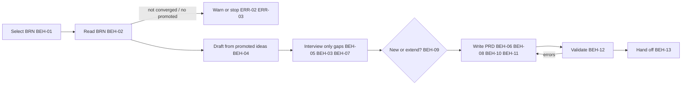

# SPEC-002 — PRD skill (MVP)

## 1. Overview

The `prd` skill ships in the `devforgeai` plugin and is invoked as `/devforgeai:prd [BRN-NNN]`, or
automatically when a user asks to write a PRD from a brainstorm. It:
1. selects a brainstorm document (BRN);
2. drafts requirements from the BRN's **promoted** ideas;
3. interviews the user **only for what the BRN and the request leave open**;
4. writes a new PRD or extends an existing one;
5. validates it;
6. hands off to the epic workflow.

Two rules shape everything else:
- **The PRD records decisions; the AI doesn't make them.** Delivery stage, priority and release are
  written only when the user supplied or confirmed them. Otherwise they're `null`, which means
  "not decided yet", just as `disposition: open` does in a BRN.
- **The PRD states *what* and *why*.** Architecture enters only as **constraints**: fixed external
  conditions such as a mandated platform, a required integration, data residency or an existing system.
  Design decisions belong in ADRs and specs.

This skill implements the spec and is recorded as `SKL-002` in its `provenance.yaml`.

## 2. Constraints

- **NFR-001 / NFR-002 / NFR-003**, as for SPEC-001: a short `SKILL.md` with detail in `references/`,
  spec-only frontmatter with provenance in the sidecar, and behavior proven by the eval suite in §9.
- **ADR-001 v3:** built in a worktree from `src/`, deployed with rsync, and evaluated from a plain terminal.
- **SPEC-001 §5 (downstream contract):**
  - BRNs are at `docs/specs/brainstorm/BRN-NNN.md` with stable item IDs.
  - Only `promoted` ideas are user-approved.
  - `status: converged` means the user confirmed convergence.

## 3. Architecture and components

```
src/claude/DevForgeAI/
├── skills/prd/
│   ├── SKILL.md                          # workflow checklist, decision rules, output contract
│   ├── provenance.yaml                   # SKL-002, implements SPEC-002
│   ├── assets/
│   │   └── prd.md                        # THE PRD template (moved from src/staging/templates/)
│   └── references/
│       ├── output-rules.md               # item-block rules for PRD documents (fallback validation)
│       ├── brn-mapping.md                # how each BRN section maps into the PRD
│       └── interview.md                  # question bank per round and stage, batching rules
└── evals/prd/<case>/                     # one case per automated VER item (§9), fixtures per case
```



## 4. Data model

**Input: a BRN** at `docs/specs/brainstorm/BRN-NNN.md`, read-only (BEH-14).

**Output: a PRD** at `docs/specs/prd/PRD-NNN.md` from `assets/prd.md`, valid against
`prd.schema.json`. This spec adds three fields to the PRD schema and template:

| Field | Where | Values | Meaning |
|---|---|---|---|
| `stage` | frontmatter | `prototype`, `mvp`, `production`, `null` | Delivery stage of the product. `null` = not decided. Controls which quality questions are asked (BEH-03) |
| `priority` | each FR and NFR | `must`, `should`, `could`, `wont`, `null` | MoSCoW importance **within its release**. Now nullable |
| `release` | each FR and NFR | `current`, `later`, `null` | **Which release**: `current` = the PRD's `target_release` (e.g. "MVP"), `later` = backlog |

The NFR `category` list gains `constraint`. A PRD can't move to `approved` while any `stage`,
`priority` or `release` is `null`, the same rule as for `[NEEDS CLARIFICATION]` markers.

**Mapping from BRN to PRD** (the detail goes in `references/brn-mapping.md`):

| BRN | PRD | Link |
|---|---|---|
| `problems` (PRB) | §2 problem prose | frontmatter `upstream`: `{id: BRN-NNN, item: PRB-NN, relation: derives}` |
| promoted `ideas` (IDEA) | one or more `functional_requirements` | item `upstream`: `{id: BRN-NNN, item: IDEA-NN, relation: derives}` |
| `assumptions` (ASM) | `assumptions` | item `upstream`: `derives` the BRN ASM |
| candidate success signals (prose) | `success_metrics` | `derives` the promoted IDEA it measures; otherwise none, with `[NEEDS CLARIFICATION]` target |
| open, parked, rejected ideas | nothing | never cited |

**"Unprocessed" BRN** (used by BEH-01): a BRN with at least one promoted idea that no item in any
`docs/specs/prd/PRD-*.md` cites through an `upstream` link. This is derived from links alone.
**Nothing is written into the BRN to mark it processed**, because downstream documents never edit upstream ones.

## 5. Interfaces and contracts

```yaml
# Proposed SKILL.md frontmatter (validated by src/schemas/skill-frontmatter.schema.json)
name: prd
description: Turns a DevForgeAI brainstorm (BRN) document into a product requirements document (PRD), interviewing only for what the brainstorm leaves open, such as delivery stage, priorities, current-release versus later scope, quality requirements and constraints. Use when the user wants to write a PRD, define requirements or scope from a brainstorm, or continue the DevForgeAI planning chain after brainstorming.
argument-hint: "[BRN-NNN]"
metadata:
  devforgeai-id: "SKL-002"
  devforgeai-version: "1"
```

- **The name must be exactly `prd`.** The brainstorm skill's handoff looks for `${CLAUDE_PLUGIN_ROOT}/skills/prd/SKILL.md`.
- **Arguments:** `$ARGUMENTS` is a BRN ID (`BRN-NNN`) or empty (BEH-01). File paths aren't accepted.
- **Tools:** Read, Glob and Grep to read BRNs and PRDs; Write and Edit for the PRD; AskUserQuestion for the interview.
  AskUserQuestion takes at most 4 questions per call, with 2–4 options each.
- **Downstream contract (consumed by the epic workflow):**
  - PRD path `docs/specs/prd/PRD-NNN.md`, and stable FR, NFR and SM IDs (BEH-09 extends without renumbering).
  - `release: current` marks what the current release must deliver. `null` values are open decisions
    that the epic skill must not treat as decided.
  - `status` stays `draft` until the user approves it. An approved PRD is a scope baseline; widening it goes through an extension that returns it to `in-review` (BEH-09).
  - Epics cite PRD items with `refines` links such as `{id: PRD-001, item: FR-004, relation: refines}`.

## 6. Behavior

```yaml items
behaviors:
  - id: BEH-01
    status: active
    rule: "Select the input. If $ARGUMENTS is a BRN ID, read docs/specs/brainstorm/<ID>.md. If it is empty, list the unprocessed BRNs (§4) with their titles and the number of uncited promoted ideas, then ask which one to use. Never guess the BRN, and never take a file path."
  - id: BEH-02
    status: active
    rule: "Read the BRN's frontmatter status, problems, ideas, assumptions and candidate success signals. Use only ideas with disposition promoted. Never cite an open, parked or rejected idea anywhere in the PRD."
  - id: BEH-03
    status: active
    rule: "Let the delivery stage decide which quality questions to ask. prototype: only constraint, security and privacy. mvp: those, plus performance, reliability and accessibility. production: every NFR category, and the release and rollout section must be filled or marked [NEEDS CLARIFICATION]. When the stage is null, ask the mvp set and leave stage null."
  - id: BEH-04
    status: active
    rule: "Draft before asking. Map the BRN into a PRD draft following references/brn-mapping.md: problems into section 2 with frontmatter derives links; each promoted idea into one or more requirements that start 'The system shall', each with an upstream derives link to its idea; assumptions carried over with derives links; success signals into metrics."
  - id: BEH-05
    status: active
    rule: "Interview only for gaps, in batched rounds using references/interview.md: framing (stage, target_release name, primary users, non-goals), requirements (confirm or edit each drafted requirement, then priority and release), quality and constraints (per BEH-03), and success metrics (baseline and target). Ask at most four questions per call and at most five calls unless the user asks for more. Skip any question the BRN or the request already answers. When the request says to proceed without questions, ask none."
  - id: BEH-06
    status: active
    rule: "Write stage, priority and release only when the user supplied or confirmed them. Otherwise write null. Questions may suggest a value, but a suggestion is never written unconfirmed. Mark any other unanswered gap [NEEDS CLARIFICATION]. Always write status draft. Never set approved."
  - id: BEH-07
    status: active
    rule: "Record fixed external conditions (mandated platforms, required integrations, data residency, existing systems, regulatory mandates) as NFR items with category constraint, stated as the condition and not as a design, with where it applies (the whole product, a named capability or an environment). When the user offers a design preference (for example an architecture style or a framework), ask whether it is a hard constraint. If it is, record it as a constraint. If not, list it under open questions as a design decision for a future ADR, and never as a requirement."
  - id: BEH-08
    status: active
    rule: "For a new PRD, allocate the ID by scanning docs/specs/prd/ for PRD-NNN.md files and using the highest number plus one (PRD-001 if none). Write to docs/specs/prd/PRD-NNN.md, creating the directory if it is missing. Never ask for or accept a file name. Put the product or release name in the title."
  - id: BEH-09
    status: active
    rule: "Decide new versus extend on scope, ownership and lifecycle, never on product identity or the number of existing PRDs. Read each existing PRD's title, goals, non-goals, owner, status and target_release. Recommend extending one only when the BRN's promoted ideas belong to that PRD's existing initiative and scope, share its owner, and fit its release lifecycle. Recommend a new PRD when they form a distinct initiative, have a different owner or approval path, or follow a different schedule, even within the same product. State the reasons and let the user decide. Ask when it is ambiguous; a single existing PRD is not evidence that it is the right destination. To extend: raise the version by one, update the date, give new items the next free number in each collection, leave every existing item unchanged, add a Change Log entry and add the new BRN links. If the PRD was approved, set status to in-review and clear approved_by and approved_on, so the scope change is reviewed explicitly. Then tell the user that epics citing this PRD are now suspect links to re-review."
  - id: BEH-15
    status: active
    rule: "Don't copy a constraint or cross-cutting NFR that another PRD already defines. Cite it from its authoritative source with a frontmatter upstream link {id: PRD-NNN, item: NFR-NNN, relation: constrains}, and say in the PRD what it applies to. When the user states a new constraint, record where it applies in the statement: the whole product, a named capability, or an environment."
  - id: BEH-10
    status: active
    rule: "Fill the frontmatter provenance: generated_by.tool claude-code, generated_by.model the current model ID, generated_by.session the session ID; authors the user and claude-code; reviewed_by empty; every hash null; created and updated today's date."
  - id: BEH-11
    status: active
    rule: "Build the document from ${CLAUDE_SKILL_DIR}/assets/prd.md. Keep every section heading, including the GENERATED epic map. Replace each placeholder or mark it [NEEDS CLARIFICATION]. Delete author comments."
  - id: BEH-12
    status: active
    rule: "Validate after writing. If the devforgeai CLI is on PATH, run devforgeai check --json on the file and fix what it reports. Otherwise check against references/output-rules.md. Repeat until clean, at most three attempts."
  - id: BEH-13
    status: active
    rule: "Hand off with counts of requirements, constraints and metrics, the number of null decisions, the open questions and the PRD path. Then name the next step: if ${CLAUDE_PLUGIN_ROOT}/skills/epic/SKILL.md exists, tell the user to run /devforgeai:epic with the PRD ID. Otherwise say the epic workflow (planned as /devforgeai:epic) does not exist yet and that this PRD is its input. Never start writing an epic."
  - id: BEH-14
    status: active
    rule: "Never modify a BRN document."
```

## 7. Errors and edge cases

```yaml items
errors:
  - id: ERR-01
    status: active
    condition: "The BRN ID given does not exist"
    handling: "Say so, list the BRN IDs that do exist, and write nothing"
    user_result: "The list of available BRNs"
  - id: ERR-02
    status: active
    condition: "The selected BRN's status is not converged"
    handling: "Warn that some ideas may not be decided, and continue only after the user confirms. If there is no confirmation, as in a non-interactive run, write nothing"
    user_result: "A warning and a question; no file unless confirmed"
  - id: ERR-03
    status: active
    condition: "The selected BRN has no promoted idea"
    handling: "Stop, write nothing, and point the user back to the brainstorm workflow to converge"
    user_result: "An explanation and the next step (/devforgeai:brainstorm)"
  - id: ERR-04
    status: active
    condition: "No argument was given and no unprocessed BRN exists"
    handling: "Say that every promoted idea is already cited by a PRD, and write nothing"
    user_result: "A statement that there is nothing to process"
  - id: ERR-05
    status: active
    condition: "The BRN's item blocks can't be read (malformed YAML or missing collections)"
    handling: "Report which block failed and stop. Never repair the BRN"
    user_result: "The error and the BRN path"
  - id: ERR-06
    status: active
    condition: "Validation still fails after three fix attempts"
    handling: "Stop, leave status draft, and list the remaining errors"
    user_result: "The file path and the unresolved errors"
  - id: ERR-07
    status: active
    condition: "The user stops mid-interview"
    handling: "Ask whether to save a draft PRD. If yes, write it with every undecided field null"
    user_result: "Either a draft file or no file, as the user chose"
```

## 8. Non-functional design

```yaml items
quality_responses:
  - id: QR-01
    status: active
    response: "SKILL.md holds only the workflow checklist, decision rules, output contract and links. The BRN mapping, the question bank and the output rules live in references/."
    measured_by: "SKILL.md line count and description length"
    upstream:
      - {id: PRD-001, item: NFR-001, relation: satisfies, version: 3, hash: null}
  - id: QR-02
    status: active
    response: "Frontmatter limited to the fields in §5; provenance kept in provenance.yaml; metadata values quoted"
    measured_by: "Reading against skill-frontmatter.schema.json and skill.schema.json"
    upstream:
      - {id: PRD-001, item: NFR-002, relation: satisfies, version: 3, hash: null}
  - id: QR-03
    status: active
    response: "One eval case per automated VER item, tagged prd and ver-NN, run against the no-plugin baseline"
    measured_by: "claude plugin eval --threshold 0.8 over 3 runs"
    upstream:
      - {id: PRD-001, item: NFR-003, relation: satisfies, version: 3, hash: null}
```

## 9. Verification

Each automated VER item has one eval case under `evals/prd/`, tagged `prd` and `ver-NN`. Runs are
non-interactive, so each case's `case.yaml` scaffold places its fixture BRNs and PRDs.
Output paths are deterministic: `PRD-001.md` in a workspace with no PRD, and `PRD-002.md` when one exists.
File graders must name those literal paths.

```yaml items
verifications:
  - id: VER-01
    status: active
    obligation: "Given a converged BRN-001 with IDEA-01 and IDEA-03 promoted, IDEA-02 parked and IDEA-04 rejected, '/devforgeai:prd BRN-001' with all answers in the prompt writes docs/specs/prd/PRD-001.md. Its requirements cite IDEA-01 and IDEA-03 and never IDEA-02 or IDEA-04. Eval case writes-prd-from-brn: file_exists, regex on the file."
    level: e2e
    covers:
      - BEH-02
      - BEH-04
      - BEH-08
      - BEH-11
      - BEH-12
    upstream:
      - {id: STORY-002, item: AC-02, relation: verifies, version: 2, hash: null}
  - id: VER-02
    status: active
    obligation: "With a prompt that gives the stage (prototype) but no priorities or releases and says to proceed without questions, the file has stage: prototype, only null priority and release values, and status draft. Eval case no-invented-decisions: regex on the file."
    level: e2e
    covers:
      - BEH-06
    upstream:
      - {id: STORY-002, item: AC-03, relation: verifies, version: 2, hash: null}
  - id: VER-03
    status: active
    obligation: "With BRN-001 fully cited by an existing PRD-001 and BRN-002 not cited, '/devforgeai:prd' with no argument offers BRN-002 and not BRN-001, and writes no file. Eval case selects-unprocessed-brn: regex and llm on the reply, file_exists false for PRD-002.md."
    level: e2e
    covers:
      - BEH-01
    upstream:
      - {id: STORY-002, item: AC-01, relation: verifies, version: 2, hash: null}
  - id: VER-04
    status: active
    obligation: "With a draft (not converged) BRN-001, the skill warns and, with no user to confirm, writes no PRD. Eval case warns-unconverged: llm on the reply, file_exists false."
    level: e2e
    covers:
      - ERR-02
    upstream:
      - {id: STORY-002, item: AC-05, relation: verifies, version: 2, hash: null}
  - id: VER-05
    status: active
    obligation: "With a converged BRN-001 that has no promoted idea, the skill stops, writes no PRD and points to the brainstorm workflow. Eval case stops-without-promoted: regex on the reply for brainstorm, file_exists false."
    level: e2e
    covers:
      - ERR-03
    upstream:
      - {id: STORY-002, item: AC-05, relation: verifies, version: 2, hash: null}
  - id: VER-06
    status: active
    obligation: "Fixture: PRD-001 covers one initiative (for example onboarding recovery, with its own owner and target release). BRN-002 promotes ideas for a different initiative in the same product (for example account closure). The skill doesn't default to extending PRD-001: it recommends a new PRD with reasons about scope, ownership or lifecycle, asks the user, writes nothing without an answer, and leaves PRD-001 unchanged. Eval case extend-or-new: llm on the reply, regex that PRD-001.md still has version: 1, file_exists false for PRD-002.md."
    level: e2e
    covers:
      - BEH-09
    upstream:
      - {id: STORY-002, item: AC-06, relation: verifies, version: 2, hash: null}
  - id: VER-07
    status: active
    obligation: "After writing the PRD, the final reply names the epic workflow as the next step with the PRD ID. This plugin has no epic skill, so the reply says the step does not exist yet and names no runnable command. Eval case hands-off-to-epic: regex on last_message."
    level: e2e
    covers:
      - BEH-13
    upstream:
      - {id: STORY-002, item: AC-07, relation: verifies, version: 2, hash: null}
  - id: VER-08
    status: active
    obligation: "A request such as 'open a PR for my staged changes and write its description' does not invoke the prd skill. Eval case ignores-unrelated-request: tool_used Skill min 0 max 0 arm both."
    level: e2e
    covers:
      - QR-02
      - QR-03
    upstream:
      - {id: STORY-002, item: AC-08, relation: verifies, version: 2, hash: null}
  - id: VER-09
    status: active
    obligation: "The written PRD's generated_by has non-empty tool, model and session, reviewed_by is empty and every hash is null. Eval case records-provenance: regex on the file."
    level: e2e
    covers:
      - BEH-10
    upstream:
      - {id: STORY-002, item: AC-09, relation: verifies, version: 2, hash: null}
  - id: VER-10
    status: active
    obligation: "A prompt stating 'it must run on AWS and must integrate with Stripe; I'm leaning towards microservices', with instructions to proceed without questions, yields constraint NFRs for AWS and Stripe, and no requirement or constraint about microservices. Eval case constraints-not-design: regex on the file for category: constraint, llm on the file for the microservices rule."
    level: e2e
    covers:
      - BEH-07
    upstream:
      - {id: STORY-002, item: AC-04, relation: verifies, version: 2, hash: null}
  - id: VER-11
    status: active
    obligation: "In an interactive session with a BRN that already names the users and a request that states the stage: no question repeats either answer, every batch has at most four questions, and the NFR categories asked match the stated stage. Stopping mid-interview offers a draft save."
    level: manual
    covers:
      - BEH-03
      - BEH-05
      - ERR-07
    upstream:
      - {id: STORY-002, item: AC-04, relation: verifies, version: 2, hash: null}
  - id: VER-12
    status: active
    obligation: "Manual extension run: extending PRD-001 from a second BRN of the same initiative raises the version, continues numbering, leaves existing items byte-identical, adds a Change Log entry and warns about suspect epics. With PRD-001 approved beforehand, the extension returns it to in-review and clears the approval. git diff shows no change to any BRN. A new PRD that shares a constraint with PRD-001 cites it with a constrains link, not a copy. Also check that an unknown BRN ID lists the available BRNs, that a malformed BRN stops with the failing block named, and that SKILL.md is within the NFR-001 limits."
    level: manual
    covers:
      - BEH-09
      - BEH-14
      - BEH-15
      - ERR-01
      - ERR-04
      - ERR-05
      - ERR-06
      - QR-01
    upstream:
      - {id: STORY-002, item: AC-06, relation: verifies, version: 2, hash: null}
```

## 10. Rollout, migration and rollback

The skill is new; removing its directory rolls it back. The schema change is additive (`stage`,
`release`, nullable `priority`, the `constraint` category). The one existing PRD, PRD-001 v3, has
already been updated with `null` values.

## 11. Implementation plan

1. Create a worktree for STORY-002, following ADR-001.
2. `git mv src/staging/templates/prd.md src/claude/DevForgeAI/skills/prd/assets/prd.md`, then update
   the prd row's link in `src/staging/templates/README.md` (implements BEH-11).
3. Write `SKILL.md` from §5–§7 and `provenance.yaml` as SKL-002, implementing SPEC-002.
4. Write `references/brn-mapping.md` (§4 mapping), `references/interview.md` (BEH-03, BEH-05, BEH-07) and
   `references/output-rules.md` (from the templates README §1 and `src/schemas/prd.schema.json`).
5. Write the eval cases for VER-01 to VER-10, each with hand-written fixture BRNs and PRDs. Check every
   fixture by reading it against `brainstorm.schema.json` or `prd.schema.json`.
6. Deploy and validate per ADR-001, iterating until every case scores at least 0.8. Do VER-11 and VER-12 by hand.

## 12. Alternatives considered

| Option | Why not chosen |
|---|---|
| Interview for architecture and write design into the PRD | A PRD states what and why. Design written here would be a decision nobody reviewed as a decision. Constraints are captured instead, and design goes to ADRs and specs (§13) |
| Mark a BRN as processed by editing it | Downstream documents never edit upstream ones. "Unprocessed" is derived from PRD links instead |
| Let the skill assign priority and release | These are scope decisions (PRD-001 FR-003). Required non-null fields would force the AI to decide whenever no user is present, as in evals |
| One question per interaction | Too slow for a whole PRD. Batches of up to four follow the AskUserQuestion limits |
| Ask the full question bank every time | Repeats what the BRN already answers. The draft-first approach (BEH-04) asks only for gaps |
| One living PRD per product, extended by every brainstorm | Product identity and change scope differ. Initiatives in one product can have different owners, outcomes, schedules and approvals. An ever-growing PRD also flags every child as suspect on any change, until item-level hashes exist. New versus extend is decided per BEH-09; shared constraints are cited, not copied (BEH-15) |
| Name the item field `scope: mvp` | "mvp" would mean two things: a stage and a release. `release: current \| later` is relative to `target_release` |

## 13. Open questions

- [NEEDS CLARIFICATION: the workflow has no architecture step. brainstorm → prd → epic → story → spec means system-level design first appears per story, in specs. Options: add an architecture skill (ADRs plus a system overview) between prd and epic, or write ADRs by hand when needed. Decision for Bryan]
- [NEEDS CLARIFICATION: PRD-001's own stage, and release per requirement, are null for Bryan to decide]
- [NEEDS CLARIFICATION: whether the VER-09 draft BRN from STORY-001's manual test becomes the not-converged fixture for VER-04, or the fixture is written fresh]

## Change Log

| Version | Date | Author | Change | Items affected |
|---|---|---|---|---|
| 1 | 2026-09-23 | claude-code | Initial draft | all |
| 2 | 2026-09-23 | claude-code | New vs extend by scope, ownership and lifecycle; approved PRDs re-enter review when extended; shared constraints cited, not copied (agreed with Bryan) | BEH-07, BEH-09, BEH-15, VER-06, VER-12, §5, §12 |
