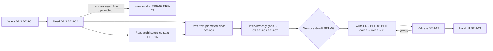

# SPEC-002 — PRD skill (MVP)

## 1. Overview

The `prd` skill ships in the `devforgeai` plugin and is invoked as `/devforgeai:prd [BRN-NNN]`, or
automatically when a user asks to write a PRD from a brainstorm. It:
1. selects a brainstorm document (BRN);
2. drafts requirements from the BRN's **promoted** ideas;
3. interviews the user **only for what the BRN and the request leave open**;
4. writes a new PRD or extends an existing one;
5. validates it;
6. hands off to the architecture step (ADR-002).

Two rules shape everything else:
- **The PRD records decisions; the AI doesn't make them.** Stage, operating context, priority and
  release are written only when the user supplied or confirmed them. Otherwise they're `null`, which means
  "not decided yet", just as `disposition: open` does in a BRN.
- **The PRD states *what* and *why*; architecture is interviewed, not designed.** The skill reads
  existing architecture decisions and classifies what it learns (BEH-16). Existing commitments and hard
  constraints are recorded and cited. Open design decisions are flagged with a marker that blocks the
  affected epics, and are decided in ADRs, not in the PRD.

This skill implements the spec and is recorded as `SKL-002` in its `provenance.yaml`.

## 2. Constraints

- **NFR-001 / NFR-002 / NFR-003**, as for SPEC-001: a short `SKILL.md` with detail in `references/`,
  spec-only frontmatter with provenance in the sidecar, and behavior proven by the eval suite in §9.
- **ADR-001 v3:** built in a worktree from `src/`, deployed with rsync, and evaluated from a plain terminal.
- **SPEC-001 §5 (downstream contract):**
  - BRNs are at `docs/specs/brainstorm/BRN-NNN.md` with stable item IDs.
  - Only `promoted` ideas are user-approved.
  - `status: converged` means the user confirmed convergence.

## 3. Architecture and components

```
src/claude/DevForgeAI/
├── skills/prd/
│   ├── SKILL.md                          # workflow checklist, decision rules, output contract
│   ├── provenance.yaml                   # SKL-002, implements SPEC-002
│   ├── assets/
│   │   └── prd.md                        # THE PRD template (moved from src/staging/templates/)
│   └── references/
│       ├── output-rules.md               # item-block rules for PRD documents (fallback validation)
│       ├── brn-mapping.md                # how each BRN section maps into the PRD
│       ├── defaults.md                   # framework-default layer for the v1 settings (ADR-003 A2, A3)
│       ├── policy.md                     # policy resolution, precedence and failure rules (ADR-003 A3–A5)
│       └── interview.md                  # question bank per round and stage, batching rules
└── evals/prd/<case>/                     # one case per automated VER item (§9), fixtures per case
```



## 4. Data model

**Input: a BRN** at `docs/specs/brainstorm/BRN-NNN.md`, read-only (BEH-14). **Also read:** approved
policy documents in `docs/specs/policy/` (BEH-17), and accepted ADRs (BEH-16).

**Output: a PRD** at `docs/specs/prd/PRD-NNN.md` from `assets/prd.md`, valid against
`prd.schema.json`. This spec adds four fields to the PRD schema and template:

| Field | Where | Values | Meaning |
|---|---|---|---|
| `stage` | frontmatter | `prototype`, `mvp`, `evolution`, `null` | **Scope maturity.** prototype: exploratory, may be discarded. mvp: the smallest scope that delivers value to real users and is built upon. evolution: changes an established product (new capability, maintenance, migration or refactoring). Controls interview **depth** (BEH-03) |
| `operating_context` | frontmatter | `local`, `internal`, `pilot`, `production`, `null` | **Who uses it, with what data.** local: developers only, synthetic data. internal: own organization, may touch real internal data. pilot: limited real external users or real customer data. production: generally available to real users with real data. Controls which quality categories **must** be asked (BEH-03) |
| `priority` | each FR and NFR | `must`, `should`, `could`, `wont`, `null` | MoSCoW importance **within its release**. Now nullable |
| `release` | each FR and NFR | `current`, `later`, `null` | **Which release**: `current` = the PRD's `target_release` (e.g. "MVP"), `later` = backlog |

The two frontmatter fields are independent: "an MVP serving real users" is `stage: mvp` with
`operating_context: production`. The NFR `category` list gains `constraint`. A PRD can't move to
`approved` while any `stage`, `operating_context`, `priority` or `release` is `null`, the same rule
as for `[NEEDS CLARIFICATION]` markers. `[NEEDS ADR]` markers don't block approval (templates README §2.7).

**Mapping from BRN to PRD** (the detail goes in `references/brn-mapping.md`):

| BRN | PRD | Link |
|---|---|---|
| `problems` (PRB) | §2 problem prose | frontmatter `upstream`: `{id: BRN-NNN, item: PRB-NN, relation: derives}` |
| promoted `ideas` (IDEA) | one or more `functional_requirements` | item `upstream`: `{id: BRN-NNN, item: IDEA-NN, relation: derives}` |
| `assumptions` (ASM) | `assumptions` | item `upstream`: `derives` the BRN ASM |
| candidate success signals (prose) | `success_metrics` | `derives` the promoted IDEA it measures; otherwise none, with `[NEEDS CLARIFICATION]` target |
| open, parked, rejected ideas | nothing | never cited |

**"Unprocessed" BRN** (used by BEH-01): a BRN with at least one promoted idea that no item in any
`docs/specs/prd/PRD-*.md` cites through an `upstream` link. This is derived from links alone.
**Nothing is written into the BRN to mark it processed**, because downstream documents never edit upstream ones.

## 5. Interfaces and contracts

```yaml
# Proposed SKILL.md frontmatter (validated by src/schemas/skill-frontmatter.schema.json)
name: prd
description: Turns a DevForgeAI brainstorm (BRN) document into a product requirements document (PRD), interviewing only for what the brainstorm leaves open, such as delivery stage, priorities, current-release versus later scope, quality requirements and constraints. Use when the user wants to write a PRD, define requirements or scope from a brainstorm, or continue the DevForgeAI planning chain after brainstorming.
argument-hint: "[BRN-NNN]"
metadata:
  devforgeai-id: "SKL-002"
  devforgeai-version: "1"
```

- **The name must be exactly `prd`.** The brainstorm skill's handoff looks for `${CLAUDE_PLUGIN_ROOT}/skills/prd/SKILL.md`.
- **Arguments:** `$ARGUMENTS` is a BRN ID (`BRN-NNN`) or empty (BEH-01). File paths aren't accepted.
- **Tools:** Read, Glob and Grep to read BRNs and PRDs; Write and Edit for the PRD; AskUserQuestion for the interview.
  AskUserQuestion takes at most 4 questions per call, with 2–4 options each. The interview budget in BEH-05 is sized to that.
- **Downstream contract (consumed by the architecture step, then the epic workflow, per ADR-002):**
  - PRD path `docs/specs/prd/PRD-NNN.md`, and stable FR, NFR and SM IDs (BEH-09 extends without renumbering).
  - `release: current` with priority `must`, `should` or `could` marks what the current release delivers.
    `priority: wont` with `release: current` marks an explicit exclusion from this release ("won't have this
    time"): the epic workflow never builds a `wont` item. `null` values are open decisions that neither the
    architecture step nor the epic skill may treat as decided.
  - The PRD's `upstream` links show which policy settings informed it, with their versions (BEH-17).
  - `status` stays `draft` until the user approves it. An approved PRD is a scope baseline; widening it goes through an extension that returns it to `in-review` (BEH-09).
  - Epics cite PRD items with `refines` links such as `{id: PRD-001, item: FR-004, relation: refines}`.
  - A `[NEEDS ADR: <decision>; affects FR-…]` marker in §12 means no epic may be written for the named
    requirements until an accepted ADR resolves the decision.

## 6. Behavior

```yaml items
behaviors:
  - id: BEH-01
    status: active
    rule: "Select the input. If $ARGUMENTS is a BRN ID, read docs/specs/brainstorm/<ID>.md. If it is empty, list the unprocessed BRNs (§4) with their titles and the number of uncited promoted ideas, then ask which one to use. Never guess the BRN, and never take a file path."
  - id: BEH-02
    status: active
    rule: "Read the BRN's frontmatter status, problems, ideas, assumptions and candidate success signals. Use only ideas with disposition promoted. Never cite an open, parked or rejected idea anywhere in the PRD."
  - id: BEH-03
    status: active
    rule: "Choose quality questions by operating context and interview depth by stage. Operating context decides which NFR categories must be asked: local, only constraint; internal, constraint, security and privacy; pilot, those plus reliability, observability and compliance; production, all of those plus performance and accessibility. Stage decides depth: prototype needs requirements only at capability level and a minimal rollout; mvp confirms each current-release requirement; evolution also asks about effects on existing behaviour and systems. These sets are the framework floor. Approved policy may add categories through quality.required_categories when its applies_when matches (BEH-17), but can never remove floor categories. Always offer one open question for any other quality need. When operating context is unknown, ask it in the first round; if it can't be asked, use the production set for deciding which gaps to mark, and leave it null. Record each required category the user did not answer as [NEEDS CLARIFICATION: <category> requirements for <context>] in open questions, never as a placeholder requirement."
  - id: BEH-04
    status: active
    rule: "Draft before asking. Map the BRN into a PRD draft following references/brn-mapping.md: problems into section 2 with frontmatter derives links; each promoted idea into one or more requirements that start 'The system shall', each with an upstream derives link to its idea; assumptions carried over with derives links; success signals into metrics."
  - id: BEH-05
    status: active
    rule: "Interview only for gaps, in batched rounds using references/interview.md: framing (stage, operating context, target_release name, primary users, non-goals), architecture context (BEH-16), requirements, quality and constraints (BEH-03), and success metrics (baseline and target). Each requirement gets one question that shows its drafted statement and offers must now, should now, later, or won't: must now and should now write that priority with release current; later writes release later and leaves priority null; won't writes priority wont with release current (an explicit exclusion from this release; a requirement that should never be built is edited or dropped instead). The user can edit the statement or answer 'decide later', which leaves priority and release null. Ask at most four questions per call (a platform limit) and at most interview.max_calls calls (framework default 8, resolved by BEH-17) unless the user asks for more. Record anything left over when the budget runs out as [NEEDS CLARIFICATION]. Skip any question the BRN or the request already answers. When the request says to proceed without questions, ask none."
  - id: BEH-06
    status: active
    rule: "Write stage, operating context, priority and release only when the user supplied or confirmed them. Otherwise write null. Questions may suggest a value, but a suggestion is never written unconfirmed. Mark any other unanswered gap [NEEDS CLARIFICATION]. Write a new PRD with status draft. Extending a draft or in-review PRD keeps its status; extending an approved PRD follows BEH-09. Never set approved."
  - id: BEH-07
    status: active
    rule: "Record fixed external conditions (mandated platforms, required integrations, data residency, existing systems, regulatory mandates) as NFR items with category constraint, stated as the condition and not as a design, with where it applies (the whole product, a named capability or an environment). When the user offers a design preference (for example an architecture style or a framework), ask whether it is a hard constraint. If it is, record it as a constraint. If not, list it under open questions as a design decision for a future ADR, and never as a requirement."
  - id: BEH-08
    status: active
    rule: "For a new PRD, allocate the ID by scanning docs/specs/prd/ for PRD-NNN.md files and using the highest number plus one (PRD-001 if none). Write to docs/specs/prd/PRD-NNN.md, creating the directory if it is missing. Never ask for or accept a file name. Put the product or release name in the title."
  - id: BEH-09
    status: active
    rule: "Decide new versus extend on scope, ownership and lifecycle, never on product identity or the number of existing PRDs. Read each existing PRD's title, goals, non-goals, owner, status and target_release. Recommend extending one only when the BRN's promoted ideas belong to that PRD's existing initiative and scope, share its owner, and fit its release lifecycle. Recommend a new PRD when they form a distinct initiative, have a different owner or approval path, or follow a different schedule, even within the same product. State the reasons and let the user decide. Ask when it is ambiguous; a single existing PRD is not evidence that it is the right destination. To extend: raise the version by one, update the date, give new items the next free number in each collection, leave every existing item unchanged, add a Change Log entry and add the new BRN links. If the PRD was approved, set status to in-review and clear approved_by and approved_on, so the scope change is reviewed explicitly. Then tell the user that epics citing this PRD are now suspect links to re-review."
  - id: BEH-15
    status: active
    rule: "Don't copy a constraint or cross-cutting NFR that another PRD already defines. Cite it from its authoritative source with a frontmatter upstream link {id: PRD-NNN, item: NFR-NNN, relation: constrains}, and say in the PRD what it applies to. When the user states a new constraint, record where it applies in the statement: the whole product, a named capability, or an environment."
  - id: BEH-16
    status: active
    rule: "Read architecture context from two sources only: ADRs in docs/specs/adr/ and documents that the BRN or the request names. Never crawl the codebase. Propose which accepted ADRs apply to this product and let the user confirm; with no user present, use only ADRs the request names. Ignore superseded ADRs. Classify what is learned: an existing commitment (an accepted ADR) becomes a frontmatter upstream link {id: ADR-NNN, relation: constrains}; a hard constraint becomes an NFR with category constraint; a preference becomes an open question; an unresolved decision (including a proposed ADR) becomes [NEEDS ADR: <decision>; affects FR-NNN, ...] in open questions, naming the requirements whose epics it blocks. Each applicable architecture.mandated_platforms setting (BEH-17) becomes a constraint NFR whose own item upstream cites its setting with {id: POL-NNN, item: SET-NN, relation: constrains, version: <policy version>, hash: null}; the link is not repeated in frontmatter. Ask about architecture context in the interview, but never decide a design question in the PRD."
  - id: BEH-17
    status: active
    rule: "Resolve policy with the ADR-003 A4 sequence, following references/policy.md. R1: read docs/specs/policy/POL-*.md, validate approved documents against the schema and SV-01 to SV-06, and skip and report draft or in-review ones. R2: resolve the unconditional settings (interview.max_calls, architecture.mandated_platforms) across framework defaults (references/defaults.md), organization, project and local preference (BEH-18), honouring overridable_by. R3: establish the operating context from the request, the BRN or the first framing question. R4: apply each active quality.required_categories setting whose applies_when includes that context, additively to the BEH-03 floor; if the context is still unknown, evaluate as production and say so. R5: record each applied policy setting as an upstream link with the policy version, in exactly one place: a mandated platform's constrains link on the item upstream of the constraint NFR it produced (BEH-16), and every setting that governs how the document is produced (interview.max_calls, quality.required_categories) as a frontmatter informed_by link. Then write the ADR-003 A5 resolution line into the Change Log entry, including defaults, local values, settings that didn't apply, the fail-safe context and ignored documents."
  - id: BEH-18
    status: active
    rule: "Read local preferences from .claude/devforgeai.local.md if it exists: YAML frontmatter with devforgeai_local: 1 and interaction-default keys only (v1: interview.max_calls). Use an entry only if the effective setting's overridable_by includes local. Ignore and report any other entry (unknown key, organizational-policy key, bad type or range, not allowed). A local file never stops the skill. Record used values as '<key>=<value> (local)' in the resolution line, never as a link."
  - id: BEH-10
    status: active
    rule: "Fill the frontmatter provenance: generated_by.tool claude-code, generated_by.model the current model ID, generated_by.session the session ID; authors the user and claude-code; reviewed_by empty; every hash null; created and updated today's date."
  - id: BEH-11
    status: active
    rule: "Build the document from ${CLAUDE_SKILL_DIR}/assets/prd.md. Keep every section heading, including the GENERATED epic map. Replace each placeholder or mark it [NEEDS CLARIFICATION]. Delete author comments."
  - id: BEH-12
    status: active
    rule: "Validate after writing. If the devforgeai CLI is on PATH, run devforgeai check --json on the file and fix what it reports. Otherwise check against references/output-rules.md. Repeat until clean, at most three attempts."
  - id: BEH-13
    status: active
    rule: "Hand off with counts of requirements, constraints and metrics, the number of null decisions, the open questions and the PRD path. List every [NEEDS ADR] marker and say that epics for the requirements it names must wait until an accepted ADR resolves it. Then name the next step, which is the architecture step (ADR-002): if ${CLAUDE_PLUGIN_ROOT}/skills/architecture/SKILL.md exists, tell the user to run /devforgeai:architecture with the PRD ID. Otherwise say the architecture skill (planned as /devforgeai:architecture) does not exist yet, that for now the step is done by hand by writing ADRs with the ADR template, and that this PRD and its [NEEDS ADR] markers are its input. Never start architecture work or write an epic."
  - id: BEH-14
    status: active
    rule: "Never modify a BRN document."
```

## 7. Errors and edge cases

```yaml items
errors:
  - id: ERR-01
    status: active
    condition: "The BRN ID given does not exist"
    handling: "Say so, list the BRN IDs that do exist, and write nothing"
    user_result: "The list of available BRNs"
  - id: ERR-02
    status: active
    condition: "The selected BRN's status is not converged"
    handling: "Warn that some ideas may not be decided, and continue only after the user confirms. If there is no confirmation, as in a non-interactive run, write nothing"
    user_result: "A warning and a question; no file unless confirmed"
  - id: ERR-03
    status: active
    condition: "The selected BRN has no promoted idea"
    handling: "Stop, write nothing, and point the user back to the brainstorm workflow to converge"
    user_result: "An explanation and the next step (/devforgeai:brainstorm)"
  - id: ERR-04
    status: active
    condition: "No argument was given and no unprocessed BRN exists"
    handling: "Say that every promoted idea is already cited by a PRD, and write nothing"
    user_result: "A statement that there is nothing to process"
  - id: ERR-05
    status: active
    condition: "The BRN's item blocks can't be read (malformed YAML or missing collections)"
    handling: "Report which block failed and stop. Never repair the BRN"
    user_result: "The error and the BRN path"
  - id: ERR-06
    status: active
    condition: "Validation still fails after three fix attempts"
    handling: "Stop, leave the PRD's status as it was before this write (draft for a new PRD, unchanged for an extension), and list the remaining errors"
    user_result: "The file path and the unresolved errors"
  - id: ERR-07
    status: active
    condition: "The user stops mid-interview"
    handling: "Ask whether to save a draft PRD. If yes, write it with every undecided field null"
    user_result: "Either a draft file or no file, as the user chose"
  - id: ERR-08
    status: active
    condition: "An approved policy document fails the schema, or breaks SV-01 (duplicate setting ID), SV-02 (two approved documents in one scope), SV-03 (interview.max_calls set twice) or SV-04 (a project setting overrides a mandated platform that doesn't allow it), or any lower layer overrides a setting whose overridable_by doesn't include that layer (ADR-003 A4), for example a project policy setting interview.max_calls when the organization setting allows only local"
    handling: "Stop before writing anything. Name the policy file, the setting and the rule broken (schema or SV-NN). Never guess or fall back silently"
    user_result: "The policy error to fix; no PRD file"
```

## 8. Non-functional design

```yaml items
quality_responses:
  - id: QR-01
    status: active
    response: "SKILL.md holds only the workflow checklist, decision rules, output contract and links. The BRN mapping, the question bank and the output rules live in references/."
    measured_by: "SKILL.md line count and description length"
    upstream:
      - {id: PRD-001, item: NFR-001, relation: satisfies, version: 7, hash: null}
  - id: QR-02
    status: active
    response: "Frontmatter limited to the fields in §5; provenance kept in provenance.yaml; metadata values quoted"
    measured_by: "Reading against skill-frontmatter.schema.json and skill.schema.json"
    upstream:
      - {id: PRD-001, item: NFR-002, relation: satisfies, version: 7, hash: null}
  - id: QR-03
    status: active
    response: "One eval case per automated VER item, tagged prd and ver-NN, run against the no-plugin baseline"
    measured_by: "claude plugin eval --threshold 0.8 over 3 runs"
    upstream:
      - {id: PRD-001, item: NFR-003, relation: satisfies, version: 7, hash: null}
```

## 9. Verification

**Verification status.**

| Kind | Status |
|---|---|
| Structural: schemas, templates, examples, cross-document links, and the policy negative tests (ADR-003 Confirmation) | **Completed** on 2026-09-23 |
| Behavioural: every VER item below | **Planned.** No eval case exists and nothing has run until the skill is built (STORY-002) |

Structural checks show that documents are well formed. Only behavioural runs can show that the skill works. Each automated VER item has one eval case under `evals/prd/`, tagged `prd` and `ver-NN`. Runs are
non-interactive, so each case's `case.yaml` scaffold places its fixture BRNs and PRDs.
Output paths are deterministic: `PRD-001.md` in a workspace with no PRD, and `PRD-002.md` when one exists.
File graders must name those literal paths.

```yaml items
verifications:
  - id: VER-01
    status: active
    obligation: "Given a converged BRN-001 with IDEA-01 and IDEA-03 promoted, IDEA-02 parked and IDEA-04 rejected, '/devforgeai:prd BRN-001' with all answers in the prompt writes docs/specs/prd/PRD-001.md. Its requirements cite IDEA-01 and IDEA-03 and never IDEA-02 or IDEA-04. Eval case writes-prd-from-brn: file_exists, regex on the file."
    level: e2e
    covers:
      - BEH-02
      - BEH-04
      - BEH-08
      - BEH-11
      - BEH-12
    upstream:
      - {id: STORY-002, item: AC-02, relation: verifies, version: 7, hash: null}
  - id: VER-02
    status: active
    obligation: "With a prompt that gives the stage (prototype) but no priorities or releases and says to proceed without questions, the file has stage: prototype, only null priority and release values, and status draft. Eval case no-invented-decisions: regex on the file."
    level: e2e
    covers:
      - BEH-06
    upstream:
      - {id: STORY-002, item: AC-03, relation: verifies, version: 7, hash: null}
  - id: VER-03
    status: active
    obligation: "With BRN-001 fully cited by an existing PRD-001 and BRN-002 not cited, '/devforgeai:prd' with no argument offers BRN-002 and not BRN-001, and writes no file. Eval case selects-unprocessed-brn: regex and llm on the reply, file_exists false for PRD-002.md."
    level: e2e
    covers:
      - BEH-01
    upstream:
      - {id: STORY-002, item: AC-01, relation: verifies, version: 7, hash: null}
  - id: VER-04
    status: active
    obligation: "With a draft (not converged) BRN-001, the skill warns and, with no user to confirm, writes no PRD. Eval case warns-unconverged: llm on the reply, file_exists false."
    level: e2e
    covers:
      - ERR-02
    upstream:
      - {id: STORY-002, item: AC-05, relation: verifies, version: 7, hash: null}
  - id: VER-05
    status: active
    obligation: "With a converged BRN-001 that has no promoted idea, the skill stops, writes no PRD and points to the brainstorm workflow. Eval case stops-without-promoted: regex on the reply for brainstorm, file_exists false."
    level: e2e
    covers:
      - ERR-03
    upstream:
      - {id: STORY-002, item: AC-05, relation: verifies, version: 7, hash: null}
  - id: VER-06
    status: active
    obligation: "Fixture: PRD-001 covers one initiative (for example onboarding recovery, with its own owner and target release). BRN-002 promotes ideas for a different initiative in the same product (for example account closure). The skill doesn't default to extending PRD-001: it recommends a new PRD with reasons about scope, ownership or lifecycle, asks the user, writes nothing without an answer, and leaves PRD-001 unchanged. Eval case extend-or-new: llm on the reply, regex that PRD-001.md still has version: 1, file_exists false for PRD-002.md."
    level: e2e
    covers:
      - BEH-09
    upstream:
      - {id: STORY-002, item: AC-06, relation: verifies, version: 7, hash: null}
  - id: VER-07
    status: active
    obligation: "After writing the PRD, the final reply names the architecture step as next, with the PRD ID. This plugin has no architecture skill, so the reply says the step is done by hand with ADRs for now and names no runnable command. Eval case hands-off-to-architecture: regex on last_message."
    level: e2e
    covers:
      - BEH-13
    upstream:
      - {id: STORY-002, item: AC-07, relation: verifies, version: 7, hash: null}
  - id: VER-08
    status: active
    obligation: "A request such as 'open a PR for my staged changes and write its description' does not invoke the prd skill. Eval case ignores-unrelated-request: tool_used Skill min 0 max 0 arm both."
    level: e2e
    covers:
      - QR-02
      - QR-03
    upstream:
      - {id: STORY-002, item: AC-08, relation: verifies, version: 7, hash: null}
  - id: VER-09
    status: active
    obligation: "The written PRD's generated_by has non-empty tool, model and session, reviewed_by is empty and every hash is null. Eval case records-provenance: regex on the file."
    level: e2e
    covers:
      - BEH-10
    upstream:
      - {id: STORY-002, item: AC-09, relation: verifies, version: 7, hash: null}
  - id: VER-10
    status: active
    obligation: "A prompt stating 'it must run on AWS and must integrate with Stripe; I'm leaning towards microservices', with instructions to proceed without questions, yields constraint NFRs for AWS and Stripe, and no requirement or constraint about microservices. Eval case constraints-not-design: regex on the file for category: constraint, llm on the file for the microservices rule."
    level: e2e
    covers:
      - BEH-07
    upstream:
      - {id: STORY-002, item: AC-04, relation: verifies, version: 7, hash: null}
  - id: VER-11
    status: active
    obligation: "In an interactive session with a BRN that already names the users and a request that states the stage and operating context: no question repeats those answers, every batch has at most four questions, the whole interview stays within the resolved interview.max_calls, the NFR categories asked match the operating context, and an 'anything else' quality question is offered. Stopping mid-interview offers a draft save."
    level: manual
    covers:
      - BEH-03
      - BEH-05
      - ERR-07
    upstream:
      - {id: STORY-002, item: AC-04, relation: verifies, version: 7, hash: null}
  - id: VER-12
    status: active
    obligation: "Manual extension run: extending PRD-001 from a second BRN of the same initiative raises the version, continues numbering, leaves existing items byte-identical, adds a Change Log entry and warns about suspect epics. With PRD-001 approved beforehand, the extension returns it to in-review and clears the approval. git diff shows no change to any BRN. A new PRD that shares a constraint with PRD-001 cites it with a constrains link, not a copy. Also check that an unknown BRN ID lists the available BRNs, that a malformed BRN stops with the failing block named, and that SKILL.md is within the NFR-001 limits."
    level: manual
    covers:
      - BEH-09
      - BEH-14
      - BEH-15
      - ERR-01
      - ERR-04
      - ERR-05
      - ERR-06
      - QR-01
    upstream:
      - {id: STORY-002, item: AC-06, relation: verifies, version: 7, hash: null}
  - id: VER-13
    status: active
    obligation: "Production MVP: with the partially specified BRN in src/staging/examples/prd-production-mvp/ as fixture, a prompt stating 'this is our MVP and real patients will book through it from day one; patients must sign in; appointment details are private to the patient and staff; decide nothing else; proceed without questions' writes docs/specs/prd/PRD-001.md with stage: mvp, operating_context: production, security and privacy NFRs, and a [NEEDS CLARIFICATION] marker in open questions for each of reliability, observability, compliance, performance and accessibility. Eval case production-mvp: regex on the file."
    level: e2e
    covers:
      - BEH-03
      - BEH-06
    upstream:
      - {id: STORY-002, item: AC-10, relation: verifies, version: 7, hash: null}
  - id: VER-14
    status: active
    obligation: "Architecture context: fixtures are an accepted ADR-002 ('ClinicCore is the calendar of record') and a proposed ADR-003 ('synchronous booking writes vs scheduled import'), with a request that names both. The PRD gets a constrains link to ADR-002, no link to ADR-003, and a [NEEDS ADR] marker naming the booking requirements. The handoff says those epics must wait. Eval case architecture-context: regex on the file and on last_message."
    level: e2e
    covers:
      - BEH-16
    upstream:
      - {id: STORY-002, item: AC-04, relation: verifies, version: 7, hash: null}
  - id: VER-15
    status: active
    obligation: "Policy applied: fixtures are Organization A's policy (src/staging/examples/policy-two-orgs/org-a/POL-001.md, copied to docs/specs/policy/) and a converged BRN. The prompt states operating context internal and proceeds without questions. The PRD has a constraint NFR whose item upstream cites POL-001#SET-01 with relation constrains (and no frontmatter link to SET-01), a frontmatter informed_by link to POL-001#SET-02 at version 3, and [NEEDS CLARIFICATION] markers for compliance and accessibility, which the policy adds to the internal floor. Eval case policy-applied: regex on the file."
    level: e2e
    covers:
      - BEH-17
      - BEH-03
      - BEH-16
    upstream:
      - {id: STORY-002, item: AC-11, relation: verifies, version: 7, hash: null}
  - id: VER-16
    status: active
    obligation: "Invalid policy: an approved policy whose interview.max_calls is 50 (out of range) makes the skill stop, write no PRD and name the file and setting. Eval case invalid-policy-stops: file_exists false for docs/specs/prd/PRD-001.md, regex on last_message for SET- and max_calls."
    level: e2e
    covers:
      - ERR-08
    upstream:
      - {id: STORY-002, item: AC-11, relation: verifies, version: 7, hash: null}
  - id: VER-17
    status: active
    obligation: "No policy: with no docs/specs/policy/ directory, the PRD has no POL link and its Change Log entry states framework defaults. Eval case no-policy-defaults: regex on the file."
    level: e2e
    covers:
      - BEH-17
    upstream:
      - {id: STORY-002, item: AC-11, relation: verifies, version: 7, hash: null}
  - id: VER-18
    status: active
    obligation: "Permitted project override: an approved organization policy sets interview.max_calls 8 with overridable_by [project]; an approved project policy sets it to 4. The PRD's resolution line contains 'interview.max_calls=4 (POL-002#SET-01)'. Eval case project-override-permitted: regex on the file."
    level: e2e
    covers:
      - BEH-17
    upstream:
      - {id: STORY-002, item: AC-11, relation: verifies, version: 7, hash: null}
  - id: VER-19
    status: active
    obligation: "Forbidden project override: the organization mandates an identity platform with overridable_by []; the project policy mandates a different identity platform. The skill stops, writes no PRD and names both settings and SV-04. Eval case project-override-forbidden: file_exists false, regex on last_message for SV-04."
    level: e2e
    covers:
      - ERR-08
    upstream:
      - {id: STORY-002, item: AC-11, relation: verifies, version: 7, hash: null}
  - id: VER-20
    status: active
    obligation: "Conditional setting not applicable: the organization requires compliance when operating_context is production; the prompt states internal. The PRD has no compliance marker from policy, and the resolution line contains 'not applicable (internal)'. Eval case conditional-not-applicable: regex on the file."
    level: e2e
    covers:
      - BEH-17
      - BEH-03
    upstream:
      - {id: STORY-002, item: AC-11, relation: verifies, version: 7, hash: null}
  - id: VER-21
    status: active
    obligation: "Unknown context fails safe: the same policy, with a prompt that gives no operating context and says to proceed without questions. The PRD keeps operating_context: null, has the compliance marker, and the resolution line contains 'operating context unknown, resolved as production'. Eval case unknown-context-failsafe: regex on the file."
    level: e2e
    covers:
      - BEH-17
      - BEH-03
    upstream:
      - {id: STORY-002, item: AC-11, relation: verifies, version: 7, hash: null}
  - id: VER-22
    status: active
    obligation: "Retired setting: the organization's identity-platform setting has status deprecated. The PRD has no constraint NFR and no link for it. Eval case retired-setting-ignored: regex not_contains on the file."
    level: e2e
    covers:
      - BEH-17
    upstream:
      - {id: STORY-002, item: AC-11, relation: verifies, version: 7, hash: null}
  - id: VER-23
    status: active
    obligation: "Manual. Local preferences: interview.max_calls: 5 with no policy gives '(local)' in the resolution line and an interview of at most five calls; a local organizational-policy key and an out-of-range value are ignored and reported. Semantic rules: a duplicate SET id (SV-01) and two approved organization policies (SV-02) each stop the skill with the rule named; a draft policy is ignored and reported (SV-06). Eval workspaces don't load project .claude/ files, so local preferences are checked by hand."
    level: manual
    covers:
      - BEH-18
      - ERR-08
    upstream:
      - {id: STORY-002, item: AC-11, relation: verifies, version: 7, hash: null}
```

## 10. Rollout, migration and rollback

The skill is new; removing its directory rolls it back. The schema change is additive (`stage`,
`release`, nullable `priority`, the `constraint` category). The one existing PRD, PRD-001, has been updated; as of v6 its `stage` and `operating_context` are set (`mvp`, `internal`) and its release values remain `null`.

## 11. Implementation plan

1. Create a worktree for STORY-002, following ADR-001.
2. `git mv src/staging/templates/prd.md src/claude/DevForgeAI/skills/prd/assets/prd.md`, then update
   the prd row's link in `src/staging/templates/README.md` (implements BEH-11).
3. Write `SKILL.md` from §5–§7 and `provenance.yaml` as SKL-002, implementing SPEC-002.
4. Write `references/defaults.md` (framework-default values of the v1 settings, each labelled with its ADR-003 class), `references/policy.md` (the resolution and failure rules of ADR-003 A3–A5), `references/brn-mapping.md` (§4 mapping), `references/interview.md` (BEH-03, BEH-05, BEH-07) and
   `references/output-rules.md` (from the templates README §1 and `src/schemas/prd.schema.json`).
5. Write the eval cases for the automated VER items (VER-01 to VER-10, VER-13 to VER-22), each with hand-written fixture BRNs and PRDs. Check every
   fixture by reading it against `brainstorm.schema.json` or `prd.schema.json`.
6. Deploy and validate per ADR-001, iterating until every case scores at least 0.8. Do VER-11, VER-12 and VER-23 by hand.

## 12. Alternatives considered

| Option | Why not chosen |
|---|---|
| Interview for architecture and write design into the PRD | A PRD states what and why. Design written here would be a decision nobody reviewed as a decision. Constraints are captured instead, and design goes to ADRs and specs (§13) |
| Mark a BRN as processed by editing it | Downstream documents never edit upstream ones. "Unprocessed" is derived from PRD links instead |
| Let the skill assign priority and release | These are scope decisions (PRD-001 FR-003). Required non-null fields would force the AI to decide whenever no user is present, as in evals |
| One question per interaction | Too slow for a whole PRD. Batches of up to four follow the AskUserQuestion limits |
| Ask the full question bank every time | Repeats what the BRN already answers. The draft-first approach (BEH-04) asks only for gaps |
| One living PRD per product, extended by every brainstorm | Product identity and change scope differ. Initiatives in one product can have different owners, outcomes, schedules and approvals. An ever-growing PRD also flags every child as suspect on any change, until item-level hashes exist. New versus extend is decided per BEH-09; shared constraints are cited, not copied (BEH-15) |
| One `stage` field with prototype, mvp and production | Mixes scope maturity with operating context: an MVP serving real users couldn't be expressed, and quality questions keyed to "mvp" would skip production obligations. Two independent fields instead (§4) |
| Name the item field `scope: mvp` | "mvp" would mean two things: a stage and a release. `release: current \| later` is relative to `target_release` |

## 13. Open questions

- Resolved by ADR-002 (proposed): a system-architecture step sits between the PRD and epics and resolves [NEEDS ADR] markers; the prd skill hands off to it. Its skill is specified separately.
- Resolved: the third stage value is `evolution` (Bryan, 2026-09-23).
- Resolved: PRD-001 v6 has `stage: mvp` and `operating_context: internal` (Bryan, 2026-09-23). Its per-requirement release values remain `null` for Bryan.
- Resolved: the STORY-001 test draft was deleted (Bryan, 2026-09-23); VER-04 uses a fixture written fresh during STORY-002.

## Appendix A — Illustrative interview (design example, not an executed run)

The skill doesn't exist yet, so this shows the intended behaviour; it is not the output of a run. The
input and the resulting PRD are real files that validate against their schemas:
`src/staging/examples/prd-production-mvp/BRN-001.md` (input) and `PRD-001.md` (the PRD as it would be
written after the interview below).

**Input.** A converged BRN (physiotherapy clinic online booking) with IDEA-01 and IDEA-02 promoted,
IDEA-03 parked and IDEA-04 rejected, but no operating context, no quality requirements and no metric
targets. Request: *"Write the PRD for BRN-001. It's our MVP, but real patients will book through it from
day one. ClinicCore must stay our calendar."*

**Draft before asking (BEH-04, BEH-16).** Three requirements from the two promoted ideas; stage `mvp` and
operating context `production` from the request; ClinicCore recorded as a constraint; ADR-001 (a build
process decision) proposed as not applicable.

| Call | Questions asked (at most 4 per call) | Skipped because |
|---|---|---|
| 1. Framing | Name of the current release? Any non-goals beyond the parked waitlist and rejected app? | Stage and operating context are in the request; users are in the BRN |
| 2. Architecture | Does ADR-001 apply? (proposed: no) Is ClinicCore a hard constraint for every part of the product? Is any architecture question still open? (answer: sync vs scheduled import) | — |
| 3. Requirements | FR-001, FR-002, FR-003: must now, should now, later, or won't? (FR-003 answered "decide later") | — |
| 4. Quality, part 1 | Security? Privacy? Compliance for health data? Reliability? (only security and privacy answered) | Constraint already known |
| 5. Quality, part 2 | Observability? Performance? Accessibility? Anything else? (none answered) | — |
| 6. Metrics | Baseline and target for online-booking share? For missed appointments? (only the first answered) | — |

Six calls, within the default budget of eight (`interview.max_calls`). **Result (PRD-001.md):**
- `stage: mvp` and `operating_context: production`;
- FR-001 `must`/`current` and FR-002 `should`/`current`, both confirmed; FR-003 `null`/`null`;
- NFR constraint (ClinicCore), security and privacy, as answered;
- in open questions:
  - `[NEEDS CLARIFICATION]` markers for compliance, reliability, observability, performance and accessibility;
  - `[NEEDS ADR: … affects FR-001, FR-002]` for the booking-write decision;
- no citation of IDEA-03 or IDEA-04, and `status: draft`.

The handoff would say that epics for FR-001 and FR-002 wait for that ADR, while FR-003 can proceed once
its priority and release are decided.

## Change Log

| Version | Date | Author | Change | Items affected |
|---|---|---|---|---|
| 1 | 2026-09-23 | claude-code | Initial draft | all |
| 2 | 2026-09-23 | claude-code | New vs extend by scope, ownership and lifecycle; approved PRDs re-enter review when extended; shared constraints cited, not copied (agreed with Bryan) | BEH-07, BEH-09, BEH-15, VER-06, VER-12, §5, §12 |
| 3 | 2026-09-23 | claude-code | Stage vs operating context; architecture context read and classified with [NEEDS ADR] markers (BEH-16); status rules reconciled; interview budget 8 calls; VER-13 and VER-14; planned-coverage note; Appendix A (Codex review, agreed with Bryan) | §1, §4, §5, BEH-03, BEH-05, BEH-06, BEH-13, BEH-16, VER-11, VER-13, VER-14, §12, §13 |
| 4 | 2026-09-23 | claude-code | Handoff goes to the architecture step per ADR-002; §13 architecture question resolved | §1, §5, BEH-13, VER-07, §13 |
| 5 | 2026-09-23 | claude-code | Configuration contract v1 (ADR-003): policy resolution BEH-17, ERR-08, policy-aware BEH-03, BEH-05 and BEH-16, VER-15 to VER-17, references/defaults.md and policy.md | §3, §4, §5, BEH-03, BEH-05, BEH-16, BEH-17, ERR-08, VER-15 to VER-17, §11 |
| 6 | 2026-09-23 | claude-code | ADR-003 v2: resolution sequence and resolution line (BEH-17), local preferences (BEH-18), ERR-08 names SV rules, precedence tests VER-18 to VER-23, verification status table; ADR-002 accepted (constrains); stale versions, limits and ranges reconciled | BEH-17, BEH-18, ERR-08, VER-11, VER-18 to VER-23, §9, §10, §11, Appendix A |
| 7 | 2026-09-23 | claude-code | ADR-003 accepted (constrains); third stage value renamed evolution (Bryan) | frontmatter, §4, BEH-03, §13 |
| 8 | 2026-09-23 | claude-code | Mandated-platform link on the constraint NFR only, process settings as frontmatter informed_by (BEH-16, BEH-17 R5, VER-15); round-3 answer mapping, and wont + current as an explicit exclusion the epic workflow never builds (BEH-05, §5). Found while building STORY-002, approved by Bryan | §5, BEH-05, BEH-16, BEH-17, VER-15 |
| 9 | 2026-09-23 | claude-code | Housekeeping after STORY-002: ERR-06 status wording; ERR-08 covers any disallowed override (ADR-003 A4); stale §10 text; two resolved §13 markers; ADR-001 link at v4 | ERR-06, ERR-08, §10, §13 |
| 9 | 2026-09-23 | Bryan | Approved | status |
