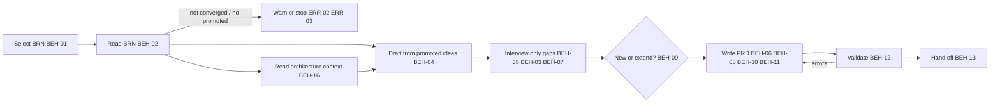

# SPEC-002 — PRD skill (MVP)

## 1. Overview

The `prd` skill ships in the `devforgeai` plugin and is invoked as `/devforgeai:prd [BRN-NNN]`, or
automatically when a user asks to write a PRD from a brainstorm. It:
1. selects a brainstorm document (BRN);
2. drafts requirements from the BRN's **promoted** ideas;
3. interviews the user **only for what the BRN and the request leave open**;
4. writes a new PRD or extends an existing one;
5. validates it;
6. hands off to the architecture step (ADR-002).

Two rules shape everything else:
- **The PRD records decisions; the AI doesn't make them.** Stage, operating context, priority and
  release are written only when the user supplied or confirmed them. Otherwise they're `null`, which means
  "not decided yet", just as `disposition: open` does in a BRN.
- **The PRD states *what* and *why*; architecture is interviewed, not designed.** The skill reads
  existing architecture decisions and classifies what it learns (BEH-16). Existing commitments and hard
  constraints are recorded and cited. Open design decisions are flagged with a marker that blocks the
  affected epics, and are decided in ADRs, not in the PRD.

This skill implements the spec and is recorded as `SKL-002` in its `provenance.yaml`.

## 2. Constraints

- **NFR-001 / NFR-002 / NFR-003**, as for SPEC-001: a short `SKILL.md` with detail in `references/`,
  spec-only frontmatter with provenance in the sidecar, and behavior proven by the eval suite in §9.
- **ADR-001 v3:** built in a worktree from `src/`, deployed with rsync, and evaluated from a plain terminal.
- **SPEC-001 §5 (downstream contract):**
  - BRNs are at `docs/specs/brainstorm/BRN-NNN.md` with stable item IDs.
  - Only `promoted` ideas are user-approved.
  - `status: converged` means the user confirmed convergence.

## 3. Architecture and components

```
src/claude/DevForgeAI/
├── skills/prd/
│   ├── SKILL.md                          # workflow checklist, decision rules, output contract
│   ├── provenance.yaml                   # SKL-002, implements SPEC-002
│   ├── assets/
│   │   └── prd.md                        # THE PRD template (moved from src/templates/)
│   └── references/
│       ├── output-rules.md               # item-block rules for PRD documents (fallback validation)
│       ├── brn-mapping.md                # how each BRN section maps into the PRD
│       ├── defaults.md                   # framework-default layer for the v1 settings (ADR-003 A2, A3)
│       ├── policy.md                     # policy resolution, precedence and failure rules (ADR-003 A3–A5)
│       └── interview.md                  # question bank per round and stage, batching rules
└── evals/prd/<case>/                     # one case per automated VER item (§9), fixtures per case
```


```mermaid
flowchart LR
    S[Select BRN BEH-01] --> R[Read BRN BEH-02]
    R -->|not converged / no promoted| X[Warn or stop ERR-02 ERR-03]
    R --> D[Draft from promoted ideas BEH-04]
    R --> A[Read architecture context BEH-16]
    A --> D
    D --> Q[Interview only gaps BEH-05 BEH-03 BEH-07]
    Q --> N{New or extend? BEH-09}
    N --> W[Write PRD BEH-06 BEH-08 BEH-10 BEH-11]
    W --> V[Validate BEH-12]
    V -->|errors| W
    V --> H[Hand off BEH-13]
```

## 4. Data model

**Input: a BRN** at `docs/specs/brainstorm/BRN-NNN.md`, read-only (BEH-14). **Also read:** approved
policy documents in `docs/specs/policy/` (BEH-17), and accepted ADRs (BEH-16).

**Output: a PRD** at `docs/specs/prd/PRD-NNN.md` from `assets/prd.md`, valid against
`prd.schema.json`. This spec adds four fields to the PRD schema and template:

| Field | Where | Values | Meaning |
|---|---|---|---|
| `stage` | frontmatter | `prototype`, `mvp`, `evolution`, `null` | **Scope maturity.** prototype: exploratory, may be discarded. mvp: the smallest scope that delivers value to real users and is built upon. evolution: changes an established product (new capability, maintenance, migration or refactoring). Controls interview **depth** (BEH-03) |
| `operating_context` | frontmatter | `local`, `internal`, `pilot`, `production`, `null` | **Who uses it, with what data.** local: developers only, synthetic data. internal: own organization, may touch real internal data. pilot: limited real external users or real customer data. production: generally available to real users with real data. Controls which quality categories **must** be asked (BEH-03) |
| `priority` | each FR and NFR | `must`, `should`, `could`, `wont`, `null` | MoSCoW importance **within its release**. Now nullable |
| `release` | each FR and NFR | `current`, `later`, `null` | **Which release**: `current` = the PRD's `target_release` (e.g. "MVP"), `later` = backlog |

The two frontmatter fields are independent: "an MVP serving real users" is `stage: mvp` with
`operating_context: production`. The NFR `category` list gains `constraint`. A PRD can't move to
`approved` while `stage`, `operating_context` or any `release` is `null`, or while any
`release: current` item has a `null` `priority`, the same rule as for `[NEEDS CLARIFICATION]`
markers. A `release: later` item's `priority` may stay `null` until a release takes the item in.
`[NEEDS ADR]` markers don't block approval (templates README §2.7).

**Mapping from BRN to PRD** (the detail goes in `references/brn-mapping.md`):

| BRN | PRD | Link |
|---|---|---|
| `problems` (PRB) | §2 problem prose | frontmatter `upstream`: `{id: BRN-NNN, item: PRB-NN, relation: derives}` |
| promoted `ideas` (IDEA) | one or more `functional_requirements` | item `upstream`: `{id: BRN-NNN, item: IDEA-NN, relation: derives}` |
| `assumptions` (ASM) | `assumptions` | item `upstream`: `derives` the BRN ASM |
| candidate success signals (prose) | `success_metrics` | `derives` the promoted IDEA it measures; otherwise none, with `[NEEDS CLARIFICATION]` target |
| open, parked, rejected ideas | nothing | never cited |

**"Unprocessed" BRN** (used by BEH-01): a BRN with at least one promoted idea that no item in any
`docs/specs/prd/PRD-*.md` cites through an `upstream` link. This is derived from links alone.
**Nothing is written into the BRN to mark it processed**, because downstream documents never edit upstream ones.

## 5. Interfaces and contracts

```yaml
# Proposed SKILL.md frontmatter (validated by src/schemas/skill-frontmatter.schema.json)
name: prd
description: Turns a DevForgeAI brainstorm (BRN) document into a product requirements document (PRD), interviewing only for what the brainstorm leaves open, such as delivery stage, priorities, current-release versus later scope, quality requirements and constraints. Use when the user wants to write a PRD, define requirements or scope from a brainstorm, or continue the DevForgeAI planning chain after brainstorming.
argument-hint: "[BRN-NNN]"
metadata:
  devforgeai-id: "SKL-002"
  devforgeai-version: "<SKL-002's provenance.yaml version, quoted>"
```

- **The name must be exactly `prd`.** The brainstorm skill's handoff looks for `${CLAUDE_PLUGIN_ROOT}/skills/prd/SKILL.md`.
- **The version isn't fixed here.** `metadata.devforgeai-version` must equal `provenance.yaml`'s `version`,
  so a skill fix bumps the skill, not this spec.
- **Arguments:** `$ARGUMENTS` is a BRN ID (`BRN-NNN`) or empty (BEH-01). File paths aren't accepted.
- **Tools:** Read, plus Glob and Grep when available, otherwise `ls` on the named folder, to read BRNs and PRDs; Write and Edit for the PRD; the host's question tool for the interview (below); Bash only to run the skill's policy validation script with `python3`.
- **Policy validation (D-09):** the skill ships `scripts/validate_policy.py` and unchanged copies of
  `src/schemas/policy.schema.json` and `common.schema.json` in `references/schemas/`. The script validates
  each approved policy document in full against those schemas (field types, date patterns, authors and
  link records) with the `jsonschema` library, then against SV-01 to SV-06 and SV-08 (ADR-005 D3), and prints every error with
  its file, field and rule. It is the one maintained validation path. The architecture skill ships
  byte-identical copies of the script and schemas, since SPEC-003 BEH-03 resolves policy exactly as this
  skill does. When `devforgeai check` ships (PRD-001 FR-018), both skills switch to it and drop the copies.
- **Provider adaptations.** These are host-specific; every rule in §6 and §7 applies to every provider.

  | | Claude Code | Codex |
  |---|---|---|
  | Invocation | `/devforgeai:prd [BRN-NNN]` | `$devforgeai:prd BRN-NNN`, skill selection or a natural request |
  | Questions | AskUserQuestion: at most 4 questions per call, 2–4 options each | The host's question tool when it can show every choice (at most 3 per batch); otherwise numbered plain text, then wait. The same `interview.max_calls` budget |
  | Local preferences (BEH-18) | `.claude/devforgeai.local.md` | `.codex/devforgeai.local.md` |
  | Provenance (BEH-10) | `tool: claude-code`; the current model ID; `${CLAUDE_SESSION_ID}` | `tool: codex`; model and session only from a supported host interface; otherwise `unavailable`, disclosed |
  | Resources | `${CLAUDE_SKILL_DIR}` | The loaded skill directory |

  Each provider's qualification records which adaptations its runs exercised. A provider that can't
  supply exact identity keeps BEH-10's obligation open in its qualification, rather than filling it.
  AskUserQuestion takes at most 4 questions per call, with 2–4 options each. The interview budget in BEH-05 is sized to that.
- **Downstream contract (consumed by the architecture step, then the epic workflow, per ADR-002):**
  - PRD path `docs/specs/prd/PRD-NNN.md`, and stable FR, NFR and SM IDs (BEH-09 extends without renumbering).
  - `release: current` with priority `must`, `should` or `could` marks what the current release delivers.
    `priority: wont` with `release: current` marks an explicit exclusion from this release ("won't have this
    time"): the epic workflow never builds a `wont` item. `null` values are open decisions that neither the
    architecture step nor the epic skill may treat as decided.
  - The PRD's `upstream` links show which policy settings informed it, with their versions (BEH-17).
  - `status` stays `draft` until the user approves it. An approved PRD is a scope baseline; widening it goes through an extension that returns it to `in-review` (BEH-09).
  - Epics cite PRD items with `refines` links such as `{id: PRD-001, item: FR-004, relation: refines}`.
  - A `[NEEDS ADR: <decision>; affects FR-…]` marker in §12 means no epic may be written for the named
    requirements until an accepted ADR resolves the decision.

## 6. Behavior

```yaml items
behaviors:
  - id: BEH-01
    status: active
    rule: "Select the input. If $ARGUMENTS is a BRN ID, read docs/specs/brainstorm/<ID>.md. If it is empty, list the unprocessed BRNs (§4) with their titles and the number of uncited promoted ideas, then ask which one to use. Never guess the BRN, and never take a file path."
  - id: BEH-02
    status: active
    rule: "Read the BRN's frontmatter status, problems, ideas, assumptions and candidate success signals. Use only ideas with disposition promoted. Never cite an open, parked or rejected idea anywhere in the PRD."
  - id: BEH-03
    status: active
    rule: "Choose quality questions by operating context and interview depth by stage. Operating context decides which NFR categories must be asked: local, only constraint; internal, constraint, security and privacy; pilot, those plus reliability, observability and compliance; production, all of those plus performance and accessibility. Stage decides depth: prototype needs requirements only at capability level and a minimal rollout; mvp confirms each current-release requirement; evolution also asks about effects on existing behaviour and systems. These sets are the framework floor. Approved policy may add categories through quality.required_categories when its applies_when matches (BEH-17), but can never remove floor categories. Always offer one open question for any other quality need. When operating context is unknown, ask it in the first round; if it can't be asked, use the production set for deciding which gaps to mark, and leave it null. Record each required category the user did not answer as [NEEDS CLARIFICATION: <category> requirements for <context>] in open questions, never as a placeholder requirement. Keep four kinds of answer apart. An explicit none (the user confirms the category needs nothing) is recorded in section 7's prose as the user's answer, and no NFR is written. No target yet keeps the requirement or metric, with its target marked [NEEDS CLARIFICATION: target for <item>]. A partial answer becomes the NFRs it states, and the rest of the category stays marked. No answer is marked as above. None of these answers waives applicable policy: a category that approved policy requires, or a mandated platform, still applies, and an explicit none for it is recorded together with a [NEEDS CLARIFICATION] marker naming the policy setting."
  - id: BEH-04
    status: active
    rule: "Draft before asking. Map the BRN into a PRD draft following references/brn-mapping.md: problems into section 2 with frontmatter derives links; each promoted idea that no PRD cites yet (§4) into one or more functional requirements that start 'The system shall', each with an upstream derives link to its idea, so every FR derives from a promoted idea; assumptions carried over with derives links; success signals into metrics. NFRs cite their actual source: a BRN item only when one states the requirement; otherwise the policy setting, ADR or PRD it comes from, or no link when the user stated it. Never add a brainstorm link to a requirement the user stated or policy added. Leave out a promoted idea that an item of any PRD already cites, and name it in the reply with the item that cites it."
  - id: BEH-05
    status: active
    rule: "Interview only for gaps, in batched rounds using references/interview.md: framing (stage, operating context, target_release name, primary users, non-goals), architecture context (BEH-16), requirements, quality and constraints (BEH-03), and success metrics (baseline and target). Each requirement gets one question that shows its drafted statement and offers must now, should now, later, or won't: must now and should now write that priority with release current; later writes release later and leaves priority null; won't writes priority wont with release current (an explicit exclusion from this release; a requirement that should never be built is edited or dropped instead). The user can edit the statement or answer 'decide later', which leaves priority and release null. Ask at most the host's per-call question limit (§5: four in Claude Code) and at most interview.max_calls calls (framework default 8, resolved by BEH-17) unless the user asks for more. Record anything left over when the budget runs out as [NEEDS CLARIFICATION]. Skip any question the BRN or the request already answers. When the request says to proceed without questions, ask none. A question with more choices than the host's per-call option limit allows (§5: four in Claude Code) is split into several questions. Gate questions (which BRN, an unconverged BRN, new versus extend) count toward interview.max_calls, but a gate is asked even when the budget is spent, because nothing is written without its answer."
  - id: BEH-06
    status: active
    rule: "Write stage, operating context, priority and release only when the user supplied or confirmed them. Otherwise write null. Questions may suggest a value, but a suggestion is never written unconfirmed. Mark any other unanswered gap [NEEDS CLARIFICATION]. Write a new PRD with status draft. Extending a draft or in-review PRD keeps its status; extending an approved PRD follows BEH-09. A failed validation (ERR-06) never restores approved. Never set approved."
  - id: BEH-07
    status: active
    rule: "Record fixed external conditions (mandated platforms, required integrations, data residency, existing systems, regulatory mandates) as NFR items with category constraint, stated as the condition and not as a design, with where it applies (the whole product, a named capability or an environment). When the user offers a design preference (for example an architecture style or a framework), ask whether it is a hard constraint. If it is, record it as a constraint. If not, list it under open questions as a design decision for a future ADR, and never as a requirement."
  - id: BEH-08
    status: active
    rule: "For a new PRD, allocate the ID by scanning docs/specs/prd/ for PRD-NNN.md files and using the highest number plus one (PRD-001 if none). Write to docs/specs/prd/PRD-NNN.md, creating the directory if it is missing. Never ask for or accept a file name. Put the product or release name in the title."
  - id: BEH-09
    status: active
    rule: "Decide new versus extend on scope, ownership and lifecycle, never on product identity or the number of existing PRDs. Read each existing PRD's title, goals, non-goals, owner, status and target_release. Recommend extending one only when the BRN's promoted ideas belong to that PRD's existing initiative and scope, share its owner, and fit its release lifecycle. Recommend a new PRD when they form a distinct initiative, have a different owner or approval path, or follow a different schedule, even within the same product. State the reasons and let the user decide. A new-versus-extend choice the user already stated explicitly, in the request or in reply to an earlier question, answers this gate: don't ask it again, and name where the answer came from. 'Proceed without questions' is not a choice. Ask when it is ambiguous; a single existing PRD is not evidence that it is the right destination. To extend: raise the version by one, update the date, give new items the next free number in each collection, leave every existing item unchanged, add a Change Log entry and add the new BRN links. If the PRD was approved, set status to in-review and clear approved_by and approved_on, so the scope change is reviewed explicitly. Then tell the user that epics citing this PRD are now suspect links to re-review. A superseded or deprecated PRD is never extended; recommend a new PRD instead."
  - id: BEH-15
    status: active
    rule: "Don't copy a constraint or cross-cutting NFR that another PRD already defines. Cite it from its authoritative source with a frontmatter upstream link {id: PRD-NNN, item: NFR-NNN, relation: constrains}, and say in the PRD what it applies to. When the user states a new constraint, record where it applies in the statement: the whole product, a named capability, or an environment."
  - id: BEH-16
    status: active
    rule: "Read architecture context from two sources only: ADRs in docs/specs/adr/ and documents that the BRN or the request names. Never crawl the codebase. Propose which accepted ADRs apply to this product and let the user confirm; with no user present, use only ADRs the request names. Ignore superseded ADRs. Classify what is learned: an existing commitment (an accepted ADR) becomes a frontmatter upstream link {id: ADR-NNN, relation: constrains}; a hard constraint becomes an NFR with category constraint; a preference becomes an open question; an unresolved decision (including a proposed ADR) becomes [NEEDS ADR: <decision>; affects FR-NNN, ...] in open questions, naming the requirements whose epics it blocks. Each applicable architecture.mandated_platforms setting (BEH-17) becomes a constraint NFR whose own item upstream cites its setting with {id: POL-NNN, item: SET-NN, relation: constrains, version: <policy version>, hash: null}; the link is not repeated in frontmatter. Ask about architecture context in the interview, but never decide a design question in the PRD."
  - id: BEH-17
    status: active
    rule: "Resolve policy with the ADR-003 A4 sequence, following references/policy.md. R1: read docs/specs/policy/POL-*.md, validate approved documents in full against policy.schema.json and common.schema.json and then SV-01 to SV-06 and SV-08, with the skill's validation script (§5), and skip and report draft or in-review ones. When the script can't run, stop (ERR-08) rather than skip validation. R2: resolve the unconditional settings (interview.max_calls, architecture.mandated_platforms) across framework defaults (references/defaults.md), organization, project and local preference (BEH-18), honouring overridable_by. R3: establish the operating context from the request, the BRN or the first framing question. R4: apply each active quality.required_categories setting whose applies_when includes that context, additively to the BEH-03 floor; if the context is still unknown, evaluate as production and say so. R5: record each applied policy setting as an upstream link with the policy version, in exactly one place: a mandated platform's constrains link on the item upstream of the constraint NFR it produced (BEH-16), and every setting that governs how the document is produced (interview.max_calls, quality.required_categories) as a frontmatter informed_by link. Then write the ADR-003 A5 resolution line into the Change Log entry, including defaults, local values, settings that didn't apply, the fail-safe context and ignored documents."
  - id: BEH-18
    status: active
    rule: "Read local preferences from .claude/devforgeai.local.md if it exists: YAML frontmatter with devforgeai_local: 1 and interaction-default keys only (v1: interview.max_calls). Use an entry only if the effective setting's overridable_by includes local. Ignore and report any other entry (unknown key, organizational-policy key, bad type or range, not allowed). A local file never stops the skill. Record used values as '<key>=<value> (local)' in the resolution line, never as a link."
  - id: BEH-10
    status: active
    rule: "Fill the frontmatter provenance with the actual authoring tool, model and session, as the host provides them (§5, Provider adaptations). Never guess, copy or fabricate them. When the host can't provide one, write unavailable and disclose it in this write's Change Log row and in the handoff. A new PRD: authors the user and the tool; reviewed_by empty; created and updated today's date. An extension: keep the existing authors (adding the tool if it is missing), reviewed_by and every Change Log row; update today's date; and say in this write's Change Log row and in the handoff that the new revision hasn't been reviewed. Every hash null."
  - id: BEH-11
    status: active
    rule: "Build the document from ${CLAUDE_SKILL_DIR}/assets/prd.md. Keep every section heading, including the GENERATED epic map. Replace each placeholder or mark it [NEEDS CLARIFICATION]. Delete author comments."
  - id: BEH-12
    status: active
    rule: "Validate after writing against the self-check list in references/output-rules.md, reading the file back. Run one initial check, then at most three repair-and-readback cycles, so at most four checks. A repair changes the file to address a reported error; when an error can't be repaired (for example an external limitation), stop early and report it instead of repeating an unchanged check. Record each check and repair in the reply. Never run a devforgeai command: the CLI doesn't exist and a program by that name on PATH can't be trusted (SPEC-004 §2). A link this write adds cites the cited document's current version; an existing link to an older version is a suspect link (templates README §2.6), named in the reply and never an error."
  - id: BEH-13
    status: active
    rule: "Hand off with counts of requirements, constraints and metrics, the number of open decisions (a null stage, operating context or release, or a null priority on a release current item), the open questions and the PRD path. List every [NEEDS ADR] marker and say that epics for the requirements it names must wait until an accepted ADR resolves it. Then name the next step, which is the architecture step (ADR-002): tell the user to run /devforgeai:architecture with the PRD ID. The next step comes last in the final reply, as its own paragraph outside any code block, starting with the words Next step; nothing follows it. Never start architecture work or write an epic."
  - id: BEH-14
    status: active
    rule: "Never modify a BRN document."
```

## 7. Errors and edge cases

```yaml items
errors:
  - id: ERR-01
    status: active
    condition: "The BRN ID given does not exist"
    handling: "Say so, list the BRN IDs that do exist, and write nothing"
    user_result: "The list of available BRNs"
  - id: ERR-02
    status: active
    condition: "The selected BRN's status is not converged"
    handling: "Warn that some ideas may not be decided, and continue only after the user confirms. If there is no confirmation, as in a non-interactive run, write nothing"
    user_result: "A warning and a question; no file unless confirmed"
  - id: ERR-03
    status: active
    condition: "The selected BRN has no promoted idea"
    handling: "Stop, write nothing, and point the user back to the brainstorm workflow to converge"
    user_result: "An explanation and the next step (/devforgeai:brainstorm)"
  - id: ERR-04
    status: active
    condition: "No BRN can be processed: no argument was given and no unprocessed BRN exists, or the BRN named has promoted ideas and a PRD already cites every one"
    handling: "Say why, and write nothing. With no BRN at all, say that no brainstorm exists yet and point to /devforgeai:brainstorm. List each BRN that has no promoted idea, with its status, and point to /devforgeai:brainstorm to converge it. Say that every promoted idea of each remaining BRN is already cited by a PRD, naming the PRDs that cite them"
    user_result: "Why no BRN can be processed, and the next step"
  - id: ERR-05
    status: active
    condition: "The BRN's item blocks can't be read (malformed YAML or missing collections)"
    handling: "Report which block failed and stop. Never repair the BRN"
    user_result: "The error and the BRN path"
  - id: ERR-06
    status: active
    condition: "Validation still fails after the initial check and three repair cycles, or an error can't be repaired"
    handling: "Stop. A new PRD stays draft. An extension keeps the status BEH-06 and BEH-09 gave it: a draft or in-review PRD keeps its status, and an approved PRD whose content changed stays in-review with approved_by and approved_on cleared. Never set approved. List the checks, the repairs and the unresolved errors, and don't present the PRD as ready for the architecture step"
    user_result: "The file path, the checks and repairs made, and the unresolved errors"
  - id: ERR-07
    status: active
    condition: "The user stops mid-interview"
    handling: "Ask whether to save a draft PRD. If yes, write it with every undecided field null, then validate it (BEH-12) and report it (BEH-13) as any other write"
    user_result: "Either a draft file or no file, as the user chose"
  - id: ERR-08
    status: active
    condition: "An approved policy document fails the schema, or breaks SV-01 (duplicate setting ID), SV-02 (two approved documents in one scope), SV-03 (interview.max_calls set twice), SV-04 (a project setting overrides a mandated platform that doesn't allow it) or SV-08 (a testing.* key set twice), or any lower layer overrides a setting whose overridable_by doesn't include that layer (ADR-003 A4), for example a project policy setting interview.max_calls when the organization setting allows only local; or the validation script can't run while approved policy exists"
    handling: "Stop before writing anything. Name the policy file, the setting and the rule broken (schema or SV-NN). Never guess or fall back silently"
    user_result: "The policy error to fix; no PRD file"
```

## 8. Non-functional design

```yaml items
quality_responses:
  - id: QR-01
    status: active
    response: "SKILL.md holds only the workflow checklist, decision rules, output contract and links. The BRN mapping, the question bank and the output rules live in references/."
    measured_by: "SKILL.md line count and description length"
    upstream:
      - {id: PRD-001, item: NFR-001, relation: satisfies, version: 10, hash: null}
  - id: QR-02
    status: active
    response: "Frontmatter limited to the fields in §5; provenance kept in provenance.yaml; metadata values quoted, with devforgeai-version equal to the provenance version"
    measured_by: "Reading against skill-frontmatter.schema.json and skill.schema.json, and comparing the two version values"
    upstream:
      - {id: PRD-001, item: NFR-002, relation: satisfies, version: 10, hash: null}
  - id: QR-03
    status: active
    response: "One eval case per automated VER item, tagged prd and ver-NN, run against the no-plugin baseline"
    measured_by: "claude plugin eval --threshold 0.8 over 3 runs"
    upstream:
      - {id: PRD-001, item: NFR-003, relation: satisfies, version: 10, hash: null}
```

## 9. Verification

**Verification status.**

| Kind | Status |
|---|---|
| Version 4 | Behavioural: the two new cases ran once each on SKL-002 v3 on 2026-10-01, without the baseline, run by Bryan from the `docs/spec-002-v4` worktree and bound to `a6c1cc4` with `record_revision.sh` (folders `tmp/eval-results/prd-v4-red-20261001T123717-no-brainstorm-yet/` and `tmp/eval-results/prd-v4-red-20261001T123740-revisited-brainstorm-extends/`, local, untracked). `no-brainstorm-yet` (VER-33) scored 1.00, $0.21: the judge passed 3 of 3, and the reply said that no brainstorm exists and pointed to `/devforgeai:brainstorm`. `revisited-brainstorm-extends` (VER-34) scored 0.78 (7 of 9), $0.61: every file grader passed, and `names-left-out-ideas` and `reports-suspect-links` failed, both obligations that version 4 adds. So the defects that issues #36 and #38 and issue #40's #4 describe, found by reading, did not appear in these runs. A second round on SKL-002 v3, bound to `ff3e8b7` (folders `tmp/eval-results/prd-v4-red-20261001T131938-no-unprocessed-brn/`, `…T132003-all-ideas-cited-stops/` and `…T132114-revisited-brainstorm-extends/`): `no-unprocessed-brn` (VER-35) scored 1.00, $0.22; `all-ideas-cited-stops` (VER-36) scored 0.50, $0.61, because v3 wrote PRD-002 and said "PRD-002 repeats" PRD-001 (issue #38's defect); `revisited-brainstorm-extends` (VER-34) scored 0.57 (4 of 7), $0.67, because v3 reported the seven links to BRN-001 version 1 as errors, moved the two frontmatter links to version 2, and stopped under ERR-06 with five errors in existing items it couldn't change (issue #40's self-check 9), though the first run had passed validation. So issue #38 and issue #40's #4 reproduced; issue #36 did not, in VER-33 or VER-35. Before that second round, Bryan had those two regex graders replaced by llm graders, which keep the reply as evidence: one per duty, `reply-names-left-out-ideas` and `reply-reports-suspect-links`, so that a reply that misses both still fails (5 of 7). The same change counts any third citation of IDEA-01 or IDEA-03, at any version, and checks every existing item with one end-anchored grader, after the plugin-validator and skill-reviewer found false passes. Structural: passes, checked with `src/tests/prd/test_structure.py` on 2026-10-01 (validates against `spec.schema.json`; every BEH, ERR and QR item is covered by a VER item). Changed, on Bryan's decisions of 2026-10-01 on the SKL-002 v3 review (issues #36, #37 and #38), with the spec parts of issue #40: ERR-04 says why no BRN can be processed; BEH-04 drafts only promoted ideas that no PRD cites; §4 and BEH-13 let a `release: later` item's priority stay null; BEH-12 treats an existing older-version link as a suspect link, not an error; ERR-07 validates and reports a saved draft; Appendix A asks the NFRs' priorities; BEH-05 splits questions over the option limit and asks gates past the budget, and BEH-09 never extends a superseded or deprecated PRD (issue #40, Bryan's decision of 2026-10-01); BEH-13 and VER-07 keep only the shipped architecture-skill branch. VER-33 to VER-36 are new; VER-35 and VER-36 test ERR-04's cases that VER-33 can't separate from v3. The rows below record versions 1 to 3 |
| Version 3 | Claude: SKL-002 v3 (the shared-schema change, PR #25) was requalified on its 12 policy eval cases on 2026-09-30, 12 of 12 at 1.00 (row (f)). Every change from v2 is in policy validation and its reference text, so its other 17 cases last ran on v2 (row (e)); the manual VER-11, VER-12 and VER-23 were not rerun. Codex: ported in PR #26, with its own native evaluation (`src/codex/devforgeai/shared-schema-update-evidence/20260930/REPORT.md`). Changed: §5, BEH-17 R1 and ERR-08 name SV-08 |
| Version 2 | Claude: SKL-002 v2's automated VER items ran on 2026-09-29, 29 of 29 at 1.00 (row (e)); the manual VER-11, VER-12 and VER-23 are not run. Codex: not run. The changed items were BEH-03 to BEH-06, BEH-09, BEH-10, BEH-12, BEH-17, ERR-06, ERR-08 and VER-09 to VER-11, with VER-24 to VER-32 new. Rows (a) to (d) record version 1's evidence |
| Structural: this spec against `spec.schema.json` | Passes (checked 2026-09-29) |
| Structural: SKL-002's frontmatter, provenance and links | Pass for SKL-002 v3 at `a19949b` (2026-09-30), the head of PR #25, with the same checks; `test_validate_policy.py` ran 112 tests under both jsonschema versions, and 116 at `4c01126`, after PR #27. Pass for SKL-002 v2 at `7e87cf4` (2026-09-29): `src/tests/prd/test_structure.py` checks the frontmatter and provenance against their schemas, the metadata version against provenance, SKILL.md's length (420 lines) and its links. `test_validate_policy.py` (84 tests, under jsonschema 4.26 and 4.10) and `test_shared_files.py` (byte-identity with the architecture skill and `src/schemas/`) pass |
| Behavioural (a): automated VER items, original run | `tmp/eval-results/prd-full-1/` (local, untracked). Started 2026-09-27 22:54 EDT (02:54 UTC on 09-28); Claude Code 2.1.283; 20 cases; 3 runs per arm against the no-plugin baseline; threshold 0.8; judge model sonnet; $41.51; 1,652 s; root `src/claude/DevForgeAI`. **All 20 case scores met the 0.8 threshold.** Eighteen scored 1.00 with the plugin. Two had failing graders, kept as recorded: `writes-prd-from-brn` scored 0.833 in each run, with the llm grader `requirements-match-answers` failing all three runs (VER-01). `architecture-context` averaged 0.952 (1.00, 1.00, 0.857), with the llm grader `marker-names-booking-frs` failing in run 3 (VER-14) |
| Behavioural (b): reruns with changed graders | Fresh executions, not regrades of saved replies. They don't replace the original results in (a). `tmp/eval-results/prd-full-1-regrade-writes-prd-from-brn/` (2026-09-27 23:25 EDT, 3 runs per arm, $2.51): `requirements-match-answers` (llm) removed; six regex graders added (`framing-from-answers`, `frs-start-with-shall`, `idea-01-frs-must-current`, `idea-03-frs-should-current`, `no-other-idea-01-decision`, `no-other-idea-03-decision`); 1.00 in each run. `tmp/eval-results/prd-full-1-regrade-architecture-context/` (23:27 EDT, 3 runs per arm, $2.69): `marker-names-booking-frs` (llm) replaced by `marker-names-booking-fr` (regex); 1.00 in each run |
| Behavioural (c): case changed since, not rerun | `hands-off-to-architecture` (VER-07): its prompt and `handoff-quality` grader changed in commit `acce5a2` (2026-09-28), when the architecture skill shipped. The runs above tested the earlier branch (no architecture skill); the current case hasn't run |
| Behavioural (d): manual VER items (VER-11, VER-12, VER-23) | Version 1: NOT_RUN. Version 2, 2026-09-29 (Claude Code 2.1.285, a copy of the plugin at `7e87cf4` loaded with `--plugin-dir`, driven through the owner's cmux tab by session fdbef416-eebb-4053-95ce-624a311d72d5): **VER-11: pass on every clause but one, run in session `4665c43e-7434-4854-94aa-781003f2d88c`.** The food bank BRN names the users, and the request stated the stage and operating context. No question repeated them. It used 5 calls of at most 4 questions (budget 8); the quality questions were the internal floor (constraint, security, privacy) plus one "anything else"; the partial privacy answer became NFR-002, with `[NEEDS CLARIFICATION: privacy requirements for internal]` for retention; the constraint "none" and SM-01's "no target yet" were recorded as answers. Stopping mid-interview (ERR-07) was not run. **VER-23: only its ERR-08 "can't run" case, pass**, in session `21995046-d5a3-4aaf-9637-7350d373e787`: with jsonschema hidden and an approved policy present, the skill stopped before any question, quoted the script's exit-2 message, installed nothing, didn't read the policy instead, and wrote nothing. Local preferences, SV-01, SV-02 and SV-06: not run. **VER-12: not run**; its approved-extension and ERR-06 paths are covered automatically by VER-27 and VER-32. **Session ID (Claude only): pass**; the PRD's `generated_by.session` and Change Log author match the transcript's ID |
| Behavioural (e): SKL-002 v2, prd tag run, 2026-09-29 | `tmp/eval-results/prd-v2-3run-20260929T151649/` (local, untracked). Started 15:16:51 EDT (19:16:51 UTC); Claude Code 2.1.284; plugin 0.6.0; 29 cases (VER-01 to VER-10, VER-13 to VER-22, VER-24 to VER-32); 3 runs per arm against the no-plugin baseline; threshold 0.8; judge model sonnet; concurrency 4; $63.07; 2,327 s. **All 29 cases scored 1.00 with the plugin in every run**, with no errors; mean Δ +0.53. It is the first run of the current VER-07 case (see (c)). The new cases' Δ: VER-24 +0.50, VER-25 +0.75, VER-26 +0.25, VER-27 +0.60, VER-28 +0.33, VER-29 +0.44, VER-30 +0.78, VER-31 +0.75, VER-32 +0.38. **Bound:** `src/tests/prd/record_revision.sh` wrote the commit `7e87cf4` (PR #16's merge), the plugin digest `dc301097547da60d3a3e0a319e61de14e781d487058b3661454cc3db03d22dbe` and a copy of the case files into the folder before the run |
| Behavioural (f): SKL-002 v3, policy-case requalification, 2026-09-30 | `tmp/eval-results/prd-requal-20260930T135333-<case>/` (local, untracked), one folder per case, run by Bryan from a plain terminal with the shared-schema worktree's `tmp/requalify.sh`. Started 13:53:35 EDT (17:53:35 UTC); Claude Code 2.1.285 for the first four cases and 2.1.286 from `policy-bad-authors` on (it updated during the run); plugin 0.7.0; the 12 policy cases (VER-15 to VER-19, VER-21, VER-22, VER-25, VER-28 to VER-31); 3 runs per arm against the no-plugin baseline; threshold 0.8; judge model sonnet; concurrency 1; $26.12; 3,992 s. **All 12 cases scored 1.00 with the plugin in every run**, with no errors; mean Δ +0.64. Δ: VER-15 +0.67, VER-16 +0.92, VER-17 +0.33, VER-18 +0.50, VER-19 +1.00, VER-21 +0.75, VER-22 +0.33, VER-25 +0.67, VER-28 +0.33, VER-29 +0.67, VER-30 +0.67, VER-31 +0.83. **Bound:** `src/tests/prd/record_revision.sh` wrote the commit `a19949b` (PR #25's head; `src/` is identical at its merge `c2e6751`), the plugin digest `d4c23f78826894bbcdd2a29429b00689ba37601db3e8673ac78d29f2d43496b5` and a copy of the case files into each folder before its run. **After the run:** the Codex port's evaluation found that `scripts/validate_policy.py` accepted `.nan` as `testing.coverage_threshold`; PR #27 (`4c01126`) made it a `schema` error, with no version bump. None of these 12 fixtures contains a NaN or a `testing.*` key, so the run wasn't repeated (Bryan, 2026-09-30) |
| Revision binding | **Not bound.** The results record no source commit or plugin hash, and the runs predate the commit that first tracked the plugin (`7ad1aa2`, 2026-09-28 13:44 EDT). Inferred from file times: the skill's files were last modified at 22:54:00 EDT, before the original run began, and git shows no change to them since `7ad1aa2`, so the evaluated skill was probably SKL-002 v1 as committed. All 27 prd eval files were rewritten at 23:25:20 EDT, before the reruns, so the original run's grader files aren't preserved. The committed graders have the same names as the reruns', so the reruns probably used them; their content isn't bound |
| Findings shared with the Codex import | Resolved in version 2 (D-03 to D-09) and implemented in the Claude skill as SKL-002 v2 (PR #16); the Codex port is updated separately. From the Codex port's review (`src/codex/devforgeai/PRD-IMPORT-REPORT.md`, 2026-09-29), each also present in the Claude skill: **D-03** ERR-06 restores the pre-write status, so a failed extension of an approved PRD would read `approved` again, against BEH-06 and BEH-09 (SKILL.md step 9); **D-04** "at most three attempts" doesn't say whether the first check counts (BEH-12, ERR-06); **D-05** an explicit "none", "no target yet", a partial answer and no answer aren't distinguished (BEH-03, BEH-06; `references/interview.md`); **D-06** step 4 always asks new versus extend, though the gate rule accepts a choice already stated (BEH-09); **D-07** SKILL.md says "every requirement cites a promoted idea" (line 313) and the template's author comment is as broad, though only FRs derive from promoted ideas (BEH-04, BEH-07); **D-08** an extension keeps `reviewed_by` (SKILL.md, `references/output-rules.md`), while BEH-10 says it is empty, with no extension case; **D-09** the runtime policy checklist omits parts of `policy.schema.json` and `common.schema.json` (BEH-17 R1). D-01 and D-02 are Codex identity adaptations. The proposed resolutions are in the SPEC-002 v2 draft |
| Qualification | SKL-002 v3 approved by Bryan on 2026-09-30, after its policy cases were requalified (row (f)). SKL-002 v2 was approved by Bryan on 2026-09-29. Its automated items passed in a bound run (row (e)), including VER-07's current case and the approved-extension and ERR-06 paths (VER-27, VER-32). Open: VER-11's stop-mid-interview clause (ERR-07), VER-12, and VER-23 apart from its can't-run case |

Structural checks show that documents are well formed. Only behavioural runs can show that the skill works. Each automated VER item has one eval case under `evals/prd/`, tagged `prd` and `ver-NN`. Runs are
non-interactive, so each case's `case.yaml` scaffold places its fixture BRNs and PRDs.
Output paths are deterministic: `PRD-001.md` in a workspace with no PRD, and `PRD-002.md` when one exists.
File graders must name those literal paths.

```yaml items
verifications:
  - id: VER-01
    status: active
    obligation: "Given a converged BRN-001 with IDEA-01 and IDEA-03 promoted, IDEA-02 parked and IDEA-04 rejected, '/devforgeai:prd BRN-001' with all answers in the prompt writes docs/specs/prd/PRD-001.md. Its requirements cite IDEA-01 and IDEA-03 and never IDEA-02 or IDEA-04. Eval case writes-prd-from-brn: file_exists, regex on the file."
    level: e2e
    covers:
      - BEH-02
      - BEH-04
      - BEH-08
      - BEH-11
      - BEH-12
    upstream:
      - {id: STORY-002, item: AC-02, relation: verifies, version: 7, hash: null}
  - id: VER-02
    status: active
    obligation: "With a prompt that gives the stage (prototype) but no priorities or releases and says to proceed without questions, the file has stage: prototype, only null priority and release values, and status draft. Eval case no-invented-decisions: regex on the file."
    level: e2e
    covers:
      - BEH-06
    upstream:
      - {id: STORY-002, item: AC-03, relation: verifies, version: 7, hash: null}
  - id: VER-03
    status: active
    obligation: "With BRN-001 fully cited by an existing PRD-001 and BRN-002 not cited, '/devforgeai:prd' with no argument offers BRN-002 and not BRN-001, and writes no file. Eval case selects-unprocessed-brn: regex and llm on the reply, file_exists false for PRD-002.md."
    level: e2e
    covers:
      - BEH-01
    upstream:
      - {id: STORY-002, item: AC-01, relation: verifies, version: 7, hash: null}
  - id: VER-04
    status: active
    obligation: "With a draft (not converged) BRN-001, the skill warns and, with no user to confirm, writes no PRD. Eval case warns-unconverged: llm on the reply, file_exists false."
    level: e2e
    covers:
      - ERR-02
    upstream:
      - {id: STORY-002, item: AC-05, relation: verifies, version: 7, hash: null}
  - id: VER-05
    status: active
    obligation: "With a converged BRN-001 that has no promoted idea, the skill stops, writes no PRD and points to the brainstorm workflow. Eval case stops-without-promoted: regex on the reply for brainstorm, file_exists false."
    level: e2e
    covers:
      - ERR-03
    upstream:
      - {id: STORY-002, item: AC-05, relation: verifies, version: 7, hash: null}
  - id: VER-06
    status: active
    obligation: "Fixture: PRD-001 covers one initiative (for example onboarding recovery, with its own owner and target release). BRN-002 promotes ideas for a different initiative in the same product (for example account closure). The skill doesn't default to extending PRD-001: it recommends a new PRD with reasons about scope, ownership or lifecycle, asks the user, writes nothing without an answer, and leaves PRD-001 unchanged. Eval case extend-or-new: llm on the reply, regex that PRD-001.md still has version: 1, file_exists false for PRD-002.md."
    level: e2e
    covers:
      - BEH-09
    upstream:
      - {id: STORY-002, item: AC-06, relation: verifies, version: 7, hash: null}
  - id: VER-07
    status: active
    obligation: "After writing the PRD, the final reply hands off to the architecture step (BEH-13). The handoff is the last paragraph of the reply, outside any code block; it starts with the words Next step, and nothing follows it. It names the PRD by its ID, never by a file path, and the skill starts no architecture work and writes no ADR or epic. It tells the user to run /devforgeai:architecture PRD-001 and doesn't claim that the skill is unavailable or that the step is done by hand. Eval case hands-off-to-architecture: regex and llm on last_message."
    level: e2e
    covers:
      - BEH-13
    upstream:
      - {id: STORY-002, item: AC-07, relation: verifies, version: 7, hash: null}
  - id: VER-08
    status: active
    obligation: "A request such as 'open a PR for my staged changes and write its description' does not invoke the prd skill. Eval case ignores-unrelated-request: tool_used Skill min 0 max 0 arm both."
    level: e2e
    covers:
      - QR-02
      - QR-03
    upstream:
      - {id: STORY-002, item: AC-08, relation: verifies, version: 7, hash: null}
  - id: VER-09
    status: active
    obligation: "The written new PRD's generated_by holds the host's actual tool, model and session (in Claude Code: claude-code, a model ID and a session ID; a host that can't provide one writes unavailable and discloses it), reviewed_by is empty and every hash is null. Eval case records-provenance: regex on the file."
    level: e2e
    covers:
      - BEH-10
    upstream:
      - {id: STORY-002, item: AC-09, relation: verifies, version: 7, hash: null}
  - id: VER-10
    status: active
    obligation: "A prompt stating 'it must run on AWS and must integrate with Stripe; I'm leaning towards microservices', with instructions to proceed without questions, yields constraint NFRs for AWS and Stripe with no BRN derives link, and no requirement or constraint about microservices. Eval case constraints-not-design: regex on the file for category: constraint, llm on the file for the microservices rule."
    level: e2e
    covers:
      - BEH-07
    upstream:
      - {id: STORY-002, item: AC-04, relation: verifies, version: 7, hash: null}
  - id: VER-11
    status: active
    obligation: "In an interactive session with a BRN that already names the users and a request that states the stage and operating context: no question repeats those answers, every batch has at most four questions, the whole interview stays within the resolved interview.max_calls, the NFR categories asked match the operating context, and an 'anything else' quality question is offered. A partial answer to a category becomes the NFRs it states, with the rest of the category marked. Stopping mid-interview offers a draft save."
    level: manual
    covers:
      - BEH-03
      - BEH-05
      - ERR-07
    upstream:
      - {id: STORY-002, item: AC-04, relation: verifies, version: 7, hash: null}
  - id: VER-12
    status: active
    obligation: "Manual extension run: extending PRD-001 from a second BRN of the same initiative raises the version, continues numbering, leaves existing items byte-identical, adds a Change Log entry and warns about suspect epics. With PRD-001 approved beforehand, the extension returns it to in-review and clears the approval. git diff shows no change to any BRN. A new PRD that shares a constraint with PRD-001 cites it with a constrains link, not a copy. Also check that an unknown BRN ID lists the available BRNs, that a malformed BRN stops with the failing block named, and that SKILL.md is within the NFR-001 limits."
    level: manual
    covers:
      - BEH-09
      - BEH-14
      - BEH-15
      - ERR-01
      - ERR-04
      - ERR-05
      - ERR-06
      - QR-01
    upstream:
      - {id: STORY-002, item: AC-06, relation: verifies, version: 7, hash: null}
  - id: VER-13
    status: active
    obligation: "Production MVP: with the partially specified BRN in src/staging/examples/prd-production-mvp/ as fixture, a prompt stating 'this is our MVP and real patients will book through it from day one; patients must sign in; appointment details are private to the patient and staff; decide nothing else; proceed without questions' writes docs/specs/prd/PRD-001.md with stage: mvp, operating_context: production, security and privacy NFRs, and a [NEEDS CLARIFICATION] marker in open questions for each of reliability, observability, compliance, performance and accessibility. Eval case production-mvp: regex on the file."
    level: e2e
    covers:
      - BEH-03
      - BEH-06
    upstream:
      - {id: STORY-002, item: AC-10, relation: verifies, version: 7, hash: null}
  - id: VER-14
    status: active
    obligation: "Architecture context: fixtures are an accepted ADR-002 ('ClinicCore is the calendar of record') and a proposed ADR-003 ('synchronous booking writes vs scheduled import'), with a request that names both. The PRD gets a constrains link to ADR-002, no link to ADR-003, and a [NEEDS ADR] marker naming the booking requirements. The handoff says those epics must wait. Eval case architecture-context: regex on the file and on last_message."
    level: e2e
    covers:
      - BEH-16
    upstream:
      - {id: STORY-002, item: AC-04, relation: verifies, version: 7, hash: null}
  - id: VER-15
    status: active
    obligation: "Policy applied: fixtures are Organization A's policy (src/staging/examples/policy-two-orgs/org-a/POL-001.md, copied to docs/specs/policy/) and a converged BRN. The prompt states operating context internal and proceeds without questions. The PRD has a constraint NFR whose item upstream cites POL-001#SET-01 with relation constrains (and no frontmatter link to SET-01), a frontmatter informed_by link to POL-001#SET-02 at version 3, and [NEEDS CLARIFICATION] markers for compliance and accessibility, which the policy adds to the internal floor. Eval case policy-applied: regex on the file."
    level: e2e
    covers:
      - BEH-17
      - BEH-03
      - BEH-16
    upstream:
      - {id: STORY-002, item: AC-11, relation: verifies, version: 7, hash: null}
  - id: VER-16
    status: active
    obligation: "Invalid policy: an approved policy whose interview.max_calls is 50 (out of range) makes the skill stop, write no PRD and name the file and setting. Eval case invalid-policy-stops: file_exists false for docs/specs/prd/PRD-001.md, regex on last_message for SET- and max_calls."
    level: e2e
    covers:
      - ERR-08
    upstream:
      - {id: STORY-002, item: AC-11, relation: verifies, version: 7, hash: null}
  - id: VER-17
    status: active
    obligation: "No policy: with no docs/specs/policy/ directory, the PRD has no POL link and its Change Log entry states framework defaults. Eval case no-policy-defaults: regex on the file."
    level: e2e
    covers:
      - BEH-17
    upstream:
      - {id: STORY-002, item: AC-11, relation: verifies, version: 7, hash: null}
  - id: VER-18
    status: active
    obligation: "Permitted project override: an approved organization policy sets interview.max_calls 8 with overridable_by [project]; an approved project policy sets it to 4. The PRD's resolution line contains 'interview.max_calls=4 (POL-002#SET-01)'. Eval case project-override-permitted: regex on the file."
    level: e2e
    covers:
      - BEH-17
    upstream:
      - {id: STORY-002, item: AC-11, relation: verifies, version: 7, hash: null}
  - id: VER-19
    status: active
    obligation: "Forbidden project override: the organization mandates an identity platform with overridable_by []; the project policy mandates a different identity platform. The skill stops, writes no PRD and names both settings and SV-04. Eval case project-override-forbidden: file_exists false, regex on last_message for SV-04."
    level: e2e
    covers:
      - ERR-08
    upstream:
      - {id: STORY-002, item: AC-11, relation: verifies, version: 7, hash: null}
  - id: VER-20
    status: active
    obligation: "Conditional setting not applicable: the organization requires compliance when operating_context is production; the prompt states internal. The PRD has no compliance marker from policy, and the resolution line contains 'not applicable (internal)'. Eval case conditional-not-applicable: regex on the file."
    level: e2e
    covers:
      - BEH-17
      - BEH-03
    upstream:
      - {id: STORY-002, item: AC-11, relation: verifies, version: 7, hash: null}
  - id: VER-21
    status: active
    obligation: "Unknown context fails safe: the same policy, with a prompt that gives no operating context and says to proceed without questions. The PRD keeps operating_context: null, has the compliance marker, and the resolution line contains 'operating context unknown, resolved as production'. Eval case unknown-context-failsafe: regex on the file."
    level: e2e
    covers:
      - BEH-17
      - BEH-03
    upstream:
      - {id: STORY-002, item: AC-11, relation: verifies, version: 7, hash: null}
  - id: VER-22
    status: active
    obligation: "Retired setting: the organization's identity-platform setting has status deprecated. The PRD has no constraint NFR and no link for it. Eval case retired-setting-ignored: regex not_contains on the file."
    level: e2e
    covers:
      - BEH-17
    upstream:
      - {id: STORY-002, item: AC-11, relation: verifies, version: 7, hash: null}
  - id: VER-23
    status: active
    obligation: "Manual. Local preferences: interview.max_calls: 5 with no policy gives '(local)' in the resolution line and an interview of at most five calls; a local organizational-policy key and an out-of-range value are ignored and reported. Semantic rules: a duplicate SET id (SV-01) and two approved organization policies (SV-02) each stop the skill with the rule named; a draft policy is ignored and reported (SV-06). Eval workspaces don't load project .claude/ files, so local preferences are checked by hand."
    level: manual
    covers:
      - BEH-18
      - ERR-08
    upstream:
      - {id: STORY-002, item: AC-11, relation: verifies, version: 7, hash: null}
  - id: VER-24
    status: active
    obligation: "Quality answers kept apart: operating context internal; the prompt confirms security needs nothing beyond the platform, gives no privacy answer, states one success metric with 'no target yet', and says to proceed without questions. The PRD has no security NFR and section 7's prose records the user's none for security; open questions hold a privacy marker; the metric keeps a marked target. Eval case quality-answers-kept-apart: regex on the file."
    level: e2e
    covers:
      - BEH-03
      - BEH-06
    upstream:
      - {id: STORY-002, item: AC-04, relation: verifies, version: 7, hash: null}
  - id: VER-25
    status: active
    obligation: "None doesn't waive policy: an approved organization policy requires compliance for operating context internal; the prompt states internal, answers compliance 'none' and proceeds without questions. The PRD invents no compliance NFR, records the user's none, and keeps a [NEEDS CLARIFICATION] marker that names the policy setting. Eval case none-does-not-waive-policy: regex on the file."
    level: e2e
    covers:
      - BEH-03
      - BEH-17
    upstream:
      - {id: STORY-002, item: AC-11, relation: verifies, version: 7, hash: null}
  - id: VER-26
    status: active
    obligation: "Stated choice honored: the VER-06 fixture (PRD-001 for one initiative, BRN-002 for another), with a prompt that says to write a new PRD for BRN-002 and proceed without questions. PRD-002.md is written, PRD-001.md still has version: 1, and the reply names the request as the source of the choice. Eval case stated-choice-honored: file_exists and regex on the files and last_message."
    level: e2e
    covers:
      - BEH-09
    upstream:
      - {id: STORY-002, item: AC-06, relation: verifies, version: 7, hash: null}
  - id: VER-27
    status: active
    obligation: "Failed extension of an approved PRD: an approved PRD-001 (version 1, approved_by set) whose existing FR-001 has a priority value the self-check rejects, which the extension must leave unchanged (BEH-09); the prompt asks to extend PRD-001 from a converged BRN of the same initiative and proceed without questions. PRD-001 ends with status in-review, approved_by empty and approved_on null; FR-001 is byte-identical; the reply lists the checks (at most four), the repairs and the unresolved error, and doesn't present the PRD as ready for the architecture step. Eval case failed-extension-stays-in-review: regex on the file and last_message."
    level: e2e
    covers:
      - BEH-06
      - BEH-12
      - ERR-06
    upstream:
      - {id: STORY-002, item: AC-06, relation: verifies, version: 7, hash: null}
  - id: VER-28
    status: active
    obligation: "Malformed policy date: an approved policy whose updated date is 2026-13-45 makes the skill stop, write no PRD, and name the file and the field. Eval case policy-bad-date: file_exists false, regex on last_message."
    level: e2e
    covers:
      - BEH-17
      - ERR-08
    upstream:
      - {id: STORY-002, item: AC-11, relation: verifies, version: 7, hash: null}
  - id: VER-29
    status: active
    obligation: "Malformed policy authors: an approved policy whose authors is a string, not a list, makes the skill stop, write no PRD, and name the file and the field. Eval case policy-bad-authors: file_exists false, regex on last_message."
    level: e2e
    covers:
      - BEH-17
      - ERR-08
    upstream:
      - {id: STORY-002, item: AC-11, relation: verifies, version: 7, hash: null}
  - id: VER-30
    status: active
    obligation: "Malformed policy link: an approved policy whose upstream link record has no relation makes the skill stop, write no PRD, and name the file and the field. Eval case policy-bad-link: file_exists false, regex on last_message."
    level: e2e
    covers:
      - BEH-17
      - ERR-08
    upstream:
      - {id: STORY-002, item: AC-11, relation: verifies, version: 7, hash: null}
  - id: VER-31
    status: active
    obligation: "Wrongly typed policy value: an approved policy whose interview.max_calls value is the string 'eight' makes the skill stop, write no PRD, and name the file, the setting and the field. Eval case policy-bad-type: file_exists false, regex on last_message."
    level: e2e
    covers:
      - BEH-17
      - ERR-08
    upstream:
      - {id: STORY-002, item: AC-11, relation: verifies, version: 7, hash: null}
  - id: VER-32
    status: active
    obligation: "Review history on extension: an approved PRD-001 with reviewed_by listing a reviewer is extended validly from a converged BRN of the same initiative, with the choice stated and no questions. PRD-001 keeps its authors, reviewed_by and earlier Change Log rows unchanged, is in-review with approval cleared, and its new Change Log row says the revision hasn't been reviewed. Eval case extension-keeps-review-history: regex on the file."
    level: e2e
    covers:
      - BEH-10
      - BEH-09
    upstream:
      - {id: STORY-002, item: AC-09, relation: verifies, version: 7, hash: null}
  - id: VER-33
    status: active
    obligation: "No brainstorm yet: in a workspace with no docs/specs/brainstorm/ folder, a request to write a PRD that names no BRN says that no brainstorm exists yet, points to /devforgeai:brainstorm, never says that promoted ideas are already cited, and writes nothing. Eval case no-brainstorm-yet: regex and llm on last_message, file_exists false for docs/specs/prd/PRD-001.md, anything under docs/ and PRD.md."
    level: e2e
    covers:
      - ERR-04
    upstream:
      - {id: STORY-002, item: AC-01, relation: verifies, version: 7, hash: null}
  - id: VER-34
    status: active
    obligation: "Revisited brainstorm: BRN-001 is at version 2 and promotes IDEA-01, IDEA-03 and a new IDEA-05, which addresses a new PRB-03; a draft PRD-001 (version 1) cites IDEA-01 and IDEA-03 at BRN-001 version 1. The prompt asks to extend PRD-001 from BRN-001 and proceed without questions. PRD-001 reaches version 2 with new FRs that derive from IDEA-05 at version 2 and no new item that cites IDEA-01 or IDEA-03; every existing item is unchanged; validation passes; and the reply names IDEA-01 and IDEA-03 as left out, each with a PRD-001 item that cites it, and reports the existing links to BRN-001 version 1 as suspect links. Eval case revisited-brainstorm-extends: regex on the file and last_message, and one llm grader on last_message for each of the two reply duties."
    level: e2e
    covers:
      - BEH-04
      - BEH-09
      - BEH-12
    upstream:
      - {id: STORY-002, item: AC-06, relation: verifies, version: 7, hash: null}
  - id: VER-35
    status: active
    obligation: "No unprocessed BRN, for two reasons: BRN-001's promoted ideas are all cited by PRD-001, and BRN-002 is a draft whose ideas are all open. A request to write the next PRD that names no BRN lists BRN-002 with its status and points to /devforgeai:brainstorm to converge it, says that BRN-001's promoted ideas are already cited by PRD-001, writes no PRD and leaves PRD-001 unchanged. Eval case no-unprocessed-brn: regex and llm on last_message, regex on PRD-001.md, file_exists false for docs/specs/prd/PRD-002.md."
    level: e2e
    covers:
      - ERR-04
      - BEH-01
    upstream:
      - {id: STORY-002, item: AC-01, relation: verifies, version: 7, hash: null}
  - id: VER-36
    status: active
    obligation: "Every promoted idea already cited: BRN-001's promoted ideas are all cited by PRD-001, and the prompt says 'Write a new PRD for BRN-001. Proceed without questions.' The skill stops under ERR-04: it writes no PRD-002, leaves PRD-001 unchanged, and says that PRD-001 already cites every promoted idea of BRN-001. Eval case all-ideas-cited-stops: file_exists false for docs/specs/prd/PRD-002.md, regex on PRD-001.md and last_message, llm on last_message."
    level: e2e
    covers:
      - ERR-04
      - BEH-04
    upstream:
      - {id: STORY-002, item: AC-01, relation: verifies, version: 7, hash: null}
```

## 10. Rollout, migration and rollback

The skill is new; removing its directory rolls it back. The schema change is additive (`stage`,
`release`, nullable `priority`, the `constraint` category).

## 11. Implementation plan

1. Create a worktree for STORY-002, following ADR-001.
2. `git mv src/templates/prd.md src/claude/DevForgeAI/skills/prd/assets/prd.md`, then update
   the prd row's link in `src/templates/README.md` (implements BEH-11).
3. Write `SKILL.md` from §5–§7 and `provenance.yaml` as SKL-002, implementing SPEC-002.
4. Write `references/defaults.md` (framework-default values of the v1 settings, each labelled with its ADR-003 class), `references/policy.md` (the resolution and failure rules of ADR-003 A3–A5), `references/brn-mapping.md` (§4 mapping), `references/interview.md` (BEH-03, BEH-05, BEH-07) and
   `references/output-rules.md` (from the templates README §1 and `src/schemas/prd.schema.json`).
5. Write the eval cases for the automated VER items (VER-01 to VER-10, VER-13 to VER-22), each with hand-written fixture BRNs and PRDs. Check every
   fixture by reading it against `brainstorm.schema.json` or `prd.schema.json`.
6. Deploy and validate per ADR-001, iterating until every case scores at least 0.8. Do VER-11, VER-12 and VER-23 by hand.

**Version 2** (after approval): update the Claude and Codex skills against this contract, and add the
policy validation script and schema copies to both the prd and the architecture skills (§5). Evaluate
each provider independently, with the existing thresholds and manual obligations (the verification plan
records the case list).

**Version 4** (after approval): the eval cases for VER-33 to VER-36 are written first, with
`src/tests/prd/make_evals.py`, and run once on SKL-002 v3 (done on 2026-10-01: VER-33 passed, and
VER-34 failed only on the two reply obligations version 4 adds; see §9). Then
SKL-002 v4 implements issues #36 to #38 and #40; VER-11 is run again by hand with five accepted ADRs,
including its stop-mid-interview clause (ERR-07); and the new cases and every case whose graded
behaviour changes are requalified in a run bound with `src/tests/prd/record_revision.sh`. VER-01, VER-07,
VER-13, VER-27, VER-33 and VER-34 also run once each on Sonnet (`--model sonnet`), recorded in §9 but not a
qualification bar (Bryan, 2026-10-01). The Codex prd skill follows the same contract in its own port.

## 12. Alternatives considered

| Option | Why not chosen |
|---|---|
| Interview for architecture and write design into the PRD | A PRD states what and why. Design written here would be a decision nobody reviewed as a decision. Constraints are captured instead, and design goes to ADRs and specs (§13) |
| Mark a BRN as processed by editing it | Downstream documents never edit upstream ones. "Unprocessed" is derived from PRD links instead |
| Let the skill assign priority and release | These are scope decisions (PRD-001 FR-003). Required non-null fields would force the AI to decide whenever no user is present, as in evals |
| One question per interaction | Too slow for a whole PRD. Batches of up to four follow the AskUserQuestion limits |
| Ask the full question bank every time | Repeats what the BRN already answers. The draft-first approach (BEH-04) asks only for gaps |
| One living PRD per product, extended by every brainstorm | Product identity and change scope differ. Initiatives in one product can have different owners, outcomes, schedules and approvals. An ever-growing PRD also flags every child as suspect on any change, until item-level hashes exist. New versus extend is decided per BEH-09; shared constraints are cited, not copied (BEH-15) |
| One `stage` field with prototype, mvp and production | Mixes scope maturity with operating context: an MVP serving real users couldn't be expressed, and quality questions keyed to "mvp" would skip production obligations. Two independent fields instead (§4) |
| Name the item field `scope: mvp` | "mvp" would mean two things: a stage and a release. `release: current \| later` is relative to `target_release` |

## 13. Open questions

- Resolved by ADR-002 (proposed): a system-architecture step sits between the PRD and epics and resolves [NEEDS ADR] markers; the prd skill hands off to it. Its skill is specified separately.
- Resolved: the third stage value is `evolution` (Bryan, 2026-09-23).
- Resolved: PRD-001 v6 has `stage: mvp` and `operating_context: internal` (Bryan, 2026-09-23). Its per-requirement release values remain `null` for Bryan.

## Appendix A — Illustrative interview (design example, not an executed run)

The skill doesn't exist yet, so this shows the intended behaviour; it is not the output of a run. The
input and the resulting PRD are real files that validate against their schemas:
`src/staging/examples/prd-production-mvp/BRN-001.md` (input) and `PRD-001.md` (the PRD as it would be
written after the interview below).

**Input.** A converged BRN (physiotherapy clinic online booking) with IDEA-01 and IDEA-02 promoted,
IDEA-03 parked and IDEA-04 rejected, but no operating context, no quality requirements and no metric
targets. Request: *"Write the PRD for BRN-001. It's our MVP, but real patients will book through it from
day one. ClinicCore must stay our calendar."*

**Draft before asking (BEH-04, BEH-16).** Three requirements from the two promoted ideas; stage `mvp` and
operating context `production` from the request; ClinicCore recorded as a constraint; ADR-001 (a build
process decision) proposed as not applicable.

| Call | Questions asked (at most 4 per call) | Skipped because |
|---|---|---|
| 1. Framing | Name of the current release? Any non-goals beyond the parked waitlist and rejected app? | Stage and operating context are in the request; users are in the BRN |
| 2. Architecture | Does ADR-001 apply? (proposed: no) Is ClinicCore a hard constraint for every part of the product? Is any architecture question still open? (answer: sync vs scheduled import) | — |
| 3. Requirements | FR-001, FR-002, FR-003: must now, should now, later, or won't? (FR-003 answered "decide later") | — |
| 4. Quality, part 1 | Security? Privacy? Compliance for health data? Reliability? (only security and privacy answered) | Constraint already known |
| 5. Quality, part 2 | Observability? Performance? Accessibility? Anything else? (none answered) | — |
| 6. Metrics | Baseline and target for online-booking share? For missed appointments? (only the first answered) | — |
| 7. Quality priorities | NFR-001 (ClinicCore), NFR-002 (security), NFR-003 (privacy): must now, should now, later, or won't? (all must now) | — |

Seven calls, within the default budget of eight (`interview.max_calls`). **Result (PRD-001.md):**
- `stage: mvp` and `operating_context: production`;
- FR-001 `must`/`current` and FR-002 `should`/`current`, both confirmed; FR-003 `null`/`null`;
- NFR constraint (ClinicCore), security and privacy, as answered, each must/current;
- in open questions:
  - `[NEEDS CLARIFICATION]` markers for compliance, reliability, observability, performance and accessibility;
  - `[NEEDS ADR: … affects FR-001, FR-002]` for the booking-write decision;
- no citation of IDEA-03 or IDEA-04, and `status: draft`.

The handoff would say that epics for FR-001 and FR-002 wait for that ADR, while FR-003 can proceed once
its priority and release are decided.

## Change Log

| Version | Date | Author | Change | Items affected |
|---|---|---|---|---|
| 1 | 2026-09-27 | claude-code (session a2b1015f-3340-4c70-80ed-b674d486fadd) | Baseline for this workspace, reset from SPEC-002 v13 on Bryan's decision, since nothing has been built from it here. Versions 1–10 are in DevForgeAI-SDF2's git history (docs/specs/spec/SPEC-002.md, main at ef78b83); v13, with its Change Log for v11–v13, is kept at docs/archive/2026-09-27-spec-reset/SPEC-002-v13.md. Changed from v13, decided by Bryan: VER-07 checks the handoff branch that matches the plugin, with BEH-13's placement (v13 expected a shipped architecture skill); §5 no longer fixes the skill version, and QR-02 compares the two version values (DevForgeAI-SDF2 issue #14); the tools line names `ls` on the named folder when Glob and Grep aren't available (issue #15). Removed as DevForgeAI-SDF2 history: §9's run records (now not run), §10's PRD-001 migration note and §13's STORY-001 note. SPEC-001 link at v10. Awaiting Bryan's approval | frontmatter, §5, QR-02, §9, VER-07, §10, §13 |
| 1 | 2026-09-27 | Bryan | Approved | status |
| 1 | 2026-09-29 | claude-code (session a2b1015f-3340-4c70-80ed-b674d486fadd) | Record-only update at Bryan's instruction, with no version bump: §9 records the Claude prd skill's original evaluation run, the two reruns with changed graders (recorded separately), the case changed since, the missing revision binding, the findings shared with the Codex import, and the qualification limits. VER-11, VER-12 and VER-23 stay NOT_RUN; SKL-002's approval stays pending. No item changed | §9 |
| 2 | 2026-09-29 | claude-code (session a2b1015f-3340-4c70-80ed-b674d486fadd) | Bryan's decisions of 2026-09-29 on the Codex import findings. D-03: a failed extension of an approved PRD stays in-review with approval cleared (BEH-06, ERR-06). D-04: one initial check and at most three repair-and-readback cycles (BEH-12, ERR-06). D-05: explicit none, no target yet, partial answers and no answer kept apart, none never waiving policy (BEH-03). D-06: a stated new-versus-extend choice answers the gate (BEH-09). D-07: every FR derives from a promoted idea, NFRs cite their actual source (BEH-04). D-08: an extension keeps authorship and reviews and says the new revision is unreviewed (BEH-10). D-09: full schema validation through one shipped script, shared with the architecture skill (§5, BEH-17, ERR-08). Provider adaptations kept separate (§5, BEH-05, BEH-10); missing identity disclosed, never fabricated. VER-09 to VER-11 changed; VER-24 to VER-32 added. Links to PRD-001 at v10. Awaiting Bryan's approval | §5, BEH-03, BEH-04, BEH-05, BEH-06, BEH-09, BEH-10, BEH-12, BEH-17, ERR-06, ERR-08, VER-09, VER-10, VER-11, VER-24 to VER-32, §9, §11, frontmatter, status |
| 2 | 2026-09-29 | Bryan | Approved | status |
| 2 | 2026-09-29 | claude-code (session fdbef416-eebb-4053-95ce-624a311d72d5) | Record-only update, with no version bump: §9 records SKL-002 v2's structural checks and its bound 3-run prd eval (29 of 29 at 1.00), marks the Codex-import findings resolved by version 2, records the manual runs (VER-11 pass except its ERR-07 clause; VER-23's can't-run case pass; the session-ID check pass; VER-12 not run), and updates the qualification, including Bryan's approval of SKL-002 v2 on 2026-09-29. No item changed | §9 |
| 3 | 2026-09-30 | claude-code (session a2b1015f-3340-4c70-80ed-b674d486fadd) | Bryan's decision of 2026-09-30 (ADR-005 D3; issue #15). The policy script also applies SV-08, at most one active setting per `testing.*` key per document, so §5, BEH-17 R1 and ERR-08 name it. The testing keys are validated in R1 and not resolved (ADR-005 D5), so R2 is unchanged. Impossible dates will be `schema` errors once the shared date definition has a format check (issue #15), so ERR-08's "(schema or SV-NN)" is unchanged. ADR-005 linked. SKL-002 implements this version in the shared-schema PR; until then its provenance stays at version 2 | frontmatter, §5, BEH-17, ERR-08 |
| 3 | 2026-09-30 | Bryan | Approved | status |
| 3 | 2026-09-30 | claude-code (session bd9e3bd9-6b79-4be2-b310-a8a29d143b92) | Record-only update, with no version bump: §9 records SKL-002 v3's structural checks, its bound requalification on the 12 policy cases (12 of 12 at 1.00), the NaN finding that PR #27 fixed after the run, and Bryan's approval of SKL-002 v3 on 2026-09-30. No item changed | §9 |
| 4 | 2026-10-01 | claude-code (session 8619f756-390e-4265-a95c-03fa25310d46) | Bryan's decisions of 2026-10-01 on the SKL-002 v3 review. Issue #36: ERR-04 says why no BRN can be processed, and points to /devforgeai:brainstorm when there is no brainstorm or none has a promoted idea. Issue #37: a `release: later` item's priority may stay null; approval needs a priority only on `release: current` items (§4, BEH-13). Issue #38: drafting uses only promoted ideas that no PRD cites, and a named BRN whose promoted ideas are all cited stops under ERR-04 (BEH-04). From issue #40: ERR-07 validates and reports a saved draft; BEH-12 names an existing older-version link as a suspect link, not an error (proposed, so that VER-34 traces to a BEH); Appendix A asks the NFRs' priorities. Bryan's decisions of 2026-10-01, second round: BEH-05 splits questions over the option limit and asks gates past the budget; BEH-09 never extends a superseded or deprecated PRD; BEH-13 and VER-07 drop the unshipped architecture-skill branch; VER-35 and VER-36 test ERR-04's remaining cases. VER-33 to VER-36 added. SPEC-003 relinked to version 4 (mechanical). SPEC-004's and SPEC-011's links move with the SPEC-004 v2 and SPEC-003 v5 changes in progress, which edit the neighbouring lines. Awaiting Bryan's approval | §4, BEH-04, BEH-05, BEH-09, BEH-12, BEH-13, ERR-04, ERR-07, VER-07, VER-33 to VER-36, §9, §11, Appendix A, frontmatter, status |
| 4 | 2026-10-01 | Bryan | Approved | status |
