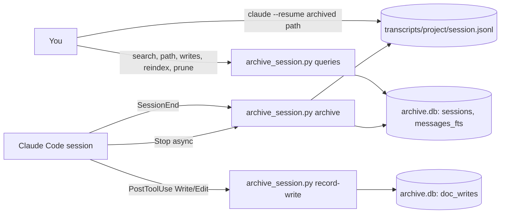

# SPEC-005 — Session archive hooks

## 1. Overview

Claude Code stores each conversation as `~/.claude/projects/<project>/<session-id>.jsonl` and deletes
it after 30 days (`cleanupPeriodDays`, left at its default by the owner on 2026-09-27). DevForgeAI
documents record the session that wrote each version (SPEC-001 BEH-07), so those IDs stop resolving
after a month. There is also no way to search what was said across sessions, and the only record of
which session wrote a document is the line the model writes in its Change Log.

This spec adds three **user-level** command hooks and one script:

- **`Stop`** (async, after every reply) and **`SessionEnd`** copy the transcript file into an archive
  and index its message text in SQLite. The copy is the archive; SQLite is only an index. So
  `claude --resume <archived path>` keeps working, and a change in the transcript format can break
  search but never the copy.
- **`PostToolUse` on `Write|Edit`** records which session wrote which `docs/specs/` document and
  version. This provenance is captured by code, not by the model. It cross-checks the Change Log
  rule instead of replacing it: the Change Log is what a reader of the document sees.

Hooks were chosen because they run on every session whatever the model does, and need no model
instruction. The hooks are not part of the `devforgeai` plugin (§12).

This is a draft for review. The script and its tests exist and pass (§9); nothing is installed.

## 2. Constraints

- **The transcript format is internal.** Claude Code's session docs say its JSONL entries change
  between releases, so anything parsed from them is best-effort (BEH-05, ERR-03). Only the hook
  input fields (`session_id`, `transcript_path`, `cwd`, `hook_event_name`, `reason`, `tool_name`,
  `tool_input`, `tool_use_id`) are treated as stable.
- **`SessionEnd` has a small budget.** All `SessionEnd` hooks share 1.5 seconds unless a hook sets a
  longer `timeout`, up to 60. `SessionEnd` also doesn't run when a terminal is killed or crashes.
  That is why `Stop` does most of the work.
- **Hooks run outside the Bash sandbox, as the user.** The script has the user's full file access,
  so its scope is opt-in (BEH-01) and its files are private (QR-02).
- **A hook must never disturb a session.** A non-zero exit shows a "hook error" notice, and exit 2
  on `Stop` would keep Claude talking. Hook subcommands always exit 0 and print nothing (BEH-07).
- **Python standard library only**, including `sqlite3` with FTS5 (present in SQLite 3.45 here).

## 3. Architecture and components



| Component | Responsibility |
|---|---|
| `src/tools/session-archive/archive_session.py` | Both hook entry points and the query commands |
| `$CLAUDE_ARCHIVE_DIR` (default `~/.local/share/claude-archive`) | `config.json`, `archive.db`, `transcripts/`, `hook-errors.log` |
| `~/.claude/settings.json` | Registers the three hooks (`settings-snippet.json`); the owner installs it |

The source lives in `src/tools/`, not `src/claude/`, because `src/claude/` is copied into the
project's `.claude/`, and these hooks belong to the user, not to one project.

## 4. Data model

```sql
-- DM-01
CREATE TABLE sessions (
    session_id     TEXT PRIMARY KEY,   -- the transcript's file name, and claude --resume's argument
    cwd            TEXT NOT NULL,
    source_path    TEXT NOT NULL,      -- ~/.claude/projects/<project>/<id>.jsonl
    archive_path   TEXT NOT NULL,      -- transcripts/<project>/<id>.jsonl
    first_seen     TEXT NOT NULL,
    last_archived  TEXT NOT NULL,
    last_event     TEXT,               -- Stop | SessionEnd
    last_reason    TEXT,               -- SessionEnd reason
    size           INTEGER NOT NULL,
    mtime_ns       INTEGER NOT NULL,
    sha256         TEXT NOT NULL,
    indexed_lines  INTEGER NOT NULL DEFAULT 0,
    skipped_lines  INTEGER NOT NULL DEFAULT 0,
    index_error    TEXT
);
-- DM-02
CREATE VIRTUAL TABLE messages_fts USING fts5(
    text, session_id UNINDEXED, line_no UNINDEXED, role UNINDEXED, ts UNINDEXED
);
-- DM-03
CREATE TABLE doc_writes (
    id           INTEGER PRIMARY KEY AUTOINCREMENT,
    session_id   TEXT NOT NULL,
    cwd          TEXT NOT NULL,
    rel_path     TEXT NOT NULL,        -- docs/specs/brainstorm/BRN-001.md
    tool         TEXT NOT NULL,        -- Write | Edit
    doc_id       TEXT,                 -- frontmatter id, read after the write
    doc_version  TEXT,                 -- frontmatter version, read after the write
    tool_use_id  TEXT UNIQUE,
    written_at   TEXT NOT NULL
);
```

`config.json` holds `include_prefixes` (a list of directories; `~` allowed) and `retention_days`
(a number, or `null` for no pruning).

## 5. Interfaces and contracts

The interface is the hook registration and a command line, not an API.

| ID | Interface | Contract |
|---|---|---|
| IF-01 | `archive` (hook) | stdin: `Stop` or `SessionEnd` hook JSON. Exit 0, no output |
| IF-02 | `record-write` (hook) | stdin: `PostToolUse` JSON for `Write` or `Edit`. Exit 0, no output |
| IF-03 | `search TERM [--limit N] [--raw]` | Phrase search (FTS5 syntax with `--raw`). Prints time, session, role, cwd and a snippet; exit 1 if nothing matches |
| IF-04 | `path SESSION_ID` | Prints the archived transcript path; exit 1 if unknown |
| IF-05 | `writes DOC_ID` | Lists time, version, tool, session and path for each recorded write; exit 1 if none |
| IF-06 | `reindex [SESSION_ID]` | Rebuilds DM-02 from the archived files |
| IF-07 | `prune` | Deletes the sessions (rows, index and file) last archived before `retention_days` |

Hook registration, merged into `~/.claude/settings.json` (`src/tools/session-archive/settings-snippet.json`):

```yaml
# JSON in the file; YAML here for readability
hooks:
  Stop:        [{hooks: [{type: command, command: 'python3 "$HOME/.claude/hooks/session-archive/archive_session.py" archive', async: true, timeout: 60}]}]
  SessionEnd:  [{hooks: [{type: command, command: 'python3 "$HOME/.claude/hooks/session-archive/archive_session.py" archive', timeout: 30}]}]
  PostToolUse: [{matcher: "Write|Edit", hooks: [{type: command, command: 'python3 "$HOME/.claude/hooks/session-archive/archive_session.py" record-write', async: true, timeout: 30}]}]
```

## 6. Behavior

```yaml items
behaviors:
  - id: BEH-01
    status: active
    rule: "Archive or record only when the hook's cwd, resolved, is one of config.json include_prefixes or inside one. With no config.json or an empty list, do nothing."
  - id: BEH-02
    status: active
    rule: "Run archive on Stop (async, after every reply, so a killed terminal loses at most the last reply) and on SessionEnd (timeout 30, so the final copy isn't cut off by the 1.5-second default budget)."
  - id: BEH-03
    status: active
    rule: "If the transcript's size and mtime match the sessions row and the archived file exists, copy nothing. On SessionEnd, still record the reason."
  - id: BEH-04
    status: active
    rule: "Otherwise copy the transcript to transcripts/<project directory name>/<session_id>.jsonl through a temporary file and a rename, remove the temporary file if the copy fails, and upsert the sessions row (size, mtime, sha256, event, reason; first_seen kept)."
  - id: BEH-05
    status: active
    rule: "After each copy, rebuild the session's messages_fts rows from the archived file: the text blocks of user and assistant entries, with their timestamps. Skip lines that aren't valid JSON and count them. On any other error, keep the copy and the row and store the error in index_error."
  - id: BEH-06
    status: active
    rule: "On PostToolUse for Write or Edit, when the file is a .md under <cwd>/docs/specs/, read id and version from its frontmatter after the write and insert a doc_writes row. Ignore a repeated tool_use_id."
  - id: BEH-07
    status: active
    rule: "Hook subcommands always exit 0 and print nothing. Any problem, including invalid input, a missing transcript or a locked database, goes to hook-errors.log with a timestamp."
  - id: BEH-08
    status: active
    rule: "Open the database in WAL mode with a 5-second busy timeout, and hold no transaction while copying a file, so concurrent sessions don't block each other."
  - id: BEH-09
    status: active
    rule: "Create the archive directories owner-only (0700) and write archived transcripts owner-only (0600)."
  - id: BEH-10
    status: active
    rule: "search quotes the term as one phrase unless --raw is given, so IDs such as IDEA-02 need no FTS5 escaping."
```

## 7. Errors and edge cases

```yaml items
errors:
  - id: ERR-01
    status: active
    condition: "The transcript path in the hook input doesn't exist"
    handling: "Log it and exit 0; the next Stop tries again"
    user_result: "Nothing visible; a hook-errors.log line"
  - id: ERR-02
    status: active
    condition: "The hook input isn't a JSON object, or lacks session_id or transcript_path"
    handling: "Log it and exit 0"
    user_result: "Nothing visible; a hook-errors.log line"
  - id: ERR-03
    status: active
    condition: "A Claude Code release changes the transcript format"
    handling: "The copy and row still succeed; indexing stores index_error or finds no text. After adjusting message_text, run reindex"
    user_result: "search misses that session until reindex; path and claude --resume still work"
  - id: ERR-04
    status: active
    condition: "The last transcript line is still being written when Stop copies it"
    handling: "The line is skipped and counted in skipped_lines; the next Stop or SessionEnd copies and indexes it"
    user_result: "None"
  - id: ERR-05
    status: active
    condition: "The database stays locked for more than 5 seconds, or the disk is full"
    handling: "The hook logs the error and exits 0; the temporary file is removed; the next Stop retries"
    user_result: "The archive lags by one reply; a hook-errors.log line"
```

## 8. Non-functional design

```yaml items
quality_responses:
  - id: QR-01
    status: active
    response: "The common path (transcript unchanged) is one stat and one indexed row lookup; Stop runs async, so the session never waits"
    measured_by: "Timed on a real 685 KB transcript: first archive and index 87 ms, unchanged 25-27 ms (mostly Python start-up)"
  - id: QR-02
    status: active
    response: "Opt-in scope by directory (BEH-01), owner-only files (BEH-09), no network access, and retention under the owner's control (IF-07)"
    measured_by: "VER-04 and VER-01 (mode 0600); code review"
  - id: QR-03
    status: active
    response: "A hook failure can't disturb a session: exit 0, no output, errors logged (BEH-07)"
    measured_by: "VER-06"
```

## 9. Verification

Automated tests are in `src/tools/session-archive/test_archive_session.py` (stdlib `unittest`). Each
test runs the script as a subprocess with hook JSON on stdin, as Claude Code does. All 8 passed on
2026-09-27 in the author's sandbox. VER-09 was run by hand; VER-10 and VER-11 are not run.

```yaml items
verifications:
  - id: VER-01
    status: active
    obligation: "archive copies the transcript byte-for-byte to transcripts/<project>/<id>.jsonl with mode 0600 and no leftover .tmp, records the row with the SessionEnd reason, indexes both messages, search IDEA-02 finds the session, and path prints the archived path. Test test_archive_copies_indexes_and_resolves_path: pass."
    level: integration
    covers:
      - DM-01
      - DM-02
      - IF-01
      - IF-03
      - IF-04
      - BEH-04
      - BEH-05
      - BEH-09
      - BEH-10
  - id: VER-02
    status: active
    obligation: "A second archive of an unchanged transcript copies nothing and leaves last_archived unchanged; after the transcript grows, it is copied and re-indexed. Test test_unchanged_is_skipped_and_growth_is_recopied: pass."
    level: integration
    covers:
      - BEH-03
      - BEH-04
      - BEH-05
  - id: VER-03
    status: active
    obligation: "A transcript with one malformed line is archived; the row has indexed_lines 2, skipped_lines 1 and no index_error, and the other lines are searchable. Test test_malformed_line_does_not_lose_the_session: pass."
    level: integration
    covers:
      - BEH-05
      - ERR-04
  - id: VER-04
    status: active
    obligation: "A session whose cwd is outside include_prefixes, and any session when config.json is missing, produces no copy and no row. Test test_scope_is_opt_in: pass."
    level: integration
    covers:
      - BEH-01
  - id: VER-05
    status: active
    obligation: "A Write to docs/specs/brainstorm/BRN-001.md records session, path, tool, doc_id BRN-001 and version 2; the same tool_use_id again adds nothing; an Edit outside docs/specs/ is ignored; writes BRN-001 lists it. Test test_record_write_maps_documents_to_sessions: pass."
    level: integration
    covers:
      - DM-03
      - IF-02
      - IF-05
      - BEH-06
  - id: VER-06
    status: active
    obligation: "Non-JSON input, a missing transcript and a JSON array each exit 0 with no output and a hook-errors.log line. Test test_hooks_fail_open: pass."
    level: integration
    covers:
      - BEH-07
      - ERR-01
      - ERR-02
  - id: VER-07
    status: active
    obligation: "Ten archive processes started at once all exit 0, record ten rows, and log no errors. Test test_concurrent_archives: pass."
    level: integration
    covers:
      - BEH-08
      - ERR-05
  - id: VER-08
    status: active
    obligation: "After the text index is emptied, reindex restores search; prune with retention_days unset deletes nothing, and with 30 days deletes a session last archived in 2000, including its file. Test test_reindex_and_prune: pass."
    level: integration
    covers:
      - IF-06
      - IF-07
      - ERR-03
  - id: VER-09
    status: active
    obligation: "Two real transcripts from Claude Code 2.1.283 (the brainstorm manual-test sessions) archive with no skipped lines and no index error, and search finds 'fridge magnet' and IDEA-02 in the right sessions. Run by hand on 2026-09-27: pass."
    level: manual
    covers:
      - BEH-05
      - ERR-03
  - id: VER-10
    status: active
    obligation: "Installed per §10, a new session in an included directory appears in the archive after its first reply; a Write to docs/specs/ appears in writes; after /exit its row shows SessionEnd with a reason; claude --resume with the archived path reopens it. Not run: needs installation."
    level: manual
    covers:
      - BEH-02
      - IF-01
      - IF-02
      - IF-04
  - id: VER-11
    status: active
    obligation: "With about 20 sessions active, hook-errors.log shows no lock timeouts over a working day. Not run."
    level: manual
    covers:
      - BEH-08
      - QR-01
```

## 10. Rollout, migration and rollback

1. From a plain WSL shell (outside Claude, whose sandbox can't write `~/.claude/hooks/`), copy the
   script to `~/.claude/hooks/session-archive/`.
2. Create `~/.local/share/claude-archive` with mode 700 and copy `config.example.json` to
   `config.json` in it. Set `include_prefixes` (see §13).
3. Merge the three entries of `settings-snippet.json` into the `hooks` object of
   `~/.claude/settings.json`, next to any existing hooks.
4. Run VER-10.

Nothing migrates: transcripts that already aged out are gone, and transcripts still present are
archived the next time their session replies or ends. Rollback: remove the three hook entries. The
archive stays until you delete `~/.local/share/claude-archive`.

## 11. Implementation plan

1. Write `archive_session.py` with the hook and query commands (implements DM-01..03, IF-01..07, BEH-01..10). Done.
2. Write `test_archive_session.py` (implements VER-01..08). Done: 8 of 8 pass.
3. Run against real transcripts (VER-09). Done.
4. Install and run VER-10. Owner.
5. Watch `hook-errors.log` for a day with the usual number of sessions (VER-11). Owner.

## 12. Alternatives considered

| Option | Why not chosen |
|---|---|
| Raise `cleanupPeriodDays` | Simplest, and no code. But it gives no search and no document-to-session mapping, and the owner kept the 30-day default |
| Store transcripts as blobs in SQLite | `claude --resume` needs a file path, so a blob would have to be exported before every resume |
| `SessionEnd` only | Misses killed terminals and crashes, and its default budget is 1.5 seconds |
| Ship the hooks in the `devforgeai` plugin | Every plugin user's chats would be archived without asking, and plugin hooks would also run in every eval run |
| Parse the transcripts into full SQL tables (tool calls, results) | Ties the archive to an internal format that changes between releases. Plain text in FTS is enough for search, and the file keeps everything else |
| Rely on the Change Log rule alone (SPEC-001 BEH-07) | It depends on the model writing the row correctly; doc_writes records the same fact by code |

## 13. Open questions

- [NEEDS CLARIFICATION: Which directories should be archived? Recommended: only `~/Projects/DevForgeAI` at first; widening to `~/Projects` archives every project's chats.]
- [NEEDS CLARIFICATION: How long should the archive keep sessions? `retention_days: null` keeps them forever, which is what the 30-day default avoids for Claude Code's own copies.]
- [NEEDS CLARIFICATION: Should `prune` run automatically, for example once a day from the `SessionEnd` hook, or only by hand?]
- [NEEDS CLARIFICATION: Should a later DevForgeAI check compare each document's Change Log sessions with doc_writes, or is doc_writes for lookup only?]
- [NEEDS CLARIFICATION: Should the index also cover tool calls and tool results, not just message text? It would find more, but it indexes file contents and grows much larger.]

## Change Log

| Version | Date | Author | Change | Items affected |
|---|---|---|---|---|
| 1 | 2026-09-27 | claude-code (session 86470fb4-119e-49d1-8adc-0f575bcc5b9a) | Initial draft; script and tests written, VER-01..09 pass | all |
