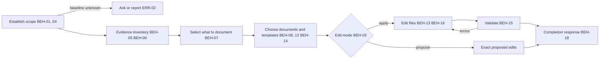

# SPEC-006 — Documents updater skill

## 1. Overview

The `documents-updater` skill ships in the `devforgeai` plugin and is invoked as
`/devforgeai:documents-updater [base-or-range] [propose]`, or automatically when a user asks to
bring a repository's documentation up to date. After repository work is complete, it updates or
creates `README.md`, `CHANGELOG.md` and the other affected documents so they describe the
resulting project state. Git diffs and the current files are its evidence.

The procedure is the owner's workflow document,
[`docs/specs/repository-documentation-update-workflow.md`](../repository-documentation-update-workflow.md)
(2026-09-28). This spec turns its rules into BEH, ERR and VER items so the skill can be built and
evaluated like the other DevForgeAI skills. When the two disagree, this spec wins; fix the
disagreement in the next version of this spec.

The skill is not a planning-chain step. It writes the *user's* repository documentation, not
`docs/specs/<type>/<ID>.md` documents, and it never allocates document IDs. Three rules shape
everything else:

- **Evidence, not narrative.** Every claim must be confirmed against the repository. A diff shows
  that content changed. It never shows that tests passed, that a feature was released, or that
  anything got faster.
- **The baseline is never guessed.** The skill never silently substitutes the last commit, the
  latest tag or an assumed `main` for an unknown before state.
- **Only documentation changes, and only when authorized.** Without authorization the skill
  proposes exact edits and modifies nothing. It never stages, commits, pushes, tags, releases or
  changes code.

This skill implements the spec and is recorded as `SKL-005` in its `provenance.yaml`. SKL-003 and
SKL-004 are reserved by SPEC-003 and SPEC-004.

## 2. Constraints

- **PRD-001 NFR-001, NFR-002 and NFR-003**, as for SPEC-001 and SPEC-002: a `SKILL.md` of at most
  500 lines with detail in `references/`, spec-only frontmatter with provenance in the sidecar, and
  behavior proven by an eval suite (§9).
- **ADR-001 v4:** built from `src/`, deployed with rsync by the owner, and evaluated from a plain
  terminal.
- **Any repository.** The skill runs in the user's project, which may lack git, commits, a README
  or a changelog, and may follow its own documentation conventions. Repository conventions always
  win over the skill's fallback templates (BEH-10).
- **No network and no installs.** The validator script uses the Python standard library only.

## 3. Architecture and components

```
src/claude/DevForgeAI/
├── skills/documents-updater/
│   ├── SKILL.md                         # checklist, user decisions, output contract
│   ├── provenance.yaml                  # SKL-005, implements SPEC-006
│   ├── references/
│   │   ├── scope-and-evidence.md        # before state, evidence inventory, git commands (BEH-03..06)
│   │   ├── document-selection.md        # what to document, which documents, missing-document rules, profiles (BEH-07..10)
│   │   ├── writing-standards.md         # layout and concise-reporting rules (BEH-13)
│   │   └── output-rules.md              # README and changelog rules, proposals, completion response, self-check list
│   ├── assets/                          # fallback document templates, one per document type (BEH-10)
│   │   ├── readme.md  changelog.md  tutorial.md  how-to.md  reference.md  configuration.md
│   │   └── migration.md  runbook.md  architecture.md  adr.md  contributing.md  specification.md
│   └── scripts/check_docs.py            # mechanical Markdown checks for step 6 (BEH-15)
└── evals/documents-updater/<case>/      # one case per automated VER item (§9)
src/tests/documents-updater/test_check_docs.py   # unit tests for check_docs.py (VER-09), not deployed
```



## 4. Data model

**Inputs:** the repository's git state (committed, staged, unstaged and untracked changes), its
instructions and documentation conventions, its existing documents and templates, and the
conversation, which may hold the task scope and a git status captured at session start.

**Working notes** (never published unless the project requires an evidence record): one per
meaningful outcome, with `Outcome`, `Audience`, `Evidence`, `Action` and `Destination`.

**Outputs:** edited or created documentation files in the user's repository, or, in proposal mode,
exact replacement text or a patch in the reply. Then the completion response (§5). New documents
follow the repository's layout; otherwise they go in `docs/<kebab-case-topic>.md`, except the root
`README.md` and `CHANGELOG.md`.

## 5. Interfaces and contracts

```yaml
# Proposed SKILL.md frontmatter (validated by src/schemas/skill-frontmatter.schema.json)
name: documents-updater
description: "<third person: what it does and when to use it, with the words users say>"
argument-hint: "[base-revision-or-range] [propose]"
metadata:
  devforgeai-id: "SKL-005"
  devforgeai-version: "<SKL-005's provenance.yaml version, quoted>"
```

- **Arguments:** `$ARGUMENTS` may hold a base revision (`abc1234`, `v1.2.0`), a range
  (`v1.2.0..HEAD`), the word `propose`, or free text that describes the scope. All are optional.
- **Tools:** Read, Glob and Grep to inspect files; Bash for read-only git commands, `check_docs.py`,
  the repository's documentation checks and safe checks of examples (BEH-15); Write and Edit for
  documentation files only; AskUserQuestion when a question is needed (BEH-17).
- **Completion response** (the last thing in the reply; empty fields are omitted):

  ```text
  Result: updated | proposed | no_change | partial | blocked
  Scope: <comparison point and target; uncertainty only if material>
  Documents: <paths created, updated or proposed>
  Highlights:
  - <meaningful outcome>
  Validation: <checks performed and relevant limitations>
  Action required: <migration, unresolved discrepancy or essential clarification>
  ```

## 6. Behavior

```yaml items
behaviors:
  - id: BEH-01
    status: active
    rule: "Establish context before changing anything. Confirm the repository root and read its instructions (CLAUDE.md, AGENTS.md, CONTRIBUTING, documentation conventions, release configuration). Inventory existing documentation and templates: canonical files, README files outside the root, generated outputs, release-note fragment systems, project type and intended readers. Record the git status and keep the pre-edit content of every document to be changed. A dirty working tree is not a reason to stop. Never ask the user to repeat information or permission already established in the conversation or the repository."
  - id: BEH-02
    status: active
    rule: "Choose the edit mode. Apply edits when the request (or authorization already given in the session) asks to update, create or fix documentation. Use proposal mode when the request asks to propose, draft, suggest, review or preview changes, says not to edit files, or passes the argument propose, and when the skill was triggered without any request to change documentation. In proposal mode modify no repository file: give exact replacement text or a unified diff for each changed section, and the full content of each proposed new file."
  - id: BEH-03
    status: active
    rule: "Resolve the before state in this priority: (1) a revision, range or scope the user gave ('my uncommitted changes' means HEAD); (2) a captured task-start state, only when this session did the work being documented, including a git status snapshot from the start of the session and pre-existing local edits (when the session began with the documentation request, that snapshot is the target, not the base); (3) the merge base with the branch's known integration branch, when the scope is that branch's work and the integration branch is known from the user, the repository's instructions or the remote's default branch (a branch's own tracking branch is not its integration branch); (4) HEAD, when the scope is the current uncommitted changes, for example when the work the request describes exists only in them. Never silently substitute the last commit, the latest tag, the root commit or an assumed main branch. State the selected scope and any material uncertainty in the Scope line."
  - id: BEH-04
    status: active
    rule: "Attribute only the task's edits. When the task began with local changes, use the captured start state and the known task boundaries to exclude unrelated edits. Leave an edit whose attribution is uncertain undocumented and name it in the reply; never attribute it to the task."
  - id: BEH-05
    status: active
    rule: "Build an evidence inventory. Inspect the committed, staged, unstaged and untracked changes in scope, and read the affected source, configuration, tests, specifications and documents far enough to understand each outcome. Use summaries, commit messages and task descriptions only to locate evidence, and confirm every substantive claim against the repository. Keep one working note per meaningful outcome (Outcome, Audience, Evidence, Action, Destination) out of the documents. Group related edits into one outcome, and never announce reverted or superseded intermediate work."
  - id: BEH-06
    status: active
    rule: "Describe only the status the evidence supports, keeping specified, implemented, tested and released distinct. A diff never shows that tests passed, that a feature was deployed or released, or that a measured improvement exists. When the implementation conflicts with an accepted requirement, flag the discrepancy in Action required and never rewrite the requirement to match the implementation."
  - id: BEH-07
    status: active
    rule: "Document a change when it affects what a reader can do, how they must do it, or what they must maintain or operate. Omit formatting, internal renaming, routine cleanup, extra tests and routine dependency churn from reader-facing summaries unless they have a material audience impact. Never claim improved speed, reliability, security, completeness or production readiness without a measured result; describe the concrete behavior instead."
  - id: BEH-08
    status: active
    rule: "Review README.md and CHANGELOG.md on every run, then choose the other documents to change using the update table in references/document-selection.md. Search the repository for affected commands, options, configuration keys, paths and concepts, and update documents that mention them even when those documents are absent from the diff, including package READMEs in a monorepo. Edit the smallest useful sections, preserve the repository's voice and structure, and prefer relative links. When documentation or release notes are generated, edit their source or required change fragment instead of the output."
  - id: BEH-09
    status: active
    rule: "Handle missing documents by the missing-document rules. Update a canonical document that exists under another name or location instead of creating a competing copy. Create a README when none exists, after inspecting the current repository broadly enough to describe its purpose, prerequisites and first-use path. Create CHANGELOG.md only when there are verified notable changes to record, or when the user or the repository requires an initial scaffold. Create a guide, reference or runbook only when a concrete reader task needs detail that would overload the README, and link it from an entry point. A new document describes the current project, not only the diff."
  - id: BEH-10
    status: active
    rule: "Use the repository's own template or established structure first. Otherwise choose a project profile and a document template from references/document-selection.md and start from the matching file in assets/. Remove every unused section, every {{placeholder}} and every guide comment before delivery. Never invent commands, URLs, credentials, owners, licenses, support guarantees or release history."
  - id: BEH-11
    status: active
    rule: "Keep the README a description of the current supported state at the target. Keep the overview and getting-started path easy to scan, and preserve release or branch qualifiers so unreleased capabilities are not presented as available in the latest published version. Never append a work-session report, commit inventory or implementation diary to the README."
  - id: BEH-12
    status: active
    rule: "Follow the changelog's existing format and release tooling. With no convention, use an Unreleased section with only the Keep a Changelog categories that have entries (Added, Changed, Deprecated, Removed, Fixed, Security). Write one entry per meaningful outcome and merge with an existing Unreleased entry that describes the same change. Keep published release sections byte-identical except for an explicitly requested factual correction. Never assign a version, write a release date or mark the work as released. Make compatibility breaks prominent, naming the affected behavior and the required action."
  - id: BEH-13
    status: active
    rule: "Write new and changed sections to the standards in references/writing-standards.md: one title and sentence-case headings without skipped levels; purpose and next action near the top; prerequisites before commands; complete examples with explained placeholders and no real secrets; meaningful link text; no decorative badges or unverified status indicators; concise summary items that lead with the changed behavior. Avoid unrelated visual rewrites."
  - id: BEH-14
    status: active
    rule: "Respect governed documents. When the repository governs specifications, ADRs or task records (for example version bumps, Change Log rows and approval records, as in DevForgeAI's docs/specs), change them only when the task authorizes it and only through that process. Preserve historical decisions and follow the project's supersession process. Never change an accepted requirement's contract."
  - id: BEH-15
    status: active
    rule: "Validate before reporting. Run scripts/check_docs.py on every created or edited Markdown file, then check the self-check list in references/output-rules.md item by item. Fix each problem in lines the run added or changed and check again, at most three attempts; report errors in untouched lines as pre-existing without changing them. Run only relevant checks and the repository's required documentation gates, and check whitespace in tracked and new documents. Verify examples with existing evidence or safe checks (--help, an existing test, an example on a scratch file outside the repository) that modify no repository file and need no network or credentials; never install packages or run deploy, migration or release commands. Preview the rendered documents when the repository offers a safe preview, otherwise say the review was of the source only, and never report an unexecuted example or test as passing. Running the skill again with the same evidence must add no duplicate entries or cosmetic churn."
  - id: BEH-16
    status: active
    rule: "Change only documentation in scope. Never change code, stage, commit, push, tag, release or deploy unless the user's task already includes it. If a target section changed during the run, reread it and preserve the newer content. Preserve unrelated content and the user's staging choices."
  - id: BEH-17
    status: active
    rule: "Ask only when a remaining ambiguity prevents an accurate, properly scoped update, such as an unrecoverable before state or information essential to an instruction. An ambiguity that doesn't change the result needs no question; name the reading used in the Scope line. Use AskUserQuestion when available, otherwise ask in plain text and end the turn. When no answer can arrive, finish the unambiguous parts and report partial (something changed) or blocked (nothing changed) with the question in Action required."
  - id: BEH-18
    status: active
    rule: "End with the completion response (§5). Use updated for completed updates or creations, proposed for fully prepared proposals, no_change when no edit is warranted, partial when supported updates are done but an issue remains, and blocked when no accurate update can proceed. Keep Highlights to one to three bullets unless a required user action needs more. Report the documentation outcome only; never paste the evidence inventory or list every implementation change. An unchanged document set is a valid result."
```

## 7. Errors and edge cases

```yaml items
errors:
  - id: ERR-01
    status: active
    condition: "The directory is not a git repository, git is unavailable, or the repository has no commits."
    handling: "Work from the current files: correct current facts and create missing documents from them. In a repository without commits, document its initial state and never manufacture release history. Make no historical change claims."
    user_result: "Scope says there is no git history; Result is updated, partial or no_change."
  - id: ERR-02
    status: active
    condition: "The before state cannot be resolved by BEH-03 (no given revision, no captured start state, no known integration branch, and the scope is not just the uncommitted changes)."
    handling: "Ask for the comparison point (BEH-17). The question may list the candidate commits (hash, date, subject) but never drafts entries or says what each choice would add. Until it is answered, write no changelog entries and no other historical change claims, in files or in the reply; only unambiguous corrections of current facts may proceed."
    user_result: "A question naming the missing comparison point, or Result partial or blocked with it in Action required."
  - id: ERR-03
    status: active
    condition: "A revision or range the user gave does not resolve (git rev-parse fails)."
    handling: "Stop before inspecting changes. Name the revision that failed and list the nearest branches and tags."
    user_result: "Result blocked, with the failing revision in Action required."
  - id: ERR-04
    status: active
    condition: "There are no verified notable changes to record and no CHANGELOG exists."
    handling: "Leave the changelog absent unless the user or the repository requires an initial scaffold."
    user_result: "The reply says no verified changelog entries are available."
  - id: ERR-05
    status: active
    condition: "Information needed for accurate instructions is missing (for example the install command, a required credential name or a supported version)."
    handling: "Complete the supported sections, omit the unsupported instruction rather than inventing it, and ask only for information essential to finish the guidance."
    user_result: "Result partial, with the specific gap in Action required."
  - id: ERR-06
    status: active
    condition: "check_docs.py errors in lines the run added or changed, or self-check failures, remain after three fix attempts."
    handling: "Stop editing and keep the documents as they are."
    user_result: "Result partial, listing each remaining error with its file path and line."
  - id: ERR-07
    status: active
    condition: "The implementation conflicts with an accepted requirement or specification."
    handling: "Document the implemented behavior only as far as evidence supports it, and never edit the requirement to match."
    user_result: "Action required names the requirement and the discrepancy."
```

## 8. Non-functional design

```yaml items
quality_responses:
  - id: QR-01
    status: active
    response: "SKILL.md holds the checklist, the user's decisions and the output contract, under 300 lines. The workflow's tables live in four reference files and the templates in assets/, loaded only at the step that needs them."
    measured_by: "wc -l on SKILL.md; every reference linked directly from SKILL.md"
    upstream:
      - {id: PRD-001, item: NFR-001, relation: satisfies, version: 11, hash: null}
  - id: QR-02
    status: active
    response: "SKILL.md frontmatter carries only name, description, argument-hint and metadata; provenance.yaml carries SKL-005 with an implements link to SPEC-006, and the two version values match."
    measured_by: "jsonschema validation against skill-frontmatter.schema.json and skill.schema.json"
    upstream:
      - {id: PRD-001, item: NFR-002, relation: satisfies, version: 11, hash: null}
  - id: QR-03
    status: active
    response: "One eval case per automated VER item under evals/documents-updater/, tagged documents-updater and ver-NN, each scaffolding its own git repository; file claims use regex graders."
    measured_by: "claude plugin eval with the no-plugin baseline, 3 runs, threshold 0.8"
    upstream:
      - {id: PRD-001, item: NFR-003, relation: satisfies, version: 11, hash: null}
```

## 9. Verification

**Verification status.**

| Kind | Status |
|---|---|
| Structural: frontmatter and provenance against the schemas | Pass on 2026-09-28, after `spec.schema.json` made VER `upstream` conditional (§13) |
| Unit: `check_docs.py` (VER-09) | 23 of 23 tests pass on 2026-09-28. PR #35 (2026-10-01) fixed four false errors, each with a test that failed first: a footnote definition read as a broken link, repeated sub-bullets read as duplicate `Unreleased` entries, an empty `Unreleased` section in a changelog, and a leading horizontal rule read as front matter. 27 of 27 pass, and the old and new script give identical output on all of the repository's tracked Markdown |
| Behavioural: automated VER items, one eval case each | 1 run with the no-plugin baseline on 2026-09-28: 8 of 8 cases at 1.00 with the plugin, mean Δ +0.16, $2.95 (`tmp/eval-results/du1`). Without the plugin, VER-04, VER-05 and VER-07 also scored 1.00, so VER-04 and VER-05 were then made harder (an unmeasured "3x faster" comment; an untagged 1.1.0 manifest bump). Rerun of those two, 1 run each: VER-05 1.00 with and 0.92 without (the baseline added no version or date but left out the breaking marker); VER-04 1.00 with and without. VER-04 and VER-07 therefore show the contract is met, not a gain over plain Claude. 3 runs with the baseline on 2026-09-28 (Claude Code 2.1.283): 8 of 8 cases at 1.00 with the plugin in every run, mean Δ +0.15, $8.71, no run errors (`tmp/eval-results/du3`) |
| Behavioural: VER-03 requalification, 2026-10-01 | PR #35 made VER-03's case stricter. Before, a run that rewrote the README or CHANGELOG cosmetically still passed. `readme-unchanged` and `changelog-unchanged` now pin both seeded files whole, replacing `changelog-single-entry` and `changelog-no-internal-entry`. Bryan ran it from a plain terminal; Claude Code 2.1.286, plugin 0.7.0, judge model sonnet. 1 run without the baseline: 1.00, $0.27 (`tmp/eval-results/du-ver03-20261001T110215-quick`). 3 runs with the baseline: 1.00 with the plugin in every run and 0.75 without, Δ +0.25, $1.14, 118 s, no run errors (`tmp/eval-results/du-ver03-20261001T110215`). Without the plugin, both files also stayed unchanged; its only miss was the completion response. Both folders are local and untracked, in the worktree `.claude/worktrees/fix-docs-checker`. **Bound:** `record_revision.sh` wrote the commit `17696dd` (PR #35's head) and the plugin digest `29b30105f39e26d9eebb749b9b06d8f28e116923ccdce2d965f9beaa3340e791`. The skill, its eval cases and its tests are identical at the merge `6d80f9f` |
| Behavioural: manual VER items (VER-10, VER-11, VER-12) | Not run. The skill was deployed on 2026-09-28 and the deployed copy matched `src/`. PR #35 then changed `scripts/check_docs.py`, so redeploy before running them |

Each automated VER item has one eval case under `evals/documents-updater/`, tagged
`documents-updater` and `ver-NN`. Runs are non-interactive and start in an empty workspace, so each
`scaffold.sh` builds a small git repository with dated commits and leaves the changes the case needs
(staged, unstaged or untracked). `file_exists` counts only files created during the run, so claims
about a seeded file use regex graders on that file.

`src/tests/documents-updater/make_evals.py` generates the cases, and `grade_evals.mjs` checks a
case's regex and `file_exists` graders offline against a workspace and a reply.

No story specifies this skill, so the VER items have no `upstream` link. `spec.schema.json`
requires one only in a spec that specifies a story (§13).

```yaml items
verifications:
  - id: VER-01
    status: active
    obligation: "Given a Python CLI with a README and no CHANGELOG, and uncommitted staged and untracked changes that add a --json option, a request to bring the README and changelog up to date adds --json to README.md and creates CHANGELOG.md with an Unreleased section and an Added entry naming --json, with no version heading and no date, and the reply contains 'Result: updated'. Eval case updates-readme-and-changelog: regex on both files and the reply, file_exists."
    level: e2e
    covers:
      - BEH-02
      - BEH-05
      - BEH-08
      - BEH-09
      - BEH-12
      - BEH-18
  - id: VER-02
    status: active
    obligation: "With the same fixture, a request to draft the documentation updates without touching files leaves README.md without --json, creates no CHANGELOG.md, and the reply contains 'Result: proposed' and the proposed --json text. Eval case proposal-mode-no-edits."
    level: e2e
    covers:
      - BEH-02
      - BEH-18
  - id: VER-03
    status: active
    obligation: "Given a README and CHANGELOG that already document --json, and an uncommitted internal refactor with an extra test, a request to refresh the docs changes neither file (no entry naming the refactored helper, refactoring or tests) and the reply contains 'Result: no_change'. Eval case no-change-when-accurate."
    level: e2e
    covers:
      - BEH-07
      - BEH-15
      - BEH-18
  - id: VER-04
    status: active
    obligation: "Given uncommitted changes that add a --jobs option processing files in parallel, with a code comment claiming it is roughly 3x faster but no benchmark or test-run evidence, the updated README.md and CHANGELOG.md name --jobs and claim no speed-up, performance gain, percentage or passing tests. Eval case no-unsupported-claims."
    level: e2e
    covers:
      - BEH-06
      - BEH-07
  - id: VER-05
    status: active
    obligation: "Given a CHANGELOG with one Unreleased entry and published 1.0.0 and 0.9.0 sections, and uncommitted changes that rename the configuration key poll_interval to poll_interval_seconds and bump the package manifest's version to 1.1.0 with no tag, the run keeps both published sections byte-identical, keeps the existing Unreleased entry, adds no version heading, no new date, no mention of 1.1.0 and no second Unreleased section, adds a prominent breaking entry naming poll_interval_seconds, updates docs/configuration.md (absent from the diff) so that its settings table has a poll_interval_seconds row and no poll_interval row, and updates the README's configuration example. Eval case preserves-release-history."
    level: e2e
    covers:
      - BEH-08
      - BEH-12
  - id: VER-06
    status: active
    obligation: "Given a repository whose only branch holds several commits, with no tags, remote or integration branch and a clean working tree, a request to update the changelog for the work on the branch creates no CHANGELOG.md and the reply asks for or names the missing comparison point. Eval case asks-for-unknown-baseline."
    level: e2e
    covers:
      - BEH-03
      - BEH-17
      - ERR-02
  - id: VER-07
    status: active
    obligation: "Given a git repository with no commits and no README holding a Python CLI package with no LICENSE file, a request to create a README writes README.md that opens with an H1 title and names the package's real command, the supported Python version and a local install from the checkout; it names no license, never tells readers to install the package from a package index, and leaves no {{placeholder}} or guide comment. Eval case creates-readme-from-profile. That only one H1 exists is left to check_docs.py at step 6: a regex can't tell a heading from a comment line in a code fence."
    level: e2e
    covers:
      - BEH-09
      - BEH-10
      - ERR-01
  - id: VER-08
    status: active
    obligation: "A request to write a commit message for staged changes does not trigger the skill and modifies no documentation. Eval case ignores-unrelated-request: tool_used on both arms, regex on README.md, file_exists false for CHANGELOG.md."
    level: e2e
    covers:
      - BEH-16
  - id: VER-09
    status: active
    obligation: "check_docs.py reports errors for a missing or second H1, a skipped heading level, an unclosed code fence, an empty section, a leftover {{placeholder}} (every one on a line, and multi-word ones inside inline code) or guide comment, a broken relative link or anchor, a duplicate or misplaced Unreleased section, a duplicate changelog category and a duplicate Unreleased entry; it reports no error for a clean README and changelog, ignores links and template-language braces inside code, ends changelog sections at H1 release headings, and detects every placeholder left in each asset once its guide comments are deleted. Unit tests in src/tests/documents-updater/test_check_docs.py."
    level: unit
    covers:
      - BEH-15
  - id: VER-10
    status: active
    obligation: "Manual: run the skill in proposal mode on a real repository, then apply the proposal; a second run with the same evidence returns Result no_change and changes no file."
    level: manual
    covers:
      - BEH-02
      - BEH-15
  - id: VER-11
    status: active
    obligation: "Manual: at the end of a real work session that began with unrelated local edits, the skill uses the session's captured start state, documents only the session's work, and names any edit whose attribution is uncertain."
    level: manual
    covers:
      - BEH-03
      - BEH-04
  - id: VER-12
    status: active
    obligation: "Manual: in this repository (a DevForgeAI project with governed specs), the skill uses the agent or spec-driven framework profile for the README, changes no approved spec or ADR, and reports its validation as a source review unless a rendered preview was made."
    level: manual
    covers:
      - BEH-10
      - BEH-11
      - BEH-14
```

## 10. Rollout, migration and rollback

The skill is new and changes no other skill, so removing its directory and eval folder rolls it
back. The plugin description gains a clause about documentation maintenance. Deployment is the
owner's rsync step (ADR-001).

## 11. Implementation plan

1. Write `SKILL.md` from §5–§7, and `provenance.yaml` as SKL-005 implementing SPEC-006.
2. Write the four reference files from the workflow document (BEH-03 to BEH-18), ending
   `output-rules.md` with the self-check list.
3. Write the twelve fallback templates in `assets/` (BEH-10).
4. Write `scripts/check_docs.py` and its unit tests (VER-09).
5. Write the eval cases for VER-01 to VER-08, with fixtures built by each `scaffold.sh`.
6. Evaluate the source cheapest first, as for the prd skill, until every case scores at least 0.8;
   deploy; then run VER-10 to VER-12 by hand.

## 12. Alternatives considered

| Option | Why not chosen |
|---|---|
| Keep the workflow document as the skill's only source | Every skill implements a SPEC and is proven by VER items; the workflow has no IDs to trace or tag evals with |
| Always apply edits when the skill runs | A model-triggered run would edit documents nobody asked to change. Proposal mode is the default without a request to change documentation (BEH-02) |
| Use the latest tag or `main` as the default baseline | Silently attributes unrelated history to the task; the workflow forbids it (BEH-03) |
| Nine README template files, one per project profile | The profiles differ only in the quick-start plan; one template with a per-profile plan avoids nine near-copies |
| Reuse `src/templates/adr.md` as the ADR fallback | That template is DevForgeAI's typed ADR for the planning chain; user repositories need a plain ADR. A DevForgeAI repository's own ADR format still wins (BEH-10, BEH-14) |
| Validate only by reading the files back | Heading levels, relative links and anchors are mechanical and easy to miss by eye; `check_docs.py` checks them, and the self-check list covers judgment |

## 13. Open questions

- Resolved (Bryan, 2026-09-28): the skill runs only on request (or when its description matches a
  request) and never starts itself at the end of another skill. The planning chain's last skill,
  once built, ends its Next step by recommending `/devforgeai:documents-updater`. Brainstorm and
  prd are unchanged.
- Resolved (Bryan, 2026-09-28): `spec.schema.json` requires a VER item's `upstream` only when the
  spec has a `specifies` link to a story. This spec has none, so its VER items validate without
  one. The rule still applies to SPEC-001 to SPEC-004.

## Change Log

| Version | Date | Author | Change | Items affected |
|---|---|---|---|---|
| 1 | 2026-09-28 | claude-code (session 1153e47a-e403-45d8-ad65-36549adadb4d) | Initial draft from docs/specs/repository-documentation-update-workflow.md, requested by Bryan. Skill, templates, validator, unit tests and eval cases written. Checked: SKILL.md frontmatter and provenance.yaml validate against their schemas; 23 of 23 check_docs.py tests pass. Smoke test, not a `claude plugin eval`: subagents followed SKILL.md on the fixtures of VER-01 to VER-07, and every regex and file_exists grader passed on their output (the llm and tool_used graders were not run). The instructions were revised from their notes and from plugin-validator and skill-reviewer reports. Evaluated from a plain terminal (§9). §13 resolved by Bryan: the chain's last skill recommends this skill, which runs only on request; spec.schema.json requires VER upstream only when a story is specified. Awaiting Bryan's approval | all |
| 1 | 2026-09-28 | Bryan | Approved | status |
| 1 | 2026-10-01 | claude-code (session eb8eb981-3457-4d9f-998f-8e3f93548784) | Status update only, at Bryan's instruction, with no version bump. §9 records PR #35, which fixed four `check_docs.py` false errors (27 of 27 tests pass) and pinned VER-03's README and CHANGELOG whole. It also records VER-03's bound requalification: 1.00 with the plugin in 3 of 3 runs, Δ +0.25. No requirement, behavior or VER item changed | §9 |
