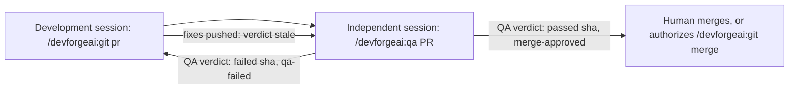

# SPEC-008 — QA review skill (stub)

> **Stub.** This version reserves the QA skill and fixes the contract that the `git` skill
> (SPEC-007) already relies on: independence, the verdict comment, the labels and the approval.
> It doesn't yet say how QA judges a PR (§13). Don't build the skill from this version.

## 1. Overview

The `qa` skill is meant to **approve pull requests**, when the time comes. It will run in an
independent Claude Code or Codex session, never the session that developed the change. It reviews a
PR's head commit against the work the PR claims to deliver and records a verdict: **passed**, which
approves the PR for merging, or **failed**, which sends it back to development. It never merges.
Merging stays with the human, or with SPEC-007's `git` skill on the human's authorization.

Bryan decided on 2026-09-28 that QA is an independent Claude or Codex session, that it approves a PR
by labeling it `merge-approved` or fails it with `qa-failed`, that its verdict names the commit it
reviewed, and that this spec starts as a stub.

Until the skill exists, an independent session or a human can follow §4 and §5 by hand. SPEC-007
treats a verdict posted that way exactly like one from the skill.

The skill will be recorded as `SKL-007` in its `provenance.yaml`; this spec reserves that ID, as
SPEC-003 and SPEC-004 reserve SKL-003 and SKL-004.

| Part | State in this version |
|---|---|
| Independence, the verdict comment, labels and the GitHub review (§4–§7) | Specified: SPEC-007 BEH-20 depends on it |
| Review criteria: what QA checks and when a finding fails the PR | Not specified (§13) |
| The Codex variant | Not specified (§13) |
| Eval cases | Only manual checks of the contract (§9); automated cases come with the review criteria |

## 2. Constraints

- **PRD-001 NFR-001, NFR-002 and NFR-003**, as for SPEC-006 and SPEC-007: a `SKILL.md` of at most
  500 lines, spec-only frontmatter with provenance in the sidecar, and an eval suite (§9).
- **ADR-001 v4:** built from `src/`, deployed with rsync by the owner, evaluated from a plain
  terminal.
- **SPEC-007 BEH-20 reads what this skill writes.** The verdict format and label names in §4 change
  only together with it.
- **GitHub only** (SPEC-007 §2).
- **GitHub doesn't let an account approve its own PR.** When QA works with the account that opened
  the PR, as it usually will, the verdict comment and label are the approval. When QA has its own
  account, it also submits a GitHub review, which branch protection's required reviews can count
  (BEH-05).
- **Independence.** The session that developed a PR never reviews it (BEH-01).

## 3. Architecture and components

```
src/claude/DevForgeAI/skills/qa/         # not created until the review criteria are specified
├── SKILL.md                             # review checklist, verdict rules, output contract
├── provenance.yaml                      # SKL-007, implements SPEC-008
├── references/                          # review criteria and verdict rules (§13)
└── scripts/                             # to be decided with the review criteria
```



## 4. Data model: the verdict contract

**Verdict comment.** A new PR comment, posted once per review:

```text
QA verdict: passed 0123456789abcdef0123456789abcdef01234567
Reviewed by: <claude-code or codex> session <session ID>
Scope: <what was reviewed: the spec, story or issue IDs in the PR body>
Checks: <each check run on the reviewed commit: passed, failed or not run>
Findings:
- <blocking or advisory> <path>:<line> <the finding and the change required>
```

- The first line is exactly `QA verdict: passed <sha>` or `QA verdict: failed <sha>`, matching
  `^QA verdict: (passed|failed) [0-9a-f]{40}$`. The SHA is the full head commit that was reviewed.
- A failed verdict lists at least one blocking finding with the change required. A passed verdict
  may list advisory findings.
- The latest verdict comment counts. Earlier ones stay as history and are never edited or deleted.

**Labels.** `merge-approved` for passed and `qa-failed` for failed; the repository's instructions may
rename both, and both skills then use the same names. A PR carries at most one of them. The owner
creates the labels (`gh label create merge-approved`, `gh label create qa-failed`); neither skill
does.

## 5. Interfaces and contracts

```yaml
# Proposed SKILL.md frontmatter (validated by src/schemas/skill-frontmatter.schema.json)
name: qa
description: "<third person: reviews a pull request as independent QA and approves or fails it>"
argument-hint: "<PR number or URL>"
metadata:
  devforgeai-id: "SKL-007"
  devforgeai-version: "<SKL-007's provenance.yaml version, quoted>"
```

- **Invocation:** `/devforgeai:qa <PR number or URL>` in a session that didn't develop the PR.
  Whether Claude may also start it without the slash command is open (§13).
- **Tools:** Bash for `gh` and read-only `git`, Read, Glob and Grep, AskUserQuestion. Running the
  repository's checks, and where, is part of the review criteria (§13).
- **Order of writes:** the verdict comment, then the label change, then the GitHub review when the
  accounts differ (BEH-03 to BEH-05).
- **Completion response** (the last thing in the reply; empty fields are omitted):

  ```text
  Result: passed | failed | blocked
  PR: <URL>
  Reviewed: <head SHA>
  Findings: <blocking count, advisory count>
  Action required: <missing label, a review that must be repeated, a finding for the developer>
  ```

## 6. Behavior

These items are the contract. The review itself is specified in a later version (§13).

```yaml items
behaviors:
  - id: BEH-01
    status: active
    rule: "Review only a PR this session didn't develop. Refuse when this session wrote or pushed any of the PR's commits, or ran SPEC-007's start, commit, push or pr phases for it. Record the reviewing tool and session ID in the verdict's Reviewed by line (a Claude skill reads its ID from ${CLAUDE_SESSION_ID}). A stronger proof of independence is open (§13)."
  - id: BEH-02
    status: active
    rule: "Review exactly one commit: read the PR's head SHA (gh pr view --json headRefOid) when the review starts and review that commit. Before writing anything, read the head again; if it moved, write no verdict, label or review, and stop with ERR-02."
  - id: BEH-03
    status: active
    rule: "Post the verdict as a new PR comment in the format of §4, naming the reviewed SHA, before any label change. Passed approves the PR for merging; failed lists each blocking finding with the change required and sends the PR back to development. Never edit or delete an earlier verdict."
  - id: BEH-04
    status: active
    rule: "After the verdict, add merge-approved for passed or qa-failed for failed, and remove the other label in the same step, so the PR never carries both. Never create a label: when one is missing, keep the verdict, skip the label and stop with ERR-04."
  - id: BEH-05
    status: active
    rule: "When the QA session's GitHub account isn't the PR's author, also submit a GitHub review of the reviewed commit: gh pr review --approve for passed or --request-changes for failed, with the verdict's findings as its body. When it is the author, GitHub forbids approving, so the verdict and label are the approval; say so in the reply."
  - id: BEH-06
    status: active
    rule: "QA only reads the code, runs checks as the review criteria say (§13), and writes the verdict, the label and the review. It never merges, pushes, commits, rebases or edits the PR's branch, title or description, and never changes branch protection or labels other than the two QA labels."
  - id: BEH-07
    status: active
    rule: "End with the completion response (§5): passed or failed after a verdict, blocked when no verdict could be written. Don't paste the review or the diff into the reply; the verdict comment holds the findings."
```

## 7. Errors and edge cases

```yaml items
errors:
  - id: ERR-01
    status: active
    condition: "This session developed the PR (BEH-01)."
    handling: "Write no verdict, label or review."
    user_result: "Result blocked, asking for an independent Claude or Codex session to review it."
  - id: ERR-02
    status: active
    condition: "The PR's head moved during the review."
    handling: "Write no verdict, label or review; the review must start again on the new head."
    user_result: "Result blocked, naming both SHAs."
  - id: ERR-03
    status: active
    condition: "gh is missing or not signed in, or the PR isn't on GitHub."
    handling: "Write nothing."
    user_result: "Result blocked, with the command the user must run in Action required."
  - id: ERR-04
    status: active
    condition: "A QA label doesn't exist in the repository."
    handling: "Keep the verdict comment and skip the label."
    user_result: "Result passed or failed, with gh label create <label> for the owner in Action required. Until the label exists, SPEC-007 reports the PR as pending or unverified."
  - id: ERR-05
    status: active
    condition: "The PR is closed or merged."
    handling: "Write nothing."
    user_result: "Result blocked, naming the PR's state."
```

## 8. Non-functional design

```yaml items
quality_responses:
  - id: QR-01
    status: active
    response: "SKILL.md holds the review checklist, the verdict rules and the output contract, under 300 lines; the review criteria live in references/."
    measured_by: "wc -l on SKILL.md; every reference linked directly from SKILL.md"
    upstream:
      - {id: PRD-001, item: NFR-001, relation: satisfies, version: 10, hash: null}
  - id: QR-02
    status: active
    response: "SKILL.md frontmatter carries only name, description, argument-hint and metadata; provenance.yaml carries SKL-007 with an implements link to SPEC-008, and the two version values match."
    measured_by: "jsonschema validation against skill-frontmatter.schema.json and skill.schema.json"
    upstream:
      - {id: PRD-001, item: NFR-002, relation: satisfies, version: 10, hash: null}
  - id: QR-03
    status: active
    response: "An eval suite under evals/qa/, written with the review criteria; each case forbids merging, pushing and editing the PR's branch."
    measured_by: "claude plugin eval with the no-plugin baseline, 3 runs, threshold 0.8"
    upstream:
      - {id: PRD-001, item: NFR-003, relation: satisfies, version: 10, hash: null}
```

## 9. Verification

**Verification status.**

| Kind | Status |
|---|---|
| Verdict format, as SPEC-007's `qa_state.py` parses it (VER-01) | Not run: SPEC-007 isn't built |
| Manual checks of the contract (VER-02 to VER-07) | Not run: the skill isn't built |
| Automated eval cases | Not written: they come with the review criteria (§13) and need a GitHub test repository or a `gh` stand-in |

No story specifies this skill, so the VER items have no `upstream` link.

```yaml items
verifications:
  - id: VER-01
    status: active
    obligation: "A verdict comment written by BEH-03 is read correctly by SPEC-007's qa_state.py (SPEC-007 VER-25): passed and failed verdicts for the head give approved and failed with the matching label, and a verdict for an older SHA gives stale."
    level: unit
    covers:
      - BEH-03
  - id: VER-02
    status: active
    obligation: "Manual: an independent session reviews a PR, posts a passing verdict naming the head SHA, then adds merge-approved and removes qa-failed; SPEC-007's status reports the QA state as approved; the reply ends with the completion response."
    level: manual
    covers:
      - BEH-02
      - BEH-03
      - BEH-04
      - BEH-07
  - id: VER-03
    status: active
    obligation: "Manual: a failed review posts a verdict with at least one blocking finding and adds qa-failed; after a fix is pushed, SPEC-007 reports stale; a second review posts a new verdict for the new head and leaves the first comment unchanged."
    level: manual
    covers:
      - BEH-03
      - BEH-04
  - id: VER-04
    status: active
    obligation: "Manual: in the session that ran SPEC-007's pr phase for a PR, a request to review it writes nothing and asks for an independent session."
    level: manual
    covers:
      - BEH-01
      - ERR-01
  - id: VER-05
    status: active
    obligation: "Manual: when a commit is pushed to the PR during the review, no verdict, label or review is written and both SHAs are named."
    level: manual
    covers:
      - BEH-02
      - ERR-02
  - id: VER-06
    status: active
    obligation: "Manual: with a QA account other than the PR's author, a passed review also submits an approving GitHub review of the reviewed commit and a failed one requests changes; with the author's account, the reply says the verdict and label are the approval."
    level: manual
    covers:
      - BEH-05
  - id: VER-07
    status: active
    obligation: "Manual: across the runs above, QA never merges, pushes, commits or edits the PR; with the qa-failed label missing it posts the verdict and asks the owner to create the label; with gh signed out it writes nothing; on a merged PR it writes nothing."
    level: manual
    covers:
      - BEH-06
      - ERR-03
      - ERR-04
      - ERR-05
```

## 10. Rollout, migration and rollback

Nothing is deployed from this version. SPEC-007's merge gate already reads the verdict and labels of
§4, so until this skill ships, an independent session or a human follows §4 and §5 by hand. The owner
creates the two labels once per repository; Bryan created both in `bankielewicz/DevForgeAI` on
2026-09-28.

## 11. Implementation plan

1. Specify the review criteria (§13) in version 2 of this spec, with Bryan's approval.
2. Write `SKILL.md` and `provenance.yaml` as SKL-007 implementing SPEC-008.
3. Write the references and any scripts the criteria need.
4. Write the eval cases, with a GitHub test repository or a `gh` stand-in for the PR.
5. Evaluate the source cheapest first, deploy, then run the manual VER items.

## 12. Alternatives considered

| Option | Why not chosen |
|---|---|
| QA inside the `git` skill or the developing session | The session that wrote the change would grade its own work; Bryan chose an independent session (2026-09-28) |
| GitHub approving reviews only | GitHub doesn't let an account approve its own PR, and QA usually uses the account that opened it. Reviews are added when the accounts differ (BEH-05) |
| Labels only, with no verdict comment | A label doesn't say which commit was reviewed, so a push after QA would go unnoticed; the verdict names the SHA (Bryan, 2026-09-28) |

## 13. Open questions

- [NEEDS CLARIFICATION: the review criteria. What QA checks and how findings decide the verdict,
  for example: conformance to the spec, story or issue IDs in the PR body (their VER items and
  acceptance criteria); the repository's checks rerun on the reviewed commit in a scratch worktree;
  eval suites for skill changes, and their cost; tests, security and documentation; severity levels
  and which findings block.]
- [NEEDS CLARIFICATION: the name. Proposed: `qa`. Alternatives: `pr-review`, `qa-review`.]
- [NEEDS CLARIFICATION: whether Claude may start the skill without the slash command.]
- [NEEDS CLARIFICATION: how independence is proven. Recommended: SPEC-007 adds a
  `Claude-Session: <ID>` trailer to every commit it makes, and QA refuses a PR with its own ID in
  any commit. That needs a change to SPEC-007 BEH-10.]
- [NEEDS CLARIFICATION: the Codex variant. CLAUDE.md says Codex sessions build and keep the Codex
  port (`src/codex/devforgeai/`), so it would be their work, from this spec.]
- [NEEDS CLARIFICATION: who starts QA. SPEC-007's pr phase already names an independent QA session
  as the next step; whether anything should start it automatically is open.]
- [NEEDS CLARIFICATION: whether QA, or the whole framework, should get its own GitHub account, so
  BEH-05's GitHub review always applies and GitHub can tell who added a label.]

## Change Log

| Version | Date | Author | Change | Items affected |
|---|---|---|---|---|
| 1 | 2026-09-28 | claude-code (session 97258b2a-7720-412c-b178-c9b6a66e3011) | Stub requested by Bryan: reserves SKL-007 and fixes the contract SPEC-007 BEH-20 reads (an independent session; a verdict comment naming the reviewed SHA; the merge-approved and qa-failed labels; a GitHub review when the accounts differ). The review criteria are open (§13). Awaiting Bryan's approval | all |
| 1 | 2026-10-01 | codex (session 01a0fa0f-f2c2-70e2-a49e-237cdf3dbf3d) | Refresh the SPEC-007 informed_by pin from v1 to the v3 candidate; the referenced contract and this document's behavior are unchanged. This remains an unapproved stub | upstream, status |
