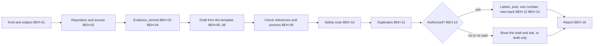

# SPEC-010 — GitHub post skill

## 1. Overview

The `github-post` skill ships in the `devforgeai` plugin and is invoked as
`/devforgeai:github-post [PR|Incident|Enhancement] [subject]`, or when a user asks to file an
issue or write a pull request description. It writes one GitHub post of the chosen kind that a
reader with none of the author's context can act on, checks it, and posts it with `gh` when the
user has authorized that.

It codifies the workflow used to write issue #19 on 2026-09-29:
- pin every reference to one commit, a file and a line, and quote the exact text;
- rebuild run evidence (session IDs, versions, fixture, request, answers, a timeline) from its record;
- keep facts, proposals and the owner's decisions in separate sections, with the decision's status stated;
- give the implementer preconditions, exact old and new text, verification commands with their
  expected output, acceptance criteria and what is out of scope;
- check that each quoted anchor occurs exactly once, and scan for local paths and personal data;
- post, write the new post's own number into its body, and view it back.

The skill is recorded as `SKL-009` in its `provenance.yaml`. SKL-008 is reserved by SPEC-009.

## 2. Constraints

- **PRD-001 NFR-001 to NFR-003**, as for the other skills: a short `SKILL.md` with detail in
  `references/`, spec-only frontmatter with provenance in the sidecar, and behaviour proven by the
  eval suite in §9.
- **ADR-001 v4:** built in a worktree from `src/`, deployed with rsync, evaluated from a plain terminal.
- **SPEC-007 (the git skill, draft):** git operations belong to the git skill. This skill never
  commits, pushes, merges, creates branches or runs documents-updater. It creates a pull request
  only from a branch already on the remote, as SPEC-007's pr phase also does; §12 records that
  overlap. Its outward-action rule (BEH-13) follows SPEC-007 BEH-04: an action is authorized when
  the request names it or the user confirms it in the run.
- **GitHub:** posting uses the `gh` CLI. Whatever is posted to a public repository is published,
  and may be cached or indexed even if deleted later.

## 3. Architecture and components

```
src/claude/DevForgeAI/
├── skills/github-post/
│   ├── SKILL.md                     # checklist, user decisions, output contract
│   ├── provenance.yaml              # SKL-009, implements SPEC-010
│   ├── assets/
│   │   ├── pr.md                    # moved from src/templates/github/ at build time
│   │   ├── incident.md
│   │   └── enhancement.md
│   ├── references/
│   │   ├── fidelity.md              # claims, sources, facts vs proposals vs decisions, cold-reader rules (BEH-03, BEH-05..07)
│   │   ├── evidence.md              # pinning revisions, quoting, run evidence and timelines (BEH-03, BEH-04)
│   │   └── posting.md               # PR mode, duplicates, labels, authorization, posting, reporting (BEH-08, BEH-11..14, BEH-16)
│   └── scripts/check_post.py        # read-only: references, anchors and the safety scan (BEH-09, BEH-10)
└── evals/github-post/<case>/        # one case per automated VER item (§9)
src/tests/github-post/               # unit tests for check_post.py (VER-08) and the eval generator; not deployed
```



## 4. Data model

**Kinds** (the first word of `$ARGUMENTS`, matched case-insensitively):

| Kind | Template | Required sections |
|---|---|---|
| `pr` | `assets/pr.md` | Summary; Changes; Implements and references; Checks run; Not verified and limitations; Revision; the attribution line |
| `incident` | `assets/incident.md` | Summary; Where the gap is; Evidence; Why it matters; Decision required; Implementation; Verification; Acceptance criteria; Out of scope; References |
| `enhancement` | `assets/enhancement.md` | Summary; Current behaviour; Motivation; Proposed behaviour; Decision required; Implementation; Verification; Acceptance criteria; Out of scope; References |

**Claims and sources.** Every factual sentence in a post has a source the reader can check:
- a file and line at a named commit;
- a document's version and SHA-256 at that commit;
- a command with its output;
- a run or session ID, with where its record is;
- a URL, or who said it, when and where.

A statement without one is a proposal (labelled "Proposed") or an unknown ("Unknown: <what is
missing>").

**The decision block** (incident and enhancement):
- a status, `pending` or `decided`; `decided` names who decided, when and where;
- one row per option, each with its consequence, and at most one labelled "(proposed)";
- the rule that implementation covers only the proposed option, and that another option means
  stopping to ask for new steps.

**The post's own number.** Until the post exists it has no number, so the draft writes a
reference to itself as `#{{self}}`. BEH-14 replaces it after the post is created.

**The draft** lives in the system temp folder, as the file passed to `--body-file`. It is never
written into the repository.

## 5. Interfaces and contracts

```yaml
# Proposed SKILL.md frontmatter (validated by src/schemas/skill-frontmatter.schema.json)
name: github-post
description: Writes and posts a GitHub pull request description, incident or enhancement that a reader with no context can act on. Every claim is pinned to a commit, file and line or to a recorded run, quotes are checked, facts are kept apart from proposals and the owner's decisions, and incidents and enhancements give the implementer exact steps, verification and acceptance criteria. Use when the user asks to file, open, post or write up a GitHub issue, bug, incident, enhancement or feature request, or to write, post or update a pull request's description, even when they don't name the skill. Not for committing, pushing or merging (use /devforgeai:git), or for GitHub questions that post nothing.
argument-hint: "[PR|Incident|Enhancement] [subject]"
metadata:
  devforgeai-id: "SKL-009"
  devforgeai-version: "<SKL-009's provenance.yaml version, quoted>"
```

- **The name must be exactly `github-post`.** The skill is model-invocable.
- **The version isn't fixed here.** `metadata.devforgeai-version` must equal `provenance.yaml`'s
  `version`.
- **Arguments:** the kind (`PR`, `Incident` or `Enhancement`, in any case), then an optional subject
  in free text.
- **Tools:**
  - Read, Glob and Grep;
  - Bash for read-only `git` (`rev-parse`, `show`, `log`, `ls-remote`, `status --porcelain`,
    `diff --cached`), for `gh` (`repo view`, `auth status`, `issue list`, `issue create`,
    `issue edit`, `issue view`, `pr list`, `pr create`, `pr edit`, `pr view`, `label list`,
    `label create`), and for `python3` with `scripts/check_post.py`;
  - AskUserQuestion for the user's decisions, or plain text ending the turn when it isn't available.
- **Output:** the posted URL, or the full draft with the exact `gh` command that would post it.

## 6. Behavior

```yaml items
behaviors:
  - id: BEH-01
    status: active
    rule: "Take the kind from the first word of $ARGUMENTS: pr, incident or enhancement, in any case; the rest is the subject. When the kind is missing, ask which of the three, and write nothing until the answer arrives. When the request states the kind in words (file a bug, write up an enhancement, write the PR description), that is the kind."
  - id: BEH-02
    status: active
    rule: "Resolve the target repository from the origin remote with gh repo view --json nameWithOwner,visibility,defaultBranchRef, and check gh auth status. Record the visibility, because BEH-10 blocks more on a public repository. When there is no GitHub remote, gh is signed out or the network can't be reached, continue in draft-only mode (ERR-02)."
  - id: BEH-03
    status: active
    rule: "Pin every reference to one commit: record its full SHA (git rev-parse), cite files as path and line at that commit, and cite a versioned document by its version, status and SHA-256 at that commit. Never present uncommitted content as fact about the repository; when the draft relies on the working tree, say so and name the files."
  - id: BEH-04
    status: active
    rule: "Gather evidence read-only: Read, Grep, git show, git log, gh issue view and gh pr view. Quote the text a claim rests on exactly. For a run, cite its session or run ID, tool and model versions, the build or plugin revision and how it was loaded, the fixture, the exact request and answers, and a timeline in UTC rebuilt from the transcript or log. Evidence that exists only on one machine is marked local, cited with a ~ path rather than an absolute home path, and anything since overwritten is named."
  - id: BEH-05
    status: active
    rule: "Write every factual sentence with a source from §4, and keep facts, proposals and decisions in separate sections. Label each proposal Proposed. Write nothing aspirational: no future benefit, saving, effort or certainty without a cited basis. State an unknown as Unknown: <what is missing> instead of guessing."
  - id: BEH-06
    status: active
    rule: "In an incident or enhancement, put every choice that belongs to the owner in the decision block (§4): status pending unless the owner decided it in this conversation or in a cited record, in which case decided, naming who, when and where. Give each option its consequence, label at most one (proposed) and only when the evidence supports it, and make the implementation cover the proposed option only, with the instruction to stop and ask when another option is chosen."
  - id: BEH-07
    status: active
    rule: "Write an incident or enhancement for a reader with none of the author's context: name the repository's instruction files to read first; list preconditions and what to do when one doesn't hold; give each edit's file, the exact text to replace and the exact new text (or a new file's exact content); say which files are not changed; give each verification command with where to run it and its expected output; leave anything that costs money or time to the owner's decision, with its cost; end with an acceptance checklist, what is out of scope and the references, including which tool and session wrote the post."
  - id: BEH-08
    status: active
    rule: "For a pr: the branch must exist on the remote (git ls-remote --heads origin <branch>), otherwise stop with ERR-03. Look for an open PR from it (gh pr list --head <branch> --state open). With none, create it with gh pr create --base <default branch> --head <branch> --title <title in the repository's commit convention> --body-file <draft>, as a draft PR when a required check failed or wasn't run. With one, update its title and body with gh pr edit. List only checks actually run in this session or recorded elsewhere with a cited location, each with its result. Run no document-ID collision check: when this skill creates the PR, its limitations say 'Document-ID collision not checked; /devforgeai:git pr runs that check.' Never commit, push, merge, change a PR's draft state after creation, or run documents-updater."
  - id: BEH-09
    status: active
    rule: "Before posting, run python3 ${CLAUDE_SKILL_DIR}/scripts/check_post.py on the draft. It checks that each cited path and line exists at the cited commit (git show <sha>:<path>), and that each text the implementation says to replace occurs exactly once in its file at that commit, comparing with whitespace normalized and reporting an anchor wrapped across lines so the draft can say so. Fix the draft or remove the claim until the check passes; never post while it fails (ERR-04)."
  - id: BEH-10
    status: active
    rule: "Scan the draft before posting, with the same script: absolute home paths (/home/<user>, /Users/<user>, C:\\Users\\<user>), email addresses, token and secret patterns, and transcript excerpts longer than a short quote. Rewrite home paths as ~ or repository-relative paths. On a public repository any remaining hit blocks posting until it is removed (ERR-05); on a private one, ask. Report each hit by its line in the draft, never by repeating the text."
  - id: BEH-11
    status: active
    rule: "Before creating an issue or PR, search the open ones for the same subject (gh issue list --search and gh pr list --search, with the subject's key terms). When a candidate exists, list it and ask whether to create a new post, comment on the existing one, or stop. With no user, create nothing."
  - id: BEH-12
    status: active
    rule: "Label an incident bug and an enhancement enhancement; a PR gets no label. When the label doesn't exist (gh label list), create it with gh label create, using GitHub's default colour and description for that name, as part of the authorized post (BEH-13), and report that it was created. Never create any other label."
  - id: BEH-13
    status: active
    rule: "Posting is outward-facing. Creating or editing an issue or PR, and creating a label for it, is authorized when the request names the action (post an incident about X, open the PR, update the PR description) or when the user confirms it in this run after seeing the draft; the authorization covers this run only. Otherwise show the full draft in the reply (kind, title, labels, target repository, body) and ask whether to post it. When no answer can arrive, post nothing and give the exact gh command that would post it."
  - id: BEH-14
    status: active
    rule: "Post with --body-file, never with the body inline. After creation, replace each #{{self}} in the body with the new number through gh issue edit or gh pr edit, then view the post back (gh issue view or gh pr view --json title,state,labels,body) and confirm the title, the labels and that no #{{self}} or {{ placeholder remains."
  - id: BEH-15
    status: active
    rule: "Write nothing into the repository: no file edits, commits, pushes or branches. The draft lives in the system temp folder."
  - id: BEH-16
    status: active
    rule: "Report, in order: the URL, or 'not posted' with the reason and the exact gh command; the kind and title; the labels, naming any created; each check with its result (references and anchors, safety scan, duplicate search); the decision status; and anything pending, such as a failed edit (ERR-07). When nothing was posted, the reply also contains the full draft."
```

## 7. Errors and edge cases

```yaml items
errors:
  - id: ERR-01
    status: active
    condition: "The kind is not pr, incident or enhancement"
    handling: "Say so, list the three kinds, ask which one, and write nothing"
    user_result: "The three kinds and a question"
  - id: ERR-02
    status: active
    condition: "There is no GitHub remote, gh is signed out, or the network can't be reached"
    handling: "Continue in draft-only mode: every check still runs, nothing is posted, and the reply gives the draft and the exact gh command, plus gh auth login when gh is signed out"
    user_result: "The full draft, the reason it wasn't posted and the command to post it"
  - id: ERR-03
    status: active
    condition: "For a pr, the branch isn't on the remote"
    handling: "Post nothing. Say that the branch must be pushed first, with /devforgeai:git push or git push, and offer the draft body"
    user_result: "The reason, the next step and the draft"
  - id: ERR-04
    status: active
    condition: "The reference or anchor check still fails after the draft is fixed, for example when the cited text has changed at the cited commit"
    handling: "Post nothing. List each failing reference or anchor with the reason, and keep the draft"
    user_result: "The failures and the draft"
  - id: ERR-05
    status: active
    condition: "The safety scan still finds a home path, email address, secret or long transcript excerpt on a public repository"
    handling: "Post nothing. List each hit by its line in the draft without repeating it, and keep the draft"
    user_result: "The lines to fix and the draft"
  - id: ERR-06
    status: active
    condition: "The user declines to post, or no answer can arrive"
    handling: "Post nothing and keep the draft"
    user_result: "The draft and the command that would post it"
  - id: ERR-07
    status: active
    condition: "The post was created but a later step failed: filling in its own number, a label, or the view-back"
    handling: "Never delete the post. Report its URL and the exact command for each step still pending"
    user_result: "The URL and the pending commands"
  - id: ERR-08
    status: active
    condition: "The evidence doesn't support a required section, or the core claim has no evidence at all"
    handling: "Write the section as Unknown: <what is missing>. When the core claim has no evidence, ask before posting; with no user, post nothing"
    user_result: "A draft with its unknowns stated, and a question when the core claim is unsupported"
```

## 8. Non-functional design

```yaml items
quality_responses:
  - id: QR-01
    status: active
    response: "SKILL.md holds only the checklist, the user's decisions and the output contract; the fidelity, evidence and posting rules live in references/, and the templates in assets/"
    measured_by: "SKILL.md line count (at most 500) and description length (at most 1024 characters)"
    upstream:
      - {id: PRD-001, item: NFR-001, relation: satisfies, version: 10, hash: null}
  - id: QR-02
    status: active
    response: "Frontmatter limited to the fields in §5; provenance in provenance.yaml; metadata values quoted, with devforgeai-version equal to the provenance version"
    measured_by: "Reading against skill-frontmatter.schema.json and skill.schema.json, and comparing the two version values"
    upstream:
      - {id: PRD-001, item: NFR-002, relation: satisfies, version: 10, hash: null}
  - id: QR-03
    status: active
    response: "One eval case per automated VER item, tagged github-post and ver-NN, run against the no-plugin baseline"
    measured_by: "claude plugin eval --threshold 0.8 over 3 runs"
    upstream:
      - {id: PRD-001, item: NFR-003, relation: satisfies, version: 10, hash: null}
```

## 9. Verification

| Kind | Status |
|---|---|
| Version 1 | Draft, awaiting Bryan's approval; not built. The templates are staged in `src/templates/github/` |
| Structural: this spec against `spec.schema.json` | Passes (checked 2026-09-29) |
| Scope of the automated suite | Eval runs have no network, so every automated case runs in draft-only mode (ERR-02). The automated suite verifies drafting, the checks and refusals. **Posting (BEH-11 to BEH-14, ERR-07) is verified only by hand** (VER-09, VER-10), the same gap SPEC-007 has for pushes and merges |
| Risk to settle at build time | `check_post.py` reads `git show <sha>:<path>`, so VER-01's fixture must be a git repository with commits. The eval sandbox masks `.git/config.lock` in repositories a scaffold builds, where `git config`, `remote add` and `push -u` fail (CLAUDE.md, "Evaluating a skill"). Read-only `git show` and `git log` are expected to work there, but that is unverified. If they fail, the scaffold records the fixture's SHAs, and the check falls back to the working-tree file and says so |

```yaml items
verifications:
  - id: VER-01
    status: active
    obligation: "Incident draft: a fixture git repository with commits, holding a spec whose rule leaves a case unhandled and a run log showing it; the request names the kind and the gap, and there is no network. The reply holds the full draft with every incident section from §4; each cited path and line exists at a full commit SHA the draft names; each quote matches the fixture; the decision block's status is pending; no absolute home path appears; and the reply says nothing was posted, with the gh command. Eval case incident-draft: regex and llm on last_message."
    level: e2e
    covers:
      - BEH-01
      - BEH-03
      - BEH-04
      - BEH-05
      - BEH-06
      - BEH-07
      - BEH-09
      - BEH-15
      - BEH-16
      - ERR-02
  - id: VER-02
    status: active
    obligation: "Enhancement draft: a fixture repository and a request for a new capability, attributed to a named requester. The draft has every enhancement section; each proposal is labelled Proposed; the motivation cites who asked; no benefit, saving or effort estimate appears without a cited basis; and the decision status is pending. Eval case enhancement-draft: llm and regex on last_message."
    level: e2e
    covers:
      - BEH-01
      - BEH-05
      - BEH-06
      - BEH-07
  - id: VER-03
    status: active
    obligation: "PR on an unpushed branch: a fixture repository with a local bare origin (as the git skill's evals use) and a branch with commits that isn't on the remote. The skill posts nothing, says the branch must be pushed first and names /devforgeai:git push, and runs no git push. Eval case pr-branch-not-pushed: regex on last_message; the bare remote has no such branch afterwards."
    level: e2e
    covers:
      - BEH-08
      - ERR-03
  - id: VER-04
    status: active
    obligation: "Unknown kind: '/devforgeai:github-post Question about the roadmap' lists the three kinds, asks which one, and writes no draft. Eval case unknown-kind: regex and llm on last_message."
    level: e2e
    covers:
      - BEH-01
      - ERR-01
  - id: VER-05
    status: active
    obligation: "Not authorized: a request that asks for an enhancement write-up without asking to post it. With no user, the reply holds the full draft, asks whether to post it or says nothing was posted, and gives the gh command. Eval case not-authorized: llm on last_message."
    level: e2e
    covers:
      - BEH-13
      - BEH-16
      - ERR-06
  - id: VER-06
    status: active
    obligation: "Safety: the fixture's run log contains an absolute home path (/home/alex/...) and an email address. The draft cites the log with a ~ or repository-relative path, contains neither the home path nor the email address, and the reply doesn't repeat them. Eval case safety-scan: regex not_contains on last_message."
    level: e2e
    covers:
      - BEH-10
      - ERR-05
  - id: VER-07
    status: active
    obligation: "A request such as 'explain how GitHub issue templates work' does not invoke the skill. Eval case ignores-unrelated-request: tool_used Skill min 0 max 0 arm both."
    level: e2e
    covers:
      - QR-02
      - QR-03
  - id: VER-08
    status: active
    obligation: "check_post.py unit tests: a path and line that exists at the commit passes and one that doesn't fails; an anchor found once passes, twice or never fails, and one wrapped across lines passes with the wrap reported; a home path, an email address and a token pattern are each reported by line without the text; a clean draft passes. Tests in src/tests/github-post/."
    level: unit
    covers:
      - BEH-09
      - BEH-10
      - ERR-04
  - id: VER-09
    status: active
    obligation: "Manual, on a GitHub test repository: post an incident with a missing bug label (the label is created and reported); #{{self}} is replaced with the new number and the view-back shows no placeholder; create a PR from a pushed branch and then update its body; a second incident on the same subject finds the first and asks; a simulated failure after creation (for example a revoked label permission) reports the URL and the pending command and deletes nothing; the repository's visibility is read and reported."
    level: manual
    covers:
      - BEH-02
      - BEH-08
      - BEH-11
      - BEH-12
      - BEH-14
      - ERR-07
  - id: VER-10
    status: active
    obligation: "Manual: a request that names the posting action posts after the checks pass; a request that doesn't shows the draft and asks, and posts only on a yes; an incident whose core claim has no evidence asks before posting and writes Unknown in the unsupported sections; SKILL.md is within the NFR-001 limits."
    level: manual
    covers:
      - BEH-13
      - ERR-08
      - QR-01
```

## 10. Rollout, migration and rollback

The skill is new; removing its directory rolls it back. It changes no document type or schema.
Building it bumps `plugin.json` and extends the plugin description, at Bryan's choice at build time.

## 11. Implementation plan

After Bryan approves this spec:

1. Create an ADR-001 worktree for the build.
2. Copy `src/templates/skill/` to `skills/github-post/`; write `SKILL.md` from §5–§7 and
   `provenance.yaml` as SKL-009 implementing SPEC-010.
3. `git mv src/templates/github/{pr,incident,enhancement}.md skills/github-post/assets/`, and update
   the templates README row.
4. Write `references/fidelity.md`, `references/evidence.md` and `references/posting.md`.
5. Write `scripts/check_post.py` (BEH-09, BEH-10) and its unit tests in `src/tests/github-post/`
   (VER-08). Settle the §9 risk first: check `git show` in a scaffold-built repository under
   `claude plugin eval`.
6. Write `src/tests/github-post/make_evals.py`, which generates the cases for VER-01 to VER-07 and
   checks their fixtures, and check the regex graders offline with good and bad replies.
7. Bump `plugin.json` and extend its description (Bryan's choice); add the CLAUDE.md and AGENTS.md
   rows.
8. Evaluate cheapest first (a pilot, one run, then three runs with the baseline), deploy, and run
   VER-09 and VER-10 by hand.

## 12. Alternatives considered

| Option | Why not chosen |
|---|---|
| Extend the git skill with incident and enhancement posting | Measured on 2026-09-29, the git skill is the plugin's largest: SKILL.md 274 lines, 20 behaviours, 5 references, 3 scripts and 16 eval cases, built from a draft SPEC-007 of 776 lines. Its description is 842 of 1,024 characters. Issue posting is a different concern (evidence, quote checks, decision blocks); adding it would push the description near the limit, blur when the skill triggers, and require re-evaluating all 16 cases. Bryan's rule was to choose this separate skill if extending the git skill would make it unstable (2026-09-29) |
| Call the git skill's `repo_state.py` for the document-ID collision check before creating a PR | Couples this skill to a script of a draft spec that could change. The PR's limitations say the check didn't run and point to `/devforgeai:git pr` instead (BEH-08) |
| GitHub issue forms only (`.github/ISSUE_TEMPLATE/`) | A web form can't pin evidence to a commit, check quotes or scan for local paths. Bryan chose the templates in `src/templates/` and this spec for now (2026-09-29) |
| One template for every kind | The kinds need different sections: a PR reports checks run and not verified; an incident needs evidence and a timeline; an enhancement needs the requester and the proposal |

## 13. Open questions

- [NEEDS CLARIFICATION: label mapping. BEH-12 labels an incident bug, the mapping in the option Bryan chose on 2026-09-29, with missing labels created. For a specification gap like issue #19, an incident label may fit better; confirm bug or name another label.]
- Not decided, and outside this spec: whether SPEC-007's pr phase adopts `assets/pr.md` for its PR bodies (a SPEC-007 change), and a Codex port of this skill.
- Resolved by Bryan on 2026-09-29:
  - PR mode creates from a pushed branch or updates the open PR, and never pushes (BEH-08);
  - posting follows BEH-13;
  - missing labels are created (BEH-12);
  - this change delivers the spec and the templates, and the skill is built after approval (§11).

## Change Log

| Version | Date | Author | Change | Items affected |
|---|---|---|---|---|
| 1 | 2026-09-29 | claude-code (session fdbef416-eebb-4053-95ce-624a311d72d5) | Initial draft from Bryan's decisions of 2026-09-29: the workflow used for issue #19 as a skill, with PR mode that creates or updates but never pushes, posting when the request names it, labels created when missing, and the templates staged in src/templates/github/. The label mapping (§13) awaits confirmation. Awaiting Bryan's approval | all |
