# SPEC-011 — Context skill (MVP)

> **Approved by Bryan on 2026-09-30,** from his decisions of 2026-09-29 and 2026-09-30. It implements ADR-004 (accepted) with the
> templates and schema merged in PR #22, and cites ADR-005 (accepted). The shared-schema PR (#25) merged
> on 2026-09-30; the build still needs a story (§11).

## 1. Overview

The `context` skill ships in the `devforgeai` plugin and is invoked as `/devforgeai:context [document]`.
The story skill's missing-context handback already names that command (SPEC-009 ERR-04). The skill
writes and maintains a project's **context documents** (ADR-004): `docs/specs/context/index.md`, the core
documents, and one document per component kind the architecture uses. Story and spec work read them.

It builds each document from four sources, and says which one every statement comes from:
- **decisions** already made: accepted ADRs, applied policy settings and ARCH items, cited with a link;
- **conventions** the user confirms in a short interview;
- **observed practice** from read-only inspection of the paths the user names, with its source and date;
- **DevForgeAI rules**, which the framework fixes and the documents restate.

Four rules shape everything else:
- **It decides nothing.** A significant choice that nothing has decided becomes a `[NEEDS ADR: …]` marker
  and a handback to Architecture Definition (BEH-06). A convention exists only when the user confirmed it.
- **Only what a project needs.** The core documents always; a layer document only when an ARCH component
  has its kind (ADR-004 D2).
- **Bounded.** Every document stays within ADR-004 D4's limits, and readers open only what they need.
- **Approval is the user's.** The skill writes drafts. A document becomes `approved` only on the user's
  explicit words in the run, with a named approver.

The skill is recorded as `SKL-010` in its `provenance.yaml`. SKL-008 is reserved by SPEC-009 and SKL-009
by SPEC-010.

## 2. Constraints

- **PRD-001 NFR-001 to NFR-003:** a `SKILL.md` of at most 500 lines, spec-only frontmatter with provenance
  in the sidecar, and an eval suite (§9).
- **ADR-001:** built in a story's worktree from `src/`, deployed by the owner, evaluated from a plain
  terminal.
- **ADR-002:** the chain is brainstorm → prd ⇄ architecture → **context** → epic → story → spec
  (ADR-004 D5).
- **ADR-004 v2,** all of D1 to D8:
  - the statement kinds;
  - the file set, fixed names, IDs, location and item blocks;
  - the size limits and detail files;
  - ownership and approval;
  - freshness;
  - D7's pass rule, restated in `testing.md`;
  - the ambiguities log.
- **The templates and schema:** the templates are `src/templates/context/` (13 files) and the conventions
  `src/templates/README.md` §1.2, §1.3, §2.1, §2.4 and §2.5, all merged in PR #22. The schema is
  `src/schemas/context.schema.json`. The templates' author comments are rules this spec adopts. Where this
  spec is more specific, it governs.
- **ADR-005:** this skill resolves the six `testing.*` keys (D5), cites them in `testing.md` with
  `constrains` links (D4), and restates D1's methods only by name. D7 is restated in `testing.md`
  (template §2).
- **ADR-003 and SPEC-002 v3 §5:** policy is resolved with the shared `validate_policy.py`,
  `references/policy.md` and `defaults.md`, shipped byte-identical to the prd and architecture skills'
  copies (D-09).
- **SPEC-003 v4 (consumed):** ARCH components (CMP) with `kinds`, `deployment`, `responsibility` and
  `interacts_with`; DEC items; the ARCH's `system` and its `upstream` link to its PRD. BEH-05's
  inspection rule is reused (BEH-05 below).
- **SPEC-009 v2 (the reader):**
  - it opens `index.md` first, then only the documents for a story's kinds (BEH-04);
  - it decides greenfield from the active `holds: code` roots (§4, BEH-06);
  - it finds each component's test folder from the active `holds: tests` roots (VER-17);
  - it reads approved designs from `ui-mockups.md` (BEH-11) and records them in stories (BEH-12). This
    spec fixes the record's line form (§4); SPEC-009 BEH-12 doesn't fix one yet (§10);
  - its Definition of Done cites `testing.md` (BEH-13);
  - it hands back to this step when a document is missing (ERR-04).
- **Out of scope:**
  - writing or changing ADRs, the ARCH, a PRD, policy, epics, stories or specs;
  - writing new ambiguity-log entries (BEH-16 sets only the `resolution` of an entry it folds);
  - running, building or testing project code, and any git command;
  - calling `/design`;
  - deleting any file;
  - the architecture skill's handoff naming this step, which is a SPEC-003 change when this skill ships
    (ADR-004 D5, M14; §10).

## 3. Architecture and components

```
src/claude/DevForgeAI/skills/context/
├── SKILL.md                     # workflow checklist, user decisions, output contract
├── provenance.yaml              # SKL-010, implements SPEC-011
├── assets/                      # the 13 templates, moved from src/templates/context/ (§11)
├── references/
│   ├── documents.md             # the document set, sources, items, design records (§4)
│   ├── interview.md             # questions, order, batching and budget (BEH-07)
│   ├── inspection.md            # scope, what may be read, how observations are recorded (BEH-05)
│   ├── output-rules.md          # frontmatter, statements, edits, sizes, restore, self-check list
│   ├── policy.md                # shared, byte-identical with the prd and architecture skills
│   ├── defaults.md              # shared, byte-identical
│   └── schemas/                 # policy.schema.json and common.schema.json, unchanged copies of src/schemas/
└── scripts/validate_policy.py   # shared, byte-identical
src/claude/DevForgeAI/evals/context/<case>/   # one case per fixture and prompt (§9)
src/tests/context/                            # make_evals.py, grader checks, test_structure.py; not deployed
```



```mermaid
flowchart LR
    A[Argument BEH-01] --> R[Current ARCHs BEH-02]
    R --> P[Policy R1 to R5, testing BEH-03]
    P --> S[Document set BEH-04]
    S --> X[Existing documents, suspect links BEH-14, ambiguities BEH-16]
    X --> I[Inspection, named paths only BEH-05]
    I --> Q[Interview BEH-07 BEH-08]
    Q --> W[Write BEH-06 BEH-09 to BEH-13]
    W --> V[Validate BEH-18]
    V --> K[Approval, explicit only BEH-17]
    K --> H[Report and hand off BEH-19]
```

## 4. Data model

**Inputs.** All are read by contract, which isn't inspection. None is edited, except the context
documents this skill maintains and the `resolution` field BEH-16 sets:
- **The current ARCHs:** every `docs/specs/arch/ARCH-*.md` whose `status` is neither `superseded` nor
  `deprecated`. For each: its `system`, `owner`, `status` and `version`, the PRD its `upstream` names,
  its active CMP items (`name`, `kinds`, `responsibility`, `deployment`, `interacts_with`) and its DEC
  items.
- **The PRD each current ARCH links,** as it is on disk: only its ID, its `operating_context` (BEH-03),
  and the NFR items a convention cites. When its `version` isn't the one the ARCH links, the skill reports
  the ARCH's PRD link as stale (a finding, BEH-19), takes only the PRD's ID, treats the operating context
  as unknown unless the request gives it, and cites no NFR. It never reads an earlier version.
- **Accepted ADRs:** every `docs/specs/adr/ADR-*.md` with `status: accepted` and no `superseded_by`.
- **Policy:** `docs/specs/policy/POL-*.md`, through the script (BEH-03), and `.claude/devforgeai.local.md`.
- **Stories:** each `docs/specs/story/STORY-*.md`, for its section 3's approved-design lines (below) and
  its `upstream` links to CTX documents (BEH-13).
- **Specs:** each `docs/specs/spec/SPEC-*.md`, for its `upstream` links to CTX documents only (BEH-13).
- **Ambiguity logs:** `docs/specs/ambiguities/AMB-*.md`, for accepted entries (BEH-16).
- **Existing context documents:** first the list of every path under `docs/specs/context/`. Then each
  document with one of the 12 names, and each detail file its parent links, read in full at the start of
  the run; that start-of-run read is what BEH-18 and ERR-08 compare against. Any other path is reported
  (ERR-11) and never read.

**Outputs:**
- `docs/specs/context/<name>.md` for each document in the set, from `${CLAUDE_SKILL_DIR}/assets/<name>.md`;
- detail files `docs/specs/context/<name>/<topic>.md`, from `assets/detail.md`, only when a document
  would pass its line limit (BEH-09);
- the `resolution` field of each ambiguity entry BEH-16 folds.

**The document set** (ADR-004 D2):
- The core documents always: `index.md` (CTX-001), `architecture.md` (CTX-002), `tech-stack.md`
  (CTX-003), `source-tree.md` (CTX-004) and `testing.md` (CTX-005).
- One layer document for each kind that at least one active component of a current ARCH has:

  | Kind | Documents |
  |---|---|
  | `user-interface` | `front-end.md` (CTX-011) and `ui-mockups.md` (CTX-017) |
  | `service` | `middle-tier.md` (CTX-012) |
  | `platform` | `back-end.md` (CTX-013) |
  | `api` | `api.md` (CTX-014) |
  | `relational-store` | `rdbms.md` (CTX-015) |
  | `data-store` | `datastore.md` (CTX-016) |
  | `external` | none of its own: `architecture.md` and `tech-stack.md` name the component |

- A `[document]` argument limits the run to that document and `index.md` (BEH-01).

**What each document is built from.** A statement is written only from these sources.
Templates README §1.3 defines the labels.

| Document | Decision (cited) | Observed (inspection) | Convention (interview) | DevForgeAI rule |
|---|---|---|---|---|
| `index.md` | — | — | — | the loading rule (template) |
| `architecture.md` | the component table, one row per active CMP with its kinds, responsibility and deployment, each linked by its ARCH item; the ADRs that decide a cross-cutting rule | logging, configuration and error-handling practice in the named paths | error handling, logging, configuration, security basics | — |
| `tech-stack.md` | a technology an accepted ADR chose, an applied mandated-platform setting, or an active component's `deployment` that names it | manifests and lock files in the named paths: name and declared range | a technology or range the user states | the upgrade rule (template §2) |
| `source-tree.md` | an ADR that fixes a folder | folders directly inside the named paths | a layout the user confirms | — |
| `testing.md` | the resolved `testing.*` settings, each a POL setting or DevForgeAI's default (ADR-005 D2) | test configuration and the command a CI workflow runs, in the named paths | test levels per kind, naming pattern, fixtures, commands | the pass rule, investigating a failing test, and test naming (template §1, §2, §5) |
| layer documents | ADRs that decide a rule of that layer | practice in the named paths | each template section without a decision | — |
| `ui-mockups.md` | — | — | the design system's location | the approved-design table is **generated** from the stories' records (BEH-11) |

An active component's `deployment` that names a technology makes a `tech-stack.md` item with basis
`decision`, citing that CMP item: ADR-004 D2 lists each technology in use. The example set's
`tech-stack.md` records pipx, which ARCH-001's deployments name, this way, as TEC-06 (§10).

When a section has neither a decision, an observation nor an answer, the skill writes a **Proposed**
statement: its own suggestion, marked `[NEEDS CLARIFICATION: confirm …]`. When it has no suggestion, it
writes only the marker.

**Technology items** (`tech-stack.md`):
- **`name`:** the technology as its source names it. A technology is third-party software the components
  are built with or run on; the project's own packages are not technologies.
- **`version_range`:** the versions the source allows, always quoted. A range the source writes, and an
  exact version (three parts, or a pin such as `==0.12.3`), is copied as written. A bare version with one
  or two parts, `V`, names a release line and is written `V.x` (ADR-001's "Python 3.12" gives `"3.12.x"`,
  ADR-002's "SQLite 3" gives `"3.x"`); §13 lists this reading. With no version, it is `"unpinned"`.
- **`used_by`:** the components the source or the user names. Otherwise, the active components whose
  `deployment` or `responsibility` names the technology. Otherwise, every active component that isn't
  `external`.
- **`basis`:** one of:
  - `decision`, with a `constrains` link on the item to the ADR, to the setting
    (`{id: POL-NNN, item: SET-NN, …}`), or to each CMP item whose deployment names it;
  - `convention`;
  - `observed`, with `observed_in` and `observed_on`;
  - `proposed`, with a marker in `notes`.

**Root items** (`source-tree.md`):
- **Observed:** each folder listed directly inside a named path (BEH-05), not the named path itself.
- **`holds`:**
  - `tests` when the path's first segment is `tests` or `test`;
  - `docs` for `docs/`, `config` for `config/`, and `generated` for `build/`, `dist/`, `out/` and
    `target/`;
  - `fixtures` when the last segment is `fixtures`;
  - otherwise `code`.
- **`component`:** the component the user names for the folder. Otherwise, the active component whose
  slug, or the last word of its slug, equals the folder's last segment (`shiftlog CLI` has the slug
  `shiftlog-cli`, which matches `cli/`). Otherwise `null`.
- **The slug** of a component is its `name` in lowercase, with each run of characters other than `a`–`z`
  and `0`–`9` replaced by `-`, and leading and trailing `-` removed.
- **Proposed roots:** for each active component that isn't `external` and has no code root (observed,
  confirmed or decided), `source-tree.md` proposes `src/<slug>/` (`holds: code`). For each such component
  with no tests root, it proposes `tests/<slug>/` (`holds: tests`). Both are `basis: proposed` with
  `[NEEDS CLARIFICATION: confirm this folder]`, so story's greenfield check has roots to list (SPEC-009 §4).
  They stay proposals until the user confirms them.

**Approved-design records.** SPEC-009 BEH-12 adds a record to a story's section 3. This skill reads two line
forms there. An export path lies under `docs/specs/story/design/STORY-NNN/` and ends in `.png` or `.pdf`.
- **The fixed form**, for SPEC-009 v3 to adopt (§10):

  `- **Approved design:** <screen or flow>; <export path>[, <export path>…]; approved <YYYY-MM-DD>; bundle <link or none>`

- **The form SPEC-009 BEH-12 allows today:** any other line that names one or more export paths, the
  word `approved` and exactly one date `YYYY-MM-DD`. Its row takes those paths and that date, the first
  `https://` link on the line as the bundle (or none), and `(not recorded)` as the screen or flow, which
  such a line doesn't give.

Each line is tried against the fixed form first. A line that starts `- **Approved design:**` but doesn't
parse in the fixed form is reported, never read as today's form. A section-3 line that names a path under
`docs/specs/story/design/` and fits neither form is reported and indexed nowhere (BEH-11).

**Frontmatter of a document this skill writes:**
- **`title`:** the template's example with `<project>` replaced by the `system` of the first current ARCH,
  in ARCH ID order (`"shiftlog: tech stack"`). **`document`:** the document's name.
- **`owner`:** the owner of the first current ARCH, in ARCH ID order. The user may name another.
- **`authors`:** the owner and `"claude-code"`.
- **`generated_by`:** `tool: "claude-code"`, the current model ID, and `session: "${CLAUDE_SESSION_ID}"`.
- **`reviewed_by`:** `[]`. **`approved_by`:** `""` and **`approved_on`:** `null` until BEH-17.
- **`supersedes`:** `[]`, **`superseded_by`:** `null`, **`blocked_by`:** `[]`.
- **`upstream`:**
  - a `constrains` link to each current ARCH at its version. `architecture.md` has one per CMP item
    instead (template);
  - a `constrains` link to each source a prose Decision cites;
  - for `testing.md`, a `constrains` link to each applied testing setting (ADR-005 D4);
  - an `informed_by` link to each applied setting that governs how the document is produced:
    `interview.max_calls` and `quality.required_categories` (policy.md R5).

  An item's own decision link stays on the item, and so does an applied mandated platform's (R5).
- **`freshness_days`:** `90` for a new document, unless the user gives another number (BEH-07). An existing
  document keeps its value. The index has none.
- **Every `hash`:** `null`.

**Lifecycle** (templates README §2.5):
- A new document is version 1, `draft`.
- A write that changes a document's text or items is a **revision** (BEH-13).
- A review that changes nothing but a link's version is a **relink** (BEH-14).
- Only the user moves a document to `approved` (BEH-17), and to `deprecated` (BEH-04).

**The operating context** (policy.md R3) comes from the request. Otherwise, it comes from the
`operating_context` of the PRDs the current ARCHs link, when they all record the same value. Otherwise it
is unknown. The skill doesn't ask for it. Context documents have no `operating_context` field, so it
appears only on the resolution line.

**The resolution line.** Each document written or revised in a run gets one Change Log row. The row's
text ends with the run's `Policy resolution:` line (ADR-003 A5). A relink row (BEH-14) and an approval
row (BEH-17) carry none, because nothing is resolved in them. The line holds:
- entries 1 to 6 as `references/policy.md` gives them: the interview budget, mandated platforms, required
  categories, then any "not applicable", unknown-context and "ignored" entries;
- then the six testing entries, `policy.md`'s entry 7, in `defaults.md`'s order (ADR-005 D2) and the
  formats of ADR-005 D4.

## 5. Interfaces and contracts

```yaml
# Proposed SKILL.md frontmatter (validated by src/schemas/skill-frontmatter.schema.json)
name: context
description: Writes and maintains a DevForgeAI project's context documents (index, architecture overview, tech stack, source tree, testing, and one document per component kind in the architecture) from accepted ADRs, approved policy, the architecture description, the user's confirmed conventions and read-only inspection of paths the user names. It cites every decision, labels observed practice, proposes nothing as settled, and hands significant choices back to Architecture Definition. Use after Architecture Definition and before epics and stories, when the story step reports missing context, or when the architecture, ADRs or policy changed.
argument-hint: "[document]"
metadata:
  devforgeai-id: "SKL-010"
  devforgeai-version: "<SKL-010's provenance.yaml version, quoted>"
```

- **The name must be exactly `context`.** The story skill's ERR-04 names `/devforgeai:context`.
- **The version isn't fixed here.** `metadata.devforgeai-version` must equal `provenance.yaml`'s
  `version`.
- **Arguments:** `$ARGUMENTS` is empty, or one document name from §4's set (`tech-stack`, `testing`,
  `rdbms` and so on), with or without `.md`. When it is empty, a request to update only one named
  document sets the same scope (BEH-01). Nothing else is accepted (ERR-04).
- **Tools:**
  - **reading:** Read, plus Glob and Grep when available. Otherwise use `ls`, `find`, `grep`, `cat` and
    `head` with explicit paths: on the inputs of §4, and on the inspection scope (BEH-05);
  - **writing:** Write only for a new document or detail file. Every change to an existing context
    document, and to the `resolution` field of an ambiguity entry, is an Edit. The run's Edit calls, with
    their old and new text, are what ERR-08 undoes;
  - **Bash:** only `python3 ${CLAUDE_SKILL_DIR}/scripts/validate_policy.py docs/specs/policy` and the
    read-only commands above;
  - **AskUserQuestion:** at most 4 questions per call, 2–4 options each, with the recommended option
    first and marked "(Recommended)". When it isn't available, ask in plain text and end the turn.
- **"Proceed without questions":** a request that says to proceed without questions, or not to ask
  anything, means no question is asked in the run.
- **The documents:** they follow `context.schema.json`, the templates and the templates README.
  `output-rules.md` restates the rules and ends with the self-check list (BEH-18).
- **Downstream contract** (read by story and spec):
  - `index.md` lists every document of the set with its ID, version, kinds and purpose;
  - `tech-stack.md`'s items, where only an active `decision` or `convention` item's `version_range` is
    an allowed range (ADR-004 D8);
  - `source-tree.md`'s items: the active `holds: code` roots, which story's greenfield check reads, and
    each component's active `holds: tests` roots;
  - `testing.md`'s pass rule, investigating rule, policy table, test levels and "Running the tests"
    commands. ADR-005 defines required tests by that section;
  - `ui-mockups.md`'s generated table of approved designs;
  - each document's `status`: a reader's work that relies on a draft document is a proposal (ADR-004 D5).

  Readers cite documents by ID and version, never `index.md` (BEH-12).

## 6. Behavior

```yaml items
behaviors:
  - id: BEH-01
    status: active
    rule: "Take the scope of the run from $ARGUMENTS; when it is empty, from a request that asks to update only one named document. No argument and no such request: a full run over the whole document set (§4). One document name from the set, with or without .md: only that document and index.md are written; the other documents are read but never written. A non-empty $ARGUMENTS that isn't a document name of the set, or a request to update only a document outside the set: ERR-04. Never take a file path."
  - id: BEH-02
    status: active
    rule: "Read every current ARCH (§4). With none, stop with ERR-01. When a current ARCH is draft or in-review, continue, and say in the report and in each written document's Change Log row that the documents are proposals because the architecture isn't approved. Read the active components of every current ARCH together; a component that appears in two ARCHs is listed once per ARCH."
  - id: BEH-03
    status: active
    rule: "Resolve policy before any question, applying R1 to R5 of references/policy.md. Validate with python3 ${CLAUDE_SKILL_DIR}/scripts/validate_policy.py docs/specs/policy when docs/specs/policy/ holds a POL-*.md, and act on its exit code: 0 continue; 1 stop with ERR-02; 2 or not runnable, stop with ERR-03 when any policy document is approved, otherwise use the framework defaults. Resolve interview.max_calls with the local preference file, architecture.mandated_platforms, quality.required_categories with the operating context of §4, and the six testing.* keys (ADR-005 D4). Record the links as R5 and ADR-005 D4 say and the resolution line as §4 says. Never validate policy by reading the documents instead."
  - id: BEH-04
    status: active
    rule: "Compute the document set (§4) from the kinds of the active components of every current ARCH. When a component has no kinds, ERR-05 applies. When an existing layer document's kind no longer appears in any current ARCH or in an ERR-05 answer of this run, report it and ask whether to deprecate it. On yes, it is a revision (BEH-13): set status deprecated, add the Change Log row 'Deprecated: <kind> is in no current ARCH', and index.md drops its row. With no answer, change nothing. A layer document whose Change Log says its kind came from an ERR-05 answer isn't reported while that component still has no kinds. Never delete a file."
  - id: BEH-05
    status: active
    rule: "Inspect only the paths the user names, in the request or in answer to BEH-07's scope question; with none, inspect nothing. Inspection is read-only: every path read, listed or searched is inside that scope, with Read, Glob and Grep when available, otherwise ls, find, grep, cat and head with explicit paths inside the scope, with no redirection, no writes, and no running or building of project code; never list or search the whole repository. The inputs of §4 are outside this rule. Read, within the scope: dependency manifests and lock files (for example package.json, pyproject.toml, requirements*.txt, go.mod, Cargo.toml, *.csproj, pom.xml, build.gradle*, Gemfile, composer.json), test configuration, CI workflow files, and the folders directly inside each named path, which become root items as §4 says. Record each fact as observed with the path read and today's date: observed_in and observed_on on an item, or (<path>, YYYY-MM-DD) in a prose statement. Following an import or reference outside the scope is ERR-06."
  - id: BEH-06
    status: active
    rule: "Cite every decision a statement rests on: an accepted ADR as ADR-NNN, an applied POL setting as POL-NNN#SET-NN, an ARCH item as ARCH-NNN#CMP-NN or ARCH-NNN#DEC-NN, each with one constrains link at that document's version (on the item for technologies and roots, in frontmatter otherwise). Never restate a decision without citing it, never write a decision's outcome as a convention, and never cite a proposed, rejected or superseded ADR. ADR-004 D1's test decides whether a choice is significant: hard to reverse, or shared by several epics. These choices always meet it: a programming language or runtime, a datastore engine, a hosting or deployment platform, the transport between components (a message broker or queue included) or their interface style, and a component boundary. Any other choice meets it when the user says so: every question about a choice offers 'This needs an architecture decision (ADR)' (BEH-07, BEH-08), and a choice the user confirms as a convention, in an answer or in the request, is judged not significant by the owner. A significant choice is decided only by an accepted ADR, an applied mandated-platform setting, or an active item of a current ARCH that states it (a DEC item, or a component's kinds, deployment, responsibility or interacts_with); a deployment that puts two interacting components in the same package or process decides their transport as an in-process call; a field that calls the choice undecided, TBD or open decides nothing. When a section would state a significant choice that nothing decides, write [NEEDS ADR: <the decision>; affects <documents>] once, in that section (for a message broker or queue, back-end.md section 4, Jobs and queues), never as a convention, and apply ERR-07. Another document that mentions the choice names the document holding the marker instead of repeating it; architecture.md's component table quotes each deployment as the ARCH writes it."
  - id: BEH-07
    status: active
    rule: "Interview for what no decision covers, following references/interview.md. Every question counts toward interview.max_calls, the scope and freshness questions included. First, when the request names no inspection paths, ask once which paths may be read (answer: paths, or none). Then, documents in the index's order and each document's sections in the template's order, ask one question per section that has no decision and no convention; a convention already in an existing document counts as confirmed. Offer, in this order: at most two options derived from the tech stack and the observed facts, the recommended one first; 'Leave it as a proposal'; and 'This needs an architecture decision (ADR)' (BEH-06). That is 2 to 4 options per question, and the user may answer in their own words. Ask the freshness window once, only when a new document is written (default 90 days). Answers stated in the request count as answers. Use at most interview.max_calls calls of at most 4 questions each. When the budget runs out, or under 'proceed without questions' (§5), ask nothing more: each unasked section gets a Proposed statement with its marker (§4). Otherwise write nothing an unanswered question affects until the answer arrives."
  - id: BEH-08
    status: active
    rule: "An observed fact becomes a convention only when the user confirms it: ask, in BEH-07's batches, 'Observed <fact> (<path>) — keep it as the project's convention?' with the options keep, change, leave as observed, and this needs an architecture decision (ADR) (BEH-06); an answer stated in the request counts. On keep, write it as a Convention (an item keeps observed_in and observed_on as history and gets basis convention); on change, write the user's version as a Convention; otherwise it stays Observed. Approving a document never turns an observed statement into a convention."
  - id: BEH-09
    status: active
    rule: "Write a new document with Write from ${CLAUDE_SKILL_DIR}/assets/<name>.md: delete every author comment and fill it as §4 and the templates require: fixed name and ID, the frontmatter of §4, statements with their labels, tables of rules with a Basis column, items only where the template has them, no placeholder left. Change an existing document only with Edit, starting from its current text: change only the statements and items whose source changed or that the user changed in this run, keep every other line as it is, and never delete or renumber an item (a retired item gets status deprecated with its reason in notes). A document longer than 100 lines starts with a Contents list. When a document would pass 500 lines (100 for index.md), move sections into detail files from assets/detail.md: the last section before the Change Log first, repeating until the document is within its limit, and never the Contents, a section holding items, or the Change Log; each moved section is linked from the parent with one 'read when' line. A detail file stays within 500 lines, starts with a Contents list past 100 lines, never links another detail file and never holds items; when the items alone would pass the limit, apply ERR-12. Add one Change Log row per document written, authored claude-code (session ${CLAUDE_SESSION_ID}), naming what changed and ending with the resolution line (§4); relink and approval rows follow BEH-14 and BEH-17."
  - id: BEH-10
    status: active
    rule: "Write testing.md with the template's three DevForgeAI rules unchanged (the pass rule, investigating a failing test, test naming), the policy table with one row per testing key in ADR-005 D2's order showing the resolved value and its source (POL-NNN#SET-NN with its constrains link, or (default)), the test levels per kind with a Basis column, and the Running the tests table with a Basis column. Never set a testing value in testing.md: a value the user wants changed goes into a policy document, which this skill doesn't write; say so in the report."
  - id: BEH-11
    status: active
    rule: "Write ui-mockups.md's approved-design table only from the approved-design lines in stories' section 3, in either form §4 gives: one row per line, in story ID order, with the story ID, the screen or flow (or (not recorded)), the export paths, the approval date and the bundle link or none, copied as recorded, under the template's GENERATED line. Report each section-3 line that names a path under docs/specs/story/design/ and fits neither form, by story ID, and give it no row. With no record, the table keeps its header and no row. Never add a design no story records, and never link the stories from ui-mockups.md. A rebuild that changes no row changes neither the document nor its version."
  - id: BEH-12
    status: active
    rule: "Write index.md last in the run, with sections Documents, Loading and Change Log only: one Documents row per document of the set that exists after the run, in the template's order, with its ID, version, kinds and purpose (a deprecated document gets no row), and the loading rule. It stays within 100 lines. Readers cite the documents they use, never index.md, so an index revision affects no story or spec."
  - id: BEH-13
    status: active
    rule: "When the run changes the text or items of an existing document, it is a revision, whether the document is draft or approved: raise version by one, set updated to today, add a Change Log row, and, if the document was approved, set status to draft with approved_by and approved_on cleared, unless BEH-04 deprecates it, when status becomes deprecated instead. Then list, in the report, every story and spec whose upstream cites that document (an id: CTX-NNN link in docs/specs/story/ or docs/specs/spec/, read as §4 says), saying their work is now a proposal until the document is approved again (ADR-004 D5)."
  - id: BEH-14
    status: active
    rule: "Before writing, review the upstream links of each existing document the run may write (every document, or under BEH-01 only the named one and index.md): a link whose target document now has a higher version is suspect. Re-read the target and every statement that cites it. If no statement changes, it is a relink: set the link's version, add one Change Log row 'Re-reviewed against <ID> v<N>: no change' with no resolution line, and change neither the document's version nor its status. If a statement changes, it is a revision (BEH-13). New components or kinds in an ARCH are handled by BEH-04 and the writing steps."
  - id: BEH-15
    status: active
    rule: "Report each observed statement or item whose observed date is older than its document's freshness_days as a finding, with the document, the statement or item, and the date. It is never an error and never blocks approval; re-inspecting it needs the user to name the path again."
  - id: BEH-16
    status: active
    rule: "Fold accepted ambiguity entries: an entry counts when its state is accepted, its relates_to names the ID of an existing context document the run may write (BEH-14's scope), and its resolution is empty. The entry is already stated when its action stays within an active decision or convention item's version_range (in the ecosystem's own range syntax, where x stands for any number and unpinned allows every version), or repeats a statement the document already holds; then change nothing in the document for it. Otherwise fold it by what it changes: an action that names a path ending in / that no active root contains is a new folder; one that names a technology no item lists is a new technology; one that names another version of a listed technology is a version change; anything else is a narrative convention. A new folder becomes a new root item with the next free SRC ID, basis convention, and notes naming the entry. A new technology, or a version outside an item's range, can't be folded, because ADR-004 D8 sends those to the owner rather than the log: report the entry and leave it unfolded. Anything else becomes one Convention bullet, worded from the entry's question and action: in tech-stack.md, in section 2 (Upgrades); in any other document, in the section the entry's checked list names; when none is named, ask where it belongs, and with no answer leave the entry unfolded and report it. After the document passes BEH-18's check, set each folded entry's resolution to 'folded into CTX-NNN vN', or 'folded into CTX-NNN vN: already stated', with the document's version after this run. Set only the resolution field, with Edit. Never change any other field or entry, and never write a new entry."
  - id: BEH-17
    status: active
    rule: "After BEH-18's check passes, record approval only on the user's explicit words in this run that approve a named document, or all context documents: for example 'approve tech-stack.md'. Approve a document only when it passed the check and holds no [NEEDS CLARIFICATION: …] or [NEEDS ADR: …] marker and no active Proposed statement or item, its detail files included; otherwise say which markers remain and leave it draft. approved_by is the name the user gives for the approver; when none is given, ask who is approving, offering the document's owner first; when no answer can arrive, don't approve, and say the approver wasn't named. On approval, with Edit, set status approved, approved_by, approved_on to today, and add a Change Log row 'Approved' authored by the approver. Then check each approved document once more against the self-check list. If it fails, undo the approval's Edits in reverse order and read the document back: when it matches its content before the approval, report it as not approved, with the errors; otherwise report 'approval rollback failed' with the status, approved_by and approved_on the file now holds, and replace the handoff with ERR-08's validation-failure report. Never infer approval from silence, from an earlier run, or from a request to write the documents."
  - id: BEH-18
    status: active
    rule: "Read each written file back and check it by its kind, against the self-check list in references/output-rules.md. A context document: context.schema.json; the statement rules (every Decision's source has its constrains link; every Observed statement has a path and date; every Proposed statement has a marker; a DevForgeAI rule names no document ID); no item deleted or renumbered since the start-of-run read; the resolution line's entries and order (§4); the approval rules; unique item IDs; the line limits and Contents list. A detail file: the detail-file rules (the parent line, no frontmatter, no items, its line limit and Contents list). An edited ambiguity log: ambiguities.schema.json, with every field other than the folded resolutions equal to its start-of-run read. The first readback is check 1; repair each reported error and check again, at most three repair cycles. Record each check and repair in the reply. If errors remain, apply ERR-08."
  - id: BEH-19
    status: active
    rule: "When the run wrote or checked documents, open the final reply with this block, then briefly the findings (§4's stale PRD links, BEH-04, BEH-11, BEH-13, BEH-15, BEH-16, ERR-05, ERR-10, ERR-11, ERR-12), then the next step as its own paragraph outside any code block, starting with the words Next step, naming documents by name and PRDs by ID, with nothing after it. Block lines: 'Context documents: <name> (CTX-NNN v<N>, <status>; new | revised | relinked | unchanged), …'; 'Inspection: <each path read> | none (no paths named)'; 'Markers left: <name>: <count>, … | none'; 'Handed back to architecture: <each NEEDS ADR decision> | none'; 'Ambiguity entries folded: AMB-NNN#ENT-NN → CTX-NNN, … | none'; 'Policy resolution: <the resolution line's entries>'. A run that stops before writing (ERR-01 to ERR-04) has no block. Next step: when any document of the set holds a [NEEDS ADR] marker after the run, tell the user to run /devforgeai:architecture with the PRD ID of each current ARCH; otherwise, if ${CLAUDE_SKILL_DIR}/../epic/SKILL.md exists, tell the user to run /devforgeai:epic with each PRD ID; otherwise say the epic workflow isn't built yet. Never start another workflow."
  - id: BEH-20
    status: active
    rule: "Never modify a PRD, ARCH, ADR, policy document, epic, story or spec; never write an ADR or a policy setting; never run, build or test project code or run git; never call /design; never delete a file; never write a new ambiguity entry. Write only docs/specs/context/ and BEH-16's resolution field."
```

## 7. Errors and edge cases

```yaml items
errors:
  - id: ERR-01
    status: active
    condition: "No current ARCH exists in docs/specs/arch/"
    handling: "Write nothing. Say that the context documents need an architecture description, and tell the user to run /devforgeai:architecture with the PRD ID, naming the PRDs in docs/specs/prd/ when there are any"
    user_result: "A handback to the architecture step; nothing written"
  - id: ERR-02
    status: active
    condition: "An approved policy document is invalid: the script exits 1, or R2 finds an override its overridable_by doesn't allow"
    handling: "Before asking or writing anything, name each error the script printed (the policy file, the setting or frontmatter field, the field and the rule) and say nothing was written. Never fall back silently"
    user_result: "The policy errors to fix; nothing written"
  - id: ERR-03
    status: active
    condition: "The policy script can't run (exit 2, or python3 or jsonschema is missing) and docs/specs/policy/ holds an approved document"
    handling: "Stop before writing: say policy validation couldn't run, quote its message, and write nothing"
    user_result: "The reason; nothing written"
  - id: ERR-04
    status: active
    condition: "$ARGUMENTS is not empty and not the name of a document in the set, or the request asks to update only a document that isn't in the set"
    handling: "Write nothing. List the document names of the current set and ask which one, or whether to run for all"
    user_result: "The document names and a question"
  - id: ERR-05
    status: active
    condition: "An active component of a current ARCH has no kinds"
    handling: "Ask which kinds it has (user-interface, service, platform, api, relational-store, data-store, external). Use the answer for this run only; say in the report, and in the Change Log row of each layer document it adds, that the kinds came from the user's answer and that the ARCH should record them when next amended. With no answer, write the component's row in architecture.md with [NEEDS CLARIFICATION: kinds of ARCH-NNN#CMP-NN] in its Kinds column, write no layer document for it, and report it"
    user_result: "A question, or a marker and no layer document for that component"
  - id: ERR-06
    status: active
    condition: "Inspection would need a path outside the named scope"
    handling: "Ask before reading it. When the user declines or no answer can arrive, don't read it, and write the affected statement as [NEEDS CLARIFICATION: <path> is outside the inspection scope]"
    user_result: "A question, or a marker"
  - id: ERR-07
    status: active
    condition: "A section would state a significant choice that nothing decides (BEH-06)"
    handling: "Write the [NEEDS ADR] marker in the section, list the decision under 'Handed back to architecture', and make the next step the architecture step (BEH-19). Continue with the rest of the run"
    user_result: "The documents, with the decisions to take to Architecture Definition"
  - id: ERR-08
    status: active
    condition: "Validation still fails after three repair cycles, or an error can't be repaired"
    handling: "For each document that existed before the run and still fails, undo this run's Edits to it in reverse order, read it back and compare it with its start-of-run read: it is restored when they match, otherwise not restored, with the lines that differ; an inverse Edit whose text isn't found exactly once also leaves it not restored. Reset to empty the resolution of each entry folded into a restored document. Documents that pass keep their changes; new documents stay as draft, with their errors listed; index.md lists the documents as they are after the restore. Replace the block and next step with a validation-failure report: each file path, whether it was restored, kept or not restored, every check and repair, and each unresolved error. Never present a document as approved"
    user_result: "A validation-failure report; each failing pre-existing document restored or named as not restored"
  - id: ERR-09
    status: active
    condition: "The user stops before the interview ends"
    handling: "Offer to write the documents with every unanswered section as a Proposed statement or marker. With no answer to the offer, write nothing, and say how to resume: run the skill again"
    user_result: "Draft documents with markers, or nothing written"
  - id: ERR-10
    status: active
    condition: "An existing context document fails the self-check before the run changes it, for example after a hand edit"
    handling: "Report its errors. Rewrite it only when the user confirms in this run; the rewrite is a revision (BEH-13). With no confirmation, leave it unchanged and continue with the other documents"
    user_result: "The errors and a question, or the document left as it was"
  - id: ERR-11
    status: active
    condition: "The listing of docs/specs/context/ holds a path that is neither a document of the set, a deprecated document of an earlier set, nor a detail file its parent links"
    handling: "Report it as a finding by path, from the listing. Never read it, edit it or delete it"
    user_result: "The finding"
  - id: ERR-12
    status: active
    condition: "The technologies or roots items alone would put tech-stack.md or source-tree.md over 500 lines"
    handling: "Write nothing to that document. Say how many items there are and ask the owner how to proceed; the items never move into detail files. The other documents continue"
    user_result: "A question; that document not written"
```

## 8. Non-functional design

```yaml items
quality_responses:
  - id: QR-01
    status: active
    response: "SKILL.md holds only the checklist, the user's decisions and the output contract; the document rules, interview, inspection and output rules live in references/, the templates in assets/"
    measured_by: "src/tests/context/test_structure.py: SKILL.md line count (at most 500) and description length (at most 1024 characters)"
    upstream:
      - {id: PRD-001, item: NFR-001, relation: satisfies, version: 10, hash: null}
  - id: QR-02
    status: active
    response: "Frontmatter limited to the fields in §5; provenance in provenance.yaml; metadata values quoted, with devforgeai-version equal to the provenance version"
    measured_by: "src/tests/context/test_structure.py, against skill-frontmatter.schema.json and skill.schema.json, comparing the two version values"
    upstream:
      - {id: PRD-001, item: NFR-002, relation: satisfies, version: 10, hash: null}
  - id: QR-03
    status: active
    response: "Every automated VER item is graded in an eval case run against the no-plugin baseline. VER items that share a fixture and prompt share one case; each grader's name starts with the item it grades (ver01-, ver02-, …), and each case is tagged context and ver-NN for every item it grades"
    measured_by: "claude plugin eval --threshold 0.8 over 3 runs; and, for each VER item, the graders named for it pass at a rate of at least 0.8 over those runs, read from aggregate-result.json (cases[].arms.with[].graders[])"
    upstream:
      - {id: PRD-001, item: NFR-003, relation: satisfies, version: 10, hash: null}
```

## 9. Verification

| Kind | Status |
|---|---|
| Structural: this spec against `spec.schema.json` | Passes (checked 2026-09-30) |
| Behavioural: automated VER items | Not run: the skill isn't built |
| Structural test (VER-25) and manual VER items (VER-21, VER-22) | Not run |

**Fixtures.** `make_evals.py` builds every case from the example set merged in PR #22,
`src/staging/examples/context-cli-service-rdbms/docs/specs/`. It validates each seeded document against
`src/schemas/` with a format checker, except a document a case marks as expected to be invalid.
- **Shared fixture:**
  - ARCH-001: `system: shiftlog`, owner Example Owner, approved version 1, with a CLI (`user-interface`),
    a service and a relational store;
  - the example project's ADR-001 ("Use Python 3.12 for every component") and ADR-002 ("Store shifts in
    a local SQLite file");
  - a PRD-001 the generator writes at the version ARCH-001 links, with FR-001, FR-002, NFR-001 and
    `operating_context: internal`.

  There is no policy document, no `docs/specs/context/`, no story, no code and no ambiguity log.
- **Example project:** the shared fixture, plus the example set's nine context documents and their detail
  files as they are. `tech-stack.md` and `index.md` are version 2 and the others version 1 (§10);
  `source-tree.md` is draft and the others are approved. It also
  holds a STORY-001 the generator writes. The story's section 3 holds the approved-design line for the
  example `ui-mockups.md` row:
  ``- **Approved design:** `shiftlog list` output; docs/specs/story/design/STORY-001/list-output.png; approved 2026-09-29; bundle none``.
  Its `upstream` has a `constrains` link to CTX-003 version 2. AMB-001 is seeded only where a case says so.
- **Unchanged checks:** a case that checks a seeded file unchanged uses a regex grader matching the file's
  whole seeded content, escaped and anchored (`\A…\Z`), as the git suite's `readme-unchanged` does. That
  is untested at the size of an ARCH (about 130 lines). The pilot confirms it; if the harness rejects it,
  the generator uses one grader per frontmatter block and item block instead.
- **The shared prompt,** used unless a case gives its own:
  > Write the project context documents. I confirm these conventions: Typer 0.12.x for the shiftlog CLI;
  > Alembic 1.13.x for the Local database; pytest 8.x for every component; and dependency updates go in
  > their own pull request. None of these is hard to reverse or shared by several epics: each can be
  > replaced inside the components that use it. Don't inspect any code. Proceed without questions.

  It confirms everything `tech-stack.md` needs, so only that document can end without a marker. Every
  other section without a decision is Proposed. In the shared fixture every significant choice is decided
  by ADR-001, ADR-002 or ARCH-001: the CLI and the service share a package, so their transport is an
  in-process call. So only VER-07's fixture leads to a `[NEEDS ADR]` marker.
- **Case limits:** the generator sets `max_turns: 100` and `timeout_seconds: 1800` for a case that writes
  documents, and `15` and `300` for the negative case. The pilot run (§11) confirms them or raises them.

No story specifies this skill yet, so the VER items have no `upstream` link.

```yaml items
verifications:
  - id: VER-01
    status: active
    obligation: "Shared fixture and prompt. docs/specs/context/ holds exactly index.md, architecture.md, tech-stack.md, source-tree.md, testing.md, front-end.md, ui-mockups.md, middle-tier.md and rdbms.md; no back-end.md, api.md or datastore.md; each file's frontmatter pairs its document name with its fixed CTX ID; ARCH-001, ADR-001, ADR-002 and PRD-001 are unchanged (whole-content graders, §9). Eval case writes-the-set, graders ver01-: file_exists and regex on the files."
    level: e2e
    covers:
      - BEH-02
      - BEH-04
      - BEH-09
      - BEH-20
  - id: VER-02
    status: active
    obligation: "In writes-the-set, index.md has exactly the sections Documents, Loading and Change Log; one Documents row per other document with its CTX ID and version 1; the loading rule; and at most 100 lines, checked by a not_contains regex that matches a 101st line (\\A(?:[^\\n]*\\n){100}[^\\n]). Graders ver02-: regex on the file."
    level: e2e
    covers:
      - BEH-12
  - id: VER-03
    status: active
    obligation: "In writes-the-set, tech-stack.md has: a Python item with basis decision, version_range '3.12.x' and a constrains link to ADR-001 on the item; a SQLite item with basis decision, version_range '3.x' and a link to ADR-002; Typer '0.12.x', Alembic '1.13.x' and pytest '8.x' items with basis convention; and a pipx item with basis decision, version_range 'unpinned', used_by ARCH-001#CMP-01 and CMP-02, and a constrains link to each. rdbms.md has a Decision statement citing ADR-002, with a constrains link to ADR-002 in its frontmatter. architecture.md's frontmatter links each of ARCH-001#CMP-01 to CMP-03. No document holds a [NEEDS ADR marker. Graders ver03-: regex on the files."
    level: e2e
    covers:
      - BEH-06
  - id: VER-04
    status: active
    obligation: "Shared fixture; the prompt is 'Write the project context documents. Don't inspect any code. Proceed without questions.' Every document is draft; each template section without a decision holds a Proposed statement with a [NEEDS CLARIFICATION: confirm …] marker; no document contains **Convention:**; tech-stack.md has no item with basis convention; source-tree.md has basis proposed roots src/shiftlog-cli/, tests/shiftlog-cli/, src/shift-service/, tests/shift-service/, src/local-database/ and tests/local-database/. Eval case nothing-confirmed: regex on the files."
    level: e2e
    covers:
      - BEH-07
  - id: VER-05
    status: active
    obligation: "Shared fixture plus pyproject.toml declaring pytest>=8,<9 and typer==0.12.3, and the folders src/shiftlog/cli/ and tests/service/, each holding one .py file. The prompt: 'Write the project context documents. You may read pyproject.toml, src/shiftlog/ and tests/. Keep pytest as our convention. Proceed without questions.' tech-stack.md has a Typer item with basis observed, observed_in pyproject.toml and observed_on matching \\d{4}-\\d{2}-\\d{2}, and a pytest item with basis convention that keeps observed_in pyproject.toml; source-tree.md has observed roots src/shiftlog/cli/ with holds code and tests/service/ with holds tests, each with observed_in and observed_on; the reply's Inspection line names the three paths. Eval case observed-and-confirmed: regex on the files and last_message."
    level: e2e
    covers:
      - BEH-05
      - BEH-08
  - id: VER-06
    status: active
    obligation: "VER-05's fixture; the prompt is 'Write the project context documents. Proceed without questions.' No document holds observed_in or an Observed statement, and the reply's block has the line Inspection: none. Eval case no-scope-no-inspection: regex not_contains on the files and regex on last_message."
    level: e2e
    covers:
      - BEH-05
  - id: VER-07
    status: active
    obligation: "Shared fixture and prompt, plus a fourth component in ARCH-001: CMP-04 'Reminder worker', kinds [platform], deployment 'A background process; the message broker is undecided', with no ADR for it. back-end.md's section 4 (Jobs and queues) holds a [NEEDS ADR: …] marker naming the message broker; across all documents that is the only [NEEDS ADR marker; the reply lists it under Handed back to architecture; the last paragraph starts with Next step and names /devforgeai:architecture PRD-001. Eval case needs-adr-handback: regex on the files and last_message."
    level: e2e
    covers:
      - BEH-06
      - ERR-07
  - id: VER-08
    status: active
    obligation: "Shared fixture; the shared prompt followed by 'I'm Example Owner, and I approve tech-stack.md.' tech-stack.md has status approved, approved_by Example Owner, approved_on a date and a Change Log row Approved authored by Example Owner; every other document is draft. Eval case approve-on-explicit-words: regex on the files."
    level: e2e
    covers:
      - BEH-17
  - id: VER-09
    status: active
    obligation: "Example project; the prompt: 'Update the context documents: in tech-stack.md, add the convention that the lock file is committed with every dependency change. Proceed without questions.' tech-stack.md is version 3, status draft, approved_by empty, with that Convention in section 2 and a new Change Log row; the reply lists STORY-001 as a proposal until tech-stack.md is approved again; STORY-001 is unchanged (whole-content grader). Eval case revision-clears-approval: regex on the files and last_message."
    level: e2e
    covers:
      - BEH-13
  - id: VER-10
    status: active
    obligation: "Example project with ARCH-001 at version 2, approved, adding CMP-04 'Export API', kinds [api], deployment 'Runs in the shiftlog Python package'. The prompt: 'ARCH-001 changed; update the context documents. Proceed without questions.' api.md is written, version 1, draft; architecture.md is version 2 with a row for CMP-04; rdbms.md keeps version 1 and status approved, its ARCH-001 link is at version 2, and its Change Log has the row Re-reviewed against ARCH-001 v2: no change. Eval case suspect-review: file_exists and regex on the files."
    level: e2e
    covers:
      - BEH-14
      - BEH-04
  - id: VER-11
    status: active
    obligation: "Example project plus the example AMB-001 (ENT-01 accepted, Typer 0.12.5 within tech-stack.md's 0.12.x; ENT-02 open) with a third entry ENT-03: accepted, relates_to CTX-003, question 'Commit the lock file with this dependency change?', action 'Committed the lock file with the dependency change', checked 'docs/specs/context/tech-stack.md (CTX-003 v2), section 2'. The prompt: 'Update the context documents. Proceed without questions.' tech-stack.md is version 3 with a Convention in section 2 that mentions the lock file; ENT-03's resolution is 'folded into CTX-003 v3'; ENT-01's is 'folded into CTX-003 v3: already stated'; ENT-02 keeps state open and an empty resolution; and AMB-001 equals its seeded content except those two resolutions (a whole-content grader of the expected file). Eval case fold-accepted-entries: regex on the files."
    level: e2e
    covers:
      - BEH-16
  - id: VER-12
    status: active
    obligation: "The shared fixture without ARCH-001, and the shared prompt: nothing is written under docs/specs/context/, and the reply tells the user to run /devforgeai:architecture with PRD-001. Eval case no-arch-hands-back: file_exists false and regex on last_message."
    level: e2e
    covers:
      - ERR-01
  - id: VER-13
    status: active
    obligation: "Shared fixture and prompt, with ARCH-001's CMP-02 written without kinds. architecture.md's row for CMP-02 holds [NEEDS CLARIFICATION: kinds of ARCH-001#CMP-02]; no middle-tier.md is written. Eval case kinds-missing: regex and file_exists on the files."
    level: e2e
    covers:
      - ERR-05
  - id: VER-14
    status: active
    obligation: "Shared fixture and prompt, plus an approved POL-001 whose updated date is 2026-13-45, marked as expected to be invalid. Nothing is written under docs/specs/context/, and the reply names POL-001.md and the field updated. Eval case invalid-policy-stops: file_exists false and regex on last_message."
    level: e2e
    covers:
      - BEH-03
      - ERR-02
  - id: VER-15
    status: active
    obligation: "Shared fixture and prompt, plus an approved organization POL-001 whose SET-01 sets testing.coverage_threshold to 90. testing.md's policy table shows 90 from POL-001#SET-01 and every other testing key as (default), with tdd as the method; its frontmatter holds a constrains link to POL-001 item SET-01; the pass rule and the investigating rule are present as DevForgeAI rules; each written document's Change Log row ends with exactly 'Policy resolution: interview.max_calls=8 (default); architecture.mandated_platforms=none (default); quality.required_categories=floor only (default); testing.method=tdd (default); testing.coverage_metric=line (default); testing.coverage_threshold=90 (POL-001#SET-01); testing.coverage_scope=code roots (default); testing.coverage_exclusions=generated,tests,fixtures roots (default); testing.exception_approvers=story owner (default)'. Eval case testing-policy-cited: regex on the files."
    level: e2e
    covers:
      - BEH-10
      - BEH-03
  - id: VER-16
    status: active
    obligation: "Example project plus STORY-002, whose section 3 holds '- **Approved design:** `shiftlog add` prompt; docs/specs/story/design/STORY-002/add-prompt.png; approved 2026-09-30; bundle none', STORY-003, whose section 3 holds 'Design approved: docs/specs/story/design/STORY-003/edit.png (2026-09-30)' (today's form), and STORY-004, whose section 3 holds 'Design draft: docs/specs/story/design/STORY-004/edit.png, awaiting review' (neither form). The prompt: 'Update the context documents. Proceed without questions.' ui-mockups.md is version 2, and its approved-design table has three rows, STORY-001, STORY-002 and STORY-003, with their screens (STORY-003's is (not recorded)), paths, dates and none; no row names STORY-004; its frontmatter holds no STORY link; the reply reports STORY-004's line. Eval case designs-generated: regex on the file and last_message."
    level: e2e
    covers:
      - BEH-11
  - id: VER-17
    status: active
    obligation: "Example project; the prompt: 'Update only tech-stack.md: add the convention that the lock file is committed with every dependency change. Proceed without questions.' tech-stack.md is version 3 with that Convention in section 2; index.md's tech-stack.md row shows version 3; every context document other than tech-stack.md and index.md is unchanged (whole-content graders). Eval case one-document: regex on the files."
    level: e2e
    covers:
      - BEH-01
  - id: VER-18
    status: active
    obligation: "In writes-the-set, the reply opens with the report block, including the line Inspection: none, and its last paragraph, outside any code block, starts with Next step, names /devforgeai:epic PRD-001 and has nothing after it; the graders read the reply, never whether the epic skill exists. Graders ver18-: regex on last_message."
    level: e2e
    covers:
      - BEH-19
  - id: VER-19
    status: active
    obligation: "In writes-the-set, each document has the title §4 gives: 'shiftlog: project context index', 'shiftlog: architecture overview', 'shiftlog: tech stack', 'shiftlog: source tree', 'shiftlog: testing', 'shiftlog: front end', 'shiftlog: middle tier', 'shiftlog: relational database' and 'shiftlog: ui mockups'; generated_by tool claude-code with a model and a session that is a UUID (not the text ${CLAUDE_SESSION_ID}), reviewed_by empty, every hash null, status draft, approved_by empty, freshness_days 90 (none in index.md), and one Change Log row authored claude-code (session <that UUID>) ending with exactly 'Policy resolution: interview.max_calls=8 (default); architecture.mandated_platforms=none (default); quality.required_categories=floor only (default); testing.method=tdd (default); testing.coverage_metric=line (default); testing.coverage_threshold=none (default); testing.coverage_scope=code roots (default); testing.coverage_exclusions=generated,tests,fixtures roots (default); testing.exception_approvers=story owner (default)'. Graders ver19-: regex on the files."
    level: e2e
    covers:
      - BEH-09
  - id: VER-20
    status: active
    obligation: "A request such as 'give me some context on the French revolution' does not invoke the skill. Eval case ignores-unrelated-request: tool_used Skill min 0 max 0 arm both."
    level: e2e
    covers:
      - QR-03
  - id: VER-21
    status: active
    obligation: "Manual, interactive, one fixture copy per check: (a) questions come in batches of at most 4 with 2 to 4 options and the recommended option first, the scope and freshness questions count, and after interview.max_calls calls the remaining sections are Proposed with markers; (b) stopping mid-interview offers draft documents and writes nothing without an answer; (c) reading outside the named scope is asked first, and a refusal leaves a marker; (d) a document whose items exceed 500 lines stops and asks, and the other documents are written; (e) a document pushed past 500 lines moves its last sections into detail files with 'read when' lines, each within its limits; (f) with a draft ARCH, every written document's Change Log row says the documents are proposals; (g) 'approve tech-stack.md' without a name asks who is approving, with the owner first; (h) a .claude/devforgeai.local.md that sets interview.max_calls to 4 gives interview.max_calls=4 (local) on the resolution line (no eval case seeds that file yet); (i) with PRD-001 on disk at version 2 and ARCH-001 linking version 1, the reply reports the stale link and the resolution line has 'operating context unknown, resolved as production'; (j) a question about a choice, answered 'This needs an architecture decision (ADR)', gives a [NEEDS ADR] marker and the architecture next step."
    level: manual
    covers:
      - BEH-07
      - ERR-06
      - ERR-09
      - ERR-12
  - id: VER-22
    status: active
    obligation: "Manual, in fixture copies: (a) a PostToolUse hook that corrupts one frontmatter field of an existing document after every Edit makes the run end with the validation-failure report after at most four checks; that document is reported restored and equals its start-of-run content, or is named not restored with the lines that differ; documents that pass keep their changes; new documents are draft; (b) the same hook applied only after an approval Edit makes BEH-17 undo the approval and report it, or, when the undo can't apply, report 'approval rollback failed' with the fields the file holds; (c) with an approved policy document and the policy script made unrunnable, the run stops before writing."
    level: manual
    covers:
      - BEH-18
      - ERR-08
      - ERR-03
  - id: VER-23
    status: active
    obligation: "Shared fixture; the prompt: 'Update only the context document named banana.' No docs/specs/context/index.md exists afterwards; the reply names tech-stack, testing and source-tree among the documents and asks which one. Eval case unknown-document: file_exists false and regex on last_message."
    level: e2e
    covers:
      - ERR-04
      - BEH-01
  - id: VER-24
    status: active
    obligation: "Example project, changed: front-end.md has status in-review (marked as expected to be invalid); docs/specs/context/notes.md exists with one line; source-tree.md has freshness_days 30 and SRC-06 (tests/service/) observed_on 2026-01-01. The prompt: 'Update the context documents. Proceed without questions.' The reply reports front-end.md's status error, reports notes.md by path, and reports tests/service/ as observed on 2026-01-01; front-end.md, notes.md and source-tree.md are unchanged (whole-content graders). Eval case existing-set-findings: regex on the files and last_message."
    level: e2e
    covers:
      - BEH-15
      - ERR-10
      - ERR-11
  - id: VER-25
    status: active
    obligation: "src/tests/context/test_structure.py: SKILL.md has at most 500 lines; its frontmatter has exactly name, description, argument-hint and metadata (devforgeai-id, devforgeai-version), quoted; the description has at most 1024 characters and no < or >; devforgeai-version equals provenance.yaml's version; provenance.yaml records SKL-010 implementing SPEC-011."
    level: unit
    covers:
      - QR-01
      - QR-02
```

## 10. Rollout, migration and rollback

The skill is new, so removing its directory rolls it back. Building it has these effects:
- **The templates move:** `src/templates/context/` goes into `skills/context/assets/`, and the templates
  README row changes to match.
- **A third member of the shared policy files:** `src/tests/prd/test_shared_files.py` extends its
  byte-identity checks to the context skill's copies.
- **When it ships, the architecture skill's handoff names this step** (ADR-004 D5, M14). That is a
  SPEC-003 change: BEH-15 and its `hands-off-to-epic` case. It needs Bryan's approval then, and the
  architecture skill keeps its readiness report and starts neither workflow.
- **SPEC-009 v3 (Bryan's decision):** it would adopt §4's approved-design line in BEH-12, so the stories
  it records are indexed. Until then, a record in another form is reported, not indexed (BEH-11). The
  same revision can take two earlier findings: its fixture omits `ui-mockups.md`, and proposed roots
  should count as named roots for the greenfield check.
- **The example set changes with this spec** (Bryan, 2026-09-30): its `tech-stack.md` gains TEC-06, pipx,
  as §4 requires, and moves to version 2, and so does `index.md` with it.
- **A Codex port** of this skill isn't part of this spec. It follows later through its own prompt, as for
  the other skills.
- **The story skill needs no change to call this step:** its ERR-04 already names `/devforgeai:context`.

## 11. Implementation plan

**Prerequisites, before the build:**
- **The shared-schema PR (#25): merged on 2026-09-30** (`c2e6751`). It brought the six `testing.*` keys,
  SV-08, `CTX` and the other ID prefixes in `common.schema.json`, and issue #15's date format. The shared
  policy files and schemas this skill copies include them, and the example project's STORY-001 links
  `CTX-003`.
- **A story for the build exists,** so ADR-001's worktree and branch (`story/STORY-NNN-<slug>`) can be
  named after it, as for the architecture skill (STORY-003) and the epic skill (STORY-005).
- **This spec is approved.**

**Build steps:**
1. Create the story's worktree, following ADR-001.
2. `git mv src/templates/context/*.md` into `skills/context/assets/`, and update the templates README
   row.
3. Copy the shared `policy.md`, `defaults.md`, `scripts/validate_policy.py` and `references/schemas/`
   byte for byte from the prd skill, and extend `test_shared_files.py` to the third skill.
4. Write `references/documents.md`, `interview.md`, `inspection.md` and `output-rules.md` from §4, §5 and
   BEH-04 to BEH-18. `output-rules.md`'s self-check list covers every rule BEH-18 names.
5. Write `SKILL.md` from §5 to §7, and `provenance.yaml` as SKL-010 implementing SPEC-011. Write
   `src/tests/context/test_structure.py` (VER-25).
6. Write `src/tests/context/make_evals.py`. It builds each case's fixture from §9, validates the seeded
   documents, and writes the cases for the automated VER items: writes-the-set for VER-01, VER-02, VER-03,
   VER-18 and VER-19, and one case for each other automated item. Check the regex graders offline with
   good and bad outputs.
7. Evaluate from a plain terminal, cheapest first. First a pilot: writes-the-set, once, which measures
   the cost and the turns. The full suite is 18 cases over 3 runs with the baseline. At the architecture
   suite's cost of about $2.50 a case, with more output here, it is estimated at $60 to $100; Bryan
   approves it after the pilot. Then deploy, and run VER-21 and VER-22 by hand.

## 12. Alternatives considered

| Option | Why not chosen |
|---|---|
| The architecture skill writes the context documents | ADR-004 option 2: it grows the most failure-prone skill and mixes per-system decisions with project-wide conventions |
| The story skill writes them on first use | Stories would then change project-wide conventions as a side effect, and each epic's run could rewrite them. ADR-004 D5 gives them one owner |
| An epic-style bounded policy check instead of full resolution | The skill interviews, so it needs `interview.max_calls` with local preferences. `testing.md` must cite the setting that wins between layers. A bounded check gives neither |
| Rewrite every document on every run | Every run would clear every approval and make every story a proposal. Unchanged sources give relinks (BEH-14), and unchanged documents stay as they are |
| Record a convention from observed practice without asking | ADR-004 D1 and ADR-003 A1: observed practice is not policy, and it becomes a convention only when the user confirms it |
| Put the approved-design index in the stories | ADR-004 D2 puts it in `ui-mockups.md`. It's generated from the stories' records, with no links back, so no version loop forms (BEH-11) |
| Restore a failed run by rewriting each document from the text read at the start | The skill would have to emit up to 500 lines exactly, and whitespace or a trailing newline can differ. Undoing its own Edits (ERR-08) changes only what the run changed, and the readback shows whether it worked |
| A closed list of significant choices, anything else a convention | It narrows ADR-004 D1's test, which a spec can't do (Codex review, 2026-09-30). BEH-06 keeps the test: the list names the choices that always meet it, and the owner judges the rest through each question's ADR option |

## 13. Open questions

Bryan approved each design choice below with this spec on 2026-09-30:
- **`approved_by`** (his choice of the two options): approval needs a named approver, taken from the user's
  words or from an answer to "who is approving?", with the owner offered first. With no answer, nothing is
  approved (BEH-17). This follows the architecture skill, which asks who is deciding before accepting an
  ADR, and with no user accepts none.
- **How BEH-06 applies ADR-004 D1's test.**
  - The choices that always meet it: language or runtime, datastore engine, hosting or deployment
    platform, the transport or interface style between components, and component boundaries.
  - The owner judges every other choice through the "This needs an architecture decision (ADR)" option,
    and a confirmed convention counts as judged not significant.
  - This replaces the draft's closed list, which Codex showed narrowed the ADR.
- **ERR-08 restores only failing documents that existed before the run,** by undoing the run's Edits and
  comparing each with its start-of-run read. It's the least certain rule, so VER-22 measures it by hand.
- **The greenfield layout:** `src/<slug>/` and `tests/<slug>/` for each component without roots (§4).
  For the example project that gives `src/local-database/` for a SQLite component, a proposal the user is
  expected to change.
- **A revision raises the version of a draft document too** (BEH-13). The templates README requires a
  bump only once a document is approved; this follows the provenance rule of bumping whenever items
  change.
- **The operating context isn't asked for** (§4). No context document varies with it; it only fills the
  resolution line.
- **A bare version names a release line** (§4): "Python 3.12" allows `3.12.x`. Exact versions and written
  ranges are copied as they are.
- **Deployment-named technologies are decision items** citing their CMP (§4, ADR-004 D2), pipx included;
  the example set records it in the same change (§10).
- **A PRD on disk at a version other than the ARCH's link** is reported, not read at the old version
  (§4); the skill runs no git.
- **The approved-design line forms** (§4): the fixed one for SPEC-009 v3 to adopt (§10), and today's form
  read without inventing a screen name.
- **`freshness_days` defaults to 90, asked once for new documents** (§4, BEH-07).
- **A relink changes neither the version nor the status** (BEH-14).
- **The next step goes to architecture** while any document of the set holds a `[NEEDS ADR]` marker
  (BEH-19).

## Change Log

| Version | Date | Author | Change | Items affected |
|---|---|---|---|---|
| 1 | 2026-09-30 | claude-code (session a2b1015f-3340-4c70-80ed-b674d486fadd) | Initial draft from ADR-004 (accepted), the context templates and schema (PR #22), ADR-005 (accepted), and Bryan's decisions of 2026-09-29 and 2026-09-30: context before story, every template, the `proposed` basis, the DevForgeAI rule label, full policy resolution with the shared files. Revised before review after the advisor's review and an independent review of 2026-09-30: fixtures and the shared prompt fixed, BEH-06's closed list, Edit-only changes to existing documents and an Edit-undo restore, approval after validation, policy R1 to R5, the approved-design line form, and VER-23 to VER-25. Revised again after the Codex consult of 2026-09-30 (`tmp/codex_consult-spec-011.reply.md`), findings 1 to 3, 5, 6, 8 to 14 and 19: BEH-06 keeps ADR-004 D1's test, with the owner judging choices outside the always-significant list; deployment-named technologies; structured folds; approval rollback checked; the self-check by kind; today's design-record form; the PRD version rule; whole-content unchanged checks | all |
| 1 | 2026-09-30 | claude-code (session a2b1015f-3340-4c70-80ed-b674d486fadd) | Before approval, on Bryan's decision: the example set's tech-stack.md gains TEC-06, pipx, and moves to version 2 with index.md, so the fixture needs no patch. §4, §9, §10, §13, VER-09, VER-11 and VER-17 follow; §13 records his approved_by choice | §4, §9, §10, §13, VER-09, VER-11, VER-17 |
| 1 | 2026-09-30 | Bryan | Approved | status |
