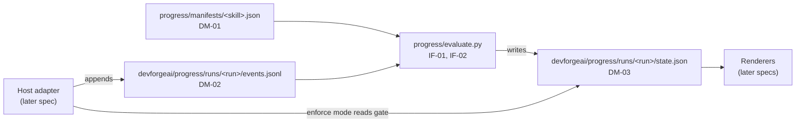

# SPEC-012 — Progress tracker core: formats, manifests and evaluator

## 1. Overview

Every DevForgeAI skill has a numbered checklist in its Workflow section, and tells Claude to copy it into its reply and tick steps off. Nothing checks those ticks. In one dogfood run, a brainstorm asked "no questions asked" wrote BRN-001 without asking the user anything (`/insights`, 2026-10-02). The design proposal `docs/specs/devforgeai-progress-ui.md` (draft, no ID) designs a tracker that judges each step by evidence, raises flags only at defined gates, and shows progress in the Claude Code CLI, the desktop app, VS Code and other tools.

This spec builds the part of that tracker that depends on no host:
- three JSON formats: a step **manifest** for each skill (DM-01), the **event log** a host adapter writes (DM-02), and the **progress state** the evaluator produces (DM-03);
- manifests for the brainstorm and architecture skills;
- `evaluate.py`, a Python evaluator with no dependencies outside the standard library, which turns a manifest and an event log into a progress state (IF-01, IF-02);
- its tests.

**The approach.** The evaluator is a pure function of the whole event log: each call reads the log from the start and computes the state again. So it needs no clock and keeps nothing between calls, the same log always gives the same state, and recorded logs make complete tests. It is standard-library Python, like the skills' validators, so any tool's adapter can run it and the Codex port can carry a copy. Manifests are JSON, which needs no YAML library.

**Layers.** The tracker follows DevForgeAI's adaptive model: a core set of skills and rules, then the project's own, then personal settings. ADR-003 already defines those layers for policy (framework defaults, organization, project, local preference), and ADR-006 brings the tracker and mods into them. In this spec that means manifests come in layers: the plugin's, then an organization's and a project's, which may add rules and manifests for their own skills but never remove or relax a rule (BEH-17). The user's mode, observe or enforce, is an adapter matter (ADR-006 D3).

**Out of scope,** each for a later spec:
- the Claude Code adapter: the mod that writes events from Claude Code's hooks, calls the evaluator, refuses at gates in enforce mode, and draws the status line and band;
- renderers: `Svg`, `Image` and `Raster` in Claude Code, and `progress.html` for any browser;
- `chain_state.py`, which reports the project's phases from `docs/specs/`;
- manifests for prd, epic, context, git and documents-updater (the formats already cover them);
- adapters for Codex and other tools.

## 2. Constraints

- **The chain's order** (ADR-002, and ADR-004 D5 for the context step) fixes the state's `next` step (BEH-13).
- **Decisions are the user's** (PRD-001 FR-003). The evaluator decides nothing and writes no document. For a step whose decision belongs to the user, it checks that a document written without the user's answer left that decision open (BEH-10). Brainstorm's rule comes from SPEC-001 VER-02; architecture's from SPEC-003, as SKL-003 implements it: an ADR is `accepted` only when the user picked an option at step 7, and the ARCH's `outcome` stays `null` until the user confirms it at step 8, which accepts no decision.
- **Layers** (ADR-003 A3 and A4; ADR-006 D2, D4 and D5): manifests apply framework first, then organization, then project; a later layer only adds; a disallowed change stops evaluation; the state records which files applied. Content rules for user-owned steps are framework requirements, so no layer weakens them. ADR-006 was accepted on 2026-10-02.
- **Handoffs name the next step** (PRD-001 FR-004). `next` reports the chain's next step for a renderer to suggest; it doesn't read or replace the skill's own handoff.
- **Repository conventions** (Bryan, 2026-10-02):
  - source code lives under `src/`, in each plugin where it applies, so the evaluator, schemas and manifests are part of the `devforgeai` plugin;
  - a plugin's tests live in `src/tests/<name>/`, so they don't deploy (`.claude/rules/skills.md`);
  - operational files live in the project root's `devforgeai/` folder (§4, "Operational files");
  - manifests are JSON.
- **The standard library only,** as brainstorm's `validate_brn.py` is (SPEC-001 BEH-09): the evaluator must run under `python3 -S` (QR-01).

## 3. Architecture and components



| Path | Holds | Deploys |
| --- | --- | --- |
| `src/claude/DevForgeAI/progress/evaluate.py` | the evaluator and its two commands (IF-01, IF-02) | yes |
| `src/claude/DevForgeAI/progress/schemas/manifest.schema.json`, `events.schema.json`, `progress.schema.json` | DM-01 to DM-03 as JSON Schema 2020-12, for tests and for other tools; the evaluator itself doesn't load them (QR-01) | yes |
| `src/claude/DevForgeAI/progress/manifests/brainstorm.json`, `architecture.json` | the two manifests (DM-01), bound to each skill's checklist by its hash (VER-01) | yes |
| `src/tests/progress/test_evaluate.py` | the unit tests | no |
| `src/tests/progress/cases/<case>/events.jsonl`, `expected.json`, and `manifests/` when a case needs its own | recorded event logs and the states they must produce | no |

- **A folder at the plugin's top level is safe.** The plugin already carries a top-level `evals/` folder that is no plugin component, and it loads (deployed as 0.10.0).
- **Manifests live in the progress component, not in `skills/<skill>/references/`.** `.claude/rules/skills.md` requires a version bump of a skill on any change to its references, which would bump six approved skills and reopen their qualification for a file none of them reads. Each manifest is bound to its skill by the checklist's hash instead (BEH-04, VER-01). Moving manifests into the skills is the shipping spec's choice.
- **Layered manifests** come from more folders than the plugin's, passed to IF-01 in layer order: an organization's, vendored into `devforgeai/manifests/organization/`, and a project's, in `devforgeai/manifests/`, both tracked in git (ADR-006 D4).
- **The Codex port keeps its own fork** of `progress/`, as it does for brainstorm's validator (D-03); Codex sessions build it (Bryan, 2026-10-02). The formats are the shared contract, so both read the same manifests and event logs.

## 4. Data model

**Checklist hash.** The step list comes from the skill's checklist block. Every line matching `^\s*- \[ \] (\d+)\. (.+?)\s*$` is rebuilt as `- [ ] N. Title`. The rebuilt lines are joined with `\n`, encoded as UTF-8 and hashed with SHA-256, written `sha256:<64 hex digits>`. Leading and trailing whitespace and the surrounding fence don't change the hash; a changed step number or title does.

**Field values in a written document,** read by content rules (BEH-10): a line matching `^\s*(?:-\s+)?<field>:\s*["']?([^\s"'#,}]+)` gives one value. With scope `frontmatter`, only the lines between the file's first two `---` lines are read; with `anywhere`, every line. Values are compared as text (`null` is the text `null`). This reads lines, not YAML, so the evaluator stays standard-library only.

```json
{
  "x-item-id": "DM-01",
  "$schema": "https://json-schema.org/draft/2020-12/schema",
  "title": "Step manifest (devforgeai-manifest/1), progress/manifests/<skill>.json",
  "type": "object",
  "required": ["format", "skill", "checklistHash", "steps"],
  "additionalProperties": false,
  "properties": {
    "format": {"const": "devforgeai-manifest/1"},
    "skill": {"type": "string", "pattern": "^[a-z][a-z0-9-]*$", "description": "the skill's name without the plugin prefix: brainstorm, not devforgeai:brainstorm"},
    "checklistHash": {"type": "string", "pattern": "^sha256:[0-9a-f]{64}$"},
    "steps": {
      "type": "object",
      "propertyNames": {"pattern": "^[1-9][0-9]?$"},
      "additionalProperties": {"$ref": "#/$defs/step"}
    },
    "contentRules": {"type": "array", "items": {"$ref": "#/$defs/contentRule"}},
    "source": {"type": "string", "description": "for a vendored organization manifest: its origin repository and ref (ADR-003 A3)"}
  },
  "$defs": {
    "step": {
      "type": "object",
      "required": ["title", "kind", "need"],
      "additionalProperties": false,
      "properties": {
        "title": {"type": "string"},
        "kind": {"enum": ["read", "think", "ask", "forge", "inspect", "report"]},
        "need": {"enum": ["required", "conditional", "text-only"]},
        "when": {"type": "string", "description": "for a conditional step: when it applies, shown as the note when it doesn't"},
        "userOwned": {"type": "boolean", "default": false},
        "gate": {"enum": ["write", "report"]},
        "evidence": {"type": "array", "items": {"$ref": "#/$defs/rule"}}
      },
      "allOf": [{"if": {"properties": {"need": {"const": "conditional"}}}, "then": {"required": ["when"]}}]
    },
    "rule": {
      "type": "object",
      "required": ["type"],
      "additionalProperties": false,
      "properties": {
        "type": {"enum": ["script", "answer", "write", "read"]},
        "pattern": {"type": "string", "description": "script: a file-name pattern; write and read: a path pattern relative to the project root, and a pattern ending in / means anything inside that folder"},
        "exit": {"type": "integer", "default": 0},
        "target": {"const": "written", "description": "the path or command must name a file written at the run's write gate"}
      },
      "allOf": [{"if": {"properties": {"type": {"enum": ["script", "write", "read"]}}}, "then": {"required": ["pattern"]}}]
    },
    "contentRule": {
      "type": "object",
      "required": ["step", "path", "field", "scope", "allowed"],
      "additionalProperties": false,
      "properties": {
        "step": {"type": "integer", "minimum": 1, "description": "the user-owned step whose answer the field's other values need"},
        "path": {"type": "string"},
        "field": {"type": "string", "pattern": "^[a-z_]+$"},
        "scope": {"enum": ["frontmatter", "anywhere"]},
        "allowed": {"type": "array", "items": {"type": "string"}, "minItems": 1, "description": "the values allowed without the user's answer"}
      }
    }
  }
}
```

```json
{
  "x-item-id": "DM-02",
  "$schema": "https://json-schema.org/draft/2020-12/schema",
  "title": "Event (devforgeai-events/1): one JSON object per line of events.jsonl",
  "type": "object",
  "required": ["run", "seq", "time", "kind"],
  "properties": {
    "run": {"type": "string", "pattern": "^[0-9]{8}T[0-9]{6}Z-[a-z][a-z0-9-]*-[0-9a-f]{8}$"},
    "seq": {"type": "integer", "minimum": 1},
    "time": {"type": "string", "format": "date-time"},
    "kind": {"enum": ["skill-loaded", "tool", "answer", "prompt", "reply", "turn", "run-end"]}
  },
  "allOf": [
    {"if": {"properties": {"kind": {"const": "skill-loaded"}}},
     "then": {"required": ["format", "skill", "checklist"],
              "properties": {"format": {"const": "devforgeai-events/1"}, "skill": {"type": "string"},
                             "checklist": {"type": "string", "description": "the skill's prompt as loaded, or at least its checklist block"},
                             "host": {"type": "string", "description": "for example claude-code 2.1.287"}}}},
    {"if": {"properties": {"kind": {"const": "tool"}}},
     "then": {"required": ["tool"],
              "properties": {"tool": {"type": "string"},
                             "path": {"type": "string", "description": "relative to the project root, with / separators; for Glob and Grep, the pattern or search path"},
                             "command": {"type": "string"}, "exit": {"type": ["integer", "null"]}, "error": {"type": "boolean"},
                             "content": {"type": "string", "description": "a Write's content, or the file an Edit will leave; optional"}}}},
    {"if": {"properties": {"kind": {"const": "answer"}}},
     "then": {"required": ["answered"], "properties": {"answered": {"type": "boolean", "description": "false when the question was dismissed"}}}},
    {"if": {"properties": {"kind": {"const": "reply"}}},
     "then": {"required": ["text"], "properties": {"text": {"type": "string"}}}},
    {"if": {"properties": {"kind": {"const": "turn"}}},
     "then": {"required": ["phase"], "properties": {"phase": {"enum": ["start", "end"]}}}},
    {"if": {"properties": {"kind": {"const": "run-end"}}},
     "then": {"required": ["reason"], "properties": {"reason": {"enum": ["another-skill", "session-end", "clear", "idle"]}}}}
  ]
}
```

A `prompt` event records only that the user sent a prompt; its text is never logged.

```json
{
  "x-item-id": "DM-03",
  "$schema": "https://json-schema.org/draft/2020-12/schema",
  "title": "Progress state (devforgeai-progress/1), state.json",
  "type": "object",
  "required": ["format", "run", "skill", "manifest", "through", "ended", "current", "steps", "flags", "gate", "next", "counts"],
  "additionalProperties": false,
  "properties": {
    "format": {"const": "devforgeai-progress/1"},
    "run": {"type": "string"},
    "skill": {"type": "string"},
    "manifest": {
      "type": "object", "required": ["state", "manifestHash", "checklistHash", "layers"], "additionalProperties": false,
      "properties": {"state": {"enum": ["matched", "stale", "none", "unverified"]},
                     "manifestHash": {"type": ["string", "null"]}, "checklistHash": {"type": ["string", "null"]},
                     "layers": {"type": "array", "items": {"type": "string"}, "description": "the manifest files applied, in layer order, as their paths were given (ADR-006 D5)"}}
    },
    "through": {"type": "integer", "minimum": 0, "description": "the seq of the last event evaluated"},
    "ended": {"type": ["string", "null"], "description": "the run-end reason, or null while the run is open"},
    "current": {"type": ["integer", "null"]},
    "steps": {"type": "array", "items": {"$ref": "#/$defs/step"}},
    "flags": {"type": "array", "items": {"$ref": "#/$defs/flag"}},
    "gate": {"$ref": "#/$defs/gate"},
    "next": {
      "type": ["object", "null"], "additionalProperties": false, "required": ["skill", "available", "note"],
      "properties": {"skill": {"type": "string"}, "available": {"type": "boolean"}, "note": {"type": "string"}}
    },
    "phases": {"description": "copied from --phases unchanged; a later spec defines it"},
    "counts": {
      "type": "object", "additionalProperties": false,
      "required": ["events", "malformed", "outOfOrder", "duplicates", "unknownClaims", "afterEnd"],
      "properties": {"events": {"type": "integer"}, "malformed": {"type": "integer"}, "outOfOrder": {"type": "integer"}, "duplicates": {"type": "integer"},
                     "unknownClaims": {"type": "integer"}, "afterEnd": {"type": "integer"}}
    }
  },
  "$defs": {
    "step": {
      "type": "object", "additionalProperties": false,
      "required": ["n", "title", "kind", "need", "userOwned", "state", "evidence", "claim", "note"],
      "properties": {
        "n": {"type": "integer"}, "title": {"type": "string"},
        "kind": {"enum": ["read", "think", "ask", "forge", "inspect", "report", null]},
        "need": {"enum": ["required", "conditional", "text-only"]},
        "userOwned": {"type": "boolean"},
        "state": {"enum": ["pending", "current", "your-turn", "done", "claimed", "unconfirmed", "skipped-with-reason", "not-applicable", "skipped", "rule-broken"]},
        "evidence": {"type": "array", "items": {
          "type": "object", "additionalProperties": false, "required": ["seq", "type", "strength", "detail"],
          "properties": {"seq": {"type": "integer"}, "type": {"enum": ["script", "answer", "write", "read"]},
                         "strength": {"enum": ["strong", "medium"]}, "detail": {"type": "string"}}}},
        "claim": {"type": ["object", "null"], "additionalProperties": false, "required": ["seq", "state", "reason"],
                  "properties": {"seq": {"type": "integer"}, "state": {"enum": ["done", "skipped"]}, "reason": {"type": ["string", "null"]}}},
        "note": {"type": "string"}
      }
    },
    "flag": {
      "type": "object", "additionalProperties": false, "required": ["gate", "seq", "step", "type", "message"],
      "properties": {"gate": {"enum": ["write", "report", "end"]}, "seq": {"type": "integer"}, "step": {"type": "integer"},
                     "type": {"enum": ["skipped", "claimed-not-evidenced", "rule-broken"]}, "message": {"type": "string"}}
    },
    "gate": {
      "type": "object", "additionalProperties": false, "required": ["kind", "seq", "refuse", "reason"],
      "properties": {"kind": {"enum": ["write", "report", "end", null]}, "seq": {"type": ["integer", "null"]},
                     "refuse": {"type": "boolean"}, "reason": {"type": ["string", "null"]}}
    }
  }
}
```

**The two manifests.** Their titles are the skills' checklist lines; their `checklistHash` is computed from each `SKILL.md` in `src/` (VER-01).

| Skill | Step | kind, need | Evidence | Gate, user-owned |
| --- | --- | --- | --- | --- |
| brainstorm | 1 | read, required | read `docs/specs/brainstorm/` | |
| | 2, 3, 4 | think, text-only | none | |
| | 5 | ask, required | answer | user-owned |
| | 6 | forge, required | write `docs/specs/brainstorm/BRN-*.md` | write gate |
| | 7 | inspect, required | script `validate_brn.py`, exit 0, target written | |
| | 8 | report, required | none | report gate |
| architecture | 1 | read, required | script `validate_policy.py`, exit 0 | |
| | 2 | read, required | read `docs/specs/prd/` | |
| | 3 | read, required | read `docs/specs/prd/PRD-*.md` | |
| | 4 | read, required | read `docs/specs/arch/` | |
| | 5 | read, conditional: "the user named paths to inspect" | read outside `docs/specs/` | |
| | 6 | think, text-only | none | |
| | 7 | ask, conditional: "a question isn't settled by mandated policy or an accepted ADR" | answer | user-owned |
| | 8 | ask, required | answer | user-owned |
| | 9 | forge, required | write `docs/specs/arch/ARCH-*.md` or `docs/specs/adr/ADR-*.md` | write gate |
| | 10 | inspect, required | read, target written | |
| | 11 | report, required | none | report gate |

Content rules:

| Skill | Step | Files | Field, scope | Allowed without the user's answer |
| --- | --- | --- | --- | --- |
| brainstorm | 5 | `docs/specs/brainstorm/BRN-*.md` | `disposition`, anywhere | `open` |
| brainstorm | 5 | `docs/specs/brainstorm/BRN-*.md` | `status`, frontmatter | `draft` |
| architecture | 7 | `docs/specs/adr/ADR-*.md` | `status`, frontmatter | `proposed` |
| architecture | 8 | `docs/specs/arch/ARCH-*.md` | `outcome`, frontmatter | `null` |

Architecture's step 10 is weak evidence: ERR-05 comes from the skill's own self-check, which has no script, so reading each written file back is the only trace it leaves.

**Operational files.** A host adapter writes a run's files under the project root's `devforgeai/` folder:
- `devforgeai/progress/runs/<run>/events.jsonl`: the event log (DM-02), appended by the adapter;
- `devforgeai/progress/runs/<run>/state.json`: the evaluator's output (DM-03), written through `--out`;
- `devforgeai/progress/current.json`: a copy of the active run's state, for renderers.

`devforgeai/progress/` is gitignored by default (Bryan, 2026-10-02): its files are per session working data. The adapter writes the `.gitignore` entry (its spec). `devforgeai/manifests/` stays tracked.

A run ID is `<UTC time as yyyymmddThhmmssZ>-<skill>-<8 hex digits>`. The evaluator writes only `--out` (QR-04); creating and copying these files is the adapter's job.

## 5. Interfaces and contracts

`evaluate.py` is run as `python3 <plugin>/progress/evaluate.py <command> …`:

| Item | Command | Behaviour |
| --- | --- | --- |
| IF-01 | `evaluate --manifests DIR [--manifests DIR …] --events FILE --out FILE [--root DIR] [--phases FILE]` | `--manifests` may repeat, in layer order: the plugin's folder first, then an organization's, then a project's (BEH-17). Reads `FILE` (DM-02) and each folder's `<skill>.json` (DM-01), writes the state (DM-03) to `--out`, and prints one summary line. `--root` is the project root, for reading written files that carry no `content`. Exit 0 when the state is written, with or without flags; flags are data, never an exit status. Exit 2 when it can't run (ERR-03, ERR-04, ERR-07, ERR-08), with one line on stderr naming the file and the reason |
| IF-02 | `check --manifests DIR --skill NAME --checklist FILE` | Hashes the checklist in `FILE` (a `SKILL.md`, or any text holding the block) and compares it with `DIR/NAME.json`. Prints `matched <hash>`, `stale manifest <hash> checklist <hash>` or `none <hash>`. Exit 0 when matched, 1 when stale or none, 2 when it can't run |

## 6. Behavior

```yaml items
behaviors:
  - id: BEH-01
    status: active
    rule: "The evaluator is a pure function. Each IF-01 call reads the whole event log and computes the state from it, the manifest, the optional phases file and, with --root, the files written at the write gate. It keeps nothing between calls and reads no clock."
  - id: BEH-02
    status: active
    rule: "Events are taken in seq order (ERR-02). The first must be skill-loaded (ERR-03). An event whose run differs from the first event's is ignored and counted as malformed."
  - id: BEH-03
    status: active
    rule: "The step list and its hash come from the skill-loaded event's checklist text, as §4 defines; IF-02 uses the same function."
  - id: BEH-04
    status: active
    rule: "The evaluator loads <manifests>/<skill>.json. When its checklistHash equals the event's, manifest.state is matched and every rule below applies. When they differ, it is stale; with no manifest file, none; with no checklist lines in the event, unverified, which uses the manifest and notes that the checklist wasn't seen. In stale and none, the steps come from the event's checklist with kind null and need text-only, and are tracked by claims only: no gates, no flags, and a note on the first step saying the manifest is out of date or missing."
  - id: BEH-05
    status: active
    rule: "Claims come from reply events. A line matching ^\\s*[-*]\\s*\\[[xX]\\]\\s*(\\d+)\\. claims step N done. A line matching ^\\s*[-*]\\s*\\[[ xX]\\]\\s*(\\d+)\\..*\\(skipped:\\s*(.+?)\\)\\s*$ claims step N skipped, with that reason. A line that matches both patterns is a skipped claim. A later claim for a step replaces an earlier one. An unticked box claims nothing."
  - id: BEH-06
    status: active
    rule: "A tool event is evidence for a step's rule when: script: the tool is Bash, a token of the command has a file name matching the pattern, and exit equals the rule's exit (0 by default); write: the tool is Write or Edit and path matches the pattern; read: the tool is Read, Glob or Grep and path matches the pattern, or lies inside it when the pattern ends in /; and, with target written, the path or a command token names a file written at the run's write gate. A tool event with error true is never evidence. An answer event with answered true, or a prompt event, inside the step's answer window (BEH-09) is answer evidence. Script and answer evidence are strong; write and read are medium. One event can be evidence for several steps."
  - id: BEH-07
    status: active
    rule: "While the run is open, a step is done when it has evidence, or when it is claimed done and has no strong rule; claimed when it is claimed done, has a strong rule and has no evidence yet; skipped-with-reason when it is claimed skipped; otherwise pending. A step is reached when it has evidence or a claim, whatever its state. current is the step after the highest-numbered reached step (step 1 when none is reached), or null once the last step is reached or the run has ended; it shows as current, or as your-turn when it is user-owned, has no answer in its window, and the last event is a turn end. A step before current that is still pending keeps the note 'not seen yet' and raises no flag."
  - id: BEH-08
    status: active
    rule: "Flags are raised only at gates. The write gate is the first tool event that is write evidence for the step with gate write; the report gate is the first reply claiming the step with gate report done; the run's end is the run-end event. At a gate, for every step before the gate's step (at run end, every step up to the highest reached): a required step still pending becomes skipped, with a skipped flag; a claimed step keeps its state and gets a claimed-not-evidenced flag; a conditional step still pending becomes not-applicable, with its when text as the note; a text-only step still pending becomes unconfirmed, with no flag; a user-owned step follows BEH-10. A step whose evidence arrives after a later step's is noted 'seen late (after step K)' and never flagged. Flags record what each gate found: evidence that arrives later changes the step's state, not an earlier flag."
  - id: BEH-09
    status: active
    rule: "A user-owned step's answer window opens at the latest tool evidence or claim of any step before it, over the whole log (at skill-loaded when there is none); answers don't move it. The window closes at the first of: the gate that checks the step, a claim of the step itself, and any tool evidence or claim of a later step. Answers and prompts are assigned in seq order, each to the earliest user-owned step whose window holds it, so several answers can count for one step (architecture's step 7 takes one per question), and a tick of that step hands the next answer to the following one."
  - id: BEH-10
    status: active
    rule: "From the write gate on, every Write or Edit whose path matches a content rule is checked. When the rule's step has an answer in its window, the step is done and the rule doesn't apply: an answer satisfies it whatever it said, because the evaluator can't read the decision. Otherwise the field's values are read from the event's content, else from the file under --root, else the check is unverifiable (ERR-05). When every value is allowed, or the field is absent, the step is not-applicable with the note 'no answer; left open', and nothing is flagged. When a value isn't allowed, the step becomes skipped with a skipped flag, and the gate's step becomes rule-broken with a rule-broken flag naming the file, the field and the value. At the report gate or the run's end, a user-owned step with no answer and no write that broke its rules is not-applicable, with the note 'no answer; left open'."
  - id: BEH-11
    status: active
    rule: "gate holds the most recent gate check: its kind, its event's seq, refuse (true when that check raised any flag) and reason (the first such flag's message). Before any gate, kind and seq are null and refuse is false. An adapter in enforce mode refuses the tool call at that seq when refuse is true; the evaluator never refuses anything itself."
  - id: BEH-12
    status: active
    rule: "A run-end event closes the run: ended holds its reason, and later events are ignored and counted in counts.afterEnd. Steps after the highest step reached stay pending with the note 'not reached' and are never flagged."
  - id: BEH-13
    status: active
    rule: "When the report step is done or the run has ended, next names the chain's following skill in the order brainstorm, prd, architecture, context, epic, story (ADR-002; ADR-004 D5 places context). The story skill isn't built, so its next has available false and the note 'the story skill isn't built yet (SPEC-009)'. Otherwise next is null."
  - id: BEH-14
    status: active
    rule: "The state is JSON with sorted keys, two-space indentation and a final newline, written to a temporary file in --out's folder and then renamed over --out. Paths stay as the events gave them, never made absolute. stdout gets one line: 'progress <skill>: step <current> of <steps>, <n> flags'; when current is null, 'all <steps> steps reached' or 'ended (<reason>)' takes the place of the step; ', refuse' is appended when gate.refuse is true."
  - id: BEH-15
    status: active
    rule: "With --phases, the file's JSON is copied into phases unchanged. Without it, the state has no phases key."
  - id: BEH-16
    status: active
    rule: "IF-02 computes the checklist hash of its file by §4's function and compares it with the manifest's checklistHash; it reads nothing else."
  - id: BEH-17
    status: active
    rule: "Manifests are read from each --manifests folder in the order given. The first folder that has <skill>.json gives the base manifest; so a project's own skill, which the plugin doesn't have, gets its manifest from the project's folder. Each later file for the same skill must carry the same skill and checklistHash, and may only add: evidence rules on a step, a gate on a step that had none, userOwned true, a stricter need (text-only or conditional to required), and content rules. It may not remove or change anything the earlier layers set; a step's title and kind stay as they are. The result applies as one manifest, and manifest.layers lists every file used, in order. A later file that would remove or relax a rule, or that carries another skill or checklistHash, stops evaluation (ERR-09)."
```

## 7. Errors and edge cases

```yaml items
errors:
  - id: ERR-01
    status: active
    condition: "A line of the event log isn't JSON, lacks run, seq, time or kind, or has an unknown kind."
    handling: "Skip the line and count it in counts.malformed."
    user_result: "The state is written; the count shows how many lines were skipped."
  - id: ERR-02
    status: active
    condition: "Events are out of seq order, or two share a seq."
    handling: "Sort by seq. Count in counts.outOfOrder each event whose seq is lower than that of a line before it. Keep the first event of each seq, drop the rest, and count them in counts.duplicates."
    user_result: "The state is written from the ordered events."
  - id: ERR-03
    status: active
    condition: "The log has no skill-loaded event, or its first valid event is another kind."
    handling: "Exit 2 and write no state."
    user_result: "stderr: 'evaluate: <events file>: the first event must be skill-loaded'."
  - id: ERR-04
    status: active
    condition: "--manifests isn't a folder, or <skill>.json exists but isn't valid JSON or lacks a required key."
    handling: "Exit 2 and write no state. A missing <skill>.json isn't an error: the manifest state is none (BEH-04)."
    user_result: "stderr names the folder or file and what is wrong with it."
  - id: ERR-05
    status: active
    condition: "A content rule must be checked, but the event has no content, --root wasn't given, or the file isn't there."
    handling: "Leave the user-owned step's state as BEH-07 sets it, add the note 'content not available; rule not checked', and raise no flag."
    user_result: "The step shows the note instead of a flag."
  - id: ERR-06
    status: active
    condition: "A reply claims a step number the checklist doesn't have."
    handling: "Ignore the claim and count it in counts.unknownClaims."
    user_result: "The state is written; the count shows the claims ignored."
  - id: ERR-07
    status: active
    condition: "The events file is missing or unreadable."
    handling: "Exit 2 and write no state."
    user_result: "stderr: 'evaluate: <events file>: <reason>'."
  - id: ERR-08
    status: active
    condition: "--out's folder doesn't exist or can't be written."
    handling: "Exit 2; leave any earlier state file as it was."
    user_result: "stderr names --out and the reason."
  - id: ERR-09
    status: active
    condition: "A later layer's manifest removes or relaxes a rule an earlier layer set, changes a step's title or kind, or carries another skill or checklistHash."
    handling: "Exit 2 and write no state, as ADR-003 A4 stops a disallowed override."
    user_result: "stderr: 'evaluate: <file>: <what it changes>, which an earlier layer set (<earlier file>)'."
```

## 8. Non-functional design

```yaml items
quality_responses:
  - id: QR-01
    status: active
    response: "evaluate.py imports only the Python standard library and runs under python3 -S. The JSON Schemas are for tests and other tools; the evaluator checks the keys it needs by itself (ERR-04)."
    measured_by: "VER-18: the test cases pass when evaluate.py runs under python3 -S."
    upstream:
      - {id: PRD-001, item: NFR-004, relation: satisfies, version: 11, hash: null}
  - id: QR-02
    status: active
    response: "The same inputs give byte-identical output: sorted keys, no time of its own, no absolute paths, and no order taken from a set or a folder listing."
    measured_by: "VER-18: two runs over every case produce identical bytes."
    upstream:
      - {id: PRD-001, item: NFR-005, relation: satisfies, version: 11, hash: null}
  - id: QR-03
    status: active
    response: "An adapter calls the evaluator on gates and on events that match an evidence rule, so a call must be quick: one pass over the events, with patterns compiled once."
    measured_by: "VER-19: a 500-event log evaluates in under 1 second in the test; the time measured on the owner's machine is recorded in §9, against a target of 200 ms."
    upstream:
      - {id: PRD-001, item: NFR-006, relation: satisfies, version: 11, hash: null}
  - id: QR-04
    status: active
    response: "The evaluator reads only the files its command names and, with --root, files under the root that write events name. It writes only --out, through a temporary file in the same folder. It opens no network connection and runs no other program."
    measured_by: "Code review at build time, recorded in §9; VER-15 checks that nothing but --out is written."
    upstream:
      - {id: PRD-001, item: NFR-007, relation: satisfies, version: 11, hash: null}
```

## 9. Verification

| Kind | Status |
| --- | --- |
| Structural: this spec against `src/schemas/spec.schema.json` | Passes, checked 2026-10-02 with the helpers of `src/tests/context/test_structure.py`: the frontmatter and every item block, with QR-01 to QR-04 linked to PRD-001 v11's NFR-004 to NFR-007; every BEH, ERR and QR item is covered by a VER item; DM-01 to DM-03 are valid JSON Schema 2020-12 |
| Build | Not built |

Each case is a folder in `src/tests/progress/cases/` with `events.jsonl` and `expected.json`; a test runs IF-01 on it and compares the output with `expected.json` byte for byte. "The prototype's moment N" means the five moments of the design proposal's prototype.

```yaml items
verifications:
  - id: VER-01
    status: active
    obligation: "brainstorm.json and architecture.json validate against manifest.schema.json, and IF-02 reports matched for each against its skill's SKILL.md in src/claude/DevForgeAI/skills/. A changed checklist fails this test until the manifest is updated."
    level: unit
    covers:
      - DM-01
      - IF-02
      - BEH-03
      - BEH-16
  - id: VER-02
    status: active
    obligation: "Every case's events.jsonl validates line by line against events.schema.json, and every expected.json and every produced state validates against progress.schema.json."
    level: unit
    covers:
      - DM-02
      - DM-03
  - id: VER-03
    status: active
    obligation: "Case arch-reading (the prototype's moment 1): policy script exit 0, a Glob of docs/specs/prd/ and a Read of PRD-001. Steps 1 and 2 done with strong and medium evidence, step 3 done, current 4, no flags, gate kind null, next null."
    level: unit
    covers:
      - BEH-06
      - BEH-07
      - BEH-11
  - id: VER-04
    status: active
    obligation: "Case arch-late-step (moments 2 and 3): reply ticks for steps 1 to 3 and 6, then a Glob of docs/specs/arch/. Before the Glob, step 4 is pending with the note 'not seen yet' and current is 7; after it, step 4 is done with the note 'seen late (after step 6)'. No flags at any point."
    level: unit
    covers:
      - BEH-05
      - BEH-07
      - BEH-08
  - id: VER-05
    status: active
    obligation: "Case arch-your-turn (moment 3): steps 1 to 6 reached and a turn end with no answer since step 6. Step 7 is your-turn; after an answer event it is done with strong answer evidence."
    level: unit
    covers:
      - BEH-07
      - BEH-09
  - id: VER-06
    status: active
    obligation: "Case arch-outcome-unconfirmed (moment 4, as the architecture skill's rules have it): answers inside step 7's window, then a Write of docs/specs/arch/ARCH-001.md whose content has outcome: create, with no answer after step 7's. Step 8 is skipped with a skipped flag at the write gate; step 9 is rule-broken with a flag naming ARCH-001, outcome and create; gate.refuse is true. A Write of an ADR with status: accepted in the same run raises nothing, because step 7 has its answers. A variant with answers at step 7, a reply ticking step 7, one more answer, and then the same ARCH-001 Write gives step 8 done with strong answer evidence and no flag."
    level: unit
    covers:
      - BEH-08
      - BEH-09
      - BEH-10
      - BEH-11
  - id: VER-07
    status: active
    obligation: "Case arch-adr-accepted-unanswered: no answer in step 7's window, then a Write of ADR-004 with status: accepted. Step 7 is skipped and step 9 rule-broken, with flags naming ADR-004, status and accepted. The same log with the ADR's status proposed gives step 7 not-applicable, 'no answer; left open', and no flags."
    level: unit
    covers:
      - BEH-10
  - id: VER-08
    status: active
    obligation: "Case brn-left-open (moment 5, SPEC-001 VER-02's path): no answer or prompt after the skill loads; a Write of BRN-002 whose content has 15 disposition: open lines, items with status: active, and frontmatter status: draft; validate_brn.py on BRN-002 exits 0; a reply ticks step 8. Step 5 is not-applicable with 'no answer; left open', steps 6 and 7 are done, there are no flags, and next is prd, available."
    level: unit
    covers:
      - BEH-08
      - BEH-10
      - BEH-13
  - id: VER-09
    status: active
    obligation: "Case brn-unconfirmed: as brn-left-open, but nine ideas have disposition: promoted. Step 5 is skipped, step 6 rule-broken, gate.refuse is true at the Write, and the flag names BRN-002, disposition and promoted. A variant whose only change is frontmatter status: converged raises the same pair of flags for status."
    level: unit
    covers:
      - BEH-10
      - BEH-11
  - id: VER-10
    status: active
    obligation: "Case brn-answer-windows: an answer after step 1's Glob and before any tick of steps 2 to 4, then ticks of steps 2 to 4, then the promoted Write. The early answer doesn't count for step 5, so the flags of brn-unconfirmed are raised. With a second answer after the step 4 tick, step 5 is done and nothing is flagged."
    level: unit
    covers:
      - BEH-09
      - BEH-10
  - id: VER-11
    status: active
    obligation: "Case brn-validation-claimed: a reply ticks step 7 and then step 8, with no validate_brn.py run. At the report gate step 7 keeps the state claimed and gets a claimed-not-evidenced flag. A variant where the script runs and exits 1 gives the same result; one where it runs on another file than the written BRN also does (target written)."
    level: unit
    covers:
      - BEH-06
      - BEH-08
  - id: VER-12
    status: active
    obligation: "Case skipped-with-reason, with its own manifest in the case folder: a reply line '- [x] 3. Push (skipped: no remote)' makes step 3 skipped-with-reason with that reason, and the report gate raises no flag for it."
    level: unit
    covers:
      - BEH-05
      - BEH-07
  - id: VER-13
    status: active
    obligation: "Cases stale-manifest and no-manifest: the skill-loaded checklist differs by one title from the manifest's hashed text, and, separately, the skill is prd, which has no manifest. manifest.state is stale or none; the steps carry the event's titles, kind null and need text-only; ticks make them done; no flags are raised; the first step's note says the manifest is out of date or missing."
    level: unit
    covers:
      - BEH-04
  - id: VER-14
    status: active
    obligation: "Case evidence-only: an architecture run with no reply events, as a skill that keeps its checklist out of its replies would give (the context skill does). States come from tool and answer events alone. At the run's end, the text-only step 6 is unconfirmed with no flag, and the conditional step 5 is not-applicable with its when text."
    level: unit
    covers:
      - BEH-07
      - BEH-08
      - BEH-12
  - id: VER-15
    status: active
    obligation: "Case messy-log: one line that isn't JSON, one without seq, one event whose run differs from the first event's, one event placed before the event it follows, a repeated seq, a claim of step 40, a Write with no content and no --root, and two events after run-end. The state counts 3 malformed, 1 out of order, 1 duplicate, 1 unknown claim and 2 after end; the content rule's step has the note 'content not available; rule not checked' and no flag. The test's temporary folder holds only --out afterwards."
    level: unit
    covers:
      - BEH-02
      - ERR-01
      - ERR-02
      - ERR-05
      - ERR-06
      - BEH-12
      - QR-04
  - id: VER-16
    status: active
    obligation: "Runs that can't proceed: a log whose first event is a tool event, a manifest file that isn't JSON, a missing events file, and an --out in a missing folder. Each exits 2 with one stderr line naming the file, and leaves no state file."
    level: unit
    covers:
      - ERR-03
      - ERR-04
      - ERR-07
      - ERR-08
      - IF-01
  - id: VER-17
    status: active
    obligation: "IF-01's summary line for brn-unconfirmed's log cut after the BRN Write reads 'progress brainstorm: step 7 of 8, 2 flags, refuse', and for brn-left-open's whole log 'progress brainstorm: all 8 steps reached, 0 flags'; a run with --phases copies that file's JSON into phases unchanged, and a run without it has no phases key; a run ended with run-end for the epic skill (no manifest) has next story, available false, with the SPEC-009 note."
    level: unit
    covers:
      - BEH-13
      - BEH-14
      - BEH-15
      - IF-01
  - id: VER-18
    status: active
    obligation: "Every case evaluated twice gives identical bytes, and every case passes with evaluate.py run under python3 -S."
    level: unit
    covers:
      - BEH-01
      - QR-01
      - QR-02
  - id: VER-20
    status: active
    obligation: "Case layer-adds-rule, with a project folder passed after the plugin's: its brainstorm.json, with the same checklistHash, adds a content rule on reason, allowed null without an answer, for step 5. A Write of a BRN whose ideas are all open but carry reason values flags step 5 and step 6 naming reason. manifest.layers lists both files in order. A second project folder holding a manifest for a skill the plugin lacks (team-review) gives that run its steps, with manifest.layers listing that one file."
    level: unit
    covers:
      - BEH-17
      - DM-03
      - IF-01
  - id: VER-21
    status: active
    obligation: "Case layer-relaxes: a project brainstorm.json that turns step 7's need from required to text-only exits 2, writes no state, and names both files and the step. So do variants that drop step 6's gate, remove the disposition content rule, change step 2's kind, or carry another checklistHash."
    level: unit
    covers:
      - BEH-17
      - ERR-09
  - id: VER-19
    status: active
    obligation: "A generated 500-event architecture log evaluates in under 1 second; the test prints the time, and §9 records it on the owner's machine against QR-03's 200 ms target."
    level: performance
    covers:
      - QR-03
```

## 10. Rollout, migration and rollback

- **Order.** ADR-006 was accepted and this spec approved on 2026-10-02 (Bryan); the build comes next, on its own branch.
- **Branch.** The build runs on a spec branch in its own worktree (ADR-001), as SKL-010 was built (issue #31).
- **Plugin version.** The plugin's folder changes, so `plugin.json` takes the next free minor version when this merges. Main is already at 0.11.0 (SKL-002 v5), so the number is set at merge time, not here.
- **Nothing reads it yet.** No skill changes, and no hook calls the evaluator until the adapter's spec is built. Rolling back means deleting `progress/` and `src/tests/progress/`.
- **Repository records.** `CLAUDE.md`'s Commands section gains `PYTHONDONTWRITEBYTECODE=1 python3 -m unittest discover -s src/tests/progress -p 'test_*.py'`. The skills table gains no row, because the tracker isn't a skill.
- **The design proposal** points its build order's step 2 at this spec.

## 11. Implementation plan

1. Write the three schemas (implements DM-01, DM-02, DM-03).
2. Write the cases and `test_evaluate.py` before the evaluator, and see them fail (VER-02 to VER-21).
3. Write `evaluate.py`: the checklist hash and IF-02 first, then IF-01, then the layers (implements IF-01, IF-02, BEH-01 to BEH-17, ERR-01 to ERR-09, QR-01 to QR-04).
4. Write the two manifests from the skills' checklists, and bind their hashes (VER-01).
5. Run the tests normally and under `python3 -S`; time VER-19; record the results in §9.
6. Update `CLAUDE.md`'s Commands, the plugin version and the design proposal's pointer (§10).

The specs that follow, in the design proposal's order: the Claude Code adapter (events, status line, band, observe and enforce modes), the pane and its graphics, `progress.html`, `chain_state.py` and the phases, manifests for the other skills, and the Codex port's copy.

## 12. Alternatives considered

- **The evaluator in TypeScript, inside the mod.** It would avoid a process per call, but Codex and other tools couldn't reuse it. Rejected: the shared core is the point.
- **Manifests in each skill's `references/`.** Closer to the checklist, but every change would bump an approved skill (`.claude/rules/skills.md`). The hash binding (VER-01) keeps them in step from outside.
- **YAML manifests.** Easier to write by hand, but they need PyYAML. JSON was Bryan's choice (2026-10-02).
- **Adapters parsing ticks themselves.** Each adapter would carry its own copy of the tick rules. The evaluator parses reply text, so the rules have one copy (BEH-05).
- **An evaluator that keeps state between calls, or reads a clock for idle runs.** It would save re-reading the log, but results would depend on call timing. Idle detection stays with the adapter, which sends run-end.
- **Validating with jsonschema at run time.** Thorough, but not in the standard library. The tests validate against the schemas instead (VER-02).

## 13. Open questions

Decided by Bryan on 2026-10-02:
- PRD-001 v11 adds FR-021 (progress tracking) and NFR-004 to NFR-007, should/current; this spec links them.
- `devforgeai/progress/` is gitignored by default; `devforgeai/manifests/` is tracked (§4).
- The Codex port keeps its own fork (§3).
- The plugin version is set at merge time (§10).
- Project and organization manifests live in `devforgeai/manifests/` (ADR-006 D4).

Still open, or notes:
- **A known limit of answer windows (BEH-09).** Windows are placed by tool evidence and ticks. When Claude doesn't tick the steps before a user-owned step, an earlier answer can be counted for it: a brainstorm intake answer for step 5, or every architecture answer for step 7 and none for step 8, which flags step 8 although the user answered. The skills tell Claude to tick its checklist, and VER-04 and VER-14 cover runs without ticks; markers that skills print at each step (the design proposal's open question 4) would remove the guess.
- The idle limit that ends a run belongs to the adapter's spec (the design proposal's open question 6).
- This spec adds the state `unconfirmed` (a text-only step with no tick, never flagged) to the design proposal's list; the proposal is updated to match.

## Change Log

| Version | Date | Author | Change | Items affected |
|---|---|---|---|---|
| 1 | 2026-10-02 | claude-code (session a4f2ade8-0127-4b96-bc22-b3498b2ab3a9) | Initial draft from the design proposal `docs/specs/devforgeai-progress-ui.md` (step 2 of its build order) and Bryan's decisions of 2026-10-02: a spec before the build, source in the plugin, tests in `src/tests/progress/`, operational files in the project root's `devforgeai/` folder, and JSON manifests. Architecture's content rules follow SKL-003 (ADRs accepted at step 7, the outcome at step 8), which corrects the prototype's moment 4 | all |
| 1 | 2026-10-02 | claude-code (session a4f2ade8-0127-4b96-bc22-b3498b2ab3a9) | Before review, on Bryan's direction of 2026-10-02 (the adaptive model: core, then project, then personal): manifests come in layers that only add rules, following ADR-003 and ADR-006 (proposed); new BEH-17, ERR-09, VER-20 and VER-21; `manifest.layers` in the state; IF-01's `--manifests` repeats in layer order; upstream gains ADR-003, ADR-006 and FR-011, and the spec is blocked on ADR-006. Also, after the advisor's review: answer windows close at the step's own tick or a later step's evidence (BEH-09), and `current` counts any reached step and is null at the end (BEH-07, BEH-14) | frontmatter, §1, §2, §3, DM-03, IF-01, BEH-07, BEH-09, BEH-14, BEH-17, ERR-09, VER-06, VER-17, VER-20, VER-21, §10, §11, §13 |
| 1 | 2026-10-02 | claude-code (session a4f2ade8-0127-4b96-bc22-b3498b2ab3a9) | Bryan's answers of 2026-10-02: QR-01 to QR-04 satisfy PRD-001 v11's new NFR-004 to NFR-007, and FR-021 is linked, so the spec passes its schema in full; manifests in `devforgeai/manifests/` with an `organization/` folder and DM-01's optional `source`; `devforgeai/progress/` gitignored by default; the Codex port keeps its own fork; the plugin version is set at merge. PRD-001 links moved to v11 | frontmatter, §3, DM-01, §4, QR-01 to QR-04, §9, §10, §13 |
| 1 | 2026-10-02 | Bryan | Approved, with ADR-006 accepted the same day | status |
