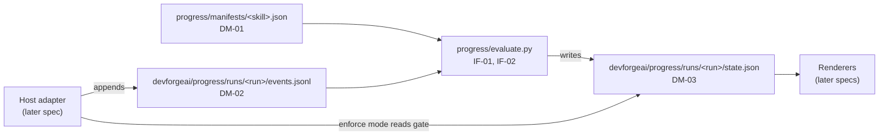

# SPEC-012 — Progress tracker core: formats, manifests and evaluator

## 1. Overview

Every DevForgeAI skill has a numbered checklist in its Workflow section, and tells Claude to copy it into its reply and tick steps off. Nothing checks those ticks. In one dogfood run, a brainstorm asked "no questions asked" wrote BRN-001 without asking the user anything (`/insights`, 2026-10-02). The design proposal `docs/specs/devforgeai-progress-ui.md` (draft, no ID) designs a tracker that judges each step by evidence, raises flags only at defined gates, and shows progress in the Claude Code CLI, the desktop app, VS Code and other tools.

This spec builds the part of that tracker that depends on no host:
- three JSON formats: a step **manifest** for each skill (DM-01), the **event log** a host adapter writes (DM-02), and the **progress state** the evaluator produces (DM-03);
- manifests for the brainstorm and architecture skills;
- `evaluate.py`, a Python evaluator with no dependencies outside the standard library, which turns a manifest and an event log into a progress state (IF-01, IF-02);
- its tests.

**The approach.** The evaluator is a pure function of the whole event log: each call reads the log from the start and computes the state again. So it needs no clock and keeps nothing between calls, the same log always gives the same state, and recorded logs make complete tests. It is standard-library Python, like the skills' validators, so any tool's adapter can run it and the Codex port can carry a copy. Manifests are JSON, which needs no YAML library.

**Layers.** The tracker follows DevForgeAI's adaptive model: a core set of skills and rules, then the project's own, then personal settings. ADR-003 already defines those layers for policy (framework defaults, organization, project, local preference), and ADR-006 brings the tracker and mods into them. In this spec that means manifests come in layers: the plugin's, then an organization's and a project's, which may add rules and manifests for their own skills but never remove or relax a rule (BEH-17). The user's mode, observe or enforce, is an adapter matter (ADR-006 D3).

**Out of scope,** each for a later spec:
- the Claude Code adapter: the mod that writes events from Claude Code's hooks, calls the evaluator, refuses at gates in enforce mode, and draws the status line and band;
- renderers: `Svg`, `Image` and `Raster` in Claude Code, and `progress.html` for any browser;
- `chain_state.py`, which reports the project's phases from `docs/specs/`;
- manifests for prd, epic, context, git and documents-updater (the formats already cover them);
- adapters for Codex and other tools.

**Version 2** (2026-10-02) makes rules of the build decisions §9 recorded, which Bryan adopted on 2026-10-02, and adds what the first live runs of the Claude Code adapter showed (SPEC-013 VER-15). In those sessions Claude Code offered no Glob or Grep tool, and Claude read files with Bash (`ls`, `cat`, `for f in …`) even where the Read tool was there, so read rules could be met only by ticks. Now a Bash command that names a read rule's path is read evidence (BEH-06), a skipped flag names the evidence its step expected (BEH-08), and architecture's step 5 gets an evidence rule through a new `exclude` field (DM-01).

**Version 3** (2026-10-02) changes where an answer window opens (BEH-09). The review of the version 2 build found
that a Bash listing Claude makes after the user's answer, to pick the next document's ID as the skills say, now
counted as an earlier step's evidence and moved the window past the answer, so the write the user had approved
was refused; a re-ticked checklist, and architecture's new step 5 rule, did the same. A window now opens at each
earlier step's first signal, and a conditional step that isn't the user's doesn't move it. A Read, Glob or Grep
path written `./docs/…` is read like `docs/…` (BEH-06).

**Version 4** (2026-10-02) narrows that change after a second review found its cost: counting only an earlier step's
first signal also credited answers the user never gave, as when Claude asked an intake question, ticked step 1
only after the answer, and wrote the BRN with promoted ideas. An earlier step now counts from the later of its first
tool evidence and its first tick, so a step Claude finishes after the answer still moves the window, while a
re-read, re-listing or re-tick of a finished step doesn't. Every tool's `./` path is read like the rest, Write and
Edit included (BEH-06).

**Version 5** (2026-10-03) stops inferring which step an answer belongs to when the host can say. Live runs showed
Claude narrating in thinking, which no hook sees, and ticking late or in bursts, so versions 2 to 4 still guessed;
but with Claude Code's task list, kept with explicit wording, every step's start and end was a tool call the
adapter records, and it held through a `/compact` (§9). A tracked skill now keeps its checklist in the host's task
list (§4, the task-list convention); an adapter records the list's changes as step events (DM-02); an answer counts
for the step in progress (BEH-18); and a question asked while no step is in progress is flagged at a new gate, the
question gate, which enforce mode refuses (BEH-08, BEH-11). Runs without a task list keep version 4's windows.

**Version 6** (2026-10-03) completes version 5's flag: DM-03 required every flag to name a write, report or end
gate and a step, which an unmarked-question flag has neither of. Its gate is now `question`, and its step is the
step the run would reach next, the one Claude most likely meant to start (BEH-08). Found while building version 5.

**Version 7** (2026-10-03) follows the build's review. A step marked started that later steps' work contradicts is no
longer in progress, so a mark Claude forgot, as after a compaction, no longer takes every later answer; the question
gate then has Claude mark the right step (BEH-18). A script run joined to another command with `;`, `|` or `&` is no
evidence, since its exit status is the other command's, and the flag says so (BEH-06, BEH-08). The build's readings
become rules: which runs the question gate applies to, which events it counts, and when the report gate fires.

**Version 8** (2026-10-03) withdraws version 7's stale started step (Bryan). The build's review found that a read
of a later step's files made a correct mark stale: a Glob of the ARCH folder while architecture's step 2 is
marked would have a valid "which PRD?" question refused in enforce mode. A step marked started is in progress
again until a step event ends it, as in versions 5 and 6 (BEH-18). The problem version 7 meant to solve, a
forgotten mark taking every later answer, is open again (§13). Version 7's other changes stand.

**Version 9** (2026-10-03) lets each question say which step it belongs to, instead of the tracker inferring it
from the task list's mark. A skill that follows the convention tags each question form with its step, in a field
the user never sees (AskUserQuestion's `metadata.source`, `devforgeai_step:N`), and shows the step in the question's
header, which the user does see. The adapter records the tag on the answer event (DM-02), and an answer counts for
the step in progress only when its tag names that step. A question with no tag, or tagged for a step other than
the one in progress, is a question gate (BEH-18), as a question asked while no step is in progress already was, and
its answer counts for no step. The tag is a check on the mark, never a placement of its own: Claude writes both, so
their agreement catches Claude contradicting itself, not a step wrong in both (§13). A question answered by a typed
message can't carry the tag, so its answer is still placed by the mark. With SPEC-013 versions 7 and 8 (a compaction hook, refusals that name a
forgotten mark), this answers §13's forgotten-mark item.

**Version 10** (2026-10-03) stops the question gate once every step of a run is reached. A run stays open until
another tracked skill loads or the session ends, so every later question, Claude's own follow-up or another
skill's, was refused as asked with no step marked. Such a question's answer still counts for no step, so a
decision written after it still needs an answer that counts (BEH-18).

**Version 11** (2026-10-04) records the waiver: a tracked skill whose request says to proceed without questions asks
once, at the start of the run, whether it should (SPEC-001 and SPEC-003), in a question tagged `devforgeai_waiver`
whose answer the adapter records as one of two fixed labels (SPEC-013). Until now a decision the request named while
saying to proceed without questions was flagged, and refused in enforce mode, because the request's text is never
logged (§13). The waiver answer is the user's choice made visible. A manifest marks the user-owned steps it may answer
(`waivable`, DM-01); only architecture's step 8, the outcome, is waivable (Bryan, 2026-10-04: "Step 8 only"). After a
"Proceed without questions" answer, step 8 counts as answered and the outcome may be written (BEH-19). Every other
user-owned decision still needs an answer. The evaluator can't tell whether the request really named the outcome:
the skill's own rule (SPEC-003 BEH-08) is the only check of that, a trade-off Bryan accepted.

**Version 12** (2026-10-05) adds a run-end reason, `stopped`: the user ended the run on purpose, as with
architecture's "Write nothing" at step 8 (SPEC-003 BEH-08), which the adapter records (SPEC-013 version 12). A
stopped run closes like any ended run: the steps after the last one reached stay pending and are never flagged
(BEH-12). Before, such a run stayed open with steps 9 to 11 pending (Bryan, 2026-10-05: "a deliberate write
nothing should count as finished"). A manifest marks the steps whose answer may stop the run (`stoppable`, DM-01);
only architecture's step 8 is stoppable (Bryan, 2026-10-05: "Manifest flag, step 8 only").

**Version 13** (2026-10-05) adds the run-end reason `returned`: a skill Claude loaded in the middle of another skill's
run handed back to it (SPEC-013 version 14, nested runs; Bryan, 2026-10-05: "New reason 'returned'"). A returned run
closes like any ended run (BEH-12).

**Version 14** (2026-10-05) lets a run carry on from an earlier one (SPEC-013 version 16; Bryan, 2026-10-05: "Carry
them over"). A run's first event can name the earlier run it continues and the steps that run reached; those steps
count as reached in the new run, shown as carried, so the new run's gates judge only the work from the step it goes on
at (BEH-20). The earlier run's log is never changed: a run-end closed it (BEH-12).

## 2. Constraints

- **The chain's order** (ADR-002, and ADR-004 D5 for the context step) fixes the state's `next` step (BEH-13).
- **Decisions are the user's** (PRD-001 FR-003). The evaluator decides nothing and writes no document. For a step whose decision belongs to the user, it checks that a document written without the user's answer left that decision open (BEH-10). Brainstorm's rule comes from SPEC-001 VER-02; architecture's from SPEC-003, as SKL-003 implements it: an ADR is `accepted` only when the user picked an option at step 7, and the ARCH's `outcome` stays `null` until the user confirms it at step 8, which accepts no decision.
- **Layers** (ADR-003 A3 and A4; ADR-006 D2, D4 and D5): manifests apply framework first, then organization, then project; a later layer only adds; a disallowed change stops evaluation; the state records which files applied. Content rules for user-owned steps are framework requirements, so no layer weakens them. ADR-006 was accepted on 2026-10-02.
- **Handoffs name the next step** (PRD-001 FR-004). `next` reports the chain's next step for a renderer to suggest; it doesn't read or replace the skill's own handoff.
- **Repository conventions** (Bryan, 2026-10-02):
  - source code lives under `src/`, in each plugin where it applies, so the evaluator, schemas and manifests are part of the `devforgeai` plugin;
  - a plugin's tests live in `src/tests/<name>/`, so they don't deploy (`.claude/rules/skills.md`);
  - operational files live in the project root's `devforgeai/` folder (§4, "Operational files");
  - manifests are JSON.
- **The standard library only,** as brainstorm's `validate_brn.py` is (SPEC-001 BEH-09): the evaluator must run under `python3 -S` (QR-01).

## 3. Architecture and components



| Path | Holds | Deploys |
| --- | --- | --- |
| `src/claude/DevForgeAI/progress/evaluate.py` | the evaluator and its two commands (IF-01, IF-02) | yes |
| `src/claude/DevForgeAI/progress/schemas/manifest.schema.json`, `events.schema.json`, `progress.schema.json` | DM-01 to DM-03 as JSON Schema 2020-12, for tests and for other tools; the evaluator itself doesn't load them (QR-01) | yes |
| `src/claude/DevForgeAI/progress/manifests/brainstorm.json`, `architecture.json` | the two manifests (DM-01), bound to each skill's checklist by its hash (VER-01) | yes |
| `src/tests/progress/test_evaluate.py` | the unit tests | no |
| `src/tests/progress/cases/<case>/events.jsonl`, `expected.json`, and `manifests/` when a case needs its own | recorded event logs and the states they must produce | no |

- **A folder at the plugin's top level is safe.** The plugin already carries a top-level `evals/` folder that is no plugin component, and it loads (deployed as 0.10.0).
- **Manifests live in the progress component, not in `skills/<skill>/references/`.** `.claude/rules/skills.md` requires a version bump of a skill on any change to its references, which would bump six approved skills and reopen their qualification for a file none of them reads. Each manifest is bound to its skill by the checklist's hash instead (BEH-04, VER-01). Moving manifests into the skills is the shipping spec's choice.
- **Layered manifests** come from more folders than the plugin's, passed to IF-01 in layer order: an organization's, vendored into `devforgeai/manifests/organization/`, and a project's, in `devforgeai/manifests/`, both tracked in git (ADR-006 D4).
- **The Codex port keeps its own fork** of `progress/`, as it does for brainstorm's validator (D-03); Codex sessions build it (Bryan, 2026-10-02). The formats are the shared contract, so both read the same manifests and event logs.

## 4. Data model

**Checklist hash.** The step list comes from the skill's checklist block. Every line matching `^\s*- \[ \] (\d+)\. (.+?)\s*$` is rebuilt as `- [ ] N. Title`. The rebuilt lines are joined with `\n`, encoded as UTF-8 and hashed with SHA-256, written `sha256:<64 hex digits>`. Leading and trailing whitespace and the surrounding fence don't change the hash; a changed step number or title does.

**Field values in a written document,** read by content rules (BEH-10): a line matching `^\s*(?:-\s+)?<field>:\s*["']?([^\s"'#,}]+)` gives one value. With scope `frontmatter`, only the lines between the file's first two `---` lines are read; with `anywhere`, every line. Values are compared as text (`null` is the text `null`). This reads lines, not YAML, so the evaluator stays standard-library only.

```json
{
  "x-item-id": "DM-01",
  "$schema": "https://json-schema.org/draft/2020-12/schema",
  "title": "Step manifest (devforgeai-manifest/1), progress/manifests/<skill>.json",
  "type": "object",
  "required": ["format", "skill", "checklistHash", "steps"],
  "additionalProperties": false,
  "properties": {
    "format": {"const": "devforgeai-manifest/1"},
    "skill": {"type": "string", "pattern": "^[a-z][a-z0-9-]*$", "description": "the skill's name without the plugin prefix: brainstorm, not devforgeai:brainstorm"},
    "checklistHash": {"type": "string", "pattern": "^sha256:[0-9a-f]{64}$"},
    "steps": {
      "type": "object",
      "propertyNames": {"pattern": "^[1-9][0-9]?$"},
      "additionalProperties": {"$ref": "#/$defs/step"}
    },
    "contentRules": {"type": "array", "items": {"$ref": "#/$defs/contentRule"}},
    "source": {"type": "string", "description": "for a vendored organization manifest: its origin repository and ref (ADR-003 A3)"}
  },
  "$defs": {
    "step": {
      "type": "object",
      "required": ["title", "kind", "need"],
      "additionalProperties": false,
      "properties": {
        "title": {"type": "string"},
        "kind": {"enum": ["read", "think", "ask", "forge", "inspect", "report"]},
        "need": {"enum": ["required", "conditional", "text-only"]},
        "when": {"type": "string", "description": "for a conditional step: when it applies, shown as the note when it doesn't"},
        "userOwned": {"type": "boolean", "default": false},
        "waivable": {"type": "boolean", "default": false, "description": "version 11: a user-owned step that a recorded Proceed waiver answers (BEH-19)"},
        "stoppable": {"type": "boolean", "default": false, "description": "version 12: a user-owned step whose answer 'Write nothing' ends the run as stopped (SPEC-013 BEH-27)"},
        "gate": {"enum": ["write", "report"]},
        "evidence": {"type": "array", "items": {"$ref": "#/$defs/rule"}}
      },
      "allOf": [{"if": {"properties": {"need": {"const": "conditional"}}}, "then": {"required": ["when"]}},
                {"if": {"properties": {"waivable": {"const": true}}, "required": ["waivable"]}, "then": {"properties": {"userOwned": {"const": true}}, "required": ["userOwned"]}}]
    },
    "rule": {
      "type": "object",
      "required": ["type"],
      "additionalProperties": false,
      "properties": {
        "type": {"enum": ["script", "answer", "write", "read"]},
        "pattern": {"type": "string", "description": "script: a file-name pattern; write and read: a path pattern relative to the project root, and a pattern ending in / means anything inside that folder"},
        "exclude": {"type": "array", "items": {"type": "string"}, "minItems": 1, "description": "read rules only: path patterns, written as pattern is; a path or token that matches any of them is no evidence for the rule"},
        "exit": {"type": "integer", "default": 0},
        "target": {"const": "written", "description": "the path or command must name a file written at the run's write gate"}
      },
      "allOf": [{"if": {"properties": {"type": {"enum": ["script", "write", "read"]}}}, "then": {"required": ["pattern"]}},
                {"if": {"properties": {"type": {"enum": ["script", "answer", "write"]}}}, "then": {"not": {"required": ["exclude"]}}}]
    },
    "contentRule": {
      "type": "object",
      "required": ["step", "path", "field", "scope", "allowed"],
      "additionalProperties": false,
      "properties": {
        "step": {"type": "integer", "minimum": 1, "description": "the user-owned step whose answer the field's other values need"},
        "path": {"type": "string"},
        "field": {"type": "string", "pattern": "^[a-z_]+$"},
        "scope": {"enum": ["frontmatter", "anywhere"]},
        "allowed": {"type": "array", "items": {"type": "string"}, "minItems": 1, "description": "the values allowed without the user's answer"}
      }
    }
  }
}
```

```json
{
  "x-item-id": "DM-02",
  "$schema": "https://json-schema.org/draft/2020-12/schema",
  "title": "Event (devforgeai-events/1): one JSON object per line of events.jsonl",
  "type": "object",
  "required": ["run", "seq", "time", "kind"],
  "properties": {
    "run": {"type": "string", "pattern": "^[0-9]{8}T[0-9]{6}Z-[a-z][a-z0-9-]*-[0-9a-f]{8}$"},
    "seq": {"type": "integer", "minimum": 1},
    "time": {"type": "string", "format": "date-time"},
    "kind": {"enum": ["skill-loaded", "tool", "answer", "prompt", "reply", "turn", "run-end", "step"]}
  },
  "allOf": [
    {"if": {"properties": {"kind": {"const": "skill-loaded"}}},
     "then": {"required": ["format", "skill", "checklist"],
              "properties": {"format": {"const": "devforgeai-events/1"}, "skill": {"type": "string"},
                             "checklist": {"type": "string", "description": "the skill's prompt as loaded, or at least its checklist block"},
                             "host": {"type": "string", "description": "for example claude-code 2.1.287"},
                             "taskList": {"type": "boolean", "description": "the host offers a task list the skill can keep its steps in (version 5)"},
                             "resumes": {"type": "string", "pattern": "^[0-9]{8}T[0-9]{6}Z-[a-z][a-z0-9-]*-[0-9a-f]{8}$", "description": "the earlier run this run continues (version 14, BEH-20)"},
                             "carried": {"type": "array", "items": {"type": "integer", "minimum": 1}, "uniqueItems": true, "description": "the steps the earlier run reached, carried into this run (version 14, BEH-20)"}}}},
    {"if": {"properties": {"kind": {"const": "tool"}}},
     "then": {"required": ["tool"],
              "properties": {"tool": {"type": "string"},
                             "path": {"type": "string", "description": "relative to the project root, with / separators; for Glob and Grep, the pattern or search path"},
                             "command": {"type": "string"}, "exit": {"type": ["integer", "null"]}, "error": {"type": "boolean"},
                             "content": {"type": "string", "description": "a Write's content, or the file an Edit will leave; optional"}}}},
    {"if": {"properties": {"kind": {"const": "answer"}}},
     "then": {"required": ["answered"], "properties": {"answered": {"type": "boolean", "description": "false when the question was dismissed"}, "step": {"type": "integer", "minimum": 1, "description": "the step the question named in its tag, devforgeai_step:N (version 9)"}, "outside": {"type": "boolean", "description": "true when the question's source names something other than the convention's tag: it isn't the checklist's (version 9)"}, "waiver": {"enum": ["proceed", "ask", "other"], "description": "set on every answer to the waiver question, a single question tagged devforgeai_waiver, answered or not: which of its two fixed labels was picked, proceed (Proceed without questions) or ask (Ask me as usual), or other for anything typed and for a dismissal (version 11)"}}}},
    {"if": {"properties": {"kind": {"const": "reply"}}},
     "then": {"required": ["text"], "properties": {"text": {"type": "string"}}}},
    {"if": {"properties": {"kind": {"const": "step"}}},
     "then": {"required": ["step", "state"],
              "properties": {"step": {"type": "integer", "minimum": 1}, "state": {"enum": ["started", "done"]}}}},
    {"if": {"properties": {"kind": {"const": "turn"}}},
     "then": {"required": ["phase"], "properties": {"phase": {"enum": ["start", "end"]}}}},
    {"if": {"properties": {"kind": {"const": "run-end"}}},
     "then": {"required": ["reason"], "properties": {"reason": {"enum": ["another-skill", "session-end", "clear", "idle", "stopped", "returned"]}}}}
  ]
}
```

A `prompt` event records only that the user sent a prompt; its text is never logged.

```json
{
  "x-item-id": "DM-03",
  "$schema": "https://json-schema.org/draft/2020-12/schema",
  "title": "Progress state (devforgeai-progress/1), state.json",
  "type": "object",
  "required": ["format", "run", "skill", "manifest", "through", "ended", "current", "steps", "flags", "gate", "next", "counts", "waiver"],
  "additionalProperties": false,
  "properties": {
    "format": {"const": "devforgeai-progress/1"},
    "run": {"type": "string"},
    "skill": {"type": "string"},
    "manifest": {
      "type": "object", "required": ["state", "manifestHash", "checklistHash", "layers"], "additionalProperties": false,
      "properties": {"state": {"enum": ["matched", "stale", "none", "unverified"]},
                     "manifestHash": {"type": ["string", "null"]}, "checklistHash": {"type": ["string", "null"]},
                     "layers": {"type": "array", "items": {"type": "string"}, "description": "the manifest files applied, in layer order, as their paths were given (ADR-006 D5)"}}
    },
    "through": {"type": "integer", "minimum": 0, "description": "the seq of the last event evaluated"},
    "ended": {"type": ["string", "null"], "description": "the run-end reason, or null while the run is open"},
    "waiver": {"enum": ["proceed", "ask", "other", null], "description": "the run's waiver answer, the first answered one (BEH-19), or null when there is none (version 11)"},
    "current": {"type": ["integer", "null"]},
    "steps": {"type": "array", "items": {"$ref": "#/$defs/step"}},
    "flags": {"type": "array", "items": {"$ref": "#/$defs/flag"}},
    "gate": {"$ref": "#/$defs/gate"},
    "next": {
      "type": ["object", "null"], "additionalProperties": false, "required": ["skill", "available", "note"],
      "properties": {"skill": {"type": "string"}, "available": {"type": "boolean"}, "note": {"type": "string"}}
    },
    "phases": {"description": "copied from --phases unchanged; a later spec defines it"},
    "counts": {
      "type": "object", "additionalProperties": false,
      "required": ["events", "malformed", "outOfOrder", "duplicates", "unknownClaims", "afterEnd", "stepEvents", "unmarkedQuestions"],
      "properties": {"events": {"type": "integer"}, "malformed": {"type": "integer"}, "outOfOrder": {"type": "integer"}, "duplicates": {"type": "integer"},
                     "unknownClaims": {"type": "integer"}, "afterEnd": {"type": "integer"},
                     "stepEvents": {"type": "integer", "description": "the run's step events naming a step the checklist has (version 5; version 7 says which)"},
                     "unmarkedQuestions": {"type": "integer", "description": "answer events at a question gate (version 5); since version 9 the unmarked, untagged and mismatched ones alike"}}
    }
  },
  "$defs": {
    "step": {
      "type": "object", "additionalProperties": false,
      "required": ["n", "title", "kind", "need", "userOwned", "state", "evidence", "claim", "note"],
      "properties": {
        "n": {"type": "integer"}, "title": {"type": "string"},
        "kind": {"enum": ["read", "think", "ask", "forge", "inspect", "report", null]},
        "need": {"enum": ["required", "conditional", "text-only"]},
        "userOwned": {"type": "boolean"},
        "stoppable": {"type": "boolean", "description": "version 12: present, and true, when the manifest marks the step stoppable (BEH-12)"},
        "state": {"enum": ["pending", "current", "your-turn", "done", "claimed", "unconfirmed", "skipped-with-reason", "not-applicable", "skipped", "rule-broken", "carried"]},
        "evidence": {"type": "array", "items": {
          "type": "object", "additionalProperties": false, "required": ["seq", "type", "strength", "detail"],
          "properties": {"seq": {"type": "integer"}, "type": {"enum": ["script", "answer", "write", "read", "waiver", "carried"]},
                         "strength": {"enum": ["strong", "medium"]}, "detail": {"type": "string"}}}},
        "claim": {"type": ["object", "null"], "additionalProperties": false, "required": ["seq", "state", "reason"],
                  "properties": {"seq": {"type": "integer"}, "state": {"enum": ["done", "skipped"]}, "reason": {"type": ["string", "null"]}}},
        "note": {"type": "string"}
      }
    },
    "flag": {
      "type": "object", "additionalProperties": false, "required": ["gate", "seq", "step", "type", "message"],
      "properties": {"gate": {"enum": ["write", "report", "end", "question"]}, "seq": {"type": "integer"}, "step": {"type": "integer"},
                     "type": {"enum": ["skipped", "claimed-not-evidenced", "rule-broken", "unmarked-question", "mismatched-question", "untagged-question"]}, "message": {"type": "string"}}
    },
    "gate": {
      "type": "object", "additionalProperties": false, "required": ["kind", "seq", "refuse", "reason"],
      "properties": {"kind": {"enum": ["write", "report", "end", "question", null]}, "seq": {"type": ["integer", "null"]},
                     "refuse": {"type": "boolean"}, "reason": {"type": ["string", "null"]}}
    }
  }
}
```

**The two manifests.** Their titles are the skills' checklist lines; their `checklistHash` is computed from each `SKILL.md` in `src/` (VER-01).

| Skill | Step | kind, need | Evidence | Gate, user-owned |
| --- | --- | --- | --- | --- |
| brainstorm | 1 | read, required | read `docs/specs/brainstorm/` | |
| | 2, 3, 4 | think, text-only | none | |
| | 5 | ask, required | answer | user-owned |
| | 6 | forge, required | write `docs/specs/brainstorm/BRN-*.md` | write gate |
| | 7 | inspect, required | script `validate_brn.py`, exit 0, target written | |
| | 8 | report, required | none | report gate |
| architecture | 1 | read, required | script `validate_policy.py`, exit 0 | |
| | 2 | read, required | read `docs/specs/prd/` | |
| | 3 | read, required | read `docs/specs/prd/PRD-*.md` | |
| | 4 | read, required | read `docs/specs/arch/` | |
| | 5 | read, conditional: "the user named paths to inspect" | read `*` except `docs/specs/`, `.claude/` and `devforgeai/` | |
| | 6 | think, text-only | none | |
| | 7 | ask, conditional: "a question isn't settled by mandated policy or an accepted ADR" | answer | user-owned |
| | 8 | ask, required | answer | user-owned, waivable (version 11), stoppable (version 12) |
| | 9 | forge, required | write `docs/specs/arch/ARCH-*.md` or `docs/specs/adr/ADR-*.md` | write gate |
| | 10 | inspect, required | read, target written | |
| | 11 | report, required | none | report gate |

Content rules:

| Skill | Step | Files | Field, scope | Allowed without the user's answer |
| --- | --- | --- | --- | --- |
| brainstorm | 5 | `docs/specs/brainstorm/BRN-*.md` | `disposition`, anywhere | `open` |
| brainstorm | 5 | `docs/specs/brainstorm/BRN-*.md` | `status`, frontmatter | `draft` |
| architecture | 7 | `docs/specs/adr/ADR-*.md` | `status`, frontmatter | `proposed` |
| architecture | 8 | `docs/specs/arch/ARCH-*.md` | `outcome`, frontmatter | `null` |

Architecture's step 10 is weak evidence: ERR-05 comes from the skill's own self-check, which has no script, so reading each written file back, with Read or a Bash command naming it (BEH-06), is the only trace it leaves. Step 5's rule takes a read of any path outside `docs/specs/`, `.claude/` (Claude Code's settings and the local preference file) and `devforgeai/` (the tracker's own files). Its pattern begins with a wildcard, so a Read, Glob or Grep meets it but a Bash token never does (BEH-06); a tick still does too.

**The task-list convention** (version 5; Bryan, 2026-10-03). A tracked skill keeps its checklist in the host's task
list when the host has one:
- one task per checklist step, titled `<N>. <title>` and, where the host allows, tagged `devforgeai_step: N`;
- before it asks the user any question, it marks the step the question belongs to as in progress;
- it never puts two steps' questions in one question form;
- it tags each question form with the step it belongs to, where the host allows: in Claude Code, AskUserQuestion's
  `metadata.source` is `devforgeai_step:N`, which the user never sees (version 9); a question asked in plain text
  and answered by a typed message can't carry the tag;
- a question that isn't part of the checklist, such as one another command asks, carries a source of its own (in
  Claude Code, any `metadata.source` that doesn't start with `devforgeai_step`); it counts for no step (version 9);
- it shows the step on each question where the host gives a question a visible header: in Claude Code, each
  AskUserQuestion question's `header` is `Step N`, so the user sees which step the answer is for (version 9; the
  tracker doesn't read it);
- it marks each step done as soon as the step is done, one at a time.

Without a task list it ticks steps in its reply text as before (BEH-05). An adapter turns the list's changes into
step events (DM-02); how it reads them is its own spec's business (SPEC-013 for Claude Code). The skill's text names
the tag `devforgeai_step`, which tells the evaluator the skill follows the convention (BEH-18). Each tracked skill's
spec cites this paragraph; skills without a manifest needn't follow it.

**When a run doesn't keep its list** (version 5; Bryan, 2026-10-03: don't let Claude go on; flag it and fix the
skill). The tracker answers at three levels:
1. *In the run.* Each question asked while no step is in progress, tagged for a step other than the one in
   progress, or not tagged with a step of the checklist (unless its source says it isn't the checklist's), is a
   question gate (BEH-18): flagged, and in enforce mode refused, with a
   refusal that says how to recover: turn the skill's checklist into the task list if there is none, mark the
   question's step in progress, tag the question with it, and ask again (SPEC-013 for Claude Code).
2. *At the run's end.* The state counts the run's step events and its questions at a question gate (DM-03 `counts`;
   `unmarkedQuestions`, named in version 5, counts all three kinds of question gate since version 9), so a run that
   followed the convention but kept no list, or asked questions outside its marked steps, is visible however the run ended; an
   adapter tells the user so once, in either mode, and recommends that the user fix the skill (Bryan, 2026-10-03).
3. *Across runs.* A tracked skill whose runs break the convention has a defect in its own text, not in the run: the
   user fixes the skill so it keeps the task list. A project's own skill is the user's to edit; one of DevForgeAI's
   skills is fixed through the plugin's skill-change process (its spec, a version bump of the skill, and
   requalification). Each tracked skill's eval suite holds a case that checks the convention where the eval
   host offers a task list, so a fix is proven and a regression caught before it ships. Each skill's spec names
   that case.

**Operational files.** A host adapter writes a run's files under the project root's `devforgeai/` folder:
- `devforgeai/progress/runs/<run>/events.jsonl`: the event log (DM-02), appended by the adapter;
- `devforgeai/progress/runs/<run>/state.json`: the evaluator's output (DM-03), written through `--out`;
- `devforgeai/progress/current.json`: a copy of the active run's state, for renderers.

`devforgeai/progress/` is gitignored by default (Bryan, 2026-10-02): its files are per session working data. The adapter writes the `.gitignore` entry (its spec). `devforgeai/manifests/` stays tracked.

A run ID is `<UTC time as yyyymmddThhmmssZ>-<skill>-<8 hex digits>`. The evaluator writes only `--out` (QR-04); creating and copying these files is the adapter's job.

## 5. Interfaces and contracts

`evaluate.py` is run as `python3 <plugin>/progress/evaluate.py <command> …`:

| Item | Command | Behaviour |
| --- | --- | --- |
| IF-01 | `evaluate --manifests DIR [--manifests DIR …] --events FILE --out FILE [--root DIR] [--phases FILE]` | `--manifests` may repeat, in layer order: the plugin's folder first, then an organization's, then a project's (BEH-17). Reads `FILE` (DM-02) and each folder's `<skill>.json` (DM-01), writes the state (DM-03) to `--out`, and prints one summary line. `--root` is the project root, for reading written files that carry no `content`. Exit 0 when the state is written, with or without flags; flags are data, never an exit status. Exit 2 when it can't run (ERR-03, ERR-04, ERR-07, ERR-08), with one line on stderr naming the file and the reason |
| IF-02 | `check --manifests DIR --skill NAME --checklist FILE` | Hashes the checklist in `FILE` (a `SKILL.md`, or any text holding the block) and compares it with `DIR/NAME.json`. Prints `matched <hash>`, `stale manifest <hash> checklist <hash>` or `none <hash>`. Exit 0 when matched, 1 when stale or none, 2 when it can't run |

## 6. Behavior

```yaml items
behaviors:
  - id: BEH-01
    status: active
    rule: "The evaluator is a pure function. Each IF-01 call reads the whole event log and computes the state from it, the manifest, the optional phases file and, with --root, the files written at the write gate. It keeps nothing between calls and reads no clock."
  - id: BEH-02
    status: active
    rule: "Events are taken in seq order (ERR-02). The first must be skill-loaded (ERR-03). An event whose run differs from the first event's is ignored and counted as malformed."
  - id: BEH-03
    status: active
    rule: "The step list and its hash come from the skill-loaded event's checklist text, as §4 defines; IF-02 uses the same function."
  - id: BEH-04
    status: active
    rule: "The evaluator loads <manifests>/<skill>.json. When its checklistHash equals the event's, manifest.state is matched and every rule below applies. When they differ, it is stale; with no manifest file, none; with no checklist lines in the event, unverified, which uses the manifest and notes that the checklist wasn't seen. In stale and none, the steps come from the event's checklist with kind null and need text-only, and are tracked by claims only: no gates, no flags, and a note on the first step saying the manifest is out of date or missing."
  - id: BEH-05
    status: active
    rule: "Claims come from reply events. A line matching ^\\s*[-*]\\s*\\[[xX]\\]\\s*(\\d+)\\. claims step N done. A line matching ^\\s*[-*]\\s*\\[[ xX]\\]\\s*(\\d+)\\..*\\(skipped:\\s*(.+?)\\)\\s*$ claims step N skipped, with that reason. A line that matches both patterns is a skipped claim. A later claim for a step replaces an earlier one. An unticked box claims nothing. A step event (DM-02) with state done claims its step done, as a tick does, and a later tick or done step event replaces an earlier claim."
  - id: BEH-06
    status: active
    rule: "A tool event is evidence for a step's rule when: script: the tool is Bash, a token of the command (a word split at whitespace) has a file name matching the pattern, exit equals the rule's exit (0 by default), and the command holds no ;, no | (|| included), no line break and no & that sends a command to the background (&& and redirections such as 2>&1 are fine), since each of those makes the command's exit status another command's (version 7: such a run is no evidence, and BEH-08's flag names it); write: the tool is Write or Edit and path matches the pattern; read: the tool is Read, Glob or Grep and path matches the pattern, or the tool is Bash, exit equals the rule's exit (0 by default) and a read token of the command matches the pattern; and, with target written, the path, the matching read token or, for a script, any token names a file written at the run's write gate. A path or token matches a pattern when it matches it as text, so a Glob of docs/specs/prd/PRD-*.md matches that same pattern, or lies inside it when the pattern ends in /, and matches none of the rule's exclude patterns. Every tool event's path is read with a leading ./ removed, as a token is, since an adapter can record a Glob at the project root as ./<pattern> and a host may pass a Write's relative path as written; a Write or Edit so read reaches the write gate and the content rules. Patterns are relative to the project root, so a path or token that, after --root's prefix is removed from a token, still starts with / or ../ matches none: an adapter records a file outside the root, such as the plugin's own references, with its absolute path. A command's read tokens are its words split at whitespace, with every quote character removed, the characters ; ( ) stripped from both ends, a leading ./ removed and, with --root, the root's path and the / after it removed from the start. Only a rule whose pattern has no wildcard (*, ? or [) in its first path segment takes Bash read evidence, since a token such as cat matches a pattern of *. Any command that names the path counts, rm and a > redirect too: the tracker judges whether a step's files were looked at, not what the command did. A tool event with error true is never evidence. An answer event with answered true and no waiver field, or a prompt event, inside the step's answer window (BEH-09) is answer evidence; a waiver answer never is (BEH-19, version 11). Script and answer evidence are strong; write and read are medium. One event can be evidence for several steps."
  - id: BEH-07
    status: active
    rule: "While the run is open, a step is done when it has evidence, or when it is claimed done and has no strong rule; claimed when it is claimed done, has a strong rule and has no evidence yet; skipped-with-reason when it is claimed skipped; otherwise pending. A step is reached when it has evidence or a claim, whatever its state. current is the step after the highest-numbered reached step (step 1 when none is reached), or null once the last step is reached or the run has ended; it shows as current, or as your-turn when it is user-owned, has no answer counted for it (BEH-09 or BEH-18), and the last event is a turn end. A step before current that is still pending keeps the note 'not seen yet' and raises no flag. In a run with step events, current is the step in progress (BEH-18); when none is, the rule above applies. A conditional step marked done by a step event with no evidence is not-applicable, with its when text as the note, since the skill found it didn't apply; a later done tick, as a checklist restated after a compaction gives, leaves it so, and a skipped tick makes it skipped-with-reason (version 7)."
  - id: BEH-08
    status: active
    rule: "Flags are raised only at gates. The write gate is the first tool event that is write evidence for the step with gate write; the report gate is the first claim of the step with gate report done, a reply's tick or a done step event (BEH-05); the run's end is the run-end event. At a gate, for every step before the gate's step (at run end, every step up to the highest reached): a required step still pending becomes skipped, with a skipped flag (its message is below); a claimed step keeps its state and gets a claimed-not-evidenced flag; a conditional step still pending becomes not-applicable, with its when text as the note; a text-only step still pending becomes unconfirmed, with no flag; a user-owned step follows BEH-10. A step whose evidence arrives after a later step's is noted 'seen late (after step K)' and never flagged. Flags record what each gate found: evidence that arrives later changes the step's state, not an earlier flag. A step gets at most one skipped and one claimed-not-evidenced flag in a run, so a later gate that finds the same raises no second one (rule-broken flags stay one per write and rule, BEH-10). The skipped flag's message is 'step N (<title>) has no evidence or tick before <G>: expected <E>', where <G> is the write gate, the report or the run ended; a claimed-not-evidenced flag's is 'step N (<title>) is ticked, but <E> wasn't seen'. <E> lists the step's evidence rules joined by ' or ': 'a read of <pattern>' (with ' except ' and its exclude patterns joined by ', ' when it has them), 'a write of <pattern>', 'a successful run of <pattern>' (with ' on a written file' for target written) and 'an answer from you'. In a skipped flag, ', or a tick in the reply text' follows <E> when the step has no strong rule, and a step with no rule has the <E> 'a tick in the reply text'. When a Bash command named a step's script but joined it to another so (BEH-06), the step's skipped or claimed-not-evidenced flag reads instead 'step N (<title>): <script> ran, but the command joined it to another, which hides its exit status: run it as a command of its own', <script> being the file name the command named (version 7). In a run that follows the task list (BEH-18), each answer event that BEH-18 makes a question gate is also a gate: it checks no step and raises one flag of its own, of gate question. An unmarked-question flag (no step in progress) reads 'a question was asked while no step was marked in progress in the task list: mark the step it belongs to in progress, then ask'; a mismatched-question flag (tagged for step N while step K is in progress) reads 'a question for step N was asked while step K was marked in progress: mark step N in progress, then ask'; an untagged-question flag (a step in progress, and no tag naming a step of the checklist) reads 'a question was asked without naming a step of the checklist: tag it with devforgeai_step:N for the step it belongs to, mark that step in progress, then ask' (version 9). The flag names the question's tagged step when it has one; an untagged question's flag names the step in progress, or, when none is, the step after the highest reached at that seq, or the last step when every step is reached (versions 6 and 9)."
  - id: BEH-09
    status: active
    rule: "Answers that BEH-18 doesn't place are placed as follows. A user-owned step's answer window closes at the first of: the gate that checks the step, and any tool evidence or claim of a later step. It opens at the latest start of any step before it, leaving out a conditional step that isn't user-owned (at skill-loaded when there is none), where a step's start is the later of its first tool evidence and its first claim, counting only those before that close (whichever it has, when it has one). So a re-read, a re-listing or a re-tick of a finished earlier step, as Claude makes when it picks a document's ID or restates its checklist, doesn't move the opening, while an earlier step Claude ticks only after the answer does, since the answer came while that step was under way; a conditional step's work, such as architecture's inspection, can come at any time and doesn't move it; and answers don't move it. Answers and prompts are assigned in seq order, in two passes; an answer event carrying waiver is never assigned, in any run (BEH-19, version 11). In the first, a claim of the step itself also closes its window, and each answer goes to the earliest user-owned step whose window holds it, so several answers can count for one step (architecture's step 7 takes one per question) and a tick of that step hands the next answer to the following one. In the second, each answer still unassigned goes to the earliest user-owned step whose window holds it without its own claim, so an answer that follows the reply in which Claude ticked the step and asked still counts for it."
  - id: BEH-10
    status: active
    rule: "From the write gate on, every Write or Edit whose path matches a content rule is checked. When the rule's step has an answer counted for it (BEH-09 or BEH-18), or a Proceed waiver answers it (BEH-19), the step is done and the rule doesn't apply: an answer satisfies it whatever it said, because the evaluator can't read the decision. Otherwise the field's values are read from the event's content, else from the file under --root, else the check is unverifiable (ERR-05). When every value is allowed, or the field is absent, the step is not-applicable with the note 'no answer; left open', and nothing is flagged. When a value isn't allowed, the step becomes skipped with a skipped flag, and the gate's step becomes rule-broken with a rule-broken flag naming the file, the field and the value. At the report gate or the run's end, a user-owned step with no answer and no write that broke its rules is not-applicable, with the note 'no answer; left open', unless its content couldn't be checked: then it keeps its state and ERR-05's note."
  - id: BEH-11
    status: active
    rule: "gate holds the most recent gate check: its kind, its event's seq, refuse (true when that check raised any flag) and reason (the first such flag's message). Before any gate, kind and seq are null and refuse is false. An adapter in enforce mode refuses the tool call at that seq when refuse is true; the evaluator never refuses anything itself. The question gate (BEH-18) refuses whenever it raises its flag, so an adapter in enforce mode refuses a question asked while no step is in progress."
  - id: BEH-12
    status: active
    rule: "A run-end event closes the run: ended holds its reason, and later events are ignored and counted in counts.afterEnd. Steps after the highest step reached stay pending with the note 'not reached' and are never flagged. The reason stopped (version 12) is the user's deliberate stop of the run (SPEC-013 BEH-27) and closes it the same way; so does the reason returned (version 13): a nested run that handed back to a run paused beneath it (SPEC-013 BEH-30). A manifest step with stoppable true (DM-01) gives its state step stoppable true (DM-03); other steps carry no stoppable field."
  - id: BEH-13
    status: active
    rule: "When the report step is done or the run has ended, next names the chain's following skill in the order brainstorm, prd, architecture, context, epic, story (ADR-002; ADR-004 D5 places context). The story skill isn't built, so its next has available false and the note 'the story skill isn't built yet (SPEC-009)'. Otherwise next is null."
  - id: BEH-14
    status: active
    rule: "The state is JSON with sorted keys, two-space indentation and a final newline, written to a temporary file in --out's folder and then renamed over --out. Paths stay as the events gave them, never made absolute. stdout gets one line: 'progress <skill>: step <current> of <steps>, <n> flags'; when current is null, 'all <steps> steps reached' or 'ended (<reason>)' takes the place of the step; ', refuse' is appended when gate.refuse is true."
  - id: BEH-15
    status: active
    rule: "With --phases, the file's JSON is copied into phases unchanged. Without it, the state has no phases key."
  - id: BEH-16
    status: active
    rule: "IF-02 computes the checklist hash of its file by §4's function and compares it with the manifest's checklistHash; it reads nothing else."
  - id: BEH-17
    status: active
    rule: "Manifests are read from each --manifests folder in the order given. The first folder that has <skill>.json gives the base manifest; so a project's own skill, which the plugin doesn't have, gets its manifest from the project's folder. Each later file for the same skill must carry the same skill and checklistHash, and may only add: evidence rules on a step, a gate on a step that had none, userOwned true, a stricter need (text-only or conditional to required), and content rules. It may not remove or change anything the earlier layers set; a step's title and kind stay as they are. So a later file restates the earlier layers in full: every earlier step, with the same title and kind, an equal or stricter need, userOwned and any gate kept, and its when text unchanged while it stays conditional; every earlier evidence and content rule; and no new step. The result applies as one manifest, and manifest.layers lists every file used, in order. A later file that would remove or relax a rule, or that carries another skill or checklistHash, stops evaluation (ERR-09). waivable true relaxes a user-owned step, so only the base manifest may set it: a later file must keep each step's waivable as the earlier layers set it, and one that sets it true where they didn't stops evaluation the same way (version 11)."
  - id: BEH-18
    status: active
    rule: "Step events place answers: in a run with any step event, each answer and prompt goes to the step in progress at its seq, the step whose latest step event before it is started (the latest started when several are). A mark stands until a step event ends it: version 7's rule that later work makes it stale was withdrawn in version 8. When that step is user-owned, the answer counts for it as answer evidence; when it isn't, the answer is that step's own exchange, such as an intake question, and counts for no user-owned step. A run follows the task list when its skill-loaded event has taskList true and its checklist text names devforgeai_step, the convention's tag (§4). In such a run an answer event counts for the step in progress only when it names that step (DM-02's step, from the question's tag): the tag is a check on the mark, never a placement of its own, since Claude writes both (version 9). A tag naming a step the checklist doesn't have is ERR-06's and counts as no tag. An answer event marked outside (DM-02: its question's source names something other than the convention's tag, as another command's question does) is no question gate and counts for no step, so it can't stand for a decision (version 9). In every run, whether or not it follows the task list, an answer event carrying waiver (DM-02) is no question gate and counts for no step, by the mark, the tag or BEH-09's windows: BEH-19 alone reads it (version 11). In such a run, when its manifest is matched or unverified (as every gate needs), an answer event, answered or not, since the question was asked, is a question gate (BEH-08, BEH-11), with exactly one of three flags, checked in this order: when no step is in progress (unmarked-question); when it is untagged (untagged-question); when it names a step other than the step in progress (mismatched-question) (version 9). An answer at a question gate counts for no step, so a decision it was meant for still needs an answer that counts (BEH-10). Once every step of the run is reached before the answer's seq (BEH-07's reached: evidence or a claim), an answer that fails the cross-check is no question gate and counts for no step: the checklist is finished, so a later question isn't the checklist's (version 10). A prompt at which no step is in progress counts for no step and raises nothing, since a typed message isn't known to be an answer. A tag in a run that doesn't follow the task list is ignored. In any other run, an answer or prompt at which no step is in progress, and every answer in a run with no step event, is placed by BEH-09's windows: a skill whose text predates the convention, even with a task list Claude kept unasked, is never refused at the question gate. counts.stepEvents counts the run's step events naming a step the checklist has (an unknown step's counts only in unknownClaims, ERR-06) and counts.unmarkedQuestions its answer events at a question gate (§4, 'When a run doesn't keep its list')."
  - id: BEH-19
    status: active
    rule: "The waiver (version 11). An answer event with answered true and a waiver field (DM-02) is a waiver answer. Only the run's first waiver answer counts, since the skill asks once, at the start: a later one is ignored, and a dismissed one (answered false) is none. state.waiver holds the first waiver answer's value, or null. When it is proceed, each step with waivable true (DM-01) counts as answered at every gate and content-rule check after that answer (BEH-08, BEH-10): it gets evidence of type waiver, strong, with the detail 'your start-of-run answer: Proceed without questions', stamped with the seq of the first gate or checked write after the waiver answer, so it is done there and its content rules don't apply. The waiver evidence is neither tool evidence nor a claim: it doesn't make the step reached before then, doesn't move current, closes no step's answer window (BEH-09) and gives no 'seen late' note (BEH-08), so a run's display moves as it would without it. An answer counted for the step (BEH-09 or BEH-18) is kept as well, so an actual answer always stands; the waiver fills only what no answer did. ask, other or no waiver answer changes nothing: the step needs an answer as before. A waiver answers no step that isn't waivable, so a decision of another user-owned step, written after a waiver, is flagged as with no answer (BEH-10). The evaluator doesn't read the request, so it can't tell whether the request named the decision written for a waived step: the skill's own rule is the check (SPEC-003 BEH-08; Bryan, 2026-10-04)."
```

  - id: BEH-20
    status: active
    rule: "Carried steps (version 14; Bryan, 2026-10-05: 'Carry them over'). A skill-loaded event may name, in resumes, an earlier run this run continues, and in carried the steps that run reached (DM-02); the adapter sets both (SPEC-013 BEH-31). Each carried step that the checklist has gets one piece of evidence of type carried, strong, with the detail 'reached in the earlier run <resumes>', stamped with the skill-loaded event's seq; a carried number the checklist doesn't have is ignored (ERR-10). Carried evidence makes the step reached from that seq (BEH-07), so it moves current as tool evidence does and no gate flags it (BEH-08); it closes no answer window (BEH-09). A carried step's state is carried while carried evidence is its only evidence, whatever claims it gets: a done claim, as a task the skill marks completed gives, leaves it carried and raises no claimed-not-evidenced flag; evidence of another type gives it the state BEH-07 gives. Carried evidence is no answer (Bryan, 2026-10-05: 'Carry, but re-confirm'; the record keeps that the user answered, never what): a user-owned carried step counts as answered only when an answer counts for it in this run (BEH-09, its window opening at the skill-loaded event; BEH-18), and until then its content rules apply (BEH-10), so a document records its decision only after the user confirms it again; a write that breaks its rule makes it skipped and the gate's step rule-broken, as BEH-10 says. resumes names the earlier run only; the evaluator reads nothing of that run. Without carried, a run is evaluated as before."
## 7. Errors and edge cases

```yaml items
errors:
  - id: ERR-01
    status: active
    condition: "A line of the event log isn't JSON, lacks run, seq, time or kind, or has an unknown kind."
    handling: "Skip the line and count it in counts.malformed."
    user_result: "The state is written; the count shows how many lines were skipped."
  - id: ERR-02
    status: active
    condition: "Events are out of seq order, or two share a seq."
    handling: "Sort by seq. Count in counts.outOfOrder each event whose seq is lower than that of a line before it. Keep the first event of each seq, drop the rest, and count them in counts.duplicates."
    user_result: "The state is written from the ordered events."
  - id: ERR-03
    status: active
    condition: "The log has no skill-loaded event, or its first valid event is another kind."
    handling: "Exit 2 and write no state."
    user_result: "stderr: 'evaluate: <events file>: the first event must be skill-loaded'."
  - id: ERR-04
    status: active
    condition: "--manifests isn't a folder, or <skill>.json exists but isn't valid JSON or lacks a required key."
    handling: "Exit 2 and write no state. A missing <skill>.json isn't an error: the manifest state is none (BEH-04)."
    user_result: "stderr names the folder or file and what is wrong with it."
  - id: ERR-05
    status: active
    condition: "A content rule must be checked, but the event has no content, --root wasn't given, or the file isn't there."
    handling: "Leave the user-owned step's state as BEH-07 sets it, add the note 'content not available; rule not checked', and raise no flag. The step keeps that state and note at the report gate and the run's end, rather than BEH-10's 'no answer; left open', because its content wasn't seen."
    user_result: "The step shows the note instead of a flag."
  - id: ERR-06
    status: active
    condition: "A reply claims, a step event names, or an answer event's step names a step number the checklist doesn't have."
    handling: "Ignore the claim and count it in counts.unknownClaims; such an answer is untagged (BEH-18, version 9)."
    user_result: "The state is written; the count shows the claims ignored."
  - id: ERR-07
    status: active
    condition: "The events file is missing or unreadable."
    handling: "Exit 2 and write no state."
    user_result: "stderr: 'evaluate: <events file>: <reason>'."
  - id: ERR-08
    status: active
    condition: "--out's folder doesn't exist or can't be written."
    handling: "Exit 2; leave any earlier state file as it was."
    user_result: "stderr names --out and the reason."
  - id: ERR-09
    status: active
    condition: "A later layer's manifest removes or relaxes a rule an earlier layer set, changes a step's title or kind, or carries another skill or checklistHash."
    handling: "Exit 2 and write no state, as ADR-003 A4 stops a disallowed override."
    user_result: "stderr: 'evaluate: <file>: <what it changes>, which an earlier layer set (<earlier file>)'."
  - id: ERR-10
    status: active
    condition: "A skill-loaded event's carried names a step the checklist doesn't have, or isn't a list of positive integers."
    handling: "The bad numbers are ignored and the rest carried (BEH-20); a carried that isn't a list carries nothing. The event is otherwise taken as it is."
    user_result: "None: the steps named carry over and the run is evaluated."
```

## 8. Non-functional design

```yaml items
quality_responses:
  - id: QR-01
    status: active
    response: "evaluate.py imports only the Python standard library and runs under python3 -S. The JSON Schemas are for tests and other tools; the evaluator checks the keys it needs by itself (ERR-04)."
    measured_by: "VER-18: the test cases pass when evaluate.py runs under python3 -S."
    upstream:
      - {id: PRD-001, item: NFR-004, relation: satisfies, version: 11, hash: null}
  - id: QR-02
    status: active
    response: "The same inputs give byte-identical output: sorted keys, no time of its own, no absolute paths, and no order taken from a set or a folder listing."
    measured_by: "VER-18: two runs over every case produce identical bytes."
    upstream:
      - {id: PRD-001, item: NFR-005, relation: satisfies, version: 11, hash: null}
  - id: QR-03
    status: active
    response: "An adapter calls the evaluator on gates and on events that match an evidence rule, so a call must be quick: one pass over the events, with patterns compiled once."
    measured_by: "VER-19: a 500-event log evaluates in under 1 second in the test; the time measured on the owner's machine is recorded in §9, against a target of 200 ms."
    upstream:
      - {id: PRD-001, item: NFR-006, relation: satisfies, version: 11, hash: null}
  - id: QR-04
    status: active
    response: "The evaluator reads only the files its command names and, with --root, files under the root that write events name. It writes only --out, through a temporary file in the same folder. It opens no network connection and runs no other program."
    measured_by: "Code review at build time, recorded in §9; VER-15 checks that nothing but --out is written."
    upstream:
      - {id: PRD-001, item: NFR-007, relation: satisfies, version: 11, hash: null}
```

## 9. Verification

| Kind | Status |
| --- | --- |
| Version 13 | Merged in PR #89 (`9fdda66`, 2026-10-05) and deployed as plugin 0.24.0 on 2026-10-05 (the deployed copy matches the source; `diff -rq` exit 0). Built on branch `docs/nested-runs-2` (PR #89): the run-end reason `returned` in `events.schema.json`'s enum (with the draft, `dc58447`); VER-42's case `arch-returned` and its test (`7db778a`) passed at once, since the evaluator takes any run-end reason (BEH-05 ends the run whatever the reason): no test of it could fail first. The adapter writes `returned` (SPEC-013 v14 BEH-30), seen live in SPEC-013's VER-45. src/tests 692 pass. Pass |
| Version 12 | Merged in PR #85 (`4daa7c4`, 2026-10-05) and deployed as plugin 0.22.0 on 2026-10-05 (the deployed copy matches the source; `diff -rq` exit 0). Built on branch `docs/run-end-confirm` (PR #85): VER-41's case `arch-stopped` and test first, seen failing, then `stoppable` on architecture's step 8 and carried into state steps (`ed3f7ac`). §10 said no expected state moves; in fact all 37 architecture goldens gain `"stoppable": true` on step 8 and nothing else (a one-line addition each). `pytest src/tests/progress` 175 passed. Not specified, so not built: a layer rule for `stoppable` like `waivable`'s (a project manifest may add it to another step). Live: SPEC-013's VER-40 showed run-end stopped closing the run. Pass |
| Version 11 | Merged in PR #77 (`8eb431a`, 2026-10-04 18:15 UTC) and deployed as plugin 0.20.0 on 2026-10-04 (the deployed copy matches the source; `diff -rq` exit 0). Built on branch `docs/waiver-menu-specs` (PR #77): tests first (`2a2117f`: VER-39's 15 cases and VER-40, failing), then `evaluate.py` and architecture's step 8 waivable (`100ebe1`), and the plugin-validator's fixes (`505a4ba`: no 'seen late' from the waiver stamp; your-turn as without the waiver). VER-39 and VER-40 pass, normally and under `python3 -S`; every earlier expected state changed only by `waiver: null` (checked line by line); `src/tests/progress` 173 passed. Live, in Bryan's worker1 tab on 2026-10-04, enforce mode, `claude --plugin-dir` on a copy of `505a4ba`: a Proceed waiver let an amend outcome through with step 8 done by waiver evidence at the first ARCH edit (SPEC-013 VER-36) |
| Structural: this spec against `src/schemas/spec.schema.json` | Passes, checked 2026-10-02 with the helpers of `src/tests/context/test_structure.py`: the frontmatter and every item block, with QR-01 to QR-04 linked to PRD-001 v11's NFR-004 to NFR-007; every BEH, ERR and QR item is covered by a VER item; DM-01 to DM-03 are valid JSON Schema 2020-12. v2 re-checked on 2026-10-02 with the same helpers: passes, 25 VER items cover every BEH, ERR and QR item, and the changed DM-01 is valid JSON Schema 2020-12; the architecture manifest with step 5's `exclude` rule validates against it, and a write rule carrying `exclude` fails |
| Build (v2) | Built on branch `feat/spec-012-v2-build` (worktree), merged with versions 3 and 4 in PR #66 and deployed as plugin 0.14.0 (2026-10-02), through `/plugin-dev:create-plugin`, tests first: records `f4a7fd4`, the failing cases and tests `cac7331`, the evaluator, schema and manifest `69570f5`. Baseline at `f4a7fd4`: `src/tests/progress` 137 passed, 181 subtests. Results at `69570f5`: `src/tests/progress` 147 passed, 226 subtests (the new VER-22 to VER-24 tests, and a test that the three schemas equal DM-01 to DM-03); full `src/tests` 624 passed, 597 subtests; `make_cases.py --check` clean; `claude plugin validate` passed. Expected states moved only in the five brainstorm cases §10 names (step 1 gains the validator run); none of architecture's, since `manifestHash` is the manifest's `checklistHash` (§10 corrected). VER-19: 500 events in 60 ms (`-B`) and 61 ms (`-S -B`), against v1's 36 and 31 and the 200 ms target. Readings: VER-22's absolute root is a test of its own, since a generated case can't hold a machine's absolute path; `arch-inspect` fixes a Grep with path `.` as step 5's evidence, which no `exclude` pattern covers. plugin-validator (agent, read-only): the code matches the spec, but the spec's BEH-09 then refuses writes the user approved (reproduced: v1 accepts, v2 refuses), which version 3 changes; warnings: `./` tool paths (version 3), layers and `exclude`, Bash glob tokens (§13) |
| Build (v3) | Built on the same branch: the failing cases and tests `f0509e3`, the evaluator `f23f50e` (the window's opening, `./` read paths, read tokens cached per event). Results at `f23f50e`: `src/tests/progress` 151 passed, 259 subtests; full `src/tests` 628 passed, 630 subtests; `make_cases.py --check` clean; `claude plugin validate` passed; no existing expected state moved, five cases added. VER-19: 36 ms (`-B`), 32 ms (`-S -B`); a harsher log of 500 Bash commands with 80 paths each takes 231 and 226 ms, under VER-19's 1 second. QR-02: 41 cases under three hash seeds, normal and `-S`, byte-identical (the review's check). plugin-validator's second review (agent, read-only, 6,000 generated logs): no defect in the code, but version 3 credits answers the user never gave (the intake-then-tick shape, and an answer followed by a re-tick of the step that asked), which version 4 narrows; a Write's `./` path never reached the write gate in any version (version 4) |
| Build (v4) | Built on the same branch: the failing cases and tests `2ec73dc`, the evaluator `e28a883` (a step's start for the opening; `./` read at load for every tool's path), then the departure below. Results at the branch's head: `src/tests/progress` 155 passed, 283 subtests; full `src/tests` 632 passed, 654 subtests; `make_cases.py --check` clean; `claude plugin validate` passed; no existing expected state moved, four cases added. VER-19: 36 ms (`-B`), 33 ms (`-S -B`). Checked by running the built evaluator (`e28a883`) against the second review's refinement copy on that review's own harness: over its 6,000 generated logs, the same credited answers and the same flags, every answer version 2 credits, and nothing version 3 doesn't. Not reviewed again by plugin-validator, since version 4 is that review's own tested rule. `arch-retick-after-answer`'s expected state equals the committed version 3's output on it (`f23f50e`), as VER-28 says. Plugin version: 0.14.0, the next free minor after 0.13.0, set for the merge on Bryan's instruction (2026-10-02) |
| Task-list evidence (v5) | Three live runs in a cmux tab, Claude Code 2.1.288, plugin 0.14.0, with the convention's wording added to the prompt (2026-10-03). A brainstorm, wording that asked only to keep the list current: 8 tasks created with the tag, each marked in progress before its step's work and its questions, step 5 in progress before the confirmation question, and the typed answer to an intake question given while step 1 was in progress. An architecture run with the same wording: every decision question asked while step 6 was in progress, and steps 6 to 8 completed in a burst after the answers, which You Should Know also flagged. An architecture run with the explicit wording (before any question, mark its step in progress; never two steps in one form; done one at a time): step 7 in progress for both question forms, step 8 in progress for the outcome question asked alone, and after a `/compact` with step 8 in progress, Claude reloaded the task tools itself, took the typed confirmation, and carried on in order. One run stands behind the explicit wording; VER-35 checks both skills again once built. All three sessions had the task tools only through the opt-in in the owner's user settings (`CLAUDE_CODE_ENABLE_TODO_TOOLS=1`): on Opus 5.5 Claude Code offers them only on an opt-in, so a session can have no task list (SPEC-013 version 5, §9) |
| Build (v5, v6) | Merged in PR #68 (`ad1ad3d`, 2026-10-03) as plugin 0.15.0 and deployed the same day. Built together with SPEC-013 versions 4 and 5 on branch `feat/step-events-build` (worktree, from `1febe1a`, whose tree is main's `1f6e86d`), through `/plugin-dev:create-plugin`, tests first, 2026-10-03: the failing cases and tests with the schemas from DM-02 and DM-03 `659e352`, the evaluator `820cfe8`, then the review's fixes `1c232eb`. Version 6 was found and approved during this build (`46adba1`). Results at the head: `src/tests/progress` 165 passed, under `python3 -S` too; full `src/tests` 642 passed, 708 subtests (632 passed and 5 failed before: the schemas behind the spec's blocks, and the prd structure test still pinning SPEC-003 version 5, fixed in `0e56757`); `make_cases.py --check` clean; no `__pycache__`. Expected states: the ten new cases (`steps-*`, `rollout-*`, `tasklist-false-tagged`) are new, and every earlier state gained only `counts.stepEvents` 0 and `counts.unmarkedQuestions` 0. VER-35 waits for the skills' wording. Readings, for the owner: (a) the question gate needs a tracked run (manifest matched or unverified) as well as one that follows the task list, as every gate does; (b) an answer event with answered false at no step in progress is also a question gate, since the question was asked; (c) `counts.stepEvents` counts the step events naming a step the checklist has, so an unknown step's event counts only in `unknownClaims`; (d) a conditional step a step event marked done with no evidence stays not-applicable after a later done tick, such as a checklist restated after a compaction (case `steps-retick`), and a skipped tick undoes it; (e) the report gate also fires on a done step event for the report step, since BEH-05 makes it a claim, though BEH-08 says 'the first reply claiming'. Open, from the plugin-validator review (2026-10-03, no critical finding): a step left started takes every later answer (BEH-18 as written), so a run whose list stops being kept, as after a compaction whose summary drops that a step is still started, has its decisions counted for that step and, in enforce mode, its writes refused again and again; this blocks the skills' wording (SKL-001 v6, SKL-003 v7), not this build's merge, since no skill names the tag yet; the refusal doesn't ask Claude to create the tasks again for a new run of the skill; an earlier run's completed todos in a TodoWrite list claim the new run's steps of the same numbers. Each needs a spec change |
| Build (v7) | Built with SPEC-013 version 6 on branch `feat/step-events-v7-build` (worktree, from `bd73170`, whose tree is main's `778cbe9`), through `/plugin-dev:create-plugin`, tests first, 2026-10-03; plan `tmp/plans/2026-10-03-step-events-v7-build.md` (local): the failing cases and tests `a66125f`, the evaluator `ff8ab1b`, the review's tests `678e0d9` and fixes `9f614e0`. Results at the head: `src/tests/progress` 169 passed, under `python3 -S` too; full `src/tests` 646 passed, 779 subtests (642 and 708 before); `make_cases.py --check` clean. Expected states: eleven new cases (`steps-stale`, `steps-stale-inspection`, `steps-shared-evidence`, `steps-report-event`, `brn-validate-joined`, `-piped`, `-background`, `-and`, `-redirect`, `-read`, `-continued`); no earlier state moved. Readings, for the owner: (a) for a script rule with target written (brainstorm's step 7), the joined-run message appears only when the command also names the written file, so a read of the script (`cat validate_brn.py | head`) keeps the usual message; a rule without a target (architecture's step 1) gives the joined message for any joined command naming its script; (b) a backslash line continuation isn't a line break; (c) other forms count as joined although the exit status survives (`$(… | …)` as an argument, a quoted `;` or `|`, `>|`, a heredoc inside `$()`): such a run is no evidence, which is stricter, never looser, and the skills run their validators bare. The plugin-validator review (read-only, no critical finding, three warnings): fixed an earlier run's todos beside the new run's of the same numbers giving false done events, the read-of-the-script message, and a possible second notice when two evaluations finish together. The rule working (warning 2): a read that is a later step's work, such as a Glob of the ARCH folder while step 2 is marked, is that step begun without a mark, so step 2's mark goes stale as BEH-18 says and a question then is refused once in enforce mode, with recovery text; marking the step again clears it. SKL-003 v7's wording should have Claude mark each step before its first read, and SPEC-013 §10's 'nothing new is refused' holds only until a skill names the tag. A worst-case 500-event run with 240 step events and 250 answers evaluated in 116 ms (the review's measure; VER-19's log has no step events). VER-35 waits for the skills' wording |
| Build (v8) | Merged with version 7's build in PR #70 (`f2217dc`, 2026-10-03) as plugin 0.16.0 and deployed the same day. Built on the same branch before its merge, through `/plugin-dev:create-plugin`, 2026-10-03: version 7's stale started step removed from `evaluate.py` with VER-36's three cases and its test (`12ef6f8`), so it was never deployed; version 7's other changes stand. Results: `src/tests/progress` 167 passed, under `python3 -S` too; full `src/tests` 644 passed, 760 subtests; `claude plugin test` 95 passed; `make_cases.py --check` clean; no other expected state moved. The Build (v7) row above keeps the history, its stale-mark items now void |
| Build (v9, v10) | Merged in PR #71 (`26c346b`, 2026-10-03) as plugin 0.17.0, set for the merge on Bryan's word, and deployed the same day in his cmux tab, where the deployed copy matched the source (`diff -rq` printed nothing). Built with SPEC-013 versions 7 and 8 on branch `docs/spec-013-v7` (worktree, based on `8b73da1`, whose tree is main's `f2217dc`), through `/plugin-dev:create-plugin`, tests first, 2026-10-03; plan `tmp/plans/2026-10-03-spec-013-v7-build.md` §0.6 (local): the failing cases and test `8575726`, the evaluator `825320d`; after the plugin-validator review, version 10 (approved `0a015fe`), its failing case `f35ae3f` and its rule `4e7ca92`. Results at the head: `src/tests/progress` 169 passed, 448 subtests, under `python3 -S` too; full `src/tests` 646 passed, 819 subtests; `make_cases.py --check` clean. Expected states: nine new cases (VER-38's eight and `steps-after-done`); the answers of `steps-brainstorm`, `steps-arch`, `steps-report-event` and `steps-current` gained their marked step's tag, and their goldens didn't move; no earlier state moved. Readings, for the owner: (a) an answer's `step` of another type, or below 1, counts as no tag and the answer is kept, not dropped as malformed, so a run that doesn't follow the task list loses no evidence; (b) an answer with both a valid tag and `outside` true is judged by its tag. The review (read-only, no critical finding) found four ways a rule could hit valid work, each taken to Bryan: questions after every step is reached (version 10); a skill written to versions 5 to 8 that names the tag but doesn't tag its questions (accepted, §10); mid-run questions with no metadata, such as another skill's (his earlier decision stands: refused, with the route to a source of its own); and a question sent in the same batch as the TaskUpdate that marks its step (none seen in SPEC-013's VER-29). SPEC-013's VER-29 (its §9) ran version 9's tags and version 10's late question live. VER-35 waits for the skills' wording |
| Live (VER-35) | Passed with the skills' wording (SKL-001 v6, SKL-003 v7, on branch `feat/skl-001-v6-skl-003-v7` (worktree, draft PR #73)), in Bryan's cmux tab in enforce mode, with SPEC-013's VER-22. Brainstorm, 2026-10-03, Claude Code 2.1.288 (run `20261004T004218Z-brainstorm-1d2db9f3`): step events for all 8 steps, every answer counted for its tagged and marked step, no question gate. The refusal half (run `20261004T010506Z-brainstorm-024312d2`): Claude, told to ask before marking its step, was refused at the question gate, marked step 1 and asked again, which went through. Architecture, 2026-10-04, Claude Code 2.1.289 (run `20261004T102529Z-architecture-339ec7bb`, no policy folder): 22 step events, the answers counted for steps 7 and 8, counts.unmarkedQuestions 0, no refusal and no flag. An earlier architecture run on 2026-10-03 (run `20261004T005055Z-architecture-4d88e1ea`) was never refused at the question gate, but met the skill's step 1, which skipped the policy script that this spec's architecture manifest requires; SKL-003 v7 changed the skill (SPEC-003 §13), not the manifest |
| Build | Built on branch `feat/spec-012-progress-core` (worktree), not merged. Commits: schemas `5eb2034`; manifests, generated cases and tests `ea3ccdb`; `evaluate.py` in stages `6507c9a`, `b095c13`, `bb47cd5` and `9eb1895`; expected states `fcf1d0d`; records in the next commit. Results at `fcf1d0d` plus the added VER-09 assertion: `src/tests/progress` 51 passed, 173 subtests (SpecRules 25; SpecRulesUnderS 25, every rule with the evaluator under `python3 -S`; Goldens 1, over 29 cases); full `src/tests` 528 passed, 544 subtests, against the baseline at `4100614` of 477 and 371, so nothing earlier broke. VER-19 (QR-03): a 500-event log evaluates in 36 ms (`-B`) and 31 ms (`-S -B`) on the owner's machine, against 200 ms. QR-04 by review: `evaluate.py` opens only `--events`, the manifest files, `--phases`, `--checklist`, and with `--root` the written files under its realpath; it writes only a temporary file beside `--out`, renamed over it; it opens no network connection and starts no process. plugin-validator (2026-10-02): PASS, 0 critical, 0 warnings, 6 informational notes; the one real note, a temporary file left beside `--out` when the rename fails, fixed in `f4260a3`. Two notes pass to the adapter's spec: run the evaluator as `python3 ${CLAUDE_PLUGIN_ROOT}/progress/evaluate.py` (the file isn't executable). Plugin version: 0.12.0, the next free minor at merge (§10) |

Each case is a folder in `src/tests/progress/cases/` with `events.jsonl` and `expected.json`; a test runs IF-01 on it and compares the output with `expected.json` byte for byte. "The prototype's moment N" means the five moments of the design proposal's prototype.

**Build decisions and departures (2026-10-02), for Bryan to approve or reverse.** Each names its case; a SPEC-012 v2
could adopt the wording. Bryan adopted all of them on 2026-10-02, and v2 states them as rules: BEH-08, BEH-09,
BEH-10, BEH-17, ERR-05, VER-06, VER-09 and VER-25, and for step 5, DM-01's `exclude` and the architecture manifest.

- **Departure, BEH-09: a step's own tick hands answers on instead of losing them.** As written, BEH-09 closes a
  user-owned step's window at the step's own claim. Claude often ticks brainstorm's step 5 in the same reply that
  proposes the dispositions and asks; the user's answer then falls outside every window, and the BRN the user
  approved is flagged rule-broken. Built in two passes: BEH-09 as written, then any answer still unassigned goes to
  the earliest user-owned step whose window would hold it without its own claim (its gate and a later step's
  evidence still close it). Case `brn-ticked-then-answered`. v2 wording: "A step's own claim closes its window only
  for handing later answers to the next user-owned step; an answer no other window holds still counts for it until
  its gate."
- **Clarification, BEH-09: "over the whole log" stops at the window's close.** Read literally, a later re-read of an
  earlier step's folder moves the opening past the close and empties the window: architecture step 10 reading
  ARCH-001 also matches step 4's `docs/specs/arch/` rule, and step 7's answers were lost. Built as: the opening is the
  latest tool evidence or claim of an earlier step before the window's gate or a later step's evidence. VER-10 still
  holds. Case `evidence-only`.
- **Reading, BEH-17: a later layer restates the earlier one.** VER-21 makes removing a content rule or dropping a gate
  an error, which only a full restatement can express, and BEH-17 says a later file "may not remove or change anything
  the earlier layers set". So a later file holds every earlier step (same title and kind; need equal or required;
  user-owned stays; a gate stays; `when` unchanged while conditional), every earlier evidence and content rule, and no
  new step; the last valid layer is the effective manifest. Cases `layer-adds-rule` and VER-21's variants.
- **Departure, BEH-08: one flag per step and type across gates.** A later gate that finds the same skipped or claimed
  step adds no second flag (rule-broken flags stay one per write and rule). BEH-08's "flags record what each gate
  found" would otherwise repeat each flag at the report gate and the run's end. Case `brn-unconfirmed` (two flags
  over both gates; VER-09's added assertion).
- **Departure, BEH-06, from the version 4 build:** a tool's path also has repeated slashes collapsed before a leading
  `./` is removed, so `docs/specs//brainstorm/BRN-002.md` and `.//docs/…` read as `docs/…`. The second review found a
  Write so spelled reached no write gate in any version, so no content rule ran: a silent pass. Case
  `write-double-slash` (VER-29). Approved by Bryan on 2026-10-02; SPEC-012's next version can adopt the wording.
- **Gap, §4: architecture step 5 is tracked by ticks only.** §4's evidence "read outside `docs/specs/`" can't be
  written in DM-01, whose patterns have no negation, so the manifest gives step 5 no evidence rule; an unseen
  conditional step is not-applicable at a gate (VER-14). v2 options: a negated pattern (`!docs/specs/`) or an
  `exclude` field on read rules.
- **Reading, BEH-11 and VER-06: ADRs are written before the ARCH.** The gate holds the most recent check, so VER-06's
  `refuse: true` holds only when the ARCH write comes last, which is also the skill's own order (SKL-003 step 9).
  Cases `arch-outcome-unconfirmed` and `arch-outcome-confirmed`.
- **Reading, ERR-05 at the report gate and run end.** A user-owned step whose content couldn't be checked keeps its
  state and the ERR-05 note; it isn't turned into "no answer; left open", because its content wasn't seen. Case
  `messy-log`.
- **Test order.** Property tests per VER came first and failed before the evaluator existed; each case's
  `expected.json` was then written by `make_cases.py --write-expected`, reviewed against its VER item, and locked by a
  separate byte-for-byte test (`Goldens`), so a failure says whether a rule broke or the output changed.
- **Smaller choices:** `next` for a built skill is `{"skill": …, "available": true, "note": ""}`; `counts.events` counts
  the run's valid, unique events, including those after run-end; a Glob or Grep pattern is matched as text against a
  rule's pattern, so a Glob of `docs/specs/prd/PRD-*.md` also counts for architecture step 3; `manifest.layers` lists
  a manifest file even when it is stale; evidence `detail` and flag messages are worded by the evaluator.

```yaml items
verifications:
  - id: VER-01
    status: active
    obligation: "brainstorm.json and architecture.json validate against manifest.schema.json, and IF-02 reports matched for each against its skill's SKILL.md in src/claude/DevForgeAI/skills/. A changed checklist fails this test until the manifest is updated."
    level: unit
    covers:
      - DM-01
      - IF-02
      - BEH-03
      - BEH-16
  - id: VER-02
    status: active
    obligation: "Every case's events.jsonl validates line by line against events.schema.json, and every expected.json and every produced state validates against progress.schema.json."
    level: unit
    covers:
      - DM-02
      - DM-03
  - id: VER-03
    status: active
    obligation: "Case arch-reading (the prototype's moment 1): policy script exit 0, a Glob of docs/specs/prd/ and a Read of PRD-001. Steps 1 and 2 done with strong and medium evidence, step 3 done, current 4, no flags, gate kind null, next null."
    level: unit
    covers:
      - BEH-06
      - BEH-07
      - BEH-11
  - id: VER-04
    status: active
    obligation: "Case arch-late-step (moments 2 and 3): reply ticks for steps 1 to 3 and 6, then a Glob of docs/specs/arch/. Before the Glob, step 4 is pending with the note 'not seen yet' and current is 7; after it, step 4 is done with the note 'seen late (after step 6)'. No flags at any point."
    level: unit
    covers:
      - BEH-05
      - BEH-07
      - BEH-08
  - id: VER-05
    status: active
    obligation: "Case arch-your-turn (moment 3): steps 1 to 6 reached and a turn end with no answer since step 6. Step 7 is your-turn; after an answer event it is done with strong answer evidence."
    level: unit
    covers:
      - BEH-07
      - BEH-09
  - id: VER-06
    status: active
    obligation: "Case arch-outcome-unconfirmed (moment 4, as the architecture skill's rules have it): answers inside step 7's window, then a Write of docs/specs/arch/ARCH-001.md whose content has outcome: create, with no answer after step 7's. Step 8 is skipped with a skipped flag at the write gate; step 9 is rule-broken with a flag naming ARCH-001, outcome and create; gate.refuse is true. A Write of an ADR with status: accepted in the same run raises nothing, because step 7 has its answers. The ADR is written before the ARCH, the order of SKL-003 step 9: gate holds the most recent check (BEH-11), so refuse is true while the ARCH's check is the latest. A variant with answers at step 7, a reply ticking step 7, one more answer, and then the same ARCH-001 Write gives step 8 done with strong answer evidence and no flag."
    level: unit
    covers:
      - BEH-08
      - BEH-09
      - BEH-10
      - BEH-11
  - id: VER-07
    status: active
    obligation: "Case arch-adr-accepted-unanswered: no answer in step 7's window, then a Write of ADR-004 with status: accepted. Step 7 is skipped and step 9 rule-broken, with flags naming ADR-004, status and accepted. The same log with the ADR's status proposed gives step 7 not-applicable, 'no answer; left open', and no flags."
    level: unit
    covers:
      - BEH-10
  - id: VER-08
    status: active
    obligation: "Case brn-left-open (moment 5, SPEC-001 VER-02's path): no answer or prompt after the skill loads; a Write of BRN-002 whose content has 15 disposition: open lines, items with status: active, and frontmatter status: draft; validate_brn.py on BRN-002 exits 0; a reply ticks step 8. Step 5 is not-applicable with 'no answer; left open', steps 6 and 7 are done, there are no flags, and next is prd, available."
    level: unit
    covers:
      - BEH-08
      - BEH-10
      - BEH-13
  - id: VER-09
    status: active
    obligation: "Case brn-unconfirmed: as brn-left-open, but nine ideas have disposition: promoted. Step 5 is skipped, step 6 rule-broken, gate.refuse is true at the Write, and the flag names BRN-002, disposition and promoted. A variant whose only change is frontmatter status: converged raises the same pair of flags for status. The whole log, which goes on to the report gate, has the same two flags: that gate adds none (BEH-08)."
    level: unit
    covers:
      - BEH-08
      - BEH-10
      - BEH-11
  - id: VER-10
    status: active
    obligation: "Case brn-answer-windows: an answer after step 1's Glob and before any tick of steps 2 to 4, then ticks of steps 2 to 4, then the promoted Write. The early answer doesn't count for step 5, so the flags of brn-unconfirmed are raised. With a second answer after the step 4 tick, step 5 is done and nothing is flagged."
    level: unit
    covers:
      - BEH-09
      - BEH-10
  - id: VER-11
    status: active
    obligation: "Case brn-validation-claimed: a reply ticks step 7 and then step 8, with no validate_brn.py run. At the report gate step 7 keeps the state claimed and gets a claimed-not-evidenced flag. A variant where the script runs and exits 1 gives the same result; one where it runs on another file than the written BRN also does (target written)."
    level: unit
    covers:
      - BEH-06
      - BEH-08
  - id: VER-12
    status: active
    obligation: "Case skipped-with-reason, with its own manifest in the case folder: a reply line '- [x] 3. Push (skipped: no remote)' makes step 3 skipped-with-reason with that reason, and the report gate raises no flag for it."
    level: unit
    covers:
      - BEH-05
      - BEH-07
  - id: VER-13
    status: active
    obligation: "Cases stale-manifest and no-manifest: the skill-loaded checklist differs by one title from the manifest's hashed text, and, separately, the skill is prd, which has no manifest. manifest.state is stale or none; the steps carry the event's titles, kind null and need text-only; ticks make them done; no flags are raised; the first step's note says the manifest is out of date or missing."
    level: unit
    covers:
      - BEH-04
  - id: VER-14
    status: active
    obligation: "Case evidence-only: an architecture run with no reply events, as a skill that keeps its checklist out of its replies would give (the context skill does). States come from tool and answer events alone. At the run's end, the text-only step 6 is unconfirmed with no flag, and the conditional step 5 is not-applicable with its when text."
    level: unit
    covers:
      - BEH-07
      - BEH-08
      - BEH-12
  - id: VER-15
    status: active
    obligation: "Case messy-log: one line that isn't JSON, one without seq, one event whose run differs from the first event's, one event placed before the event it follows, a repeated seq, a claim of step 40, a Write with no content and no --root, and two events after run-end. The state counts 3 malformed, 1 out of order, 1 duplicate, 1 unknown claim and 2 after end; the content rule's step has the note 'content not available; rule not checked' and no flag, and at the run's end it keeps its state, pending, rather than not-applicable with 'no answer; left open'. The test's temporary folder holds only --out afterwards."
    level: unit
    covers:
      - BEH-02
      - ERR-01
      - ERR-02
      - ERR-05
      - ERR-06
      - BEH-12
      - QR-04
  - id: VER-16
    status: active
    obligation: "Runs that can't proceed: a log whose first event is a tool event, a manifest file that isn't JSON, a missing events file, and an --out in a missing folder. Each exits 2 with one stderr line naming the file, and leaves no state file."
    level: unit
    covers:
      - ERR-03
      - ERR-04
      - ERR-07
      - ERR-08
      - IF-01
  - id: VER-17
    status: active
    obligation: "IF-01's summary line for brn-unconfirmed's log cut after the BRN Write reads 'progress brainstorm: step 7 of 8, 2 flags, refuse', and for brn-left-open's whole log 'progress brainstorm: all 8 steps reached, 0 flags'; a run with --phases copies that file's JSON into phases unchanged, and a run without it has no phases key; a run ended with run-end for the epic skill (no manifest) has next story, available false, with the SPEC-009 note."
    level: unit
    covers:
      - BEH-13
      - BEH-14
      - BEH-15
      - IF-01
  - id: VER-18
    status: active
    obligation: "Every case evaluated twice gives identical bytes, and every case passes with evaluate.py run under python3 -S."
    level: unit
    covers:
      - BEH-01
      - QR-01
      - QR-02
  - id: VER-20
    status: active
    obligation: "Case layer-adds-rule, with a project folder passed after the plugin's: its brainstorm.json, with the same checklistHash, adds a content rule on reason, allowed null without an answer, for step 5. A Write of a BRN whose ideas are all open but carry reason values flags step 5 and step 6 naming reason. manifest.layers lists both files in order. A second project folder holding a manifest for a skill the plugin lacks (team-review) gives that run its steps, with manifest.layers listing that one file."
    level: unit
    covers:
      - BEH-17
      - DM-03
      - IF-01
  - id: VER-21
    status: active
    obligation: "Case layer-relaxes: a project brainstorm.json that turns step 7's need from required to text-only exits 2, writes no state, and names both files and the step. So do variants that drop step 6's gate, remove the disposition content rule, change step 2's kind, or carry another checklistHash."
    level: unit
    covers:
      - BEH-17
      - ERR-09
  - id: VER-22
    status: active
    obligation: "Case bash-reads (brainstorm, evaluated with --root /work/proj): the Bash command 'for f in docs/specs/brainstorm/*.md; do head -3 $f; done' with exit 0 makes step 1 done with medium read evidence. In variants, the same command with exit 2, or with error true, leaves step 1 pending and the write gate flags it; 'cat /work/proj/docs/specs/brainstorm/BRN-001.md', 'ls ./docs/specs/brainstorm/' and the folder in quotes each count. An architecture variant: 'cat docs/specs/prd/PRD-001.md' gives steps 2 and 3 their read evidence, and after the Write of ARCH-001, 'grep -n outcome docs/specs/arch/ARCH-001.md' gives step 10 its evidence (target written), while the same command naming ARCH-002.md, which wasn't written, doesn't."
    level: unit
    covers:
      - BEH-06
  - id: VER-23
    status: active
    obligation: "Case arch-inspect (architecture): a Read of src/booking/service.py makes step 5 done with medium read evidence. Reads of docs/specs/prd/PRD-001.md, .claude/devforgeai.local.md and devforgeai/progress/current.json, the Bash command 'cat src/booking/service.py', and a Read of an absolute path outside the root (the skill's own references/output-rules.md, as a live run read it) give step 5 no evidence. architecture.json, whose step 5 rule is a read of * with exclude docs/specs/, .claude/ and devforgeai/, validates against manifest.schema.json, and a write rule that carries exclude fails it."
    level: unit
    covers:
      - DM-01
      - BEH-06
  - id: VER-24
    status: active
    obligation: "Flag messages: in bash-reads' variant with exit 2, the write gate's flag reads exactly 'step 1 (Intake: topic, existing BRNs, clarifying questions) has no evidence or tick before the write gate: expected a read of docs/specs/brainstorm/, or a tick in the reply text'. A case with its own manifest whose required step 2 has no evidence rule and is never ticked gives that step a flag ending 'expected a tick in the reply text'. brn-validation-claimed's flag reads 'step 7 (Validate the BRN) is ticked, but a successful run of validate_brn.py on a written file wasn't seen'."
    level: unit
    covers:
      - BEH-08
  - id: VER-25
    status: active
    obligation: "Case brn-ticked-then-answered: a reply that proposes the dispositions, ticks step 5 and asks, then the user's answer, then a Write of BRN-002 with promoted dispositions: step 5 is done with strong answer evidence, and nothing is flagged. Case evidence-only: step 10's Read of ARCH-001, which also matches step 4's docs/specs/arch/ rule, comes after step 7's two answers and doesn't move step 7's window, so step 7 is done with both."
    level: unit
    covers:
      - BEH-09
  - id: VER-26
    status: active
    obligation: "Cases answer-then-listing (brainstorm: step 5's answer, then a Bash ls of docs/specs/brainstorm/, then the BRN-002 Write with promoted dispositions), answer-then-reticks (the answer, then a reply ticking steps 1 to 5 again, then the same Write), arch-answer-then-listing (step 8's answer, then ls of docs/specs/arch/ and docs/specs/adr/, then the ARCH-001 Write with outcome: create) and arch-answer-then-inspection (step 8's answer, then a Read of README.md and a Grep with path ., then that Write): in each, the answer counts for its step and nothing is flagged. brn-answer-early, whose answer comes before steps 2 to 4 are first reached, still raises VER-10's flags."
    level: unit
    covers:
      - BEH-09
  - id: VER-27
    status: active
    obligation: "Case arch-dot-paths: a Glob of ./docs/specs/prd/PRD-*.md and a Read of ./docs/specs/prd/PRD-001.md give steps 2 and 3 their read evidence, recorded with the ./ removed, and give step 5 none."
    level: unit
    covers:
      - BEH-06
  - id: VER-28
    status: active
    obligation: "Case intake-then-tick (brainstorm): after the Glob of docs/specs/brainstorm/, an answer, then a reply ticking step 1 only, then a Write of BRN-002 with promoted dispositions. Step 1's start is its tick, after the answer, so the answer was given while step 1 was under way and isn't step 5's: step 5 is skipped and step 6 rule-broken, as in versions 1 and 2. Case arch-retick-after-answer records the limit §13 names: a reply that ticks step 7 and asks, the answer, a reply ticking step 7 again, then Writes of ADR-004 accepted and ARCH-001 with outcome: create; its expected state is the verdict versions 3 and 4 give, so a later change to BEH-09 shows as a change to it."
    level: unit
    covers:
      - BEH-09
  - id: VER-29
    status: active
    obligation: "Case write-dot-path: as brn-unconfirmed-cut, but the BRN is written as ./docs/specs/brainstorm/BRN-002.md. The Write is the write gate, and the same flags are raised as in brn-unconfirmed-cut."
    level: unit
    covers:
      - BEH-06
      - BEH-08
  - id: VER-30
    status: active
    obligation: "Case steps-brainstorm: skill-loaded with taskList true and a checklist naming devforgeai_step; step events start step 1, an answer (an intake question) tagged 1, step 1 done, steps 2 to 4 started and done, step 5 started, an answer tagged 5, step 5 done, then a Write of BRN-002 with promoted dispositions. The intake answer counts for no user-owned step, step 5 is done with the second answer as strong evidence, and nothing is flagged."
    level: unit
    covers:
      - BEH-18
      - BEH-05
  - id: VER-31
    status: active
    obligation: "Case steps-arch: an architecture run with step events: step 7 started with two answers tagged 7, step 7 done, step 8 started, a typed prompt, then a reply ticking steps 1 to 8 as after a compaction, step 8 done, then Writes of ADR-004 accepted and ARCH-001 with outcome: create. Step 7 is done with its two answers, step 8 with the prompt, and nothing is flagged, where version 4 flags step 8 skipped and step 9 rule-broken on the same log (checked on the deployed evaluator, 2026-10-03)."
    level: unit
    covers:
      - BEH-18
      - BEH-09
  - id: VER-32
    status: active
    obligation: "Case steps-unmarked-question: a run that follows the task list, step 6 done and no step in progress, then an answer: an unmarked-question flag at that seq, gate kind question with refuse true; the answer counts for no step, so a later ARCH-001 Write with outcome: create flags step 8 skipped and step 9 rule-broken. A prompt in the same position raises nothing. The flag's gate is question and its step 7, the step after the highest reached. The state counts 1 unmarked question and the run's step events."
    level: unit
    covers:
      - BEH-08
      - BEH-11
      - BEH-18
  - id: VER-33
    status: active
    obligation: "Case steps-current: with steps 7 and 8 both started and neither done, current is 8 and an answer tagged 8 counts for step 8, since step 8, the latest started, is the step in progress its tag must match (version 9); the conditional step 5 started and done with no evidence is not-applicable with its when text; a step event naming step 40 is counted in counts.unknownClaims."
    level: unit
    covers:
      - BEH-07
      - BEH-18
      - ERR-06
  - id: VER-34
    status: active
    obligation: "Rollout: a log whose skill-loaded event has taskList true but whose checklist text doesn't name devforgeai_step, and which has no step event, gives the same state as the same log without taskList; the same log with step events Claude kept unasked places answers by them, and an answer at which no step is in progress is placed by version 4's windows with no question gate; every case's events.jsonl, the step kind included, validates against events.schema.json (VER-02)."
    level: unit
    covers:
      - BEH-18
      - DM-02
  - id: VER-35
    status: active
    obligation: "Live, once the skills' wording ships: a brainstorm and an architecture run in Claude Code with enforce mode, each keeping its task list as the convention says, give step events for every step, every answer counted for its step, and no unmarked-question flag; a run where Claude is told to ask before marking the step is refused at the question gate, and goes on once the step is marked. Recorded in §9."
    level: manual
    covers:
      - BEH-18
      - BEH-11
  - id: VER-36
    status: deprecated
    obligation: "Withdrawn in version 8 with the rule it checked (Bryan, 2026-10-03). Case steps-stale: a run that follows the task list marks steps 1 and 2 started and step 1 done, then ticks steps 3 to 8 in a reply, then an answer: step 2 is no longer in progress, so the answer is a question gate (step 9 the next to reach), not step 2's. Case steps-stale-inspection: step 2 started, then a Read of README.md (step 5's evidence, a conditional step that isn't the user's), then an answer: step 2 is still in progress and the answer is its own exchange, with no question gate. Case steps-shared-evidence: step 2 started, then a Glob of docs/specs/prd/PRD-*.md, evidence for steps 2 and 3, then an answer ('which PRD?'): step 2 is still in progress, with no question gate. Cases steps-current, steps-arch and steps-brainstorm keep their states."
    level: unit
    covers:
      - BEH-18
      - BEH-07
  - id: VER-37
    status: active
    obligation: "Case brn-validate-joined: the BRN is written, then Bash runs validate_brn.py on it as 'python3 …/validate_brn.py docs/specs/brainstorm/BRN-002.md; echo \"exit=$?\"' with exit 0, then the report tick: step 7 has no evidence and its flag reads 'step 7 (Validate the BRN): validate_brn.py ran, but the command joined it to another, which hides its exit status: run it as a command of its own'. Variants with | and a background & give the same; ones with && or 2>&1 are evidence, as before. The report gate also fires on a done step event for step 8, in a case that keeps its list."
    level: unit
    covers:
      - BEH-06
      - BEH-08
  - id: VER-38
    status: active
    obligation: "Brainstorm cases in a run that follows the task list, each ending with a Write of promoted dispositions: steps-tagged (step 5 marked, an answer tagged 5: it counts for step 5, no gate, and the Write raises nothing); steps-tag-mismatch (step 6 marked, an answer tagged 5: a mismatched-question flag naming step 5, gate question; the answer counts for no step, so the Write flags step 5 skipped and step 6 rule-broken, as with no answer, BEH-10); steps-untagged (step 5 marked, an answer with no tag: an untagged-question flag naming step 5; the answer counts for no step, and the Write is flagged the same way); steps-tag-unknown (step 5 marked, an answer tagged 40: counted in counts.unknownClaims, then as steps-untagged); steps-tag-unmarked (no step marked, an answer tagged 5: an unmarked-question flag naming step 5; the answer counts for no step); steps-tag-outside (step 5 marked, an answer marked outside: no gate, the answer counts for no step, and the Write is flagged as with no answer); steps-tagged-prompt (step 5 marked, a typed prompt: placed by the mark, so it counts for step 5 and nothing is raised); rollout-tagged (the steps-tag-mismatch log with taskList false: the tag is ignored, the answer placed as version 8 places it, no question gate); steps-after-done (steps-report-event's log, every step reached, then an answer with no tag and no step marked: no question gate, no flag, counts.unmarkedQuestions 0, and the answer counts for no step; version 10). counts.unmarkedQuestions counts each question gate. Cases steps-unmarked-question and steps-unmarked-question-cut (VER-32) keep their states: an untagged answer at which no step is in progress is still an unmarked-question."
    level: unit
    covers:
      - BEH-18
      - BEH-08
      - ERR-06
  - id: VER-39
    status: active
    obligation: "Architecture cases in a run that follows the task list (version 11): waiver-proceed (a waiver answer, answered true, waiver proceed, then the steps, and an ARCH Write with outcome: amend and no step-8 answer: no flag, step 8 done with one waiver evidence at the waiver answer's seq, state.waiver proceed); waiver-ask and waiver-other (the same log with waiver ask or other: step 8 skipped and step 9 rule-broken, as with no answer); waiver-dismissed (answered false, waiver other: no flag of any kind, the dismissed waiver is no question gate, and step 8 needs an answer as in waiver-ask; state.waiver null); waiver-second (a proceed waiver, then a later ask waiver: the first counts, state.waiver proceed); waiver-and-answer (a proceed waiver and a tagged step-8 answer: step 8 keeps both evidences, no flag); waiver-adr (a proceed waiver and an ADR Write with status: accepted and no step-7 answer: step 7 skipped and step 9 rule-broken, since step 7 isn't waivable); waiver-no-gate (no step marked when the waiver is answered: no question gate, counts.unmarkedQuestions 0). waiver-current (after a proceed waiver at step 1, current stays at the next step to reach until step 8 is reached by its own work or the write gate checks it, and no step gets a 'seen late' note); waiver-no-tasklist (taskList false, no step events: an ask waiver answered while step 7's window is open, then an ADR Write with status: accepted: the waiver isn't placed in step 7's window, so step 7 is skipped and step 9 rule-broken; and with a proceed waiver, an ARCH Write with outcome: amend passes). Brainstorm cases waiver-brainstorm (a proceed waiver, then a BRN Write with disposition: promoted and no step-5 answer: step 5 skipped and step 6 rule-broken) and waiver-brainstorm-windows (the same with taskList false and no step events: the waiver isn't placed in step 5's window, with the same flags). Every earlier expected state gains waiver null and nothing else moves."
    level: unit
    covers:
      - BEH-19
      - BEH-10
      - BEH-18
  - id: VER-40
    status: active
    obligation: "manifest.schema.json rejects a step with waivable true and userOwned false or absent; architecture.json has waivable true on step 8 only, and brainstorm.json on no step; events.schema.json takes an answer with waiver proceed, ask or other and rejects any other value; progress.schema.json requires waiver; a later layer that sets waivable true on a step the base manifest left false stops evaluation (ERR-09), and one that restates it unchanged applies."
    level: unit
    covers:
      - BEH-17
      - BEH-19
  - id: VER-19
    status: active
    obligation: "A generated 500-event architecture log evaluates in under 1 second; the test prints the time, and §9 records it on the owner's machine against QR-03's 200 ms target."
    level: performance
    covers:
      - QR-03
  - id: VER-41
    status: active
    obligation: "Version 12: manifest.schema.json takes stoppable on a step and architecture.json has stoppable true on step 8 only, brainstorm.json on no step; events.schema.json takes a run-end with reason stopped and rejects an unknown reason; progress.schema.json takes a step with stoppable true. Case arch-stopped: an architecture run that follows the task list, with evidence for steps 1 to 7, reaches step 8 with an answer tagged 8, then run-end stopped, then a TaskUpdate of step 8 completed and a reply: ended is stopped, step 8 done by the answer, steps 9 to 11 pending with the note 'not reached', step 8 has stoppable true and no other step has the field, no flag, and counts.afterEnd counts every event after the run-end."
    level: unit
    covers:
      - BEH-12
  - id: VER-42
    status: active
    obligation: "Version 13: events.schema.json takes a run-end with reason returned. Case arch-returned: an architecture run that follows the task list, with evidence for steps 1 to 3, step 4 started, then run-end returned and a reply: ended is returned, steps 5 to 11 pending with the note 'not reached', no flag, and counts.afterEnd 1."
    level: unit
    covers:
      - BEH-12
  - id: VER-43
    status: active
    obligation: "Version 14: events.schema.json takes a skill-loaded event with resumes and carried. Case arch-carried: an architecture run that follows the task list, whose skill-loaded event carries steps 1 to 7 from an earlier run, then step events marking 1 to 7 done and 8 started, an answer tagged for step 8, and a write of an ARCH: steps 1 to 7 are carried with one piece of carried evidence each (seq 1) and no flag; step 8 is done by its answer; the write gate raises no skipped or claimed-not-evidenced flag; current is 9. Case brainstorm-carried-owned: a brainstorm run that follows the task list, carrying steps 1 to 5, then a write of a BRN with a disposition promoted: step 5 has no answer in this run, so it becomes skipped and step 6 rule-broken; case brainstorm-carried-confirmed: the same with step 5 marked in progress and an answer tagged for it before the write: no flag. Case carried-unknown: carried [1, 99] carries step 1 and ignores 99 (ERR-10). Case carried-then-evidence: a carried step that then gets a read of its own is done. Every earlier case's expected state is unchanged."
    level: unit
    covers:
      - BEH-20
      - ERR-10
```

## 10. Rollout, migration and rollback

- **Order.** ADR-006 was accepted and this spec approved on 2026-10-02 (Bryan); the build comes next, on its own branch.
- **Branch.** The build runs on a spec branch in its own worktree (ADR-001), as SKL-010 was built (issue #31).
- **Plugin version.** The plugin's folder changes, so `plugin.json` takes the next free minor version when this merges. Main is already at 0.11.0 (SKL-002 v5), so the number is set at merge time, not here.
- **Nothing reads it yet.** No skill changes, and no hook calls the evaluator until the adapter's spec is built. Rolling back means deleting `progress/` and `src/tests/progress/`.
- **Repository records.** `CLAUDE.md`'s Commands section gains `PYTHONDONTWRITEBYTECODE=1 python3 -m unittest discover -s src/tests/progress -p 'test_*.py'`. The skills table gains no row, because the tracker isn't a skill.
- **The design proposal** points its build order's step 2 at this spec.
- **Version 2.** Built on its own branch after approval, with the next free plugin version at merge. Expected states move, with no step state, note or flag changing, only in the brainstorm cases whose `validate_brn.py` run names a BRN and exits 0 (`brn-left-open`, `brn-unconfirmed`, `brn-unconfirmed-status`, `brn-validation-other-file`, `phases`), where that run is also step 1's read evidence, since any command naming the folder counts. In each, step 1 already has a Glob's evidence, and the run comes after step 5's window has closed. (Version 2 also listed every architecture case's `manifest.manifestHash`; that field reports the manifest's `checklistHash`, which the manifest change leaves as it is, so none moved: corrected in version 3.) No skill changes. SPEC-013, whose adapter runs this evaluator, needs no change: its upstream link moves to v2 when v2 is approved, and its refusal text's advice to read the step's files stays true. The Codex port's fork takes the change when Codex sessions next build it.
- **Version 3.** Built with version 2 on the same branch after approval; the two ship together, and version 2 is
  never merged alone. No existing expected state moves: all 36 cases gave byte-identical states under version 3's
  BEH-09, checked on a copy of the evaluator. SPEC-013's upstream link moves to version 3 when it is approved.
- **Version 4.** Built with versions 2 and 3 on the same branch after approval; the three ship together. No existing
  expected state moves: all 41 cases gave byte-identical states under version 4's BEH-09, checked on a copy. Over
  6,000 generated logs (the review's), version 4 credits every answer version 2 credits and nothing version 3
  doesn't. SPEC-013's upstream link moves to version 4 when it is approved.
- **Version 13.** Built after approval with SPEC-013 version 14 (nested runs), in one plugin version. Additive: no
  earlier case has a run-end returned.
- **Version 12.** Built after approval with SPEC-013 version 12 (the adapter that records the stop), in one plugin
  version. Additive: no earlier case has a run-end stopped, so no expected state moves.
- **Version 11.** Built after approval with SPEC-013 version 10 (the adapter that records the waiver), SPEC-001
  version 14 and SPEC-003 version 9 (the skills that ask it), in one plugin version (0.20.0). Every existing expected
  state gains `waiver: null` and nothing else moves: no earlier case has a waiver answer. Until a skill asks the
  waiver, nothing records one and nothing changes.
- **Version 10.** Approved during version 9's build, after its review, and built with it in the same plugin version,
  so version 9 alone is never deployed. No earlier expected state moves: no case has an answer after every step is
  reached.
- **Skills written to versions 5 to 8** (Bryan, 2026-10-03: accepted and recorded). A skill whose text names
  `devforgeai_step` and keeps the task list but doesn't tag its questions follows the task list, so from version 9
  each of its questions is a question gate: refused in enforce mode with the text that says how to tag it, and in
  observe mode its decisions' answers count for no step, so their writes are flagged. No shipped skill names the
  tag; DevForgeAI's skills tag their questions from their next builds (SKL-001 v6 for SPEC-001 version 13, SKL-003
  v7 for SPEC-003 version 8), and a project's own skill that adopts the tag adopts the tags with it.
- **Version 9.** Built after approval with SPEC-013 version 8, in one plugin version, before the skills' wording
  (SPEC-001 version 13, SPEC-003 version 8) ships; until a skill names the tag, no run follows the task list and
  nothing new is refused. Earlier cases: the answers of steps-brainstorm, steps-arch, steps-report-event and
  steps-current gain their marked step's tag, as a skill following version 9 asks them, so their states don't move;
  steps-unmarked-question and steps-unmarked-question-cut keep their untagged answers and don't move. No other
  expected state may move.
- **Version 8.** Built on version 7's branch before its merge, so version 7's stale mark is never deployed: the
  cases and test of VER-36 go, and no other expected state moves.
- **Version 7.** Built on its own branch after approval, with SPEC-013 version 6, in one plugin version. Expected
  states move only where a started step is now stale, a joined script run's flag changes its message, or a
  stepEvents count leaves out an unknown step (`steps-current` already does); §9 lists them.
- **Version 6.** Built with version 5, in its place: version 5 is never built alone. Only the unmarked-question
  flag, new in version 5, carries the question gate.
- **Version 5.** Built after approval with SPEC-013 version 4, the adapter that writes step events; the evaluator
  and the adapter ship in one plugin version, so the deployed pair never disagrees on the step kind. Until a
  skill's text names `devforgeai_step` (SKL-001 version 6, SKL-003 version 7, each its own build and
  requalification), its runs don't follow the task list and keep version 4's windows, so shipping the evaluator
  first refuses nothing new. A reader of `devforgeai-events/1` from before version 5, such as the Codex port's fork,
  counts a step line as malformed and goes on (ERR-01). Every existing expected state gains counts.stepEvents and
  counts.unmarkedQuestions, both 0, and nothing else in it moves: no current case has a step event or taskList.

## 11. Implementation plan

1. Write the three schemas (implements DM-01, DM-02, DM-03).
2. Write the cases and `test_evaluate.py` before the evaluator, and see them fail (VER-02 to VER-21).
3. Write `evaluate.py`: the checklist hash and IF-02 first, then IF-01, then the layers (implements IF-01, IF-02, BEH-01 to BEH-17, ERR-01 to ERR-09, QR-01 to QR-04).
4. Write the two manifests from the skills' checklists, and bind their hashes (VER-01).
5. Run the tests normally and under `python3 -S`; time VER-19; record the results in §9.
6. Update `CLAUDE.md`'s Commands, the plugin version and the design proposal's pointer (§10).

Version 2's build, on its own branch:

1. Write the new cases (bash-reads and its variants, arch-inspect, the no-rule manifest case) and their tests, and see VER-22 to VER-24 fail; VER-25's tests already pass.
2. Add `exclude` to `manifest.schema.json`, and step 5's rule to `architecture.json` (VER-23, VER-01).
3. Change `evaluate.py`: Bash read tokens and `exclude` (BEH-06), and the flag messages (BEH-08).
4. Regenerate the expected states, check that only the new cases and the changes §10 lists moved, and run the tests normally and under `python3 -S`; record the results in §9.

Version 3's build, on the same branch:

1. Write the cases of VER-26 and VER-27 and their tests, and see them fail.
2. Change `evaluate.py`: the window's opening (BEH-09) and the `./` reading of tool paths (BEH-06).
3. Regenerate the expected states, check that only the new cases are new, run the tests normally and under
   `python3 -S`, and record the results in §9.

Version 4's build, on the same branch:

1. Write the cases of VER-28 and VER-29 and their tests, and see `intake-then-tick` and `write-dot-path` fail.
2. Change `evaluate.py`: a step's start for the opening (BEH-09), and `./` read for every tool's path (BEH-06).
3. Regenerate the expected states, check that only the new cases are new, run the tests normally and under
   `python3 -S`, and record the results in §9.

Version 5's build, after approval, with SPEC-013 version 4 (and version 6's flag shape, with SPEC-013 version 5):

1. Write the cases of VER-30 to VER-34 and their tests, and see them fail; update `events.schema.json` and
   `progress.schema.json` from DM-02 and DM-03.
2. Change `evaluate.py`: step events as claims (BEH-05), current (BEH-07), placement and the question gate (BEH-18,
   BEH-08, BEH-11), unknown step numbers (ERR-06).
3. Regenerate the expected states, check that only the new cases are new, run the tests normally and under
   `python3 -S`, and record the results in §9; SPEC-013's VER-04 expected lines gain `taskList`, which
   `test_adapter_structure.py` validates against the new schema. VER-35 waits for the skills' wording.

Version 7's build, after approval, with SPEC-013 version 6:

1. Write the cases of VER-36 and VER-37 and their tests, and see them fail; regenerate `progress.schema.json` from
   DM-03 (the stepEvents description).
2. Change `evaluate.py`: a stale started step (BEH-18), a joined script run (BEH-06) and its flag (BEH-08).
3. Regenerate the expected states, check which moved against §10, run the tests normally and under `python3 -S`, and
   record the results in §9.

Version 8's build, on the same branch: remove the stale step from `evaluate.py` and VER-36's cases and test, check
that no other expected state moves, run every test, and record it in §9.

Version 10's build, on version 9's branch before its merge: the case steps-after-done, seen failing; the rule in
`evaluate.py`; no earlier expected state may move; §9.

Version 13's build, with SPEC-013 version 14: VER-42's case and test, seen failing; DM-02's enum in
events.schema.json; §9.

Version 14's build, with SPEC-013 version 16: VER-43's cases and test, seen failing; DM-02's and DM-03's changes in
events.schema.json and progress.schema.json; BEH-20 in `evaluate.py`; no earlier expected state may move; §9.

Version 12's build, with SPEC-013 version 12: VER-41's case and test, seen failing; DM-02's enum in
events.schema.json; §9.

Version 11's build, with SPEC-013 version 10: VER-39's and VER-40's cases and tests, seen failing; the schemas from
DM-01 to DM-03; `waivable` on architecture's step 8; `evaluate.py` (BEH-19, and BEH-10, BEH-17 and BEH-18's
additions); every earlier expected state regenerated, with only `waiver: null` added; §9.

Version 9's build, with SPEC-013 version 8: VER-38's cases and test, seen failing; the schemas from DM-02 and DM-03;
`evaluate.py` (BEH-18's tag placement and gates, BEH-08's flags); no earlier expected state may move; §9.

The specs that follow, in the design proposal's order: the Claude Code adapter (events, status line, band, observe and enforce modes), the pane and its graphics, `progress.html`, `chain_state.py` and the phases, manifests for the other skills, and the Codex port's copy.

## 12. Alternatives considered

- **The evaluator in TypeScript, inside the mod.** It would avoid a process per call, but Codex and other tools couldn't reuse it. Rejected: the shared core is the point.
- **Manifests in each skill's `references/`.** Closer to the checklist, but every change would bump an approved skill (`.claude/rules/skills.md`). The hash binding (VER-01) keeps them in step from outside.
- **YAML manifests.** Easier to write by hand, but they need PyYAML. JSON was Bryan's choice (2026-10-02).
- **Adapters parsing ticks themselves.** Each adapter would carry its own copy of the tick rules. The evaluator parses reply text, so the rules have one copy (BEH-05).
- **An evaluator that keeps state between calls, or reads a clock for idle runs.** It would save re-reading the log, but results would depend on call timing. Idle detection stays with the adapter, which sends run-end.
- **A list of reading commands (`ls`, `cat`, `grep`…) for Bash read evidence** (v2). It would leave out `rm` and redirects, but a list is brittle and every shell idiom would need adding. Rejected: any command naming the path counts, and read evidence is medium.
- **A negated pattern (`!docs/specs/`) for architecture's step 5** (v2). It would change the meaning of every existing pattern's text; a separate `exclude` field only adds (BEH-17).
- **Step markers in reply text** (`▶ Step N`, the design proposal's open question 4; version 5). Live runs showed
  Claude's narration before its questions was thinking, which no hook records; a marker there would often never
  be seen.
- **A step tag in each question's header** (version 5). The question tool always carries it, but it needs fixed
  headers in every skill and misses typed answers; the task list covers both.
- **Placing an answer by version 4's windows when no step is in progress** (version 5). Friendlier to a forgotten
  update, but Bryan chose to stop and flag it, so a skill that doesn't keep its list is found and fixed.
- **A waiver that answers every user-owned step** (version 11). Simplest, but the tracker would stop checking
  decisions in a waived run. Bryan chose step 8 only (2026-10-04), the case the waiver was meant to fix.
- **A waiver that only silences question flags** (version 11). It would leave §13's step-8 case refused; rejected.
- **The waiver as a step-1 answer** (`devforgeai_step:1`, version 11). It would need the label read to tell it from
  step 1's other questions; its own tag keeps it out of the question gate and the windows.
- **Validating with jsonschema at run time.** Thorough, but not in the standard library. The tests validate against the schemas instead (VER-02).

## 13. Open questions

Decided by Bryan on 2026-10-05, for version 14 (SPEC-013 version 16, "Resume from record"): a later run of a skill
can continue an earlier unfinished one, and the steps the earlier run reached are carried over ("Carry them over"):
counted as reached and shown as carried. A carried step the user decides is reached but not answered ("Carry, but
re-confirm", on a side note that the record keeps that the user answered, never what, so carrying the answer would
let a resumed run write a decision the user never gave in it): its content rules apply until the user answers again. Not chosen: copying the earlier run's events into the new log; changing
nothing (the new run's gates would flag the earlier steps as skipped). Drafter's choices, for Bryan's accept or
challenge: carried evidence is stamped at the skill-loaded event's seq and closes no answer window, and a carried
user-owned step's window opens at the skill-loaded event (in a run without step events, answers then go to the
carried decision steps first, in order, which is the order the resume line asks for); a done claim of a carried step
leaves it carried (so the skill marking its carried tasks completed raises no flag); a carried number the checklist
doesn't have is ignored (ERR-10).

Decided by Bryan on 2026-10-05, for version 13: a nested run that hands back ends with the reason returned ("New
reason 'returned'"); nesting itself is SPEC-013's (version 14).

Decided by Bryan on 2026-10-05, for version 12: a deliberate stop (architecture's Write nothing) ends the run as
finished, with the reason stopped ("Yes, review at the stop"; the review is SPEC-013's). Nested skill runs (a run
paused while another skill's run is open, with a return point the adapter sends to Claude) and resuming a run from
its record are the next cycles' ("A + B now, nesting next"; "the tracker needs to send it to Claude"). Open, for
later (accepted by Bryan, 2026-10-05): a layer rule for `stoppable`, as `waivable` has (BEH-17), so a project manifest
can't mark another step stoppable; version 12 doesn't specify one.

Decided by Bryan on 2026-10-02:
- PRD-001 v11 adds FR-021 (progress tracking) and NFR-004 to NFR-007, should/current; this spec links them.
- `devforgeai/progress/` is gitignored by default; `devforgeai/manifests/` is tracked (§4).
- The Codex port keeps its own fork (§3).
- The plugin version is set at merge time (§10).
- Project and organization manifests live in `devforgeai/manifests/` (ADR-006 D4).

Decided by Bryan on 2026-10-02, for version 2: every build decision recorded in §9 becomes a rule, with an `exclude` field for architecture's step 5; a Bash command naming a read rule's path is read evidence; a skipped flag names the evidence expected. The live step-8 case below stays a known limit for now, with the architecture skill kept in observe mode until skills print step markers.

Decided by Bryan on 2026-10-02, for version 3: a window opens at each earlier step's first signal, leaving out a
conditional step that isn't the user's; `./` tool paths are read like the rest. Version 2 ships only with version 3.

Decided by Bryan on 2026-10-02, for version 4: an earlier step counts from the later of its first tool evidence and
its first tick; every tool's `./` path is read like the rest. Versions 2, 3 and 4 ship together.

Recorded (Bryan, 2026-10-03, while building SKL-003 v7; accepted): the architecture manifest's step-8 rule counts
only an answer the log holds, and a request's text is never logged (SPEC-013 BEH-04), so an outcome the request
named while saying to proceed without questions (SPEC-003 BEH-08) is flagged, and refused in enforce mode. No
exception is made: an unseen claim never counts. A recorded waiver answer, specified next, is the planned fix.

Decided by Bryan on 2026-10-04, for version 11 (the waiver menu, "Next cycle" of 2026-10-03): a skill asks the waiver
once, at the start, only when the request says to proceed without questions ("Only when the request waives"); the
adapter records which of two fixed labels was picked; a Proceed answer counts as the answer for architecture's step 8
only ("Step 8 only"), unconditionally, and an actual answer always stands. He accepted the trade-off: after a waiver
the tracker can't catch an outcome the request didn't name. Open, for later: whether brainstorm or architecture's
step 7 should ever be waivable (both still need answers), and whether a project or organization layer may ever
make a step waivable (version 11: never). Accepted with version 11: the evaluator can't tell a waiver question Claude asks unprompted, when the request never waived, from one the request called for; the user's click is still the user's choice.

Decided by Bryan on 2026-10-03, for version 10, after the version 9 build's plugin-validator review showed every
question after a finished run refused: no question gate once every step is reached. And, on a skill written to
the earlier convention that doesn't tag its questions: accepted and recorded (§10); each skill takes the tags in
its own next build, once this tracker ships.

Decided by Bryan on 2026-10-03, for version 9: questions name their step in AskUserQuestion's metadata, checked
when they are asked (his suggestion of using the question's own hook). After a side review noted that the tag and
the mark are both Claude's statements, he chose the tag as a cross-check only: an answer counts for a step only
when its tag and the mark agree, never by the tag alone, which would let a contradicted claim become evidence; and
the step shown in each question's header, so the user sees it. After the advisor's review of the drafts found the
untagged rule refusing other commands' questions (Claude Code's /remember sets its own source), he chose that a
question whose source names something else is outside the checklist: never a question gate, never counted.

Decided by Bryan on 2026-10-03, for version 8: version 7's stale started step is withdrawn. The build's review
showed a look-ahead read making a correct mark stale and a valid question refused, and that was recorded instead of
being brought to Bryan, so he rescinded his approval of the rule.

Addressed (version 9; Bryan, 2026-10-03), the item below: a question whose tag doesn't match the mark is caught
when it is asked, refused in enforce mode before an answer is spent and flagged in observe mode, and its answer
counts for no step, so a forgotten mark no longer takes the answers to tagged questions. A typed answer is still
placed by the mark; for it SPEC-013 versions 7 and 8 keep the mark through a compaction and have a refused write
say how to recover.

Limit (version 9), in plain words: the tag and the mark are both Claude's statements. Their agreement catches Claude
contradicting itself, as when it forgets to move the mark; it can't catch a question whose step is wrong in both
places. The write gate's rules for the steps before it remain the backstop, and the step in each question's header
lets the user see it. Judging a question by its wording would be a guess, which this spec doesn't make.

Open (version 8): a forgotten mark takes every later answer, as when a compaction drops that a step is still
started and Claude goes on with ticks or tool work; the answers count for the wrong step, and in enforce mode the
run's writes can be refused again and again. No rule replaces the withdrawn one yet; the skills' wording (mark each
step as it starts, mark it done as soon as it is done) is the only guard.

Decided by Bryan on 2026-10-03, for version 7: a started step that later steps' work contradicts is no longer in
progress, so the question gate has Claude mark the right step instead of the stale one taking every answer; a
script run joined to another command is no evidence, and its flag says why; the architecture skill confirms the
outcome at step 8 while you're present, whatever the request said (SPEC-003 version 7).

Decided by Bryan on 2026-10-03, for version 5: skills keep their checklist in the host's task list (§4); a question
asked while no step is in progress doesn't let Claude go on: it is flagged, and refused in enforce mode, so a skill
that doesn't keep its list is fixed, and the user is told to fix it (§4); the step event joins `devforgeai-events/1`; the Claude Code adapter reads both
of its task tools.

Still open, or notes:
- **Version 5 rests on one run with the explicit wording** (§9); VER-35 repeats it on both skills once their wording
  ships. If Claude still batches questions across steps, the question gate refuses the first question asked with no
  step in progress, and the refusal says what to do.
- **Resolved (version 7; Bryan, 2026-10-03): the validator run written `validate_brn.py <file>; echo "exit=$?"`.**
  Step 7 wasn't skipped: Claude ran the validator, but the command's exit status was echo's, so the run proves
  nothing and is rightly no evidence. The flag now names the cause (BEH-06, BEH-08), and the brainstorm skill runs its
  validator as a command of its own (SPEC-001 version 12). Accepting such a run would count a failed validation as a
  pass.
- **Answer windows still guess, in both directions** (the reviews of versions 2 and 3). An answer is lost when Claude
  reaches the earlier steps only after it, as in SPEC-013 VER-15's architecture run, which ticked nothing before the
  user's answer. An answer goes to the next user-owned step when Claude ticks the step that asked, the user answers,
  and Claude ticks that step again (`arch-retick-after-answer`): the ADR the user decided is flagged and the ARCH's
  unconfirmed outcome isn't; a few similar shapes behave the same. No rule built on ticks and tool evidence can tell
  those from the re-ticks VER-26 must accept; markers that skills print at each step would remove the guess.
- **Layers and `exclude`** (the version 2 build's review): BEH-17 compares rules as written, so a later layer that
  reorders or widens an `exclude` is refused as removing a rule, while one that adds a second, broader read rule is
  accepted and can relax the step. A comparison by what a rule accepts belongs to a later version.
- **Smaller notes from that review:** a Bash glob token meets a file pattern only as text (`docs/specs/prd/*.md`
  doesn't meet `PRD-*.md`; a tick still does); a redirect written without a space (`>docs/…`) isn't a read token;
  a read rule with `target: written` says "a read of docs/specs/" without "on a written file", since BEH-08 adds
  that to script rules only; BEH-10's flag for an unanswered decision keeps its own wording; a quoted path counts as
  a read token but not as a script's (`validate_brn.py "docs/…"`).
- **Ticks that stay in Claude's thinking are invisible** (SPEC-013 VER-15): only reply text is logged, so a step ticked only while thinking has no claim. The skills could say to tick in the reply text; that is a change to each skill's wording, outside this spec.
- **A script rule's tokens are raw words** (v2 keeps them so). A validator run written as `validate_brn.py docs/specs/brainstorm/BRN-002.md; echo $?` has the token `docs/specs/brainstorm/BRN-002.md;`, which names no written file, so it isn't step 7's evidence. Stripping `;` as read tokens do would make it count, but the command's exit is then echo's, 0, even when the validator failed.
- **A known limit of answer windows (BEH-09).** Windows are placed by tool evidence and ticks. When Claude doesn't tick the steps before a user-owned step, an earlier answer can be counted for it: a brainstorm intake answer for step 5, or every architecture answer for step 7 and none for step 8, which flags step 8 although the user answered. The skills tell Claude to tick its checklist, and VER-04 and VER-14 cover runs without ticks; markers that skills print at each step (the design proposal's open question 4) would remove the guess. Seen live on 2026-10-02 in SPEC-013 VER-15's architecture run: the session ticked nothing before step 8's question and read only with Bash, so step 7 took the user's confirmation too, and the ARCH-001 Write was flagged with refuse true. Version 2's Bash read evidence doesn't close step 7's window; a tick or a later step's tool evidence before step 8's question would.
- The idle limit that ends a run belongs to the adapter's spec (the design proposal's open question 6).
- This spec adds the state `unconfirmed` (a text-only step with no tick, never flagged) to the design proposal's list; the proposal is updated to match.

## Change Log

| Version | Date | Author | Change | Items affected |
|---|---|---|---|---|
| 1 | 2026-10-02 | claude-code (session a4f2ade8-0127-4b96-bc22-b3498b2ab3a9) | Initial draft from the design proposal `docs/specs/devforgeai-progress-ui.md` (step 2 of its build order) and Bryan's decisions of 2026-10-02: a spec before the build, source in the plugin, tests in `src/tests/progress/`, operational files in the project root's `devforgeai/` folder, and JSON manifests. Architecture's content rules follow SKL-003 (ADRs accepted at step 7, the outcome at step 8), which corrects the prototype's moment 4 | all |
| 1 | 2026-10-02 | claude-code (session a4f2ade8-0127-4b96-bc22-b3498b2ab3a9) | Before review, on Bryan's direction of 2026-10-02 (the adaptive model: core, then project, then personal): manifests come in layers that only add rules, following ADR-003 and ADR-006 (proposed); new BEH-17, ERR-09, VER-20 and VER-21; `manifest.layers` in the state; IF-01's `--manifests` repeats in layer order; upstream gains ADR-003, ADR-006 and FR-011, and the spec is blocked on ADR-006. Also, after the advisor's review: answer windows close at the step's own tick or a later step's evidence (BEH-09), and `current` counts any reached step and is null at the end (BEH-07, BEH-14) | frontmatter, §1, §2, §3, DM-03, IF-01, BEH-07, BEH-09, BEH-14, BEH-17, ERR-09, VER-06, VER-17, VER-20, VER-21, §10, §11, §13 |
| 1 | 2026-10-02 | claude-code (session a4f2ade8-0127-4b96-bc22-b3498b2ab3a9) | Bryan's answers of 2026-10-02: QR-01 to QR-04 satisfy PRD-001 v11's new NFR-004 to NFR-007, and FR-021 is linked, so the spec passes its schema in full; manifests in `devforgeai/manifests/` with an `organization/` folder and DM-01's optional `source`; `devforgeai/progress/` gitignored by default; the Codex port keeps its own fork; the plugin version is set at merge. PRD-001 links moved to v11 | frontmatter, §3, DM-01, §4, QR-01 to QR-04, §9, §10, §13 |
| 1 | 2026-10-02 | Bryan | Approved, with ADR-006 accepted the same day | status |
| 1 | 2026-10-02 | claude-code (session a4f2ade8-0127-4b96-bc22-b3498b2ab3a9) | Record-only update, with no version bump: §9 records the build on `feat/spec-012-progress-core`, its results, and the build decisions and departures for Bryan's review | §9 |
| 1 | 2026-10-02 | claude-code (session a4f2ade8-0127-4b96-bc22-b3498b2ab3a9) | Record-only update, with no version bump: §9's build row adds the plugin-validator result and the fix in `f4260a3` | §9 |
| 1 | 2026-10-02 | claude-code (session a4f2ade8-0127-4b96-bc22-b3498b2ab3a9) | Record-only update, with no version bump: §9 records plugin 0.12.0, set for the merge on Bryan's instruction | §9 |
| 2 | 2026-10-02 | claude-code (session a4f2ade8-0127-4b96-bc22-b3498b2ab3a9) | Bryan's decisions of 2026-10-02 after SPEC-013's live check (VER-15): every build decision §9 recorded becomes a rule (BEH-09's two passes and its bounded opening, BEH-08's one flag per step and type, BEH-17's full restatement, ERR-05's kept state, VER-06's ADRs before the ARCH); architecture's step 5 gets a read rule through DM-01's new `exclude`; a Bash command naming a read rule's path is read evidence (BEH-06), since the sessions observed had no Glob or Grep tool and read with Bash; skipped and claimed-not-evidenced flags name the evidence expected (BEH-08). New VER-22 to VER-25; status in-review | frontmatter, §1, DM-01, §4, BEH-06, BEH-08, BEH-09, BEH-10, BEH-17, ERR-05, VER-06, VER-09, VER-15, VER-22 to VER-25, §9, §10, §11, §12, §13 |
| 2 | 2026-10-02 | Bryan | Approved | status |
| 3 | 2026-10-02 | claude-code (session a4f2ade8-0127-4b96-bc22-b3498b2ab3a9) | After the review of the version 2 build and Bryan's decision of 2026-10-02: BEH-09's window opens at each earlier step's first signal and leaves out a conditional step that isn't the user's, so a listing, re-tick or inspection after the user's answer no longer loses it; BEH-06 reads `./` tool paths like the rest; new VER-26 and VER-27; §10 corrects version 2's note on architecture's `manifestHash`; §9 records the version 2 build; §13 records the review's other notes; version 2 ships only with version 3 | frontmatter, §1, BEH-06, BEH-09, VER-26, VER-27, §9, §10, §11, §13 |
| 3 | 2026-10-02 | Bryan | Approved | status |
| 4 | 2026-10-02 | claude-code (session a4f2ade8-0127-4b96-bc22-b3498b2ab3a9) | After the second review and Bryan's decision of 2026-10-02: an earlier step counts for a window's opening from the later of its first tool evidence and its first claim (BEH-09), so an answer given while that step was under way isn't credited to the next user-owned step; every tool's `./` path is read like the rest, Write and Edit included (BEH-06); new VER-28 and VER-29; §9 records the version 3 build and its review; §13 states the limit both ways; versions 2, 3 and 4 ship together | frontmatter, §1, BEH-06, BEH-09, VER-28, VER-29, §9, §10, §11, §13 |
| 4 | 2026-10-02 | Bryan | Approved | status |
| 4 | 2026-10-02 | claude-code (session a4f2ade8-0127-4b96-bc22-b3498b2ab3a9) | Record-only update, with no version bump: §9 records the version 4 build and its check against the review's generated logs | §9 |
| 4 | 2026-10-02 | claude-code (session a4f2ade8-0127-4b96-bc22-b3498b2ab3a9) | Record-only update, with no version bump: §9 records a build departure (repeated slashes in a tool's path collapse) and how the version 4 build was checked against the review's refinement | §9 |
| 4 | 2026-10-02 | claude-code (session a4f2ade8-0127-4b96-bc22-b3498b2ab3a9) | Record-only update, with no version bump: §9 records Bryan's approval of the doubled-slash departure and plugin 0.14.0 for the merge | §9 |
| 5 | 2026-10-03 | claude-code (session a4f2ade8-0127-4b96-bc22-b3498b2ab3a9) | After three live task-list runs and Bryan's decisions of 2026-10-03: the task-list convention (§4); `skill-loaded` gains `taskList` and a `step` event kind joins `devforgeai-events/1` (DM-02); `unmarked-question` flags and a `question` gate (DM-03); a step event done is a claim (BEH-05); current follows step events, and a conditional step done with no evidence is not-applicable (BEH-07); what happens when a run doesn't keep its list, in the run, at its end and across runs (§4), with counts.stepEvents and counts.unmarkedQuestions (DM-03); answers go to the step in progress, and a question asked with none in progress is flagged and refused in enforce mode (BEH-18, BEH-08, BEH-11); BEH-09 places only what step events don't; ERR-06 covers step events; new VER-30 to VER-35; §9's version 2 build row records the merge (PR #66) | frontmatter, §1, DM-02, DM-03, §4, BEH-05, BEH-07, BEH-08, BEH-09, BEH-11, BEH-18, ERR-06, VER-30 to VER-35, §9, §10, §11, §12, §13 |
| 5 | 2026-10-03 | Bryan | Approved, with the user told to fix a skill that doesn't keep its task list (§4) | status, §4, §13 |
| 5 | 2026-10-03 | claude-code (session a4f2ade8-0127-4b96-bc22-b3498b2ab3a9) | Record-only update, with no version bump: §9's task-list evidence notes that its three sessions had the task tools through the owner's opt-in, which Opus 5.5 needs (found after approval; SPEC-013 version 5 makes taskList follow the session's tools) | §9 |
| 6 | 2026-10-03 | claude-code (session a4f2ade8-0127-4b96-bc22-b3498b2ab3a9) | Found while building version 5: DM-03 required every flag to name a write, report or end gate and a step, which an unmarked-question flag has neither of. A flag's gate may be question, and an unmarked-question flag's step is the step after the highest reached at its seq, or the last step when every step is reached (Bryan's choice, 2026-10-03); VER-32 checks both | frontmatter, §1, DM-03, BEH-08, VER-32, §10, §11 |
| 6 | 2026-10-03 | Bryan | Approved | status |
| 6 | 2026-10-03 | claude-code (session a4f2ade8-0127-4b96-bc22-b3498b2ab3a9) | Record-only update, with no version bump: §9 records the build of versions 5 and 6 with SPEC-013 versions 4 and 5, its readings and the plugin-validator review's open items | §9 |
| 6 | 2026-10-03 | claude-code (session a4f2ade8-0127-4b96-bc22-b3498b2ab3a9) | Record-only update, with no version bump: §9 records the merge of versions 5 and 6 in PR #68 (plugin 0.15.0) | §9 |
| 7 | 2026-10-03 | claude-code (session a4f2ade8-0127-4b96-bc22-b3498b2ab3a9) | After the build's plugin-validator review and Bryan's decisions of 2026-10-03: a started step that a later step's evidence, claim or start contradicts is no longer in progress (BEH-18, a conditional step that isn't the user's left out); a script run joined to another command with ;, |, & or a line break is no evidence, and its flag names the cause (BEH-06, BEH-08); the build's readings as rules: the question gate needs a tracked run and counts unanswered questions too, stepEvents counts known steps (DM-03, BEH-18), a re-tick keeps a step event's not-applicable (BEH-07), the report gate fires on a done step event (BEH-08); new VER-36 and VER-37; §13 resolves the validator item; SPEC-001 and SPEC-003 links moved | frontmatter, §1, DM-03, BEH-06, BEH-07, BEH-08, BEH-18, VER-36, VER-37, §10, §11, §13 |
| 7 | 2026-10-03 | Bryan | Approved, with the started-step rule narrowed: a later step's tool evidence stales a started step only when it isn't also that step's own | status, BEH-18 |
| 7 | 2026-10-03 | claude-code (session a4f2ade8-0127-4b96-bc22-b3498b2ab3a9) | Record-only update, with no version bump: §9 records the build of version 7 with SPEC-013 version 6, its readings and the review | §9 |
| 8 | 2026-10-03 | claude-code (session a4f2ade8-0127-4b96-bc22-b3498b2ab3a9) | Bryan rescinded his approval of version 7's stale started step after the build's review found it refused a valid question when Claude reads ahead: BEH-18's mark stands again until a step event ends it, BEH-07 follows, VER-36 is deprecated; §13 reopens the forgotten-mark problem; the joined-run rule and the rest of version 7 stand | frontmatter, §1, BEH-07, BEH-18, VER-36, §10, §11, §13 |
| 8 | 2026-10-03 | Bryan | Approved; an alternative for the forgotten mark is to come from a proposal (§13) | status |
| 8 | 2026-10-03 | claude-code (session a4f2ade8-0127-4b96-bc22-b3498b2ab3a9) | Record-only update, with no version bump: §9 records the build of version 8 | §9 |
| 8 | 2026-10-03 | claude-code (session a4f2ade8-0127-4b96-bc22-b3498b2ab3a9) | Record-only update, with no version bump: §9 records PR #70's merge (plugin 0.16.0) | §9 |
| 9 | 2026-10-03 | claude-code (session a4f2ade8-0127-4b96-bc22-b3498b2ab3a9) | Bryan's decision of 2026-10-03, after the SPEC-013 version 7 build's review: questions name their step. The answer event gains step, from AskUserQuestion's metadata tag devforgeai_step:N (DM-02); in a run that follows the task list an answer counts for the step in progress only when its tag names that step, the tag being a cross-check on the mark, never a placement of its own (Bryan's choice after a side review noted both are Claude's statements), and a question asked while no step is marked, an untagged one, or one tagged for a step other than the step in progress is a question gate with one flag of its own, checked in that order, its answer counting for no step (BEH-18, BEH-08, DM-03 flag types mismatched-question and untagged-question); a tag naming an unknown step is ERR-06's; §4's convention adds the tag and the step in each question's visible header, and its level 2 says counts.unmarkedQuestions counts every question gate (DM-03's description too); VER-30, VER-31 and VER-33 say which answers are tagged; §13 states the limit; an answer whose question's source names something else is outside the checklist (DM-02 outside), no gate and no step; new VER-38; §13 marks the forgotten-mark item addressed; links to SPEC-001 version 13 and SPEC-003 version 8 | frontmatter, §1, §4, DM-02, DM-03, BEH-08, BEH-18, ERR-06, VER-30, VER-31, VER-33, VER-38, §10, §11, §13 |
| 9 | 2026-10-03 | Bryan | Approved, with the tag as a cross-check on the mark only, the step shown in each question's header, and a question whose source names something else outside the checklist | status |
| 10 | 2026-10-03 | claude-code (session a4f2ade8-0127-4b96-bc22-b3498b2ab3a9) | Bryan's decisions of 2026-10-03 after the version 9 build's plugin-validator review: once every step of the run is reached, an answer that fails the cross-check is no question gate and counts for no step (BEH-18); VER-38 gains the case steps-after-done; §10 records that a skill written to versions 5 to 8 that names the tag but doesn't tag its questions has them refused or uncounted from version 9 (accepted) | frontmatter, §1, BEH-18, VER-38, §10, §11, §13 |
| 10 | 2026-10-03 | Bryan | Approved | status |
| 10 | 2026-10-03 | claude-code (session a4f2ade8-0127-4b96-bc22-b3498b2ab3a9) | Record-only update, with no version bump: §9 records the build of versions 9 and 10 | §9 |
| 10 | 2026-10-03 | claude-code (session a4f2ade8-0127-4b96-bc22-b3498b2ab3a9) | Record-only update, with no version bump: §9 records PR #71's merge and the deploy of plugin 0.17.0 | §9 |
| 10 | 2026-10-03 | claude-code (session a4f2ade8-0127-4b96-bc22-b3498b2ab3a9) | Record-only update, with no version bump: §13 records Bryan's acceptance that an outcome named in a request to proceed without questions is flagged, and refused in enforce mode | §13 |
| 10 | 2026-10-04 | claude-code (session a4f2ade8-0127-4b96-bc22-b3498b2ab3a9) | Record-only update, with no version bump: §9 records VER-35, run live with the skills' wording | §9 |
| 11 | 2026-10-04 | claude-code (session a4f2ade8-0127-4b96-bc22-b3498b2ab3a9) | Bryan's decisions of 2026-10-04 for the waiver menu: a waiver answer on the answer event (DM-02), state.waiver (DM-03), waivable on a user-owned step (DM-01) and on architecture's step 8 only, the waiver's evidence (new BEH-19; BEH-10, BEH-17, BEH-18), no question gate for it; status in-review | frontmatter, §1, DM-01, DM-02, DM-03, §4, BEH-10, BEH-17, BEH-18, BEH-19, VER-39, VER-40, §10, §11, §12, §13 |
| 11 | 2026-10-04 | claude-code (session a4f2ade8-0127-4b96-bc22-b3498b2ab3a9) | Before approval, the drafts review's fixes: a waiver answer is placed by no window and is no question gate in every run, task list or not (BEH-06, BEH-09, BEH-18); the waiver field on every answer to the waiver question, a dismissal's included (DM-02); the waiver evidence counts at the gate that checks step 8 and doesn't make it reached early (BEH-19); VER-39's non-task-list, current and dismissal cases; §13 | DM-02, BEH-06, BEH-09, BEH-18, BEH-19, VER-39, §13 |
| 11 | 2026-10-04 | Bryan | Approved, with a Proceed waiver counting for architecture's step 8 only | status |
| 11 | 2026-10-04 | claude-code (session a4f2ade8-0127-4b96-bc22-b3498b2ab3a9) | Record-only update, with no version bump: §9 records the build, the tests, the evals and the live checks of version 11 | §9 |
| 11 | 2026-10-04 | claude-code (session a4f2ade8-0127-4b96-bc22-b3498b2ab3a9) | Record-only update, with no version bump: §9 records PR #77's merge (`8eb431a`) and the deploy of plugin 0.20.0 | §9 |
| 12 | 2026-10-05 | claude-code (session a4f2ade8-0127-4b96-bc22-b3498b2ab3a9) | Bryan's decisions of 2026-10-05: the run-end reason stopped for a deliberate stop (DM-02, BEH-12, new VER-41); status in-review | frontmatter, §1, DM-02, BEH-12, VER-41, §10, §11, §13 |
| 12 | 2026-10-05 | claude-code (session a4f2ade8-0127-4b96-bc22-b3498b2ab3a9) | Before approval, the drafts review's fixes and Bryan's answers: stoppable on manifest and state steps, architecture's step 8 only (DM-01, DM-03, §4, BEH-12); VER-41 sharpened; ADR-006 link to version 2 | DM-01, DM-03, §1, §4, BEH-12, VER-41 |
| 12 | 2026-10-05 | Bryan | Approved | status |
| 12 | 2026-10-05 | claude-code (session a4f2ade8-0127-4b96-bc22-b3498b2ab3a9) | Record-only update, with no version bump: §9 records version 12's build | §9 |
| 12 | 2026-10-05 | claude-code (session a4f2ade8-0127-4b96-bc22-b3498b2ab3a9) | Record-only update, with no version bump: §13 records the open layer rule for stoppable | §13 |
| 12 | 2026-10-05 | claude-code (session a4f2ade8-0127-4b96-bc22-b3498b2ab3a9) | Record-only update, with no version bump: §9 records PR #85's merge (`4daa7c4`) and the deploy of plugin 0.22.0 | §9 |
| 13 | 2026-10-05 | claude-code (session a4f2ade8-0127-4b96-bc22-b3498b2ab3a9) | Bryan's decision of 2026-10-05: the run-end reason returned for a nested run that hands back (DM-02, BEH-12, new VER-42); status in-review | frontmatter, §1, DM-02, BEH-12, VER-42, §10, §11, §13 |
| 13 | 2026-10-05 | claude-code (session a4f2ade8-0127-4b96-bc22-b3498b2ab3a9) | Before approval, the drafts review's fixes: VER-41's covers restored; BEH-12's returned wording | BEH-12, VER-41 |
| 13 | 2026-10-05 | Bryan | Approved | status |
| 14 | 2026-10-05 | claude-code (session a4f2ade8-0127-4b96-bc22-b3498b2ab3a9) | Bryan's decisions of 2026-10-05 ("Resume from record", "Carry them over"): a run can continue an earlier one; skill-loaded's resumes and carried (DM-02); the carried state and evidence type (DM-03); carried steps reached and unflagged, user-owned ones re-confirmed (BEH-20, ERR-10); VER-43; status in-review | frontmatter, §1, DM-02, DM-03, BEH-20, ERR-10, VER-43, §11, §13 |
