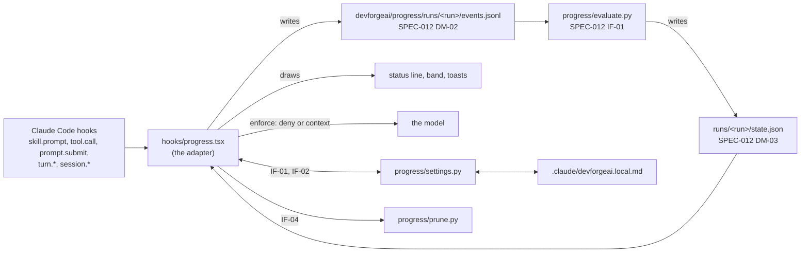

# SPEC-013 — Progress tracker adapter for Claude Code: events, gates, modes and the status line

## 1. Overview

SPEC-012 built the progress tracker's core: the formats, the brainstorm and architecture manifests, and
`evaluate.py`, which turns a skill run's event log into a progress state (merged in PR #59, plugin 0.12.0).
Nothing runs it in a session yet. This spec builds the Claude Code adapter, step 3 of the design proposal's
build order (`docs/specs/devforgeai-progress-ui.md` §11): a hooks module (a mod) in the `devforgeai` plugin that
- records each run of a tracked skill as an event log (SPEC-012 DM-02), from Claude Code's hooks;
- runs the evaluator and keeps the run's state;
- shows the run's progress in the status line, a two-row text band above the prompt, and toasts;
- in enforce mode, refuses the write gate's tool call when that gate raised flags, and gives the model the
  report gate's flags with the user's next prompt;
- fails open: when it can't run, the work goes on and the user is told.

It also adds `progress/settings.py`, which resolves `progress.mode` and saves the user's choice, and
`progress/prune.py`, which removes old run and session folders.

**The approach.** The event log is the truth. The adapter writes down what happened, as it happens, and
interprets nothing: it parses no tick and applies no rule. The evaluator, a pure function, computes the state
from the whole log each time (SPEC-012 BEH-01). So the adapter carries no copy of any rule (the mods proposal's
rule 2), a state that is lost or stale can be computed again from the log, and another tool's adapter shares
the same evaluator.

**Version 3** (2026-10-02) follows the build, its live check (VER-15) and Bryan's decisions of 2026-10-02. The
build's departures and readings, recorded in §9, become rules. `current.json` and `adapter.log` move into a
folder per session, since several sessions can share one checkout and a shared copy shows whichever wrote last.
A run takes the session's root when it opens, which a worktree move or `/cd` can change mid-session. And
`prune.py` removes run and session folders older than a retention period the user sets, 30 days by default.

**Version 4** (2026-10-03) follows SPEC-012 version 5: the adapter records Claude Code's task list as step events,
since a step's start and end there are tool calls it always sees, and in enforce mode it refuses a question asked
while no step is in progress, at SPEC-012's new question gate.

**Version 5** (2026-10-03) corrects how the adapter knows that a session has a task list. Since Claude Code
2.1.268 the task tools come by default only with older models (Claude 3.x, Opus 4 to 4.7, Sonnet 4 to 4.6 and
Haiku 4.5); on newer ones, Opus 5.5 among them, a session has them only when the user opts in. Version 4 wrote
`taskList` true for every session, which would hold a session with no task tools to a list it can't keep, with
every question refused in enforce mode. `taskList` now says whether the session has the tools.

**Version 7** (2026-10-03) answers the problem SPEC-012 version 8 reopened: a step mark Claude forgets to end takes
every later answer, and in enforce mode the run's writes can then be refused again and again. Two parts, neither a
guess about where answers belong. When the conversation is compacted, the likeliest moment for a mark to be
forgotten, the adapter keeps the task list's state in the summary and adds a note telling Claude to bring the list
in step with the work (BEH-24). And when enforce mode refuses a write over a decision while the task list marks
an earlier step, the refusal names that mark and how to fix it, so the first refusal ends the loop (BEH-08); in
observe mode the decision's flag toast says the same (BEH-12).

**Version 8** (2026-10-03) follows SPEC-012 version 9: each question names its step, as a check on the task list's
mark. The adapter records the tag a question carries in AskUserQuestion's metadata (DM-01), and in enforce mode a
question with no tag, or one tagged for a step other than the marked one, is refused before the user sees it,
with a refusal that says which fix applies (BEH-21); in observe mode its toast says the answer counted for no step
(BEH-12). Version 7's refusal line named only a mark earlier than the decision's step, so a run in which
Claude had marked a later step still looped; version 8's line names the decision's step and how its answer counts,
whichever step is marked (BEH-08), and observe mode's toast now speaks to the user (BEH-12). When the same refusal
comes twice, the user is told that Claude is stuck (BEH-25). The compaction note is never doubled, names only a
step the checklist has, and is left out once every step is reached (BEH-24).

**Version 10** (2026-10-04) records the waiver and adds the end-of-run review, both Bryan's (2026-10-03 "Next cycle";
2026-10-04). A tracked skill whose request says to proceed without questions asks once, at the start, whether it
should (SPEC-001, SPEC-003), in a question tagged `devforgeai_waiver`. The adapter records which of the question's two
fixed labels you picked, "Proceed without questions" or "Ask me as usual", on its answer event (DM-01), so the
evaluator can count it (SPEC-012 version 11, BEH-19), and never checks it at the question gate. When every step of a
run is reached and Claude's turn ends, and the run had at least one refusal or flag, the adapter asks you about each
one in Claude Code's own question dialog, one at a time: Accept, or Challenge with an optional reason. Your answers
go to the run's `review.jsonl` and `adapter.log`; nothing is sent to Claude (BEH-26).

**Version 9** (2026-10-03) words the stuck notice (BEH-25) by its cause. Version 8's notice always told you to
help Claude bring its task list in step. That is the wrong advice when Claude was refused for a step the tracker
hasn't seen done, such as a script run it didn't see, or for a decision written without your answer: a live
enforce-mode architecture run showed the first. The notice's last sentence now follows the refused flag's type.

**Version 6** (2026-10-03) makes the build's review findings rules: the question refusal says that an earlier run's
tasks don't count, a TodoWrite is compared with the list it replaced, a question check waits for task-tool calls
still under way, the adherence notice stays once per run across a reload, and adapter.log lists every kind it
writes.

**Out of scope,** each for a later spec:
- the Journey and Workflow pane, and its graphics (`Svg`, `Image`, `Raster`), characters and animation settings;
- `progress.html`, `chain_state.py` and the project's phases, and Skill health;
- manifests for the other skills;
- locking `progress.mode` at project level, which arrives with the shared-schema change (ADR-006 D3);
- guards that refuse commands or paths (ADR-006, "Out of scope");
- offering the chain's next skill as a Tab suggestion;
- the Codex port's adapter, and moving manifests into the skills (the mods proposal's Part B).

## 2. Constraints

- **ADR-006** (accepted 2026-10-02), whose follow-up gives this spec D1, D3 and D6:
  - D1: a hook blocks only at one of the tracker's gates, only in enforce mode, by refusing the gate's tool
    call with a reason the model reads. The tracker fails open: when the evaluator can't run, the call proceeds,
    the user sees a notice, and the adapter logs it. A rule that can't be checked is not a flag.
  - D3: `progress.mode` is `observe` or `enforce`, `observe` by default; the adapter resolves it at session
    start and records the value and its source in the run's event log; until the shared-schema change, it applies
    the framework default and honours an entry in the local preference file; the band's button writes that entry.
  - D6: the user's entry lives in `.claude/devforgeai.local.md` (ADR-003 A3's format); display settings stay in
    Claude Code's own plugin settings.
- **SPEC-012's contracts** (approved, v2): the adapter writes DM-02 events and nothing the format doesn't allow,
  reads the DM-03 state, runs IF-01, follows the run ID format and the operational files of §4, and writes the
  rule that keeps `devforgeai/progress/` out of git (SPEC-012 §4 gives that to this spec). One departure, from
  version 3: `current.json` moves from `devforgeai/progress/` into a session's folder (DM-02), because sessions
  sharing one checkout would overwrite one copy. SPEC-012 §4's file list follows in its next version; nothing
  reads `current.json` yet.
- **Decisions are the user's** (PRD-001 FR-003; the mods proposal's rule 5). The adapter writes no document and
  changes no skill text. No button sends a prompt. The mode changes only when the user presses its button.
- **Evals stay the proof** (the mods proposal's rule 1). A headless session, which includes every child run of
  `claude plugin eval`, is left untouched (BEH-01).
- **The mod API is early access.** Every API claim here was read in Claude Code 2.1.287's declarations and the
  `plugin-authoring` skill's `reference.md`, among them: `$.plugin.root` (the plugin's folder, absolute),
  `$.session.root()`, which follows `/cd` and a worktree move, `$.session.id()` and `$.session.version()`; `$.process.run(argv, { timeoutMs })` (30 seconds by default; it
  rejects when the command is still running then); `$.fs` (read, write, list, exists, stat; no append); a `.catch`
  handler receives a replay-safe `next`; `tool.call`, `session.append` and `turn.complete` carry `agentId` only for
  a subagent; `session.append`'s door `response`, one row per kept block of Claude's; `session.end`'s reasons,
  `clear` with no `session.start` after it; `session.start`'s `isInteractive` and `surface`; `prompt.compose`'s
  trait `print`; `next.origin` and `next.budget`; `$.ui.log`, a dim line in the transcript; and
  `crypto.getRandomValues`. The probe (VER-01, run on 2026-10-02) checked what the declarations
  couldn't settle; §9 records its answers, and this version applies them. The build rechecks the declarations
  on the build it runs on.
- **Installed plugins' mods load only while Anthropic serves them.** Claude Code loads an installed plugin's
  hooks module only while the rollout flag `tengu_plugin_hooks_modules` is on; built-in mods load regardless. A
  process reads the flag from the cache the previous session left in `~/.claude.json`, so a newly served value
  takes effect in the next process (the probe's first session, §9). With the flag off, the module doesn't load,
  the skills work as before, and `claude plugin test` refuses to run its tests.
- **Bryan's decisions** (2026-10-02):
  - the adapter lives in the plugin, `src/claude/DevForgeAI/hooks/` (ADR-006's "one mod", and source in each
    plugin), not in `src/tools/mods/`;
  - enforce mode is specified and tested here, as ADR-006's follow-up says, though it is off by default;
  - no idle limit ends a run (BEH-05);
  - nothing is recorded in headless sessions (BEH-01).
- **Repository conventions.** Source lives in the plugin. `claude plugin test [dir]` runs "every `*.test.ts` and
  `*.test.tsx` under dir", so the module's tests sit beside it in `hooks/`, and the deploy command excludes them
  (§10); Python tests live in `src/tests/progress/`, which doesn't deploy.
- **The standard library only** for `settings.py`, which must run under `python3 -S`, like `evaluate.py`.
- **The mods docs' rules and limits** (the saved copy in `docs/research/Claude/mods/`, local, checked on
  2026-10-02):
  - `$` may be passed only to a function declared at the top level of the same file; passing it to a method, an
    inner function or an imported function fails `claude plugin validate`, and so does `const ui = $.ui`. Every use
    of `$` therefore stays in `hooks/progress.tsx`, and any other file of the adapter holds pure functions of data.
  - A hook's own time is limited to 10 seconds (time inside `next` or a mods API call doesn't count), a `.catch`
    handler's to 1 second, and all `session.end` hooks together to 1.5 seconds; `$.fs.read` and `$.fs.write` hold
    4 MiB a file, and `$.fs.write` isn't atomic.
  - Mods draw only on the `terminal` and `desktop` surfaces. The VS Code extension's chat panel runs hooks and draws
    nothing, a `-p` run draws nothing, and a desktop session in WSL loads no plugins. Bryan chose tracking only for
    VS Code for now (2026-10-02): the adapter records and enforces there and writes its notices to the transcript
    (BEH-01); `progress.html`, a page to open beside it, is a later spec.
  - In auto mode, a tool call whose input a hook changed is denied, so the adapter passes every event on unchanged.

## 3. Architecture and components



| Path | Holds | Deploys |
| --- | --- | --- |
| `src/claude/DevForgeAI/hooks/hooks.json` | `{ "modules": ["./progress.tsx"] }` | yes |
| `src/claude/DevForgeAI/hooks/progress.tsx` | the adapter | yes |
| `src/claude/DevForgeAI/hooks/*.test.ts` | its tests, run by `claude plugin test src/claude/DevForgeAI` | no: the deploy command excludes them (§10) |
| `src/claude/DevForgeAI/types/index.d.ts` | the `$.state` contract (DM-03), named by `plugin.json`'s `types` | yes |
| `src/claude/DevForgeAI/progress/settings.py` | IF-01 and IF-02 | yes |
| `src/claude/DevForgeAI/progress/prune.py` | IF-04 | yes |
| `src/claude/DevForgeAI/.claude-plugin/plugin.json` | gains `types`, the `tracking` setting (DM-05) and the `retentionDays` setting (DM-06) | yes |
| `src/tests/progress/test_settings.py`, `test_prune.py`, `test_adapter_structure.py` | settings.py's tests (VER-02, VER-03), prune.py's (VER-17) and the structure checks, which read VER-04's expected lines from `hooks/progress.test.ts` (VER-16) | no |

`evaluate.py`, its schemas and its manifests don't change. Every use of `$` stays in top-level functions of
`hooks/progress.tsx` (§2); a helper file next to it may hold pure functions (formatting the status text, the band's
rows, an Edit's resulting file), which its tests can call directly.

| Hook | What the adapter does |
| --- | --- |
| `session.start` | tells a headless session apart by `isInteractive` (BEH-01), resolves the mode (BEH-16), starts the evaluation timer (BEH-06), and keeps an open run across a reload (BEH-17) |
| `classic.SessionStart` with `source` `clear`, `resume` or `fork` | resolves the mode and restarts the timer after `/clear`, `/resume` or `/branch`, which fire no `session.start` (BEH-06, BEH-16) |
| `prompt.compose` | a second headless signal, the trait `print` (BEH-01) |
| `skill.prompt` | starts and ends runs (BEH-02, BEH-03, BEH-05), and starts pruning once per session and root (BEH-19) |
| `tool.call` | records tool calls and answers (BEH-04); in enforce mode, checks the write gate before the call (BEH-08) |
| `prompt.submit` | records the user's prompts; in enforce mode, gives the model the report gate's flags (BEH-09) |
| `session.append` with door `response` | records Claude's text as it is kept, ticks included (BEH-04) |
| `turn.start`, `turn.complete` | records turns (BEH-04) |
| `session.end` | ends the run (BEH-05) |
| `ui.render` on `AbovePrompt` | draws the band (BEH-11) |

## 4. Data model

**DM-01. The events the adapter writes.** Every event carries SPEC-012 DM-02's `run`, `seq` (1, 2, 3 … within
the run, with no gaps), `time` (UTC, ISO 8601) and `kind`. Only the main loop is recorded: a `tool.call`,
`session.append` or `turn.complete` whose input carries an `agentId` is a subagent's, and is skipped (no
DevForgeAI skill uses subagents today).

| Claude Code | When | Event |
| --- | --- | --- |
| `skill.prompt` for a tracked skill (BEH-02) | as it loads | `skill-loaded`: `format` `devforgeai-events/1`; `skill`, the name without a `<plugin>:` prefix; `checklist`, the text that `next(e)` resolves to, which is what the model reads; `host`, `claude-code <version>` from `$.session.version()`; `taskList`, true when `$.tool.list()` names TaskCreate and TaskUpdate, or TodoWrite, and false otherwise, so a session without the task tools is never held to a task list (version 5; ERR-14); and two fields DM-02 allows but the evaluator doesn't read: `mode` and `modeSource` (ADR-006 D3) |
| `tool.call`, any tool but AskUserQuestion | after `next(e)` resolves | `tool`: `tool`; `path` (below); `command` for Bash; `exit`; `error`; `content` for Write and Edit (below) |
| `tool.call` of AskUserQuestion that Claude Code fired (`next.origin.plugin` is `engine`; a mod's `$.ui.ask` arrives the same way and isn't recorded) | after `next(e)` resolves | `answer`: `answered` true when the call didn't fail and the result's `answers` holds at least one entry, an option picked or an answer typed; false when it failed, as a dismissal does (§9, P5); `step`, N when the call's input `metadata.source` is `devforgeai_step:N`, N a whole number from 1 written without leading zeros; `outside` true when `metadata.source` is a string that doesn't start with `devforgeai_step`, as another command's question has (Claude Code's /remember sets `remember`); both left out otherwise, a malformed tag such as `devforgeai_step: 5` included (version 8; SPEC-012 version 9); when `metadata.source` is exactly `devforgeai_waiver`, neither `step` nor `outside` but `waiver`, recorded only when `answered` is true: `proceed` when the result's `answers` entry for the call's first question is exactly `Proceed without questions`, `ask` when it is exactly `Ask me as usual`, and `other` for anything else, a typed answer included (version 10; SPEC-012 version 11) |
| `tool.call` of TaskUpdate, or TodoWrite, that changes a mapped step's status (BEH-20) | after `next(e)` resolves, when the call didn't fail | after the call's own `tool` event, a `step` event: `step`, the step's number; `state` `started` for `in_progress`, `done` for `completed` |
| `prompt.submit` that the person sent (`e.origin.kind` `composer` or `bridge`; a task notification, a scheduled prompt, a peer's message, an SDK turn or a plugin's prompt isn't recorded), and that doesn't start with `/` (BEH-04) | as it is submitted | `prompt` |
| `turn.start` | | `turn` with `phase` `start` |
| `session.append` with door `response` | as each row is kept | `reply` with `text`, the row's text blocks joined by newlines, when it has any; a row that holds only a tool call gives none. Each row arrives as it is kept, so ticks written between tool calls are recorded; `turn.complete`'s `answer` holds only the turn's last text, and a whole skill run can be one turn (§9, P7) |
| `turn.complete` | | `turn` with `phase` `end` |
| `session.end` | | `run-end`, `reason` `clear` when the session ends by `/clear`, otherwise `session-end` |
| a tracked skill loading while a run is open | before the new run's `skill-loaded` | `run-end` with `reason` `another-skill`, in the old run |

The fields of a `tool` event:
- **`path`**, relative to the run's root (BEH-03) with `/` separators: Read, Write and Edit's `file_path`; Glob's
  `pattern`, joined to its `path` when one is given; Grep's `path`, or `.` when none is given. A path outside the
  run's root is kept absolute.
- **`exit`**, for every tool: Bash's result has no exit-code field (§9, P6). A failed call's text reads `Exit code <n>`, so `exit`
  is that number when the call failed and the text has it, 0 when the call succeeded, and null otherwise.
- **`error`**: true when the result has `isError` or is a `{ deny }`: a call refused by the permission dialog, a
  settings hook, a mod after this one, or the adapter itself (BEH-08) never ran, so it is never evidence. A mod before
  this one that refuses a call keeps the adapter from seeing it at all.
- **`content`**: a Write's `content`, or for an Edit the whole file the Edit will leave: the current file with
  `old_string` replaced by `new_string` once, or everywhere with `replace_all`. Left out when it can't be computed
  (ERR-06) or is over 64 KiB, and left out of every event once events.jsonl passes 3 MiB (ERR-11).

**DM-02. The files the adapter writes,** all under `devforgeai/progress/` in the run's root (SPEC-012 §4, but
for `current.json`, §2). `<session>` is `$.session.id()` when the file is written, so `/clear`, `/resume` and
`/branch`, which change it, start a new folder:

| File | Written | Holds |
| --- | --- | --- |
| `.gitignore` | when the adapter creates the folder, in each root a run opens in | the line `*`, which keeps the folder and everything in it out of git; the project's own `.gitignore` is never edited |
| `runs/<run>/events.jsonl` | after each event | the run's events (DM-01), one JSON object per line, rewritten whole from the run's lines, which the module keeps (DM-03; `$.fs` has no append) |
| `runs/<run>/state.json` | by the evaluator | SPEC-012 DM-03, through IF-01's `--out` |
| `runs/<run>/pending.jsonl`, `pending.json` | during an enforce check (BEH-08) | the run's events plus the pending one, and the provisional state; overwritten at the next check, since `$.fs` can't delete |
| `runs/<run>/review.jsonl` | as each review answer arrives (BEH-26) | one JSON object per line: `time`, `run`, `item` (the item's number in the review, from 1), `gate`, `seq`, `step`, `type`, `message`, `refused` (true for a refusal, false for a flag), `answer` (`accept`, `challenge` or `dismissed`) and `reason` (the typed text, or null); rewritten whole from the review's lines, as `events.jsonl` is (version 10) |
| `sessions/<session>/current.json` | after each evaluation | a copy of the session's open run's `state.json`, for renderers; the last run's stays after it ends, and shows it ended when the final evaluation ran (BEH-05). A renderer treats a session folder with no recent write as a session that has gone |
| `sessions/<session>/adapter.log` | on each notice | one line per entry: `<UTC time> <run or -> <kind>: <text>`, kind one of `mode`, `switch`, `ignored`, `refused` (a write or a question), `context`, `fail-open`, `error`, `prune`, `task` (ERR-13), `tools` (ERR-14), `adherence` (BEH-22), `tools-hint` (BEH-23), `compact` (BEH-24), `stuck` (BEH-25), `review` (BEH-26, version 10); a line's text is one line, so text from the model can't add lines of its own. Lines from before the session's first run are held in memory, the first 200 of them, and written once that run has created the folder with its `.gitignore` (BEH-15); past 512 KiB the file keeps its last half |

`prune.py` (IF-04) deletes `runs/<run>/` and `sessions/<session>/` folders whose files are all older than the
retention period (BEH-19), and nothing else.

**DM-03. The adapter's session state,** in `$.state`, declared in `types/index.d.ts` under the plugin's name.
`$.state` survives a reload of the module; module variables don't (BEH-17). `/clear`, `/resume` and `/branch` empty
it (§9, P11). Three values are module variables instead: whether the session is interactive (BEH-01) and the
evaluation timer (BEH-06), which belong to the process, and the open run's lines. One `$.state` value holds at most
4,194,304 characters, which the docs don't say (§9), and a run's escaped lines pass that before `events.jsonl`
reaches 4 MiB; after a reload the lines are read back from `events.jsonl` (BEH-17). The status line isn't drawn from `$.state`: BEH-10 calls
`$.ui.status`.
`claude plugin validate` reads the contract strictly: it exports types and nothing else (no `export {}`), and the
state's keys are written inline under `interface PluginState`, since a type alias there hides them (found with
the probe).

```ts
interface ProgressState {
  run: { id: string; skill: string; seq: number; dir: string; root: string } | null
  mode: 'observe' | 'enforce'
  modeSource: 'framework-default' | 'local'
  summary: { skill: string; current: number | null; steps: number; flags: number; yourTurn: boolean;
             ended: string | null; manifest: 'matched' | 'stale' | 'none' | 'unverified';
             states: string[]; currentTitle: string | null; lastFlag: string | null } | null
  lastEventAt: number          // ms since the epoch, for the idle display
  marked: boolean              // the run has events the evaluator hasn't seen
  shown: string[]              // flags already toasted, as "<step>:<type>:<seq>"
  contextSent: number[]        // report-gate seqs whose flags the model was given
  off: string | null           // why tracking is off for this session, or null
  tasks: Record<string, number> // the open run's task IDs and their step numbers (BEH-20)
  todos: Record<string, string> // TodoWrite: each step's last status, by step number (BEH-20)
  hinted: boolean               // the task-tools hint was shown this session (BEH-23)
  adhered: string | null        // the run given the adherence notice (BEH-22), so a reload doesn't repeat it
  refusals: Record<string, number> // the open run's enforce refusals by cause, '<gate kind>:<flag type>:<step>' (BEH-25)
  refused: { gate: string; seq: number; step: number; type: string; message: string }[] // the open run's refusals, each with its first flag (BEH-25, BEH-26; version 10)
  reviewed: string | null       // the run whose review was asked (BEH-26), so a reload doesn't repeat it (version 10)
}
```

**DM-04. The local preference entry** (ADR-003 A3; ADR-006 D6). `.claude/devforgeai.local.md`, whose YAML
frontmatter is its entire content:

```
---
devforgeai_local: 1
progress.mode: enforce
---
```

**DM-05. The `tracking` setting,** a `userConfig` field in `plugin.json`: a string picker over `on` and `off`,
default `on`, shown in `/config`. It is a display-level switch for the person, not policy (ADR-006 D6): `off`
turns the whole adapter off for that user, in every project. The build checks the field's exact shape with
`claude plugin validate`.

**DM-06. The `retentionDays` setting,** a `userConfig` number field in `plugin.json`: title "Keep progress files
(days)", default 30, `min` 7, `max` 3650, shown in `/config` (a number field with `default`, `min` and `max` passes
`claude plugin validate` on 2.1.288). Like `tracking`, it is the person's setting, not policy. It sets how old a
run's or a session's files must be before IF-04 removes them (BEH-19). The default matches Claude Code's own
transcript retention (`cleanupPeriodDays`, 30 by default), so a run's log lasts as long as the transcript it came
from. The floor of 7 days keeps a session left open over a weekend from losing its open run's folder to another
session's pruning, which judges by the files' times.

## 5. Interfaces and contracts

`settings.py` and `prune.py` are run as `python3 <plugin root>/progress/<script> <command> …`:

| Item | Command | Behaviour |
| --- | --- | --- |
| IF-01 | `mode --root DIR` | Resolves `progress.mode` for the project at `DIR` (BEH-18): prints `observe framework-default`, `observe local` or `enforce local`. When the file has a `progress.mode` line it can't use, the reason goes to stderr as `ignored .claude/devforgeai.local.md progress.mode (<reason>)`, the wording the skills use for ignored entries. Exit 0; exit 2 when `DIR` isn't a folder |
| IF-02 | `set-mode --root DIR --value observe\|enforce` | Saves the entry in `DIR/.claude/devforgeai.local.md` (BEH-18), adding `devforgeai_local: 1` when the file has none, since IF-01 would otherwise ignore the saved entry, and prints `saved progress.mode=<value> to .claude/devforgeai.local.md`. Exit 0 when saved; 1 when it refuses to change a file that isn't frontmatter-only or declares another format version; 2 when it can't write |
| IF-03 | the evaluator call | `<python> <plugin root>/progress/evaluate.py evaluate --manifests <plugin root>/progress/manifests [--manifests <root>/devforgeai/manifests/organization] [--manifests <root>/devforgeai/manifests] --events <events file> --out <state file> --root <root>`, SPEC-012 IF-01. A layer folder that doesn't exist is left out, since a `--manifests` that isn't a folder stops the evaluator (SPEC-012 ERR-04). `<python>` is the first of `python3` and `python` that runs (ERR-01) |
| IF-04 | `prune --root DIR --days N [--keep-session ID] [--keep-run ID]` (`prune.py`) | Removes old working files under `DIR/devforgeai/progress/` (BEH-19): each folder `runs/<name>` whose name matches SPEC-012's run-ID pattern, and each `sessions/<name>` whose name is a UUID, when the newest file in it was last modified more than `N` days ago and it isn't the kept session's or run's folder. A session ID of another shape is left alone. It never follows a symbolic link: it skips one, leaves any folder that holds one, and refuses a folder whose real path isn't inside `DIR/devforgeai/progress/`. It deletes nothing else. Prints `pruned <r> runs, <s> sessions`; exit 0, also when there is no `devforgeai/progress/`; exit 2 with one line on stderr when `DIR` isn't a folder, `N` isn't a whole number of at least 1, or a deletion fails |

`<plugin root>` is `$.plugin.root`; `<root>` is the run's root, `$.session.root()` when the run opened (BEH-03). Both scripts are run through `$.process.run`
with an argv, never a shell string. `evaluate.py` isn't executable, so the interpreter is always named.

## 6. Behavior

```yaml items
behaviors:
  - id: BEH-01
    status: active
    rule: "The adapter acts only in an interactive session with the tracking setting on (DM-05). When session.start's isInteractive is false (claude -p, the Agent SDK, and every child run of claude plugin eval), or a prompt.compose's traits include print (§9, P8), the adapter records, writes, draws and refuses nothing for the rest of the process. It keeps that answer in a module variable, since $.state empties on /clear, /resume and /branch. It writes no file before session.start has said the session is interactive. Where nothing draws (the VS Code extension's chat panel, where $.session.surfaces() is empty), it records and enforces as elsewhere, and every notice that would be a toast or the status line also goes to the transcript as a dim $.ui.log line (Bryan, 2026-10-02). With tracking off it does nothing at all."
  - id: BEH-02
    status: active
    rule: "A skill is tracked when it is one of the plugin's own skills (a folder under <plugin root>/skills/) or a <name>.json exists in <root>/devforgeai/manifests/ or <root>/devforgeai/manifests/organization/ (a project's own skill, ADR-006 D4). Its name is skill.prompt's skill without a '<plugin>:' prefix. Loading any other skill neither starts nor ends a run."
  - id: BEH-03
    status: active
    rule: "When skill.prompt fires for a tracked skill, the adapter calls next(e) first and never changes the text. It ends any open run with run-end another-skill, the same skill loading again included. It then opens a run: an ID of the UTC time from $.clock.now() as yyyymmddThhmmssZ, the skill's name and 8 hex digits from crypto.getRandomValues (SPEC-012 §4), and a skill-loaded event as the run's first (DM-01). The run takes the session's root, $.session.root(), as it opens and keeps it; that one read serves every decision made as the run opens (BEH-02's tracked check, BEH-15's folder and .gitignore, BEH-16's mode), and no root is kept for the session: its folder, the paths in its events, its manifests and IF-03's --root all use that root, so a worktree move or /cd during the run shows in its paths, and the next run opens under the new root. The run's folder, devforgeai/progress/runs/<run>/, is created when its events are first written (BEH-15). Every skill of the plugin opens a run, git and documents-updater included: having no manifest, they are tracked by ticks only (SPEC-012 BEH-04's none), and the status line says so (BEH-10)."
  - id: BEH-04
    status: active
    rule: "While a run is open, the adapter turns each main-loop host event of DM-01 into its event, with the next seq, the UTC time from $.clock.now() and the run's ID, adds it to the run's lines (DM-03) and rewrites events.jsonl from them. Events while no run is open, and events that carry an agentId, are not recorded. An answer counts only when Claude Code fired the AskUserQuestion call (next.origin.plugin is 'engine'), and a prompt only when the person sent it (e.origin.kind composer or bridge), since a mod can ask through $.ui.ask, submit a prompt as the user's, and a background task's notification arrives as a prompt (§9, P11). A prompt that starts with '/' runs a command or loads a skill and is no answer, so it isn't recorded: a slash command's skill.prompt settles before its prompt.submit, so its text would land in the run it opened (§9, VER-15). Every event goes on unchanged: auto mode denies a tool call whose input a hook changed."
  - id: BEH-05
    status: active
    rule: "A run ends with run-end another-skill when a tracked skill loads; clear on session.end with reason clear; and session-end on session.end with any other reason (exit, /resume and /branch, which report resume, logout, the end of a -p run, a signal). Nothing else ends a run; there is no idle limit (Bryan, 2026-10-02). All session.end hooks share 1.5 seconds, so the run-end line is written first, and the final evaluation runs only when next.budget.remainingMs leaves room for it, with its timeoutMs taken from what is left: the log alone reproduces the state. So a session's current.json shows its run ended only when that evaluation ran (DM-02)."
  - id: BEH-06
    status: active
    rule: "After a tool, answer, prompt, reply or run-end event, the run is marked. A timer runs IF-03 every half second when the run is marked and no timer-driven evaluation is running; it clears the mark as it starts. The timer starts at session.start, at classic.SessionStart with source clear, resume or fork (no session.start follows /clear, /resume or /branch), and at a skill.prompt when none is running. So at most one timer-driven evaluation runs at a time (an enforce check, BEH-08, runs apart from it on its own files), and a burst of events gives at most two evaluations. The timer's callback catches its own errors (ERR-10). After exit 0 the adapter copies state.json to the session's current.json (DM-02), updates the summary in $.state, which redraws the band, and calls $.ui.status when the status text has changed (BEH-10). In observe mode no tool call waits for an evaluation."
  - id: BEH-07
    status: active
    rule: "In observe mode the adapter never refuses a call and never adds text the model reads. Flags reach the user only: the status line, the band and toasts (BEH-10 to BEH-12)."
  - id: BEH-08
    status: active
    rule: "In enforce mode, for each main-loop Write or Edit while a run is open, the adapter checks before calling next(e). It writes the run's lines plus the pending tool event, with its content, to runs/<run>/pending.jsonl and runs IF-03 on it with --out runs/<run>/pending.json. When that state's gate has kind write, seq equal to the pending event's seq and refuse true, the adapter answers { deny } without calling next(e). The text says that DevForgeAI's progress tracker refused the write at the write gate (enforce mode) and lists the messages of the flags raised at that seq. It then says what clears them: for a step's flag, doing the step with a tool call the run's log can see, or ticking it as '- [x] N.' in reply text (a tick only in thinking doesn't count); for a decision (a rule-broken flag, or a user-owned step's), asking the user or leaving those fields open. It names the run's folder. In a run that follows the task list (SPEC-012 BEH-18), when the flags at that seq include a skipped flag for a user-owned step M (the first such flag; the decision's step, read from the flags' step and the state's userOwned, never from message text) and the task list doesn't mark step M in progress (the marked step read as BEH-24 does), the text also says: 'Step M (<title>) is the user's decision: an answer counts for it only while step M is marked in progress, and an answer to a question only when the question is also tagged devforgeai_step:M. Mark step M in_progress, ask the user with the question tagged devforgeai_step:M, and mark step M completed.' When the task list marks another step N, and the run's lines hold a prompt after step N's latest started event, that line is preceded by: 'Your task list marks step N (<title>) in progress, so what the user typed since then counted for step N.' With no such flag, or with step M marked, both lines are left out (version 8, replacing version 7's line, which named only an earlier mark and so left the loop open when Claude had marked a later step). Where nothing draws, the same text also goes to $.ui.log. The call is recorded as a tool event with error true, which is never evidence (SPEC-012 BEH-06), so the write gate is checked again when the write is retried. Otherwise the adapter calls next(e) and records the event as in observe mode. $.fs can't delete a file, so the two pending files are overwritten at the next check."
  - id: BEH-09
    status: active
    rule: "In enforce mode, when an evaluation's gate has kind report and refuse true, the adapter adds the messages of the flags raised at that gate, once per gate seq, to the context of the user's next prompt.submit, so the model reads them with that prompt. It doesn't add them to a prompt that starts with '/', which usually loads the next skill, and drops them once the run has ended: the user has moved on. A run-end gate's flags reach the user only, since the conversation that would read them has ended. Neither gate has a tool call to refuse."
  - id: BEH-10
    status: active
    rule: "While a run is open, and after it ends until another run opens, the status line shows the summary: '<skill> <current>/<steps>' while a step is current; '<skill> done' when every step is reached; '<skill> ended' after run-end. Then, in this order and only when they apply: ' · your turn' when the current step shows your-turn; ' · <n> flag' or ' · <n> flags'; ' · ticks only' when the manifest is stale or none; ' · idle' when 30 minutes have passed with no event and no turn running; ' · enforce' in enforce mode. While tracking is off for the session (BEH-14, ERR-03), it shows 'progress: off (<reason>)' instead. The adapter sets it with $.ui.status(text), called only when the text changes, and Claude Code draws it as '⚠ devforgeai: <text>' (use-the-mods-API, $.ui.status)."
  - id: BEH-11
    status: active
    rule: "While a run is open, a ui.render hook on AbovePrompt draws two rows of text. Row 1: the skill, one glyph per step in order (done ●, current ◆, your-turn ?, pending ○, claimed ◐, unconfirmed ·, skipped-with-reason ⊘, not-applicable –, skipped ✗, rule-broken ✗) and 'step <current> of <steps>: <title>'. Row 2: 'observe mode' or 'enforce mode', a button 'Switch to enforce' or 'Switch to observe' (BEH-13), and the newest flag's message, or 'no flags'. The hook draws a Box holding its rows and then what await next(e) resolves to, so the mods after it still draw; it draws at most e.props.maxRows of its own rows (row 2 goes first) and cuts each to e.props.bodyColumns. It returns next(e), drawing nothing of its own, while e.props.hasSurvey is true, and when no run is open. Each draw waits for the one before it to finish, since after a reload the band can be asked for twice at once. The button has the key 'progress-mode' and no hotkey: a digit hotkey on a band button also fires when the user types that digit alone into an empty prompt."
  - id: BEH-12
    status: active
    rule: "Each flag shows one toast, '✗ Step <step> <type>: <message>', the first time an evaluation reports it. When the run's last step is reached without run-end, one toast says '✓ <skill>: all steps reached'. Toasts are the same in both modes; where nothing draws, each also goes to $.ui.log (BEH-01). In a run that follows the task list, a skipped flag for a user-owned step M raised at seq s, when the task list marked another step N at s and the run's lines hold a prompt after step N's latest started event and before s, gets a sentence for the user after it: 'What you typed since step N (<title>) was marked in progress counted for step N: the <skill> skill didn't keep its task list in step with its work (DevForgeAI SPEC-012 §4).' A question-gate flag's toast (unmarked-question, untagged-question or mismatched-question) ends with ' Its answer, if any, counts for no step.', since SPEC-012 version 9 counts none at a question gate and a dismissed question has none; enforce mode refuses such a question before it is asked, so the toast appears in observe mode. (Version 8, replacing version 7's sentence, which spoke to Claude, who doesn't read toasts.)"
  - id: BEH-13
    status: active
    rule: "Pressing the band's button runs IF-02 with the other mode. On exit 0 the mode changes for the session at once, its source becomes local, a toast confirms it, and adapter.log records the switch with the run's ID and last seq, because DM-02 has no event for it. On exit 1 or 2 the mode stays as it was and a toast gives IF-02's reason. The button never sends a prompt."
  - id: BEH-14
    status: active
    rule: "The adapter fails open (ADR-006 D1). A hook that fails before calling next is skipped and the event goes on, and one that fails after next leaves that result standing. Each hook is also registered with a .catch whose handler, within its 1-second limit, writes the error to adapter.log, shows a toast once per distinct error, and returns next(e): in a .catch, next is replay-safe, so when the hook had already called it (next.called), the result it got stands. When the evaluator can't run (ERR-01, ERR-02, ERR-07), the tool call proceeds, the status line shows 'progress: off (<reason>)' until an evaluation succeeds, and events are still recorded, so the state can be computed later. Claude Code reports an installed plugin's load failures and skipped hooks only in its debug log (claude --debug), so a missing band is the visible sign during dogfooding. The adapter registers no guard: a guard's fail-closed .catch (D1) belongs to the guard's own spec."
  - id: BEH-15
    status: active
    rule: "The adapter writes only under devforgeai/progress/ in a run's root (DM-02), deletes only through IF-04 (BEH-19), and .claude/devforgeai.local.md only through IF-02 when the user presses the button. It creates devforgeai/progress/ with its .gitignore holding '*' the first time it writes a run's events under a root, which is only after BEH-01 has found the session interactive, and never edits the project's own .gitignore. $.fs.write isn't atomic and holds at most 4 MiB a file: the adapter is the only writer of its files, starts an evaluation only after the write it depends on has finished, keeps each Write or Edit's content to 64 KiB, and stops adding content once events.jsonl passes 3 MiB (ERR-11). It reads the plugin's files, the manifest folders, the local preference file through IF-01, and a file an Edit names (DM-01). It opens no network connection."
  - id: BEH-16
    status: active
    rule: "At session.start, at classic.SessionStart with source clear, resume or fork, and at a skill.prompt when $.state holds no mode or the session's root differs from the one the mode was resolved for (the local preference file is per checkout and gitignored, so a new worktree has none), the adapter runs IF-01 with timeoutMs 3000, since Claude Code holds the first prompt until session.start's hooks finish, and keeps the mode and its source in $.state; it writes each entry IF-01 reports as ignored to adapter.log and shows them in one toast. Every skill-loaded event carries the mode and source in force when the run opened (ADR-006 D3). Until the shared-schema change brings progress.mode into policy, only the framework default and the local entry apply, and the button is always available."
  - id: BEH-17
    status: active
    rule: "A reload of the module (a hot reload, /reload-plugins, or a change to the tracking setting) keeps an open run: its ID, seq, folder and root, the mode and the summary are in $.state, its lines are read back from events.jsonl, and session.start fires again. A read that fails is never kept, so a later write can't replace the real log with a short one. The evaluation timer starts again there, and the adapter marks the run so the state is computed again. $.state belongs to the session: /clear, /resume and /branch empty it and change the session ID while the module and its timer go on (§9, P11), after the run has already ended with run-end clear or session-end (BEH-05)."
  - id: BEH-18
    status: active
    rule: "settings.py reads .claude/devforgeai.local.md only as frontmatter: the file must start with a line '---' and end with the next '---' line, with nothing after it but blank lines. IF-01 uses the progress.mode entry when the file is frontmatter-only, devforgeai_local is 1, and the value is observe or enforce, quoted or not; otherwise the mode is observe from the framework default, and each reason is reported (ERR-04). IF-02 creates .claude/ and the file when they are missing, with devforgeai_local: 1 and the entry; in an existing frontmatter-only file it replaces the progress.mode line, or adds it before the closing '---', and keeps every other line as it was. It adds devforgeai_local: 1 to a file that has no such line, and refuses (exit 1) one that declares another value. It writes a temporary file beside the target and renames it over the target. It reads no other entry: the skills apply the rest (ADR-003 A3)."
  - id: BEH-19
    status: active
    rule: "Once per session ID, when its first run opens, and again when a run opens under another root, the adapter starts IF-04 after the run's folder exists, with --root the run's root, --days the retentionDays setting (DM-06), --keep-session the session's ID and --keep-run the new run's ID, and timeoutMs 10000. Nothing waits for it, no hook and no tool call, and its output line goes to adapter.log as kind prune; its failure is ERR-12. What protects a run still open in another, idle session is DM-06's floor of 7 days, not --keep-run, which only spares the caller's new folder in case its files' times are old. Nothing is deleted at session.end: $.fs can't delete, all session.end hooks share 1.5 seconds, which the final evaluation needs (BEH-05), and a session closed with its terminal or killed may not fire session.end at all, so the next session's pruning covers every way a session ends. A project where no tracked skill runs gets no pruning and no files (BEH-15)."
  - id: BEH-20
    status: active
    rule: "While a run is open, the adapter reads Claude Code's task list as SPEC-012's task-list convention (§4) has a skill keep it. After a TaskCreate that didn't fail, it maps the task's ID, taken from the result text 'Task #<id> created successfully', to a step number: the input's metadata devforgeai_step when it is a whole number, else the number that starts its subject ('<N>. <title>'); it keeps the map in $.state for the run. After a TaskUpdate that didn't fail, for a mapped task, status in_progress gives a step event with state started and completed one with state done, recorded after the call's tool event; other statuses, and unmapped tasks, give none. Overlapping task-tool calls, as a batch of TaskCreate calls gives, each see the others' mappings. After a TodoWrite that didn't fail, each todo whose content starts with '<N>.' is compared with its status in the list the call replaced, as the call's result gives it (oldTodos), or with that step's last status when the result has none, so an earlier run's completed todos left in the list claim nothing in a new run (version 6): becoming in_progress gives started, becoming completed gives done (a todo that goes straight from pending to completed gives done only), and the new statuses are kept. A new run starts with an empty map: a task list left over from an earlier run gives no step events until its tasks are created again or updated in a TodoWrite."
  - id: BEH-21
    status: active
    rule: "In enforce mode, for each AskUserQuestion that Claude Code fires while a run is open, the adapter checks before calling next(e), after waiting up to 2 seconds for task-tool calls still under way and for events still being written, so a question sent in the same batch as the TaskUpdate that marks its step sees that step event (version 6), leaving to the evaluator whether the run follows the task list (SPEC-012 BEH-18), as BEH-08 does for a write: it writes the run's lines plus a pending answer event (answered true, with the question's step or outside, DM-01) to runs/<run>/pending.jsonl and runs IF-03 on it. When that state's gate has kind question, seq equal to the pending event's seq and refuse true, it answers { deny } without calling next(e), with a text chosen by the type of the flag the question gate raised at that seq, never by its message. For unmarked-question: 'DevForgeAI's progress tracker refused this question (enforce mode): no step of this run is marked in progress in your task list. Tasks from an earlier run don't count: if this run's checklist isn't in your task list yet, turn it into tasks first as the skill says (one task per step, subject <N>. <title>, metadata devforgeai_step: N). Then mark the step this question belongs to in_progress (TaskUpdate, or TodoWrite), and ask again.' (version 6), followed, when the question names no step, by ' Tag the question too: add metadata: {\"source\": \"devforgeai_step:N\"} to the AskUserQuestion call, N being its step. If the question isn't part of this skill's checklist, give it a source of its own instead; it then needs no step and counts for none.' For mismatched-question: 'DevForgeAI's progress tracker refused this question (enforce mode): it is tagged for step N, but your task list marks step K in progress. If the question belongs to step N, mark step N in_progress (TaskUpdate, or TodoWrite) and ask again; if it belongs to step K, tag it devforgeai_step:K and ask again.' For untagged-question: 'DevForgeAI's progress tracker refused this question (enforce mode): it doesn't name a step of this skill's checklist. Add metadata: {\"source\": \"devforgeai_step:N\"} to the AskUserQuestion call, N being the step it belongs to; your task list marks step K in progress, so if the question belongs to another step, mark that step in_progress first. If the question isn't part of this skill's checklist, give it a source of its own instead; it then counts for no step. Then ask again.' N is the flag's step and K the marked step, read as BEH-24 does (version 8). Where nothing draws, the same text goes to $.ui.log. The refused question is recorded as nothing, since the user never saw it; a toast shows the refusal's first line (BEH-12), and adapter.log gets a line of kind refused. Otherwise the call proceeds and its answer is recorded as DM-01 says. In observe mode nothing is checked; the evaluator flags the question afterwards. A question whose metadata.source is exactly devforgeai_waiver is not checked, in either mode: it is never a question gate (SPEC-012 BEH-18, version 11), so it goes on, and its answer is recorded with its waiver (DM-01; version 10)."
  - id: BEH-22
    status: active
    rule: "When a run that follows the task list (SPEC-012 BEH-18) ends, or reaches its report gate, and its state counts no step event or at least one unmarked question, the adapter shows one toast in either mode, '<skill> didn't keep its task list: <n> step events, <m> questions asked without their step marked and tagged. Recommended: fix the skill so it keeps its checklist in the task list (DevForgeAI SPEC-012 §4)', and writes the same to adapter.log as kind adherence, once per run: $.state's adhered holds the run, so a reload of the module doesn't repeat it (version 6). Its <m> is the state's counts.unmarkedQuestions, which counts every question gate (SPEC-012 version 9), so the wording names all three causes (version 8). It counts a run as having reached its report gate when the state's gate is the report's or its report step is done, since a later event can move the gate on before the next evaluation. It is SPEC-012 §4's second level; the third, fixing the skill, is the maintainers' (each skill's spec names its eval case)."
  - id: BEH-23
    status: active
    rule: "Once per session, when a tracked skill whose text names devforgeai_step loads and the session's tool list names no task-list tool (skill-loaded taskList false), the adapter shows one toast, in either mode: '<skill>: this session has no task list, so DevForgeAI places your answers by guessing. For exact step tracking, start Claude Code with CLAUDE_CODE_ENABLE_TODO_TOOLS=1 (DevForgeAI SPEC-012 §4)'. Where nothing draws, the same text goes to $.ui.log. adapter.log gets a line of kind tools-hint, and $.state's hinted becomes true, so later runs in the session show nothing (Bryan, 2026-10-03)."
  - id: BEH-24
    status: active
    rule: "When Claude Code compacts the main conversation (session.compact with no agentId) while a run that follows the task list (SPEC-012 BEH-18) is open, the adapter carries the task list's state through it. The marked step is the step whose latest step event in the run's own lines is started (the latest started when several are, SPEC-012 BEH-18); its title comes from the run's state.json, the last evaluation's steps. Before calling next(e), it adds to the summarizer's instructions: 'Keep, for DevForgeAI's progress tracker: in the <skill> run, the task list marks step N (<title>) in progress.' (or 'marks no step in progress'). After next(e) resolves with the compacted messages, it adds one user message at their end: 'DevForgeAI's progress tracker: when this conversation was compacted, your task list marked step N (<title>) in progress. Before you ask anything or go on, check your task list and bring it in step with the work: mark each finished step done and the step you're on in_progress.' (with 'no step' when none was). The note holds even when the summary was made ahead of time, since it asks Claude to check the list. Before adding it, the adapter removes every message among them whose text starts with 'DevForgeAI's progress tracker: when this conversation was compacted', so a summary made ahead of time, or a second compaction, never carries two notes or a stale one; the marked step counts only when the last evaluation's steps have it ('no step' otherwise, and the step's number alone when the run has no evaluation yet); and when the last evaluation shows every step reached (current null, the run not ended), the instruction is added but no note (version 8). A run that doesn't follow the task list, a subagent's compaction and a skipped compaction get nothing; the adapter never answers { skip }. adapter.log gets one line of kind compact. A failure leaves the compaction as the engine made it (BEH-14) (version 7)."
  - id: BEH-25
    status: active
    rule: "In enforce mode the adapter counts its refusals in the open run by cause: the gate's kind and the type and step of the first flag raised at the refused seq ('<kind>:<type>:<step>'), in $.state's refusals (DM-03), which a new run empties. When a cause's count reaches 2, it shows the user one toast, '<skill>: the progress tracker refused Claude twice at step <step> for the same reason: <that flag's message>. <advice>', writes the same to adapter.log as kind stuck, and, where nothing draws, to $.ui.log; a third refusal for the cause shows nothing more. The advice is chosen by that flag's type and by whether its step is user-owned in the state's steps, never by message text (version 9): for unmarked-question, untagged-question or mismatched-question, 'Help Claude bring its task list in step, or switch to observe mode with the band's button.'; for skipped or claimed-not-evidenced on a step that isn't user-owned (a step the state doesn't list counts as not user-owned), 'Claude hasn't done that step in a way the tracker can see: ask Claude to do it as the message says, or switch to observe mode with the band's button.'; for skipped on a user-owned step, or rule-broken, 'The refused write records a decision that needs your answer: answer Claude's question about it, or ask Claude to leave it open, or switch to observe mode with the band's button.' The refusals themselves are unchanged: the notice is for the user, who can see what Claude can't (version 8; Bryan, 2026-10-03). Each refusal, a write's or a question's, is also kept in $.state's refused with its gate's kind, its seq and its first flag's step, type and message, which a new run empties, for the run's review (BEH-26; version 10): a refused question leaves no event, so the evaluator's state never shows it."
  - id: BEH-26
    status: active
    rule: "The end-of-run review (version 10; Bryan, 2026-10-04: 'Tracker's own dialog'). At a turn.complete of the main loop, when the run is open, every step of it is reached (the state's current is null and its run hasn't ended), $.state's reviewed isn't this run, and the run has at least one item, the adapter sets reviewed to the run and asks about each item in turn, in either mode. The items are the refusals in refused (BEH-25), then each flag of the latest state.json whose gate, seq, step and type no refusal has, in seq order. For each, it calls $.ui.ask with the question '<skill> run, item <i> of <n>: <what> at step <step> (<gate> gate): <message>. Accept it, or challenge it?', <what> being 'refused' for a refusal and 'flagged' for a flag, and the options Accept and Challenge, under the header 'Review'. Accept records accept; Challenge records challenge with reason null; anything typed under Other records challenge with that text as its reason; a dismissal records dismissed for that item and every item after it, which are not asked. Each answer is written to runs/<run>/review.jsonl (DM-02) and to adapter.log as kind review, '<i>/<n> <answer>: <step> <type>'. When the review ends, one toast says '<skill>: your review is in devforgeai/progress/runs/<run>/review.jsonl'. Nothing is sent to Claude: no prompt, no context and no reply (§2), so the review never steers the conversation, and observe mode still adds no text the model reads (BEH-07). A run with no item, a run that ends before every step is reached, a session where nothing draws ($.ui.ask can't be answered there, BEH-01) and a headless session get no review. A $.ui.ask that rejects is ERR-15."
```

## 7. Errors and edge cases

```yaml items
errors:
  - id: ERR-01
    status: active
    condition: "Neither python3 nor python runs: at session.start, $.process.run of '<name> --version', with timeoutMs 3000, rejects for both (a missing program rejects with 'Executable not found', §9, P2) or exits non-zero."
    handling: "Keep recording events; skip every evaluation and every enforce check, so every call proceeds (BEH-14); write adapter.log once."
    user_result: "The status line shows 'progress: off (python not found)', and one toast says so."
  - id: ERR-02
    status: active
    condition: "IF-03 exits 2, or is still running when its timeout ends: 5 seconds, or at session.end what next.budget.remainingMs leaves; $.process.run rejects then."
    handling: "Leave the earlier state and current.json as they were; let the call proceed when this was an enforce check; write the evaluator's stderr line, or 'timed out', to adapter.log."
    user_result: "The status line shows 'progress: off (<reason>)' until an evaluation succeeds, and a toast shows each distinct reason once per session."
  - id: ERR-03
    status: active
    condition: "devforgeai/progress/ or a run's folder can't be created or written."
    handling: "Stop tracking for the session: drop the run and record nothing more."
    user_result: "The status line shows 'progress: off (cannot write devforgeai/progress)', and one toast says so."
  - id: ERR-04
    status: active
    condition: "The local preference file exists but isn't frontmatter-only, lacks devforgeai_local: 1, or gives progress.mode a value other than observe or enforce."
    handling: "Use observe from the framework default; IF-01 reports the reason (BEH-18); the adapter writes it to adapter.log. Never fatal (ADR-003 A3)."
    user_result: "One toast: 'ignored .claude/devforgeai.local.md progress.mode (<reason>)'."
  - id: ERR-05
    status: active
    condition: "IF-02 refuses (exit 1: the file isn't frontmatter-only) or can't write (exit 2) when the button is pressed."
    handling: "Keep the mode as it was; write IF-02's reason to adapter.log."
    user_result: "A toast gives the reason; the button still shows the same choice."
  - id: ERR-06
    status: active
    condition: "An Edit's resulting file can't be computed: the file can't be read, is over 64 KiB, or old_string doesn't occur, or occurs more than once without replace_all."
    handling: "Record the tool event without content. After the write, the evaluator reads the file under --root; an enforce check before the write can't see the field, so its content rules raise no flag and the call proceeds (SPEC-012 ERR-05)."
    user_result: "Nothing extra; the state may carry SPEC-012's note 'content not available; rule not checked'."
  - id: ERR-07
    status: active
    condition: "IF-03 exits 0 but its --out can't be read or isn't JSON."
    handling: "Treat it as ERR-02."
    user_result: "As ERR-02."
  - id: ERR-08
    status: active
    condition: "A tracked skill loads before any session.start has reached the module, so whether the session is interactive is unknown."
    handling: "Treat the session as not interactive until a session.start says otherwise: record and write nothing, as BEH-01 does, so an eval child run is never touched by mistake."
    user_result: "No status line or band until the session is known to be interactive."
  - id: ERR-09
    status: active
    condition: "Claude Code's hooks worker crashes, and Claude Code turns off the mods that run in it for the session ('mods that run in the hooks worker are off for this session')."
    handling: "Nothing the adapter can do: its hooks no longer run. The event log ends where the crash left it; /reload-plugins or the next session tracks again, and the run's state can still be computed from the log."
    user_result: "Claude Code's own notice; the status line and band stop updating."
  - id: ERR-10
    status: active
    condition: "The evaluation timer's callback throws."
    handling: "The callback catches every error itself, writes it to adapter.log and treats it as ERR-02; an error it let escape would reach only Claude Code's debug log, and the timer would run again with no notice."
    user_result: "As ERR-02."
  - id: ERR-11
    status: active
    condition: "events.jsonl passes 3 MiB, or a write would take it past $.fs.write's 4 MiB."
    handling: "From 3 MiB, new tool events carry no content: the evaluator reads written files under --root, and an enforce check before a write sees no content, so its content rules raise no flag (SPEC-012 ERR-05). At 4 MiB the adapter stops recording that run: it writes nothing more to its files, and the next tracked skill opens a new run as usual. The log so far still gives the run's state; it has no run-end line, so the evaluator sees the run as open."
    user_result: "From 4 MiB until another run opens, the status line shows 'progress: off (event log full)', and one toast says so."
  - id: ERR-12
    status: active
    condition: "IF-04 can't start, exits 2, or is still running after 10 seconds, when $.process.run rejects."
    handling: "Write its stderr line, or the rejection's reason, to adapter.log as kind prune; tracking goes on. Folders it didn't remove wait for the next session's pruning."
    user_result: "Nothing shown; adapter.log has the line."
  - id: ERR-13
    status: active
    condition: "A TaskCreate's result text has no 'Task #<id>', or neither its metadata nor its subject gives a step number."
    handling: "Map nothing for that task, so its updates give no step events, and write one adapter.log line of kind task naming the subject; the evaluator then sees fewer step events and may flag a question gate, which is the convention's own failure (SPEC-012 §4)."
    user_result: "Nothing extra; adapter.log has the line."
  - id: ERR-14
    status: active
    condition: "$.tool.list() rejects when a tracked skill loads."
    handling: "Write taskList false, so the run isn't held to the task list and its answers are placed as before (SPEC-012 BEH-09), and write one adapter.log line of kind tools with the error."
    user_result: "Nothing shown; adapter.log has the line."
  - id: ERR-15
    status: active
    condition: "A review's $.ui.ask rejects: the dialog was dismissed, or it can't be shown (BEH-26)."
    handling: "Record dismissed for that item and every item after it, ask nothing more in this run (reviewed already holds it), and write one adapter.log line of kind review with the reason; any other error during the review is BEH-14's."
    user_result: "The review stops; review.jsonl shows what was answered and what was dismissed."
```

## 8. Non-functional design

```yaml items
quality_responses:
  - id: QR-01
    status: active
    response: "In observe mode a tool call waits for no process: recording an event is in-memory work plus one file write, and evaluation runs on the timer (BEH-06)."
    measured_by: "VER-06 checks that no tool.call hook awaits $.process.run in observe mode; VER-15 records the time a recorded Write takes on the owner's machine."
    upstream:
      - {id: PRD-001, item: NFR-006, relation: informed_by, version: 11, hash: null}
  - id: QR-02
    status: active
    response: "In enforce mode each Write or Edit during a run costs one evaluator run before the call: the target is under 500 ms on the owner's machine, and 5 seconds is the limit after which the check fails open (ERR-02). Version 4 adds one evaluator run before each AskUserQuestion in enforce mode, against the same target and limit."
    measured_by: "VER-15 records the time of an enforce check on the owner's machine; VER-09 covers the limit. VER-22 records the time of a question check."
    upstream:
      - {id: PRD-001, item: NFR-006, relation: informed_by, version: 11, hash: null}
  - id: QR-03
    status: active
    response: "The adapter writes and deletes only under devforgeai/progress/, deleting only through IF-04's confined folders, and on the user's press writes .claude/devforgeai.local.md; it reads only the files BEH-15 lists, and opens no network connection."
    measured_by: "VER-11 checks the files written in a scripted session; VER-16 checks that claude plugin validate lists no network call; code review at build time, recorded in §9."
    upstream:
      - {id: PRD-001, item: NFR-007, relation: informed_by, version: 11, hash: null}
  - id: QR-04
    status: active
    response: "settings.py and prune.py import only the Python standard library and run under python3 -S."
    measured_by: "VER-02, VER-03 and VER-17 run every case normally and under python3 -S."
    upstream:
      - {id: PRD-001, item: NFR-004, relation: informed_by, version: 11, hash: null}
```

## 9. Verification

| Kind | Status |
| --- | --- |
| Structural: this spec against `src/schemas/spec.schema.json` | Passes, checked 2026-10-02 with the helpers of `src/tests/context/test_structure.py`: the frontmatter and every item block, with QR-01 to QR-04 linked to PRD-001 v11's NFRs; every BEH, ERR and QR item is covered by a VER item |
| Probe (VER-01) | Run on 2026-10-02 with Claude Code 2.1.287, by Bryan in his shell and in a cmux tab, in a throwaway workspace (`/tmp/devforgeai-probe-ws`) with the plugin's source and the probe as skills-dir plugins: P1 to P8 and P10 to P13 answered (below); P9 not run. P7 contradicted DM-01, so version 2 reads replies from `session.append` |
| Docs check | 2026-10-02: the mods docs, saved in `docs/research/Claude/mods/` (local, as `CLAUDE.md` says of `docs/research/Claude/`), were read against this version; the second version-2 Change Log row lists what changed. They confirm P1, P5 to P8 and P10 to P13 |
| Build | Built on branch `feat/spec-013-progress-adapter` (worktree), not merged, by session a4f2ade8-0127-4b96-bc22-b3498b2ab3a9 through `/plugin-dev:create-plugin`. Files: `progress/settings.py`, `hooks/hooks.json`, `hooks/progress.tsx`, `hooks/progress-core.ts`, `hooks/core.test.ts`, `hooks/progress.test.ts`, `types/index.d.ts`, the `plugin.json` keys, `src/tests/progress/test_settings.py` and `test_adapter_structure.py`. Results at the build's head: `claude plugin test src/claude/DevForgeAI` 53 pass, 0 fail (13 core tests of the pure helpers, 40 kit tests: VER-04 to VER-14 and three for the fixes after plugin-validator's review); `src/tests/progress` 107 passed, 173 subtests (the evaluator's 51, `settings.py`'s 52 under normal and `python3 -S`, the 4 structure checks of VER-16); full `src/tests` 584 passed, 544 subtests at `161b9e2`, against the baseline at `dd0d441` of 528 and 544, so nothing earlier broke; `claude plugin validate`: passed, 11 hooks, the nine state keys, no `$.http`, `$.mcp` or `$.env.set` call (QR-03). VER-01 ran before the build. Not run: VER-15 (the CLI dogfood, Bryan's session, through `--plugin-dir` before merge) and the eval check that the plugin with a hooks module still loads in `claude plugin eval` (one case, Bryan's terminal). Plugin version: set at merge (main is 0.12.1) |
| Dogfood (VER-15) | Partly met, 2026-10-02, in cmux, each run in a scratch project with `claude --plugin-dir` on this branch's plugin (it loads as `devforgeai@inline`) and `--debug`. Brainstorm, Claude Code 2.1.287, `/tmp/devforgeai-adapter-ws`: run 1 (observe) showed the status line and the band, raised one flag at the write gate (step 1, listed with Bash only) and refused nothing, but counted the typed `/devforgeai:brainstorm` as step 5's answer (fixed in `6e8c4a0`, below); the band's button switched to enforce and saved the local file (0644); in run 2 (enforce) the BRN Write was refused for step 1 and went through after one Read. Not yet seen live: a step 5 flag, and a refused non-open disposition whose retry passes after the user's answer (the kit tests cover both, which Bryan accepted on 2026-10-02 as VER-15's coverage of them, since provoking them live needs a skill that misbehaves). Architecture, 2.1.288, `/tmp/devforgeai-arch-ws` with the example BRN-001 and PRD-001, observe: one `/compact` at the turn boundary before step 8's answer appended no event (the log was byte-identical before and after), restoring the skill opened no run, and over the whole run every assistant text block in the transcript is one reply event (10 and 10, none twice). All three runs' `events.jsonl` validate against `events.schema.json` (17, 39 and 45 events), and each manifest state is matched. Times on the owner's machine, from the debug log's `tool.call settled` lines (a hook's whole time, `next()` included): a recorded Write 101 to 113 ms in observe mode, the late events among them (ARCH-001 is event 35 of 45); an enforce check that refused a Write 70 ms, and one that passed 162 ms with its Write, against QR-02's 500 ms. Findings follow the departures |
| Build (v3) | Built on the same branch through `/plugin-dev:create-plugin`, tests first: `prune.py` and `test_prune.py` (`84705e1`), `retentionDays` (`47a3e18`), the failing kit tests (`695a2b9`), the adapter (`69423b7`), then the fixes after plugin-validator's review (`34b2c48`, `3b39c1c`). Baseline before v3: `src/tests/progress` 107, kit 55. Results at `3b39c1c`: `claude plugin test src/claude/DevForgeAI` 65 pass, 0 fail; `src/tests/progress` 137 passed, 181 subtests (prune.py's 29: 22 rules, normal and `-S`, 5 races, 2 failures); full `src/tests` 614 passed, 552 subtests; `claude plugin validate` passed, its calls line naming `$.process.run` through `startPrune` and no `$.http`, `$.mcp` or `$.env.set`. plugin-validator (agent, read-only): one critical finding, C1, `prune.py` re-resolving path strings after its link checks, so a folder swapped for a link meanwhile could take it, outside the sandbox, into the user's other files (demonstrated in `$TMPDIR`), and warnings W1 (a traceback and exit 1 when two prunes race), W2 (`retentionDays` accepted from 1) and W3 (a `.gitignore` deleted mid-run not written again); all fixed, below. Plugin version: 0.13.0, the next free minor after main's 0.12.1, set for the merge on Bryan's instruction (2026-10-02) |
| Live check (VER-19) | Passed, 2026-10-02, Claude Code 2.1.288, in cmux with `--plugin-dir` on this branch and `--debug`, You Should Know loaded (`cc-plugin-you-should-know@builtin`) beside `devforgeai@inline`, in a scratch repository `/tmp/devforgeai-v3-ws`: a `/devforgeai:git status` run wrote `runs/<run>/`, `sessions/<session ID>/` (a UUID) with `current.json` and `adapter.log`, and the `.gitignore`, and `adapter.log` read `prune: pruned 0 runs, 0 sessions`; after EnterWorktree, a brainstorm's files were all under the worktree's `devforgeai/progress/`, its BRN Write was recorded as `docs/specs/brainstorm/BRN-001.md`, so the write gate fired (one flag, step 1, the Bash-listing limit SPEC-012 v2 removes), the first run ended `another-skill` in the main checkout, and a second prune ran for the worktree. Both mods drew; neither had a refused or failed hook; the 9 text blocks of the transcript are the 9 reply events, none twice; `git status` showed only the BRN. Run before the fixes after the review, whose own behaviour the kit covers |
| Eval load check | Passed, 2026-10-02, run by Bryan from his terminal on the build's head: `writes-valid-brn`, one run with no ablation, score 1.00 (9 of 9 graders), $0.55, 98 s; results `tmp/eval-results/20261002T215641-adapter-load`, bound by `record_revision.sh` to `63fdd58`, plugin digest `babe5c46438d1ca3`. The plugin with the adapter still writes and validates a BRN under `claude plugin eval`. P9 itself, whether the module loads in an eval's child run, isn't shown, since the run's files weren't kept (`--keep-temp`); BEH-01 leaves such a run untouched either way |
| Task-tool availability (v5) | 2026-10-03. Claude Code's tools reference ("Task tool availability", 2.1.268 and later): TaskCreate, TaskGet, TaskList and TaskUpdate, or TodoWrite with `CLAUDE_CODE_ENABLE_TASKS=0`, are default only on Claude 3.x, Opus 4 to 4.7, Sonnet 4 to 4.6 and Haiku 4.5; on other models a session has them only with `CLAUDE_CODE_ENABLE_TODO_TOOLS=1`, with `--allowedTools` or `--tools` naming one, or in background and cloud sessions. The owner's user settings set `CLAUDE_CODE_ENABLE_TODO_TOOLS=1`, so every live task-list run behind version 4 (SPEC-012 §9) had them. A throwaway mod (`claude --plugin-dir`, Claude Code 2.1.288, Opus 5.5) logged `$.tool.list()` at `session.start`: with the opt-in, 37 tools, among them TaskCreate, TaskGet, TaskList and TaskUpdate and deferred tools such as CronCreate, Monitor and WebFetch, so the list holds deferred tools; with `--settings` setting the opt-in to 0, 33 tools, with TaskStop and ToolSearch but no task-list tool. TaskStop stops background tasks and isn't a task list |
| Build (v4, v5) | Merged in PR #68 (`ad1ad3d`, 2026-10-03) as plugin 0.15.0 and deployed the same day. Built with SPEC-012 versions 5 and 6 on branch `feat/step-events-build`, through `/plugin-dev:create-plugin`, tests first, 2026-10-03: the failing kit tests and VER-04's `taskList` `b0884d9`, the adapter `c80b769`, then the review's fixes `1c232eb`. Results: `claude plugin validate` passes and names the state keys `tasks`, `todos` and `hinted`; `claude plugin test` 90 passed (the three tests added for the review's fixes fail on `c80b769`'s adapter); `test_adapter_structure.py` validates VER-04's lines, which carry `taskList` true from the kit's tool list. The plugin-validator review (read-only, no critical finding) gave four warnings and seven notes; fixed: a question sent in the same batch as the TaskUpdate that marks its step was refused when the two hooks overlapped, so a question check now waits up to 2 seconds for task-tool calls under way and every pending check waits for events still being written; a task subject is logged as one line, so model text can't add adapter.log lines; the task map lives in the module, with `$.state` as the copy a reload reads, so overlapping task-tool hooks see each other's changes; when the tool list can't be read no hint shows (ERR-14: nothing shown); a question check that throws lets the question go on with its answer recorded; the adherence notice also follows a report step that is done, when a later event moved the gate on. Open: the adherence notice is once per run only within one load of the module, since DM-03 has no key for it (a reload can repeat it; `allReachedFor` has the same limit); DM-02's list of adapter.log kinds lacks `task`, `tools`, `adherence` and `tools-hint`; SPEC-012 §9's open items. A reading: an event recorded while a pending check evaluates, such as a reply row, takes the seq the pending event was judged at, so the call's own event lands one later; the decision stands on the state judged, as at the write gate since version 3. Not run: VER-22 (live, waits for the skills' wording) |
| Eval load check (v5) | Passed, 2026-10-03, run at Bryan's request in his cmux tab from the build's worktree: `writes-valid-brn`, one run with no ablation, score 1.00 (9 of 9 graders), $0.53, 124 s; results `tmp/eval-results/20261003T095425-step-events-load` in that worktree, bound by `record_revision.sh` to `cd329e5`, plugin 0.15.0, digest `015f6ecdc3e9a9cc`. The plugin with this adapter still writes and validates a BRN under `claude plugin eval` |
| Build (v6) | Merged in PR #70 (`f2217dc`, 2026-10-03) as plugin 0.16.0 and deployed the same day, with SPEC-012 versions 7 and 8. Built with SPEC-012 version 7 on branch `feat/step-events-v7-build`, through `/plugin-dev:create-plugin`, tests first, 2026-10-03: the failing kit tests `41031c1`, the adapter `9b73027`, the review's tests `678e0d9` and fixes `9f614e0`. Results: `claude plugin validate` passes and lists `devforgeai.adhered` among the state writes; `claude plugin test` 95 passed. Readings: a TodoWrite todo is compared with its own entry in the replaced list, the same content at the same place, else the first unused entry with that content, so an earlier run's completed todos beside the new run's of the same numbers claim nothing; a result without oldTodos falls back to the kept statuses by step number, where that case still gives false done events, a path Claude Code's TodoWrite, whose output always carries oldTodos, doesn't take; evaluations are absorbed one at a time; every adapter.log entry is collapsed to one line in `adapterLog` itself. The kit's test `$` can't read `$.state` or play a reload, so VER-26's adherence check is behavioural (once per run, a second run notified again). Not run: VER-22 (live, waits for the skills' wording) |
| Build (v7) | Merged in PR #71 (`26c346b`, 2026-10-03) with version 8 as plugin 0.17.0, and deployed the same day. Built on branch `docs/spec-013-v7` (worktree, based on `8b73da1`, whose tree is main's `f2217dc`), through `/plugin-dev:create-plugin`, tests first, 2026-10-03. The probe (a scratch mod): the kit fires `session.compact` and keeps the messages a hook beneath hands back, and the engine refuses a hook's rewrite whose `messages` is empty. The failing kit tests `e9bb4fe` and the adapter `5219e1d` (kit 105 passed, `src/tests` 644 passed, 760 subtests). Its plugin-validator review found that the refusal line, which named only a mark earlier than the decision's step, left the loop open when Claude had marked a later step; Bryan chose tagged questions (version 8), which replaced the line and the toast sentence before any merge |
| Build (v8) | Merged in PR #71 (`26c346b`, 2026-10-03) with version 7's build as plugin 0.17.0, set for the merge on Bryan's word, and deployed the same day in his cmux tab, where the deployed copy matched the source (`diff -rq` printed nothing). Built with SPEC-012 versions 9 and 10 on the same branch, through `/plugin-dev:create-plugin`, tests first, 2026-10-03: the failing kit tests `aa1c515` (VER-27's removed), the adapter `f579c33`; after the plugin-validator review (no critical finding), its tests `f35ae3f` and fixes `4e7ca92`. The fixes: the marked step leaves out step events naming a step the state doesn't have before it chooses, as SPEC-012's evaluator does (ERR-06), so the two agree on the mark. This departs from BEH-24's literal text, recorded for the owner: read literally, with step 2 started and then a step 40 the checklist lacks started, the latest started step is 40 and the mark would be 'no step' although step 2 is still marked; the build follows SPEC-012 BEH-18 and ERR-06, which BEH-24 cites, and SPEC-013's next version should say so; the mark and the tag are read from the lines the check judged; a tag naming an unknown step gets the tag sentence; the refusal count is one update; and a failed stuck notice never lets a refused call through. Two kit fixtures were corrected: VER-31's observe state named another skill, and VER-30's question-gate state lacked the step its tagged questions name. Results: `claude plugin validate` passes; `claude plugin test` 126 passed; full `src/tests` 646 passed, 819 subtests. Kept as DM-01 says (review note N4): an empty `metadata.source` is a string that doesn't start with `devforgeai_step`, so its question is outside, and its answer counts for no step, so no evidence path opens. Not run: VER-22 (live, waits for the skills' wording) |
| Live check (VER-29) | Passed, 2026-10-03, Claude Code 2.1.288 (Opus 5.5, `CLAUDE_CODE_ENABLE_TODO_TOOLS=1`), in Bryan's cmux tab `devforgeai-worker1`, with `--plugin-dir` on a scratch copy of the build's plugin (`4e7ca92`) whose brainstorm SKILL.md adds SPEC-001 version 13's task-list paragraph (never committed; the manifest still matched), `--debug`, You Should Know enabled first, and enforce mode from the scratch project's local preference file; session `cbad8ae5-ff6d-4ccf-ac5a-32f9723559ee`, run `20261003T201231Z-brainstorm-800161b2`. Told to tag its first question for step 5 while step 1 was marked, Claude was refused with BEH-21's mismatched text, tagged the question `devforgeai_step:1` and asked again; the questions showed the header 'Step 1', and the answer recorded `step` 1. Choosing 'Chat about this' at step 5 ended the turn with step 5 marked. `/compact` kept 'the task list marks step 5 (…) in progress' in the summary and ended the compacted conversation with the note naming step 5; a second `/compact` left exactly one note message (the second summary quotes the first note in its own text, which is no note message); adapter.log has two `compact: step 5 marked` lines. Told to go on, Claude said it was syncing its task list first, then asked step 5 again, tagged and marked; the BRN write passed in enforce mode, and all 8 steps were reached. Asked afterwards for an AskUserQuestion with no metadata, the question went on (SPEC-012 version 10), with `counts.unmarkedQuestions` 0. The one flag, step 7's joined validator command, is SKL-001 v5's wording (SPEC-001 version 12's BEH-09, not built yet); enforce mode's report-gate context had Claude run the validator again on its own. The probe's answers: `/compact` reaches the hook and the added message is kept; an automatic or ahead-of-time compaction wasn't triggered. No question sent in the same batch as its TaskUpdate was refused. The debug log shows the refusal and no adapter error |
| Build (v9) | Built on branch `feat/skl-001-v6-skl-003-v7` (worktree `.claude/worktrees/0.17.0-records`, draft PR #73) with SKL-001 v6 and SKL-003 v7, through `/plugin-dev:create-plugin` with the `plugin-authoring` skill, tests first, 2026-10-03: the kit tests `22b15f5`, seen failing (core.test.ts didn't load, and 5 VER-32 tests failed), the adapter `93873a4`, then two end-to-end tests for the untagged-question and mismatched-question advice, added after the review. Results: `claude plugin test` 133 passed, 0 failed (126 before); `claude plugin validate` passes; full `src/tests` 646 passed, 819 subtests. The plugin-validator review (read-only, no critical finding, no warning) compared the three sentences with BEH-25 word for word and reproduced the failure on `22b15f5`. Its notes: the evaluator never raises claimed-not-evidenced on a user-owned step, so the evidence advice, the fallback, covers only the types BEH-25 names; when one Write both skips a step that isn't user-owned and records a decision without the user's answer, the first flag is the skipped step's (SPEC-012 checks steps before content at a gate), so the notice quotes it with the evidence advice and doesn't mention the decision, while the refusal Claude receives lists every flag (taken to Bryan); the decision advice's 'answer Claude's question about it' assumes no answer was given, which isn't so when a typed answer went to another marked step (BEH-08's line explains that to Claude). Plugin version: 0.18.0, the next free minor after 0.17.0, set for the merge on Bryan's word (2026-10-04); merged in PR #73 (`2f99a01`, 2026-10-04) and deployed as plugin 0.18.0 the same day in Bryan's cmux tab, where the deployed copy matched the source (`diff -rq` printed nothing) |
| Live check (VER-22) | Passed with SPEC-012's VER-35 (its §9 has the runs): with the skills' wording, a brainstorm and an architecture run in enforce mode kept their task lists and were never refused at the question gate, and Claude, told to ask before marking its step, was refused with BEH-21's unmarked-question text, marked the step and asked again, which went through. The architecture run of 2026-10-04 had no refusal at all. Its stuck notice (BEH-25) fired in the earlier architecture run of 2026-10-03 with version 8's wording, which is why version 9 words it by cause; version 9's wording is covered by the kit (VER-32) |

**The probe (VER-01).** A throwaway mod, outside the plugin, logs what the declarations can't settle. It needs
an interactive session, so the owner runs it. Each line is a pass criterion; when one fails, this spec is revised
before step 2 of §11.

| # | Question | Passes when |
| --- | --- | --- |
| P1 | Does a hooks module in a skills-dir plugin load? `.claude/skills/devforgeai/` loads as `devforgeai@skills-dir` | the probe's `session.start` runs from a copy deployed there |
| P2 | Do `$.fs` and `$.process.run` run under the session's sandbox? | the probe writes `devforgeai/progress/` in a scratch project and runs `python3 --version` |
| P3 | How does `skill.prompt` spell a plugin skill? Does it fire for a preload, or inside a subagent? | `e.skill` is `devforgeai:brainstorm` or `brainstorm` for `/devforgeai:brainstorm`; no `skill.prompt` fires for a devforgeai skill the user didn't load |
| P4 | Is the checklist in the text the model reads, as written? | IF-02 of SPEC-012 (`check`) reports `matched` for the logged text of brainstorm and architecture |
| P5 | How does AskUserQuestion's result show an answer and a dismissal? | the two logged results differ in a field the adapter can read |
| P6 | Does Bash's result carry the exit code? | the logged result of `exit 3` shows 3, or `isError` alone (then `exit` follows DM-01's fallback) |
| P7 | Does `turn.complete`'s `answer` hold the whole reply, ticks included? | a reply with a ticked checklist arrives whole |
| P8 | Does the first `prompt.compose` come before the first `skill.prompt` of a session started with `/devforgeai:brainstorm`, and does `claude -p` show the trait `print`? | the order is logged, and `print` appears only under `-p` |
| P9 | Does a mod in the plugin run in `claude plugin eval`'s child runs? | logged either way; BEH-01 keeps them untouched in both cases |
| P10 | Does the engine write `.claude-plugin/types/` into the deployed copy when it loads the module? | logged either way; §10 adjusts the deploy check |
| P11 | What happens to `$.state` and running timers after `/clear`, which fires `session.end` with no `session.start` after it? | logged either way; BEH-06 and BEH-16 restart the timer and resolve the mode at the next `skill.prompt` in both cases |
| P12 | Can a `claude plugin test` file read a file outside the plugin through `$.fs` (VER-04's expected lines)? | the test reads `src/tests/progress/adapter/events.jsonl`; if not, the build keeps the lines in the test and the Python test reads them from there |
| P13 | Does a `tool.call` hook's `{ deny }` reach the model as the call's error result (BEH-08's mechanism)? Added during the probe | the model reports the refusal's text |

**Build decisions and departures (2026-10-02), for Bryan to approve or reverse.** Each names where it shows; a SPEC-013
v3 could adopt the wording. Version 3 states the three departures and five readings as rules, which Bryan approved
with it (`886d298`): DM-01, DM-02, DM-03, IF-01, IF-02, BEH-04, BEH-08, BEH-17, BEH-18 and ERR-11; the per-session files settle
the shared `current.json` and `adapter.log` that the plugin-validator note below left as they were.

- **Departure, DM-03 and BEH-17: a run's event lines aren't in `$.state`.** One `$.state` value holds at most 4,194,304
  characters, which the docs don't say; the kit's ERR-11 test found it ("`$.state.set`: the value is 4195926
  characters, over the 4194304 limit"), since a run's escaped lines pass it before `events.jsonl` reaches `$.fs`'s
  4 MiB. `$.state` keeps the run's ID, skill, seq and folder; the lines are a module variable, read back from
  `events.jsonl` after a reload, and a failed read is never cached, so a fresh log can't overwrite the real one.
- **Reading, IF-02:** `set-mode` adds `devforgeai_local: 1` when the file has none, since IF-01 would otherwise ignore
  the saved entry; it refuses (exit 1) a file declaring another format version, as it refuses one that isn't
  frontmatter-only. IF-01 reports an ignored entry only when the file has a `progress.mode` line.
- **Reading, VER-11:** `state.json` is written by the evaluator's process, not by `$.fs.write`, so the test checks the
  module's own writes (`.gitignore`, `events.jsonl`, `current.json`, `adapter.log`) and the evaluator's `--out`.
- **Reading, DM-02:** `adapter.log` gets a `mode` line each time the mode is resolved, with its source (ADR-006 D3).
  Lines are held in memory until a run has created `devforgeai/progress/` with its `.gitignore` (BEH-15), so a
  session that runs no tracked skill writes nothing in the project (the first 200 held lines are kept); the log
  keeps its last half past 512 KiB.
- **Reading, ERR-11:** a run stopped at 4 MiB has no `run-end` line, since nothing more is written to its log, so
  the evaluator sees it as open; the next tracked skill opens a new run as usual.
- **Reading, DM-01:** `exit` is recorded for every tool event, 0 for any call that succeeded, as the table lists it.
- **Build note, `session.append`:** the test kit answers nothing beneath it, so the adapter records the reply before
  calling `next(e)`, as BEH-04 allows, and the kit tests catch the call's rejection.
- **Build note, enforce:** the pending event's seq is the run's next seq, which is the provisional state's `gate.seq`
  when the Write is the write gate; the refused call is recorded with `error` true, never evidence and closing no
  answer window, so the retry after the user's answer goes through (VER-07).
- **Build note, BEH-14:** in a live session `next(e)` doesn't reject, so a failure after it is the adapter's own:
  `tool.call` and `skill.prompt` wrap that work and report it, keeping the result; the `.catch` handlers report only
  failures before `next`, which keeps the kit's `session.append` rejection quiet.
- **Build note, overlapping hooks:** events are recorded one at a time, and each event's seq comes from the run's
  own lines, since a `$.state` read inside one dispatch sees that dispatch's moment: three overlapping tool calls
  read the same seq from it in the kit test that found this.
- **Departure, DM-01 and BEH-04, found by VER-15's first dogfood run:** a prompt that starts with `/` isn't recorded.
  A slash command loads its skill first (`skill.prompt` settled before `prompt.submit` in the debug log), so the
  typed `/devforgeai:brainstorm …` arrived as a `prompt` event after the run opened, and the evaluator counted it as
  step 5's answer: a user-owned step showed `done` though the user had confirmed nothing. A prompt that runs a
  command or loads a skill is no answer. Kit test added.
- **Departure, BEH-08's refusal text, found by VER-15's second dogfood run:** the refusal said only that "the user
  decides these", which fits a decision written without the user's answer, not a missing step. Refused for step 1,
  Claude read the tracker's code to learn why. The text now names what clears each flag: for a step, a tool call
  the run log can see or a tick in reply text (a tick only in thinking doesn't count, which is where that run's
  tick had stayed); for a decision (a rule-broken flag, or a user-owned step's), the user's answer or the fields
  left open; and it points to the run's folder. Core test added.
- **Finding, VER-15's architecture run, for Bryan: a confirmed outcome flagged as unconfirmed.** The session ticked
  nothing until its first reply after `/compact`, which restated the whole checklist, and it read everything with
  Bash, which SPEC-012 v1 doesn't count. So no signal closed step 7's answer window before step 8's question, and
  step 7 took every answer, including the user's "Confirm create" (SPEC-012 §13's known limit of answer windows).
  The ARCH-001 Write then flagged step 8 skipped and step 9 rule-broken with `refuse` true: in enforce mode the
  user's confirmed ARCH would have been refused. The one other flag was true: step 1 ticked without a run of
  `validate_policy.py` (the session listed `docs/specs/policy/` instead). SPEC-012 v2's Bash read evidence would
  have given steps 2 to 4 and step 10 their evidence, but not closed step 7's window, which needs a tick or a later
  step's tool evidence before step 8's question. Bryan, 2026-10-02: a known limit for now (SPEC-012 v2 §13); the
  architecture skill stays in observe mode until skills print step markers.
- **Observations, VER-15:** a rule-broken flag is raised again by each later Write or Edit of the same file (three
  for ARCH-001), so the status line counted 5 flags for two problems; they are needed, since each refused write
  needs a flag at its own seq (SPEC-012 BEH-11). Choosing "Chat about this" on an AskUserQuestion is recorded as a
  dismissal (`answered` false), and the user's typed reply after it as a `prompt` event.
- **Departure, IF-04, after plugin-validator's review of version 3 (C1, W1):** `prune.py` opens every folder by a
  descriptor without following a link (`O_NOFOLLOW`, `O_DIRECTORY`) and walks and deletes through descriptors
  (`os.fwalk`), so a folder or a parent swapped for a link between the check and the deletion is never entered; a
  link that appears inside a folder is removed as a link. A platform without descriptor support (Windows) is
  refused with exit 2 rather than walked by path. A folder that changes or vanishes meanwhile, as a second session's
  prune or an active run makes it, is skipped; any other error gives exit 2 after both kinds were tried, with one
  stderr line `prune: pruned <r> runs, <s> sessions; <first failure>`. Race tests swap a candidate, a subfolder and
  the parent `sessions/` folder; two prunes at once both exit 0. The real-path check IF-04 names is superseded:
  pinned descriptors never leave the progress folder, so the build has none, and IF-04's wording follows in the next
  version. A folder whose removal fails midway (a file it may not delete) stays partly deleted until a later prune,
  and that prune reports exit 2 too.
- **Reading, BEH-16:** the mode is resolved inside the run's opening, after its folder exists, still within
  `skill.prompt`, so a new root's `mode` line lands in that root's `adapter.log` (VER-19 first showed it in the old
  root's).
- **Build notes, BEH-15 and DM-02:** a `.gitignore` deleted while a run goes on (`git clean`) is written again before
  the next evaluation; a session ID that isn't a plain name (empty, or holding `/` or `..`) makes no path, so the
  session's files are skipped; the hold on log lines starts again at `session.end`, so a new session's lines wait for
  its first run, as DM-02 says.
- **Finding, DM-06, Claude Code's own:** a stored `retentionDays` outside `min`..`max` keeps the whole module from
  loading ("hooks module did not load: options do not fit plugin.json userConfig: Keep progress files (days) must be
  at least 7"), seen in a kit test; in a session it shows only in the debug log. So the floor is enforced before the
  module runs, and `retentionOf` (7 to 3650, else 30) is a second guard, unit-tested.
- **Observation, the rollout flag during the build:** `claude plugin test` refused twice in one evening because a
  networked Claude Code process had cached `tengu_plugin_hooks_modules` false in `~/.claude.json`; one `claude -p`
  from a plain shell cached it true again. The Bash sandbox can't write that file (CLAUDE.md, papercuts).
- **Finding for SPEC-012, from the same run:** the brainstorm listed `docs/specs/brainstorm/` with Bash `ls`, which
  SPEC-012's read rules (Read, Glob, Grep only) don't count, and ticked none of steps 1 to 5, so step 1 was flagged
  `skipped` at the write gate. The flag follows SPEC-012 as written; a v2 could count a Bash command that names the
  folder. Not changed here.
- **Plugin-validator's review** (agent, read-only): manifest, structure and security pass. Fixed after it: the
  `adapter.log` write before the `.gitignore` (above), the overlapping-hooks seq, `prompt.compose`'s missing
  `.catch`, the unbounded `adapter.log`, and in `settings.py` a saved file's permissions (kept, 0644 when new,
  not `mkstemp`'s 0600), an empty file, a byte-order mark, and an `fsync` before the rename. Left as they are:
  Python started without `-I` (the scripts use the standard library only); sessions sharing one checkout share
  `current.json` and `adapter.log`, whichever wrote last; and once the button saves `progress.mode`, the prd,
  architecture and context skills report that entry as ignored in their resolution line, as their policy
  reference does for any key they don't own, until the shared-schema change brings `progress.mode` in (ADR-006 D3).
- **The kit's limits:** its mock clock runs at most 10,000 waits in one advance, so VER-05's idle test advances 31
  minutes, not 24 hours; it doesn't simulate `session.end`'s shared 1.5 seconds, so `finalTimeout` is unit-tested; it
  can't reload a module, so VER-13 fires `session.start` again with the module's variables kept; a failed
  `$.ui.status` is dropped, not thrown, so ERR-10's test fails an `fs.exists` inside the evaluation.
- **Test order:** `settings.py`'s tests and the Phase 4 kit tests (VER-04, 05, 10, 11, 13, 14) came before their code
  and failed first; the pure helpers' tests and the Phase 5 and 6 kit tests (VER-06, 07, 08, 09, 12) came after the
  module, which was written in one piece.

**The probe's answers** (2026-10-02, Claude Code 2.1.287). `docs/runbooks/spec-013-probe.md` records how the probe
ran and the raw shapes behind each answer; the probe's own logs weren't kept:

| # | Answer | What version 2 does with it |
| --- | --- | --- |
| P1 | Yes. The debug log reads "hooks module progress-probe@skills-dir loaded (worker, environment 1, tier user)" | Nothing: the module ships in the plugin's skills-dir copy |
| P2 | The probe's `$.fs.write` and a `$.process.run` of `sh -c touch` both wrote under `.claude/skills/devforgeai/`, a path Claude's Bash sandbox denies to Bash in this repository's sessions; the probe session's own Bash wasn't tried there, and the mods docs say a mod's processes run outside the sandbox. `python3 --version` ran in 3 ms; `python` isn't installed, and `$.process.run` rejected with "Executable not found in $PATH"; `evaluate.py check` through `$.process.run` took 38 ms | ERR-01 names the rejection |
| P3 | `e.skill` is `devforgeai:brainstorm`; `skill.prompt` fired once, for the user's load only. No preload or subagent load occurred | Nothing: BEH-02 strips the prefix |
| P4 | Yes. The text, both as given and as the model reads it (they were identical), begins with "Base directory for this skill: …" and has no frontmatter, and `check` reports `matched sha256:e3ba73ab…` for brainstorm. Architecture wasn't loaded | Nothing |
| P5 | Dismissed with Esc: `isError` true and an error text ("The user doesn't want to proceed with this tool use…"), no `answers`. Answered by picking an option or typing one: `isError` false and `answers` maps each question to its answer | DM-01's `answered` rule |
| P6 | No exit-code field: `exit 3` gives `isError` true, result "Error: Exit code 3" and text "Exit code 3" | DM-01's `exit` rule |
| P7 | No. The whole brainstorm (skill load, two AskUserQuestion rounds, the Write, validation) was one turn, and `turn.complete`'s `answer` held only its last text, with no ticks. In a second session, `session.append` with door `response` gave one row per text block as it was kept: `- [x] 1. probe tick` before a Bash call, the call's own row with no text, then `- [x] 2. second tick` | DM-01 takes `reply` events from `session.append` |
| P8 | Interactive: `prompt.submit`, `turn.start`, then the first `prompt.compose` (traits `lean`, `skills`), then `skill.prompt`. Under `claude -p` the module loaded too, and the first `prompt.compose` (traits `lean`, `print`, `skills`) came before `prompt.submit`. One earlier `claude -p` run without `--debug` logged nothing, unexplained | Nothing: BEH-01's check comes before any run opens |
| P9 | Not run (one paid eval case). Mods do load under `-p` (P8), so they may load in eval child runs; BEH-01 leaves those untouched either way | Nothing |
| P10 | No `.claude-plugin/types/` was written into either skills-dir copy | §10 drops the deploy-check exclusion it anticipated |
| P11 | After `/clear`: the same module load and its timer went on, no `session.start` fired, the session ID changed, and `$.state` was empty | BEH-17 says so; BEH-06 and BEH-16 already restart at the next `skill.prompt` |
| P12 | No. A test's `$` holds event calls only, and even an inline plugin's `$.fs.read` is an event nothing answers ("no implementation for fs.read"). A test answers `fs.read` with `{ value }` and captures `fs.write` itself, so tests run in memory | VER-04, VER-11 and VER-16: expected lines live in the test file |
| P13 | Yes. The model said the write "was refused by a hook" and quoted the refusal | Nothing |

Before the probe's sessions could load the module, Claude Code served the hooks-modules rollout flag off from an
earlier cache; the same session refreshed it to on, and every later process loaded the probe (§2).

```yaml items
verifications:
  - id: VER-01
    status: active
    obligation: "The probe answers P1 to P13 as the table above says (P9 optional), and the answers are recorded in §9 with the Claude Code version. Any answer that contradicts DM-01, BEH-01, BEH-02 or BEH-03 revises this spec before the adapter is built."
    level: manual
    covers:
      - BEH-01
      - BEH-02
      - BEH-03
      - ERR-08
  - id: VER-02
    status: active
    obligation: "test_settings.py runs IF-01 on: no file (observe framework-default); progress.mode: enforce (enforce local); a quoted value; a bad value, a missing devforgeai_local, and a file with text after the frontmatter (each observe framework-default with its ignored line on stderr); and a root that isn't a folder (exit 2). Every case passes normally and under python3 -S."
    level: unit
    covers:
      - BEH-18
      - ERR-04
      - QR-04
  - id: VER-03
    status: active
    obligation: "test_settings.py runs IF-02: it creates .claude/ and the file when missing; replaces an existing progress.mode line and adds one when absent, leaving every other line and its order unchanged; refuses a file that isn't frontmatter-only with exit 1 and leaves it byte for byte; and leaves no temporary file behind. Every case passes normally and under python3 -S."
    level: unit
    covers:
      - BEH-18
      - ERR-05
      - QR-04
  - id: VER-04
    status: active
    obligation: "A claude plugin test script plays a session on a mock clock: /devforgeai:brainstorm loads, then a Read, a Bash run of validate_brn.py, an AskUserQuestion answered by an option, one answered by typing, one dismissed, and one that another inline plugin asks through $.ui.ask; a failed Bash whose text reads 'Exit code 3'; a Write that a stub beneath refuses with { deny }; one turn whose response rows tick a step before and after a tool call, with a row holding only a thinking block; a Write; a prompt from the composer and one from a task notification; and a subagent's Write and response. A test touches no disk (§9, P12): it answers the plugin's fs.read and fs.exists calls and captures each fs.write. The last events.jsonl written equals, byte for byte once the run ID's 8 random hex digits are normalised, the expected lines kept in the test file between marker comments: each DM-01 field (path forms, exit, error, content), error true and exit null for the refused Write, one reply per response row with text, no answer for the mod's question, no prompt for the notification, and no subagent event; test_adapter_structure.py reads those lines from hooks/progress.test.ts and validates each against events.schema.json."
    level: integration
    covers:
      - BEH-04
  - id: VER-05
    status: active
    obligation: "Scripted sessions show: a second tracked skill ends the first run with run-end another-skill and opens a new one; the same skill loading again does the same; an untracked skill and a skill with only a project manifest are told apart (BEH-02); session.end with reason clear writes run-end clear and any other reason (resume included) run-end session-end; after /clear, /resume or /branch, classic.SessionStart with source clear, resume or fork resolves the mode and starts the timer, and without it the next tracked skill does (BEH-06, BEH-16); with the clock advanced 24 hours and no events, no run-end is written and the status text ends in ' · idle'; run IDs match SPEC-012's pattern; at session.end with little of next.budget.remainingMs left, run-end is written and the final evaluation is skipped."
    level: integration
    covers:
      - BEH-02
      - BEH-03
      - BEH-05
      - BEH-16
  - id: VER-06
    status: active
    obligation: "With $.process.run mocked, the evaluator runs with IF-03's argv, including each layer folder only when it exists; a burst of five events gives at most two runs; after exit 0, current.json equals state.json and the status line and band redraw; in observe mode no tool.call hook awaits $.process.run."
    level: integration
    covers:
      - BEH-06
      - QR-01
  - id: VER-07
    status: active
    obligation: "In enforce mode with a mocked provisional state whose gate is write at the pending seq with refuse true, the Write is refused with a text naming the flags and what clears each, a step's and a decision's (BEH-08), next(e) isn't called, the event is recorded with error true, and pending.jsonl and pending.json are the only files the check wrote; with refuse false, or a gate at another seq, the call proceeds. With $.session.surfaces() empty, the refusal's text also goes to $.ui.log. In observe mode the same state refuses nothing and adds no context."
    level: integration
    covers:
      - BEH-07
      - BEH-08
  - id: VER-08
    status: active
    obligation: "In enforce mode, a state whose gate is report with refuse true puts the flag messages in the context of the next prompt.submit once, and not in a later one; a next prompt that starts with '/' gets none, and none is added after the run ends; a run-end gate adds no context; observe mode adds none."
    level: integration
    covers:
      - BEH-09
  - id: VER-09
    status: active
    obligation: "With python missing, an evaluator exit 2, a run past its timeout, an --out that isn't JSON, and a timer callback that throws, every tool call proceeds in both modes, events are still recorded, the status text shows 'progress: off (<reason>)', one toast per distinct reason appears, and adapter.log has the line. A hook that throws before next passes its event on unchanged, and one that throws after next keeps the result (ADR-006 D1's fail-open test). A test can't crash the hooks worker, so ERR-09 is checked by review, recorded in §9."
    level: integration
    covers:
      - BEH-14
      - ERR-01
      - ERR-02
      - ERR-07
      - ERR-09
      - ERR-10
      - QR-02
  - id: VER-10
    status: active
    obligation: "A session whose session.start has isInteractive false writes no file under devforgeai/ and draws nothing, and so does one whose first prompt.compose carries print; a tracked skill that loads before any session.start records nothing (ERR-08); with tracking off, nothing is written or drawn; with $.session.surfaces() empty, the adapter records as usual and each toast and status text also goes to $.ui.log."
    level: integration
    covers:
      - BEH-01
      - ERR-08
  - id: VER-11
    status: active
    obligation: "After a scripted run, the fs.write calls the test captures name exactly devforgeai/progress/.gitignore (holding '*'), the run's events.jsonl, and the session's sessions/<session id>/current.json and adapter.log; the evaluator's --out names the run's state.json, which the evaluator's process writes; and none names the project's .gitignore; a Write over 64 KiB is recorded without content; once the captured events.jsonl passes 3 MiB, new events carry no content, and at 4 MiB writing stops with 'progress: off (event log full)'; with fs.write refused under devforgeai/progress/, tracking stops for the session with ERR-03's status text and no further writes."
    level: integration
    covers:
      - BEH-15
      - ERR-03
      - ERR-11
      - QR-03
  - id: VER-12
    status: active
    obligation: "For mocked states, the text the adapter passes to $.ui.status reads 'brainstorm 6/8 · 1 flag', 'architecture 7/11 · your turn', 'brainstorm done', 'brainstorm ended', with ' · ticks only' and ' · enforce' where they apply, and $.ui.status isn't called again while the text stays the same. The band, mounted on terminal and desktop with a ui.render stub standing for the mods after it: shows the glyph row and the mode with its button, and the stub's element after them; shows none of its own rows while hasSurvey is true or no run is open; draws only row 1 when maxRows is 1, and no row wider than bodyColumns. The button has the key 'progress-mode' and no hotkey; a press runs IF-02 with the other mode and switches it, and a failed save keeps it; each flag is toasted once; ignored local entries give one toast at session.start."
    level: integration
    covers:
      - BEH-10
      - BEH-11
      - BEH-12
      - BEH-13
      - BEH-16
      - ERR-04
      - ERR-05
  - id: VER-13
    status: active
    obligation: "A run open before a reload continues after it with the next seq and the same ID, the timer evaluates it again, and no second run-end or skill-loaded is written."
    level: integration
    covers:
      - BEH-17
  - id: VER-14
    status: active
    obligation: "An Edit's content is the file it will leave, for one replacement and for replace_all; an Edit whose old_string is missing, repeated without replace_all, or in a file over 256 KiB is recorded without content."
    level: integration
    covers:
      - ERR-06
  - id: VER-15
    status: active
    obligation: "Dogfood in the CLI with the deployed plugin: a brainstorm run that writes the BRN without asking (observe mode) shows the status line, as '⚠ devforgeai: brainstorm …', and the band, and flags step 5 at the write gate, with no refusal; after 'Switch to enforce', a run that tries to write a non-open disposition without an answer is refused, and its retry after the user answers goes through. In a long architecture run, one /compact mid-run leaves no reply event twice in the log, and the time a recorded event takes late in the run is noted. Each run's events.jsonl validates against events.schema.json, and its manifest state is matched. The times of a recorded Write, of a late event and of an enforce check are recorded in §9."
    level: manual
    covers:
      - BEH-07
      - BEH-08
      - BEH-10
      - BEH-11
      - QR-01
      - QR-02
  - id: VER-16
    status: active
    obligation: "test_adapter_structure.py checks that hooks/hooks.json names one module that exists, plugin.json names types, the tracking setting (DM-05) and the retentionDays setting (DM-06: a number, default 30, min 7, max 3650), CLAUDE.md's deploy command excludes *.test.ts, *.test.tsx, tsconfig.json and .claude-plugin/types, and VER-04's expected lines, read from hooks/progress.test.ts, validate against events.schema.json. claude plugin validate src/claude/DevForgeAI reports nothing refused, and its calls line names no $.http, $.mcp or $.env.set call (no network, QR-03); the result is recorded in §9."
    level: unit
    covers:
      - BEH-04
      - BEH-15
  - id: VER-17
    status: active
    obligation: "test_prune.py runs IF-04 in a temporary project: run and session folders whose newest file is older than N days are removed, while newer ones, the kept session's and run's, names that match neither pattern, files beside the folders and everything outside devforgeai/progress/ stay; a symbolic link inside a run folder that points at an old folder outside it leaves both the run folder and the target; a folder that is itself a symbolic link is skipped; the output line counts what was removed; a project without devforgeai/progress/ exits 0; a root that isn't a folder and --days 0 each exit 2 with one stderr line. Every case passes normally and under python3 -S."
    level: unit
    covers:
      - BEH-19
      - QR-03
      - QR-04
  - id: VER-18
    status: active
    obligation: "Scripted sessions show: the session's current.json and adapter.log are written under sessions/<session id>/, and after classic.SessionStart with source clear and a new session ID, under the new ID's folder; IF-04 starts once per session ID, after the first run's folder exists, with --days 30 by default and 7 when the test gives retentionDays 7 as options, with --keep-session, --keep-run and timeoutMs 10000, and no tool call waits for it; an IF-04 that rejects or exits 2 writes one adapter.log line and nothing else (ERR-12); when $.session.root() changes between two runs, the second run's folder, .gitignore and event paths use the new root, and IF-01 and IF-04 run again for it; a typed prompt that starts with '/' isn't recorded."
    level: integration
    covers:
      - BEH-03
      - BEH-04
      - BEH-15
      - BEH-16
      - BEH-19
      - ERR-12
  - id: VER-19
    status: active
    obligation: "In a CLI session started with --plugin-dir on the branch's plugin, with You Should Know enabled first (/plugin enable cc-plugin-you-should-know@builtin, Bryan 2026-10-02): a brainstorm run, then a move into a git worktree (EnterWorktree) and a second tracked skill. The second run's files are under the worktree's devforgeai/progress/ and its Write paths match the manifest, so its write gate fires; the session's adapter.log has a prune line, and the live session ID, the name of its sessions/ folder, is a UUID, the shape IF-04 prunes; both mods draw and the event log is as it would be alone. Recorded in §9."
    level: manual
    covers:
      - BEH-03
      - BEH-19
  - id: VER-20
    status: active
    obligation: "A kit test plays a run with TaskCreate calls whose results read 'Task #1 created successfully: 1. Intake' and so on, one with metadata devforgeai_step and one with only a '<N>.' subject, then TaskUpdate calls to in_progress and completed, a TaskUpdate of an unknown ID, and a TodoWrite list moving step 5 to in_progress and step 6 straight to completed. With $.tool.list() answering a list that names TaskCreate and TaskUpdate, the events.jsonl written holds a skill-loaded with taskList true, each call's tool event followed by its step event (started or done, with the right step), none for the unknown ID or a failed call, and step 6's done with no started; a TaskCreate whose result has no 'Task #' writes the adapter.log task line (ERR-13)."
    level: integration
    covers:
      - BEH-20
      - DM-01
      - ERR-13
  - id: VER-21
    status: active
    obligation: "In enforce mode, with a mocked provisional state whose gate is question at the pending seq with refuse true, an AskUserQuestion is refused with the BEH-21 text, next(e) isn't called, no answer event is recorded, and adapter.log has a refused line; with refuse false, or a gate at another seq, the question proceeds and its answer is recorded; in observe mode no check runs; in a run that doesn't follow the task list the check runs and refuses nothing. A refusal also shows its first line as a toast."
    level: integration
    covers:
      - BEH-21
  - id: VER-22
    status: active
    obligation: "Live with SPEC-012 VER-35: in enforce mode, a brainstorm and an architecture run whose skills follow the convention keep their task lists and are never refused at the question gate; Claude told to ask before marking its step is refused, marks the step, and asks again, which goes through. Recorded in §9."
    level: manual
    covers:
      - BEH-20
      - BEH-21
  - id: VER-23
    status: active
    obligation: "For mocked states of a run that follows the task list, one at its end with counts.stepEvents 0 and one at its report gate with counts.unmarkedQuestions 2, the adherence toast and adapter.log line appear once per run with those numbers and the recommendation to fix the skill, in observe and in enforce mode; a run that doesn't follow the task list, or keeps its list with no unmarked question, shows none."
    level: integration
    covers:
      - BEH-22
  - id: VER-24
    status: active
    obligation: "A kit test loads a tracked skill with $.tool.list() answered four ways: a list naming TaskCreate and TaskUpdate gives skill-loaded taskList true, and so does one naming TodoWrite alone; a list with TaskStop and ToolSearch but neither gives false; a rejected call gives false and writes the adapter.log tools line (ERR-14). In a false run in enforce mode, an AskUserQuestion proceeds and its answer is recorded, and no adherence toast shows. A generated evaluator case (src/tests/progress) holds such a run's log, with a checklist naming devforgeai_step and answers but no step event: its state has no question gate and counts.unmarkedQuestions 0 (SPEC-012 BEH-18)."
    level: integration
    covers:
      - DM-01
      - ERR-14
      - BEH-21
      - BEH-22
  - id: VER-25
    status: active
    obligation: "A kit test loads, twice in one session, a tracked skill whose text names devforgeai_step, with a tool list naming no task-list tool: the first load shows the BEH-23 toast and writes one adapter.log tools-hint line, the second shows nothing, in observe and in enforce mode. With a tool list naming TaskCreate and TaskUpdate, or a skill text that doesn't name the tag, no hint shows."
    level: integration
    covers:
      - BEH-23
  - id: VER-26
    status: active
    obligation: "Kit tests: a refused question gets the version 6 text, naming this run; a TodoWrite whose result's oldTodos already hold '2. Pick' completed gives no done event for step 2 in a new run, while one that completes it gives done; a run given the adherence notice has $.state's adhered set to its ID, and the adapter decides by that value alone, not a module variable, so a reload, which the kit can't play (a second session.start keeps the module's variables), doesn't repeat it; adapter.log lines of kinds task, tools, adherence and tools-hint are one line each."
    level: integration
    covers:
      - BEH-20
      - BEH-21
      - BEH-22
  - id: VER-27
    status: deprecated
    obligation: "Replaced in version 8 by VER-31, with the line it checked (Bryan, 2026-10-03). Kit tests: in enforce mode, a run that follows the task list with step 2 marked started (a TaskUpdate after its TaskCreate) and a provisional state that refuses a Write with a skipped flag for user-owned step 8 and a rule-broken flag for step 9 gets the refusal with the line naming step 2 and step 8; with no step marked, with step 8 itself or a later step (9) marked, with no user-owned skipped flag, or in a run that doesn't follow the task list, the line is absent. In observe mode, the same state's step 8 flag toast carries the sentence."
    level: integration
    covers:
      - BEH-08
      - BEH-12
  - id: VER-28
    status: active
    obligation: "Kit test, if the kit fires session.compact (the probe of §11 says; if it doesn't, §9 records why and VER-29 alone covers BEH-24): a run that follows the task list with step 2 marked, then a compaction: the summarizer's instructions carry the step 2 sentence, the messages handed up end with the note, and adapter.log has a compact line; a run that doesn't follow the task list, and a compaction with an agentId, are passed on unchanged."
    level: integration
    covers:
      - BEH-24
  - id: VER-29
    status: active
    obligation: "Live, in the cmux tab with the build's plugin (--plugin-dir), in a run that follows the task list (the convention's wording in the prompt, as SPEC-012 §9's runs did): with step 2 marked, /compact; the compacted conversation ends with the note, and Claude checks and updates its task list before its next question. The probe of §11 is recorded with it: which triggers reach the hook (/compact, the threshold, ahead of time), and whether the added message is kept. With version 8, in the same tab, with a scratch copy of the plugin whose brainstorm SKILL.md adds the tag's wording (never committed), in enforce mode: a question tagged for a step other than the marked one is refused with BEH-21's mismatched text, and Claude asks again with the tag and the mark in step; /compact twice in the run leaves one note. Recorded in §9."
    level: manual
    covers:
      - BEH-24
      - BEH-21
  - id: VER-30
    status: active
    obligation: "Kit tests: an AskUserQuestion whose input's metadata.source is 'devforgeai_step:5' gives an answer event with step 5; 'devforgeai_step:0', 'devforgeai_step:05', 'devforgeai_step: 5' and no metadata give neither step nor outside; 'remember' gives outside true and no step. In enforce mode the pending answer event carries the question's step, and provisional states whose question gate raises each flag type at the pending seq give: for unmarked-question, version 6's text, followed by the tag sentence when the question names no step and not when it does; for mismatched-question, the text naming the tagged step and the marked one; for untagged-question, the text naming the marked step and a source of its own for a question that isn't the checklist's. The adherence notice reads '<m> questions asked without their step marked and tagged'."
    level: integration
    covers:
      - BEH-21
      - BEH-22
  - id: VER-31
    status: active
    obligation: "Kit tests, enforce mode, a run that follows the task list and a provisional state refusing a Write with a skipped flag for user-owned step 8: with step 9 marked (the later mark version 7's review found), the refusal carries the step 8 line; with step 2 marked and a prompt recorded after step 2's start, the step 2 line comes before it; with step 2 marked and only an answer, no prompt, after its start, only the step 8 line; with step 8 marked, with no user-owned skipped flag, or in a run that doesn't follow the task list, neither. In observe mode, step 8's flag toast carries the user's sentence only under the step 2 line's condition, judged at the flag's seq, and each question-gate flag's toast ends with 'Its answer, if any, counts for no step.'"
    level: integration
    covers:
      - BEH-08
      - BEH-12
  - id: VER-32
    status: active
    obligation: "Kit tests, enforce mode: two question refusals for the same cause in one run give one toast naming the skill, the step and the flag's message, and one adapter.log line of kind stuck, written as one line; a third gives nothing more; two refusals for different causes (another flag type or step), or one in each of two runs, give none; two write refusals for the same cause give the notice too; observe mode gives none. With version 9 the notice's last sentence follows the flag: two question refusals end with the task-list advice; two write refusals whose first flag is claimed-not-evidenced for a step that isn't user-owned (architecture's step 1, as in a live run of 2026-10-03) end with the evidence advice, and so do two whose flag is the joined-run skipped flag; two write refusals whose first flag is skipped for a user-owned step end with the decision advice; none ends with another variant's sentence."
    level: integration
    covers:
      - BEH-25
  - id: VER-33
    status: active
    obligation: "Kit tests of a compaction in a run that follows the task list: messages handed up that already hold a note from an earlier compaction end with exactly one note, the new one; a marked step the last evaluation's steps don't have (40) gives 'no step'; a run whose last evaluation shows every step reached gets the instruction but no note."
    level: integration
    covers:
      - BEH-24
  - id: VER-34
    status: active
    obligation: "Kit tests of the waiver's recording (version 10): an engine-fired AskUserQuestion with metadata.source devforgeai_waiver whose result's answers give 'Proceed without questions' records an answer event with answered true and waiver proceed, and no step or outside; 'Ask me as usual' gives ask; typed text, or a label in another case, gives other; a dismissal gives answered false and no waiver; a source of 'devforgeai_waiver ' or 'devforgeai_waivers' is outside, as any other source; in enforce mode the waiver question isn't checked (no pending.jsonl is written, the call goes on); a mod's $.ui.ask with that source isn't recorded."
    level: integration
    covers:
      - BEH-21
      - BEH-04
  - id: VER-35
    status: active
    obligation: "Kit tests of the review (version 10): a run whose state reaches every step, with one refused question in refused and one flag in state.json, asks two items at the next turn.complete, refusals first, with the question text and the options Accept and Challenge; answers Accept, then typed text, give two review.jsonl lines (accept; challenge with that reason), two adapter.log lines of kind review and one toast; Challenge gives challenge with reason null; a rejected ask on item 1 of 3 gives three lines, all dismissed, and nothing more asked; a flag that matches a refusal's gate, seq, step and type is asked once; a later turn.complete, and a reload of the module, ask nothing again (reviewed); a run with no item, a run not every step of which is reached, observe mode with a flag (asked: either mode), and a session where nothing draws (not asked) behave as BEH-26 says; nothing is added to a prompt's context."
    level: integration
    covers:
      - BEH-26
      - BEH-25
      - ERR-15
  - id: VER-36
    status: active
    obligation: "Live, in Bryan's worker1 tab, in enforce mode, with --plugin-dir on the build: an architecture run whose request names the amend outcome and says to proceed without questions shows the waiver menu first; picking 'Proceed without questions' records waiver proceed, and the ARCH write with outcome: amend is not refused; a second run with 'Ask me as usual' asks step 8's question as usual; a run with a refusal ends with the review, whose answers appear in review.jsonl and nothing in the conversation. Recorded in §9."
    level: manual
    covers:
      - BEH-26
      - BEH-21
```

## 10. Rollout, migration and rollback

- **Order.** The probe (VER-01) ran first, on 2026-10-02, as a throwaway mod outside the plugin (§9). Version 2
  applies its answers; the build follows once Bryan approves it.
- **Branch.** The build runs on its own branch and worktree (ADR-001).
- **Plugin version.** The plugin's folder changes, so `plugin.json` takes the next free minor version at merge.
- **Repository records** (`CLAUDE.md`):
  - the deploy command excludes the module's tests, with the list in a variable so each line pastes under 100
    characters (`CLAUDE.md`, Traps):

    ```bash
    X=(--exclude=__pycache__ --exclude=results --exclude='*.test.ts' --exclude='*.test.tsx')
    X+=(--exclude=/tsconfig.json --exclude=/.claude-plugin/types/)
    rsync -a --delete "${X[@]}" src/claude/DevForgeAI/ .claude/skills/devforgeai/
    ```
  - the source-and-deploy `diff -rq` check excludes the same; the engine wrote no `.claude-plugin/types/` into a
    skills-dir copy (§9, P10), so nothing else;
  - Commands gains `claude plugin test src/claude/DevForgeAI`, `claude plugin validate src/claude/DevForgeAI` and
    `PYTHONDONTWRITEBYTECODE=1 python3 -B -m pytest -q -p no:cacheprovider src/tests/progress`;
  - `.gitignore` gains `src/claude/DevForgeAI/.claude-plugin/types/` and `src/claude/DevForgeAI/tsconfig.json`: loading
    the plugin from source with `--plugin-dir` writes the generated types, and a `tsconfig.json` at the plugin's root
    when there is none (create-a-mod); P10 checked only the skills-dir copies;
  - after a redeploy, an open session loads the new module with `/reload-plugins`;
  - a check that mods can load at all: `claude plugin test` in a folder with no mod prints "no hooks module to
    load" when they can, and "turned off" with the reason when they can't (troubleshoot); `/plugin` shows
    `N mod active · devforgeai` in a session that loaded it.
- **Who gets it.** Everyone who installs `devforgeai` gets the adapter in observe mode, which never blocks, once
  their Claude Code serves the hooks-modules rollout flag (§2); until then it doesn't load and nothing changes.
  `--safe-mode`, `--bare` and `disableAllHooks` also stop it, and on a managed machine an organization can refuse it
  (`allowManagedModsOnly`, or its own guard). In VS Code's chat panel it tracks and enforces but draws nothing (§2).
  The `tracking` setting turns it off; enforce mode is the user's choice, through the band's button.
- **Codex parity.** The Codex port can't run mods; the adapter is a Claude-only difference for Codex sessions to
  record in their import reports (the mods proposal's rule 8). The formats and `settings.py`'s rules are the
  shared contract.
- **Version 3.** Built on this branch after approval, before the merge. Projects that ran the build before it
  (only the dogfood folders in `/tmp`) keep a `current.json` and an `adapter.log` at the top of
  `devforgeai/progress/`; `prune.py` touches only `runs/` and `sessions/`, so those are removed by hand. SPEC-012's
  next version moves `current.json` in its §4 list (§2).
- **Version 4.** Built after approval with SPEC-012 version 5, in one plugin version, so the deployed adapter and
  evaluator agree on step events. Until a skill's text names `devforgeai_step`, its runs don't follow the task list,
  so the question gate never checks them and nothing new is refused; the skills' wording ships in their own builds.
- **Version 7.** Built after approval, before the skills' wording (SKL-001 v6, SKL-003 v7) ships, so a run that
  follows the task list never meets the loop without the refusal's recovery line. Nothing new is refused.
- **Version 10.** Built after approval with SPEC-012 version 11, SPEC-001 version 14 and SPEC-003 version 9, in one
  plugin version (0.20.0); this spec's SPEC-012 link moves to version 11 when that is approved. Until a skill asks the
  waiver, no answer carries `devforgeai_waiver`, and nothing new is refused: the waiver question is never checked,
  and the review only asks. The review is new in both modes, on flagged runs only.
- **Version 9.** Built after approval on the branch of SKL-001 v6 and SKL-003 v7, in their plugin version
  (Bryan, 2026-10-03). Only the stuck notice's last sentence changes: the refusals, their texts, the counting
  and the causes stay as version 8 has them, so nothing new is refused.
- **Version 8.** Built with SPEC-012 version 9, in one plugin version, after approval and before the skills' wording
  (SPEC-001 version 13, SPEC-003 version 8) ships. Until a skill's text names the tag, no run follows the task list
  and nothing new is refused; once one does, an untagged or mistagged question in such a run is refused in enforce
  mode, with a refusal that says how to tag it. VER-27's kit tests give way to VER-31's, since the line they
  checked is replaced.
- **Version 6.** Built with SPEC-012 versions 7 and 8 (version 8 withdrew version 7's stale step before the merge), in one plugin version, after approval. Nothing new is refused: the
  question check refuses only where version 5's did, with clearer recovery text.
- **Version 5.** Built with version 4, in its place: version 4 is never built alone. A session without the task
  tools writes `taskList` false, so a skill whose text names `devforgeai_step` isn't held to the task list there,
  and its answers are placed by SPEC-012 BEH-09's windows as before. This adapter is deployed no later than the
  first skill whose text names the tag.
- **Rollback.** Remove `hooks/`, `types/`, `prune.py` and the three `plugin.json` keys; `settings.py` then has no caller.
  `devforgeai/progress/` in any project holds only ignored working data and can be deleted.
- **Pointers.** The design proposal's build order step 3 points here; when this is built, PRD-001 §11's FR-021
  row records it.

## 11. Implementation plan

1. Run the probe and record P1 to P13 (VER-01): done on 2026-10-02 (§9), and version 2 applies the answers.
2. Write `settings.py`'s tests, then `settings.py` (IF-01, IF-02, BEH-18; VER-02, VER-03).
3. Add `hooks/hooks.json`, `types/index.d.ts` and the `plugin.json` keys; check them with `claude plugin validate`.
4. Check that the test kit fires `skill.prompt`, `session.append`, `prompt.compose`, `session.end` and
   `classic.SessionStart` as `$` calls (the docs show `tool.call`, `prompt.submit`, `session.start`, `turn.complete`
   and `classic.*`); where one can't be fired, the test drives that hook another way and §9 says so. Then write the
   tests, then the recording: activation, runs, events and files (BEH-01 to BEH-05, BEH-15, BEH-17;
   VER-04, VER-05, VER-10, VER-11, VER-13, VER-14).
5. Write the tests, then evaluation and display: the timer, status line, band, toasts, mode and button (BEH-06,
   BEH-10 to BEH-13, BEH-16; VER-06, VER-12).
6. Write the tests, then enforce mode and failing open (BEH-07 to BEH-09, BEH-14; VER-07 to VER-09).
7. Add `test_adapter_structure.py` (VER-16), run plugin-validator, dogfood in the CLI (VER-15), and record the
   results and the `CLAUDE.md` changes (§9, §10).

Version 3's build, on the same branch:

1. Write `test_prune.py`, then `prune.py` (IF-04; VER-17).
2. Add `retentionDays` to `plugin.json` and check it with `claude plugin validate` (DM-06; VER-16).
3. Write the kit tests, then the changes to the adapter: per-session files, the run's root, the mode per root, and
   pruning (DM-02, DM-03, BEH-03, BEH-15, BEH-16, BEH-19, ERR-12; VER-11, VER-18).
4. Run plugin-validator and every test, then VER-19 in the cmux tab, and record the results in §9.

Version 4's build, with SPEC-012 version 5:

1. Write the kit tests of VER-20, VER-21 and VER-23, and see them fail.
2. Record TaskCreate, TaskUpdate and TodoWrite as step events, and `taskList` on skill-loaded (BEH-20, DM-01, DM-03,
   ERR-13); check the question gate before an AskUserQuestion in enforce mode (BEH-21); show the adherence toast (BEH-22).
3. Run plugin-validator and every test, and record the results in §9; VER-22 waits for the skills' wording.

Version 5 adds to that build, before its step 3: the kit test of VER-24 and its generated evaluator case, seen
failing, and the kit test of VER-25; then `taskList` from `$.tool.list()` (DM-01, ERR-14) and the task-tools
hint (BEH-23, DM-03).

Version 7's build: (1) a probe, a throwaway mod or the build's adapter with logging, in the cmux tab: does the kit
fire session.compact, which triggers reach the hook, and is a message added on the way up kept; (2) the kit tests of
VER-27 and VER-28, seen failing; (3) the refusal line (BEH-08) and the compaction hook (BEH-24); (4) plugin-validator
and every test; (5) VER-29 live, and §9.

Version 8's build, with SPEC-012 version 9, through `/plugin-dev:create-plugin`: (1) the kit tests of VER-30 to
VER-33, seen failing, with VER-27's tests removed; (2) the tag on the answer event (DM-01), the refusal texts
(BEH-21), the write line and the toast sentence (BEH-08, BEH-12, replacing version 7's), the loop notice (BEH-25,
DM-02, DM-03), the adherence wording (BEH-22) and the compaction fixes (BEH-24); (3) plugin-validator and every
test; (4) VER-29 live, and §9.

Version 9's build, through `/plugin-dev:create-plugin`, with the built-in `plugin-authoring` skill and the mods
docs for the hooks module: (1) the kit tests of VER-32's version 9 clause, seen failing; (2) `stuckText` in
`hooks/progress-core.ts` takes the flag's type and whether its step is user-owned, which `refusalCause` reads from
the state; (3) `claude plugin validate`, `claude plugin test`, plugin-validator and every test; (4) §9.

Version 10's build, through `/plugin-dev:create-plugin`, with the built-in `plugin-authoring` skill and the mods
docs: (1) the kit tests of VER-34 and VER-35, seen failing; (2) the waiver on the answer event and the unchecked
waiver question (DM-01, BEH-21), refused and reviewed in the types contract (DM-03), the review (BEH-26, ERR-15) with
its file and log kind (DM-02); (3) `claude plugin validate`, `claude plugin test`, plugin-validator and every test;
(4) VER-36 live, and §9.

Version 6's build, with SPEC-012 version 7: the kit tests of VER-26, seen failing; then the refusal text and the wait
(BEH-21), TodoWrite against oldTodos (BEH-20), adhered (BEH-22, DM-03); then plugin-validator and every test, and
§9.

## 12. Alternatives considered

- **An idle limit that ends a run.** Ending a run fires its end gate, so a pause would flag a half-done run and
  lose the answers given after it. Rejected by Bryan (2026-10-02): runs end at another skill, `/clear` or the
  session's end.
- **An entry in the project's `.gitignore`.** It edits a file the user tracks and shows as a change in every
  project and every eval scaffold. A `.gitignore` holding `*` inside `devforgeai/progress/` ignores the folder
  with no edit.
- **Parsing ticks or rules in the module.** Each adapter would carry its own copy. The evaluator holds the only
  copy (SPEC-012 §12).
- **Reading the local preference file in TypeScript.** Rules go in Python, one copy per port (the mods
  proposal's rule 2); `settings.py` is that copy for this plugin.
- **The module outside the plugin, in `src/tools/mods/`.** It would reach only this repository until a later
  spec moved it. Bryan chose the plugin (2026-10-02).
- **Observe mode only, enforce later.** ADR-006 gives D1 to this spec; Bryan kept it here (2026-10-02). The
  default stays observe.
- **Recording headless sessions.** It would add files to every eval scaffold and could change what graders see;
  evals must measure the skill alone.
- **Evaluating on every tool call before it proceeds.** It would slow every call in observe mode for nothing;
  only enforce mode's write gate needs an answer before the call.
- **Deleting old files at `session.end`** (version 3). `$.fs` can't delete, so it would need a process inside the
  1.5 seconds all `session.end` hooks share, which the final evaluation needs; and a session closed with its
  terminal or killed may not fire `session.end`. Pruning when the next run opens covers every way a session ends.
- **One shared `current.json` with a session field** (version 3). A renderer would still see only the last
  writer's run. A file per session shows each.
- **Files named by session at the folder's top level,** such as `current-<id>.json` (version 3). The same effect,
  but a folder per session lets IF-04 remove a session in one step and keeps the top level to `.gitignore`, `runs/`
  and `sessions/`.
- **A retention floor under 7 days** (version 3). IF-04 judges by the files' times, so a session left open over a
  weekend could lose its open run's folder to another session's pruning.
- **The root kept for the whole session,** as the build first did (version 3). After a worktree move, later runs'
  paths were relative to the old root, so no manifest pattern matched and no write gate would fire.
- **Reading the task list's own state with `TaskList`** (version 4). It would need a model call, or a tool call the
  adapter makes itself; the changes Claude makes are already tool calls the adapter sees.
- **Refusing a question in observe mode too** (version 4). Observe never blocks (ADR-006 D1); the question gate's
  flag shows the miss there.
- **`taskList` true for every session** (version 4). Claude Code gives newer models the task tools only on the
  user's opt-in, so a session without them would have every question refused in enforce mode, with a recovery it
  can't follow.
- **Reading the opt-in setting** (`CLAUDE_CODE_ENABLE_TODO_TOOLS`) instead of the tool list (version 5). It misses
  the models that have the tools by default, `--allowedTools`, `--tools`, and background and cloud sessions;
  `$.tool.list()` answers the question itself.
- **A stale mark from later work** (SPEC-012 version 7, withdrawn in version 8). It moved answers by a guess about
  where work had got to, and a look-ahead read refused a valid question.
- **The note in the next prompt's context instead of the compacted messages** (version 7). An automatic compaction
  happens mid-turn, so the next prompt can come long after Claude has gone on.
- **The adapter filling in a question's tag from the task list's mark** (version 8). It would only repeat the mark,
  so a forgotten mark would still take the answer; the tag is worth having because Claude writes it with the
  question.
- **Version 7's refusal line, kept beside the tag** (version 8). It named only a mark earlier than the decision's
  step; the build's review found Claude marking a later step as often, and the line left that loop open.
- **A tag that places its answer whatever is marked** (version 8, drafted, then dropped before approval). The tag
  and the mark are both Claude's statements; letting the tag win when they disagree would make a contradicted claim
  evidence. Bryan chose the tag as a cross-check (SPEC-012 version 9, §13).
- **Placing an answer by the step its question's text names** (version 8). A guess at meaning.
- **A written summary only** (version 10): `summary.md` and a toast pointing to it, no dialog. Bryan chose the
  dialog, so each item gets an answer where it is read.
- **One dialog for the whole run** (version 10): fewer interruptions, but one answer for every item. Rejected for the
  same reason.
- **Sending the review to Claude** (version 10): Claude could act on a challenge, but §2 says no button sends a
  prompt, and observe mode adds nothing the model reads. The review is the user's record, for the owner to act on.
- **The waiver as a step-1 question** (version 10): its answer would need its label read to tell it from step 1's
  others, and it would be checked at the question gate; its own tag avoids both (SPEC-012 §12).
- **A DM-02 event for a mode switch.** It would let the log carry mid-run switches, but DM-02 is approved and has
  no such kind; `adapter.log` records them until a SPEC-012 v2 adds one.

## 13. Open questions

Decided by Bryan on 2026-10-04, for version 10: the waiver menu (his "Next cycle" of 2026-10-03), asked by the skills
only when the request says to proceed without questions, recorded here as one of two fixed labels; and the end-of-run
summary he asked for on 2026-10-04, as the tracker's own dialog, one item at a time, Accept or Challenge, recorded in
the run's folder and never sent to Claude, in both modes, on flagged runs only, once every step is reached. Open, for
later: whether a challenge should do more than record (an issue, a note for the next run); whether a run that ends
before every step is reached should be reviewed at its end, when no one may be there to answer.

Decided by Bryan on 2026-10-02:
- The adapter lives in the plugin (`src/claude/DevForgeAI/hooks/`).
- Enforce mode is specified and tested here; the default stays observe.
- No idle limit ends a run.
- Headless sessions are left untouched.
- VS Code: tracking only for now, with notices in the transcript (BEH-01); `progress.html` is a later spec.
  BEH-01 assumes VS Code's chat panel starts with `isInteractive` true and no surface; that is untested until
  someone runs the adapter there.

Accepted by Bryan on 2026-10-04, from the review of version 9's build: (1) when one refused Write both skips a step
that isn't user-owned and records a decision without the user's answer, the stuck notice quotes only the first flag,
the skipped step's, with the evidence advice, and doesn't mention the decision; the refusal Claude receives lists every
flag, and with architecture's step 1 now running its script this is rare. (2) The decision advice asks the user to
answer Claude's question, which reads oddly when the user did answer, by typing while another step was marked; the
write refusal's line (BEH-08) explains that to Claude. He also asked for a summary at the end of a run, every refusal
and flag with its cause, which the user accepts or challenges: a candidate for version 10, with the waiver menu.

Decided by Bryan on 2026-10-03, for version 9: the stuck notice's advice follows its cause. In a live enforce-mode
architecture run (SKL-003 v7 before its step-1 fix) Claude was refused twice for a policy script run the tracker
hadn't seen, and the notice told the user to help Claude bring its task list in step. He chose to reword it now,
with SKL-001 v6 and SKL-003 v7, rather than with the waiver menu, whose adapter change becomes version 10.

Decided by Bryan on 2026-10-03, for version 8: questions carry their step in AskUserQuestion's metadata and are
checked when they are asked (his suggestion of the question's own hook; SPEC-012 version 9); and every remedy the
version 7 build's review proposed for the friction around it: the notice when Claude is stuck, observe-mode
notices written for the user, and the compaction note's fixes. After the advisor's review of the drafts, he chose that
a question whose hidden source names something else (as /remember's does) is outside the checklist: never refused,
never counted.

Decided by Bryan on 2026-10-03, for version 7: the forgotten mark (SPEC-012 §13, reopened by its version 8) is met
by a compaction hook that keeps the task list's state and asks Claude to bring the list in step (his suggestion),
and by a write refusal that names the mark, instead of any rule that moves answers.

Decided by Bryan on 2026-10-03, for version 6: the build's review findings become rules (§1).

Decided by Bryan on 2026-10-03, for version 5: a session without the task tools is told once how to get
exact step tracking (BEH-23), although the docs present the default as deliberate, since on newer models
the tools' definitions and reminders take context.

Decided by Bryan on 2026-10-03, for version 4: the adapter reads both of Claude Code's task tools (TaskCreate and
TaskUpdate, and TodoWrite); a question asked while no step is in progress is refused in enforce mode; a run that doesn't keep its list tells the
user so and recommends fixing the skill (BEH-22).

Decided by Bryan on 2026-10-02, for version 3: `current.json` and `adapter.log` per session; old run and session
folders pruned after `retentionDays`, 30 by default and configurable; the build's departures and readings (§9)
as rules, with this version's approval.

Notes:
- **Decided with version 3's approval (Bryan, 2026-10-02): BEH-04 skips every typed prompt that starts with `/`,**
  as built. The narrower rule considered would skip only the one that loaded the skill, the `prompt.submit` that follows `skill.prompt`, so an answer that
  starts with `/`, such as a path, would still count. Built-in commands such as `/compact` never reach
  `prompt.submit` (VER-15's debug log), so neither rule touches them.
- **Other skills report `progress.mode` as ignored.** Once the band's button saves the mode, the prd,
  architecture and context skills, whose policy reference uses only interaction-default keys from the local
  preference file, print `ignored .claude/devforgeai.local.md progress.mode (<reason>)` in their resolution line,
  though the tracker applies it. That lasts until the shared-schema change brings the key in (ADR-006 D3).
- A mode switch during a run is in `adapter.log`, not in the event log, because DM-02 has no kind for it.
- Locking the mode at project level arrives with the shared-schema change (ADR-006 D3). Until then the button is
  always available.
- The probe ran on 2026-10-02 (§9). P9 wasn't run: whether mods run in `claude plugin eval`'s child runs is
  untested, and BEH-01 leaves headless sessions untouched either way.
- The button saves `.claude/devforgeai.local.md` in the project. This repository's `.gitignore` already ignores it
  (ADR-003); in a project whose `.gitignore` doesn't, git shows it as untracked, and the user adds the entry. The
  adapter never edits a `.gitignore` of the project's.
- `git` and `documents-updater` have no manifest, so their runs are tracked by ticks only, and loading either one
  ends the run before it (BEH-03). A `/devforgeai:git commit` after a brainstorm therefore shows
  `git <n>/<m> · ticks only`, and the brainstorm's run ends with `another-skill`.
- **your-turn is rarer than the design's mockups suggest.** SPEC-012 shows your-turn only when the last event is a
  turn's end. An AskUserQuestion wait happens inside a turn (§9, P7), so the status line says '· your turn' only
  when Claude ends its turn asking in prose; while the dialog is open, the dialog itself is the sign.
- **Compaction was checked in VER-15** (2.1.288): `/compact` appended no event and re-delivered no response row, so
  no reply was recorded twice, and the skill it restored opened no run (§9).
- **The event log grows with every event,** and BEH-04 rewrites it whole each time, since `$.fs` can't append. BEH-15
  bounds it (64 KiB of content an event, none after 3 MiB, nothing after 4 MiB); VER-15 times an event late in a long
  architecture run, not only a single Write.
- Toasts for flags appear in both modes. If they distract during dogfooding, a later display setting can quiet
  them; they never reach the model in observe mode.

## Change Log

| Version | Date | Author | Change | Items affected |
|---|---|---|---|---|
| 1 | 2026-10-02 | claude-code (session a4f2ade8-0127-4b96-bc22-b3498b2ab3a9) | First draft, on Bryan's direction of 2026-10-02 and his four decisions: the adapter in the plugin, enforce mode specified here, no idle limit, headless sessions left untouched | all |
| 1 | 2026-10-02 | claude-code (session a4f2ade8-0127-4b96-bc22-b3498b2ab3a9) | Before approval, after the advisor's review: no file before the session is known to be interactive (BEH-03, BEH-15); after a /clear the mode and timer start at the next tracked skill (BEH-06, BEH-16); a .catch returns its replay-safe next(e) (BEH-14); one timer-driven evaluation at a time (BEH-06); ERR-02's limit is $.process.run's timeoutMs; report-gate flags skip prompts starting with '/' and ended runs (BEH-09); every plugin skill opens a run (BEH-03); probe items P11 and P12; the deploy command as an array; §2's checked API list | BEH-03, BEH-06, BEH-09, BEH-14, BEH-15, BEH-16, ERR-02, VER-01, VER-04, VER-05, VER-08, §2, §9, §10, §13 |
| 1 | 2026-10-02 | Bryan | Approved | status |
| 2 | 2026-10-02 | claude-code (session a4f2ade8-0127-4b96-bc22-b3498b2ab3a9) | The probe (VER-01) ran on 2026-10-02, and §9 records its answers. P7 contradicted DM-01: a whole skill run can be one turn, and turn.complete's answer holds only its last text, so reply events now come from session.append rows with door response (DM-01, §3). Also from the probe: AskUserQuestion's answered rule (P5) and Bash's exit from 'Exit code N' (P6) in DM-01; ERR-01 names a missing program's rejection (P2); BEH-17 says a /clear empties $.state (P11); tests run in memory, with VER-04's expected lines in the test file (P12); the hooks-modules rollout flag (§2, §10); DM-03's contract rules from claude plugin validate; P13 added | §2, §3, DM-01, DM-03, BEH-17, ERR-01, VER-01, VER-04, VER-11, VER-16, §9, §10, §11, §13 |
| 2 | 2026-10-02 | claude-code (session a4f2ade8-0127-4b96-bc22-b3498b2ab3a9) | Before approval, after the mods docs (saved in docs/research/Claude/mods/) were read against this version, the advisor's review, and Bryan's choices of 2026-10-02 (tracking only in VS Code; the recommendations): a refused call ({ deny }) is error true, never evidence (DM-01); answers and prompts count only from Claude Code and the person (next.origin, e.origin.kind) (DM-01, BEH-04); headless by session.start's isInteractive, notices to the transcript where nothing draws (BEH-01); the status line through $.ui.status, drawn as '⚠ devforgeai: …' (BEH-10); the band keeps later mods' drawing, fits maxRows and bodyColumns, gives way to a survey, serialises its draws, and its button has a key and no hotkey (BEH-11); /resume and /branch handled like /clear, with classic.SessionStart (BEH-05, BEH-06, BEH-16, BEH-17); timeouts sized to the documented limits, including session.end's shared 1.5 seconds (BEH-05, BEH-16, ERR-01, ERR-02); pending files overwritten, content capped, the log bounded under 4 MiB (BEH-08, BEH-15, ERR-06, new ERR-11); a worker crash and a throwing timer (new ERR-09, ERR-10); ERR-08 rewritten for a skill before session.start; $ only in top-level functions of progress.tsx (§2, §3); tests and records (VER-04, VER-05, VER-07, VER-09 to VER-12, VER-16, QR-03); the probe's raw shapes in docs/runbooks/spec-013-probe.md (§9); deploy exclusions, /reload-plugins and a can-mods-load check (§10); a test-kit check (§11); notes on your-turn, compaction and log growth (§13); after the advisor's last review, the run ID's time from $.clock.now() (BEH-03), ERR-11 scoped to the run, VER-15 covering /compact and a late event | DM-01, DM-02, DM-03, BEH-01, BEH-03 to BEH-06, BEH-08, BEH-10 to BEH-12, BEH-14 to BEH-17, ERR-01, ERR-02, ERR-06, ERR-08 to ERR-11, VER-04, VER-05, VER-07, VER-09 to VER-12, VER-15, VER-16, QR-03, §2, §3, §9, §10, §11, §13 |
| 2 | 2026-10-02 | Bryan | Approved | status |
| 2 | 2026-10-02 | claude-code (session a4f2ade8-0127-4b96-bc22-b3498b2ab3a9) | Record-only update, with no version bump: §9 records the build on `feat/spec-013-progress-adapter`, its results, and the build decisions and departures for Bryan's review | §9 |
| 2 | 2026-10-02 | claude-code (session a4f2ade8-0127-4b96-bc22-b3498b2ab3a9) | Record-only update, with no version bump: §9 records VER-15's dogfood runs (brainstorm in observe and enforce, architecture with one `/compact`), their times, a finding for Bryan (a confirmed architecture outcome flagged as unconfirmed, from SPEC-012's answer windows) and two observations | §9 |
| 2 | 2026-10-02 | claude-code (session a4f2ade8-0127-4b96-bc22-b3498b2ab3a9) | Record-only update, with no version bump: §9 records Bryan's decisions on VER-15 (the kit tests cover its two clauses not seen live; the architecture finding is a known limit, with architecture kept in observe mode) | §9 |
| 3 | 2026-10-02 | claude-code (session a4f2ade8-0127-4b96-bc22-b3498b2ab3a9) | After the build, VER-15 and Bryan's decisions of 2026-10-02: the build's three departures and five readings become rules (the run's lines out of `$.state`, typed '/' prompts not recorded, the refusal names what clears each flag; IF-02's format line, adapter.log held until a run and capped, a run stopped at 4 MiB stays open, exit for every tool, the files VER-11 checks); `current.json` and `adapter.log` move into `sessions/<session>/`, a departure from SPEC-012 §4 until its next version (§2); a run keeps the root it opened in, and the mode follows the root; new `prune.py` (IF-04, BEH-19, ERR-12) with the `retentionDays` setting (DM-06, default 30, min 7); new VER-17 to VER-19; SPEC-012 link moved to v2 | frontmatter, §1, §2, §3, DM-01, DM-02, DM-03, DM-06, IF-01, IF-02, IF-04, BEH-03, BEH-04, BEH-05, BEH-06, BEH-08, BEH-15 to BEH-19, ERR-11, ERR-12, QR-03, QR-04, VER-07, VER-11, VER-16 to VER-19, §9, §10, §11, §12, §13 |
| 3 | 2026-10-02 | Bryan | Approved, with BEH-04 skipping every typed prompt that starts with '/' | status, §13 |
| 3 | 2026-10-02 | claude-code (session a4f2ade8-0127-4b96-bc22-b3498b2ab3a9) | Record-only update, with no version bump: §9 records version 3's build, its results, plugin-validator's findings and their fixes (IF-04's descriptor-based pruning, a departure), the live check VER-19, and Claude Code refusing to load a module whose stored setting is out of range | §9 |
| 3 | 2026-10-02 | claude-code (session a4f2ade8-0127-4b96-bc22-b3498b2ab3a9) | Record-only update, with no version bump: §9 records the eval load check Bryan ran (writes-valid-brn 1.00, bound to `63fdd58`) | §9 |
| 3 | 2026-10-02 | claude-code (session a4f2ade8-0127-4b96-bc22-b3498b2ab3a9) | Record-only update, with no version bump: §9 records plugin 0.13.0, set for the merge on Bryan's instruction | §9 |
| 4 | 2026-10-03 | claude-code (session a4f2ade8-0127-4b96-bc22-b3498b2ab3a9) | With SPEC-012 version 5 and Bryan's decisions of 2026-10-03: skill-loaded carries taskList (DM-01); TaskCreate, TaskUpdate and TodoWrite give step events, with the task map in $.state (BEH-20, DM-01, DM-03); enforce mode checks each question and refuses one at SPEC-012's question gate, with a toast and a refusal that says how to recover (BEH-21); a run that didn't keep its list gets one adherence toast (BEH-22); at one evaluator run per question (QR-02); an unmappable task is ERR-13; new VER-20 to VER-22; SPEC-012 link moved to version 5 | frontmatter, §1, DM-01, DM-03, BEH-20, BEH-21, BEH-22, ERR-13, QR-02, VER-20 to VER-23, §10, §11, §12, §13 |
| 4 | 2026-10-03 | Bryan | Approved, with BEH-22's toast recommending that the user fix the skill | status, BEH-22, §13 |
| 5 | 2026-10-03 | claude-code (session a4f2ade8-0127-4b96-bc22-b3498b2ab3a9) | Found after version 4's approval: Claude Code gives the task tools by default only to older models, and to newer ones (Opus 5.5) only on the user's opt-in, which the owner's settings set. skill-loaded's taskList now says whether $.tool.list() names TaskCreate and TaskUpdate, or TodoWrite, so a session without them is never held to a task list (DM-01); a failed tool list is ERR-14; new VER-24; VER-20 names its tool list; VER-23 moved after VER-22; §9 records the docs and a $.tool.list() probe. A session without the task tools is told once how to get exact step tracking (BEH-23, DM-03, VER-25) | frontmatter, §1, DM-01, DM-03, BEH-23, ERR-14, VER-20, VER-24, VER-25, §9, §10, §11, §12, §13 |
| 5 | 2026-10-03 | Bryan | Approved, with a session without the task tools told once how to get exact step tracking (BEH-23) | status, BEH-23, §13 |
| 5 | 2026-10-03 | claude-code (session a4f2ade8-0127-4b96-bc22-b3498b2ab3a9) | Record-only update, with no version bump: §9 records the build of versions 4 and 5 with SPEC-012 versions 5 and 6, and the plugin-validator review | §9 |
| 5 | 2026-10-03 | claude-code (session a4f2ade8-0127-4b96-bc22-b3498b2ab3a9) | Record-only update, with no version bump: §9 records the eval load check of the step-events build | §9 |
| 5 | 2026-10-03 | claude-code (session a4f2ade8-0127-4b96-bc22-b3498b2ab3a9) | Record-only update, with no version bump: §9 records the merge of versions 4 and 5 in PR #68 (plugin 0.15.0) | §9 |
| 6 | 2026-10-03 | claude-code (session a4f2ade8-0127-4b96-bc22-b3498b2ab3a9) | After the build's plugin-validator review and Bryan's decisions of 2026-10-03: the question refusal says an earlier run's tasks don't count (BEH-21); a question check waits up to 2 seconds for task-tool calls and events under way (BEH-21); a TodoWrite is compared with the list it replaced (BEH-20); adhered keeps the adherence notice once per run across a reload, and a done report step counts as the report reached (BEH-22, DM-03); DM-02 lists adapter.log's kinds; new VER-26; SPEC-012 link moved to version 7 | frontmatter, §1, DM-02, DM-03, BEH-20, BEH-21, BEH-22, VER-26, §10, §11, §13 |
| 6 | 2026-10-03 | Bryan | Approved | status |
| 6 | 2026-10-03 | claude-code (session a4f2ade8-0127-4b96-bc22-b3498b2ab3a9) | Record-only update, with no version bump: §9 records the build of version 6 with SPEC-012 version 7 | §9 |
| 7 | 2026-10-03 | claude-code (session a4f2ade8-0127-4b96-bc22-b3498b2ab3a9) | Bryan's decision of 2026-10-03 on the forgotten mark that SPEC-012 version 8 reopened: a compaction hook keeps the task list's state in the summary and adds a note asking Claude to bring the list in step (BEH-24, DM-02 kind compact); a write refused over a decision while an earlier step is marked names the mark and how to fix it (BEH-08), and in observe mode the decision's flag toast says the same (BEH-12, an addition beyond Bryan's two choices, since observe is the default and refuses nothing); new VER-27 to VER-29; §10 corrects version 6's SPEC-012 versions | frontmatter, §1, DM-02, BEH-08, BEH-12, BEH-24, VER-27, VER-28, VER-29, §10, §11, §12, §13 |
| 7 | 2026-10-03 | Bryan | Approved, with the observe-mode toast sentence (BEH-12) | status |
| 7 | 2026-10-03 | claude-code (session a4f2ade8-0127-4b96-bc22-b3498b2ab3a9) | Record-only update, with no version bump: §9 records PR #70's merge of version 6 (plugin 0.16.0) | §9 |
| 8 | 2026-10-03 | claude-code (session a4f2ade8-0127-4b96-bc22-b3498b2ab3a9) | Bryan's decision of 2026-10-03, after version 7's build review (its refusal line left the loop open when Claude had marked a later step): questions name their step. The answer event carries the step from AskUserQuestion's metadata tag devforgeai_step:N, or outside when its source names something else (DM-01); a refused question's text depends on the question gate's flag, and an untagged one is told to add the tag (BEH-21); the write refusal's line names the decision's step whichever step is marked, and the step that took typed answers when one did (BEH-08, replacing version 7's line); observe mode's toast sentence speaks to the user, and a question gate's toast says its answer counted for no step (BEH-12, replacing version 7's sentence); a cause refused twice tells the user (new BEH-25, DM-02 kind stuck, DM-03 refusals); the adherence notice's wording covers every question gate (BEH-22); the compaction note is never doubled, names only a known step, and is left out once every step is reached (BEH-24); VER-27 deprecated; VER-29 extended; new VER-30 to VER-33; SPEC-012 link moved to version 9 | frontmatter, §1, DM-01, DM-02, DM-03, BEH-08, BEH-12, BEH-21, BEH-22, BEH-24, BEH-25, VER-27, VER-29 to VER-33, §10, §11, §12, §13 |
| 8 | 2026-10-03 | Bryan | Approved, with a question whose source names something else outside the checklist | status |
| 8 | 2026-10-03 | claude-code (session a4f2ade8-0127-4b96-bc22-b3498b2ab3a9) | Record-only update, with no version bump: §9 records the builds of versions 7 and 8 and the live check VER-29 | §9 |
| 8 | 2026-10-03 | claude-code (session a4f2ade8-0127-4b96-bc22-b3498b2ab3a9) | Record-only update, with no version bump: §9 records PR #71's merge and the deploy of plugin 0.17.0 | §9 |
| 9 | 2026-10-03 | claude-code (session a4f2ade8-0127-4b96-bc22-b3498b2ab3a9) | Bryan's decision of 2026-10-03 ("Reword now"), after a live enforce-mode architecture run whose stuck notice gave task-list advice for a policy script run the tracker hadn't seen: the notice's last sentence is chosen by the refused flag's type and whether its step is user-owned (BEH-25): the task-list advice for a question gate, the evidence advice for a step the tracker hasn't seen done, the decision advice for a decision written without the user's answer; VER-32 checks each; the refusals and their counting are unchanged; status in-review | frontmatter, §1, BEH-25, VER-32, §10, §11, §13 |
| 9 | 2026-10-03 | Bryan | Approved | status |
| 9 | 2026-10-03 | claude-code (session a4f2ade8-0127-4b96-bc22-b3498b2ab3a9) | Record-only update, with no version bump: §9 records the build of version 9 | §9 |
| 9 | 2026-10-04 | claude-code (session a4f2ade8-0127-4b96-bc22-b3498b2ab3a9) | Record-only update, with no version bump: §9 records VER-22, run live with the skills' wording | §9 |
| 9 | 2026-10-04 | claude-code (session a4f2ade8-0127-4b96-bc22-b3498b2ab3a9) | Record-only update, with no version bump: §13 records Bryan's acceptance of two notes from the review of version 9's build, and his end-of-run summary as a candidate for version 10 | §13 |
| 9 | 2026-10-04 | claude-code (session a4f2ade8-0127-4b96-bc22-b3498b2ab3a9) | Record-only update, with no version bump: §9 records plugin 0.18.0, set for the merge on Bryan's word | §9 |
| 9 | 2026-10-04 | claude-code (session a4f2ade8-0127-4b96-bc22-b3498b2ab3a9) | Record-only update, with no version bump: §9 records PR #73's merge and the deploy of plugin 0.18.0 | §9 |
| 10 | 2026-10-04 | claude-code (session a4f2ade8-0127-4b96-bc22-b3498b2ab3a9) | Bryan's decisions of 2026-10-04: the waiver's answer recorded as one of two fixed labels and never checked at the question gate (DM-01, BEH-21); every refusal kept for the run (BEH-25, DM-03); the end-of-run review in the tracker's own dialog, one item at a time, recorded in review.jsonl and adapter.log, never sent to Claude (new BEH-26, ERR-15, DM-02); status in-review | frontmatter, §1, DM-01, DM-02, DM-03, BEH-21, BEH-25, BEH-26, ERR-15, VER-34, VER-35, VER-36, §10, §11, §12, §13 |
