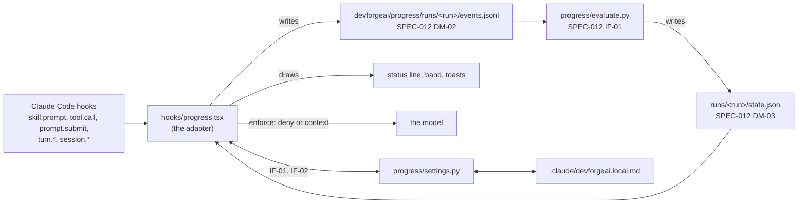

# SPEC-013 — Progress tracker adapter for Claude Code: events, gates, modes and the status line

## 1. Overview

SPEC-012 built the progress tracker's core: the formats, the brainstorm and architecture manifests, and
`evaluate.py`, which turns a skill run's event log into a progress state (merged in PR #59, plugin 0.12.0).
Nothing runs it in a session yet. This spec builds the Claude Code adapter, step 3 of the design proposal's
build order (`docs/specs/devforgeai-progress-ui.md` §11): a hooks module (a mod) in the `devforgeai` plugin that
- records each run of a tracked skill as an event log (SPEC-012 DM-02), from Claude Code's hooks;
- runs the evaluator and keeps the run's state;
- shows the run's progress in the status line, a two-row text band above the prompt, and toasts;
- in enforce mode, refuses the write gate's tool call when that gate raised flags, and gives the model the
  report gate's flags with the user's next prompt;
- fails open: when it can't run, the work goes on and the user is told.

It also adds `progress/settings.py`, which resolves `progress.mode` and saves the user's choice.

**The approach.** The event log is the truth. The adapter writes down what happened, as it happens, and
interprets nothing: it parses no tick and applies no rule. The evaluator, a pure function, computes the state
from the whole log each time (SPEC-012 BEH-01). So the adapter carries no copy of any rule (the mods proposal's
rule 2), a state that is lost or stale can be computed again from the log, and another tool's adapter shares
the same evaluator.

**Out of scope,** each for a later spec:
- the Journey and Workflow pane, and its graphics (`Svg`, `Image`, `Raster`), characters and animation settings;
- `progress.html`, `chain_state.py` and the project's phases, and Skill health;
- manifests for the other skills;
- locking `progress.mode` at project level, which arrives with the shared-schema change (ADR-006 D3);
- guards that refuse commands or paths (ADR-006, "Out of scope");
- offering the chain's next skill as a Tab suggestion;
- the Codex port's adapter, and moving manifests into the skills (the mods proposal's Part B).

## 2. Constraints

- **ADR-006** (accepted 2026-10-02), whose follow-up gives this spec D1, D3 and D6:
  - D1: a hook blocks only at one of the tracker's gates, only in enforce mode, by refusing the gate's tool
    call with a reason the model reads. The tracker fails open: when the evaluator can't run, the call proceeds,
    the user sees a notice, and the adapter logs it. A rule that can't be checked is not a flag.
  - D3: `progress.mode` is `observe` or `enforce`, `observe` by default; the adapter resolves it at session
    start and records the value and its source in the run's event log; until the shared-schema change, it applies
    the framework default and honours an entry in the local preference file; the band's button writes that entry.
  - D6: the user's entry lives in `.claude/devforgeai.local.md` (ADR-003 A3's format); display settings stay in
    Claude Code's own plugin settings.
- **SPEC-012's contracts** (approved, v1): the adapter writes DM-02 events and nothing the format doesn't allow,
  reads the DM-03 state, runs IF-01, follows the run ID format and the operational files of §4, and writes the
  rule that keeps `devforgeai/progress/` out of git (SPEC-012 §4 gives that to this spec).
- **Decisions are the user's** (PRD-001 FR-003; the mods proposal's rule 5). The adapter writes no document and
  changes no skill text. No button sends a prompt. The mode changes only when the user presses its button.
- **Evals stay the proof** (the mods proposal's rule 1). A headless session, which includes every child run of
  `claude plugin eval`, is left untouched (BEH-01).
- **The mod API is early access.** Every API claim here was read in Claude Code 2.1.287's declarations and the
  `plugin-authoring` skill's `reference.md`, among them: `$.plugin.root` (the plugin's folder, absolute),
  `$.session.root()` and `$.session.version()`; `$.process.run(argv, { timeoutMs })` (30 seconds by default; it
  rejects when the command is still running then); `$.fs` (read, write, list, exists, stat; no append); a `.catch`
  handler receives a replay-safe `next`; `tool.call` and `turn.complete` carry `agentId` only for a subagent;
  `turn.complete`'s `answer`; `session.end`'s reasons, `clear` with no `session.start` after it; `prompt.compose`'s
  trait `print`; and `crypto.getRandomValues`. What they can't settle, the build checks first (VER-01), and the
  build rechecks the declarations on the build it runs on.
- **Bryan's decisions** (2026-10-02):
  - the adapter lives in the plugin, `src/claude/DevForgeAI/hooks/` (ADR-006's "one mod", and source in each
    plugin), not in `src/tools/mods/`;
  - enforce mode is specified and tested here, as ADR-006's follow-up says, though it is off by default;
  - no idle limit ends a run (BEH-05);
  - nothing is recorded in headless sessions (BEH-01).
- **Repository conventions.** Source lives in the plugin. `claude plugin test [dir]` runs "every `*.test.ts` and
  `*.test.tsx` under dir", so the module's tests sit beside it in `hooks/`, and the deploy command excludes them
  (§10); Python tests live in `src/tests/progress/`, which doesn't deploy.
- **The standard library only** for `settings.py`, which must run under `python3 -S`, like `evaluate.py`.

## 3. Architecture and components



| Path | Holds | Deploys |
| --- | --- | --- |
| `src/claude/DevForgeAI/hooks/hooks.json` | `{ "modules": ["./progress.tsx"] }` | yes |
| `src/claude/DevForgeAI/hooks/progress.tsx` | the adapter | yes |
| `src/claude/DevForgeAI/hooks/*.test.ts` | its tests, run by `claude plugin test src/claude/DevForgeAI` | no: the deploy command excludes them (§10) |
| `src/claude/DevForgeAI/types/index.d.ts` | the `$.state` contract (DM-03), named by `plugin.json`'s `types` | yes |
| `src/claude/DevForgeAI/progress/settings.py` | IF-01 and IF-02 | yes |
| `src/claude/DevForgeAI/.claude-plugin/plugin.json` | gains `types` and the `tracking` setting (DM-05) | yes |
| `src/tests/progress/test_settings.py`, `test_adapter_structure.py` | settings.py's tests (VER-02, VER-03) and the structure checks (VER-16) | no |

`evaluate.py`, its schemas and its manifests don't change.

| Hook | What the adapter does |
| --- | --- |
| `session.start` | resolves the mode (BEH-16), starts the evaluation timer (BEH-06), and keeps an open run across a reload (BEH-17) |
| `prompt.compose` | tells a headless session apart (BEH-01) |
| `skill.prompt` | starts and ends runs (BEH-02, BEH-03, BEH-05) |
| `tool.call` | records tool calls and answers (BEH-04); in enforce mode, checks the write gate before the call (BEH-08) |
| `prompt.submit` | records the user's prompts; in enforce mode, gives the model the report gate's flags (BEH-09) |
| `turn.start`, `turn.complete` | records turns and Claude's replies (BEH-04) |
| `session.end` | ends the run (BEH-05) |
| `ui.render` on `AbovePrompt` | draws the band (BEH-11) |

## 4. Data model

**DM-01. The events the adapter writes.** Every event carries SPEC-012 DM-02's `run`, `seq` (1, 2, 3 … within
the run, with no gaps), `time` (UTC, ISO 8601) and `kind`. Only the main loop is recorded: a `tool.call` or
`turn.complete` whose input carries an `agentId` is a subagent's, and is skipped (no DevForgeAI skill uses
subagents today).

| Claude Code | When | Event |
| --- | --- | --- |
| `skill.prompt` for a tracked skill (BEH-02) | as it loads | `skill-loaded`: `format` `devforgeai-events/1`; `skill`, the name without a `<plugin>:` prefix; `checklist`, the text that `next(e)` resolves to, which is what the model reads; `host`, `claude-code <version>` from `$.session.version()`; and two fields DM-02 allows but the evaluator doesn't read: `mode` and `modeSource` (ADR-006 D3) |
| `tool.call`, any tool but AskUserQuestion | after `next(e)` resolves | `tool`: `tool`; `path` (below); `command` for Bash; `exit`; `error`; `content` for Write and Edit (below) |
| `tool.call` of AskUserQuestion | after `next(e)` resolves | `answer`: `answered` true when the result holds at least one answer, false when the dialog was dismissed |
| `prompt.submit`, the user's own (no plugin's) | as it is submitted | `prompt` |
| `turn.start` | | `turn` with `phase` `start` |
| `turn.complete` | | `reply` with `text`, the turn's `answer`, when it isn't empty; then `turn` with `phase` `end` |
| `session.end` | | `run-end`, `reason` `clear` when the session ends by `/clear`, otherwise `session-end` |
| a tracked skill loading while a run is open | before the new run's `skill-loaded` | `run-end` with `reason` `another-skill`, in the old run |

The fields of a `tool` event:
- **`path`**, relative to the project root with `/` separators: Read, Write and Edit's `file_path`; Glob's
  `pattern`, joined to its `path` when one is given; Grep's `path`, or `.` when none is given. A path outside the
  project root is kept absolute.
- **`exit`**: the exit code when the result carries one (VER-01 checks Bash's result), otherwise 0 when the call
  succeeded and null when it failed.
- **`error`**: true when the result has `isError`, or when the adapter refused the call (BEH-08).
- **`content`**: a Write's `content`, or for an Edit the whole file the Edit will leave: the current file with
  `old_string` replaced by `new_string` once, or everywhere with `replace_all`. Left out when it can't be computed
  (ERR-06) or is over 256 KiB.

**DM-02. The files the adapter writes,** all under the project root's `devforgeai/progress/` (SPEC-012 §4):

| File | Written | Holds |
| --- | --- | --- |
| `.gitignore` | once, when the adapter creates the folder | the line `*`, which keeps the folder and everything in it out of git; the project's own `.gitignore` is never edited |
| `runs/<run>/events.jsonl` | after each event | the run's events (DM-01), one JSON object per line, rewritten whole from the run's lines in `$.state` (`$.fs` has no append) |
| `runs/<run>/state.json` | by the evaluator | SPEC-012 DM-03, through IF-01's `--out` |
| `runs/<run>/pending/events.jsonl`, `state.json` | during an enforce check (BEH-08) | the run's events plus the pending one, and the provisional state; removed after the check |
| `current.json` | after each evaluation | a copy of the open run's `state.json`, for renderers; the last run's stays after it ends |
| `adapter.log` | on each notice | one line per entry: `<UTC time> <run or -> <kind>: <text>`, kind one of `mode`, `switch`, `ignored`, `refused`, `context`, `fail-open`, `error` |

**DM-03. The adapter's session state,** in `$.state`, declared in `types/index.d.ts` under the plugin's name.
`$.state` survives a reload of the module; module variables don't (BEH-17).

```ts
interface ProgressState {
  run: { id: string; skill: string; seq: number; lines: string[]; dir: string } | null
  mode: 'observe' | 'enforce'
  modeSource: 'framework-default' | 'local'
  summary: { skill: string; current: number | null; steps: number; flags: number; yourTurn: boolean;
             ended: string | null; manifest: 'matched' | 'stale' | 'none' | 'unverified';
             states: string[]; currentTitle: string | null; lastFlag: string | null } | null
  lastEventAt: number          // ms since the epoch, for the idle display
  marked: boolean              // the run has events the evaluator hasn't seen
  headless: boolean | null     // null until the first prompt.compose
  shown: string[]              // flags already toasted, as "<step>:<type>:<seq>"
  contextSent: number[]        // report-gate seqs whose flags the model was given
  off: string | null           // why tracking is off for this session, or null
}
```

**DM-04. The local preference entry** (ADR-003 A3; ADR-006 D6). `.claude/devforgeai.local.md`, whose YAML
frontmatter is its entire content:

```
---
devforgeai_local: 1
progress.mode: enforce
---
```

**DM-05. The `tracking` setting,** a `userConfig` field in `plugin.json`: a string picker over `on` and `off`,
default `on`, shown in `/config`. It is a display-level switch for the person, not policy (ADR-006 D6): `off`
turns the whole adapter off for that user, in every project. The build checks the field's exact shape with
`claude plugin validate`.

## 5. Interfaces and contracts

`settings.py` is run as `python3 <plugin root>/progress/settings.py <command> …`:

| Item | Command | Behaviour |
| --- | --- | --- |
| IF-01 | `mode --root DIR` | Resolves `progress.mode` for the project at `DIR` (BEH-18): prints `observe framework-default`, `observe local` or `enforce local`. Each entry it can't use goes to stderr as `ignored .claude/devforgeai.local.md progress.mode (<reason>)`, the wording the skills use for ignored entries. Exit 0; exit 2 when `DIR` isn't a folder |
| IF-02 | `set-mode --root DIR --value observe\|enforce` | Saves the entry in `DIR/.claude/devforgeai.local.md` (BEH-18) and prints `saved progress.mode=<value> to .claude/devforgeai.local.md`. Exit 0 when saved; 1 when it refuses to change a file that isn't frontmatter-only; 2 when it can't write |
| IF-03 | the evaluator call | `<python> <plugin root>/progress/evaluate.py evaluate --manifests <plugin root>/progress/manifests [--manifests <root>/devforgeai/manifests/organization] [--manifests <root>/devforgeai/manifests] --events <events file> --out <state file> --root <root>`, SPEC-012 IF-01. A layer folder that doesn't exist is left out, since a `--manifests` that isn't a folder stops the evaluator (SPEC-012 ERR-04). `<python>` is the first of `python3` and `python` that runs (ERR-01) |

`<plugin root>` is `$.plugin.root`; `<root>` is `$.session.root()`. Both scripts are run through `$.process.run`
with an argv, never a shell string. `evaluate.py` isn't executable, so the interpreter is always named.

## 6. Behavior

```yaml items
behaviors:
  - id: BEH-01
    status: active
    rule: "The adapter acts only in an interactive session with the tracking setting on (DM-05). When the session's first prompt.compose carries the trait print, as claude -p and every child run of claude plugin eval do, the adapter records, writes, draws and refuses nothing for the rest of the session, and drops any events it held. Until that first prompt.compose it keeps a run's events in $.state and writes no file. With tracking off it does nothing at all."
  - id: BEH-02
    status: active
    rule: "A skill is tracked when it is one of the plugin's own skills (a folder under <plugin root>/skills/) or a <name>.json exists in <root>/devforgeai/manifests/ or <root>/devforgeai/manifests/organization/ (a project's own skill, ADR-006 D4). Its name is skill.prompt's skill without a '<plugin>:' prefix. Loading any other skill neither starts nor ends a run."
  - id: BEH-03
    status: active
    rule: "When skill.prompt fires for a tracked skill, the adapter calls next(e) first and never changes the text. It ends any open run with run-end another-skill, the same skill loading again included. It then opens a run: an ID of the UTC time as yyyymmddThhmmssZ, the skill's name and 8 hex digits from crypto.getRandomValues (SPEC-012 §4), and a skill-loaded event as the run's first (DM-01). The run's folder, devforgeai/progress/runs/<run>/, is created when its events are first written (BEH-15). Every skill of the plugin opens a run, git and documents-updater included: having no manifest, they are tracked by ticks only (SPEC-012 BEH-04's none), and the status line says so (BEH-10)."
  - id: BEH-04
    status: active
    rule: "While a run is open, the adapter turns each main-loop host event of DM-01 into its event, with the next seq, the UTC time and the run's ID, adds it to the run's lines in $.state and rewrites events.jsonl from them. Events while no run is open, and events that carry an agentId, are not recorded."
  - id: BEH-05
    status: active
    rule: "A run ends with run-end another-skill when a tracked skill loads; clear on session.end with reason clear; and session-end on session.end with any other reason (exit, resume, logout, the end of a -p run, a signal). Nothing else ends a run; there is no idle limit (Bryan, 2026-10-02). At session.end the run-end line is written first, and the final evaluation runs only while the hook's budget lasts: the log alone reproduces the state."
  - id: BEH-06
    status: active
    rule: "After a tool, answer, prompt, reply or run-end event, the run is marked. A timer runs IF-03 every half second when the run is marked and no timer-driven evaluation is running; it clears the mark as it starts. The timer starts at session.start, or at a skill.prompt when none is running, since no session.start follows a /clear. So at most one timer-driven evaluation runs at a time (an enforce check, BEH-08, runs apart from it on its own files), and a burst of events gives at most two evaluations. After exit 0 the adapter copies state.json to current.json and updates the summary in $.state, which redraws the status line and the band. In observe mode no tool call waits for an evaluation."
  - id: BEH-07
    status: active
    rule: "In observe mode the adapter never refuses a call and never adds text the model reads. Flags reach the user only: the status line, the band and toasts (BEH-10 to BEH-12)."
  - id: BEH-08
    status: active
    rule: "In enforce mode, for each main-loop Write or Edit while a run is open, the adapter checks before calling next(e). It writes the run's lines plus the pending tool event, with its content, to runs/<run>/pending/events.jsonl and runs IF-03 on it with --out runs/<run>/pending/state.json. When that state's gate has kind write, seq equal to the pending event's seq and refuse true, the adapter answers { deny } without calling next(e). The text says that DevForgeAI's progress tracker refused the write at the write gate, lists the messages of the flags raised at that seq, and says that the user decides these. The call is recorded as a tool event with error true, which is never evidence (SPEC-012 BEH-06), so the write gate is checked again when the write is retried. Otherwise the adapter calls next(e) and records the event as in observe mode. The pending folder is removed after each check."
  - id: BEH-09
    status: active
    rule: "In enforce mode, when an evaluation's gate has kind report and refuse true, the adapter adds the messages of the flags raised at that gate, once per gate seq, to the context of the user's next prompt.submit, so the model reads them with that prompt. It doesn't add them to a prompt that starts with '/', which usually loads the next skill, and drops them once the run has ended: the user has moved on. A run-end gate's flags reach the user only, since the conversation that would read them has ended. Neither gate has a tool call to refuse."
  - id: BEH-10
    status: active
    rule: "While a run is open, and after it ends until another run opens, the status line shows the summary: '<skill> <current>/<steps>' while a step is current; '<skill> done' when every step is reached; '<skill> ended' after run-end. Then, in this order and only when they apply: ' · your turn' when the current step shows your-turn; ' · <n> flag' or ' · <n> flags'; ' · ticks only' when the manifest is stale or none; ' · idle' when 30 minutes have passed with no event and no turn running; ' · enforce' in enforce mode. While tracking is off for the session (BEH-14, ERR-03), it shows 'progress: off (<reason>)' instead."
  - id: BEH-11
    status: active
    rule: "While a run is open, a ui.render hook on AbovePrompt draws two rows of text. Row 1: the skill, one glyph per step in order (done ●, current ◆, your-turn ?, pending ○, claimed ◐, unconfirmed ·, skipped-with-reason ⊘, not-applicable –, skipped ✗, rule-broken ✗) and 'step <current> of <steps>: <title>'. Row 2: 'observe mode' or 'enforce mode', a button 'Switch to enforce' or 'Switch to observe' (BEH-13), and the newest flag's message, or 'no flags'. With no run open, the hook returns next(e) and the band takes no rows."
  - id: BEH-12
    status: active
    rule: "Each flag shows one toast, '✗ Step <step> <type>: <message>', the first time an evaluation reports it. When the run's last step is reached without run-end, one toast says '✓ <skill>: all steps reached'. Toasts are the same in both modes."
  - id: BEH-13
    status: active
    rule: "Pressing the band's button runs IF-02 with the other mode. On exit 0 the mode changes for the session at once, its source becomes local, a toast confirms it, and adapter.log records the switch with the run's ID and last seq, because DM-02 has no event for it. On exit 1 or 2 the mode stays as it was and a toast gives IF-02's reason. The button never sends a prompt."
  - id: BEH-14
    status: active
    rule: "The adapter fails open (ADR-006 D1). Each of its hooks is registered with a .catch whose handler writes the error to adapter.log, shows a toast once per distinct error, and returns next(e), which the engine makes replay-safe in a .catch: the event goes on unchanged, or keeps the result the hook had already received. When the evaluator can't run (ERR-01, ERR-02, ERR-07), the tool call proceeds, the status line shows 'progress: off (<reason>)' until an evaluation succeeds, and events are still recorded, so the state can be computed later. The adapter registers no guard: a guard's fail-closed .catch (D1) belongs to the guard's own spec."
  - id: BEH-15
    status: active
    rule: "The adapter writes only under <root>/devforgeai/progress/ (DM-02), and .claude/devforgeai.local.md only through IF-02 when the user presses the button. It creates devforgeai/progress/ with its .gitignore holding '*' the first time it writes a run's events, which is only after BEH-01 has found the session interactive, and never edits the project's own .gitignore. It reads the plugin's files, the manifest folders, the local preference file through IF-01, and a file an Edit names (DM-01). It opens no network connection."
  - id: BEH-16
    status: active
    rule: "At session.start, and at a skill.prompt when $.state holds no mode (no session.start follows a /clear), the adapter runs IF-01 and keeps the mode and its source in $.state; it writes each entry IF-01 reports as ignored to adapter.log and shows them in one toast. Every skill-loaded event carries the mode and source in force when the run opened (ADR-006 D3). Until the shared-schema change brings progress.mode into policy, only the framework default and the local entry apply, and the button is always available."
  - id: BEH-17
    status: active
    rule: "A reload of the module (a hot reload, or a change to the tracking setting) keeps an open run: its ID, seq, lines, the mode and the summary are in $.state. The evaluation timer starts again at the reloaded module's session.start, and the adapter marks the run so the state is computed again."
  - id: BEH-18
    status: active
    rule: "settings.py reads .claude/devforgeai.local.md only as frontmatter: the file must start with a line '---' and end with the next '---' line, with nothing after it but blank lines. IF-01 uses the progress.mode entry when the file is frontmatter-only, devforgeai_local is 1, and the value is observe or enforce, quoted or not; otherwise the mode is observe from the framework default, and each reason is reported (ERR-04). IF-02 creates .claude/ and the file when they are missing, with devforgeai_local: 1 and the entry; in an existing frontmatter-only file it replaces the progress.mode line, or adds it before the closing '---', and keeps every other line as it was. It writes a temporary file beside the target and renames it over the target. It reads no other entry: the skills apply the rest (ADR-003 A3)."
```

## 7. Errors and edge cases

```yaml items
errors:
  - id: ERR-01
    status: active
    condition: "Neither python3 nor python runs: '<name> --version' fails for both at session.start."
    handling: "Keep recording events; skip every evaluation and every enforce check, so every call proceeds (BEH-14); write adapter.log once."
    user_result: "The status line shows 'progress: off (python not found)', and one toast says so."
  - id: ERR-02
    status: active
    condition: "IF-03 exits 2, or is still running after 5 seconds: $.process.run is given timeoutMs 5000 and rejects then."
    handling: "Leave the earlier state and current.json as they were; let the call proceed when this was an enforce check; write the evaluator's stderr line, or 'timed out', to adapter.log."
    user_result: "The status line shows 'progress: off (<reason>)' until an evaluation succeeds, and a toast shows each distinct reason once per session."
  - id: ERR-03
    status: active
    condition: "devforgeai/progress/ or a run's folder can't be created or written."
    handling: "Stop tracking for the session: drop the run and record nothing more."
    user_result: "The status line shows 'progress: off (cannot write devforgeai/progress)', and one toast says so."
  - id: ERR-04
    status: active
    condition: "The local preference file exists but isn't frontmatter-only, lacks devforgeai_local: 1, or gives progress.mode a value other than observe or enforce."
    handling: "Use observe from the framework default; IF-01 reports the reason (BEH-18); the adapter writes it to adapter.log. Never fatal (ADR-003 A3)."
    user_result: "One toast: 'ignored .claude/devforgeai.local.md progress.mode (<reason>)'."
  - id: ERR-05
    status: active
    condition: "IF-02 refuses (exit 1: the file isn't frontmatter-only) or can't write (exit 2) when the button is pressed."
    handling: "Keep the mode as it was; write IF-02's reason to adapter.log."
    user_result: "A toast gives the reason; the button still shows the same choice."
  - id: ERR-06
    status: active
    condition: "An Edit's resulting file can't be computed: the file can't be read, is over 256 KiB, or old_string doesn't occur, or occurs more than once without replace_all."
    handling: "Record the tool event without content. After the write, the evaluator reads the file under --root; an enforce check before the write can't see the field, so its content rules raise no flag and the call proceeds (SPEC-012 ERR-05)."
    user_result: "Nothing extra; the state may carry SPEC-012's note 'content not available; rule not checked'."
  - id: ERR-07
    status: active
    condition: "IF-03 exits 0 but its --out can't be read or isn't JSON."
    handling: "Treat it as ERR-02."
    user_result: "As ERR-02."
  - id: ERR-08
    status: active
    condition: "The session's first prompt.compose never comes, or the runtime orders events differently from what VER-01 found."
    handling: "Keep holding the run's events in $.state (BEH-01) and write nothing; the build revises this spec if VER-01 shows an order BEH-01 doesn't cover."
    user_result: "No status line or band until the session is known to be interactive."
```

## 8. Non-functional design

```yaml items
quality_responses:
  - id: QR-01
    status: active
    response: "In observe mode a tool call waits for no process: recording an event is in-memory work plus one file write, and evaluation runs on the timer (BEH-06)."
    measured_by: "VER-06 checks that no tool.call hook awaits $.process.run in observe mode; VER-15 records the time a recorded Write takes on the owner's machine."
    upstream:
      - {id: PRD-001, item: NFR-006, relation: informed_by, version: 11, hash: null}
  - id: QR-02
    status: active
    response: "In enforce mode each Write or Edit during a run costs one evaluator run before the call: the target is under 500 ms on the owner's machine, and 5 seconds is the limit after which the check fails open (ERR-02)."
    measured_by: "VER-15 records the time of an enforce check on the owner's machine; VER-09 covers the limit."
    upstream:
      - {id: PRD-001, item: NFR-006, relation: informed_by, version: 11, hash: null}
  - id: QR-03
    status: active
    response: "The adapter writes only under devforgeai/progress/ and, on the user's press, .claude/devforgeai.local.md; it reads only the files BEH-15 lists, and opens no network connection."
    measured_by: "VER-11 checks the files written in a scripted session; code review at build time, recorded in §9."
    upstream:
      - {id: PRD-001, item: NFR-007, relation: informed_by, version: 11, hash: null}
  - id: QR-04
    status: active
    response: "settings.py imports only the Python standard library and runs under python3 -S."
    measured_by: "VER-02 and VER-03 run every case normally and under python3 -S."
    upstream:
      - {id: PRD-001, item: NFR-004, relation: informed_by, version: 11, hash: null}
```

## 9. Verification

| Kind | Status |
| --- | --- |
| Structural: this spec against `src/schemas/spec.schema.json` | Passes, checked 2026-10-02 with the helpers of `src/tests/context/test_structure.py`: the frontmatter and every item block, with QR-01 to QR-04 linked to PRD-001 v11's NFRs; every BEH, ERR and QR item is covered by a VER item |
| Probe (VER-01) | Not run; the build's first step |
| Build | Not built |

**The probe (VER-01).** A throwaway mod, outside the plugin, logs what the declarations can't settle. It needs
an interactive session, so the owner runs it. Each line is a pass criterion; when one fails, this spec is revised
before step 2 of §11.

| # | Question | Passes when |
| --- | --- | --- |
| P1 | Does a hooks module in a skills-dir plugin load? `.claude/skills/devforgeai/` loads as `devforgeai@skills-dir` | the probe's `session.start` runs from a copy deployed there |
| P2 | Do `$.fs` and `$.process.run` run under the session's sandbox? | the probe writes `devforgeai/progress/` in a scratch project and runs `python3 --version` |
| P3 | How does `skill.prompt` spell a plugin skill? Does it fire for a preload, or inside a subagent? | `e.skill` is `devforgeai:brainstorm` or `brainstorm` for `/devforgeai:brainstorm`; no `skill.prompt` fires for a devforgeai skill the user didn't load |
| P4 | Is the checklist in the text the model reads, as written? | IF-02 of SPEC-012 (`check`) reports `matched` for the logged text of brainstorm and architecture |
| P5 | How does AskUserQuestion's result show an answer and a dismissal? | the two logged results differ in a field the adapter can read |
| P6 | Does Bash's result carry the exit code? | the logged result of `exit 3` shows 3, or `isError` alone (then `exit` follows DM-01's fallback) |
| P7 | Does `turn.complete`'s `answer` hold the whole reply, ticks included? | a reply with a ticked checklist arrives whole |
| P8 | Does the first `prompt.compose` come before the first `skill.prompt` of a session started with `/devforgeai:brainstorm`, and does `claude -p` show the trait `print`? | the order is logged, and `print` appears only under `-p` |
| P9 | Does a mod in the plugin run in `claude plugin eval`'s child runs? | logged either way; BEH-01 keeps them untouched in both cases |
| P10 | Does the engine write `.claude-plugin/types/` into the deployed copy when it loads the module? | logged either way; §10 adjusts the deploy check |
| P11 | What happens to `$.state` and running timers after `/clear`, which fires `session.end` with no `session.start` after it? | logged either way; BEH-06 and BEH-16 restart the timer and resolve the mode at the next `skill.prompt` in both cases |
| P12 | Can a `claude plugin test` file read a file outside the plugin through `$.fs` (VER-04's expected lines)? | the test reads `src/tests/progress/adapter/events.jsonl`; if not, the build keeps the lines in the test and the Python test reads them from there |

```yaml items
verifications:
  - id: VER-01
    status: active
    obligation: "The probe answers P1 to P12 as the table above says, and the answers are recorded in §9 with the Claude Code version. Any answer that contradicts DM-01, BEH-01, BEH-02 or BEH-03 revises this spec before the adapter is built."
    level: manual
    covers:
      - BEH-01
      - BEH-02
      - BEH-03
      - ERR-08
  - id: VER-02
    status: active
    obligation: "test_settings.py runs IF-01 on: no file (observe framework-default); progress.mode: enforce (enforce local); a quoted value; a bad value, a missing devforgeai_local, and a file with text after the frontmatter (each observe framework-default with its ignored line on stderr); and a root that isn't a folder (exit 2). Every case passes normally and under python3 -S."
    level: unit
    covers:
      - BEH-18
      - ERR-04
      - QR-04
  - id: VER-03
    status: active
    obligation: "test_settings.py runs IF-02: it creates .claude/ and the file when missing; replaces an existing progress.mode line and adds one when absent, leaving every other line and its order unchanged; refuses a file that isn't frontmatter-only with exit 1 and leaves it byte for byte; and leaves no temporary file behind. Every case passes normally and under python3 -S."
    level: unit
    covers:
      - BEH-18
      - ERR-05
      - QR-04
  - id: VER-04
    status: active
    obligation: "A claude plugin test script plays a session: /devforgeai:brainstorm loads, then a Read, a Bash run of validate_brn.py, an answered and a dismissed AskUserQuestion, a reply with ticks, a Write, a prompt, and a subagent's Write and reply. The events.jsonl written equals, byte for byte, the expected lines kept outside the plugin in src/tests/progress/adapter/events.jsonl (P12), with each DM-01 field (path forms, exit, error, content) and no subagent event; test_adapter_structure.py validates the same file against events.schema.json."
    level: integration
    covers:
      - BEH-04
  - id: VER-05
    status: active
    obligation: "Scripted sessions show: a second tracked skill ends the first run with run-end another-skill and opens a new one; the same skill loading again does the same; an untracked skill and a skill with only a project manifest are told apart (BEH-02); session.end with reason clear writes run-end clear and any other reason run-end session-end; after a /clear with no session.start, the next tracked skill resolves the mode and starts the timer (BEH-06, BEH-16); with the clock advanced 24 hours and no events, no run-end is written and the status line ends in ' · idle'; run IDs match SPEC-012's pattern."
    level: integration
    covers:
      - BEH-02
      - BEH-03
      - BEH-05
      - BEH-16
  - id: VER-06
    status: active
    obligation: "With $.process.run mocked, the evaluator runs with IF-03's argv, including each layer folder only when it exists; a burst of five events gives at most two runs; after exit 0, current.json equals state.json and the status line and band redraw; in observe mode no tool.call hook awaits $.process.run."
    level: integration
    covers:
      - BEH-06
      - QR-01
  - id: VER-07
    status: active
    obligation: "In enforce mode with a mocked provisional state whose gate is write at the pending seq with refuse true, the Write is refused with a text naming the flags, next(e) isn't called, the event is recorded with error true, and the pending folder is gone; with refuse false, or a gate at another seq, the call proceeds. In observe mode the same state refuses nothing and adds no context."
    level: integration
    covers:
      - BEH-07
      - BEH-08
  - id: VER-08
    status: active
    obligation: "In enforce mode, a state whose gate is report with refuse true puts the flag messages in the context of the next prompt.submit once, and not in a later one; a next prompt that starts with '/' gets none, and none is added after the run ends; a run-end gate adds no context; observe mode adds none."
    level: integration
    covers:
      - BEH-09
  - id: VER-09
    status: active
    obligation: "With python missing, an evaluator exit 2, a run past 5 seconds, and an --out that isn't JSON, every tool call proceeds in both modes, events are still recorded, the status line shows 'progress: off (<reason>)', one toast per distinct reason appears, and adapter.log has the line. A hook that throws passes its event on unchanged (ADR-006 D1's fail-open test)."
    level: integration
    covers:
      - BEH-14
      - ERR-01
      - ERR-02
      - ERR-07
      - QR-02
  - id: VER-10
    status: active
    obligation: "A session whose first prompt.compose carries print writes no file under devforgeai/ and draws nothing, even when a tracked skill loaded before that prompt.compose; with tracking off, nothing is written or drawn."
    level: integration
    covers:
      - BEH-01
  - id: VER-11
    status: active
    obligation: "After a scripted run, the files written are exactly devforgeai/progress/.gitignore (holding '*'), the run's events.jsonl and state.json, current.json and adapter.log; the project's .gitignore is byte for byte unchanged; with devforgeai/progress/ unwritable, tracking stops for the session with ERR-03's status line and no further writes."
    level: integration
    covers:
      - BEH-15
      - ERR-03
      - QR-03
  - id: VER-12
    status: active
    obligation: "For mocked states, the status line reads 'brainstorm 6/8 · 1 flag', 'architecture 7/11 · your turn', 'brainstorm done', 'brainstorm ended', with ' · ticks only' and ' · enforce' where they apply; the band, mounted on terminal and desktop, shows the glyph row and the mode with its button, and no rows with no run open; a press runs IF-02 with the other mode and switches it, a failed save keeps it; each flag is toasted once; ignored local entries give one toast at session.start."
    level: integration
    covers:
      - BEH-10
      - BEH-11
      - BEH-12
      - BEH-13
      - BEH-16
      - ERR-04
      - ERR-05
  - id: VER-13
    status: active
    obligation: "A run open before a reload continues after it with the next seq and the same ID, the timer evaluates it again, and no second run-end or skill-loaded is written."
    level: integration
    covers:
      - BEH-17
  - id: VER-14
    status: active
    obligation: "An Edit's content is the file it will leave, for one replacement and for replace_all; an Edit whose old_string is missing, repeated without replace_all, or in a file over 256 KiB is recorded without content."
    level: integration
    covers:
      - ERR-06
  - id: VER-15
    status: active
    obligation: "Dogfood in the CLI with the deployed plugin: a brainstorm run that writes the BRN without asking (observe mode) shows the status line and band and flags step 5 at the write gate, with no refusal; after 'Switch to enforce', a run that tries to write a non-open disposition without an answer is refused, and its retry after the user answers goes through. Each run's events.jsonl validates against events.schema.json, and its manifest state is matched. The times of a recorded Write and of an enforce check are recorded in §9."
    level: manual
    covers:
      - BEH-07
      - BEH-08
      - BEH-10
      - BEH-11
      - QR-01
      - QR-02
  - id: VER-16
    status: active
    obligation: "test_adapter_structure.py checks that hooks/hooks.json names one module that exists, plugin.json names types and the tracking setting (DM-05), CLAUDE.md's deploy command excludes *.test.ts and *.test.tsx, and the VER-04 fixture validates against events.schema.json; claude plugin validate src/claude/DevForgeAI reports nothing refused (recorded in §9)."
    level: unit
    covers:
      - BEH-04
      - BEH-15
```

## 10. Rollout, migration and rollback

- **Order.** The probe (VER-01) runs first, as a throwaway mod outside the plugin. If an answer contradicts this
  spec, the spec is revised and reviewed again before the build goes on.
- **Branch.** The build runs on its own branch and worktree (ADR-001).
- **Plugin version.** The plugin's folder changes, so `plugin.json` takes the next free minor version at merge.
- **Repository records** (`CLAUDE.md`):
  - the deploy command excludes the module's tests, with the list in a variable so each line pastes under 100
    characters (`CLAUDE.md`, Traps):

    ```bash
    X=(--exclude=__pycache__ --exclude=results --exclude='*.test.ts' --exclude='*.test.tsx')
    rsync -a --delete "${X[@]}" src/claude/DevForgeAI/ .claude/skills/devforgeai/
    ```
  - the source-and-deploy `diff -rq` check excludes the same, and `.claude-plugin/types` when P10 shows the
    engine writes it into the deployed copy;
  - Commands gains `claude plugin test src/claude/DevForgeAI`, `claude plugin validate src/claude/DevForgeAI` and
    `PYTHONDONTWRITEBYTECODE=1 python3 -B -m pytest -q -p no:cacheprovider src/tests/progress`;
  - `.gitignore` gains `src/claude/DevForgeAI/.claude-plugin/types/`, where the engine writes generated types when
    the plugin is loaded from source.
- **Who gets it.** Everyone who installs `devforgeai` gets the adapter in observe mode, which never blocks. The
  `tracking` setting turns it off; enforce mode is the user's choice, through the band's button.
- **Codex parity.** The Codex port can't run mods; the adapter is a Claude-only difference for Codex sessions to
  record in their import reports (the mods proposal's rule 8). The formats and `settings.py`'s rules are the
  shared contract.
- **Rollback.** Remove `hooks/`, `types/` and the two `plugin.json` keys; `settings.py` then has no caller.
  `devforgeai/progress/` in any project holds only ignored working data and can be deleted.
- **Pointers.** The design proposal's build order step 3 points here; when this is built, PRD-001 §11's FR-021
  row records it.

## 11. Implementation plan

1. Run the probe and record P1 to P12 (VER-01); revise this spec if any answer contradicts it.
2. Write `settings.py`'s tests, then `settings.py` (IF-01, IF-02, BEH-18; VER-02, VER-03).
3. Add `hooks/hooks.json`, `types/index.d.ts` and the `plugin.json` keys; check them with `claude plugin validate`.
4. Write the tests, then the recording: activation, runs, events and files (BEH-01 to BEH-05, BEH-15, BEH-17;
   VER-04, VER-05, VER-10, VER-11, VER-13, VER-14).
5. Write the tests, then evaluation and display: the timer, status line, band, toasts, mode and button (BEH-06,
   BEH-10 to BEH-13, BEH-16; VER-06, VER-12).
6. Write the tests, then enforce mode and failing open (BEH-07 to BEH-09, BEH-14; VER-07 to VER-09).
7. Add `test_adapter_structure.py` (VER-16), run plugin-validator, dogfood in the CLI (VER-15), and record the
   results and the `CLAUDE.md` changes (§9, §10).

## 12. Alternatives considered

- **An idle limit that ends a run.** Ending a run fires its end gate, so a pause would flag a half-done run and
  lose the answers given after it. Rejected by Bryan (2026-10-02): runs end at another skill, `/clear` or the
  session's end.
- **An entry in the project's `.gitignore`.** It edits a file the user tracks and shows as a change in every
  project and every eval scaffold. A `.gitignore` holding `*` inside `devforgeai/progress/` ignores the folder
  with no edit.
- **Parsing ticks or rules in the module.** Each adapter would carry its own copy. The evaluator holds the only
  copy (SPEC-012 §12).
- **Reading the local preference file in TypeScript.** Rules go in Python, one copy per port (the mods
  proposal's rule 2); `settings.py` is that copy for this plugin.
- **The module outside the plugin, in `src/tools/mods/`.** It would reach only this repository until a later
  spec moved it. Bryan chose the plugin (2026-10-02).
- **Observe mode only, enforce later.** ADR-006 gives D1 to this spec; Bryan kept it here (2026-10-02). The
  default stays observe.
- **Recording headless sessions.** It would add files to every eval scaffold and could change what graders see;
  evals must measure the skill alone.
- **Evaluating on every tool call before it proceeds.** It would slow every call in observe mode for nothing;
  only enforce mode's write gate needs an answer before the call.
- **A DM-02 event for a mode switch.** It would let the log carry mid-run switches, but DM-02 is approved and has
  no such kind; `adapter.log` records them until a SPEC-012 v2 adds one.

## 13. Open questions

Decided by Bryan on 2026-10-02:
- The adapter lives in the plugin (`src/claude/DevForgeAI/hooks/`).
- Enforce mode is specified and tested here; the default stays observe.
- No idle limit ends a run.
- Headless sessions are left untouched.

Notes:
- A mode switch during a run is in `adapter.log`, not in the event log, because DM-02 has no kind for it.
- Locking the mode at project level arrives with the shared-schema change (ADR-006 D3). Until then the button is
  always available.
- The probe may change DM-01 and BEH-01 to BEH-03; any change is a revision of this draft, before the build.
- The button saves `.claude/devforgeai.local.md` in the project. This repository's `.gitignore` already ignores it
  (ADR-003); in a project whose `.gitignore` doesn't, git shows it as untracked, and the user adds the entry. The
  adapter never edits a `.gitignore` of the project's.
- `git` and `documents-updater` have no manifest, so their runs are tracked by ticks only, and loading either one
  ends the run before it (BEH-03). A `/devforgeai:git commit` after a brainstorm therefore shows
  `git <n>/<m> · ticks only`, and the brainstorm's run ends with `another-skill`.
- Toasts for flags appear in both modes. If they distract during dogfooding, a later display setting can quiet
  them; they never reach the model in observe mode.

## Change Log

| Version | Date | Author | Change | Items affected |
|---|---|---|---|---|
| 1 | 2026-10-02 | claude-code (session a4f2ade8-0127-4b96-bc22-b3498b2ab3a9) | First draft, on Bryan's direction of 2026-10-02 and his four decisions: the adapter in the plugin, enforce mode specified here, no idle limit, headless sessions left untouched | all |
