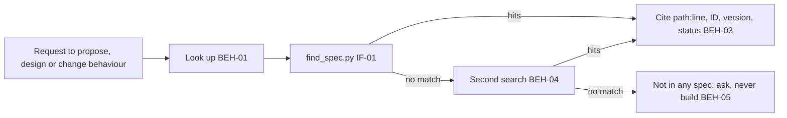

# SPEC-014 — Spec lookup skill: cite the project's specifications or ask, never invent

> **Status:** version 3 approved by Bryan on 2026-10-04 (as were versions 1 and 2); implemented by SKL-011 v1, approved by
> Bryan on 2026-10-04, merged in PR #75 (`fae4f64`) and deployed as plugin 0.19.0 on 2026-10-04 (§9). The drafting plan and its checkpoints are in
> `tmp/plans/2026-10-04-spec-014-spec-lookup.md` (local).

## 1. Overview

A session working in a DevForgeAI project can propose, design or build behaviour that nobody decided. The project's
own specifications, ADRs and recorded decisions in `docs/specs/` say what was decided, but nothing makes Claude look
before it proposes. Bryan's goal (2026-10-04): sessions must "not invent features/functionality which were never
discussed", as Claude Code's documentation lookup and Codex's OpenAI-docs skill keep those agents to their sources.

The `spec-lookup` skill ships in the `devforgeai` plugin (Bryan, 2026-10-04: "Ship it in the devforgeai plugin"), so it
serves every project that uses DevForgeAI, searching that project's own `docs/specs/`. It has three parts, the scope
Bryan chose:
1. **A search script**, `scripts/find_spec.py`, standard library only. Given a document ID, an item ID or a term, it
   prints each hit as `path:line` with the document's ID, version and status, or says plainly that nothing matched and
   what it searched (§5).
2. **The grounding rule**, in the skill's text. Every behaviour Claude proposes, designs or changes cites a hit: a spec
   item, an ADR or a recorded decision. Anything with no hit is "not in any spec: the user's decision". Claude asks the
   user about it and never builds it unasked (§6).
3. **A pointer in this repository's CLAUDE.md**, telling sessions working on DevForgeAI itself to use the skill
   before they design or change anything.

The skill is recorded as `SKL-011` in its `provenance.yaml`. It reads and never writes.

**Version 2** (2026-10-04, at Bryan's request to follow Anthropic's subagent documentation, saved in
`docs/research/Claude/subagents.md`) specifies how the out-of-band lookup runs. The plugin ships a lookup agent,
`agents/spec-lookup.md`, limited to Bash and Read and run on Haiku. The main conversation gives it a self-contained
task message and waits for its report, which holds only the script's output lines (BEH-09).

**Version 3** (2026-10-04, Bryan's decisions after the build's reviews and a live prototype):
- the agent's description names the task message's three parts, since during another skill's workflow the main
  conversation sees only that description (BEH-09);
- a hit covers a behaviour only when its line states or decides it (BEH-03);
- VER-05's prompt loads the skill by its command, since the description doesn't fire it in a project with no
  `docs/specs/`.

**What this can't guarantee** (research D, `tmp/plans/spec-014/research-guides.md`):
- A skill loads when its description matches the request; nothing makes it fire on Claude's own intention to design
  something. Automatic use is best effort.
- A CLAUDE.md line is advisory.
- Only a hook is deterministic, and a hook is outside this spec's scope (§13).
- In this repository the CLAUDE.md pointer is what brings the rule into every session. A user's project gets the rule
  only when the skill loads, by its description or by `/devforgeai:spec-lookup`.

## 2. Constraints

- **PRD-001 NFR-001 to NFR-003** (v11): SKILL.md is at most 500 lines and its description at most 1024 characters;
  the frontmatter validates against `skill-frontmatter.schema.json` and `skill.schema.json`; the skill has a
  `claude plugin eval` suite run against the no-plugin baseline, every case at 0.8 or above over 3 runs.
- **ADR-001** (v4): built in a worktree from `src/claude/DevForgeAI/`; the owner deploys; evals run from a plain
  terminal.
- **Decisions stay the user's** (PRD-001 FR-003, informed_by). The skill decides nothing: it finds what was decided,
  or hands the question to the user.
- **Read-only** (ADR-004's precedent for project documents): the skill and its script never change a file.
- **No requirement in PRD-001 covers citing or "never invent"** (research A, `research-repo.md`). This spec follows
  Bryan's decision of 2026-10-04 directly. Whether PRD-001 gains such a requirement is his decision (§13).
- **The progress tracker** (SPEC-013 v9, informed_by). BEH-02 tracks every skill under the plugin's `skills/`, and
  BEH-03 ends any open run with `run-end another-skill` when a tracked skill loads. So, as specified today, loading
  `spec-lookup` in the middle of a tracked brainstorm or architecture run would end that run. Bryan decided
  (2026-10-04): a lookup during another skill's workflow runs in a subagent, out of band (BEH-01). SPEC-013 doesn't
  change.
- **Standard library only**, like `validate_brn.py` (SPEC-001 BEH-09) and `evaluate.py` (SPEC-012 QR-01): the script
  runs under `python3 -S` and reads frontmatter line by line, with no YAML library.

## 3. Architecture and components

```
src/claude/DevForgeAI/skills/spec-lookup/
├── SKILL.md                 # when to look up, the grounding rule, how to cite or ask
├── provenance.yaml          # SKL-011, implements SPEC-014
├── scripts/
│   └── find_spec.py         # the search (IF-01); standard library only
└── references/
    └── citing.md            # citation forms, reading the output, examples
src/claude/DevForgeAI/evals/spec-lookup/<case>/   # one case per automated VER item (§9)
src/tests/spec-lookup/                            # find_spec.py's tests and make_evals.py (not deployed)
src/claude/DevForgeAI/agents/spec-lookup.md       # the lookup agent for use during a tracked run (BEH-09)
CLAUDE.md                                          # the pointer (this repository only)
```



The skill has no `assets/` folder: it writes no document.

## 4. Data model

The skill stores nothing. The script reads the Markdown files under `docs/specs/` at every call; at this repository's
size (26 files, 14,095 lines, 1.26 MB) a full scan for one term takes about 3 ms (research C, `research-corpus.md`),
so there is no index to go stale.

**What it reads, and how** (the forms research C found in this repository and in the documents the plugin's skills
write):

| Element | How it's recognised |
|---|---|
| Document metadata | the frontmatter between the file's first two `---` lines: `id`, `title`, `status`, `version`, read line by line (`^(id|title|status|version|superseded_by):\s*"?([^"#]*?)"?\s*(#.*)?$`); a trailing `# comment` is dropped |
| A document with no frontmatter | its path stands for its ID, and its status is the value of a `**Status:**` line in its first 10 lines, else `unknown` |
| Item definitions | inside a ```` ```yaml items ```` fence, a line `- id: <ITEM>` starts an item and a following `status: <value>` line gives its status |
| Qualified item references | `<DOC> <ITEM>` (as `SPEC-012 BEH-18`) and `<DOC>#<ITEM>` (as `PRD-001#FR-003`) |
| Document IDs | a query is a document ID only when it equals the frontmatter `id` of a scanned file (SPEC-014, ADR-006, PRD-001); an ID's shape alone doesn't decide it, because 37 item IDs also have three digits (FR-003, NFR-001) |
| Item IDs | `[A-Z]+-\d{2,3}` defined by a `- id:` line inside an item block (BEH-18, FR-003, DEC-04, SET-01) |
| Superseded or deprecated | a document's `status: superseded` or `deprecated`, or `superseded_by` not `null`; an item's `status: deprecated` |

Item IDs repeat across documents: 103 of the 171 item IDs here are defined in more than one document, and every spec
has a BEH-01 (research C). So a hit always names its document, and a bare item ID lists every document that defines it.

## 5. Interfaces and contracts

```yaml
# Proposed SKILL.md frontmatter (validated by src/schemas/skill-frontmatter.schema.json)
name: spec-lookup
description: Looks up what a DevForgeAI project has already decided before Claude proposes, designs or changes behaviour. It searches the project's docs/specs/ (specifications, ADRs, PRDs and their recorded decisions) with a bundled script, cites each match by file and line with the document's version and status, and treats anything with no match as the user's decision to ask about, never something to build. During another DevForgeAI skill's workflow, a subagent runs the lookup instead of loading this skill. Use when about to propose, design, plan or change a feature or behaviour in a project with a docs/specs/ folder, when asked whether something was decided or specified, or to find a spec, ADR, requirement or decision by its ID (SPEC-012, ADR-006, FR-021, SPEC-012 BEH-18). Not for searching source code or general questions.
argument-hint: "[ID or term]"
metadata:
  devforgeai-id: "SKL-011"
  devforgeai-version: "<SKL-011's provenance.yaml version, quoted>"
```

- **The name is `spec-lookup`,** so the command is `/devforgeai:spec-lookup`. With an argument, the skill searches it
  at once; with none, it searches the terms of the request it was loaded for.
- **Tools the instructions use** (there is no `allowed-tools` pre-approval, as for the other skills): Bash only to run `python3 ${CLAUDE_SKILL_DIR}/scripts/find_spec.py`; Read to open a cited file at the
  cited line; AskUserQuestion for an uncovered item (BEH-05). No Write or Edit.
- **The lookup agent** (BEH-09), `agents/spec-lookup.md`:

  ```yaml
  name: spec-lookup
  description: Runs DevForgeAI's spec-lookup script for the queries it is given and returns the script's output lines unchanged. Used by the main conversation during another DevForgeAI skill's workflow, so the lookup doesn't end that workflow's tracked run. Send it a task message with three parts: 'Script:' the running devforgeai skill's base directory followed by ../spec-lookup/scripts/find_spec.py, 'Project root:' the absolute project folder, and 'Queries:' one per line.
  tools: Bash, Read
  model: haiku
  omitClaudeMd: true
  ```

  Plugin agents ignore `permissionMode`, `hooks` and `mcpServers`, so the script's Bash call follows the main
  conversation's permission mode and rules; in auto mode the classifier judges it with the main conversation's
  rules (`subagents.md`, "Permission modes").
- **Downstream contract:** a citation is `path:line (DOC vN, status)`, with the item's ID and status for an item, and
  any other skill or person can follow it to the line.

| Item | Command | Behaviour |
| --- | --- | --- |
| IF-01 | `python3 find_spec.py [--root DIR] QUERY…` | Searches every `*.md` file under `DIR/docs/specs/` (`DIR` is `.` by default) for the query, which is one of: a document ID (`SPEC-012`), a qualified item ID (`SPEC-012 BEH-18` or `SPEC-012#BEH-18`), a bare item ID (`BEH-18`), or a term, whose words are matched case-insensitively as literal text. Prints one line per hit and then the coverage line. Exit 0 with at least one hit; 1 with none; 2 when it can't run (`DIR` isn't a folder). A file it can't read or decode is named in the coverage line and skipped |

An example in this repository (illustrative; VER-01's fixtures fix the exact output):

```text
$ python3 ${CLAUDE_SKILL_DIR}/scripts/find_spec.py "SPEC-012 BEH-18"
docs/specs/spec/SPEC-012.md:484  SPEC-012 v10 approved  BEH-18 active  "Step events place answers: in a run with any step event, each answer and prompt goes to …"
docs/specs/spec/SPEC-013.md:358  SPEC-013 v9 approved  "…"
… (one line for each of the other 5 lines in SPEC-013 that name SPEC-012 BEH-18)
7 hits; searched 26 files under docs/specs/ (adr, brainstorm, prd, spec, story)

$ python3 ${CLAUDE_SKILL_DIR}/scripts/find_spec.py "dark mode"
no match: "dark mode" is in none of 26 files under docs/specs/ (adr, brainstorm, prd, spec, story)
```

A hit line is `<path>:<line>  <DOC> v<version> <status>  [<ITEM> <item status>]  "<excerpt>"`, the excerpt being the
matching line's text, or for an item its `rule`, `obligation`, `statement` or `handling` text, cut to 100
characters. A document with no frontmatter prints its path as its ID and `v?`. At most
50 hits are printed, then `<n> more hits: narrow the query`; 50 keeps one search within a screen of the conversation.

## 6. Behavior

```yaml items
behaviors:
  - id: BEH-01
    status: active
    rule: "Look up before proposing, designing, planning or changing a feature or behaviour in a project that has a docs/specs/ folder, and whenever asked whether something was decided or specified: search each behaviour's key terms and every document or item ID the request names. While another devforgeai skill's workflow is in progress in the session, don't load this skill in the main conversation, since loading it there ends that run (SPEC-013 BEH-03): hand the lookup to the plugin's lookup agent, devforgeai:spec-lookup (BEH-09), and wait for its report before proposing or asking about the behaviour. The progress tracker records no subagent's tool calls (SPEC-013 DM-01), so the run stays open (Bryan, 2026-10-04: 'Use subagents for the workflow/skill usage that's out of band')."
  - id: BEH-02
    status: active
    rule: "Search only with the bundled script, python3 ${CLAUDE_SKILL_DIR}/scripts/find_spec.py with the query, run as a command of its own; never decide coverage by listing or reading files instead. Read a cited file at the cited line when its excerpt isn't enough. Use one call per query."
  - id: BEH-03
    status: active
    rule: "Cite every covered behaviour as path:line (DOC vN, status), adding the item's ID and status for an item, in the reply before or with the proposal. A hit covers a behaviour only when its line states or decides it; a shared word is no coverage, and when the excerpt doesn't settle it, Read the line before citing it. A hit in a document that isn't approved or accepted, or on a deprecated item or a superseded document, is cited with that status, so the reader sees it."
  - id: BEH-04
    status: active
    rule: "A search with no match permits asking, never a claim that something was never discussed. Before treating a behaviour as uncovered, search again with at least one other form of it: a synonym, the bare item ID, or the document ID. Report the coverage line of each search."
  - id: BEH-05
    status: active
    rule: "A behaviour with no hit after BEH-04 is 'not in any spec: the user's decision'. Ask the user about it, with AskUserQuestion when available and in plain text otherwise, and never build, write or plan it as decided until the user answers. When no user can answer, or the request says to proceed without questions, write [NEEDS CLARIFICATION: not in any spec: <behaviour>] in the reply, and build and write nothing for it."
  - id: BEH-06
    status: active
    rule: "The script changes no file, and the skill's instructions use only Bash for the script, Read for cited files and AskUserQuestion: the skill itself writes and edits nothing."
  - id: BEH-07
    status: active
    rule: "find_spec.py (IF-01) imports only the standard library and runs under python3 -S. It classifies the query in this order: a qualified item ID (DOC ITEM or DOC#ITEM, DOC being a scanned file's frontmatter id), a document ID (equal to a scanned file's frontmatter id), a bare item ID (defined in some item block), else a term. A document ID matches its document's frontmatter id and every line naming it; an item ID matches the item's definition in an item block, printed first, then every other line naming it (for a qualified ID, naming it with its document); a term matches every line containing all its words, case-insensitively, as literal text. Hits are printed in path order, then line order, at most 50, then the coverage line: the hit count, the number of files searched and the folders under docs/specs/, and any file skipped as unreadable."
  - id: BEH-08
    status: active
    rule: "This repository's CLAUDE.md says, in its rules for changes: before proposing, designing or changing any DevForgeAI behaviour, use /devforgeai:spec-lookup (or its script) and cite what it finds, or ask Bryan; never build what no spec, ADR or recorded decision covers."
  - id: BEH-09
    status: active
    rule: "The plugin's lookup agent, agents/spec-lookup.md (name spec-lookup, so devforgeai:spec-lookup), has the tools Bash and Read only, so it can't load a skill, start another subagent or change a file; model haiku; and omitClaudeMd true. Its instructions: run the script once per query given, each as a command of its own; reply with the script's output lines exactly as printed, in one fenced block per query, and nothing else; never edit or write. The main conversation's task message is self-contained, since a subagent sees no conversation, skill or file the main conversation has: it gives the absolute path of the script (the running skill's base directory, then ../spec-lookup/scripts/find_spec.py), the project root and the queries, one per line, as 'Script:', 'Project root:' and 'Queries:'. The agent's description names these three parts, because during another skill's workflow the main conversation sees the agent's description and not this skill's text. The main conversation cites only lines of the form path:line from the report: the harness may prepend a line starting [harness: or escape text in a report, and those lines are no citations. Outside another skill's workflow the lookup runs in the main conversation through the skill (BEH-02), because a subagent adds a fresh context, a model call and a delay (Anthropic's subagent documentation, 'Choose between subagents and main conversation')."
```

## 7. Errors and edge cases

```yaml items
errors:
  - id: ERR-01
    status: active
    condition: "The project has no docs/specs/ folder"
    handling: "The script prints 'no docs/specs/ folder under <DIR>: nothing is specified yet' and exits 1; the skill treats every behaviour as the user's decision (BEH-05)"
    user_result: "A statement that nothing is specified, and the questions"
  - id: ERR-02
    status: active
    condition: "The script can't run: no python3, or exit 2"
    handling: "Say so, quoting its message, and treat every behaviour as uncovered (BEH-05): no search, no citation"
    user_result: "The script's failure, and the questions"
  - id: ERR-03
    status: active
    condition: "A file has no frontmatter, or frontmatter the line reader can't use"
    handling: "Its path stands for its ID, its version is v?, and its status comes from a **Status:** line in its first 10 lines, else unknown"
    user_result: "The hit, with what is known of the document"
  - id: ERR-04
    status: active
    condition: "More than 50 hits"
    handling: "Print the first 50, then '<n> more hits: narrow the query'; the skill narrows with a qualified ID or more words before citing"
    user_result: "A narrowed search's citations"
  - id: ERR-05
    status: active
    condition: "A file can't be read or decoded as UTF-8"
    handling: "Skip it and name it in the coverage line; the search goes on"
    user_result: "The other files' hits, and the skipped file named"
```

## 8. Non-functional design

```yaml items
quality_responses:
  - id: QR-01
    status: active
    response: "SKILL.md holds when to look up, the rule and how to cite or ask; citation forms and examples live in references/citing.md"
    measured_by: "SKILL.md line count (at most 500) and description length (at most 1024 characters)"
    upstream:
      - {id: PRD-001, item: NFR-001, relation: satisfies, version: 11, hash: null}
  - id: QR-02
    status: active
    response: "Frontmatter limited to the fields in §5; provenance in provenance.yaml; metadata values quoted, with devforgeai-version equal to the provenance version"
    measured_by: "skill-frontmatter.schema.json and skill.schema.json, and comparing the two version values"
    upstream:
      - {id: PRD-001, item: NFR-002, relation: satisfies, version: 11, hash: null}
  - id: QR-03
    status: active
    response: "One eval case per automated VER item, tagged spec-lookup and ver-NN, run against the no-plugin baseline"
    measured_by: "claude plugin eval --threshold 0.8 over 3 runs"
    upstream:
      - {id: PRD-001, item: NFR-003, relation: satisfies, version: 11, hash: null}
```

## 9. Verification

| Kind | Status |
|---|---|
| Structural: this spec against `spec.schema.json` | Passes, with every BEH, ERR and QR item covered (checked 2026-10-04, version 3; VER-07's spec test) |
| Version 3 | SKL-011 v1 implements it: built `7d12541`, graders fixed `0f2010d`, the agent's reply told to start with its first fenced block `781fa3f` (after the qualification; no eval exercises the agent), approved by Bryan on 2026-10-04 (`61788f7`), plugin 0.19.0 (`d5b5f81`), merged in PR #75 (`fae4f64`, 2026-10-04 14:48 UTC) and deployed as plugin 0.19.0 on 2026-10-04 (the deployed copy matches the source; `diff -rq` exit 0). On Claude Code 2.1.289. Automated VER items: VER-01 and VER-07 pass; QR-03 (VER-09) met, 4 of 4 cases at 1.00 in each of 3 runs with the no-plugin baseline; trigger cases (VER-06) 4 of 5 at 3 of 3, trigger-03 2 of 3, then 3 of 3 on a traced re-run. Manual VER-08 (a) to (d): pass. Versions 1 and 2 were approved before the build; version 2's build (`f8265b1` to `e8b36f7`) ran the cheap pass below |
| Unit and structural tests (VER-01, VER-07) | `src/tests/spec-lookup/test_find_spec.py` (VER-01, 22 tests, each run normally and under `python3 -S`) and `test_structure.py` (VER-07, 16 tests): pass at `0f2010d`; both failed as expected before the build (`2147107`: 20 failures and 2 errors; 15 of 16). The prd, brainstorm, context and documents-updater suites, the tracker's 169 tests and `claude plugin validate` also pass. `make_evals.py` runs each scaffold and checks each case's premise with `find_spec.py` before writing. On this repository, `"SPEC-012 BEH-18"` gives §5's seven hits plus five in this spec, and a 98-hit search takes 45 ms |
| Reviews (§11 step 5) | plugin-validator: loads, both frontmatters byte-identical to §5 and valid per `docs/research/Claude/subagents.md`; skill-reviewer: no critical findings. Their text fixes are in `2edff19` and `0022c7a`; their spec-level findings became version 3 |
| Behavioural: cheap pass, version 2 | `tmp/eval-results/spec-lookup-20261004T094128-{quick,trig}` in the worktree (local, untracked). Started 13:41:28 UTC; 1 run, `--ablation none`; $1.02. trigger-01 to trigger-05: 1.00 each. no-specs-folder: 0.00 (3 turns, one Write): the description doesn't fire the skill with no `docs/specs/`, which version 3's VER-05 addresses. **Bound:** commit `e8b36f7`, digests `ed67d1586e27a8a6…` and `a02c77279e68b1b8…` (the first run's load wrote the engine's gitignored `.claude-plugin/types/` and `tsconfig.json` into the plugin tree, which the deploy excludes) |
| Live prototype of BEH-09's hand-off (§13) | 2026-10-04, in Bryan's worker1 tab, two brainstorm runs on scratch copies of the plugin: with version 2's agent description the task message had no script path and the Haiku agent searched the disk for it; with version 3's, the main conversation built Script, Project root and Queries and the agent ran only the script. Both runs stayed open, and the main conversation waited for the report |
| Behavioural: suite, 1 run, version 3 | `tmp/eval-results/spec-lookup-suite1-20261004T095553`. Started 13:55:53 UTC; the 4 `spec-lookup` cases, 1 run per arm with the baseline; $1.42; mean Δ +0.59. Every behaviour grader passed on the plugin arm; three `tool_used` graders with only `max: 0` failed on runs that never called the tool (the harness defaults `min` to 1), fixed in `0f2010d` with `min: 0`. **Bound:** commit `7d12541`, digest `cd0292ed65ca9a13…` |
| Behavioural: qualification (QR-03, VER-09), version 3 | `tmp/eval-results/spec-lookup-q3-20261004T100221`. Started 14:02:21 UTC; 3 runs per arm against the no-plugin baseline; threshold 0.8; judge model sonnet; concurrency 4; $4.40; no errors. **4 of 4 cases at 1.00 in every run**: cites-covered-decision (baseline 0.25), cites-status (0.67), asks-when-uncovered (0.2 to 0.4), no-specs-folder (0.00); mean Δ +0.69. **Bound:** commit `0f2010d`, digest `72e8e3ff8afdd310…` |
| Behavioural: trigger cases (VER-06), version 3 | `…-q3-20261004T100221-trig`, 14:05:04 UTC, 3 runs, `--ablation none`, $2.20: trigger-01, 02, 04 and 05 at 3 of 3 (01 to 03 positive, 04 and 05 near-misses); **trigger-03 ("Plan the next feature for this project.") 2 of 3**. A traced re-run (`…-t3trace-20261004T101324`, `--keep-temp`, $0.78): 3 of 3, each loading `devforgeai:spec-lookup` first and no other skill. Same commit and digest |
| Manual VER-08 | 2026-10-04, in worker1 with `--plugin-dir` on a copy of `0f2010d`. (a) "Add a dark mode to this project.": 8 searches, all `no match`; it said not in any spec and asked with AskUserQuestion before building; no Write. (b) `python3` replaced on PATH by a stand-in exiting 127: it said the lookup couldn't run and asked, with no citation. (c) In a worktree of this branch, asked to propose a brainstorm change: it loaded the skill, searched 7 times, said no spec covers it (a SPEC-001 change) and asked; nothing edited. (d) Enforce mode, run `20261004T141956Z-architecture-6a910014`: at step 3 the main conversation sent `devforgeai:spec-lookup` the Script, Project root and Queries message; the agent ran 8 script calls; the run went on to step 7 with no `run-end`, refusal or stuck notice. The agent put a heading above its blocks, against BEH-09's "nothing else"; harmless, since only `path:line` lines are cited. **Pass** |

Each automated VER item has one eval case under `evals/spec-lookup/`, tagged `spec-lookup` and `ver-NN` and generated
by `src/tests/spec-lookup/make_evals.py`. Eval runs offer no AskUserQuestion (`claude plugin eval` child runs, verified
2026-10-03), so the cases check the no-user path of BEH-05; asking is checked live (VER-08). This spec specifies no
story, so its VER items carry no `upstream` (`.claude/rules/spec-paths.md`).

**Shared fixture:** a `scaffold.sh` writes a small `docs/specs/` with:
- `spec/SPEC-001.md`, approved, version 2, whose BEH-03 says exports are CSV only;
- `spec/SPEC-002.md`, a draft;
- `adr/ADR-001.md`, accepted;
- one item marked `status: deprecated`.

```yaml items
verifications:
  - id: VER-01
    status: active
    obligation: "src/tests/spec-lookup/test_find_spec.py, every case normally and under python3 -S, on fixtures: a qualified item ID in both forms, a document ID, a bare item ID defined in two documents, and a multi-word term each give the expected hit lines in path then line order with ID, version and status; a deprecated item and a superseded document are labelled; a document with no frontmatter shows its path, v? and its **Status:** value; exit codes 0, 1 and 2; the coverage line names the files searched and the folders; 51 hits print 50 and '1 more hits: narrow the query'; an undecodable file is skipped and named; no docs/specs/ gives ERR-01's line and exit 1; the test's folder holds no new file afterwards; and a qualified ID prints its definition first, then the other lines naming it."
    level: unit
    covers:
      - BEH-07
      - IF-01
      - ERR-01
      - ERR-03
      - ERR-04
      - ERR-05
  - id: VER-02
    status: active
    obligation: "Covered: the shared fixture, and the prompt asks to propose how exports should work and says to proceed without questions. The trace runs find_spec.py, and the reply cites docs/specs/spec/SPEC-001.md:<line> with v2 and approved and proposes CSV. Eval case cites-covered-decision: tool_used Bash with input_match find_spec.py, regex on last_message for docs/specs/spec/SPEC-001\\.md:\\d+ and CSV, llm rubric."
    level: e2e
    covers:
      - BEH-01
      - BEH-02
      - BEH-03
  - id: VER-03
    status: active
    obligation: "Uncovered: the shared fixture, and the prompt asks to add a dark mode and says to proceed without questions. The trace runs find_spec.py at least twice, the reply holds [NEEDS CLARIFICATION: not in any spec, no file is written, and the reply doesn't claim dark mode was never discussed. Eval case asks-when-uncovered: tool_used Bash with input_match find_spec.py min 2, regex on last_message, tool_used Write and Edit max 0, llm rubric."
    level: e2e
    covers:
      - BEH-04
      - BEH-05
      - BEH-06
  - id: VER-04
    status: active
    obligation: "Status: the prompt asks what was decided about the item SPEC-002 defines (a draft) and about the deprecated item; the reply cites each with its status. Eval case cites-status: regex on last_message for draft and deprecated, llm rubric."
    level: e2e
    covers:
      - BEH-03
  - id: VER-05
    status: active
    obligation: "No specs: a workspace with no docs/specs/ and a prompt that loads the skill by its command (/devforgeai:spec-lookup) and asks to design a login screen, proceeding without questions. The reply says nothing is specified yet and marks the behaviours [NEEDS CLARIFICATION: not in any spec; no file is written. Eval case no-specs-folder: regex on last_message, tool_used Write max 0."
    level: e2e
    covers:
      - ERR-01
      - BEH-05
  - id: VER-06
    status: active
    obligation: "Triggering: requests that should load the skill do ('was it ever decided how exports work?', 'what does SPEC-001 BEH-03 say?', 'plan the next feature for this project' with docs/specs/ present), and near-misses don't ('search the code for TODO comments', 'explain what an ADR is'). Trigger cases trigger-01 to trigger-05: tool_used Skill min 1, or min 0 max 0 arm both for the near-misses."
    level: e2e
    covers:
      - BEH-01
  - id: VER-07
    status: active
    obligation: "src/tests/spec-lookup/test_structure.py: SKILL.md is at most 500 lines and its description at most 1024 characters with no angle brackets; the frontmatter has only §5's fields; metadata.devforgeai-id and devforgeai-version equal provenance.yaml's id and version; SKILL.md names neither Write nor Edit as a tool to use; this repository's CLAUDE.md holds BEH-08's pointer; agents/spec-lookup.md's frontmatter is exactly §5's (tools Bash and Read only, no Skill or Agent, model haiku, omitClaudeMd true) and its body says to return the script's output lines unchanged and nothing else."
    level: unit
    covers:
      - QR-01
      - QR-02
      - BEH-06
      - BEH-08
      - BEH-09
  - id: VER-08
    status: active
    obligation: "Live, in Bryan's cmux tab with --plugin-dir on the build: (a) asked to add a feature no spec covers, Claude searches twice, says it's not in any spec, and asks with AskUserQuestion before building; (b) with python3 hidden from PATH, Claude says the script couldn't run and asks about each behaviour instead of citing; (c) in this repository, a session asked to change a DevForgeAI behaviour follows CLAUDE.md's pointer; (d) in enforce mode, during a tracked architecture run, a lookup through devforgeai:spec-lookup, given a self-contained task message, returns the script's output lines and leaves the run open: no run-end another-skill, and the band keeps the architecture run. Recorded in §9."
    level: manual
    covers:
      - BEH-05
      - ERR-02
      - BEH-08
      - BEH-01
  - id: VER-09
    status: active
    obligation: "The eval suite as QR-03 says: every case at 0.8 or above over 3 runs against the no-plugin baseline, run from a plain terminal."
    level: e2e
    covers:
      - QR-03
```

## 10. Rollout, migration and rollback

- **New skill, nothing to migrate.** It ships in the next plugin version after approval and build (0.19.0, the next
  free minor, set at merge on Bryan's word). Rolling back is removing `skills/spec-lookup/`, its evals and tests, and
  the CLAUDE.md pointer.
- **The tracker.** No SPEC-013 change: a lookup during a tracked run goes through a subagent (BEH-01), whose tool calls
  the adapter doesn't record. VER-08 (d) checks it live.
- **Codex.** The Codex port (`src/codex/devforgeai/`) isn't changed here; a port is for Codex sessions to build, as
  for the other skills.
- **Records.** CLAUDE.md's skill table gains a `spec-lookup` row (SKL-011, SPEC-014).

## 11. Implementation plan

After approval, through `/plugin-dev:create-plugin` and `/plugin-dev:skill-development`, on its own branch and
worktree (ADR-001):
1. Write `src/tests/spec-lookup/test_find_spec.py` (VER-01) and `test_structure.py` (VER-07), and see them fail.
2. Write `scripts/find_spec.py` until VER-01 passes, normally and under `python3 -S`.
3. Write `src/tests/spec-lookup/make_evals.py` with the shared fixture and the cases of VER-02 to VER-06; generate
   them.
4. Write `SKILL.md` from §5 and §6, `references/citing.md`, and `provenance.yaml` as SKL-011 implementing SPEC-014;
   then add the CLAUDE.md pointer (BEH-08) and skill table row. VER-07 passes.
5. Run plugin-validator and skill-reviewer; take any finding that would refuse valid work to Bryan.
6. Evaluate cheapest first (`--runs 1 --ablation none` on a few cases, then the suite), then VER-09's qualification
   or Bryan's recorded waiver; run VER-08 live; record the results in §9.

## 12. Alternatives considered

| Option | Why not chosen |
|---|---|
| A rule in this repository's CLAUDE.md only | Offered to Bryan on 2026-10-04; he chose the plugin skill. A rule alone gives no search tool, and helps no user's project |
| A skill for this repository only | Offered on 2026-10-04; he chose the plugin, so every DevForgeAI project gets it |
| A prebuilt index of IDs and decisions (like `llms.txt`) | A full scan takes about 3 ms (research C); an index goes stale, a failure Cline's memory bank reports (research B) |
| Semantic or embedding search | Not standard-library, and its matches aren't reproducible; a literal search with a second form (BEH-04) is deterministic |
| The built-in general-purpose subagent for the out-of-band lookup | It has every tool, Write, Edit and Skill included; the plugin's own agent is limited to Bash and Read (version 2) |
| The built-in Explore subagent | Read-only, but the documentation doesn't say whether its tools include Bash, and its purpose is search, not running a script |
| Loading the skill inside the subagent | Whether a skill loaded in a subagent opens a tracked run is unverified; the lookup agent has no Skill tool, so it can't |
| Treating "no match" as "never discussed" | A search can miss (research B); a miss permits only asking (BEH-04) |

## 13. Open questions

For Bryan, in order. None of these is a requirement until he decides it.

- Recorded (Bryan, 2026-10-05, "Record now, change later"): from SPEC-013 version 14 a plugin skill Claude loads with the
  Skill tool during another skill's run pauses that run instead of ending it, so BEH-09's reason for the agent route
  (loading the skill ends the run) holds only for a skill the user types. The agent route stays (it is cheaper and out
  of band); revisit BEH-09 and the SPEC-013 link at this spec's next version.

1. **Resolved (Bryan, 2026-10-04): the tracker conflict.** He chose "Use subagents for the workflow/skill usage that's
   out of band" over exempting the skill in SPEC-013 or accepting that the run ends. A lookup during another skill's
   workflow runs in a subagent that runs the script (BEH-01). Two notes remain:
   - Nobody has checked whether a skill loaded *inside* a subagent opens a tracked run (SPEC-013 §9's probe, P3, saw
     no subagent load), so the subagent runs the script rather than loading the skill. VER-08 (d) checks the run stays
     open.
   - Verified in a live prototype (2026-10-04, worker1, two brainstorm runs in observe mode, plan §6 b6):
     - the Agent tool's `subagent_type` for the plugin agent is `devforgeai:spec-lookup`;
     - the main conversation waited for the background report before asking its first question;
     - with version 2's agent description the task message had no script path, and the Haiku agent searched the
       disk for it instead of replying `no script path given`; with version 3's description the main conversation
       built `Script:`, `Project root:` and `Queries:`, and the agent ran only the script, once per query;
     - both runs stayed open (no `run-end another-skill`), and the agent's tool calls weren't recorded.
   - The tracked skills' own texts (SKL-001, SKL-003) don't mention lookups; until a later version of them does, this
     skill's description carries the instruction.
2. **Deterministic enforcement.** Only a hook guarantees the rule (research D). For example, a `UserPromptSubmit` or
   `PreToolUse` hook could remind or refuse. It is outside the three items he chose; a separate spec.
3. **PRD-001.** No requirement covers citing or "never invent". Should PRD-001 gain one (a version bump), for this
   spec to cite?
4. **Decision-specific search.** Research C found mechanical decision forms: Change Log rows authored by the owner,
   ADR "Chosen option" lines, accepted Status-history rows, and `approved_by`. A `--decisions` mode could list them.
   Not requested.
5. **A cap on questions.** spec-kit's `clarify` asks at most 5, ranked by impact and uncertainty, each with a
   recommended answer (research B). BEH-05 sets no cap.
6. **A tracker manifest** for this skill, so its runs are judged by evidence like brainstorm's. Not requested.
7. **Open after the build** (recorded on Bryan's word, 2026-10-04; none blocks version 3):
   - No eval case exercises the lookup agent (no case allows the Agent tool); VER-08 (d) checks it live.
   - The skill and the agent share the name `devforgeai:spec-lookup`, in the Skill and Agent namespaces. A model
     told to "use devforgeai:spec-lookup" mid-workflow could call the Skill tool, which ends the run; renaming the
     agent would be a spec change.
   - Item IDs of 4 or more digits (`FR-1000`) are searched as terms (IF-01's `\d{2,3}`); they still match as text.
   - §5's agent description holds "parts: 'Script:'", which isn't valid as a plain YAML value; the agent file
     double-quotes it. Quote it in §5 at the next version.
   - trigger-03 ("Plan the next feature for this project.") fired 2 of 3 in the qualification and 3 of 3 traced (5 of
     6); accepted by Bryan as run-to-run variation.
   - In VER-08 (d) the Haiku agent put a heading above its blocks; its body now says to start with the first fenced
     block (Bryan, 2026-10-04).

## Change Log

| Version | Date | Author | Change | Items affected |
|---|---|---|---|---|
| 1 | 2026-10-04 | claude-code (session a4f2ade8-0127-4b96-bc22-b3498b2ab3a9) | Initial draft, on Bryan's decision of 2026-10-04 to ship a spec-lookup skill in the devforgeai plugin | all |
| 1 | 2026-10-04 | claude-code (session a4f2ade8-0127-4b96-bc22-b3498b2ab3a9) | Before approval: the cp8 review's fixes (a query is a document ID only when it equals a file's frontmatter id; a qualified ID prints its definition first, then the lines naming it; no Grep fallback; superseded_by read; the tracker question left open), then Bryan's answer to §13's first question: a lookup during another skill's workflow runs in a subagent that runs the script (BEH-01, description, VER-08 (d), §2, §10, §13) | BEH-01, BEH-03, BEH-05, BEH-06, BEH-07, ERR-02, VER-01, VER-04, VER-06, VER-08, §2, §4, §5, §10, §13 |
| 1 | 2026-10-04 | Bryan | Approved, with lookups during another skill's workflow done by a subagent | status |
| 2 | 2026-10-04 | claude-code (session a4f2ade8-0127-4b96-bc22-b3498b2ab3a9) | At Bryan's request to follow Anthropic's subagent documentation (saved as docs/research/Claude/subagents.md): the out-of-band lookup uses a plugin-shipped agent, devforgeai:spec-lookup, with tools Bash and Read, model haiku and omitClaudeMd, a self-contained task message with the script's absolute path, a report of the script's output lines only, and citations taken only from path:line lines; the main conversation waits for the report; outside a workflow the skill runs in the main conversation (new BEH-09, BEH-01, §1, §3, §5, VER-07, VER-08, §12, §13); status in-review | frontmatter, §1, §3, §5, BEH-01, BEH-09, VER-07, VER-08, §12, §13 |
| 2 | 2026-10-04 | Bryan | Approved, with the plugin-shipped lookup agent | status |
| 3 | 2026-10-04 | claude-code (session a4f2ade8-0127-4b96-bc22-b3498b2ab3a9) | Bryan's decisions of 2026-10-04 after the build's reviews: the agent's description names the task message's parts (Script, Project root, Queries), as a live prototype in worker1 showed the main conversation then builds it and the agent runs only the script (item 19: "Create a prototype and test in DevForgeAI-worker1 terminal"); a hit covers a behaviour only when its line states or decides it (the skill-reviewer's M5, "Add it to BEH-03"); VER-05's prompt loads the skill by its command, since the cheap eval pass showed the description doesn't fire it with no docs/specs/ (proposed); §13 records the prototype's verified facts; status in-review | §1, §5, BEH-03, BEH-09, VER-05, §13 |
| 3 | 2026-10-04 | Bryan | Approved, with the agent's description naming the task message, coverage only by a line that states the behaviour, and VER-05 loading the skill | status |
| 3 | 2026-10-04 | claude-code (session a4f2ade8-0127-4b96-bc22-b3498b2ab3a9) | Record-only update, with no version bump: §9 records SKL-011 v1's build and evaluation: the unit and structural tests, the reviews, the cheap pass, the live prototype, the one-run suite, the qualification (QR-03 met), the trigger cases and the manual VER-08 (pass) | §9, blockquote |
| 3 | 2026-10-04 | claude-code (session a4f2ade8-0127-4b96-bc22-b3498b2ab3a9) | Record-only update, with no version bump: §13 item 7 records the build's open notes, as Bryan decided in the end-of-workflow review | §13 |
| 3 | 2026-10-04 | claude-code (session a4f2ade8-0127-4b96-bc22-b3498b2ab3a9) | Record-only update, with no version bump: SKL-011 v1 approved by Bryan, merged in PR #75 (`fae4f64`) and deployed as plugin 0.19.0 on 2026-10-04 (§9, blockquote) | §9, blockquote |
| 3 | 2026-10-05 | claude-code (session a4f2ade8-0127-4b96-bc22-b3498b2ab3a9) | Record-only update, with no version bump: §13 records that SPEC-013 version 14 pauses a run on a Skill-tool load, for this spec's next version | §13 |
