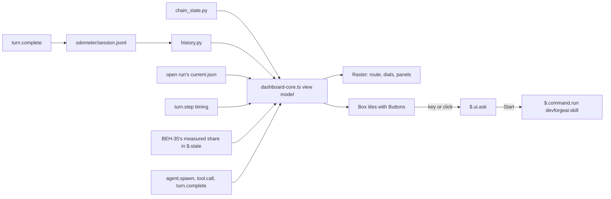

# SPEC-016 — DevForgeAI Dashboard: the planning chain, the run and the session in one pane

> **Status:** version 1, approved 2026-10-06, not built. The design and its reasoning are in `docs/specs/devforgeai-dashboard.md`
> (proposal; cited below as "the design"), with Bryan's decisions quoted in its §1 and §16. The working prototype is
> `src/tools/dashboard-probe/`. The plan is `tmp/plans/2026-10-06-dashboard.md` (local). This spec is stacked on
> SPEC-013 versions 21 to 24 and SPEC-012 versions 16 and 17, all approved; SPEC-012 version 16 and SPEC-013
> version 22 are built (PR #99, plugin 0.27.0), the rest not yet. The drafts review's fixes
> (`tmp/plans/dashboard/review-specs.md`) are applied.

## 1. Overview

The dashboard is one pane of the `devforgeai` plugin's progress tracker. It shows the planning chain's seven phases
as tiles, the open run, three instruments (RPM, FUEL, PACE), an odometer, the session's agents and the guardrails in
force, and it starts a phase's skill when the user answers its question (PRD-001 FR-022). It draws in the terminal
first (Bryan, 2026-10-05: "option 1"); the desktop app's SVG version is a later version (§10).

It is part of the tracker's one hooks module (`hooks/progress.tsx`): Claude Code takes one hooks module per plugin
(`claude plugin validate` refuses a second `hooks.json` entry, checked 2026-10-06). Its pure drawing code is in
imported files, and every call on `$` stays in `progress.tsx`'s top-level functions, as SPEC-013 §2 requires.

Everything here is a view and a launcher. The dashboard adds nothing to the model's context, refuses no tool call, and
adds no event of its own to a run: the `usage` events in a run are the tracker's (SPEC-013 BEH-40), counts and no
evidence. Its one write outside the pane is the session's odometer file, which is outside every run (BEH-10).

## 2. Constraints

- **PRD-001 FR-022** (v12, implements); **FR-021** (informed_by); **FR-003** (constrains): a tile starts a skill only
  on the user's answer to its question (BEH-15), and nothing on the dashboard decides a disposition, status,
  priority or approval. FR-022's statement names the phases, the run and its pace, context left, the session's and
  the project's token use, agents, guardrails and the start on the user's answer; the three looks, the character, the
  RPM dial, the trip computer, the keys and the settings are Bryan's decisions under it (the design §1 and §16), not
  separate requirements.
- **ADR-006 D1:** the dashboard fails open. When a script or a reading fails, the rest still draws, and it never
  blocks the session (§7). **D3:** the mode button is SPEC-013 BEH-13's. **D6:** the dashboard's settings are display
  settings in the plugin's `userConfig`.
- **One hooks module per plugin** (verified 2026-10-06), so the dashboard's hooks are in `progress.tsx`; `$` is
  passed only to top-level functions of that file (SPEC-013 §2).
- **The mod API is early access** (Claude Code 2.1.291 when written). Every API fact this spec relies on was checked
  live on 2026-10-06 (the design §14), is documented in the 2.1.291 types (cited where used), or is marked
  unverified in §13.
- **Keys first.** Every control has a key. Clicks are honoured where the terminal reports them; in Bryan's terminal
  (cmux) none reach Claude Code (the design §14).
- **Not built here:** the desktop `Svg` renderer, `progress.html`, the skill-health view, opening a document from
  a tile (the design §11 and §16), and, in the layouts, the log and telemetry panels, the start and ship markers with
  per-phase times, and a done tile's steps and time (DM-07).

## 3. Architecture and components

```
src/claude/DevForgeAI/
├── hooks/progress.tsx          # the adapter (SPEC-013) and the dashboard's hooks (the table below)
├── hooks/dashboard-core.ts     # pure: the view model (DM-01), the layouts, the Raster cells, the dial geometry,
│                               #   wheel-spin's rule, the ETA's text; no $
├── hooks/dashboard-art.ts      # pure: the looks' colour tokens (DM-03) and the characters' frames (DM-05)
├── hooks/dashboard.test.tsx    # the kit tests (§9), excluded from the deploy as *.test.tsx files are
├── commands/dashboard.md       # lists /devforgeai:dashboard; the hook answers it (IF-01)
├── .claude-plugin/plugin.json  # the dashboard's settings (DM-02)
└── types/index.d.ts            # the dashboard's $.state values (DM-04)
```

**The dashboard's hooks** (all in `progress.tsx`, alongside the adapter's):

| Hook | Does | Item |
| --- | --- | --- |
| `command.run` on `{ command: 'devforgeai:dashboard' }` | answers the command | IF-01, BEH-01 |
| `session.start` | opens the pane when `dashboardAutoOpen` is on; checks the command is listed | BEH-01, ERR-01 |
| `ui.render` | draws the pane | BEH-03 |
| `turn.step`, main loop only | RPM and time to first token, passing every chunk on | BEH-06, ERR-08 |
| `turn.complete`, main loop and agents | writes the session's odometer file (every user with tracking on, the pane open or not); the trip computer's sums; an agent's end; while the pane is open, re-runs history.py | BEH-10, BEH-11, BEH-12 |
| `agent.spawn`, `tool.call` with an `agentId` | the agents tree, passing the call on | BEH-12 |
| `$.clock.every` timer, Buttons' hotkeys | repaints; keys | BEH-03, BEH-14 |

The dashboard registers **no `session.measure` hook**: the measured share is SPEC-013 BEH-35's, which keeps it in
`$.state`, and the pane reads it at each repaint (BEH-07). A Write or Edit under `docs/specs/` reaches the dashboard
through the adapter's own recording of tool results (SPEC-013 BEH-04), which calls the dashboard's refresh (IF-03).

The scripts the dashboard reads, `progress/chain_state.py` and `progress/history.py`, and the odometer ledger's
format are SPEC-012's (version 17). The usage events and `prune.py`'s keeping of the ledger folder are SPEC-013's
(version 24). The ledger's writer is this spec's BEH-10.



## 4. Data model

**DM-01. The view model**, built by `dashboard-core.ts` from the readings, at each draw and each repaint:
- `layout`: `dock` (64×48), `compact` (120×36) or `wide` (160×48) (BEH-02, DM-07);
- `look`: `Default`, `Night drive` or `Race telemetry`; `character`: `Ember`, `Clawd` or `none`;
- `tiles`: seven, in chain order (Brainstorm, PRD, Architecture, Context, Epic, Story, Spec), each with its glyph
  (✦ ≡ ⌂ ◎ ▲ ¶ §), name, document line (DM-06), state (`done`, `prog`, `next`, `todo`, `nb`), and for `prog` the
  current step and the steps;
- `nav`: the current tile, and the ETA text (BEH-05);
- `rpm` (0 to 200), `fuel` (0 to 100: 100 with no measured share), `pace` (0 to 100, or none, which draws '—') with
  `minPerStep`, `wheelSpin` (true or false), `odometer` (a whole number, history.py's total, or none until its first
  run);
- `trip`: cache hit rate, dollars per hour, time to first token, session tokens, session cost; each may be none;
- `agents`: the tree (BEH-12); `guardrails`: the mode, the five rows of BEH-13 and the last hold;
- `status`: the current skill and step, the mode, the flag count and the fuel chip's text.

Values that can't be read are none, and BEH-19 says what draws for each.

**DM-02. The settings**, `userConfig` fields in `plugin.json`, shown in `/config`. Each is the person's display
setting, not policy (ADR-006 D6), read when the module loads (a change applies after `/reload-plugins`, except
`dashboardTheme` when `t` writes it, BEH-16):

| Field | Kind | Values | Default |
| --- | --- | --- | --- |
| `dashboardTheme` | string picker | `Default`, `Night drive`, `Race telemetry` | `Default` |
| `dashboardCharacter` | string picker | `Ember`, `Clawd`, `none` | `Ember` |
| `dashboardWidth` | number, `min` 64, `max` 160 | the docked width asked for, in columns | 66 |
| `dashboardAutoOpen` | string picker | `on`, `off` | `off` |

A value outside its field's options or range counts as the default, with an `adapter.log` line of kind `dashboard`
(SPEC-013 DM-02): a stored value outside a `userConfig` range stops the whole module loading (verified 2026-10-02),
so the fields carry their ranges.

**DM-03. The looks' colour tokens** (`dashboard-art.ts`), the values the canvas's token board and the prototype use:

| Token | Default | Night drive | Race telemetry |
| --- | --- | --- | --- |
| background (top → bottom) | `#111316` | `#0A0F2E` → `#1C0A38` | `#050505` |
| panel | `#171A1F` | `#110E38` → `#1B1150` | `#0B0B0B` |
| border | `#2C323B` | `#3D2F86` | `#2E2E2E` |
| text / dim / faint | `#E8EAED` / `#8A93A0` / `#4C535E` | `#F1ECFF` / `#A49BDD` / `#5A519E` | `#F4F4F4` / `#9A9A9A` / `#555555` |
| accent / ink on accent | `#3E8BFF` / `#06122B` | `#FF4FD8` / `#14062B` | `#FFB000` / `#000000` |
| done / in progress / next / not built | `#9CC3FF` / `#3E8BFF` / `#E8EAED` / `#353B44` | `#2BFFC6` / `#FF4FD8` / `#26D9FF` / `#3A3470` | `#B6FF3B` / `#FFB000` / `#FFFFFF` / `#333333` |
| warning (30% fuel) / danger (20% fuel) | `#F2B84B` / `#FF5D5D` | `#FFB443` / `#FF3D71` | `#FF8A00` / `#FF2E2E` |
| ok / agent running / needle | `#5BD49B` / `#F5C542` / `#FFFFFF` | `#2BFFC6` / `#FFE45E` / `#FF4FD8` | `#B6FF3B` / `#FFE14D` / `#FFFFFF` |
| phase accents (Brainstorm … Spec) | `#9CC3FF` `#9CC3FF` `#3E8BFF` `#8A93A0` `#8A93A0` `#4C535E` `#4C535E` | `#FF4FD8` `#B24BFF` `#4F7BFF` `#26D9FF` `#2BFFC6` `#5B5296` `#5B5296` | `#B6FF3B` `#7CFFB2` `#FFB000` `#FF8A00` `#FFE14D` `#4A4A4A` `#4A4A4A` |
| tile border | rounded | heavy (the tile in progress: double) | light, with a header strip in the phase's accent |

The warning and danger tokens colour the fuel dial at the two thresholds (BEH-07), which follow the settings; the
labels '30%' and '20%' are the settings' defaults.

**DM-04. The dashboard's state.** `$.state` values, under the plugin's name in `types/index.d.ts`: `dashLook` (the
look in force this session; `/clear` empties it, SPEC-013 DM-03, and the pane then starts again from the store key
below, else `dashboardTheme`), `dashCharacter`, `dashIsAnimating`, `dashNote` (the last result line), and
`dashWheelSpinSince` (a time or none). The plugin's `$.store` holds one key, `dashboard:look` (ERR-02). Module
memory, not `$.state`, holds the readings (RPM and its samples, the agents tree, the session's token sums, the ledger
lines until they are written), which a reload starts over, apart from the ledger lines, which BEH-10 reads back.

**DM-05. The characters** (`dashboard-art.ts`). Ember (a forge spark, the default) and Clawd. Each is a set of pixel
frames for each activity: `read`, `think`, `ask`, `forge`, `inspect`, `report` (the manifest step kinds, SPEC-012),
your turn, phase done, flagged, idle, wheel-spin. Each frame is drawn two pixels a cell with `▀` and `▄`. The scene is
16×6 cells in the wide and compact layouts and 14×4 in the docked layout's header (proposed sizes, set by the build's
layout pass). A loop lasts about a second.

**DM-06. The phase table.** It fixes, for each of the seven tiles, which skill's runs and which documents the tile
reads, when the phase is done and what the tile shows. The skill name is the one `history.py` keys by and
SPEC-013 BEH-02 defines (no `<plugin>:` prefix); the document type is the `type` key `chain_state.py` prints
(SPEC-012 DM-05).

| Phase | Skill | Document type | Done when | The document line shows |
| --- | --- | --- | --- | --- |
| Brainstorm | `brainstorm` | `brainstorm` | the latest document's status is `converged` | `<id> <status>` |
| PRD | `prd` | `prd` | the latest document's status is `approved` | `<id> <status>` |
| Architecture | `architecture` | `arch` | the latest document's status is `approved` | `<id> <status>` |
| Context | `context` | `context` | at least one live document exists and every live one is `approved` | `<n> docs, <k> approved` (live ones only) |
| Epic | `epic` | `epic` | at least one live document exists and every live one is `approved` | `<n> epics, <k> approved` (live ones only) |
| Story | `story` | `story` | built, and the latest document's status is `approved` | `<id> <status>`, or 'coming soon' |
| Spec | `spec` | `spec` | built, and the latest document's status is `approved` | `<id> <status>`, or 'coming soon' |

Rules, all deterministic:
- **Latest** is the document of the phase's type with the greatest `updated` text (`yyyy-mm-dd`, so byte order is
  date order; a null `updated` is the least), ties broken by the greater `id` and then the greater `path`, in byte
  order. A document with a null `status` counts as `draft`.
- **Status words.** The brainstorm skill writes `draft`, `converged` or `archived` (its `references/output-rules.md`);
  the other documents `draft`, `in-review`, `approved`, `superseded` or `deprecated`. A status that isn't the phase's
  done word shows as that word, with no reading of its own: `in-review`, `archived` and the rest are not done.
- **Live documents** (Bryan, 2026-10-06: 'Ignore retired docs'). For Context and Epic, a `superseded` or `deprecated`
  document isn't live: it is left out of the counts and of the done rule.
- **Built.** A phase is built when `<plugin root>/skills/<skill>/SKILL.md` exists (`$.fs.exists`, read at each open, as
  SPEC-013 BEH-02 finds the plugin's skills). Today the first five exist; Story and Spec don't, so their tiles are
  `nb` ('coming soon') until their skills ship.
- **No document.** A phase with none shows 'none yet' when the phase before it is done (and for Brainstorm), else
  'needs <a|an> <word> <document>' naming the phase before: 'needs a converged brainstorm' (before PRD), 'needs an
  approved PRD', 'needs an approved architecture description', 'needs approved context documents', 'needs approved
  epics'. No document ID is written into the text.
- **State.** `prog` when the open run's skill is the phase's (SPEC-013 BEH-02's name); else `done` when the phase is
  done; else `next` for the first not-done built phase after the last done one, when no run is open; `todo` for later
  built phases; `nb` for a phase that isn't built. An open run of a skill that has no tile (git, documents-updater)
  makes no tile `prog`.

**DM-07. The layouts' content** (the design §2 and §3). Every layout also draws, in order, the header (the title, the
look's name and its key `t`) and the status bar (BEH-13's mode chip, the current skill and step, the flag count and the
fuel chip), and a controls row naming the keys of BEH-14.

| Area | Docked, 64×48 | Compact, 120×36 | Wide, 160×48 |
| --- | --- | --- | --- |
| Route | seven full-width strips, one under another, joined by `▼` | seven tiles in a row, 15×7 each | seven tiles in a row, 19×9 each |
| A tile holds | its key `[n]`, glyph and name; the document line (DM-06); the state: a bar and 'step k of m' for `prog`, a NEXT chip for `next`, the phase's median time or '—' for `todo`, 'coming soon' for `nb`, the done glyph for `done` | the same | the same |
| Navigation | '▼ YOU ARE HERE' and the ETA chip | the same | the same |
| Dials | RPM, FUEL and PACE side by side with the odometer, and the trip computer's line under them | the three dials and the odometer; the trip line | the same, with more room |
| Character | the 14×4 sprite in the header | the 16×6 scene beside the dials | the 16×6 scene beside the dials |
| Agents | the tree below the dials | the tree beside the dials | the tree beside the dials |
| Guardrails | one line: the mode and the last hold | the five rows across the width | the five rows across the width |

Not in version 1: the log panel (Default, Night drive) and the telemetry panel (Race telemetry) of the wide layout,
the start and ship markers and per-phase times under the navigation, and a done tile's steps and time. The wide
layout gives their room to the guardrails.

## 5. Interfaces and contracts

| Item | Interface | Behaviour |
| --- | --- | --- |
| IF-01 | `/devforgeai:dashboard [look \| menu N]` | `commands/dashboard.md` lists the command; a `command.run` hook on `{ command: 'devforgeai:dashboard' }` answers it with `{ text }` and doesn't call `next`, so the file is never loaded as a prompt (verified on the prototype, 2026-10-06). No argument opens the pane (BEH-01); `look` switches the look (BEH-16); `menu N` (1 to 7) opens that tile's menu (BEH-15). A file command is not `immediate`, so `menu N` typed while Claude works runs once the session is idle; a tile's key works mid-turn (verified 2026-10-06 with an immediate command's menu). If `$.ui.ask` or `$.command.run` rejects inside that hook (the types: a call is refused inside a hook the turn is waiting on), the answer is text, 'Press <N> in the dashboard', and the pane opens. If the hook can't answer the command at all (ERR-01), `/devforgeai-dashboard` is registered with `$.command.register` instead, `immediate` true |
| IF-02 | `/progress` | SPEC-013 BEH-34's command keeps printing the run as text, and also opens the pane when it answers. With tracking off it isn't registered, and with the tracker stopped it returns `next(e)` untouched, so it opens nothing |
| IF-03 | the scripts | `chain_state.py` and `history.py` (SPEC-012 version 17), run with `$.process.run` and a 5-second timeout, only while the pane is open or being opened: chain_state when the pane opens or is shown again and after a Write or Edit under `docs/specs/` (a Bash write there doesn't trigger it, so the tiles catch up at the next open or the next Write or Edit); history when the pane opens or is shown again and after each main-loop `turn.complete` (BEH-10). Neither runs with the pane closed |
| IF-04 | the content of `commands/dashboard.md` | frontmatter `description: "Open the DevForgeAI Dashboard"`; its body asks Claude, should it ever be loaded as a prompt, to reply only that the dashboard's hook didn't answer and to do nothing else |

## 6. Behavior

```yaml items
behaviors:
  - id: BEH-01
    status: active
    rule: "Opening (Bryan, 2026-10-06: '/devforgeai:dashboard'; 'Setting, off by default'). /devforgeai:dashboard with no argument, /progress (IF-02) and, when dashboardAutoOpen is on, session.start open the pane with $.ui.open id 'devforgeai-dashboard', title 'DevForgeAI Dashboard', focus true when opened by a command, columns dashboardWidth and rows 54. A command's answer says whether the pane was placed, or the reason it wasn't (ERR-07). An unasked open is placed only where Claude Code seats one (from 144 columns, or 110 after the person has opened it before); otherwise nothing shows and nothing is logged. Only in an interactive session (SPEC-013 BEH-01). With tracking off (SPEC-013 DM-05) the adapter still answers /devforgeai:dashboard with one line, 'progress tracking is off: <reason>', opens no pane and does nothing else, as SPEC-013 BEH-01's carve-out says, so the command file isn't loaded as a prompt; /progress isn't registered then. With the tracker stopped (SPEC-013 ERR-03) the command opens the pane as usual and the pane draws the off line (BEH-19), while /progress returns next(e) untouched and opens nothing."
  - id: BEH-02
    status: active
    rule: "Layouts. At each draw the layout is: dock when e.props.placement is 'dock', at any dock width, the 64-column layout centred in a wider dock; otherwise wide when e.props.bodyColumns is at least 160, compact when it is at least 120, and dock below that. Each layout's content is DM-07's. When the body is narrower than 64 columns, or shorter than the layout's rows plus the controls' rows, the pane draws one line, 'Widen the pane to at least 64 columns, or use /progress', and the status bar if one more row fits."
  - id: BEH-03
    status: active
    rule: "Drawing (the design §11). Everything but the tiles and the character is one Raster per layout (key 'dash'), built by dashboard-core.ts from the view model (DM-01) in the look's tokens (DM-03). The seven tiles are keyed Boxes laid over the Raster at the tile positions, each with a border in the look's style and colour, a solid background, a plain Button (key 'tile-<n>', hotkey the tile's number, label its glyph and name, cut to fit) and lines of text for the document, the state and, for the tile in progress, a bar (BEH-04). The character is a Raster of its own (DM-05). While the pane is shown and the motion isn't paused, one $.clock.every timer of 200 ms repaints the 'dash' and character Rasters with $.ui.blit; it does nothing while the pane is closed, hidden or paused, and no timer runs in a headless session. A blit refused for a size change redraws the pane (ERR-05). Each frame stays under 1,024 distinct colour pairs (QR-03)."
  - id: BEH-04
    status: active
    rule: "The tiles. Each tile's state, document line and done rule are DM-06's: done, prog, next, todo or nb, from chain_state.py's documents (IF-03), the open run's skill and its state, and whether the phase's skill is built. For the tile in progress the run's current step and steps come from the open run's current.json (SPEC-012 DM-03; SPEC-013 DM-02), which the adapter rewrites after each evaluation. Each state carries a glyph as well as a colour: ✓ done, ● in progress, ◉ next, ○ not started, ◌ coming soon."
  - id: BEH-05
    status: active
    rule: "Navigation and the ETA (the design §6; proposed rule, Bryan's preference for no guesses). '▼ YOU ARE HERE' marks the tile in progress, or the next one with no run open (none when no tile is next). history.py (SPEC-012 v17, BEH-27) gives each skill's median active time over its complete runs as that item defines them (at least 2, else none); the dashboard reads skills[<skill>].medianActiveSeconds by DM-06's skill name. The phases ahead are the phase in progress, the next phase and every later phase, each only when its skill is built: the phase in progress takes its median less the open run's timing.activeSeconds, never below 0, and each other takes its median. The ETA chip is 'ETA ~<h> h <m> m to <last built phase>', or 'ETA ~<m> m to ...' under an hour, the sum rounded to the nearest whole minute, half up; when any phase ahead has no median, 'ETA —'. Phases whose skill isn't built are named after it: '· Spec —'."
  - id: BEH-06
    status: active
    rule: "RPM (the design §5). A pass-through turn.step hook on the main loop (no agentId) passes every chunk on unchanged, first, before any work of its own. While the pane is open it notes the time of the first text, thinking or tool-input chunk, adds each such chunk's text length, and at the stop chunk sets the reading to that chunk's usage.output_tokens over the seconds since the first chunk (when more than 0.2 s); a stop chunk whose usage is null (the types allow it) leaves the reading as it was, and time to first token still updates. While a request streams the needle shows the text so far at four characters a token, over the time so far; after the stop it falls linearly to 0 over 5 seconds. The dial runs 0 to 200, with the redline from 150 (proposed). While the pane is closed the hook only passes the stream on. The same timing gives the trip computer's time to first token (BEH-11). The hook's own work is in a try block (ERR-08)."
  - id: BEH-07
    status: active
    rule: "FUEL. The fuel is 100 minus SPEC-013 BEH-35's measured share, which that spec's session.measure hook keeps in $.state; the dashboard registers no session.measure hook and reads the share at each repaint, so the dials follow it within 200 ms. With no measured share (a fresh session, or one just compacted) the fuel is 100. The dial has marks at the current precompactWarnFuel and precompactRunFuel values (a mark for a setting of 0 isn't drawn): it is amber at or below precompactWarnFuel and red at or below precompactRunFuel, and its sub-line reads '▼ <precompactRunFuel>% precompact runs here' while precompactRunFuel isn't 0, and nothing otherwise. The status bar's fuel chip reads 'Fuel <f>%' while SPEC-013 BEH-35's row isn't due. While it is due, the chip's text is that row's text itself, from the same function that builds the row, in every variant (the 'runs at' text, the precompactRunFuel 0 text, the ERR-22 text): never a copy of it here. With precompactWarnFuel 0 the row is never due and the chip stays 'Fuel <f>%'. BEH-35 has no text for the span after BEH-36 sets its run mark until the skill loads and hides the row, so the chip reads '● Fuel <f>% · running /devforgeai:precompact' in that span, the dashboard's own text."
  - id: BEH-08
    status: active
    rule: "PACE (Bryan, 2026-10-06: 'Pace (Recommended)'). From the open run's current.json (SPEC-012 v17, rewritten after each evaluation): timing.stepsReached over timing.activeSeconds, as steps an hour. PACE is that rate scaled so 100 is 12 steps an hour (proposed, checked against recorded runs before approval, §13), rounded and capped at 100, with '<n> min/step' under it, n being timing.activeSeconds over 60 over timing.stepsReached rounded to a whole number, or '— min/step' when no step is reached. A carried step isn't counted (timing.stepsCarried is separate). It shows '—' until timing.activeSeconds is 300 or more, and 0 with no run open."
  - id: BEH-09
    status: active
    rule: "Wheel-spin (Bryan, 2026-10-06: 'Accept 120 / 3 min'; the reading below is the drafter's, §13). A new detector, not SPEC-013 BEH-25. At each repaint while the pane is open and a run is open, the dashboard keeps a sample of RPM with the clock's time in module memory and drops those older than 180 seconds. Wheel-spin is on when the samples cover the 180 seconds, their mean is at least 120, and the open run reached no new step in the window: timing.activeSeconds less the greatest steps[].reached.activeSeconds is at least 180 (SPEC-012 v17 DM-03; a run with no step reached counts from 0). The PACE dial then turns amber and reads '▲ WHEEL-SPIN', and the character plays its wheel-spin frames. It clears when a step is reached or the mean falls below 120. It works in both modes, records nothing in the run, refuses nothing and tells the model nothing; dashWheelSpinSince (DM-04) keeps its start across a reload, and a reload empties the samples, so it can't turn on again until 180 seconds of new samples."
  - id: BEH-10
    status: active
    rule: "The odometer (Bryan, 2026-10-06: 'All tokens, incl. agents'). Writing the ledger: at each turn.complete that carries usage, main loop's and subagents' alike, in an interactive session with tracking on (SPEC-013 BEH-01, DM-05), whether or not the pane is open or has ever been opened, the adapter adds one line to the session's own file devforgeai/progress/odometer/<session-id>.jsonl in the root of its open or latest run (SPEC-013 DM-02), in SPEC-012 v17's DM-04 fields: session ($.session.id()), turn (the turnId), source ('main' or the agent's ID), input, output, cacheRead, cacheWrite (from the host's input_tokens, output_tokens, cache_read_input_tokens and cache_creation_input_tokens) and time (UTC, ISO 8601). $.fs has no append, so the adapter keeps the session's lines in module memory, reads its own file back once (with $.fs.read) at its first write after a load or reload, and writes the file whole with $.fs.write after each turn; only this session's adapter writes the file, so concurrent sessions can't overwrite each other. Before SPEC-013 BEH-15 lets any file be written (no run has opened a root) the lines wait in memory and are written with the first write after the root exists. A file that would pass $.fs's 4 MiB (about 20,000 turns at 200 bytes a line) stops being written for that session (ERR-06). Subagents' lines are counts only: their events stay out of runs (SPEC-013 DM-01). The total shown: the odometer shows history.py's odometer.tokens (SPEC-012 BEH-28, over every session's file, each (session, turn, source) once), as rolling digit drums with the last digit in the accent colour. history.py runs when the pane opens or is shown again and after each main-loop turn.complete while the pane is open (the turn's ledger write finishing first); no total is kept or added in module memory, so a reload loses nothing and nothing counts twice. With the pane closed no total is read. A failed write is ERR-06."
  - id: BEH-11
    status: active
    rule: "The trip computer: one line of text under the dials: the prompt-cache hit rate, cacheRead over (input + cacheRead + cacheWrite) summed over the session's turns whose turn.complete carried usage, main loop and agents, since the module loaded (an interrupted turn or an API error carries none, so its billed tokens aren't counted, §13); dollars per hour ($.session.usage().cost over the session's time; left out where the host keeps no cost), the last time to first token (BEH-06), and the session's tokens (input + output + cacheRead + cacheWrite of the same turns) and cost. A value that can't be read, or whose denominator is 0, is left out of the line."
  - id: BEH-12
    status: active
    rule: "The agents window (the design §7). The adapter keeps, in module memory and only while the session runs, a tree of the session's subagents: from agent.spawn (description, parent; the hook awaits next(e), since the agent's ID is in the call's result and not in its input), tool.call with an agentId (its last calls, at most 3 kept per agent), turn.complete with an agentId (its end: done, or failed when the turn ended in an error), and $.agent.list() when the pane opens (agents started before the module loaded). Each agent shows a glyph and a colour (◐ running, ✓ done, ✗ failed) and its elapsed time; a finished agent stays 30 seconds. None of this is written to a run (SPEC-013 DM-01 stays)."
  - id: BEH-13
    status: active
    rule: "The guardrails panel and the mode button. The panel lists the write gate (SPEC-013 BEH-08), the question gate (BEH-21), the exit confirmation (BEH-28), the other-mods filter (BEH-33) and precompact at fuel (BEH-35, BEH-36), each with what it does in the session's mode (the design §8), the mode as ENFORCE or OBSERVE, and the last hold: the text of the last adapter.log line of kind refused, which the adapter keeps in module memory when it writes the line (nothing is read back from the file, so a hold written before a reload shows only once another is). The 'Switch to observe' / 'Switch to enforce' Button (key m) runs SPEC-013 BEH-13's switch, no other code; the chips redraw from the mode it sets. Guards that don't exist aren't drawn."
  - id: BEH-14
    status: active
    rule: "Keys (the design §9): 1 to 7 open the tiles' menus (BEH-15), t switches the look (BEH-16), m the mode (BEH-13), a pauses or resumes the animation and the repaints, q closes the pane. Each is a Button's hotkey, so it works while the pane holds the focus; a click on a Button does the same where the terminal reports clicks."
  - id: BEH-15
    status: active
    rule: "The tile menu (Bryan, 2026-10-05: 'Run what I pick'; 2026-10-06: 'Clickable tiles'). A tile's Button, or /devforgeai:dashboard menu N, opens $.ui.ask with the question '<Phase>: what would you like to do?', header 'Dashboard', and the options 'Start <Phase>' and 'Cancel'. When a run of another skill is open and its current step isn't null, the question adds '<skill> is at step <k> of <m> and unfinished; starting <Phase> ends it.' and the first option reads 'Start <Phase> anyway': a confirmation, not a gate (ADR-006 D1). When the open run is of the tile's own skill there is no such warning, and Start restarts it as SPEC-013 BEH-03 does for a skill typed again. On the Start option the adapter first sets SPEC-013 BEH-41's mark, and then calls $.command.run with the command 'devforgeai:<skill>' and no args, which runs as if the person typed it (verified 2026-10-06), queued and run once the session is idle (the types document it); SPEC-013 BEH-31's offer to continue then applies as to a typed skill (SPEC-013 version 24). On Cancel, a dismissal or any other answer, nothing runs and no mark is set. The dashboard's own $.ui.ask is no answer event and the question gate doesn't check it (SPEC-013 BEH-33). A tile whose skill isn't built opens no question; a toast says '<Phase>: the skill isn't built yet'. The menu asks while Claude works too when it comes from a tile's key (verified); a start then runs once the session is idle. A rejected start is ERR-03."
  - id: BEH-16
    status: active
    rule: "The look (Bryan, 2026-10-06: 'Write /config'). The pane starts in the look of the store key 'dashboard:look' when ERR-02 has set it, else dashboardTheme's. t, or /devforgeai:dashboard look, takes the next look in the order Default, Night drive, Race telemetry, writes it with $.config.set to the key '<plugin>.dashboardTheme' as $.config.list() names it (verified 2026-10-06 on the prototype), deletes the store key when the write succeeds, and redraws. A refused write is ERR-02."
  - id: BEH-17
    status: active
    rule: "The character (Bryan, 2026-10-06: build it now, 'with configuration for either ember or clawd'). dashboardCharacter picks Ember, Clawd or none. The character plays the activity of the open run's current step's kind (from its manifest; ticks-only runs play think), your turn while the run waits on the person, phase done for 3 seconds after a run ends with every step reached, flagged while the run has a flag, wheel-spin under BEH-09, and idle with no run open. Its frames repaint with the 'dash' Raster (BEH-03), and a pauses it; dashIsAnimating (DM-04) is true while the repaint timer runs."
  - id: BEH-18
    status: active
    rule: "What reaches the model: nothing new. The dashboard adds no prompt section, context or message, refuses no tool call, and adds no event of its own to a run: a run's events gain no line beyond SPEC-013 BEH-40's usage events, which are the tracker's. The odometer files (BEH-10) are outside the runs. Starting a skill from a tile is the person's command run as typed (BEH-15)."
  - id: BEH-19
    status: active
    rule: "When a reading is missing. RPM and FUEL need no tracker and draw whenever the pane does. With no run open, the tiles come from chain_state.py alone, PACE is 0, the ETA comes from history.py's medians, and the guardrails panel shows the mode. When chain_state.py or history.py fails (ERR-04), the tiles show the last good result, or, with none, each tile's name and 'state unknown', and the ETA reads 'ETA —'. With tracking off no pane opens (BEH-01). With the tracker stopped mid-session (SPEC-013 ERR-03) an open pane replaces the route, PACE, ETA and guardrails with one line, 'progress tracking is off: <reason>', and goes on drawing RPM and FUEL. Missing trip-computer values are left out (BEH-11)."
```

## 7. Errors and edge cases

```yaml items
errors:
  - id: ERR-01
    status: active
    condition: "The command.run hook can't answer devforgeai:dashboard: the command isn't listed (commands/dashboard.md missing or refused), or Claude Code loads the file as a prompt before the hook sees it."
    handling: "At session.start, when $.command.list() names no 'devforgeai:dashboard', register '/devforgeai-dashboard' with $.command.register (immediate true) and answer it the same way; write one adapter.log line of kind dashboard."
    user_result: "The dashboard opens with /devforgeai-dashboard; /progress opens it either way."
  - id: ERR-02
    status: active
    condition: "$.config.set refuses the look, or no '<plugin>.dashboardTheme' row exists."
    handling: "Write the look to the plugin's $.store under the key 'dashboard:look', which is the person's own, shared by their sessions and projects, and wins over dashboardTheme for that person until a later $.config.set of the look succeeds and deletes the key (BEH-16); write the refusal to dashNote and one adapter.log line of kind dashboard."
    user_result: "The look switches and stays for the person's sessions; the note line says it isn't saved to /config."
  - id: ERR-03
    status: active
    condition: "$.command.run rejects the tile's skill (an unknown command, or refused by the host), or the menu N command's own $.ui.ask or $.command.run is refused inside the command's hook (IF-01)."
    handling: "Write the host's error to dashNote, run nothing else, and leave the log line to SPEC-013 ERR-24 (kind dashboard, which also clears BEH-41's mark): the dashboard writes none of its own for this failure. For the menu N command, answer 'Press <N> in the dashboard' and open the pane (IF-01)."
    user_result: "A toast: '<Phase>: couldn't start /devforgeai:<skill>: <reason>'."
  - id: ERR-04
    status: active
    condition: "chain_state.py or history.py exits non-zero, times out after 5 seconds or prints output that doesn't parse."
    handling: "Keep the last good result in module memory; write one adapter.log line of kind dashboard per failure kind per session; draw as BEH-19 says."
    user_result: "Tiles keep their last state, or show 'state unknown'; the ETA reads 'ETA —'; the odometer keeps its last total."
  - id: ERR-05
    status: active
    condition: "A blit is refused because the mounted Raster's size isn't the layout's (the pane was resized or moved)."
    handling: "Call $.ui.invalidate('ui.render') so the pane redraws in its new layout; skip that frame."
    user_result: "None: the next frame draws in the new layout."
  - id: ERR-06
    status: active
    condition: "Writing the session's odometer file fails, reading it back fails (it can't be read, for example over 4 MiB), or the file would pass $.fs's 4 MiB."
    handling: "For a failed write, keep the lines in module memory and write the whole file again at the next turn, so nothing is lost unless the session ends first. For a file that can't be read back, or one that would pass 4 MiB, stop writing that session's file (never overwrite what couldn't be read) and keep nothing more of it. Either way write one adapter.log line of kind dashboard per session and cause."
    user_result: "The odometer total (history.py's) stops counting that session's turns; nothing else changes."
  - id: ERR-07
    status: active
    condition: "$.ui.open doesn't place the pane."
    handling: "The command's answer gives the host's reason."
    user_result: "'The dashboard wasn't opened: <reason>'."
  - id: ERR-08
    status: active
    condition: "The turn.step hook's own work throws, or reads a chunk it doesn't understand."
    handling: "Pass the chunk on unchanged first and every time (BEH-06), catch the error, turn the hook's own work off for the rest of the session so the stream is only passed on, and write one adapter.log line of kind dashboard."
    user_result: "RPM and time to first token stop updating; the request and the rest of the dashboard are unaffected."
```

## 8. Non-functional design

```yaml items
quality_responses:
  - id: QR-01
    status: active
    response: "Cheap when not looked at: with the pane closed, hidden or paused no timer, blit or script runs, chain_state.py runs only when the pane opens or is shown again and after a Write or Edit under docs/specs/ while it is open, history.py only when the pane opens or is shown again and after each main-loop turn.complete while it is open, and the turn.step hook only passes chunks on. The one always-on cost is BEH-10's rewrite of the session's odometer file at each turn (about 200 bytes a turn, so 1,000 turns is 200 KB), whether or not the pane is open. A repaint builds one frame in under 50 ms"
    measured_by: "kit tests that count $.ui.blit, $.process.run and $.fs.write calls with the pane closed (no blit, no script call, one file write for each turn) and open; a timing test of dashboard-core.ts's frame build"
    upstream:
      - {id: PRD-001, item: FR-022, relation: satisfies, version: 12, hash: null}
  - id: QR-02
    status: active
    response: "Readable without colour: every state carries a glyph (tiles, agents, chips, wheel-spin), the warn and running chips using the glyphs of SPEC-013 BEH-35 (▲ and ●); text and status tokens reach 4.5:1 contrast on their panel; a screen reader has /progress's text and the status line"
    measured_by: "a test that each state has a glyph in the view model; a contrast check of DM-03's text and status tokens against their panels"
    upstream:
      - {id: PRD-001, item: FR-022, relation: satisfies, version: 12, hash: null}
  - id: QR-03
    status: active
    response: "Each frame of each look and layout uses fewer than 1,024 distinct colour pairs, the most a Raster paints exactly"
    measured_by: "a kit test counting pairs per frame (the prototype measured Night drive's busiest frame at 788)"
    upstream:
      - {id: PRD-001, item: FR-022, relation: satisfies, version: 12, hash: null}
  - id: QR-04
    status: active
    response: "Proof is by kit tests and live checks: the dashboard is a mod, which claude plugin eval doesn't load"
    measured_by: "§9: claude plugin test and the live VER items"
    upstream:
      - {id: PRD-001, item: FR-022, relation: satisfies, version: 12, hash: null}
```

## 9. Verification

| Kind | Status |
| --- | --- |
| Structural: this spec against `spec.schema.json` and its coverage | valid and fully covered after the drafts review's fixes (2026-10-06) |
| Prototype evidence | `src/tools/dashboard-probe/` (kit 16 of 16) and the live probes of 2026-10-06 (the design §14) |

The kit's built-in mocks are the clock, the store and the environment (`mock.clock`, `mock.store`); the tests stub
`process.run`, `ui.ask`, `command.run`, `config.set`, `fs` and `ui.blit` with hooks on those events.

```yaml items
verifications:
  - id: VER-01
    status: active
    obligation: "Kit tests, written first and seen failing: for each look and layout, the 'dash' Raster's cells are columns × rows triplets, and a mount of the Pane on the terminal surface validates with the seven Box tiles at the positions DM-07's layout gives, docked at 66 and 130 columns and inline at 130 and 193; each layout holds the areas DM-07 lists and none of the log, telemetry, start and ship or per-phase time items it excludes; a body under 64 columns draws the widen line; a blit refused for a size change redraws the pane (ERR-05)."
    level: integration
    covers: [BEH-02, BEH-03, ERR-05]
  - id: VER-02
    status: active
    obligation: "Kit tests of opening: /devforgeai:dashboard opens 'devforgeai-dashboard' with columns dashboardWidth and answers without calling next (no prompt); /progress opens it too when it answers; with dashboardAutoOpen on, session.start opens it; a headless session opens nothing; with tracking off the command answers 'progress tracking is off: <reason>', calls no next, opens nothing, and /progress isn't registered; with the tracker stopped the command opens the pane (which draws the off line) and /progress returns next untouched and opens nothing; with no 'devforgeai:dashboard' listed, /devforgeai-dashboard is registered (ERR-01); an unplaced open answers with the reason (ERR-07); menu N whose $.ui.ask is refused answers 'Press <N> in the dashboard' and opens the pane (ERR-03)."
    level: integration
    covers: [BEH-01, ERR-01, ERR-07]
  - id: VER-03
    status: active
    obligation: "Kit tests of the tiles and navigation from fixture outputs of chain_state.py, history.py and a current.json, with $.fs.exists stubbed for the skills' SKILL.md files, each case asserting the exact tile text of DM-06: a converged brainstorm is done and a draft, in-review or archived one shows that word; a PRD approved is done; the latest document by updated, ties by id then path, a null updated least and a null status as draft; three context documents with two approved show '3 docs, 2 approved' and not done, and all approved is done; the same for epics; a missing PRD after a converged brainstorm shows 'none yet' and after none shows 'needs a converged brainstorm'; the other 'needs' texts, none holding an ID; Story and Spec nb while their SKILL.md is absent and following DM-06's rules once present; each state (done, prog with its step, next, todo, nb) with its glyph and colour; an open run of a skill with no tile makes none prog; the ETA's sum with the open run's remainder, rounded to the nearest minute, 'ETA ~45 m to ...' under an hour, 'ETA —' when a phase ahead has no median, and '· Spec —'; a failing script (non-zero, timeout, bad output) keeps the last good tiles or 'state unknown' and logs one line (ERR-04)."
    level: integration
    covers: [BEH-04, BEH-05, ERR-04]
  - id: VER-04
    status: active
    obligation: "Kit tests of RPM and wheel-spin with a stubbed turn.step stream and mock.clock: every chunk passes on unchanged and before the hook's own work; a stop chunk with output_tokens 218 after 2.7 s from the first chunk reads 81; a stop chunk with null usage leaves the reading; the needle falls to 0 over 5 s; a subagent's stream is ignored; with the pane closed no timing is taken; a throwing hook still passes the chunk on, stops its own work and logs one line of kind dashboard (ERR-08); with a run open, RPM samples averaging 120 or more over 180 s and timing.activeSeconds less the last steps[].reached.activeSeconds at 180 or more, PACE reads '▲ WHEEL-SPIN', and a new step, a mean below 120 or fewer than 180 s of samples clears it or keeps it off; a run's events gain no line beyond SPEC-013 BEH-40's usage events."
    level: integration
    covers: [BEH-06, BEH-09, ERR-08]
  - id: VER-05
    status: active
    obligation: "Kit tests of FUEL and the chips with BEH-35's measured share set in $.state: share 69 shows 'Fuel 31%'; 70 shows the very text SPEC-013's row builder gives ('▲ Fuel 30% · precompact runs at 20%' with precompactWarnFuel 30 and precompactRunFuel 20), the same function's text with precompactRunFuel 0 and after ERR-22; with precompactWarnFuel 0 the chip stays 'Fuel <f>%'; after BEH-36's run mark '● Fuel 20% · running /devforgeai:precompact'; no measured share shows 100; the dial's marks and amber and red points sit at the current settings (a changed pair moves them, a 0 draws no mark) and the sub-line follows; the dashboard registers no session.measure hook."
    level: integration
    covers: [BEH-07]
  - id: VER-06
    status: active
    obligation: "Kit tests of PACE from current.json fixtures: '—' under 300 active seconds; 8 steps reached in 1,800 active seconds is 16 an hour and reads 100, capped, with '4 min/step'; 6 in 1,800 (12 an hour) reads exactly 100 and 5 in 1,800 reads 83; no step reached reads '— min/step'; a carried step isn't counted; 0 with no run open."
    level: integration
    covers: [BEH-08]
  - id: VER-07
    status: active
    obligation: "Kit tests of the odometer and trip computer, with a stubbed $.fs and process.run: turn.complete for the main loop and for an agent each rewrites devforgeai/progress/odometer/<session-id>.jsonl whole, and every line validates against SPEC-012 v17's DM-04; with the pane closed the file is still written, history.py isn't run and no total is read; with the pane open history.py runs after the write on each main-loop turn.complete and the shown total is its odometer.tokens, with no sum kept in module memory (after a reload the total is the same); two sessions' files are different paths and neither write reads or touches the other's; a reload reads the session's own file back so no line is lost; lines before any root exists are written with the first write after it; a failed write keeps the lines and the next turn writes them all (ERR-06); a file that would pass 4 MiB, or can't be read back, stops being written and logs one line (ERR-06); the cache hit rate is cacheRead over input plus cacheRead plus cacheWrite of turns that carried usage; the trip line leaves out dollars when usage() has no cost."
    level: integration
    covers: [BEH-10, BEH-11, ERR-06]
  - id: VER-08
    status: active
    obligation: "Kit tests of the agents window: agent.spawn adds an agent with ◐ after awaiting next; its tool calls show the last 3; turn.complete with its agentId marks ✓ or ✗; a finished agent leaves after 30 s; $.agent.list() adopts earlier agents when the pane opens; events.jsonl gains no line beyond SPEC-013 BEH-40's usage events."
    level: integration
    covers: [BEH-12]
  - id: VER-09
    status: active
    obligation: "Kit tests of the guardrails panel and keys: the five rows with their observe and enforce text; the last hold from the text the adapter kept when it wrote a 'refused' line, with no read of adapter.log; the m Button runs BEH-13's switch (a stubbed IF-02) and the chips change; keys 1 to 7, t, m, a and q each press their Button; a pauses repaints (no blit) and dashIsAnimating follows; q closes the pane."
    level: integration
    covers: [BEH-13, BEH-14]
  - id: VER-10
    status: active
    obligation: "Kit tests of the tile menu: key 4 asks 'Context: what would you like to do?' with 'Start Context' and 'Cancel'; Start sets BEH-41's mark and then calls $.command.run with 'devforgeai:context' (a stub records the order); with another run open at step 3 of 8 the question names it and the option reads 'Start Context anyway', and with the tile's own skill's run open it has no warning; Cancel or a dismissal runs nothing and sets no mark; keys 6 and 7 toast that the skill isn't built and ask nothing (while their SKILL.md is absent); a rejected run toasts, writes dashNote and writes no log line of the dashboard's own (SPEC-013 ERR-24 logs it, VER-64) (ERR-03); /devforgeai:dashboard menu 4 asks the same; the dashboard's $.ui.ask records no answer event."
    level: integration
    covers: [BEH-15, ERR-03]
  - id: VER-11
    status: active
    obligation: "Kit tests of looks and the character: t calls $.config.set with '<plugin>.dashboardTheme' and the next look, deletes the store key and the pane redraws in it; a refused set keeps the look in $.store under 'dashboard:look', notes it, logs one line of kind dashboard, and the next open starts in that look until a set succeeds (ERR-02); dashboardCharacter Ember, Clawd and none draw the 16×6 or 14×4 scene or none; the character's frames follow the step kind, your turn, done (for 3 s), flagged, wheel-spin and idle."
    level: integration
    covers: [BEH-16, BEH-17, ERR-02]
  - id: VER-12
    status: active
    obligation: "Kit tests of quality: with the pane closed, a session of turns makes no blit and no script call, and writes only the odometer file once a turn; chain_state.py runs when the pane opens and after a Write or Edit under docs/specs/ while it is open, never a Bash write there, never with the pane closed; history.py runs when the pane opens and after each main-loop turn.complete while it is open; a frame builds in under 50 ms; every look and layout stays under 1,024 colour pairs; every state has a glyph; DM-03's text and status tokens reach 4.5:1 on their panels; the dashboard adds no prompt section or context and refuses no call."
    level: integration
    covers: [QR-01, QR-02, QR-03, BEH-18]
  - id: VER-13
    status: active
    obligation: "Live, in Bryan's worker1 tab with --plugin-dir on the build: (a) fullscreen (CLAUDE_CODE_NO_FLICKER=1): /devforgeai:dashboard docks on the right at 66 columns in the docked layout, in each look (t), with each character; (b) main screen at least 160 columns: wide inline, and 120 to 159: compact; (c) a brainstorm run: its tile turns in progress with its step, PACE shows after 5 minutes, RPM moves during replies, fuel falls as context fills; (d) a tile key starts a skill after its question, and with a run open the question names it; the command.run's origin reads { kind: 'plugin', name } and BEH-31's offer follows a start for a skill with an unfinished run; a tile key asked while Claude works asks at once and its start runs when the turn ends; /devforgeai:dashboard menu N typed mid-turn runs when idle, or answers 'Press <N> in the dashboard'; (e) the odometer counts up across a turn with a subagent, in two sessions open at once, each writing its own file; (f) with tracking off the command answers the off line and opens nothing, and with the tracker stopped (ERR-03) an open pane shows the off line. Recorded in §9."
    level: manual
    covers: [BEH-01, BEH-02, BEH-04, BEH-06, BEH-07, BEH-08, BEH-10, BEH-15, BEH-16, BEH-17, QR-04]
  - id: VER-14
    status: active
    obligation: "Kit tests of the missing readings and small behaviours: with no run open the tiles come from chain_state fixtures alone, PACE is 0 and the ETA reads from history medians; with no tracker RPM and FUEL still draw; with the tracker stopped an open pane shows the one off line in place of the route, PACE, ETA and guardrails and RPM and FUEL stay; a missing trip value is left out of the line; phase done plays for 3 s after a run ends with every step reached, then idle (BEH-17); dashIsAnimating is true only while the timer runs."
    level: integration
    covers: [BEH-19, BEH-17]
```

## 10. Rollout, migration and rollback

- **Ships with** SPEC-013 versions 21 to 24 and SPEC-012 versions 16 and 17, in the plugin's next free minor version
  at merge. Approval of this spec needs those versions approved too, SPEC-013 version 22 (still a draft) included.
  Nothing to migrate: the settings are new, the odometer folder starts empty, and the scripts are new.
- **Later versions:** the desktop app's `Svg` renderer from the same view model (Bryan: "the design should include an
  svg version for the desktop app"; terminal first), `progress.html` for VS Code's browser (Bryan: "Both"), the
  skill-health view (Bryan: "Keep skill health (later)"), opening a document from a tile, and the layouts' log and
  telemetry panels.
- **Rollback:** remove the dashboard's hooks, the two files, the command file and the settings; the tracker works as
  before. The odometer files stay, ignored by git.
- **Records:** CLAUDE.md names the dashboard with the tracker; `.claude/rules/progress.md` gains the dashboard's files.

## 11. Implementation plan

After approval, through the built-in `plugin-authoring` skill and `/plugin-dev:create-plugin`, on a branch in a
worktree (ADR-001), after SPEC-013 versions 21 to 24 and SPEC-012 versions 16 and 17 are built or with them:
1. Port the prototype's engine into `dashboard-core.ts` and `dashboard-art.ts` against DM-01, DM-03, DM-06, DM-07 and
   DM-05; write VER-01 and VER-12's tests first.
2. The tests of VER-02 to VER-11 and VER-14 first, seen failing; then the hooks in `progress.tsx`, the command file and
   the settings.
3. The characters' frames (Ember, Clawd) for every activity.
4. `claude plugin validate`, the kit, then VER-13 live; record in §9.

## 12. Alternatives considered

| Option | Why not chosen |
| --- | --- |
| A second hooks module for the dashboard | Claude Code takes one hooks module per plugin (validate refuses a second, 2026-10-06) |
| Mission-control as the view | Bryan: "the dashboard is more appropriate" |
| Buttons that fill the prompt | Bryan: "Run what I pick"; the person's answer to the tile's question is the go-ahead |
| SVG first | Bryan chose the terminal first after mods were seen not to load in the desktop app's WSL chat |
| `Image` tier | It draws nothing in cmux (the design §14) |
| A speed dial of cost or cache efficiency | Bryan: "Pace (Recommended)"; both go in the trip computer |
| The look kept only in `$.store` | Bryan: "Write /config" ($.store stays the fallback) |
| Drawn tiles only (keys) | Bryan: "Clickable tiles" |
| One shared odometer file that every session appends to | `$.fs` has no append, so each session would read and rewrite the whole file and one would lose the other's lines; one file for each session has one writer (the drafts review) |
| An odometer total kept in module memory on top of history.py's | A reload would lose it and the same lines could count twice; history.py's total is the only one |

## 13. Open questions

Decided by Bryan, 2026-10-05 and 2026-10-06: the decisions the design quotes in its §1 and §16.

Drafter's choices, for Bryan's accept or challenge:
- The pane ID `devforgeai-dashboard`; rows 54; `dashboardWidth` 66 with range 64 to 160.
- The 200 ms repaint (5 a second); the scripts' 5-second timeout and when each runs (IF-03: only with the pane open).
- RPM's 0 to 200 range and 150 redline; PACE's scale (100 = 12 steps an hour), which should be checked against the
  recorded runs in `devforgeai/progress/runs/` before approval; the 5-minute floor.
- **Wheel-spin's reading.** Bryan's rule is 'RPM at least 120 ... no new step for 3 minutes'. The draft's first
  wording, RPM at every repaint, would almost never fire, since RPM falls to 0 between responses; this spec reads it as
  the mean of RPM samples over 180 seconds, with no new step in timing.activeSeconds over the same span. The 180
  seconds of samples are on the clock, not active time, and are lost at a reload.
- The ETA's rule (medians of at least 2 ended, complete runs), its rounding to the nearest minute and its phases ahead.
- The phase table (DM-06): brainstorm done at `converged`; Context and Epic done when every live document of the type is
  `approved` (superseded and deprecated ones left out; Bryan, 2026-10-06: 'Ignore retired docs'); the 'needs ...'
  texts; 'built' meaning the skill's `SKILL.md` exists; the latest document by `updated` date.
- The layouts' content (DM-07) and what version 1 leaves out: the log and telemetry panels, the start and ship markers
  with per-phase times, a done tile's steps and time.
- The character's scene sizes (16×6, 14×4) and its activities' mapping; "think" for ticks-only runs; phase done lasting
  3 seconds.
- The agents window keeping 3 calls per agent and finished agents for 30 seconds.
- The keys `t`, `a` and `q` (the design marks them proposed); the `look` and `menu N` arguments of the command.
- The tile menu's extras: the 'Start <Phase> anyway' wording, the warning only for another skill's open run, the
  restart of the tile's own skill's run (SPEC-013 BEH-03), and the 3-second constants.
- **The ledger is written for every user with tracking on**, whether or not the pane is ever opened (BEH-10), one
  `$.fs.write` of the session's own file at each turn. The alternative is to write only while `dashboardAutoOpen` is on
  or the pane has been opened this session, which would leave the lifetime total short of the sessions in which it
  wasn't. The file is written only under a run's root (SPEC-013 BEH-15), so a session in which no tracked skill ever
  opens a run records no odometer lines.
- One file for each session, with `history.py` totalling the folder, and `$.fs`'s 4 MiB (about 20,000 turns) as the
  most one session records.
- The odometer is the project's lifetime total next to FR-022's 'the session's token use' (the statement is widened in
  PRD-001 version 12).
- The cache hit rate and the session's tokens count only turns whose `turn.complete` carried usage; an interrupted
  turn or an API error carries none, so its billed tokens are missing from 'All tokens' (Bryan's words) in the ledger
  and the trip line.
- The fuel reads 100 with no measured share, and the chip's 'running' text is the dashboard's own, since BEH-35 has
  none for the span after BEH-36 sets its run mark.
- `/progress` opening the pane (SPEC-013 BEH-34, version 24), which changes an approved command's behaviour.
- The off line when the tracker stops, and the command's carve-out with tracking off (SPEC-013 BEH-01, version 24).
- The adapter.log kind for every dashboard line is `dashboard`.

Unverified, checked by the build or live: a mouse click on a Box tile's Button in a terminal that reports clicks;
`/devforgeai:dashboard` inside the real plugin (proven on the prototype's own plugin name); whether `menu N`, run from a
file command that isn't `immediate`, may call `$.ui.ask` and `$.command.run` inside its own hook (the types refuse a
call inside a hook the turn is waiting on; IF-01 has the fallback); the plugin's own command run reading
`{ kind: 'plugin', name }` and the calling hook being skipped (both documented in the types, to be confirmed live);
whether the pass-through `turn.step` hook slows streaming; the time of rewriting the session's odometer file at each
turn on a long session.

Shipping Clawd: a plugin drawing Anthropic's mascot could read as endorsed by Anthropic (the design §11a). Bryan chose
to build it as a choice; whether it ships in a published plugin is his call at release.

## Change Log

| Version | Date | Author | Change | Items affected |
| --- | --- | --- | --- | --- |
| 1 | 2026-10-06 | claude-code (session 7637882f-b2ec-465e-988a-9602340d1023) | First draft, from the design (`docs/specs/devforgeai-dashboard.md`) and Bryan's decisions of 2026-10-05 and 2026-10-06, the prototype `src/tools/dashboard-probe/` and its live probes | all |
| 1 | 2026-10-06 | claude-code (session 7637882f-b2ec-465e-988a-9602340d1023) | Before approval, the drafts review's fixes (tmp/plans/dashboard/review-specs.md): the odometer is one file for each session with BEH-10 as its writer and history.py's total as the display; the dashboard adds no event beyond SPEC-013 BEH-40's; the tracking-off and stopped cases agree with SPEC-013 BEH-01; the phase table (DM-06) and the layouts' content (DM-07); one log line for each failure and kind dashboard throughout; the fuel chip uses BEH-35's text and the dial follows the settings; no session.measure hook; the scripts run only with the pane open; the look's fallback key; menu N and the plugin origin as the types document them; the turn.step hook's failure (ERR-08); wheel-spin and the cache hit rate defined; the drafter's choices completed | frontmatter, §1 to §3, DM-01 to DM-07, IF-01 to IF-03, BEH-01 to BEH-19, ERR-01 to ERR-08, QR-01, QR-02, VER-01 to VER-14, §10 to §13 |
| 1 | 2026-10-06 | claude-code (session 7637882f-b2ec-465e-988a-9602340d1023) | Bryan's answers in the approval round: 'Ignore retired docs (Recommended)' (DM-06: superseded and deprecated documents left out of Context's and Epic's counts and done rule); 'Only after a run (Recommended)' (BEH-10's ledger written only under a run's root, as drafted) | DM-06, §13 |
| 1 | 2026-10-06 | Bryan | Approved ('Approve all four (Recommended)', with the drafters' choices shown in its preview) | status |
