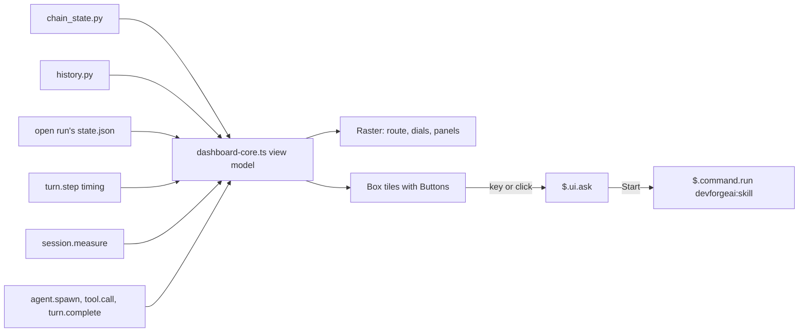

# SPEC-016 — DevForgeAI Dashboard: the planning chain, the run and the session in one pane of the progress tracker's mod

> **Status:** version 1, in review. The design and its reasoning are in `docs/specs/devforgeai-dashboard.md`
> (proposal; cited below as "the design"), with Bryan's decisions quoted in its §1 and §16. The working prototype is
> `src/tools/dashboard-probe/`. The plan is `tmp/plans/2026-10-06-dashboard.md` (local). This spec is stacked on
> SPEC-013 versions 21 to 24 and SPEC-012 versions 16 and 17, none of them built yet.

## 1. Overview

The dashboard is one pane of the `devforgeai` plugin's progress tracker. It shows the planning chain's seven phases
as tiles, the open run, three instruments (RPM, FUEL, PACE), an odometer, the session's agents and the guardrails in
force, and it starts a phase's skill when the user answers its question (PRD-001 FR-022). It draws in the terminal
first (Bryan, 2026-10-05: "option 1"); the desktop app's SVG version is a later version (§10).

It is part of the tracker's one hooks module (`hooks/progress.tsx`): Claude Code takes one hooks module per plugin
(`claude plugin validate` refuses a second `hooks.json` entry, checked 2026-10-06). Its pure drawing code is in
imported files, and every call on `$` stays in `progress.tsx`'s top-level functions, as SPEC-013 §2 requires.

Everything here is a view and a launcher. The dashboard adds nothing to the model's context, refuses no tool call,
and records no event in a run, except that the adapter's per-turn token counts feed the odometer ledger (BEH-10).

## 2. Constraints

- **PRD-001 FR-022** (v12, implements); **FR-021** (informed_by); **FR-003** (constrains): a tile starts a skill only
  on the user's answer to its question (BEH-15), and nothing on the dashboard decides a disposition, status,
  priority or approval.
- **ADR-006 D1:** the dashboard fails open. When a script or a reading fails, the rest still draws, and it never
  blocks the session (§7). **D3:** the mode button is SPEC-013 BEH-13's. **D6:** the dashboard's settings are display
  settings in the plugin's `userConfig`.
- **One hooks module per plugin** (verified 2026-10-06), so the dashboard's hooks are in `progress.tsx`; `$` is
  passed only to top-level functions of that file (SPEC-013 §2).
- **The mod API is early access** (Claude Code 2.1.291 when written). Every API fact this spec relies on was checked
  live on 2026-10-06 (the design §14) or is marked unverified in §13.
- **Keys first.** Every control has a key. Clicks are honoured where the terminal reports them; in Bryan's terminal
  (cmux) none reach Claude Code (the design §14).
- **Not built here:** the desktop `Svg` renderer, `progress.html`, the skill-health view and opening a document from
  a tile (the design §11 and §16).

## 3. Architecture and components

```
src/claude/DevForgeAI/
├── hooks/progress.tsx          # the adapter (SPEC-013) and the dashboard's hooks: the command, the pane's
│                               #   ui.render, keys, the readings (turn.step, session.measure), agents, the timer
├── hooks/dashboard-core.ts     # pure: the view model (DM-01), the layouts, the Raster cells, the dial geometry,
│                               #   wheel-spin's rule, the ETA's text; no $
├── hooks/dashboard-art.ts      # pure: the looks' colour tokens (DM-03) and the characters' frames (DM-05)
├── hooks/dashboard.test.tsx    # the kit tests (§9), excluded from the deploy as *.test.tsx files are
├── commands/dashboard.md       # lists /devforgeai:dashboard; the hook answers it (IF-01)
├── .claude-plugin/plugin.json  # the dashboard's settings (DM-02)
└── types/index.d.ts            # the dashboard's $.state values (DM-04)
```

The scripts the dashboard reads, `progress/chain_state.py` and `progress/history.py`, and the odometer ledger's
format are SPEC-012's (version 17). The usage events and `prune.py`'s keeping of the ledger are SPEC-013's (version
24).



## 4. Data model

**DM-01. The view model**, built by `dashboard-core.ts` from the readings, at each draw and each repaint:
- `layout`: `dock` (64×48), `compact` (120×36) or `wide` (160×48) (BEH-02);
- `look`: `Default`, `Night drive` or `Race telemetry`; `character`: `Ember`, `Clawd` or `none`;
- `tiles`: seven, in chain order (Brainstorm, PRD, Architecture, Context, Epic, Story, Spec), each with its glyph
  (✦ ≡ ⌂ ◎ ▲ ¶ §), name, document (ID and status, or the reason there is none), state (`done`, `prog`, `next`, `todo`,
  `nb`), and for `prog` the current step and the steps;
- `nav`: the current tile, and the ETA text (BEH-05);
- `rpm` (0 to 200), `fuel` (0 to 100, or none), `pace` (0 to 100, or none) with `minPerStep`, `wheelSpin` (true or
  false), `odometer` (a whole number);
- `trip`: cache hit rate, dollars per hour, time to first token, session tokens, session cost; each may be none;
- `agents`: the tree (BEH-12); `guardrails`: the mode, the five rows of BEH-13 and the last hold;
- `status`: the current skill and step, the mode, the flag count and the fuel chip's text.

Values that can't be read are none, and BEH-19 says what draws for each.

**DM-02. The settings**, `userConfig` fields in `plugin.json`, shown in `/config`. Each is the person's display
setting, not policy (ADR-006 D6), read when the module loads (a change applies after `/reload-plugins`, except
`dashboardTheme` when `t` writes it, BEH-16):

| Field | Kind | Values | Default |
| --- | --- | --- | --- |
| `dashboardTheme` | string picker | `Default`, `Night drive`, `Race telemetry` | `Default` |
| `dashboardCharacter` | string picker | `Ember`, `Clawd`, `none` | `Ember` |
| `dashboardWidth` | number, `min` 64, `max` 160 | the docked width asked for, in columns | 66 |
| `dashboardAutoOpen` | string picker | `on`, `off` | `off` |

A value outside its field's options or range counts as the default, with an `adapter.log` line of kind `setting`
(SPEC-013 DM-02): a stored value outside a `userConfig` range stops the whole module loading (verified 2026-10-02),
so the fields carry their ranges.

**DM-03. The looks' colour tokens** (`dashboard-art.ts`), the values the canvas's token board and the prototype use:

| Token | Default | Night drive | Race telemetry |
| --- | --- | --- | --- |
| background (top → bottom) | `#111316` | `#0A0F2E` → `#1C0A38` | `#050505` |
| panel | `#171A1F` | `#110E38` → `#1B1150` | `#0B0B0B` |
| border | `#2C323B` | `#3D2F86` | `#2E2E2E` |
| text / dim / faint | `#E8EAED` / `#8A93A0` / `#4C535E` | `#F1ECFF` / `#A49BDD` / `#5A519E` | `#F4F4F4` / `#9A9A9A` / `#555555` |
| accent / ink on accent | `#3E8BFF` / `#06122B` | `#FF4FD8` / `#14062B` | `#FFB000` / `#000000` |
| done / in progress / next / not built | `#9CC3FF` / `#3E8BFF` / `#E8EAED` / `#353B44` | `#2BFFC6` / `#FF4FD8` / `#26D9FF` / `#3A3470` | `#B6FF3B` / `#FFB000` / `#FFFFFF` / `#333333` |
| warning (30% fuel) / danger (20% fuel) | `#F2B84B` / `#FF5D5D` | `#FFB443` / `#FF3D71` | `#FF8A00` / `#FF2E2E` |
| ok / agent running / needle | `#5BD49B` / `#F5C542` / `#FFFFFF` | `#2BFFC6` / `#FFE45E` / `#FF4FD8` | `#B6FF3B` / `#FFE14D` / `#FFFFFF` |
| phase accents (Brainstorm … Spec) | `#9CC3FF` `#9CC3FF` `#3E8BFF` `#8A93A0` `#8A93A0` `#4C535E` `#4C535E` | `#FF4FD8` `#B24BFF` `#4F7BFF` `#26D9FF` `#2BFFC6` `#5B5296` `#5B5296` | `#B6FF3B` `#7CFFB2` `#FFB000` `#FF8A00` `#FFE14D` `#4A4A4A` `#4A4A4A` |
| tile border | rounded | heavy (the tile in progress: double) | light, with a header strip in the phase's accent |

**DM-04. The dashboard's `$.state` values**, under the plugin's name in `types/index.d.ts`: `dashLook`,
`dashCharacter`, `dashIsAnimating`, `dashNote` (the last result line), and `dashWheelSpinSince` (a time or none).
Module memory, not `$.state`, holds the readings (RPM, the agents tree), which a reload starts over.

**DM-05. The characters** (`dashboard-art.ts`). Ember (a forge spark, the default) and Clawd. Each is a set of pixel
frames for each activity: `read`, `think`, `ask`, `forge`, `inspect`, `report` (the manifest step kinds, SPEC-012),
your turn, phase done, flagged, idle, wheel-spin. Each frame is drawn two pixels a cell with `▀` and `▄`. The scene is
16×6 cells in the wide and compact layouts and 14×4 in the docked layout's header (proposed sizes, set by the build's
layout pass). A loop lasts about a second.

## 5. Interfaces and contracts

| Item | Interface | Behaviour |
| --- | --- | --- |
| IF-01 | `/devforgeai:dashboard [look \| menu N]` | `commands/dashboard.md` lists the command; a `command.run` hook on `{ command: 'devforgeai:dashboard' }` answers it with `{ text }` and doesn't call `next`, so the file is never loaded as a prompt (verified on the prototype, 2026-10-06). No argument opens the pane (BEH-01); `look` switches the look (BEH-16); `menu N` (1 to 7) opens that tile's menu (BEH-15). If the hook can't answer it (ERR-01), `/devforgeai-dashboard` is registered with `$.command.register` instead, `immediate` true |
| IF-02 | `/progress` | SPEC-013 BEH-34's command keeps printing the run as text, and also opens the pane |
| IF-03 | the scripts | `chain_state.py` and `history.py` (SPEC-012 version 17), run with `$.process.run` and a 5-second timeout: chain_state at `session.start`, after a Write or Edit under `docs/specs/`, and when the pane opens; history when the pane opens and when a run ends |
| IF-04 | the content of `commands/dashboard.md` | frontmatter `description: "Open the DevForgeAI Dashboard"`; its body asks Claude, should it ever be loaded as a prompt, to reply only that the dashboard's hook didn't answer and to do nothing else |

## 6. Behavior

```yaml items
behaviors:
  - id: BEH-01
    status: active
    rule: "Opening (Bryan, 2026-10-06: '/devforgeai:dashboard'; 'Setting, off by default'). /devforgeai:dashboard with no argument, /progress (IF-02) and, when dashboardAutoOpen is on, session.start open the pane with $.ui.open id 'devforgeai-dashboard', title 'DevForgeAI Dashboard', focus true when opened by a command, columns dashboardWidth and rows 54. A command's answer says whether the pane was placed, or the reason it wasn't (ERR-07). An unasked open is placed only where Claude Code seats one (from 144 columns, or 110 after the person has opened it before); otherwise nothing shows and nothing is logged. Only in an interactive session (SPEC-013 BEH-01) with tracking on and not stopped; otherwise the command answers 'progress tracking is off: <reason>' and opens nothing."
  - id: BEH-02
    status: active
    rule: "Layouts. At each draw the layout is: dock when e.props.placement is 'dock', at any dock width, the 64-column layout centred in a wider dock; otherwise wide when e.props.bodyColumns is at least 160, compact when it is at least 120, and dock below that. The layouts' arrangements are the design §3's, drawn as the canvas shows. When the body is narrower than 64 columns, or shorter than the layout's rows plus the controls' rows, the pane draws one line, 'Widen the pane to at least 64 columns, or use /progress', and the status bar if one more row fits."
  - id: BEH-03
    status: active
    rule: "Drawing (the design §11). Everything but the tiles and the character is one Raster per layout (key 'dash'), built by dashboard-core.ts from the view model (DM-01) in the look's tokens (DM-03). The seven tiles are keyed Boxes laid over the Raster at the tile positions, each with a border in the look's style and colour, a solid background, a plain Button (key 'tile-<n>', hotkey the tile's number, label its glyph and name, cut to fit) and lines of text for the document, the state and, for the tile in progress, a bar (BEH-04). The character is a Raster of its own (DM-05). While the pane is shown and the motion isn't paused, one $.clock.every timer of 200 ms repaints the 'dash' and character Rasters with $.ui.blit; it does nothing while the pane is closed, hidden or paused, and no timer runs in a headless session. A blit refused for a size change redraws the pane (ERR-05). Each frame stays under 1,024 distinct colour pairs (QR-03)."
  - id: BEH-04
    status: active
    rule: "The tiles. Each phase's state: done when chain_state.py reports its document approved or, for a brainstorm, converged; prog when the open run's skill is the phase's, with the run's current step and steps from its state.json; next for the first phase after the last done one whose skill is built and that has no run open; todo for later built phases; nb for Story and Spec while no skill implements them. The tile shows the latest document of its type by updated date (a document with no status counts as draft); one with none shows why ('needs ARCH-001' when the phase before has none approved). Each state carries a glyph as well as a colour: ✓ done, ● in progress, ◉ next, ○ not started, ◌ coming soon."
  - id: BEH-05
    status: active
    rule: "Navigation and the ETA (the design §6; proposed rule, Bryan's preference for no guesses). '▼ YOU ARE HERE' marks the tile in progress, or the next one with no run open. history.py (SPEC-012 v17) gives each built skill's median active time over its ended runs with every step reached, at least 2 of them; the phase in progress takes its median less the open run's active time, never below 0. The ETA chip is 'ETA ~<h> h <m> m to <last built phase>' with the sum for every phase ahead with a built skill; when any of them has no median, 'ETA —'. Phases whose skill isn't built are named after it: '· Spec —'."
  - id: BEH-06
    status: active
    rule: "RPM (the design §5). A pass-through turn.step hook on the main loop (no agentId) passes every chunk on unchanged. While the pane is open it notes the time of the first text, thinking or tool-input chunk, adds each such chunk's text length, and at the stop chunk sets the reading to that chunk's usage.output_tokens over the seconds since the first chunk (when more than 0.2 s). While a request streams the needle shows the text so far at four characters a token, over the time so far; after the stop it falls linearly to 0 over 5 seconds. The dial runs 0 to 200, with the redline from 150 (proposed). While the pane is closed the hook only passes the stream on. The same timing gives the trip computer's time to first token (BEH-11)."
  - id: BEH-07
    status: active
    rule: "FUEL. The fuel is 100 minus the last session.measure's context.percent, read through SPEC-013 BEH-35's measured share (version 23); with no measured share it is 100. The dial is amber at 30% or less and red at 20% or less, with marks at 30 and 20; its sub-line reads '▼20% precompact runs here'. The status bar's fuel chip reads 'Fuel <f>%' above 30, '▲ Fuel <f>% · precompact runs at <precompactRunFuel>%' from precompactWarnFuel down, and '● Fuel <f>% · running /devforgeai:precompact' once BEH-36 has started a run since the last compaction: the same thresholds and settings as SPEC-013 BEH-35 and BEH-36 (version 23), never a second copy of them."
  - id: BEH-08
    status: active
    rule: "PACE (Bryan, 2026-10-06: 'Pace (Recommended)'). From the open run's state.json (SPEC-012 v17): its steps reached and active time. PACE is steps reached per active hour scaled so 100 is 12 steps an hour (proposed, checked against recorded runs before approval, §13), capped at 100, with '<n> min/step' under it. It shows '—' until the run has 5 minutes of active time, and 0 with no run open."
  - id: BEH-09
    status: active
    rule: "Wheel-spin (Bryan, 2026-10-06: 'Accept 120 / 3 min'). A new detector, not SPEC-013 BEH-25: while a run is open, when RPM has been at least 120 at every repaint while the run reached no new step for 3 minutes of active time, the PACE dial turns amber and reads '▲ WHEEL-SPIN', and the character plays its wheel-spin frames. It clears when a step is reached or RPM falls below 120. It works in both modes, records nothing in the run, refuses nothing and tells the model nothing; dashWheelSpinSince (DM-04) keeps its start across a reload."
  - id: BEH-10
    status: active
    rule: "The odometer (Bryan, 2026-10-06: 'All tokens, incl. agents'). At each turn.complete, main loop's and subagents' alike, in an interactive session with tracking on, the adapter appends one line to the odometer ledger (SPEC-012 v17's format): the session ID, the turn ID, main or the agent's ID, and the turn's usage (input, output, cache read, cache write tokens). Subagents' lines are counts only: their events stay out of runs (SPEC-013 DM-01). The odometer shows history.py's total of the ledger, with each session and turn counted once, plus the session's lines not yet totalled, as rolling digit drums with the last digit in the accent colour. A failed append is ERR-06."
  - id: BEH-11
    status: active
    rule: "The trip computer: one line of text under the dials: the prompt-cache hit rate (the session's cache-read input tokens over all its input tokens, from turn.complete's usage), dollars per hour ($.session.usage().cost over the session's time; left out where the host keeps no cost), the last time to first token (BEH-06), and the session's tokens and cost. A value that can't be read is left out of the line."
  - id: BEH-12
    status: active
    rule: "The agents window (the design §7). The adapter keeps, in module memory and only while the session runs, a tree of the session's subagents: from agent.spawn (ID, description, parent), tool.call with an agentId (its last calls, at most 3 kept per agent), turn.complete with an agentId (its end: done, or failed when the turn ended in an error), and $.agent.list() when the pane opens (agents started before the module loaded). Each agent shows a glyph and a colour (◐ running, ✓ done, ✗ failed) and its elapsed time; a finished agent stays 30 seconds. None of this is written to a run (SPEC-013 DM-01 stays)."
  - id: BEH-13
    status: active
    rule: "The guardrails panel and the mode button. The panel lists the write gate (SPEC-013 BEH-08), the question gate (BEH-21), the exit confirmation (BEH-28), the other-mods filter (BEH-33) and precompact at fuel (BEH-35, BEH-36), each with what it does in the session's mode (the design §8), the mode as ENFORCE or OBSERVE, and the last adapter.log line of kind refused as the last hold. The 'Switch to observe' / 'Switch to enforce' Button (key m) runs SPEC-013 BEH-13's switch, no other code; the chips redraw from the mode it sets. Guards that don't exist aren't drawn."
  - id: BEH-14
    status: active
    rule: "Keys (the design §9): 1 to 7 open the tiles' menus (BEH-15), t switches the look (BEH-16), m the mode (BEH-13), a pauses or resumes the animation and the repaints, q closes the pane. Each is a Button's hotkey, so it works while the pane holds the focus; a click on a Button does the same where the terminal reports clicks."
  - id: BEH-15
    status: active
    rule: "The tile menu (Bryan, 2026-10-05: 'Run what I pick'; 2026-10-06: 'Clickable tiles'). A tile's Button, or /devforgeai:dashboard menu N, opens $.ui.ask with the question '<Phase>: what would you like to do?', header 'Dashboard', and the options 'Start <Phase>' and 'Cancel'. When a run of another skill is open and its current step isn't null, the question adds '<skill> is at step <k> of <m> and unfinished; starting <Phase> ends it.' and the first option reads 'Start <Phase> anyway': a confirmation, not a gate (ADR-006 D1). On the Start option, the adapter calls $.command.run with the command 'devforgeai:<skill>' and no args, which runs as if the person typed it (verified 2026-10-06), and SPEC-013 BEH-31's offer to continue then applies as to a typed skill (SPEC-013 version 24). On Cancel, a dismissal or any other answer, nothing runs. A tile whose skill isn't built opens no question; a toast says '<Phase>: the skill isn't built yet'. The menu asks while Claude works too (verified); a start then runs once the session is idle."
  - id: BEH-16
    status: active
    rule: "The look (Bryan, 2026-10-06: 'Write /config'). The pane starts in dashboardTheme's look. t, or /devforgeai:dashboard look, takes the next look in the order Default, Night drive, Race telemetry, writes it with $.config.set to the key '<plugin>.dashboardTheme' as $.config.list() names it (verified 2026-10-06 on the prototype), and redraws. A refused write is ERR-02."
  - id: BEH-17
    status: active
    rule: "The character (Bryan, 2026-10-06: build it now, 'with configuration for either ember or clawd'). dashboardCharacter picks Ember, Clawd or none. The character plays the activity of the open run's current step's kind (from its manifest; ticks-only runs play think), your turn while the run waits on the person, phase done for 3 seconds after a run ends with every step reached, flagged while the run has a flag, wheel-spin under BEH-09, and idle with no run open. Its frames repaint with the 'dash' Raster (BEH-03), and a pauses it."
  - id: BEH-18
    status: active
    rule: "What reaches the model: nothing new. The dashboard adds no prompt section, context or message, refuses no tool call, and records no event in a run (the odometer ledger, BEH-10, is outside the runs). Starting a skill from a tile is the person's command run as typed (BEH-15)."
  - id: BEH-19
    status: active
    rule: "When a reading is missing. RPM and FUEL need no tracker and draw whenever the pane does. With no run open, the tiles come from chain_state.py alone, PACE is 0 and the guardrails panel shows the mode. When chain_state.py or history.py fails (ERR-04), the tiles show the last good result, or, with none, each tile's name and 'state unknown', and the ETA reads 'ETA —'. With tracking off or stopped (SPEC-013 DM-05, ERR-03), the route, PACE, ETA and guardrails are replaced by one line, 'progress tracking is off: <reason>'. Missing trip-computer values are left out (BEH-11)."
```

## 7. Errors and edge cases

```yaml items
errors:
  - id: ERR-01
    status: active
    condition: "The command.run hook can't answer devforgeai:dashboard: the command isn't listed (commands/dashboard.md missing or refused), or Claude Code loads the file as a prompt before the hook sees it."
    handling: "At session.start, when $.command.list() names no 'devforgeai:dashboard', register '/devforgeai-dashboard' with $.command.register (immediate true) and answer it the same way; write an adapter.log line of kind command."
    user_result: "The dashboard opens with /devforgeai-dashboard; /progress opens it either way."
  - id: ERR-02
    status: active
    condition: "$.config.set refuses the look, or no '<plugin>.dashboardTheme' row exists."
    handling: "Keep the look in $.store under the session's root, which then wins over dashboardTheme for that person; write the refusal to dashNote and adapter.log (kind setting)."
    user_result: "The look switches for the session; the note line says it isn't saved to /config."
  - id: ERR-03
    status: active
    condition: "$.command.run rejects the tile's skill (an unknown command, or refused by the host)."
    handling: "Write the host's error to dashNote and adapter.log (kind command); run nothing else."
    user_result: "A toast: '<Phase>: couldn't start /devforgeai:<skill>: <reason>'."
  - id: ERR-04
    status: active
    condition: "chain_state.py or history.py exits non-zero, times out after 5 seconds or prints output that doesn't parse."
    handling: "Keep the last good result in module memory; write one adapter.log line of kind dashboard per failure kind per session; draw as BEH-19 says."
    user_result: "Tiles keep their last state, or show 'state unknown'; the ETA reads 'ETA —'."
  - id: ERR-05
    status: active
    condition: "A blit is refused because the mounted Raster's size isn't the layout's (the pane was resized or moved)."
    handling: "Call $.ui.invalidate('ui.render') so the pane redraws in its new layout; skip that frame."
    user_result: "None: the next frame draws in the new layout."
  - id: ERR-06
    status: active
    condition: "Appending to the odometer ledger fails."
    handling: "Keep the turn's counts in module memory and add them on the next successful append; write one adapter.log line of kind dashboard per session."
    user_result: "The odometer keeps counting; the session's counts are written later or, if the session ends first, lost."
  - id: ERR-07
    status: active
    condition: "$.ui.open doesn't place the pane."
    handling: "The command's answer gives the host's reason."
    user_result: "'The dashboard wasn't opened: <reason>'."
```

## 8. Non-functional design

```yaml items
quality_responses:
  - id: QR-01
    status: active
    response: "Cheap when not looked at: no timer, blit or script runs while the pane is closed, hidden or paused, except chain_state.py after a docs/specs write and history.py at a run's end; the turn.step hook only passes chunks on while the pane is closed; a repaint builds one frame in under 50 ms"
    measured_by: "kit tests that count $.ui.blit and $.process.run calls with the pane closed (zero) and open; a timing test of dashboard-core.ts's frame build"
    upstream:
      - {id: PRD-001, item: FR-022, relation: satisfies, version: 12, hash: null}
  - id: QR-02
    status: active
    response: "Readable without colour: every state carries a glyph (tiles, agents, chips, wheel-spin); text and status tokens reach 4.5:1 contrast on their panel; a screen reader has /progress's text and the status line"
    measured_by: "a test that each state has a glyph in the view model; a contrast check of DM-03's text and status tokens against their panels"
    upstream:
      - {id: PRD-001, item: FR-022, relation: satisfies, version: 12, hash: null}
  - id: QR-03
    status: active
    response: "Each frame of each look and layout uses fewer than 1,024 distinct colour pairs, the most a Raster paints exactly"
    measured_by: "a kit test counting pairs per frame (the prototype measured Night drive's busiest frame at 788)"
    upstream:
      - {id: PRD-001, item: FR-022, relation: satisfies, version: 12, hash: null}
  - id: QR-04
    status: active
    response: "Proof is by kit tests and live checks: the dashboard is a mod, which claude plugin eval doesn't load"
    measured_by: "§9: claude plugin test and the live VER items"
    upstream:
      - {id: PRD-001, item: FR-022, relation: satisfies, version: 12, hash: null}
```

## 9. Verification

| Kind | Status |
| --- | --- |
| Structural: this spec against `spec.schema.json` | not run (draft) |
| Prototype evidence | `src/tools/dashboard-probe/` (kit 16 of 16) and the live probes of 2026-10-06 (the design §14) |

```yaml items
verifications:
  - id: VER-01
    status: active
    obligation: "Kit tests, written first and seen failing: for each look and layout, the 'dash' Raster's cells are columns × rows triplets, and a mount of the Pane on the terminal surface validates with the seven Box tiles at the positions BEH-02's layout gives, docked at 66 and 130 columns and inline at 130 and 193; a body under 64 columns draws the widen line; a blit refused for a size change redraws the pane (ERR-05)."
    level: integration
    covers: [BEH-02, BEH-03, ERR-05]
  - id: VER-02
    status: active
    obligation: "Kit tests of opening: /devforgeai:dashboard opens 'devforgeai-dashboard' with columns dashboardWidth and answers without calling next (no prompt); /progress opens it too; with dashboardAutoOpen on, session.start opens it; a headless session or tracking off opens nothing and answers 'progress tracking is off: <reason>'; with no 'devforgeai:dashboard' listed, /devforgeai-dashboard is registered (ERR-01); an unplaced open answers with the reason (ERR-07)."
    level: integration
    covers: [BEH-01, ERR-01, ERR-07]
  - id: VER-03
    status: active
    obligation: "Kit tests of the tiles and navigation from fixture outputs of chain_state.py, history.py and a state.json: each state (done, prog with its step, next, todo, nb) with its glyph and colour; the latest document by date; 'needs <ID>'; the ETA's sum, 'ETA —' when a phase ahead has no median, and '· Spec —'; a failing script (non-zero, timeout, bad output) keeps the last good tiles or 'state unknown' and logs one line (ERR-04)."
    level: integration
    covers: [BEH-04, BEH-05, ERR-04, BEH-19]
  - id: VER-04
    status: active
    obligation: "Kit tests of RPM and wheel-spin with a stubbed turn.step stream: every chunk passes on unchanged; a stop chunk with output_tokens 218 after 2.7 s from the first chunk reads 81; the needle falls to 0 over 5 s; a subagent's stream is ignored; with the pane closed no timing is taken; with RPM 120 or more and no new step for 3 active minutes, PACE reads '▲ WHEEL-SPIN', and a new step or RPM below 120 clears it; nothing is added to events.jsonl."
    level: integration
    covers: [BEH-06, BEH-09]
  - id: VER-05
    status: active
    obligation: "Kit tests of FUEL and the chips with session.measure inputs: percent 69 shows 'Fuel 31%'; 70 shows '▲ Fuel 30% · precompact runs at 20%' with precompactWarnFuel 30 and precompactRunFuel 20; after BEH-36 starts a run, '● Fuel 20% · running /devforgeai:precompact'; no measured share shows 100; changed settings move the chip with SPEC-013's row, which reads the same values."
    level: integration
    covers: [BEH-07]
  - id: VER-06
    status: active
    obligation: "Kit tests of PACE from state.json fixtures: '—' under 5 active minutes; 6 steps in 30 active minutes reads 100 capped at 100 and '5 min/step'; 0 with no run open."
    level: integration
    covers: [BEH-08]
  - id: VER-07
    status: active
    obligation: "Kit tests of the odometer and trip computer: turn.complete for the main loop and for an agent each appends one ledger line with the session ID, turn ID, main or agent ID and the four counts; a second identical line (a reload) isn't counted twice in the shown total; a failed append keeps the counts and adds them on the next append (ERR-06); the trip line leaves out dollars when usage() has no cost."
    level: integration
    covers: [BEH-10, BEH-11, ERR-06]
  - id: VER-08
    status: active
    obligation: "Kit tests of the agents window: agent.spawn adds an agent with ◐; its tool calls show the last 3; turn.complete with its agentId marks ✓ or ✗; a finished agent leaves after 30 s; $.agent.list() adopts earlier agents when the pane opens; events.jsonl gains no line."
    level: integration
    covers: [BEH-12]
  - id: VER-09
    status: active
    obligation: "Kit tests of the guardrails panel and keys: the five rows with their observe and enforce text; the last hold from an adapter.log 'refused' line; the m Button runs BEH-13's switch (a stubbed IF-02) and the chips change; keys 1 to 7, t, m, a and q each press their Button; a pauses repaints (no blit)."
    level: integration
    covers: [BEH-13, BEH-14]
  - id: VER-10
    status: active
    obligation: "Kit tests of the tile menu: key 4 asks 'Context: what would you like to do?' with 'Start Context' and 'Cancel'; Start calls $.command.run with 'devforgeai:context' (a stub records it); with another run open at step 3 of 8 the question names it and the option reads 'Start Context anyway'; Cancel or a dismissal runs nothing; keys 6 and 7 toast that the skill isn't built and ask nothing; a rejected run toasts and logs (ERR-03); /devforgeai:dashboard menu 4 asks the same."
    level: integration
    covers: [BEH-15, ERR-03]
  - id: VER-11
    status: active
    obligation: "Kit tests of looks and the character: t calls $.config.set with '<plugin>.dashboardTheme' and the next look, and the pane redraws in it; a refused set keeps the look in $.store and notes it (ERR-02); dashboardCharacter Ember, Clawd and none draw the 16×6 or 14×4 scene or none; the character's frames follow the step kind, your turn, done, flagged, wheel-spin and idle."
    level: integration
    covers: [BEH-16, BEH-17, ERR-02]
  - id: VER-12
    status: active
    obligation: "Kit tests of quality: with the pane closed, a session of turns makes no blit and no script call but chain_state after a docs/specs write and history at a run's end; a frame builds in under 50 ms; every look and layout stays under 1,024 colour pairs; every state has a glyph; DM-03's text and status tokens reach 4.5:1 on their panels; the dashboard adds no prompt section or context and refuses no call."
    level: integration
    covers: [QR-01, QR-02, QR-03, BEH-18]
  - id: VER-13
    status: active
    obligation: "Live, in Bryan's worker1 tab with --plugin-dir on the build: (a) fullscreen (CLAUDE_CODE_NO_FLICKER=1): /devforgeai:dashboard docks on the right at 66 columns in the docked layout, in each look (t), with each character; (b) main screen at least 160 columns: wide inline, and 120 to 159: compact; (c) a brainstorm run: its tile turns in progress with its step, PACE shows after 5 minutes, RPM moves during replies, fuel falls as context fills; (d) a tile key starts a skill after its question, and with a run open the question names it; (e) the odometer counts up across a turn with a subagent; (f) tracking off shows the off line. Recorded in §9."
    level: manual
    covers: [BEH-01, BEH-02, BEH-04, BEH-06, BEH-07, BEH-08, BEH-10, BEH-15, BEH-16, BEH-17, QR-04]
```

## 10. Rollout, migration and rollback

- **Ships with** SPEC-013 versions 21 to 24 and SPEC-012 versions 16 and 17, in the plugin's next free minor version
  at merge. Nothing to migrate: the settings are new, the ledger starts empty, and the scripts are new.
- **Later versions:** the desktop app's `Svg` renderer from the same view model (Bryan: "the design should include an
  svg version for the desktop app"; terminal first), `progress.html` for VS Code's browser (Bryan: "Both"), the
  skill-health view (Bryan: "Keep skill health (later)"), opening a document from a tile.
- **Rollback:** remove the dashboard's hooks, the two files, the command file and the settings; the tracker works as
  before.
- **Records:** CLAUDE.md names the dashboard with the tracker; `.claude/rules/progress.md` gains the dashboard's files.

## 11. Implementation plan

After approval, through the built-in `plugin-authoring` skill and `/plugin-dev:create-plugin`, on a branch in a
worktree (ADR-001), after SPEC-013 versions 21 to 24 and SPEC-012 versions 16 and 17 are built or with them:
1. Port the prototype's engine into `dashboard-core.ts` and `dashboard-art.ts` against DM-01, DM-03 and DM-05; write
   VER-01 and VER-12's tests first.
2. The tests of VER-02 to VER-11 first, seen failing; then the hooks in `progress.tsx`, the command file and the
   settings.
3. The characters' frames (Ember, Clawd) for every activity.
4. `claude plugin validate`, the kit, then VER-13 live; record in §9.

## 12. Alternatives considered

| Option | Why not chosen |
| --- | --- |
| A second hooks module for the dashboard | Claude Code takes one hooks module per plugin (validate refuses a second, 2026-10-06) |
| Mission-control as the view | Bryan: "the dashboard is more appropriate" |
| Buttons that fill the prompt | Bryan: "Run what I pick"; the person's answer to the tile's question is the go-ahead |
| SVG first | Bryan chose the terminal first after mods were seen not to load in the desktop app's WSL chat |
| `Image` tier | It draws nothing in cmux (the design §14) |
| A speed dial of cost or cache efficiency | Bryan: "Pace (Recommended)"; both go in the trip computer |
| The look kept only in `$.store` | Bryan: "Write /config" ($.store stays the fallback) |
| Drawn tiles only (keys) | Bryan: "Clickable tiles" |

## 13. Open questions

Decided by Bryan, 2026-10-05 and 2026-10-06: the decisions the design quotes in its §1 and §16.

Drafter's choices, for Bryan's accept or challenge:
- The pane ID `devforgeai-dashboard`; rows 54; `dashboardWidth` 66 with range 64 to 160.
- The 200 ms repaint (5 a second); the scripts' 5-second timeout and when each runs (IF-03).
- RPM's 0 to 200 range and 150 redline; PACE's scale (100 = 12 steps an hour), which should be checked against the
  recorded runs in `devforgeai/progress/runs/` before approval; the 5-minute floor.
- The ETA's rule (medians of at least 2 ended, complete runs).
- The character's scene sizes (16×6, 14×4) and its activities' mapping; "think" for ticks-only runs.
- The agents window keeping 3 calls per agent and finished agents for 30 seconds.
- The tile shows the latest document by `updated` date.

Unverified, checked by the build or live: a mouse click on a Box tile's Button in a terminal that reports clicks;
`/devforgeai:dashboard` inside the real plugin (proven on the prototype's own plugin name); a `$.command.run` queued
mid-turn running when the session goes idle; whether the pass-through `turn.step` hook slows streaming.

Shipping Clawd: a plugin drawing Anthropic's mascot could read as endorsed by Anthropic (the design §11a). Bryan chose
to build it as a choice; whether it ships in a published plugin is his call at release.

## Change Log

| Version | Date | Author | Change | Items affected |
| --- | --- | --- | --- | --- |
| 1 | 2026-10-06 | claude-code (session 7637882f-b2ec-465e-988a-9602340d1023) | First draft, from the design (`docs/specs/devforgeai-dashboard.md`) and Bryan's decisions of 2026-10-05 and 2026-10-06, the prototype `src/tools/dashboard-probe/` and its live probes | all |
