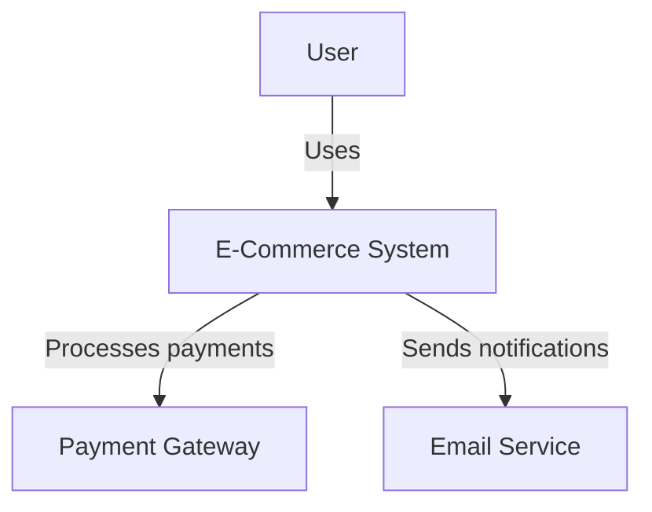
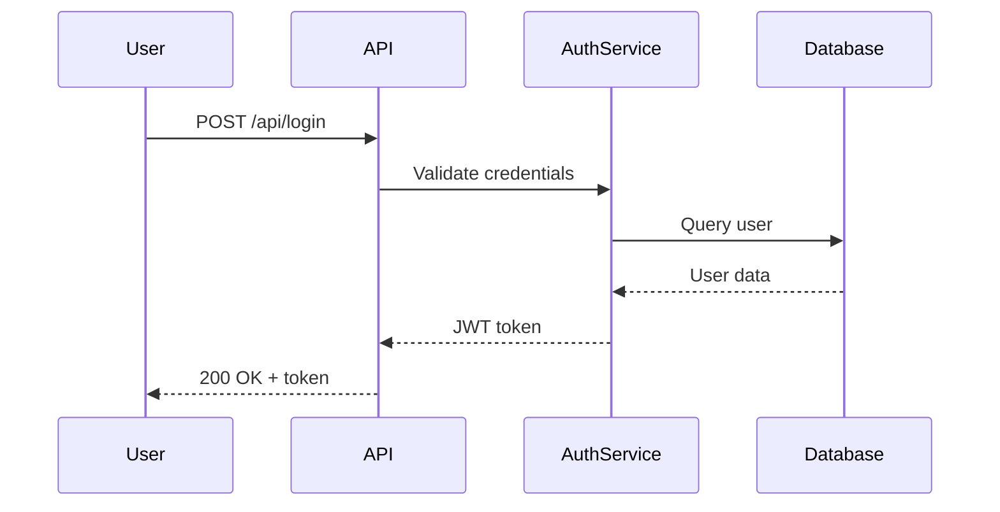

# Documentation Writer - Architecture Documentation Examples

## C4 Context Diagram (Mermaid)

```mermaid
graph TB
    User[User]
    System[E-Commerce System]
    PaymentGateway[Payment Gateway]
    EmailService[Email Service]

    User -->|Uses| System
    System -->|Processes payments| PaymentGateway
    System -->|Sends notifications| EmailService
```

## Sequence Diagram

```mermaid
sequenceDiagram
    participant User
    participant API
    participant AuthService
    participant Database

    User->>API: POST /api/login
    API->>AuthService: Validate credentials
    AuthService->>Database: Query user
    Database-->>AuthService: User data
    AuthService-->>API: JWT token
    API-->>User: 200 OK + token
```
