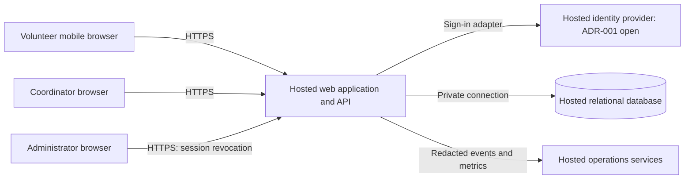

# ARCH-001 — Volunteer shift sign-up

## Scope and decision summary

Source: [PRD-001 v1](../prd/PRD-001.md), approved 2026-09-20. This design covers all three functional and all three non-functional requirements. The approved PRD remains unchanged; its generated epic map is not edited. No epics are created by this architecture task.

Use a mobile-first web application, one hosted application service, a hosted relational database, and an external identity service. Keep booking, roster, authorization, and application sessions in one application with internal module boundaries. This fits approximately 120 volunteers, one coordinator, and three daily shifts without introducing distributed transactions or a separate event platform.

[ADR-002](../adr/ADR-002.md) records the selected application design. [ADR-001](../adr/ADR-001.md) leaves the identity provider proposed and unresolved. This document is an authored architecture baseline, not evidence of stakeholder approval or working software.

## System boundaries

| Component | Responsibility | Requirement references |
|---|---|---|
| Mobile web UI | Sign-in entry, open shifts, booking outcome, coordinator daily roster | FR-001, FR-002, FR-003 |
| Identity adapter | Validate external sign-in and map an immutable provider subject to a local volunteer | FR-001, NFR-001 |
| Session and authorization module | Resolve local sessions; enforce roles on every request; revoke sessions | FR-001, FR-002, FR-003, NFR-001, NFR-002 |
| Booking module | Read open shifts; enforce capacity and booking uniqueness transactionally | FR-002 |
| Roster module | Query committed bookings for a local calendar day; return coordinator-only contact projection | FR-003, NFR-002 |
| Hosted database | Authoritative identities, roles, sessions, shifts, bookings, restricted contacts | FR-001, FR-002, FR-003, NFR-001, NFR-002, NFR-003 |
| Hosted runtime and operations | Run the whole product, secrets, redacted logs, backups and restore | NFR-001, NFR-002, NFR-003 |

The browser is untrusted. All API routes authorize on the server. Only the application connects to the database; no database credentials or provider secrets reach browsers. Identity claims prove identity, while local role assignments control access. Provider administrator status grants no application coordinator access.

## Data and access model

| Entity | Minimum fields and invariants |
|---|---|
| Volunteer | Local ID, display name, provider issuer and subject (unique pair), session generation |
| Role assignment | Local principal ID and role: volunteer, coordinator, administrator; assigned through restricted provisioning |
| Session | Hash of opaque random identifier, principal ID, issued generation, creation and expiry times; raw identifier only in secure cookie |
| Volunteer contact | Volunteer ID and phone number; separate restricted query/projection from general profile |
| Shift | ID, start/end instants, capacity, explicit open/closed state; positive capacity |
| Booking | ID, shift ID, volunteer ID, created time; unique pair of shift ID and volunteer ID |
| Security audit event | Actor ID, action, target ID, timestamp and result; no phone, credential, or session token |

Store timestamps as UTC instants and configure the food bank's IANA timezone for day boundaries and display; the actual timezone is an outstanding deployment input. A roster date selects shifts by local start date, including correct daylight-saving boundaries.

Phone visibility is a server-side authorization rule: only a principal with the coordinator role receives a phone field. Volunteers cannot read even their own phone through application responses under the PRD's literal wording. An administrator can revoke sessions but cannot read phone numbers unless separately assigned coordinator. Deny anonymous access. Exclude phones from tokens, general profile responses, booking responses, logs, errors, analytics, and browser storage; set sensitive responses to `Cache-Control: no-store`. Protect stored data and backups with encryption and restricted service access. Do not introduce a human database console or export that bypasses the coordinator rule.

## Request flows and contracts

### Sign-in and revocation

1. The server starts sign-in through the identity adapter. Validate the returned proof and bind the callback to the initiating browser. Exact protocol and provisioning/recovery flows depend on ADR-001.
2. Map the validated issuer/subject to a provisioned local principal. Never link accounts by an unverified email or phone supplied by the browser.
3. Issue an opaque local session cookie with Secure, HttpOnly and appropriate SameSite settings. Protect state-changing requests against CSRF. External identity tokens are not accepted directly at booking or roster endpoints.
4. On every protected request, read the authoritative session and the principal's session generation and current roles. Reject expired, missing or stale-generation sessions. Use no positive authorization cache or read replica for this check. On store failure, fail closed.
5. `POST /admin/volunteers/{id}/revoke-sessions` requires the administrator role and transactionally increments that volunteer's generation. Acknowledge success only after commit and audit the action. Repeated calls are safe; no phone is returned.

The revocation commit is time zero. Sessions issued under an earlier generation must fail on subsequent protected requests, comfortably inside the PRD's five-minute bound. Recheck the generation inside booking write transactions, with concurrency control against revocation so an old session cannot commit a new booking after revocation. Bound protected request duration below five minutes and recheck authorization before releasing sensitive roster data. Do not automatically recreate local sessions from a stale application cookie. New explicit sign-in is distinct from revoking existing sessions; account suspension is outside this PRD.

This local design removes reliance on provider token expiry for API revocation. ADR-001 must still establish that callback, refresh and recovery behavior cannot bypass it before the identity/session epic is ready.

### Booking

`GET /shifts?date=YYYY-MM-DD` returns shift times, open state and remaining capacity without volunteer contacts. `POST /shifts/{id}/bookings` takes the volunteer ID from the session, never from client-supplied ownership fields.

Within one database transaction, validate the session generation, lock the shift, verify it is open and has not started, and compare current booking count with capacity. Insert the booking and commit before reporting success. All capacity-affecting operations must take the same shift lock. The unique booking constraint makes repeat submission return the existing booking rather than consume another place. A full or closed shift produces an explicit conflict; an unauthenticated request is rejected. Database failure must not produce a success page. No queue is required.

“Open” is interpreted here as explicitly enabled, in the future, and below capacity. This and duplicate-booking behavior are architecture assumptions for epic refinement, not additional approved product requirements. Shift times and capacities must be provided before implementation acceptance. Cancellation, waiting lists, reminders and overlap restrictions are not added.

### Daily roster

`GET /coordinator/roster?date=YYYY-MM-DD` requires coordinator authorization and returns each day's shifts with committed bookings, volunteer names and the restricted phone projection if needed by the roster UI. Return empty shifts explicitly. Other roles receive denial, including an administrator without coordinator role.

Read the primary database so a successful booking appears on the next roster request. Use a proposed 30-second refresh while the roster is visible, plus manual refresh and a last-updated indicator. Clear sensitive content on session/role denial and show an error or stale-state indicator on refresh failure. Polling interval is a design choice, not a PRD freshness SLA. No offline roster cache or push connection is needed for the pilot.

## Hosting and operations

All runtime dependencies are hosted: web delivery, application, identity, database, secrets, logs and backups. No on-site server is required. Keep application and database in a compatible deployment region with private database access; select provider/region during implementation planning without changing these boundaries.

Use separate non-production and pilot environments, repeatable deployments and schema migrations. Provision Tuesday/Thursday shifts first; expand the configured schedule for the later rollout. Use an operator-controlled import/provisioning process for initial volunteers, role assignments, contact records and shifts; a scheduling or profile-management UI is not in the PRD. Contact imports must avoid phone values in logs and require coordinator authorization.

Monitor authentication failures, rejected revoked sessions, booking conflicts, API failures and database availability without collecting phone data. Take managed database backups and verify restoration before pilot launch. Restore procedures must invalidate all restored sessions before serving traffic so a backup cannot resurrect revoked sessions. Availability, recovery time, backup retention and performance targets are unspecified; establish operational targets in epic planning rather than claiming an invented SLA.

SM-01 remains measured by the coordinator's shift log. Bookings do not prove attendance, so the roster alone cannot establish the 95% fully staffed target.

## Decisions, assumptions and unresolved inputs

| ID | Item | Effect and resolution |
|---|---|---|
| ADR-001 | Identity provider and supported sign-in/provisioning method unresolved | Blocks FR-001 and integrated NFR-001 readiness. Record provider choice and adapter evidence as specified in the ADR. Proposed owner: technical lead with Priya Nair for volunteer access constraints. |
| ADR-002 | Hosted modular application, transactional booking, local sessions and restricted contacts | Selected architecture for epic decomposition; see alternatives and consequences in ADR. |
| A-01 | “Open” shift semantics, duplicate submission semantics, initial schedule and capacity source | Proposed behavior above supports epic definition. Priya Nair must settle business values and any conflicting rules before booking stories are implementation-ready. |
| A-02 | Coordinator and administrator are separate permissions; initial principals and contacts are provisioned | Required to enforce the two distinct PRD roles. Confirm assignments and authorized data source before pilot. |
| A-03 | Local timezone and desired roster freshness are not specified | Configure timezone and settle refresh acceptance in the roster epic; no assumption that Riverside identifies a particular locale. |
| ASM-01 | Smartphone/browser availability remains open in PRD | Product validation is outstanding; September meeting results are not present. Track pilot accessibility/access risk without inventing a result. |
| A-04 | Hosting account, region, budget, support ownership and recovery targets absent | Deployment planning inputs. These do not prevent defining hosting work; they prevent claiming a deployable system. |

BRN-001 is referenced by the PRD but absent from the workspace. This design relies on the approved PRD; it does not claim to validate the upstream brainstorm. No repository architecture template, policy, application code, test runner or validation command was present.

## Requirement readiness for epics

**READY** means the architecture supplies enough boundaries and verification criteria to define an epic. **BLOCKED** means an unresolved architectural decision prevents that requirement's epic from being baselined. Neither status means implemented, tested, approved for release, or independent of other epics. Shared constraints must travel with every affected functional epic.

| Requirement | Epic readiness | Architecture and decision coverage | Dependency / next action |
|---|---|---|---|
| FR-001 — volunteer sign-in | BLOCKED | Identity adapter and local sessions; ADR-001, ADR-002 | Resolve ADR-001, including provisioning/recovery and revocation integration evidence. |
| FR-002 — book open shift | READY | Booking transaction and uniqueness; ADR-002 | Define against local session contract; settle A-01 in refinement. Delivery depends on FR-001 and NFR-001, plus NFR-002 and NFR-003. |
| FR-003 — daily coordinator roster | READY | Coordinator authorization, date query and refresh; ADR-002 | Settle A-02/A-03 in refinement. Delivery depends on FR-001, booked data from FR-002, and all three NFRs. Preserve its PRD “should” priority. |
| NFR-001 — revoke sessions within five minutes | BLOCKED | Server-authoritative session generation; ADR-001, ADR-002 | Local enforcement is designed, but identity lifecycle/bypass evidence is outstanding. Include in every protected functional epic. |
| NFR-002 — coordinator-only phone visibility | READY | Restricted contact storage/projections and server-side roles; ADR-002 | Applies to sign-in claims/profile, booking, roster, administration and operations, even if FR-003 is deferred. |
| NFR-003 — whole product hosted | READY | Deployment boundaries and managed runtime/storage; ADR-002 | Applies to FR-001, FR-002, FR-003 and every shared dependency; carry into all epics. |

Suggested decomposition, not generated epic records: (1) hosted foundation and contact authorization, covering NFR-003/NFR-002; (2) identity and revocation, covering FR-001/NFR-001, blocked by ADR-001; (3) booking, covering FR-002 and all shared NFRs; (4) coordinator roster, covering FR-003 and all shared NFRs. Booking and roster epic definition can proceed using the session contract while identity is resolved. End-to-end implementation acceptance and the pilot remain blocked on identity and revocation.

## Acceptance and verification evidence

The PRD supplies requirement statements rather than executable acceptance tests. These are derived verification obligations that preserve its wording. Architecture review PASS below means coverage is present in these documents; runtime evidence is explicitly NOT_RUN.

| Requirement | Architecture review | Required implementation evidence | Runtime status |
|---|---|---|---|
| FR-001 | BLOCKED — ADR-001 remains proposed | Valid volunteer sign-in issues a local session; invalid proof/callback and unprovisioned identity are rejected; chosen provisioning and recovery paths verified | NOT_RUN |
| FR-002 | PASS — booking flow and invariants defined | Authenticated booking persists; anonymous request fails; two volunteers competing for one place yield one booking; duplicate/retried request consumes one place; closed/full/past shift fails | NOT_RUN |
| FR-003 | PASS — daily roster and role boundary defined | Coordinator sees committed bookings for the selected local day, including empty shifts and date-boundary cases; a new booking appears on refresh; non-coordinators denied | NOT_RUN |
| NFR-001 | BLOCKED — provider lifecycle evidence missing | Across multiple devices/app instances, revoke at measured commit time; all earlier sessions denied no later than 300 seconds, including replay/refresh; unauthorized revocation denied; store outage fails closed; booking/revocation race and restored-session cases verified | NOT_RUN |
| NFR-002 | PASS — field-level access and operations covered | Test anonymous, volunteer, administrator-only and coordinator roles on every route; only coordinator gets phones; inspect HTML, JSON, logs, errors, tokens and caches for leakage | NOT_RUN |
| NFR-003 | PASS — all runtime boundaries hosted | Inspect deployment inventory and demonstrate pilot flow and restore without any on-site server dependency | NOT_RUN |

Document verification is recorded in [ARCH-001-verification.md](ARCH-001-verification.md). There is no application behavior change, so a failing runtime test cannot be established in this documentation-only workspace. Future implementation must establish meaningful failing tests before behavior changes, then run the eventual repository's required gates. No runtime PASS is inferred from this design.

## Change log

| Version | Date | Author | Change |
|---|---|---|---|
| 1 | 2026-09-28 | Codex | Initial architecture, complete requirement mapping, explicit identity blocker and epic readiness assessment. |
