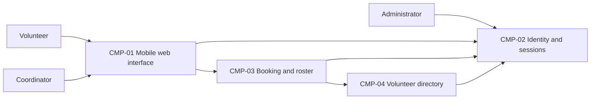

# ARCH-001 — Volunteer shift sign-up for the Riverside Food Bank architecture

## 1. Context and scope

This proposal is defined against PRD-001 version 1, status approved, owned by Priya Nair.
It supports about 120 volunteers booking warehouse shifts from mobile browsers and a coordinator
viewing the daily roster. Sign-in, booking, roster access, session revocation and protection of
volunteer phone numbers are inside the system boundary. Payroll, donations and an installed mobile
app are outside it.

No inspection scope was named and no code or configuration was inspected. No existing ARCH,
ADR or policy documents were found in their contract directories; the local preference file was
absent. Existing implementation, infrastructure and reusable services remain unknown.

The request explicitly selected PRD-001 and instructed proceeding without questions. It did not
confirm an outcome or any architectural decision. Creating this new ARCH is the proposed outcome
because no existing ARCH covers the system; `outcome` remains null. All component boundaries and
ownership assignments below are proposals pending their cited decisions. No ADR is written.

## 2. Quality drivers

PRD-001#NFR-001 requires administrator revocation of volunteer sessions to take effect within five
minutes. Sign-in and every use of a volunteer session for booking must respect the same revocation
contract. Selecting an identity provider does not settle this enforcement mechanism; see
ARCH-001#DEC-01 and ARCH-001#DEC-02.

PRD-001#NFR-002 permits only the coordinator to see volunteer phone numbers. Ownership of contact
data and enforcement of access restrictions are separate choices, recorded in ARCH-001#DEC-06 and
ARCH-001#DEC-07. The eventual design must prevent unauthorized retrieval, including through booking
responses, roster responses and identity claims; hiding a field in the browser is insufficient.

PRD-001#NFR-003 requires hosted services for the whole product because there is no on-site server.
It constrains every functional capability as well as session and privacy controls. Provider and
deployment topology remain open under ARCH-001#DEC-03.

The operating context is `internal`, as stated in the PRD. Its required quality floor is constraint,
security and privacy, covered by PRD-001#NFR-003, PRD-001#NFR-001 and PRD-001#NFR-002 respectively.
There are no uncovered required categories and no policy additions. The Pilot release name does
not change the declared operating context. Mobile browser access and the coordinator's live roster
also shape the shared interfaces; the PRD sets no numerical roster freshness target.

## 3. Components

The diagram shows proposed logical responsibilities, not accepted service or deployment boundaries.
ARCH-001#DEC-04 governs these boundaries, ARCH-001#DEC-05 and ARCH-001#DEC-06 govern ownership, and
ARCH-001#DEC-08 governs how booking changes reach the roster. Edges express intended dependencies;
protocols and synchronous versus asynchronous interactions are not decided.



```yaml items
components:
  - id: CMP-01
    status: active
    name: "Mobile web interface"
    responsibility: "Proposed browser interface for sign-in, booking and coordinator roster views; does not own durable records or enforce access solely through presentation."
    owns_data: []
    interacts_with:
      - "CMP-02"
      - "CMP-03"
    deployment: "Open: see DEC-03"
    upstream:
      - {id: PRD-001, item: NFR-002, relation: informed_by, version: 1, hash: null}
      - {id: PRD-001, item: NFR-003, relation: informed_by, version: 1, hash: null}
  - id: CMP-02
    status: active
    name: "Identity and sessions"
    responsibility: "Proposed authentication and administrator session-revocation capability; does not own shifts, bookings or coordinator contact views. Provider and revocation mechanism remain open."
    owns_data:
      - "Proposed ownership of authentication identities and session revocation state, pending DEC-01, DEC-02 and DEC-04"
    interacts_with:
      - "CMP-01"
      - "CMP-03"
      - "CMP-04"
    deployment: "Open: see DEC-03"
    upstream:
      - {id: PRD-001, item: NFR-001, relation: informed_by, version: 1, hash: null}
      - {id: PRD-001, item: NFR-002, relation: informed_by, version: 1, hash: null}
      - {id: PRD-001, item: NFR-003, relation: informed_by, version: 1, hash: null}
  - id: CMP-03
    status: active
    name: "Booking and roster"
    responsibility: "Proposed authority for booking open shifts and presenting daily rosters; validates session authority and requests permitted volunteer details, but does not own credentials or phone numbers."
    owns_data:
      - "Proposed authoritative shift and booking records, pending DEC-05"
      - "Proposed derived daily roster view, pending DEC-08"
    interacts_with:
      - "CMP-01"
      - "CMP-02"
      - "CMP-04"
    deployment: "Open: see DEC-03"
    upstream:
      - {id: PRD-001, item: NFR-001, relation: informed_by, version: 1, hash: null}
      - {id: PRD-001, item: NFR-002, relation: informed_by, version: 1, hash: null}
      - {id: PRD-001, item: NFR-003, relation: informed_by, version: 1, hash: null}
  - id: CMP-04
    status: active
    name: "Volunteer directory"
    responsibility: "Proposed owner of volunteer profiles and restricted contact access; does not own authentication credentials, shift availability or bookings. Its boundary and authorization responsibility remain open."
    owns_data:
      - "Proposed volunteer profiles, phone numbers and identity associations, pending DEC-06"
    interacts_with:
      - "CMP-02"
      - "CMP-03"
    deployment: "Open: see DEC-03"
    upstream:
      - {id: PRD-001, item: NFR-002, relation: informed_by, version: 1, hash: null}
      - {id: PRD-001, item: NFR-003, relation: informed_by, version: 1, hash: null}
```

## 4. Architectural questions

No approved policy mandates a platform and the request supplies no decision confirmations.
Each question therefore remains blocking and open. Options below describe trade-offs for a later
decision; none has been selected.

```yaml items
decisions:
  - id: DEC-01
    status: active
    question: "Which identity provider handles volunteer sign-in?"
    blocking: true
    state: open
    resolved_by: []
    notes: "Captures the PRD NEEDS ADR marker. A hosted identity provider reduces credential operations; application-owned authentication offers direct control but increases security responsibility. The choice also shapes session validation for booking and the available revocation capabilities; DEC-02 remains separate."
    upstream:
      - {id: PRD-001, item: FR-001, relation: informed_by, version: 1, hash: null}
      - {id: PRD-001, item: FR-002, relation: informed_by, version: 1, hash: null}
      - {id: PRD-001, item: NFR-001, relation: informed_by, version: 1, hash: null}
  - id: DEC-02
    status: active
    question: "How will administrator revocation stop every affected volunteer session from working within five minutes?"
    blocking: true
    state: open
    resolved_by: []
    notes: "A shared server-side session authority can check revocation on requests but creates an availability dependency. Short-lived credentials with revocable renewal reduce per-request checks but require a bounded expiry and cache policy. Sign-in and authenticated booking must share the selected enforcement contract, including renewal and failure behavior."
    upstream:
      - {id: PRD-001, item: FR-001, relation: informed_by, version: 1, hash: null}
      - {id: PRD-001, item: FR-002, relation: informed_by, version: 1, hash: null}
      - {id: PRD-001, item: NFR-001, relation: informed_by, version: 1, hash: null}
  - id: DEC-03
    status: active
    question: "Which hosted deployment topology will run the whole product?"
    blocking: true
    state: open
    resolved_by: []
    notes: "A managed application host with managed persistence can centralize operations; a composition of managed functions and services permits independent scaling but adds integration and access-control boundaries. Provider, deployment units and environments remain unselected. Hosting governs all functional requirements and the services enforcing revocation and privacy."
    upstream:
      - {id: PRD-001, item: FR-001, relation: informed_by, version: 1, hash: null}
      - {id: PRD-001, item: FR-002, relation: informed_by, version: 1, hash: null}
      - {id: PRD-001, item: FR-003, relation: informed_by, version: 1, hash: null}
      - {id: PRD-001, item: NFR-001, relation: informed_by, version: 1, hash: null}
      - {id: PRD-001, item: NFR-002, relation: informed_by, version: 1, hash: null}
      - {id: PRD-001, item: NFR-003, relation: informed_by, version: 1, hash: null}
  - id: DEC-04
    status: active
    question: "What component boundaries separate presentation, identity and sessions, booking and roster, and volunteer directory responsibilities?"
    blocking: true
    state: open
    resolved_by: []
    notes: "The four CMPs are proposed logical responsibilities. Application modules sharing a backend reduce interface overhead; independent services provide isolation but require explicit trust boundaries and distributed calls. The choice determines where session and contact-access checks belong across epics, without selecting deployment infrastructure."
    upstream:
      - {id: PRD-001, item: FR-001, relation: informed_by, version: 1, hash: null}
      - {id: PRD-001, item: FR-002, relation: informed_by, version: 1, hash: null}
      - {id: PRD-001, item: FR-003, relation: informed_by, version: 1, hash: null}
      - {id: PRD-001, item: NFR-001, relation: informed_by, version: 1, hash: null}
      - {id: PRD-001, item: NFR-002, relation: informed_by, version: 1, hash: null}
  - id: DEC-05
    status: active
    question: "Which component owns authoritative shift availability and booking records?"
    blocking: true
    state: open
    resolved_by: []
    notes: "A single booking owner provides one authority for accepting bookings and building the roster. Separate scheduling and booking owners can isolate responsibilities but require an agreed consistency contract for open shifts. CMP-03 ownership is provisional; API fields and storage schemas belong to later specs."
    upstream:
      - {id: PRD-001, item: FR-002, relation: informed_by, version: 1, hash: null}
      - {id: PRD-001, item: FR-003, relation: informed_by, version: 1, hash: null}
  - id: DEC-06
    status: active
    question: "Which component owns volunteer profiles and phone numbers?"
    blocking: true
    state: open
    resolved_by: []
    notes: "An application directory can isolate contact data from credentials; identity-provider profiles reduce profile stores but couple privacy controls to provider claims and access features. CMP-04 ownership is provisional. The coordinator roster must identify booked volunteers using the selected profile authority."
    upstream:
      - {id: PRD-001, item: FR-003, relation: informed_by, version: 1, hash: null}
      - {id: PRD-001, item: NFR-002, relation: informed_by, version: 1, hash: null}
  - id: DEC-07
    status: active
    question: "Where is coordinator-only authorization for volunteer phone-number access enforced?"
    blocking: true
    state: open
    resolved_by: []
    notes: "A central application authorization boundary gives one policy enforcement point; enforcement by the data owner across callers localizes protection but requires a shared coordinator-role contract. Identity claims, booking responses and roster responses must all respect phone-number restrictions. This decision is distinct from contact-data ownership; neither administrator status nor volunteer sign-in implies permission to view phone numbers."
    upstream:
      - {id: PRD-001, item: FR-001, relation: informed_by, version: 1, hash: null}
      - {id: PRD-001, item: FR-002, relation: informed_by, version: 1, hash: null}
      - {id: PRD-001, item: FR-003, relation: informed_by, version: 1, hash: null}
      - {id: PRD-001, item: NFR-002, relation: informed_by, version: 1, hash: null}
  - id: DEC-08
    status: active
    question: "How does the coordinator roster consume committed booking changes?"
    blocking: true
    state: open
    resolved_by: []
    notes: "Reading authoritative booking state directly simplifies freshness but couples roster availability to the booking owner. An event-fed roster projection separates reads but adds delivery, reconciliation and freshness obligations. A numerical live-roster freshness target is a PRD-owner clarification, not an architectural decision made here."
    upstream:
      - {id: PRD-001, item: FR-002, relation: informed_by, version: 1, hash: null}
      - {id: PRD-001, item: FR-003, relation: informed_by, version: 1, hash: null}
```

## 5. Evidence inspected

```yaml items
evidence:
  - id: EVD-01
    status: active
    source: "PRD-001"
    kind: prd
    finding: "Version 1, status approved: three functional requirements cover volunteer sign-in, authenticated shift booking and the coordinator daily roster. NFR-001 requires revocation within five minutes, NFR-002 limits phone-number visibility to the coordinator, and NFR-003 requires hosted services for the whole product. The identity provider is explicitly marked NEEDS ADR. Operating context is internal."
    classification: context
```

## 6. Deployment

PRD-001#NFR-003 excludes an on-site server. Browser pages and the supporting application, identity,
session and data capabilities must be supplied through hosted services. No hosting provider,
technology stack, deployment unit count or environment arrangement is accepted in this proposal.
ARCH-001#DEC-03 records that shared choice; ARCH-001#DEC-04 separates logical component boundaries
from deployment units. The rollout starts with Tuesday and Thursday shifts as the PRD specifies;
this is a product rollout constraint, not evidence of an existing deployment environment.

## 7. Requirement changes proposed to the PRD owner

- None.

## 8. Open questions

- [NEEDS CLARIFICATION: No inspection scope was named and no code or configuration was inspected; existing services, infrastructure and implementation reuse suitability are unknown.]
- [NEEDS CLARIFICATION: Priya Nair must clarify the expected freshness of the live coordinator roster in PRD-001#FR-003 before an eventual-consistency design can be assessed against a numerical target. No target or PRD amendment is assumed.]
- [NEEDS CLARIFICATION: host model/session identity unavailable]

## Change Log

| Version | Date | Author | Change | Items affected |
|---|---|---|---|---|
| 1 | 2026-09-28 | codex (session unknown) | Initial draft for PRD-001 v1; proposed components and eight open shared decisions, with no ADRs or confirmed outcome. Policy resolution: interview.max_calls=8 (default); architecture.mandated_platforms=none (default); quality.required_categories=floor only (default) | all |
| 1 | 2026-09-28 | codex (session unknown) | Validation audit: provenance check unresolved because exact host model and session identity are unavailable. Retained draft status, empty approval fields, open decisions and null outcome; no accepted decisions or approvals required restoration. Readiness handoff withheld under ERR-05. Policy resolution: interview.max_calls=8 (default); architecture.mandated_platforms=none (default); quality.required_categories=floor only (default) | generated_by |
