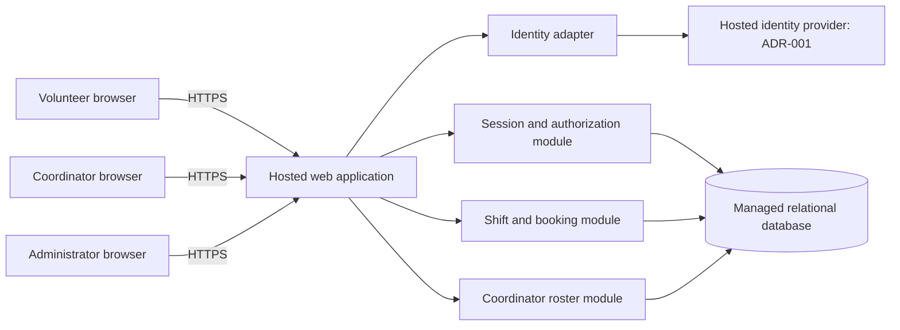

# ARC-001 — Volunteer shift sign-up

## Scope and evidence

Architecture for [PRD-001 v1](../prd/PRD-001.md), approved 2026-09-20: a mobile web application for approximately 120 volunteers and one coordinator. This document defines the design baseline for epic planning; it does not claim stakeholder approval, implementation, or passing runtime acceptance tests.

The workspace contains only the PRD. No repository instructions, code, architecture templates, test commands, or quality gates were supplied. BRN-001 is referenced by the PRD but is unavailable; no additional requirements are inferred from it. The approved PRD and its generated epic map remain unchanged.

Plan: establish component and data boundaries; assign the six requirements to design controls; isolate unresolved decisions; verify coverage, links, and preservation of the source PRD.

## Architecture decisions

| Decision | Design baseline | Rationale and consequence |
|---|---|---|
| D-01: hosted modular application | One hosted web application with server-side modules and a managed relational database. Static assets may use the hosting service's CDN. | Small pilot and shared transactions do not warrant independent services. NFR-003 applies to every module, identity service, data store, secret store, and backup. No on-site runtime dependency. Provider and language selection can occur during delivery planning. |
| D-02: identity boundary | External identity provider behind a server-side sign-in adapter; map its immutable subject and issuer to a local account. The concrete provider remains unresolved in [ADR-001](../adr/ADR-001.md). | Booking and roster use local account IDs and application roles, avoiding provider-specific coupling. Do not assume volunteers have email accounts or existing organizational identities. |
| D-03: application sessions | Opaque browser session cookie and authoritative database session records; check active session and current roles on every protected request. | Local session revocation has no dependency on provider token expiry. No positive session-validation cache for the pilot. Database outage denies protected access. |
| D-04: least-privilege data access | Server-side role checks and explicit response projections. Phone data is separate from general volunteer identity data. | Phone numbers never enter volunteer or administrator-only responses. Hiding UI fields is insufficient. |
| D-05: booking consistency | A single database transaction serializes bookings for the same shift and enforces uniqueness. | Concurrent attempts cannot overfill a shift; retries cannot create duplicate bookings. |
| D-06: daily roster | Query committed bookings from the same database on load and refresh; refresh an open roster every 30 seconds. | Avoids a second data store and synchronization pipeline. Thirty seconds is a design default, not a PRD service-level target; display last refresh time and errors. |

These are architectural choices within the requested design work. Draft status records the absence of a human review; it is not an invented requirement for permission to plan epics.

The browser is untrusted and has no database credentials. The application owns authorization; provider claims do not grant coordinator or administrator roles automatically. Hosting credentials and secrets remain on the server. Use HTTPS, encrypted storage/backups, restricted service accounts, and hosted secret management. Do not log phone numbers, credentials, session secrets, or identity tokens.

## Data ownership and interfaces

| Module | Records and invariants | Contract |
|---|---|---|
| Identity and authorization | `Account(id, issuer, subject, roles, session_generation)`; unique `(issuer, subject)`. `Session(token_hash, account_id, generation, expires_at, revoked_at)`. | Successful provider authentication resolves an enrolled local account and creates an application session. Protected modules receive `{account_id, roles}` only after authorization. Browser-supplied account IDs or role claims are never trusted. |
| Volunteer directory | `Volunteer(account_id, display_name)` and restricted `VolunteerContact(account_id, phone)`. | General projections omit phone entirely, including the volunteer's own phone. Only a coordinator-authorized operation reads phone data. No phone in identity-provider metadata, booking responses, error payloads, URLs, or analytics. |
| Shifts and booking | `Shift(id, starts_at, ends_at, capacity, booking_open)`; positive capacity. `Booking(id, shift_id, volunteer_id, created_at)`; unique `(shift_id, volunteer_id)` and foreign keys. | Signed-in volunteers list open shifts and create their own booking. Commit only while the shift is open, has not started, and has spare capacity. |
| Roster | Read projection joining shifts, bookings, and volunteer names; coordinator-only contact projection. | Authorized coordinator requests a local calendar date and receives that day's shifts, including empty shifts, with committed bookings and permitted contact details. No public roster or volunteer access to another volunteer's booking. |

Illustrative HTTP boundaries for epic decomposition (exact route names are not acceptance criteria):

- `GET /shifts`: authenticated volunteer view, shift information and availability only.
- `POST /shifts/{id}/bookings`: derive volunteer identity from the session; return the existing booking on a duplicate retry, and a conflict for a full or closed shift.
- `GET /coordinator/roster?date=YYYY-MM-DD`: require coordinator role before querying contact details; use the configured food bank timezone for date boundaries.
- `POST /admin/volunteers/{id}/revoke-sessions`: require administrator role; revoke all current application sessions and record actor, target, and time without contact data or session secrets.
- Sign-in initiation, callback, and sign-out routes belong to the identity adapter; their provider-specific details depend on ADR-001.

Unauthenticated requests fail authentication; authenticated users without the required role are denied. Set sensitive responses to `Cache-Control: no-store`; do not store them in browser persistent storage or a service-worker cache. Apply CSRF protection to cookie-authenticated mutations and use Secure, HttpOnly, SameSite cookies. Admin-only access never implies coordinator access. A person needs an explicit coordinator role to view phone numbers.

## Critical flows and failure behavior

**Sign-in (FR-001).** The adapter validates the provider's authentication response and binds it to an enrolled account before creating an opaque application session. Callback correlation, replay protection, enrollment, recovery, and reauthentication behavior must be specified for the selected provider in ADR-001. An unknown identity cannot self-assign a local privileged role. Do not implement local passwords as a temporary workaround.

**Revocation (NFR-001).** In one transaction, increment the account's `session_generation` and revoke its session rows. Report success only after commit. Each protected request reads the authoritative account/session records and requires an unexpired, unrevoked session with the current generation. A stale cookie is rejected on its next request, including across application instances; the design therefore has no five-minute cache window. Never accept a provider token directly as authorization for booking or roster APIs. Sign-in session creation and revocation serialize against the same account record, preventing a concurrent session issuance from escaping the revoke operation. A sign-in begun before revocation cannot complete with an old generation. A fresh sign-in after revocation is distinct from use of a revoked session; provider-specific fresh-authentication behavior remains an ADR-001 integration check. Account suspension is not specified by the PRD.

Check authorization again before committing a protected mutation or emitting a sensitive response if a request was held open; do not keep long-lived authorized streams. Already delivered data cannot be recalled. Tests must exercise requests made at and after 300 seconds from the acknowledged revocation, all API routes, multiple sessions, and multiple application instances. Session-store failures fail closed.

**Booking (FR-002).** Lock the shift row, check for an existing booking, check open state, start time and capacity against committed bookings, then insert and commit. All writes that alter capacity or bookings use the same serialization discipline. A timeout after commit is safe to retry because of the uniqueness constraint. Failed transactions make no booking; unavailable storage produces a retryable failure, not a success screen. Return availability as advisory until the transaction commits.

**Roster and privacy (FR-003, NFR-002).** Authorize the coordinator before joining contact data. Refresh from committed data with no shared response cache. An error displays a stale-data indicator with last successful refresh time. Authorization tests cover unauthenticated, volunteer, administrator-only, coordinator, and combined roles, including direct API calls and changed object IDs. Removing the coordinator role takes effect at the next authorization check.

**Hosting (NFR-003).** Deploy web runtime, identity, database, secrets, and backups on hosted services. Keep database access private to service identities, use separate pilot/test configuration, and verify backup restore before pilot use. No vendor contract, region, price, or uptime promise is assumed here. Vendor selection must preserve these boundaries; material deviations require updating the architecture.

## Assumptions and delivery dependencies

These defaults make the design concrete without changing the approved requirements. Capture them in epic acceptance criteria; changes that invalidate the design require revisiting readiness.

| Item | Working default or unresolved issue | Effect |
|---|---|---|
| A-01: meaning of open | Explicitly enabled, future shift with available capacity; one booking per volunteer per shift. Capacity and dates are configured data. | FR-002 can be decomposed under this default. Waitlists, cancellation, reminders, recurring-shift editors, and overlap policies are not added to scope. |
| A-02: shift/contact provisioning | Authorized operator loads the initial approved volunteer list, coordinator role, shift schedule/capacities, and available contact data through a restricted import or operational procedure. | Pilot setup task; do not infer a new end-user CRUD feature. Phone import is handled by a coordinator-authorized operator. Missing phone data does not prevent booking. |
| A-03: timezone | One configured food bank IANA timezone; UTC instants in storage and local dates for roster queries. Actual timezone is not given. | Supply deployment configuration before pilot; do not infer it from the assistant environment. Test midnight and daylight-saving boundaries. |
| A-04: privileged users | Coordinator and administrator are separate capabilities; the same person may hold both through explicit provisioning. | Bootstrap and recovery procedures required before rollout. No administrator-only phone access. |
| A-05: provider/enrollment | Volunteer identity channels, account provisioning/recovery, and available service tenancy are unknown. | ADR-001 blocks FR-001 epic readiness. Provider discovery can proceed immediately. |
| A-06: infrastructure details | Hosting vendor, budget, region, retention period, and restore targets are unspecified. | Delivery tasks must choose/configure these before deployment. Architecture is portable; no unsupported numeric targets are added to PRD acceptance. |
| PRD ASM-01 | Smartphone availability remains unvalidated in the supplied material. | Owner: Priya Nair. Validate pilot access before rollout; does not block architecture decomposition. |

The Tuesday/Thursday pilot is controlled through provisioned shifts. Expansion uses the same architecture. SM-01 remains measured by the coordinator's shift log: booked capacity is not proof of actual attendance or the 95% target. Payroll and donations stay outside scope.

## Requirement coverage and epic readiness

**READY** means architecture is sufficient to write an epic with acceptance criteria. It does not mean implemented, tested, deployable, or free of sequencing dependencies. **BLOCKED** means a material architecture decision is unresolved. Shared NFRs must be attached to every affected epic, including FR-003 despite its `should` priority. Evidence status below evaluates design coverage only; all runtime acceptance checks are NOT_RUN.

| PRD item | Architectural coverage | Applies to | Epic readiness | Verification to carry into epics | Design evidence |
|---|---|---|---|---|---|
| FR-001: volunteer sign-in | D-02, D-03; identity adapter and local account/session boundary | Sign-in and downstream authenticated access | **BLOCKED — ADR-001 proposed** | Successful/failed sign-in, unknown identity, callback replay, recovery, session issuance and revoke/reauthentication integration | BLOCKED: concrete provider and enrollment contract unresolved |
| FR-002: book open shift | D-05; transactional booking and authenticated principal contract | Volunteer shift listing and booking | **READY**; integrated delivery depends on FR-001 | Authorized booking; anonymous/other-user denial; full/closed/started shift rejection; last-slot concurrency; duplicate retry after lost response | PASS: data invariants and failure behavior specified |
| FR-003: daily roster | D-04, D-06; coordinator projection and local-date query | Daily roster and contact display | **READY**; integrated delivery depends on FR-001 and booking data from FR-002 | Exact daily membership, empty shifts, date boundaries, fresh committed bookings, stale refresh display, denied non-coordinator access | PASS: read path and access boundary specified |
| NFR-001: revoke within 5 minutes | D-03; authoritative session check and generation invalidation | Every authenticated endpoint in FR-001, FR-002, FR-003 | **READY** for shared session-control work; provider integration depends on ADR-001 | Revoke every session on all instances; replay cookies at/after 300 seconds; concurrent issuance; store outage; stale provider credentials cannot restore revoked sessions | PASS: application-side timing mechanism specified; provider integration NOT_RUN |
| NFR-002: coordinator-only phones | D-04; restricted contact store, role checks and response projections | Every path that stores, returns, logs, or caches volunteer data, especially FR-003 | **READY** as a mandatory cross-cutting constraint | Role matrix, direct API access, object-ID tampering, response/log/cache inspection; admin-only and volunteer self-view contain no phone | PASS: explicit coordinator-only boundary specified |
| NFR-003: hosted services | D-01; deployment boundary and hosted dependencies | **Whole product: all FRs and all supporting services** | **READY** as a mandatory cross-cutting constraint | Deployment inventory/configuration proves hosted runtime, identity, database, secrets and backups; no on-site runtime dependency | PASS: global scope and deployment boundary specified |

FR-002 and FR-003 epics may be drafted against the stable local identity interface and developed with test identities. They cannot be declared end-to-end complete until FR-001 is delivered. NFR-001 is implementable using application sessions independently of provider choice, but final integration must prove that the selected adapter cannot bypass revocation. Do not interpret one open ADR as a blanket block on unrelated epic definition.

Suggested decomposition, without creating or assigning epic IDs:

1. Hosted foundation and shared authorization/session controls: NFR-001, NFR-003, and NFR-002 data boundaries; deployment and role bootstrap tasks.
2. Volunteer sign-in: FR-001 plus all three NFRs; blocked for feature-epic definition until ADR-001 is resolved.
3. Shift discovery and atomic booking: FR-002 plus all three NFRs; explicit dependency on sign-in and configured shift data.
4. Coordinator daily roster: FR-003 plus all three NFRs; explicit dependency on sign-in, directory provisioning, and booking data.

## Verification record

See [ARC-001 verification](ARC-001-verification.md) for commands and evidence against the actual document files. Runtime acceptance checks remain NOT_RUN because this task defines architecture and the workspace has no application or test harness. No behavior was implemented, so a failing behavior test and TDD cycle are not applicable to this documentation change.
