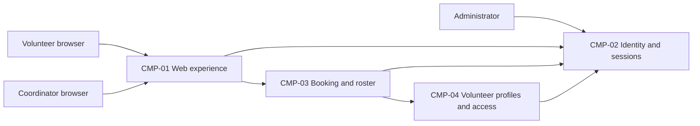

# ARCH-001 — Volunteer shift sign-up for the Riverside Food Bank architecture

## 1. Context and scope

This description examines PRD-001 version 1, status approved, owned by Priya Nair.
The system lets about 120 volunteers sign in and book warehouse shifts from mobile
web browsers, and lets the coordinator view each day's roster. Payroll, donations,
an installed mobile app, and an on-site server are outside the product scope.

No inspection scope was named, so no code or configuration was inspected. No
existing ARCH, ADR, approved policy, or local preference file was found at the
contract paths. The proposed outcome is create because no ARCH covers this system;
the user's request identifies PRD-001 but does not confirm that outcome.

The user requested proceeding without questions. All component boundaries, data
assignments, and interactions below are proposals, pending the architectural
questions. No architectural decision is accepted and no ADR is written.

## 2. Quality drivers

PRD-001#NFR-001 requires an administrator to revoke a volunteer's signed-in
sessions so they stop working within five minutes. Sign-in and authenticated
booking must share a revocation mechanism; choosing a provider alone does not
establish this guarantee (ARCH-001#DEC-01 and ARCH-001#DEC-02).

PRD-001#NFR-002 permits only the coordinator to see volunteer phone numbers.
The contact-data owner and the authorization boundary must prevent disclosure
through browser responses and roster or booking interfaces; hiding a screen field
alone cannot satisfy this constraint (ARCH-001#DEC-06 and ARCH-001#DEC-07).

PRD-001#NFR-003 requires hosted services across the product. The host, deployment
units, and environment arrangement remain open under ARCH-001#DEC-04.

The operating context is internal, as stated in PRD-001, despite the release name
Pilot. Its required quality categories are constraint, security, and privacy;
all three have NFRs. No additional policy categories apply. These requirements
are design drivers, not evidence that an implementation meets them.

## 3. Components

This is a proposed logical decomposition, not a choice of independently deployed
services. ARCH-001#DEC-03 controls the boundaries. Data ownership is provisional
under ARCH-001#DEC-05 and ARCH-001#DEC-06; arrows show needed interactions without
selecting protocols or consistency mechanisms.



```yaml items
components:
  - id: CMP-01
    status: active
    name: "Web experience"
    responsibility: "Presents mobile web sign-in, booking and coordinator roster flows; does not own authoritative records or make the final phone-data access decision."
    owns_data: []
    interacts_with:
      - "CMP-02"
      - "CMP-03"
    deployment: "Open: see DEC-04"
    upstream:
      - {id: PRD-001, item: NFR-001, relation: informed_by, version: 1, hash: null}
      - {id: PRD-001, item: NFR-002, relation: informed_by, version: 1, hash: null}
      - {id: PRD-001, item: NFR-003, relation: informed_by, version: 1, hash: null}
  - id: CMP-02
    status: active
    name: "Identity and sessions"
    responsibility: "Proposed authority for authentication, session validity and administrator revocation; does not own shift bookings or volunteer phone numbers. Provider and revocation mechanism remain open."
    owns_data:
      - "Proposed: authentication subject identifiers and credential bindings"
      - "Proposed: session validity and revocation state"
    interacts_with:
      - "CMP-01"
      - "CMP-03"
      - "CMP-04"
      - "Administrator"
    deployment: "Open: see DEC-04"
    upstream:
      - {id: PRD-001, item: NFR-001, relation: informed_by, version: 1, hash: null}
      - {id: PRD-001, item: NFR-003, relation: informed_by, version: 1, hash: null}
  - id: CMP-03
    status: active
    name: "Booking and roster"
    responsibility: "Proposed authority for open shifts and bookings, providing the coordinator roster from booked volunteers; does not own credentials or independently duplicate contact-data authority."
    owns_data:
      - "Proposed: warehouse shifts and availability"
      - "Proposed: bookings linked to stable volunteer references"
    interacts_with:
      - "CMP-01"
      - "CMP-02"
      - "CMP-04"
    deployment: "Open: see DEC-04"
    upstream:
      - {id: PRD-001, item: NFR-001, relation: informed_by, version: 1, hash: null}
      - {id: PRD-001, item: NFR-002, relation: informed_by, version: 1, hash: null}
      - {id: PRD-001, item: NFR-003, relation: informed_by, version: 1, hash: null}
  - id: CMP-04
    status: active
    name: "Volunteer profiles and access"
    responsibility: "Proposed authority for volunteer contact data and coordinator access grants, serving authorized roster data; does not authenticate users or own bookings. Its boundary and enforcement placement remain open."
    owns_data:
      - "Proposed: volunteer profile references and phone numbers"
      - "Proposed: coordinator access grants"
    interacts_with:
      - "CMP-02"
      - "CMP-03"
    deployment: "Open: see DEC-04"
    upstream:
      - {id: PRD-001, item: NFR-002, relation: informed_by, version: 1, hash: null}
      - {id: PRD-001, item: NFR-003, relation: informed_by, version: 1, hash: null}
```

## 4. Architectural questions

Each question is blocking. No mandated platform answers any question, and the
user requested no decision questions. The notes explain the scope of each open
choice without accepting it.

```yaml items
decisions:
  - id: DEC-01
    status: active
    question: "Which identity provider handles volunteer sign-in?"
    blocking: true
    state: open
    resolved_by: []
    notes: "Captures the PRD NEEDS ADR marker. The provider supplies identity to authenticated booking and must support the eventual session design; provider selection does not settle DEC-02."
    upstream:
      - {id: PRD-001, item: FR-001, relation: informed_by, version: 1, hash: null}
      - {id: PRD-001, item: FR-002, relation: informed_by, version: 1, hash: null}
      - {id: PRD-001, item: NFR-001, relation: informed_by, version: 1, hash: null}
  - id: DEC-02
    status: active
    question: "How will administrator revocation make every volunteer session stop working within five minutes?"
    blocking: true
    state: open
    resolved_by: []
    notes: "Sign-in and protected booking need one session-validity contract covering existing sessions, renewal and any cached authorization. Revocation authority and enforcement must be agreed independently of the identity provider."
    upstream:
      - {id: PRD-001, item: FR-001, relation: informed_by, version: 1, hash: null}
      - {id: PRD-001, item: FR-002, relation: informed_by, version: 1, hash: null}
      - {id: PRD-001, item: NFR-001, relation: informed_by, version: 1, hash: null}
  - id: DEC-03
    status: active
    question: "What component boundaries divide web presentation, identity, booking and roster, and volunteer profile responsibilities?"
    blocking: true
    state: open
    resolved_by: []
    notes: "CMP-01 through CMP-04 propose logical responsibilities only. Whether they are modules or services affects shared security and privacy enforcement and the hosted deployment arrangement."
    upstream:
      - {id: PRD-001, item: FR-001, relation: informed_by, version: 1, hash: null}
      - {id: PRD-001, item: FR-002, relation: informed_by, version: 1, hash: null}
      - {id: PRD-001, item: FR-003, relation: informed_by, version: 1, hash: null}
      - {id: PRD-001, item: NFR-001, relation: informed_by, version: 1, hash: null}
      - {id: PRD-001, item: NFR-002, relation: informed_by, version: 1, hash: null}
      - {id: PRD-001, item: NFR-003, relation: informed_by, version: 1, hash: null}
  - id: DEC-04
    status: active
    question: "What hosted deployment topology will run the whole product?"
    blocking: true
    state: open
    resolved_by: []
    notes: "The PRD rules out an on-site server but chooses no host, deployment units or environments. The topology must support shared session enforcement and private contact-data access across every product capability."
    upstream:
      - {id: PRD-001, item: FR-001, relation: informed_by, version: 1, hash: null}
      - {id: PRD-001, item: FR-002, relation: informed_by, version: 1, hash: null}
      - {id: PRD-001, item: FR-003, relation: informed_by, version: 1, hash: null}
      - {id: PRD-001, item: NFR-001, relation: informed_by, version: 1, hash: null}
      - {id: PRD-001, item: NFR-002, relation: informed_by, version: 1, hash: null}
      - {id: PRD-001, item: NFR-003, relation: informed_by, version: 1, hash: null}
  - id: DEC-05
    status: active
    question: "Which component is the authoritative owner of shift availability and bookings?"
    blocking: true
    state: open
    resolved_by: []
    notes: "CMP-03 is the proposed owner. Booking and roster epics need a common source of truth so accepting a booking and showing booked volunteers use the same records; storage technology and detailed schemas are not selected here."
    upstream:
      - {id: PRD-001, item: FR-002, relation: informed_by, version: 1, hash: null}
      - {id: PRD-001, item: FR-003, relation: informed_by, version: 1, hash: null}
  - id: DEC-06
    status: active
    question: "Which component owns volunteer profiles and contact data shared by booking and roster?"
    blocking: true
    state: open
    resolved_by: []
    notes: "CMP-04 is the proposed owner. Booking needs stable volunteer references, and roster needs volunteer information without spreading phone-number authority across components. This does not decide which phone fields the roster displays."
    upstream:
      - {id: PRD-001, item: FR-002, relation: informed_by, version: 1, hash: null}
      - {id: PRD-001, item: FR-003, relation: informed_by, version: 1, hash: null}
      - {id: PRD-001, item: NFR-002, relation: informed_by, version: 1, hash: null}
  - id: DEC-07
    status: active
    question: "Where will coordinator-only authorization for volunteer phone numbers be enforced?"
    blocking: true
    state: open
    resolved_by: []
    notes: "The trusted role source and enforcement boundary must work across profile access and roster delivery. Coordinator access must not be inferred from browser state, and administrator session-revocation authority does not imply phone-data access."
    upstream:
      - {id: PRD-001, item: FR-003, relation: informed_by, version: 1, hash: null}
      - {id: PRD-001, item: NFR-002, relation: informed_by, version: 1, hash: null}
  - id: DEC-08
    status: active
    question: "How will accepted bookings become visible to the coordinator's live roster?"
    blocking: true
    state: open
    resolved_by: []
    notes: "Booking and roster need an agreed interaction and consistency model, such as a shared authoritative read or a propagated roster view. The PRD gives no numeric roster freshness target; this description adds none."
    upstream:
      - {id: PRD-001, item: FR-002, relation: informed_by, version: 1, hash: null}
      - {id: PRD-001, item: FR-003, relation: informed_by, version: 1, hash: null}
```

## 5. Evidence inspected

```yaml items
evidence:
  - id: EVD-01
    status: active
    source: "PRD-001"
    kind: prd
    finding: "Version 1, status approved: FR-001 through FR-003 require volunteer sign-in, authenticated booking and a coordinator roster; NFR-001 requires revocation within five minutes, NFR-002 restricts phone numbers to the coordinator, and NFR-003 requires hosted services for the whole product. The identity provider is explicitly marked NEEDS ADR. Operating context is internal."
    classification: context
```

## 6. Deployment

Hosted services are a requirement under PRD-001#NFR-003. The proposed logical
components do not fix a vendor, number of runtime units, persistence service, or
environment strategy. Those choices remain open under ARCH-001#DEC-04 and depend
on ARCH-001#DEC-03. Volunteer and coordinator browsers are clients. No on-site
server is part of the proposed system.

## 7. Requirement changes proposed to the PRD owner

- None.

## 8. Open questions

- [NEEDS CLARIFICATION: No inspection scope was named and no code or configuration was inspected; existing implementation, infrastructure and component reuse suitability are unknown.]
- [NEEDS CLARIFICATION: The create outcome is proposed because no ARCH covers this system, but the user has not explicitly confirmed it; outcome remains null.]
- [NEEDS CLARIFICATION: host model/session identity unavailable]
- [NEEDS CLARIFICATION: The host exposes session 01a0e9e9-903d-7c92-88c1-71c230101669 but no exact model ID; model is unknown and provenance validation remains unresolved.]

## Change Log

| Version | Date | Author | Change | Items affected |
|---|---|---|---|---|
| 1 | 2026-09-28 | codex (session 01a0e9e9-903d-7c92-88c1-71c230101669) | Initial draft for PRD-001 v1 with proposed components and eight open blocking questions; exact host model identity unavailable. Policy resolution: interview.max_calls=8 (default); architecture.mandated_platforms=none (default); quality.required_categories=floor only (default) | all |
| 1 | 2026-09-28 | codex (session 01a0e9e9-903d-7c92-88c1-71c230101669) | Validation audit: self-check 3 unresolved because the exact host model ID is unavailable. Retained draft status, empty approval fields, null outcome and all decisions open; no ADR or approval restoration was needed. Structural and traceability checks passed with python3 /tmp/validate-arch-001.py; validated readiness handoff withheld under ERR-05. Policy resolution: interview.max_calls=8 (default); architecture.mandated_platforms=none (default); quality.required_categories=floor only (default) | generated_by; validation |
