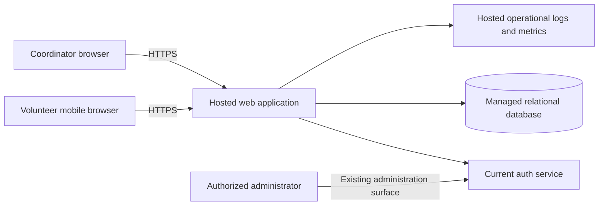

# ARCH-001 — Volunteer shift sign-up

## Scope and decisions

This design implements [PRD-001](../prd/PRD-001.md), version 1: mobile browser
sign-in, booking open warehouse shifts, and the coordinator's daily roster for
approximately 120 volunteers. Reuse the current auth service, as directed by the
user; [ADR-001](../adr/ADR-001.md) records that decision and its integration gate.
Payroll and donations remain outside the product scope.

Use one hosted web application with server-side application modules and a managed
relational database. This scale does not require independently deployed booking
and roster services, a message broker, or a separate analytics system. Database
transactions enforce booking capacity; the roster reads the same committed data.
The application must never become a second credential store.

Only the PRD was supplied. No application code, repository instructions, auth
contract, deployment configuration, or test commands are present. The component
boundaries below are design decisions, not claims about existing implementation.
Framework and hosting vendor selection are deferred to the implementation
environment; no new identity provider is proposed.

## Components and trust boundaries

The browser is untrusted. Only the web application's server can access the
database or privileged auth interfaces. All protected routes share an auth
adapter and authorization middleware. Application modules are identity/session
integration, shifts/bookings, and coordinator roster. These are boundaries
within one deployment, with explicit interfaces and tests.

Deploy the application, database, secrets, backups, and observability to hosted
services. The current auth service must also satisfy this whole-product hosting
constraint. Keep the database off the public browser path, use encrypted
connections, managed secrets, and separate pilot/test and production data.

## Identity, sessions, and access control

Use the current service's supported sign-in and session-validation flow. Map its
stable issuer/subject identity to a local volunteer record; do not use phone
numbers as identity keys. Passwords, recovery, and primary identity lifecycle
remain with the current service. Exact endpoints, protocol, claims, and token
format await its actual contract; OIDC or JWT support is not assumed.

The application may issue an opaque browser session cookie after service-verified
sign-in. Keep it Secure, HttpOnly, and appropriately SameSite, protect mutations
against CSRF, and keep upstream credentials server-side. A local session must
remain bound to the upstream session and its revocation state; it cannot prolong
access beyond the service's validity. Do not accept alternate bearer-token routes
that bypass the same validation. If the existing service uses another browser
integration, review its equivalent controls before implementation.

Use authoritative server-side role assignments. The application owns its
volunteer/coordinator permissions unless a verified existing role source can
supply equivalent assignments. An administrator's ability to revoke sessions
does not grant coordinator access to phone numbers. Provision role assignments
through a restricted operational process; clients cannot assign roles.

| Actor | Allowed product actions |
|---|---|
| Unauthenticated | Start sign-in; no booking, roster, or volunteer contact data |
| Volunteer | List open shifts and book for their own authenticated identity |
| Coordinator | Read daily roster, including volunteer phone numbers |
| Administrator | Revoke a volunteer's sessions through the existing auth administration surface; no contact access unless separately assigned coordinator |

For NFR-001, every protected request must obtain a service-backed session status
whose freshness satisfies the revocation bound. The initial design uses an
authoritative online check per request, without a positive-status application
cache. Locally verifying a token signature alone is insufficient. Require a
documented bound on upstream revocation propagation plus validation and request
completion time of at most 300 seconds from successful administrator revocation.
Bound protected request duration and revalidate before a delayed mutation or
sensitive response; no long-running request may outlive the revocation budget.

Revocation must cover every pre-existing session and refresh credential for the
target volunteer, across devices and application instances. A refresh must not
resurrect a revoked session. Fresh sign-in after revocation follows the existing
service's policy; revocation is distinct from permanently disabling an account.
On invalid/revoked sessions return 401. On an unavailable authority return a
temporary failure without protected data or mutation. Fail closed. Test this
behavior during service outages as well as normal operation. The exact mechanism
and timing are **unverified release blockers**, detailed in ADR-001.

## Data model and invariants

| Entity | Minimum fields and constraints |
|---|---|
| Volunteer | Internal ID, unique `(auth_issuer, auth_subject)`, display name |
| VolunteerContact | Volunteer ID foreign key, phone number; separate restricted query path |
| RoleAssignment | Identity reference, role; unique identity/role pair; operationally managed |
| Shift | ID, start/end instants, capacity greater than zero, booking-enabled flag; end after start |
| Booking | ID, shift ID and volunteer ID foreign keys, created time; unique `(shift_id, volunteer_id)` |

Store instants in UTC and configure the food bank's actual IANA time zone for
daily roster boundaries and display. The food bank time zone is not established
by the supplied materials. A shift belongs to the local date on which it starts;
date filtering uses local midnight boundaries converted to UTC, including DST.

Proposed interpretation of an open shift: enabled for booking, not yet started,
and below configured capacity. Shift times, capacities, the food bank time zone,
and initial volunteer/contact records are deployment inputs. For the pilot,
populate these through a restricted, validated import or operational command;
a scheduling editor and contact-management UI are not required by this PRD.
Contact source and maintenance ownership must be established before loading
real records. Cancellation, waitlists, recurring scheduling, and notifications
are deferred extensions, not prerequisites silently added to the pilot.

## Request flows and application interfaces

These are proposed application routes; they are not existing auth-service APIs.

| Interface | Server behavior |
|---|---|
| Sign-in entry/callback | Delegate to the verified current-service contract, bind the returned identity/session, then redirect to shifts |
| `GET /api/shifts?date=YYYY-MM-DD` | Validate volunteer session; return shift times, capacity remaining, and own booking status, without other volunteer identities or contacts |
| `POST /api/shifts/{id}/bookings` | Validate volunteer session; derive volunteer ID from identity, never from a client-supplied booking owner |
| `GET /api/roster?date=YYYY-MM-DD` | Validate coordinator role; return each shift and its booked volunteer names and phone numbers, including empty shifts |

Booking is one database transaction: lock the shift row; return the existing
booking if this volunteer already booked; check enabled/start/capacity conditions;
insert the booking; commit before confirming success. Every path that changes
capacity or bookings must take the same shift lock. The uniqueness constraint
prevents duplicates, and serializing on the shift prevents oversubscription.
An already-booked retry returns the same booking even if capacity is now full;
a new booking for a closed/full shift returns 409. A missing shift returns 404.
Database failure rolls back the operation. After an ambiguous network failure,
the browser can safely retry without consuming another place.

The coordinator reads committed bookings from the primary database so a
successful booking appears on the next refresh. Refresh on page focus and offer
manual refresh; poll every 15 seconds while the roster is visible. This is a
proposed interpretation of “live,” since the PRD sets no latency target. Show
last-updated time and a stale/error indicator if refresh fails. The server must
recheck authorization on each request. Stop refresh and clear displayed data on
session rejection. Server revocation prevents future access; it cannot retract
data already seen by an authorized viewer.

## Phone-number privacy

Enforce NFR-002 at the server response and data-access boundaries. Only the
coordinator roster query may join VolunteerContact; volunteer responses use
explicit field allowlists and omit all phone numbers, including the requester's.
Return 403 for roster requests by authenticated users without coordinator role.
Client-side hiding is insufficient. Exclude phones from auth-derived browser
payloads, errors, telemetry, URLs, audit logs, and shared caches. Use private,
no-store responses for authenticated data; do not store roster data offline or
in local storage. Platform service accounts access contact storage only to serve
this restricted path; no product admin endpoint exposes it.

## Operations and rollout

Run the Tuesday/Thursday pilot using booking-enabled shift records, then enable
other shifts. Keep schema migrations versioned and enable hosted backups with a
tested restore process before accepting real bookings. Roll back application
releases using compatible migrations; disable new bookings during an incident
without deleting existing roster records.

Monitor request failures, booking conflicts, database errors, auth-check latency,
and revocation failures. Record revocation actor, target identifier, time, and
result without credentials or contact details, using existing auth audit records
where available. Establish hosting, auth, and data-operation ownership before
the pilot. No availability or recovery SLA is invented here.

SM-01 remains measured by the coordinator's shift log: shifts that start fully
staffed divided by shifts in the measured period, targeting 95% by pilot end.
Booking counts alone cannot prove attendance or success. ASM-01, volunteer
smartphone availability, remains an open product assumption from the PRD.

## Requirement traceability and acceptance evidence

The checks below define implementation acceptance; they are not executed tests.
“Design PASS” means the requirement has a concrete design and verification path.
Runtime statuses deliberately distinguish unavailable evidence from a pass.

| Requirement | Design coverage | Required evidence before pilot | Runtime status |
|---|---|---|---|
| FR-001 | PASS — existing auth adapter and stable identity mapping | Successful and rejected sign-in, identity binding, session expiry, and sign-out integration tests against current service | BLOCKED — auth contract unavailable |
| FR-002 | PASS — serialized booking transaction and uniqueness constraint | Authenticated booking; anonymous rejection; client identity tampering; simultaneous attempts for last place yield one booking; duplicate retry succeeds without additional booking; closed/past shift rejection and rollback | NOT_RUN — no implementation |
| FR-003 | PASS — coordinator route over committed booking data | Correct local-date roster, empty shifts, new booking visible on next refresh, non-coordinator denial, and stale-state display on refresh failure | NOT_RUN — no implementation |
| NFR-001 | PASS — authority-backed validation and bounded revocation | Revoke all sessions across devices/instances; replay cookie/access/refresh credentials immediately and through 300 seconds; no success after deadline; repeat under outage, propagation delay, and in-flight requests | BLOCKED — current-service revocation capabilities and timing unknown |
| NFR-002 | PASS — coordinator-only contact query and response allowlists | Permission matrix including admin without coordinator role; inspect API/HTML/errors/logs/cache behavior for phone disclosure using synthetic contact data | NOT_RUN — no implementation |
| NFR-003 | PASS — all server-side components hosted | Inspect actual deployment topology including current auth, database, secrets, backups, and logs; verify no on-site dependency | BLOCKED — deployment evidence unavailable |

Before implementation, obtain the current auth contract and validate ADR-001's
integration gate. Before the pilot, provide shift/contact configuration and
execute all acceptance checks above. If auth cannot meet revocation or hosted
operation requirements, record the incompatibility and plan an extension to the
current service; do not silently weaken the PRD or switch providers.

## Document verification

See [verification record](ARCH-001-verification.md) for checks against the written
architecture candidate. The approved PRD is preserved without edits. Its identity
provider question is answered by ADR-001; technical compatibility remains open.
