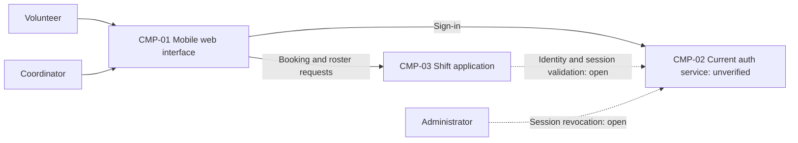

# ARCH-001 — Volunteer shift sign-up for the Riverside Food Bank architecture

## 1. Context and scope

This draft describes the shared architecture for PRD-001 version 1, status approved: volunteer sign-in, self-service warehouse shift booking, and the coordinator's daily roster. The intended audience is approximately 120 volunteers using mobile browsers and one coordinator. Payroll, donations, and an installed mobile app are outside scope.

The request selects PRD-001 and directs reuse of the current auth service for sign-in. This direction is recorded in ARCH-001#DEC-01. No repository inspection paths were named, so inspection_scope is empty and no code or configuration was inspected. The service's location, interfaces, hosting, and behavior remain unknown. Only contract document paths were consulted; no existing ARCH, ADR, policy document, or local preference file was found.

The proposed outcome is create because no existing ARCH covers this system. The request did not explicitly confirm an ARCH outcome, so outcome remains null. The user requested no questions; no interview was conducted and no ADR is written. Component boundaries and ownership below describe a proposal, pending the corresponding decisions.

## 2. Quality drivers

PRD-001#NFR-001 requires administrator-triggered revocation of a volunteer's signed-in sessions to take effect within five minutes. Choosing the sign-in provider does not establish how this deadline is enforced across protected requests; ARCH-001#DEC-02 covers that mechanism independently.

PRD-001#NFR-002 permits only the coordinator to see volunteer phone numbers. The proposed application enforces authorization before returning contact data; browser presentation alone cannot establish this protection. Role authority and enforcement remain open in ARCH-001#DEC-03, with contact-data ownership in ARCH-001#DEC-05.

PRD-001#NFR-003 requires hosted services throughout the product because there is no on-site server. Providers, deployment units, and environments remain open in ARCH-001#DEC-07. No vendor or implementation stack is selected.

The operating context is internal, as recorded in PRD-001; the Pilot release label does not override it. The required quality floor is constraint, security, and privacy. All three categories have NFRs; none is missing. Framework defaults apply with an interview budget of eight calls, no mandated platform, and no extra required quality categories. Zero interview calls were used.

## 3. Components

This is a proposed logical shape, not evidence of existing implementation. ARCH-001#DEC-04 governs the boundaries; ARCH-001#DEC-05 governs application data ownership. The auth component represents the requested existing service, whose actual capabilities have not been inspected. Arrows describe responsibilities to connect, not a selected protocol.



```yaml items
components:
  - id: CMP-01
    status: active
    name: "Mobile web interface"
    responsibility: "Proposed browser interface for sign-in, shift booking, and coordinator roster views; not the authority for sessions, bookings, or contact-data access."
    owns_data: []
    interacts_with:
      - "CMP-02"
      - "CMP-03"
    deployment: "Open: see DEC-07"
    upstream:
      - {id: PRD-001, item: NFR-001, relation: informed_by, version: 1, hash: null}
      - {id: PRD-001, item: NFR-002, relation: informed_by, version: 1, hash: null}
      - {id: PRD-001, item: NFR-003, relation: informed_by, version: 1, hash: null}
  - id: CMP-02
    status: active
    name: "Current auth service (reuse requested; capabilities unverified)"
    responsibility: "Proposed authority for volunteer authentication and session lifecycle; not the owner of warehouse shifts or bookings. Revocation support and integration must be established."
    owns_data:
      - "Proposed: authentication identities and session state; actual ownership unverified."
    interacts_with:
      - "CMP-01"
      - "CMP-03"
      - "Administrator"
    deployment: "Open: see DEC-07"
    upstream:
      - {id: PRD-001, item: NFR-001, relation: informed_by, version: 1, hash: null}
      - {id: PRD-001, item: NFR-003, relation: informed_by, version: 1, hash: null}
  - id: CMP-03
    status: active
    name: "Shift application"
    responsibility: "Proposed application authority for open shifts, booking, daily roster reads, and coordinator-only access to phone numbers; validates identity through the auth service and does not manage credentials. Module boundaries and persistence remain undecided."
    owns_data:
      - "Proposed: warehouse shifts and bookings."
      - "Proposed: volunteer contact records and their association with authentication identities."
    interacts_with:
      - "CMP-01"
      - "CMP-02"
    deployment: "Open: see DEC-07"
    upstream:
      - {id: PRD-001, item: NFR-001, relation: informed_by, version: 1, hash: null}
      - {id: PRD-001, item: NFR-002, relation: informed_by, version: 1, hash: null}
      - {id: PRD-001, item: NFR-003, relation: informed_by, version: 1, hash: null}
```

## 4. Architectural questions

Each question is blocking and remains open. Reusing an authentication provider alone cannot resolve session revocation, privacy, or deployment. Requirement links identify the behavior governed by each question; no readiness result is stored here.

```yaml items
decisions:
  - id: DEC-01
    status: active
    question: "Which identity provider handles volunteer sign-in?"
    blocking: true
    state: open
    resolved_by: []
    notes: "The request directs reuse of the current auth service; recorded as the preferred option, not yet a formally resolved decision under this workflow. No inspection scope was supplied, so reuse feasibility is unknown. This captures the PRD's identity-provider NEEDS ADR marker."
    upstream:
      - {id: PRD-001, item: FR-001, relation: informed_by, version: 1, hash: null}
      - {id: PRD-001, item: FR-002, relation: informed_by, version: 1, hash: null}
      - {id: PRD-001, item: NFR-001, relation: informed_by, version: 1, hash: null}
  - id: DEC-02
    status: active
    question: "How will administrator revocation invalidate volunteer sessions across protected requests within five minutes?"
    blocking: true
    state: open
    resolved_by: []
    notes: "Sign-in creates the sessions and booking consumes them. Revocation authority, validation behavior, and any cache or token lifetime must jointly meet the deadline. Existing auth support is unknown; provider reuse does not settle this mechanism."
    upstream:
      - {id: PRD-001, item: FR-001, relation: informed_by, version: 1, hash: null}
      - {id: PRD-001, item: FR-002, relation: informed_by, version: 1, hash: null}
      - {id: PRD-001, item: NFR-001, relation: informed_by, version: 1, hash: null}
  - id: DEC-03
    status: active
    question: "What authorization boundary establishes coordinator authority and enforces exclusive access to volunteer phone numbers?"
    blocking: true
    state: open
    resolved_by: []
    notes: "The proposal enforces access in the shift application before data reaches the browser. The trusted source of coordinator authority and enforcement across booking and roster interfaces remain undecided; volunteer-facing responses must not disclose phone numbers."
    upstream:
      - {id: PRD-001, item: FR-002, relation: informed_by, version: 1, hash: null}
      - {id: PRD-001, item: FR-003, relation: informed_by, version: 1, hash: null}
      - {id: PRD-001, item: NFR-002, relation: informed_by, version: 1, hash: null}
  - id: DEC-04
    status: active
    question: "What component boundaries separate the browser, authentication integration, booking, and roster responsibilities?"
    blocking: true
    state: open
    resolved_by: []
    notes: "The diagram proposes a browser, the current auth service, and a shift application containing booking and roster capabilities. These are logical responsibilities; shared application modules versus separate services have not been selected."
    upstream:
      - {id: PRD-001, item: FR-001, relation: informed_by, version: 1, hash: null}
      - {id: PRD-001, item: FR-002, relation: informed_by, version: 1, hash: null}
      - {id: PRD-001, item: FR-003, relation: informed_by, version: 1, hash: null}
  - id: DEC-05
    status: active
    question: "Which component is the authoritative owner of shift, booking, and volunteer contact data shared by booking and roster views?"
    blocking: true
    state: open
    resolved_by: []
    notes: "The proposal places application records in the shift application, associated with auth identities. Whether contact data already has another owner is unknown. Ownership must prevent conflicting booking and roster records and support coordinator-only contact access."
    upstream:
      - {id: PRD-001, item: FR-002, relation: informed_by, version: 1, hash: null}
      - {id: PRD-001, item: FR-003, relation: informed_by, version: 1, hash: null}
      - {id: PRD-001, item: NFR-002, relation: informed_by, version: 1, hash: null}
  - id: DEC-06
    status: active
    question: "What consistency boundary connects accepted bookings to shift availability and the coordinator's daily roster?"
    blocking: true
    state: open
    resolved_by: []
    notes: "Booking and roster epics must agree whether they use one authoritative application state or synchronize separate views. No queue, event transport, storage engine, or refresh interval is selected. Exact API fields and product capacity rules belong to later specifications and the PRD owner."
    upstream:
      - {id: PRD-001, item: FR-002, relation: informed_by, version: 1, hash: null}
      - {id: PRD-001, item: FR-003, relation: informed_by, version: 1, hash: null}
  - id: DEC-07
    status: active
    question: "Which hosted deployment topology will run the whole product?"
    blocking: true
    state: open
    resolved_by: []
    notes: "Hosted services are required, but providers, deployment units, persistence hosting, and environments are undecided. The current auth service's hosting is unverified. This whole-product decision governs every FR and the placement of session and privacy enforcement."
    upstream:
      - {id: PRD-001, item: FR-001, relation: informed_by, version: 1, hash: null}
      - {id: PRD-001, item: FR-002, relation: informed_by, version: 1, hash: null}
      - {id: PRD-001, item: FR-003, relation: informed_by, version: 1, hash: null}
      - {id: PRD-001, item: NFR-001, relation: informed_by, version: 1, hash: null}
      - {id: PRD-001, item: NFR-002, relation: informed_by, version: 1, hash: null}
      - {id: PRD-001, item: NFR-003, relation: informed_by, version: 1, hash: null}
```

## 5. Evidence inspected

```yaml items
evidence:
  - id: EVD-01
    status: active
    source: "PRD-001"
    kind: prd
    finding: "Version 1, status approved: mobile browser sign-in, signed-in shift booking, and daily coordinator rosters; session revocation within five minutes, coordinator-only phone visibility, and hosted services for the whole product. Operating context is internal. An identity-provider NEEDS ADR marker affects FR-001."
    classification: context
```

## 6. Deployment

The whole product must use hosted services under PRD-001#NFR-003. The mobile interface is delivered to volunteers' and the coordinator's browsers; authoritative application data and access enforcement belong on hosted infrastructure. The proposed auth integration points to the current service, but its location and deployment are unknown.

ARCH-001#DEC-07 leaves the hosting topology, deployment units, and environments open. ARCH-001#DEC-04 leaves the logical application split open. No assumption is made that the existing auth service already meets hosted-service, revocation, or application-integration needs.

## 7. Requirement changes proposed to the PRD owner

- None.

## 8. Open questions

- [NEEDS CLARIFICATION: No inspection scope was named and no code was inspected, so whether the current auth service can be reused is unknown; its location, interface, identity model, revocation support, and hosting must be established.]
- [NEEDS CLARIFICATION: ARCH-001#DEC-01 through ARCH-001#DEC-07 remain open because no mandated platform applies and the request asks to proceed without questions.]
- [NEEDS CLARIFICATION: The proposed create outcome is unconfirmed; requesting auth-service reuse does not confirm the ARCH outcome.]
- [NEEDS CLARIFICATION: host model/session identity unavailable]

## Change Log

| Version | Date | Author | Change | Items affected |
|---|---|---|---|---|
| 1 | 2026-09-28 | codex (session unknown) | Initial draft for PRD-001 v1; auth reuse direction recorded, all decisions open, provenance validation unresolved. Policy resolution: interview.max_calls=8 (default); architecture.mandated_platforms=none (default); quality.required_categories=floor only (default) | all |
