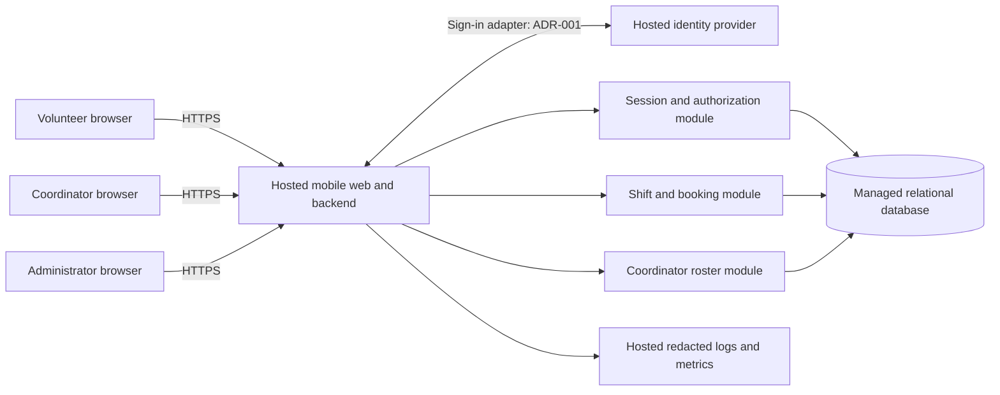

# ARC-001 — Volunteer shift pilot architecture

## Basis and decision summary

Source: [PRD-001 v1](../prd/PRD-001.md), approved 2026-09-20. The hash above is
SHA-256 of the complete source file. This architecture is authored for review; it
does not claim stakeholder approval or change the approved PRD.

Use a hosted, mobile-first web application with one backend deployment and a
managed relational database. Keep authentication, booking, and roster modules in
that application. At approximately 120 volunteers and three shifts per day,
separate services, a queue, and a distributed read model have no demonstrated need.

**Ready for epic decomposition:** FR-002, FR-003, NFR-002, NFR-003.
**Blocked for epic commitment:** FR-001 and NFR-001, pending
[ADR-001](../adr/ADR-001.md). Booking and roster can be decomposed against the
identity contract below; their integrated delivery still depends on sign-in and
revocation. The pilot cannot launch with these must-have requirements unresolved.

Only the PRD is present in the supplied workspace. No repository instructions,
architecture policy, source code, build configuration, or test commands were
available. BRN-001 is referenced by the PRD but was not supplied. Decisions below
are project proposals, not inferred organizational mandates.

## Components and trust boundaries

Browsers are untrusted. The backend authenticates and authorizes every protected
request; hiding a control is not enforcement. Database credentials, provider
secrets, and provider tokens stay server-side. No browser-to-database route exists.
Only public static assets may use a shared cache. Authenticated HTML and API
responses use `Cache-Control: no-store`; no offline cache stores rosters or phones.

| Module | Responsibility | Requirements |
|---|---|---|
| Web pages | Sign-in entry, open shifts and booking result, daily roster, administrator revocation control | FR-001–FR-003; NFR-001 |
| Identity adapter | Validate provider callback and map immutable provider identity to local principal | FR-001; NFR-001 |
| Sessions/authorization | App sessions, current roles, revoke-all operation, deny by default | FR-001–FR-003; NFR-001, NFR-002 |
| Booking | Shift availability and atomic, retry-safe booking | FR-002 |
| Roster | Daily committed bookings and coordinator-only contact projection | FR-003; NFR-002 |
| Hosted runtime/data/operations | Application, persistent data, secrets, backups, telemetry | NFR-003, across the entire product |

## Data and authorization

Use managed PostgreSQL as the proposed relational implementation. Hosting vendor,
language, and web framework remain implementation choices within these boundaries.

| Entity | Essential fields and invariants |
|---|---|
| Principal | Local ID; unique `(provider_issuer, provider_subject)`; roles; session generation; last revocation time. Never identify an account by display name alone. |
| Volunteer | ID linked to principal; display name. No phone field in general profile responses. |
| VolunteerContact | Volunteer ID; optional phone, isolated from general profile queries. Access only through the coordinator projection. |
| Session | Hash of random opaque cookie value; principal ID; issued generation; issued/expiry timestamps. Store no raw session secrets in logs. |
| Shift | ID; warehouse; start/end instants; positive capacity; explicit booking-enabled flag. |
| Booking | ID; shift ID; volunteer ID; creation timestamp; unique `(shift_id, volunteer_id)` with foreign keys. |
| AuditEvent | Actor ID; action; target ID; time; outcome. Exclude phone numbers, credentials, cookies, and provider tokens. |

Role grants come from controlled server-side provisioning, never browser input.
Volunteer, coordinator, and administrator are separate capabilities. An
administrator may revoke sessions but receives no phone access unless also granted
the coordinator role. Even a volunteer's own phone is excluded from volunteer
responses: NFR-002 says **only** the coordinator may see phone numbers.

The application uses explicit response field allowlists. General queries omit
contact columns; a separate coordinator-authorized query reads contacts. Reject
unauthorized access before querying contacts. Restrict database and backup access
to service identities and controlled operations; no general human contact viewer
or contact export is introduced. Provider profiles must not become a second phone
directory. The provider decision must account for that boundary.

## Request flows and consistency

### Sign-in and session revocation

The identity adapter returns a validated issuer/subject pair. It cannot grant
roles or directly authorize booking. The proposed protocol is a hosted OpenID
Connect authorization-code flow with PKCE, bound state/nonce, validated issuer,
audience, signature, expiry, and an exact callback URL. PKCE for a server web
client follows [RFC 9700 section 2.1.1](https://www.rfc-editor.org/rfc/rfc9700.html#section-2.1.1).
The provider and actual volunteer enrollment/recovery flow remain ADR-001 decisions.

After authentication, issue a random opaque app-session cookie with Secure,
HttpOnly, and SameSite attributes; protect mutating requests against CSRF. Every
protected request checks the session, expiry, current roles, and principal session
generation against the database primary. Do not authorize using a provider token
alone or a cached authorization result. Database failure denies protected work.

An administrator's revoke-all operation increments the volunteer's session
generation and records its revocation time in a transaction, invalidating every
previously issued app session. Serialize session issuance and revocation on the
principal row so a concurrent callback cannot escape invalidation.
Return success only after commit and record an audit event. Replicas and other app
instances consult that same primary, so requests after commit are denied without
waiting five minutes. Bound protected request duration to 30 seconds and recheck
authorization before a delayed write or response; terminate timed-out work. The
five-minute criterion includes requests already in flight. Session renewal must
not turn a revoked generation into a new session. Once the callback identifies the
principal, compare the server-recorded login-attempt start time to that principal's
last revocation time; reject attempts started at or before revocation. Use database
time for both. A new explicit login
after revocation may create a new session; account suspension is a separate scope.

This is an enforcement design, not demonstrated provider compatibility. ADR-001
must establish that provider renewal, SSO, and callback paths cannot silently
restore a revoked session. Do not equate provider token expiry with app revocation.

### Open shifts and booking

`GET /shifts` returns future, booking-enabled pilot shifts, availability, and the
current volunteer's booking state, without other volunteers' identities or phones.
`POST /shifts/{id}/bookings` derives volunteer ID from the authenticated principal.
It never trusts a client-supplied volunteer ID.

In one transaction at READ COMMITTED isolation: lock the shift row, check for an
existing booking, recheck booking-enabled/start time/capacity, insert the booking,
and commit. All booking writers and capacity changes must use the same shift lock.
The unique constraint handles duplicate requests; a retry returns the existing
booking even if the shift has since filled. Distinct volunteers competing for one
remaining place yield exactly one booking and one full-shift response. Return
success only after commit; a lost response can safely be retried. PostgreSQL
[`FOR UPDATE` row locks](https://www.postgresql.org/docs/current/explicit-locking.html#LOCKING-ROWS)
provide the proposed serialization mechanism. Phone numbers never enter this flow.

### Daily roster

`GET /coordinator/roster?date=YYYY-MM-DD` requires the coordinator role. Use the
food bank's configured IANA timezone to select shifts by local start date, including
empty shifts. Return shift details, booked volunteer names, and optional phones.
Read committed bookings from the primary; no separate asynchronous roster store.
Refresh on page entry, manual refresh, and a proposed 30-second polling interval.
Display last successful refresh and a stale/error state when polling fails.
The polling interval is a proposed interpretation of “live,” not a PRD latency SLA.
Remove displayed protected data on authorization failure.

## Hosted operations and pilot boundaries

NFR-003 applies globally: web assets, backend, identity, database, session state,
secrets, logs, backups, and production administrative tooling run on hosted
services. No food-bank machine is an always-on dependency. Use HTTPS, managed
secrets, private database connectivity/access restrictions, migrations, automated
backups, and a restore drill before pilot launch. Keep staging data synthetic.
Avoid request/response-body logging and scrub contact data from error telemetry.

Seed the Tuesday/Thursday shift schedule and capacity through a controlled hosted
operator task. Expand by enabling further shifts using the same data model. Do
not build shift-management, cancellation, waitlist, notification, payroll, or
donation features as part of this architecture. Log booking outcomes and revocation
latency without contact data. SM-01 remains measured by the coordinator's shift
log: bookings alone do not prove attendance or a fully staffed shift.

| Assumption or unresolved detail | Working treatment | Consequence |
|---|---|---|
| Meaning of “open” | Future, explicitly enabled, with capacity remaining; one booking per volunteer per shift | Derived booking rule for decomposition; no invented eligibility or overlap policy |
| Shift schedule, capacities, timezone, and initial volunteer list | Operator-provided pilot configuration | Required before staging acceptance; no timezone inferred from the author's environment |
| Coordinator versus administrator | Independent role grants | Identify the revocation operator before pilot; never grant phone access merely for administration |
| Roster freshness | Primary reads and proposed 30-second refresh | Refine the target in the roster epic; no unsupported real-time guarantee |
| ASM-01 smartphone availability | Still open; no evidence of the September meeting result supplied | Pilot rollout risk; preserve PRD validation action |
| Hosting account, budget, operational owner, backup retention | Select/configure during hosted-foundation work | Deployment prerequisites; no vendor purchase or availability claim made here |
| Identity/enrollment/recovery | ADR-001 unresolved | Blocks commitment of FR-001 and NFR-001; integration dependency for FR-002/FR-003 |

These assumptions are explicit inputs to epic refinement. New booking policies or
broader product functions require a PRD change rather than being smuggled into an epic.

## Requirement coverage and epic readiness

READY means architecture is sufficient to write an epic with the stated assumptions
and dependencies. It does not mean implemented, tested, stakeholder-approved, or
ready for release. BLOCKED means a material architecture decision is still open.
NFRs are inherited acceptance constraints, not optional standalone features.

| Requirement | Architectural allocation | Epic readiness | Dependency or exit condition | Planned evidence |
|---|---|---|---|---|
| FR-001 | Hosted identity adapter and app session | BLOCKED | Resolve ADR-001 provider, enrollment, recovery, and integration contract | V-01 |
| FR-002 | Atomic booking module and mobile shift pages | READY | Uses FR-001 principal/session contract; inherits NFR-001, NFR-002, NFR-003; integrated acceptance waits for identity | V-02, V-04, V-05, V-06 |
| FR-003 | Coordinator-authorized daily roster | READY | Uses current coordinator role; inherits NFR-001, NFR-002, NFR-003; integrated acceptance waits for identity | V-03, V-04, V-05, V-06 |
| NFR-001 | App-owned session generation and administrator revocation | BLOCKED | Resolve ADR-001 renewal/SSO integration and verify five-minute bound across all protected paths | V-04 |
| NFR-002 | Coordinator-only contact projection, role checks, output/log/cache controls | READY | Apply to FR-001 profiles, FR-002 responses, FR-003 roster, and administrator tooling | V-05 |
| NFR-003 | Entire hosted deployment and operations boundary | READY | Global constraint inherited by every epic; choose services during foundation work | V-06 |

Suggested decomposition order (labels below are candidates, not created epic IDs):

1. Hosted foundation: NFR-003; database, secrets, deployment and recovery.
2. Identity and revocation: FR-001 + NFR-001; blocked by ADR-001.
3. Volunteer booking: FR-002; may be specified now using a test identity adapter;
   production delivery depends on items 1 and 2 and all inherited NFRs.
4. Coordinator roster: FR-003 + NFR-002; may be specified now, preserves FR-003's
   **should** priority; depends on booking data and items 1 and 2 for integrated delivery.

NFR-002 remains a must-have even if FR-003 is deferred: with no coordinator contact
view, no other role may receive phones. Keep the PRD's generated epic map untouched
until actual epic artifacts exist.

## Verification contracts

No implementation or acceptance tests exist in this workspace. The following are
test obligations for epics, all currently **NOT_RUN**. Architecture document checks
and their actual evidence are recorded in [verification.md](verification.md).

| Evidence ID | Requirements | Acceptance evidence to establish during implementation | Current result |
|---|---|---|---|
| V-01 | FR-001 | Mobile browser completes the chosen login flow; invalid/replayed callbacks and unknown or unauthorized identities fail; account mapping and recovery behave as selected in ADR-001 | NOT_RUN |
| V-02 | FR-002 | Signed-in volunteer books an open shift; anonymous/spoofed requests fail; duplicate retries create one booking; simultaneous last-place requests cannot overbook; closed/past shifts reject new bookings | NOT_RUN |
| V-03 | FR-003 | Coordinator sees each date's committed bookings and empty shifts; local-day/DST boundaries work; non-coordinators denied; refresh and stale indicators behave as specified | NOT_RUN |
| V-04 | NFR-001; FR-001–FR-003 | Revoke from administrator UI with two volunteer sessions on different app instances; replay cookies and renewal/callback paths immediately and at 300 seconds; all revoked sessions denied by the deadline, including delayed work; failed session-store reads fail closed; non-administrator revocation denied | NOT_RUN |
| V-05 | NFR-002; FR-001–FR-003 | Seed a distinctive phone value and inspect HTML, JSON, errors, logs, caches and available tooling as anonymous, volunteer, administrator-only, and coordinator; only authorized coordinator responses contain it; guessed IDs and client role changes do not bypass checks | NOT_RUN |
| V-06 | NFR-003; whole product | Inventory every production dependency as hosted; run login/booking/roster/revocation with all on-site machines off; verify managed secrets, restricted data access and a backup restore | NOT_RUN |

During implementation, establish meaningful failing tests for these behaviors,
then implement and refactor. No TDD result is claimed for this documentation task.
No repository-defined gates or quality thresholds were supplied.

## Change log

| Version | Date | Author | Change |
|---|---|---|---|
| 1 | 2026-09-28 | Codex | Initial architecture, explicit identity gate, all-requirement coverage and epic readiness |
