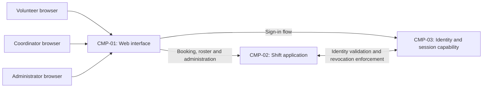

# ARCH-001 — Volunteer shift sign-up for the Riverside Food Bank architecture

## 1. Context and scope

Defined against PRD-001 version 1, status approved, owned by Priya Nair. The product lets about 120 volunteers sign in and book warehouse shifts from mobile web browsers, and lets the coordinator see the daily roster. Payroll and donations are outside scope. Session revocation by an administrator and coordinator-only access to phone numbers are included.

No inspection scope was named, and no code or configuration was inspected. No existing ARCH, ADR or policy documents were found at the contract paths; the local preference file was absent. Framework defaults apply. Repository implementation and reusable services are unknown.

A new architecture description is proposed because none covers this system. The user selected PRD-001 and requested no questions, but did not explicitly confirm the create outcome; outcome remains null. The components below are a proposal for discussion, not accepted boundaries or deployment choices. Every architectural question remains blocking and open; no ADR is written.

## 2. Quality drivers

PRD-001#NFR-001 requires administrator revocation of volunteer sessions to take effect within five minutes. Identity selection and revocation enforcement are separate questions: choosing a provider alone does not establish the time bound. The future verification must exercise previously issued sessions against protected booking operations after revocation, including any session caches.

PRD-001#NFR-002 restricts volunteer phone numbers to the coordinator. Data ownership and authorization must agree across identity, application responses and roster access. Future verification must check access with volunteer, coordinator and administrator roles; administrator status alone does not grant access to phone numbers.

PRD-001#NFR-003 requires hosted services across the whole product because there is no on-site server. It constrains every component without selecting a provider or deployment topology.

The operating context is internal, as recorded in PRD-001; the Pilot release label does not override it. The required quality categories are constraint, security and privacy, all covered by the three NFRs. No required category is unanswered. Mobile browser access and a live daily roster also shape the proposed interactions. PRD-001 specifies no numerical roster freshness target; this document invents none.

## 3. Components

This proposed logical decomposition is subject to ARCH-001#DEC-03. Ownership assignments are provisional under ARCH-001#DEC-04, interactions under ARCH-001#DEC-06, and deployment under ARCH-001#DEC-07. The diagram does not prescribe separate services.



```yaml items
components:
  - id: CMP-01
    status: active
    name: "Web interface"
    responsibility: "Proposed mobile browser interface for sign-in, booking, coordinator roster and administrator revocation actions; does not own durable records or independently enforce authorization."
    owns_data: []
    interacts_with:
      - "CMP-02"
      - "CMP-03"
    deployment: "Open: see DEC-07"
    upstream:
      - {id: PRD-001, item: NFR-001, relation: informed_by, version: 1, hash: null}
      - {id: PRD-001, item: NFR-002, relation: informed_by, version: 1, hash: null}
      - {id: PRD-001, item: NFR-003, relation: informed_by, version: 1, hash: null}
  - id: CMP-02
    status: active
    name: "Shift application"
    responsibility: "Proposed authority for booking, roster reads and access to volunteer contact records; coordinates protected actions with the identity capability and does not verify credentials itself. Boundaries and ownership remain open."
    owns_data:
      - "Proposed: warehouse shift availability and bookings"
      - "Proposed: volunteer profile and phone records"
    interacts_with:
      - "CMP-01"
      - "CMP-03"
    deployment: "Open: see DEC-07"
    upstream:
      - {id: PRD-001, item: NFR-001, relation: informed_by, version: 1, hash: null}
      - {id: PRD-001, item: NFR-002, relation: informed_by, version: 1, hash: null}
      - {id: PRD-001, item: NFR-003, relation: informed_by, version: 1, hash: null}
  - id: CMP-03
    status: active
    name: "Identity and session capability"
    responsibility: "Proposed authentication and session lifecycle capability, including revocation integration; does not own warehouse shifts or bookings. Provider selection does not settle revocation enforcement or role authority."
    owns_data:
      - "Proposed: authentication identities and credential references"
      - "Proposed: session and revocation state"
    interacts_with:
      - "CMP-01"
      - "CMP-02"
    deployment: "Open: see DEC-07"
    upstream:
      - {id: PRD-001, item: NFR-001, relation: informed_by, version: 1, hash: null}
      - {id: PRD-001, item: NFR-003, relation: informed_by, version: 1, hash: null}
```

## 4. Architectural questions

```yaml items
decisions:
  - id: DEC-01
    status: active
    question: "Which identity provider handles volunteer sign-in?"
    blocking: true
    state: open
    resolved_by: []
    notes: "Records the PRD NEEDS ADR marker. Provider choice affects sign-in, the identity trusted by booking and available revocation integration. No mandate or explicit decision exists; session enforcement remains a separate question in ARCH-001#DEC-02."
    upstream:
      - {id: PRD-001, item: FR-001, relation: informed_by, version: 1, hash: null}
      - {id: PRD-001, item: FR-002, relation: informed_by, version: 1, hash: null}
      - {id: PRD-001, item: NFR-001, relation: informed_by, version: 1, hash: null}
  - id: DEC-02
    status: active
    question: "How will administrator revocation make volunteer sessions stop working within five minutes across protected operations?"
    blocking: true
    state: open
    resolved_by: []
    notes: "The sign-in and booking implementations must share a session-validity contract. Central session checks require runtime availability; bounded local validity requires coordinated expiry and refresh rejection. Neither approach has been selected."
    upstream:
      - {id: PRD-001, item: FR-001, relation: informed_by, version: 1, hash: null}
      - {id: PRD-001, item: FR-002, relation: informed_by, version: 1, hash: null}
      - {id: PRD-001, item: NFR-001, relation: informed_by, version: 1, hash: null}
  - id: DEC-03
    status: active
    question: "What logical component boundaries will separate presentation, shift operations and identity responsibilities?"
    blocking: true
    state: open
    resolved_by: []
    notes: "The three CMP items propose shared responsibilities rather than accepted service boundaries. A single application with internal modules reduces integration points; separate capabilities permit independent changes but require explicit trust and interaction contracts. No boundary has been accepted."
    upstream:
      - {id: PRD-001, item: FR-001, relation: informed_by, version: 1, hash: null}
      - {id: PRD-001, item: FR-002, relation: informed_by, version: 1, hash: null}
      - {id: PRD-001, item: FR-003, relation: informed_by, version: 1, hash: null}
      - {id: PRD-001, item: NFR-001, relation: informed_by, version: 1, hash: null}
      - {id: PRD-001, item: NFR-002, relation: informed_by, version: 1, hash: null}
  - id: DEC-04
    status: active
    question: "Which component is authoritative for shift, booking and volunteer contact records shared by booking and roster features?"
    blocking: true
    state: open
    resolved_by: []
    notes: "CMP-02 tentatively owns these records. A shared domain owner simplifies roster access to bookings; separate owners need stable volunteer references and controlled contact-data access. Storage products, schemas and API fields remain outside this description."
    upstream:
      - {id: PRD-001, item: FR-002, relation: informed_by, version: 1, hash: null}
      - {id: PRD-001, item: FR-003, relation: informed_by, version: 1, hash: null}
      - {id: PRD-001, item: NFR-002, relation: informed_by, version: 1, hash: null}
  - id: DEC-05
    status: active
    question: "Where will the authoritative access-control policy distinguish volunteer, coordinator and administrator permissions?"
    blocking: true
    state: open
    resolved_by: []
    notes: "Booking needs a trusted volunteer identity; roster and phone access need coordinator authorization; revocation needs administrator authorization. Identity-managed roles or application-managed roles require different synchronization contracts. The PRD grants phone access only to the coordinator, including when administrators are distinct people."
    upstream:
      - {id: PRD-001, item: FR-002, relation: informed_by, version: 1, hash: null}
      - {id: PRD-001, item: FR-003, relation: informed_by, version: 1, hash: null}
      - {id: PRD-001, item: NFR-001, relation: informed_by, version: 1, hash: null}
      - {id: PRD-001, item: NFR-002, relation: informed_by, version: 1, hash: null}
  - id: DEC-06
    status: active
    question: "What consistency contract will connect successful bookings to the coordinator's roster?"
    blocking: true
    state: open
    resolved_by: []
    notes: "Reading the authoritative booking state avoids a separate roster copy; a projected roster introduces synchronization and freshness obligations. Independently built booking and roster epics must agree on which state constitutes a successful booking and how it becomes visible. No numerical freshness target or transport has been selected."
    upstream:
      - {id: PRD-001, item: FR-002, relation: informed_by, version: 1, hash: null}
      - {id: PRD-001, item: FR-003, relation: informed_by, version: 1, hash: null}
  - id: DEC-07
    status: active
    question: "What hosted deployment topology will run the whole product?"
    blocking: true
    state: open
    resolved_by: []
    notes: "PRD-001#NFR-003 rules out dependence on an on-site server but selects no provider, deployment units or environments. The topology must accommodate all three features, session enforcement and private contact records; logical CMP boundaries alone do not decide deployment."
    upstream:
      - {id: PRD-001, item: FR-001, relation: informed_by, version: 1, hash: null}
      - {id: PRD-001, item: FR-002, relation: informed_by, version: 1, hash: null}
      - {id: PRD-001, item: FR-003, relation: informed_by, version: 1, hash: null}
      - {id: PRD-001, item: NFR-001, relation: informed_by, version: 1, hash: null}
      - {id: PRD-001, item: NFR-002, relation: informed_by, version: 1, hash: null}
      - {id: PRD-001, item: NFR-003, relation: informed_by, version: 1, hash: null}
```

## 5. Evidence inspected

```yaml items
evidence:
  - id: EVD-01
    status: active
    source: "PRD-001"
    kind: prd
    finding: "Version 1, status approved: requires volunteer sign-in, signed-in booking and coordinator rosters; session revocation within five minutes, coordinator-only phone visibility and hosted services constrain the product. The identity provider is explicitly marked NEEDS ADR. Operating context is internal."
    classification: context
```

## 6. Deployment

All runtime services must be hosted under PRD-001#NFR-003. Volunteer and coordinator browsers are clients, not on-site servers. ARCH-001#DEC-07 leaves the host, unit boundaries and environments open; no vendor, region or operational arrangement has been selected. ARCH-001#DEC-02 must be compatible with the eventual topology so that session validation and revocation meet the five-minute bound wherever protected operations run. ARCH-001#DEC-05 must ensure deployment boundaries do not bypass coordinator-only phone access.

## 7. Requirement changes proposed to the PRD owner

- None.

## 8. Open questions

- [NEEDS CLARIFICATION: No inspection scope was named and no code or configuration was inspected; existing implementation, reusable services and hosting capabilities are unknown.]
- [NEEDS CLARIFICATION: The create outcome was not explicitly confirmed; outcome remains null under the user's request to proceed without questions.]
- [NEEDS CLARIFICATION: host model/session identity unavailable]

## Change Log

| Version | Date | Author | Change | Items affected |
|---|---|---|---|---|
| 1 | 2026-09-28 | codex (session unknown) | Initial draft for PRD-001 v1; seven shared questions remain open, and provenance validation is unresolved. Policy resolution: interview.max_calls=8 (default); architecture.mandated_platforms=none (default); quality.required_categories=floor only (default) | all |
