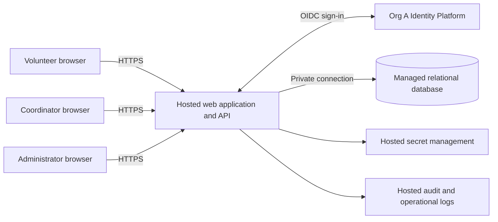

# ARCH-001 — PRD-001 pilot architecture and epic readiness

## 1. Outcome and governing inputs

A hosted mobile web application, one application service, and one managed relational database are sufficient for approximately 120 volunteers and one coordinator. Authentication uses **Org A Identity Platform (OIDC)**. The application owns booking, authorization, and revocable application sessions.

The six existing requirements have architectural coverage. **None is unconditionally ready for epic handoff:** organization-wide compliance and accessibility categories lack requirements and measurable acceptance criteria (GAP-01 and GAP-02). Epic outlines can be drafted using section 7, but must carry these blockers. This document defines a proposed design; it does not claim stakeholder approval, successful integration, or implementation verification.

Inputs read: [PRD-001 v1](../prd/PRD-001.md) and [POL-001 v3](../policy/POL-001.md). There is no application code, repository instruction file, test configuration, or architecture template in the supplied workspace. The upstream BRN-001 and organization ADR-104 are referenced but unavailable; their contents are not assumed.

Policy resolution:

| Setting | Effective value | Consequence |
|---|---|---|
| POL-001 SET-01, `architecture.mandated_platforms` | Org A Identity Platform (OIDC) for identity and authentication; no override | The PRD's identity-provider question is resolved by mandate. See [ADR-001](../adr/ADR-001.md). No local credentials or alternative identity provider. |
| POL-001 SET-02, `quality.required_categories` | Compliance and accessibility; applies to `internal` | Both categories apply to this pilot. Existing security, privacy, and hosting NFRs remain required. |

The PRD's historical change-log defaults (`mandated_platforms=none`, `required_categories=floor only`) conflict with the effective policy and cannot govern this architecture. The approved PRD and vendored policy remain unchanged. Missing quality requirements are recorded as gaps, not silently added to the approved baseline. No unspecified default quality floor is inferred from the historical note.

## 2. Components, deployment, and boundaries

| Component | Responsibility | Boundary |
|---|---|---|
| Mobile web UI | Sign-in entry, open shifts, booking result, daily roster | Browser input and claimed roles are untrusted. Phone visibility is enforced by API responses, not hidden controls. |
| Hosted application service | OIDC callback, sessions, authorization, booking transactions, roster reads, administrative revocation | Only service allowed to access product data. One deployable service with separate modules; no need for microservices or a message broker. |
| Org A Identity Platform | Authenticate users through the mandated OIDC integration | Platform contract and volunteer eligibility need confirmation; no undocumented platform revocation capability is assumed. |
| Managed relational database | Volunteers, access roles, sessions, shifts, bookings, private contacts | Transactional primary is authoritative for session validity and capacity. No browser database access. |
| Hosted operational services | Secrets, logs, backups, deployment | Production and test data/credentials separated. Logs exclude phone numbers, tokens, and session secrets. |

NFR-003 is a **whole-product constraint**, including UI delivery, application execution, database, session state, secrets, logs, backups, and any scheduled work. No component depends on a server at the food bank. Hosting vendor, runtime, region, and sizing are implementation decisions; region and retention must satisfy GAP-01 before deployment. This design does not procure a platform or assume an existing hosting contract.

## 3. Data and access model

| Entity | Minimal fields / invariants |
|---|---|
| Volunteer | Internal ID, identity issuer and subject (unique pair), display name, active flag, session generation. Do not use email or phone as the immutable identity key. |
| Role assignment | Principal ID and role: volunteer, coordinator, or administrator. Server-owned; roles may be combined explicitly. Administrator does not imply coordinator. |
| Private contact | Volunteer ID and optional phone number; accessed through a coordinator-only query path. Never select this field for volunteer or administrator responses. |
| Session | Hash of opaque session secret, principal ID, generation at issuance, expiry. Raw secret only in a Secure, HttpOnly cookie; server validates every protected request. |
| Shift | ID, warehouse, start/end instants, capacity, booking-enabled flag. Positive capacity; configured food-bank time zone determines roster dates. |
| Booking | ID, shift ID, volunteer ID, creation instant. Unique `(shift_id, volunteer_id)` and foreign keys. |
| Audit event | Time, actor ID, action, target ID, outcome and correlation ID. No phone or authentication secret. Retention/access policy remains GAP-01. |

Proposed role rules: volunteers browse open shifts and book for themselves; coordinators read the daily roster and private contacts; administrators revoke sessions. No role may confer itself access. Unauthenticated users receive no roster, contact, or booking data. Service operators' privileged database access must be controlled and audited under GAP-01; an administrator application role is not a bypass for NFR-002.

Existing volunteer records, role assignments, contacts, and the pilot shift schedule require an initial authorized import or operator setup. A scheduling UI, phone-editing workflow, public registration, cancellations, waitlists, reminders, payroll, and donations are outside this design's delivery scope. Source ownership and the exact booking rules are tracked in GAP-04; this assumption does not silently authorize a new administrative product.

## 4. Behavior and failure handling

### Sign-in and session revocation — FR-001, NFR-001

Use the platform's supported OIDC authorization-code integration with PKCE and a maintained client library. The backend validates the callback, issuer, audience, signature, expiry, state, and nonce; maps the issuer/subject to an authorized local principal; then creates an opaque application session. No browser-stored bearer token grants direct access to the application API. Platform registration details remain GAP-03.

On every protected request, read the session and principal generation from the authoritative database. A missing, expired, inactive, or generation-mismatched session is rejected. An administrator's revoke-all operation atomically increments the principal's session generation. Success is returned only after commit, and the action is audited. Sessions created before that commit cannot authorize subsequent requests. Session issuance and revocation must serialize on the principal record so a concurrent callback cannot restore a pre-revocation session generation.

Do not cache validity across requests or use a lagging replica for authorization. Database or validation failure denies access. Bound protected requests below five minutes; recheck authorization at a booking's transaction boundary and before returning sensitive data when work outlives its initial check. There are no long-lived roster streams. This provides an application-controlled path to the five-minute bound without relying on identity-token expiry or platform push events.

Revocation invalidates existing application sessions. Whether it must also disable future sign-in or terminate the platform SSO session is not specified by NFR-001; no such capability is promised. A fresh sign-in may create a new application session. Confirm any stronger operational meaning under GAP-03 before expanding scope.

### Booking — FR-002

The proposed definition of an open shift is: booking enabled, start time in the future, and booked count below configured capacity. Confirm this product rule under GAP-04. The server derives the volunteer ID from the session and rejects client attempts to book for someone else.

Within one transaction, validate the session and shift, lock the shift row, check for an existing booking, recount bookings, and insert only if space remains. The unique booking constraint prevents duplicates. Repeat submissions return the existing booking; a competing request for the final place gets an explicit full-shift result. Display success only after commit. Unknown outcomes after network failure can be retried safely for the same volunteer/shift. No local browser capacity value is authoritative.

### Daily roster and phone privacy — FR-003, NFR-002

The coordinator selects a local calendar day; the service translates it into a start-inclusive/end-exclusive interval using the configured food-bank time zone and returns each shift's committed bookings and volunteer display names. The coordinator-only projection may include phone numbers. Volunteer lists show shift availability, never other volunteers' contacts. Administrator-only users also receive no phone fields.

Proposed interpretation of "live roster": read committed data on load/date change/manual refresh and refresh every 30 seconds while the page is visible. Show the last successful refresh and an error on failure; do not present stale data as current. The interval is a design proposal, not an approved PRD freshness SLA (GAP-05).

All roster/contact responses use private, no-store caching. Phone numbers must also be excluded from error bodies, URLs, analytics, logs, static assets, client persistence, and volunteer-facing data serializers. Privileged contact reads are audited without recording the phone value. No export feature is included.

## 5. Quality gaps and unresolved inputs

Proceeding without questions means recording unresolved facts and proposed defaults, not inventing organizational decisions. Owners below are suggested resolution roles, not newly assigned commitments.

| ID | Missing decision or evidence | Proposed path / resolution role | Blocking scope |
|---|---|---|---|
| GAP-01 | Compliance requirements required by POL-001 SET-02 are absent. Policy's SOC 2 rationale supplies no implementable controls or evidence criteria. | Organization compliance owner plus PRD owner define applicable controls, data location/retention/deletion, privileged access, audit access/retention, change evidence, backup/restore and incident expectations. Add measurable requirements to the approved PRD or an approved linked quality specification. No certification claim is made. | All epic handoffs; whole product. |
| GAP-02 | Accessibility requirements required by POL-001 SET-02 are absent; conformance target and assessment method unknown. | Organization accessibility owner plus PRD owner define target and acceptance evidence covering sign-in (including hosted identity pages), booking, roster, and administration. Proposed baseline topics: keyboard operation, labels, focus, error/status announcements, contrast, zoom and mobile reflow, with manual assistive-technology checks. These topics do not substitute for an approved target. | All epic handoffs; whole product. |
| GAP-03 | Org A platform onboarding, volunteer account eligibility, client configuration, supported flow, role source, logout behavior and meaning of revocation beyond existing app sessions are unverified. ADR-104 text is unavailable. | Identity platform owner provides integration contract and test tenant; validate [ADR-001](../adr/ADR-001.md). Keep the mandated platform; escalate incompatibility without substituting a provider. | Identity integration implementation; successful sign-in gates dependent end-to-end tests. Provider selection itself is resolved. |
| GAP-04 | Capacity, opening/closing rules, food-bank time zone, and source/owner of volunteer and shift data are unspecified. | PRD owner/coordinator confirms section 3 setup and section 4 open-shift definition; supplies pilot schedule, capacities, time zone and authorized records. | FR-002 final epic acceptance criteria; roster date/setup criteria in FR-003. |
| GAP-05 | "Live" roster has no freshness bound. | PRD owner confirms or changes the proposed 30-second visible-page refresh and manual refresh behavior. | FR-003 final epic acceptance criteria. |

ASM-01 remains open: smartphone/browser availability must be validated with volunteers as the PRD specifies. It affects pilot adoption, not the hosted architecture choice. SM-01 continues to be measured by the coordinator's shift log; the 95% target is an outcome, not an application performance promise. Do not add an analytics project to this scope.

## 6. Requirement traceability and readiness

`PASS` below means a requirement has a concrete architectural treatment, not that software passes acceptance tests. `BLOCKED` means the listed inputs prevent an unconditional epic handoff. Integration and runtime verification are `NOT_RUN`; there is no implementation in this workspace.

| Requirement | Architectural coverage | Architecture coverage | Epic handoff | Planned acceptance evidence |
|---|---|---|---|---|
| FR-001 — volunteer sign-in | OIDC integration, authorized principal mapping, opaque sessions; ADR-001 | PASS | BLOCKED: GAP-01, GAP-02; GAP-03 is an integration dependency | Eligible volunteer signs in; invalid callback/token and unregistered or inactive principal are rejected; accessible sign-in criteria added after GAP-02. |
| FR-002 — signed-in volunteer books open shift | Authenticated booking transaction, capacity lock, unique booking | PASS, using explicit proposed open-shift rules | BLOCKED: GAP-01, GAP-02, GAP-04 | Unauthorized request rejected; valid booking persists; duplicate retry gives one booking; two requests for last place yield exactly one new booking; closed/past/full shifts reject new bookings. |
| FR-003 — coordinator daily roster | Coordinator-only roster projection, time-zone date query, refresh | PASS, using explicit proposed freshness rule | BLOCKED: GAP-01, GAP-02, GAP-04, GAP-05 | Coordinator sees committed bookings for chosen day; day boundaries/time-zone transitions correct; non-coordinator denied; refresh and stale/error behavior meet approved criterion. |
| NFR-001 — administrator revocation within 5 minutes | Atomic generation change and authoritative session checks | PASS | BLOCKED: GAP-01, GAP-02; GAP-03 for platform integration semantics | Revoke all sessions across devices and service instances; requests using old sessions rejected no later than 300 seconds after successful revoke; exercise callback/booking races and database outage; record timing evidence. |
| NFR-002 — coordinator-only phones | Separate contacts, role-specific server projection, no-store responses, redacted diagnostics | PASS | BLOCKED: GAP-01, GAP-02 | Access matrix: anonymous, volunteer, and administrator-only users get no phones; coordinator does. Inspect API bodies, page source, browser storage, caches, logs, errors, and role removal. |
| NFR-003 — hosted services | All components and operations hosted, with no on-site dependency | PASS | BLOCKED: GAP-01, GAP-02 (global policy gate) | Deployment inventory and infrastructure review cover UI, service, database, sessions, secrets, logs, backups and jobs; exercise deployed workflow without an on-site server. |

Cross-cutting propagation is mandatory: NFR-001 applies to every protected flow; NFR-002 applies to every surface that could expose contacts; NFR-003 and both policy quality categories apply to the entire product. No FR may bypass a global gate merely because its own component design is complete. NFRs must be attached to affected epics and tested there, rather than deferred to a later hardening epic.

## 7. Candidate epic boundaries and handoff rule

These are planning boundaries, not created or approved epics. The PRD's generated epic map is intentionally untouched.

| Candidate | Requirements to carry | Dependencies and exit evidence |
|---|---|---|
| Hosted foundation and identity | FR-001, NFR-001, NFR-003; NFR-002 for all data exposure; both policy quality categories | Platform contract and hosted environment; sign-in, session/revocation, least-privilege roles, deployment checks. |
| Volunteer booking | FR-002; NFR-001, NFR-002, NFR-003; both policy quality categories | Identity and provisioned shifts; agreed open-shift rules; authorization, duplicate and final-capacity concurrency checks. |
| Coordinator roster | FR-003; NFR-001, NFR-002, NFR-003; both policy quality categories | Shared booking data and agreed time zone/freshness; daily roster, contact access matrix and stale/error checks. |

Release an item for epic handoff only after its blocked inputs are resolved into traceable acceptance criteria. Resolving a global gap must add the resulting quality requirements to every affected epic. Provider selection needs no open-ended comparison: POL-001 already decides it. Re-evaluate this matrix after PRD/policy revisions; upstream hashes identify the exact current source files.

Implementation should start each behavior with its meaningful failing acceptance test, then implement and refactor. No behavior or test harness is added by this documentation task. Backup restore, observability and deployment checks must use the eventual approved operational criteria; this architecture does not invent availability or recovery targets.

## Change log

| Version | Date | Change |
|---|---|---|
| 1 | 2026-09-28 | Proposed architecture, policy reconciliation, complete six-requirement mapping, explicit quality gaps and epic readiness assessment. |
