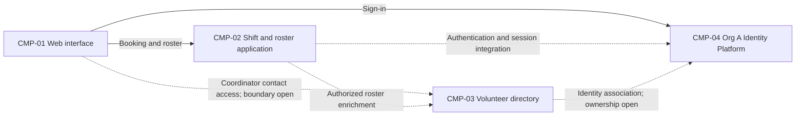

# ARCH-001 — Volunteer shift sign-up for the Riverside Food Bank architecture

## 1. Context and scope

This draft examines PRD-001 version 1, status approved, owned by Priya Nair. The product lets
roughly 120 volunteers sign in and book warehouse shifts from a mobile browser, and gives the
coordinator a daily roster. Payroll, donations and installed mobile apps are outside this scope.

No inspection scope was named, and no code or configuration was inspected. Contract document
checks found no existing ARCH or ADR files and no local preference file. No implemented behavior
or reusable component is established. The user selected PRD-001 and requested proceeding without
questions. A new description is proposed because no ARCH covers this system; the create outcome
was not explicitly confirmed and remains null. Only the mandated platform resolves a decision.

## 2. Quality drivers

PRD-001#NFR-001 requires administrator revocation of volunteer sessions to take effect within five
minutes; ARCH-001#DEC-02 addresses enforcement across sign-in and protected booking operations.
PRD-001#NFR-002 restricts phone visibility to the coordinator; ARCH-001#DEC-05 and ARCH-001#DEC-06
address contact ownership and authorization. PRD-001#NFR-003 requires hosted services across the
whole product; ARCH-001#DEC-08 therefore cites every active functional and non-functional requirement.

The operating context is internal, as recorded by the PRD; its Pilot release label does not change
that context. The required floor is constraint, security and privacy. POL-001#SET-02 additionally
requires compliance and accessibility. The PRD covers the floor but has no NFR for either added
category. Their measurable targets remain product questions for Priya Nair, not invented architecture
decisions. Mobile-first web use is a stated experience requirement, not an accessibility acceptance target.

## 3. Components

The diagram is a proposed logical shape. Product boundaries, data ownership and interactions remain
subject to ARCH-001#DEC-03 through ARCH-001#DEC-07; arrows describe intended responsibilities and do
not select protocols, service splits or accepted interfaces. Identity is mandated; no application-session
revocation mechanism is implied by OIDC.



```yaml items
components:
  - id: CMP-01
    status: active
    name: "Volunteer and coordinator web interface"
    responsibility: "Proposed browser interface for sign-in, shift booking and coordinator roster viewing; it is not the authoritative store or authorization boundary."
    owns_data: []
    interacts_with:
      - "CMP-02"
      - "CMP-03"
      - "CMP-04"
    deployment: "Open: see DEC-08"
    upstream:
      - {id: PRD-001, item: NFR-001, relation: informed_by, version: 1, hash: null}
      - {id: PRD-001, item: NFR-002, relation: informed_by, version: 1, hash: null}
      - {id: PRD-001, item: NFR-003, relation: informed_by, version: 1, hash: null}
  - id: CMP-02
    status: active
    name: "Shift and roster application"
    responsibility: "Proposed application boundary for shift availability, booking and roster views; it does not own credentials or volunteer phone records. Boundary and session enforcement remain open."
    owns_data:
      - "Proposed: shift definitions and bookings, pending ARCH-001#DEC-04"
    interacts_with:
      - "CMP-01"
      - "CMP-03"
      - "CMP-04"
    deployment: "Open: see DEC-08"
    upstream:
      - {id: PRD-001, item: NFR-001, relation: informed_by, version: 1, hash: null}
      - {id: PRD-001, item: NFR-002, relation: informed_by, version: 1, hash: null}
      - {id: PRD-001, item: NFR-003, relation: informed_by, version: 1, hash: null}
  - id: CMP-03
    status: active
    name: "Volunteer directory"
    responsibility: "Proposed logical boundary for volunteer contact records and access to them; it does not authenticate users or own bookings. It may be a module of the application, pending ARCH-001#DEC-03."
    owns_data:
      - "Proposed: volunteer contact records and their identity association, pending ARCH-001#DEC-05"
    interacts_with:
      - "CMP-01"
      - "CMP-02"
      - "CMP-04"
    deployment: "Open: see DEC-08"
    upstream:
      - {id: PRD-001, item: NFR-002, relation: informed_by, version: 1, hash: null}
      - {id: PRD-001, item: NFR-003, relation: informed_by, version: 1, hash: null}
  - id: CMP-04
    status: active
    name: "Org A Identity Platform (OIDC)"
    responsibility: "Organization-mandated identity and authentication provider; booking and contact ownership belong to the product. Product-session revocation capabilities have not been verified."
    owns_data: []
    interacts_with:
      - "CMP-01"
      - "CMP-02"
      - "CMP-03"
    deployment: "External: Org A Identity Platform (OIDC); integration hosting remains open in ARCH-001#DEC-08"
    upstream:
      - {id: PRD-001, item: NFR-001, relation: informed_by, version: 1, hash: null}
      - {id: PRD-001, item: NFR-003, relation: informed_by, version: 1, hash: null}
      - {id: POL-001, item: SET-01, relation: constrains, version: 3, hash: null}
```

## 4. Architectural questions

```yaml items
decisions:
  - id: DEC-01
    status: active
    question: "Which identity provider handles volunteer sign-in?"
    blocking: true
    state: resolved
    resolved_by: [POL-001#SET-01]
    notes: "Resolved solely by the approved identity and authentication mandate, POL-001#SET-01. This does not determine session revocation or role authorization."
    upstream:
      - {id: PRD-001, item: FR-001, relation: informed_by, version: 1, hash: null}
  - id: DEC-02
    status: active
    question: "How will administrator revocation stop every affected volunteer session within five minutes?"
    blocking: true
    state: open
    resolved_by: []
    notes: "Open. Central session checks versus bounded token lifetime or revocation propagation require a decision and capability evidence. Booking must reject revoked volunteer sessions; the provider mandate alone does not establish this behavior."
    upstream:
      - {id: PRD-001, item: FR-001, relation: informed_by, version: 1, hash: null}
      - {id: PRD-001, item: FR-002, relation: informed_by, version: 1, hash: null}
      - {id: PRD-001, item: NFR-001, relation: informed_by, version: 1, hash: null}
  - id: DEC-03
    status: active
    question: "What shared component boundaries will separate the web interface, booking and roster logic, directory, and authentication integration?"
    blocking: true
    state: open
    resolved_by: []
    notes: "Open. The diagram proposes logical responsibilities, not accepted service boundaries. One hosted application with internal modules reduces operational work; independently deployed services add isolation and interface coordination. Neither option is accepted."
    upstream:
      - {id: PRD-001, item: FR-001, relation: informed_by, version: 1, hash: null}
      - {id: PRD-001, item: FR-002, relation: informed_by, version: 1, hash: null}
      - {id: PRD-001, item: FR-003, relation: informed_by, version: 1, hash: null}
      - {id: PRD-001, item: NFR-001, relation: informed_by, version: 1, hash: null}
      - {id: PRD-001, item: NFR-002, relation: informed_by, version: 1, hash: null}
      - {id: PRD-001, item: NFR-003, relation: informed_by, version: 1, hash: null}
  - id: DEC-04
    status: active
    question: "Which component is the authoritative owner of shifts and bookings?"
    blocking: true
    state: open
    resolved_by: []
    notes: "Open. Application-owned transactional storage versus an external managed scheduling system affects availability and roster truth. No existing implementation or reusable service was inspected."
    upstream:
      - {id: PRD-001, item: FR-002, relation: informed_by, version: 1, hash: null}
      - {id: PRD-001, item: FR-003, relation: informed_by, version: 1, hash: null}
  - id: DEC-05
    status: active
    question: "Which component is the authoritative owner of volunteer contact records and their identity association?"
    blocking: true
    state: open
    resolved_by: []
    notes: "Open. A product directory versus an organization-managed directory changes access controls and data duplication. The proposed directory component is not an accepted ownership decision."
    upstream:
      - {id: PRD-001, item: FR-003, relation: informed_by, version: 1, hash: null}
      - {id: PRD-001, item: NFR-002, relation: informed_by, version: 1, hash: null}
  - id: DEC-06
    status: active
    question: "Where will coordinator-only authorization for volunteer phone numbers be enforced?"
    blocking: true
    state: open
    resolved_by: []
    notes: "Open. Establish the trusted source of coordinator permissions and an enforcement boundary covering roster reads and directory access. Server-side filtering and protected directory access must prevent disclosure to other users; hiding a field in the browser is insufficient."
    upstream:
      - {id: PRD-001, item: FR-003, relation: informed_by, version: 1, hash: null}
      - {id: PRD-001, item: NFR-002, relation: informed_by, version: 1, hash: null}
  - id: DEC-07
    status: active
    question: "How will accepted bookings become visible in the coordinator roster?"
    blocking: true
    state: open
    resolved_by: []
    notes: "Open. A roster reading the booking source directly avoids a separate projection; event-driven updates separate responsibilities but introduce lag and delivery handling. No interface or consistency approach is selected; exact refresh expectations remain a product clarification."
    upstream:
      - {id: PRD-001, item: FR-002, relation: informed_by, version: 1, hash: null}
      - {id: PRD-001, item: FR-003, relation: informed_by, version: 1, hash: null}
  - id: DEC-08
    status: active
    question: "Which hosted deployment topology will run the product?"
    blocking: true
    state: open
    resolved_by: []
    notes: "Open. Managed application hosting with managed persistence versus managed functions and hosted data services require an explicit choice. No on-site server is allowed by PRD-001#NFR-003. Identity hosting alone does not answer product deployment, environments, or session and privacy enforcement across deployment units."
    upstream:
      - {id: PRD-001, item: FR-001, relation: informed_by, version: 1, hash: null}
      - {id: PRD-001, item: FR-002, relation: informed_by, version: 1, hash: null}
      - {id: PRD-001, item: FR-003, relation: informed_by, version: 1, hash: null}
      - {id: PRD-001, item: NFR-001, relation: informed_by, version: 1, hash: null}
      - {id: PRD-001, item: NFR-002, relation: informed_by, version: 1, hash: null}
      - {id: PRD-001, item: NFR-003, relation: informed_by, version: 1, hash: null}
```

## 5. Evidence inspected

```yaml items
evidence:
  - id: EVD-01
    status: active
    source: "PRD-001"
    kind: prd
    finding: "Version 1, status approved: internal mobile web product for volunteer sign-in, shift booking and coordinator rosters; five-minute session revocation, coordinator-only phone visibility, and hosted services are required. The identity-provider question is marked NEEDS ADR."
    classification: context
  - id: EVD-02
    status: active
    source: "POL-001#SET-01"
    kind: policy
    finding: "Version 3, status approved; setting active: mandates Org A Identity Platform (OIDC) for identity and authentication, with no permitted override. Its source names ADR-104 in the organization architecture repository; that external ADR was not read."
    classification: policy
  - id: EVD-03
    status: active
    source: "POL-001#SET-02"
    kind: policy
    finding: "Version 3, status approved; setting active: adds compliance and accessibility to the required categories for internal, pilot and production contexts. It applies to this internal PRD."
    classification: policy
```

## 6. Deployment

The product must run on hosted services under PRD-001#NFR-003. The mandated external identity
platform is the only named platform. Application hosting, persistence hosting, deployment units and
environments remain open in ARCH-001#DEC-08. Logical components in the diagram do not imply separate
processes. No cloud vendor, database technology, event broker or runtime is selected by this draft.
No deployment configuration, provider capability documentation or organization ADR-104 was inspected.

## 7. Requirement changes proposed to the PRD owner

- Priya Nair: add measurable compliance NFR coverage to PRD-001. No existing requirement covers the category required by POL-001#SET-02; define applicable obligations and acceptance evidence without assuming a specific certification target.
- Priya Nair: add measurable accessibility NFR coverage to PRD-001. Mobile-first pages do not cover the category required by POL-001#SET-02; define the target standard and verification scope. No new requirement ID is assigned here.

## 8. Open questions

- [NEEDS CLARIFICATION: No inspection scope was named and no code was inspected; existing services, deployment capabilities and reuse suitability are unknown.]
- [NEEDS CLARIFICATION: Org A Identity Platform session revocation capabilities and integration guarantees were not supplied; ARCH-001#DEC-02 remains open.]
- [NEEDS CLARIFICATION: Priya Nair must define the missing compliance and accessibility quality targets required by POL-001#SET-02.]
- [NEEDS CLARIFICATION: PRD-001#FR-003 provides a daily roster but no measurable freshness target for the live roster; Priya Nair owns this clarification, which informs ARCH-001#DEC-07.]
- [NEEDS CLARIFICATION: The proposed create outcome for ARCH-001 is unconfirmed; proceeding without questions does not confirm it.]
- [NEEDS CLARIFICATION: host model/session identity unavailable]

## Change Log

| Version | Date | Author | Change | Items affected |
|---|---|---|---|---|
| 1 | 2026-09-28 | codex (session unknown) | Initial draft for PRD-001 v1. Policy resolution: interview.max_calls=8 (default); architecture.mandated_platforms=Org A Identity Platform (OIDC) for identity and authentication (POL-001#SET-01); quality.required_categories=+compliance,+accessibility (POL-001#SET-02) | all |
| 1 | 2026-09-28 | codex (session unknown) | Validation failed: self-check 3 cannot verify unavailable host model/session identity. Retained draft with empty approval fields; no prior approvals or ADR resolutions required restoration. Structural and traceability checks pass; readiness handoff withheld. Policy resolution: interview.max_calls=8 (default); architecture.mandated_platforms=Org A Identity Platform (OIDC) for identity and authentication (POL-001#SET-01); quality.required_categories=+compliance,+accessibility (POL-001#SET-02) | generated_by; validation |
