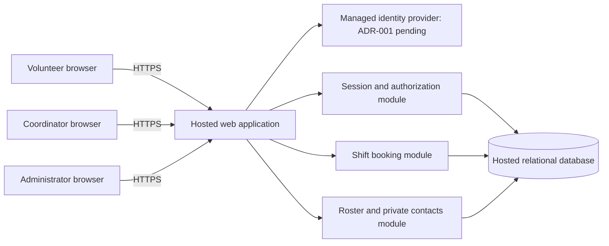

# ARC-001 — Volunteer shift sign-up architecture and epic readiness

## 1. Scope and evidence

This architecture covers all three functional and all three non-functional requirements in
[PRD-001 v1](../prd/PRD-001.md), for the Tuesday/Thursday pilot and subsequent expansion.
It defines a design for about 120 volunteers and one coordinator. It does not create epics,
change the approved PRD, or claim that the design has passed runtime acceptance tests.

[POL-001 v1](../policy/POL-001.md) applies. It mandates no identity platform. Its interview
default is five calls; the user's instruction to proceed without questions governs this task,
so no interview was conducted. The PRD's historical reference to an eight-call default does
not override the current policy. No other repository instructions, code, test commands, or
quality gates were present. Referenced BRN-001 was not supplied; this design relies on the
approved PRD rather than assuming additional requirements from that document.

Identity-provider selection remains open in [ADR-001](../adr/ADR-001.md). That decision blocks
FR-001's final epic definition, but does not prevent defining booking and roster epics against
the identity contract below. These are architectural readiness judgments, not stakeholder approval.

## 2. Deployment and component boundaries

Use one hosted web application with internal modules and one hosted transactional relational
database. Serve mobile-first pages over HTTPS. Keep deployment and operations small; separate
services, a message broker, and an installed mobile app are unnecessary for this scope.
Hosting provider, language, and framework remain implementation choices subject to the
capabilities specified here; no vendor capability is assumed or certified by this document.

| Boundary | Responsibility | Access rule |
|---|---|---|
| Browser / application | Render availability, booking results, and the coordinator roster | Browser input is untrusted; every protected request is authorized on the server |
| Identity adapter / provider | Validate completed sign-in and map a stable external identity to a local volunteer | Provider assertions terminate at the server; never infer roles from a browser field |
| Session / authorization | Issue, validate, expire, and revoke application sessions; resolve roles | All protected endpoints use this shared module |
| Booking / database | Read shifts and atomically reserve capacity | Volunteer ID comes from the session, never from a submitted booking owner |
| Roster / private contacts | Read a selected day's bookings; add phone numbers only for the coordinator | Explicit response field allowlists and server-side role checks |
| Hosted operations | Deploy application, database, secrets, logs, and backups | No on-site server dependency; managed access with least privilege |

The administrator and coordinator are distinct roles, even if one person eventually holds both.
An administrator role alone grants session-revocation authority, not phone-number access.
Provision roles through a restricted operational process; public sign-up cannot assign privileges.

## 3. Data and application contracts

| Record | Minimum fields and constraints |
|---|---|
| Volunteer | Internal ID, external issuer and subject (unique together), display name, current authorization epoch, roles |
| PrivateContact | Volunteer ID (unique foreign key), nullable phone number; kept out of general volunteer queries and serialization |
| Session | Hash of an opaque random token, volunteer ID, epoch at issuance, expiry, revocation state |
| Shift | ID, start/end timestamps, capacity greater than zero, publication state |
| Booking | ID, shift ID, volunteer ID, booking timestamp; unique `(shift_id, volunteer_id)` |
| SecurityAudit | Timestamp, actor ID, affected internal ID, action, outcome; no session tokens or phone values |

Store shift timestamps with timezone information; configure a single food-bank timezone for day
boundaries and display. The deployment timezone must be explicitly set before pilot data is loaded.
Do not infer it from an operator's machine or the author's environment.

Suggested endpoint contracts describe behavior, not a prescribed framework:

- `GET /shifts`: signed-in volunteer receives published future shifts and remaining capacity;
  no other volunteers' identities or phone numbers.
- `POST /shifts/{id}/bookings`: signed-in volunteer books for themselves; returns their booking,
  including on a duplicate retry; unavailable capacity or a closed shift returns a conflict.
- `GET /coordinator/roster?date=YYYY-MM-DD`: coordinator receives that local day's shifts,
  booked volunteer names, and available phone numbers. Other roles receive a denial.
- `POST /admin/volunteers/{id}/revoke-sessions`: administrator revokes all existing application
  sessions for that volunteer, with an audit event and success only after the database commit.
- Sign-in/callback/logout endpoints: provider-specific details are deferred to ADR-001; successful
  sign-in establishes the application session described below, and logout revokes that session.

Booking locks the shift row in a transaction, checks publication, start time, existing booking,
and capacity, then inserts before committing. All booking writers use the same locking rule.
The uniqueness constraint prevents duplicate reservations; serialization on the shift prevents
two volunteers taking the final place. A network retry returns the already committed booking.
The server supplies the clock and volunteer identity. Failed transactions consume no capacity.
Roster reads committed bookings from the same database, avoiding a delayed copy.

## 4. Security and privacy mechanisms

### NFR-001: administrator revocation within five minutes

The application owns its sessions independently of the eventual identity provider. A successful
identity exchange maps to the stable local volunteer ID and creates a server-side session.
Send only an opaque token in a Secure, HttpOnly, SameSite cookie; protect state-changing
requests against CSRF. Never accept a provider token as a substitute for application authorization.

Every protected request reads authoritative session and volunteer state. It rejects an expired or
revoked session or one whose epoch differs from the volunteer's current epoch. Revocation increments
that epoch in a database transaction, invalidating sessions on every application instance.
Use no positive authorization cache or lagging read replica. If session state cannot be read,
fail closed. This design targets rejection on the first request after revocation commits, stricter
than the PRD's five-minute limit. It is a design claim until verified in deployment.

Serialize session issuance and revocation on the volunteer record. Serialize protected booking
mutations with that record as well, validating the session inside the write transaction before
locking the shift. Keep a consistent lock order (volunteer, then shift). This prevents a write
authorized earlier from committing after a completed revocation. Bound request/transaction
durations; do not introduce long-lived authenticated streams without revalidation.

Revocation invalidates existing sessions; it does not disable the account or forbid a new sign-in.
That distinction follows the PRD's wording. If account suspension is desired, it needs a separate
product requirement. The administrator UI reports failure when revocation cannot commit.

### NFR-002: phone numbers visible only to the coordinator

Treat the requirement literally: volunteers cannot retrieve even their own stored phone number
through this product; administrators without the coordinator role cannot retrieve any phone number.
Only the authorized coordinator response may include that field. Use a separate contact query
after the coordinator check; avoid fetching and then hiding phone numbers in volunteer pages.

Enforce this across API responses, HTML, errors, logs, audit events, tracing, and analytics.
Mark authenticated responses `Cache-Control: no-store`; disable shared caching of those routes.
Do not put roster responses in browser persistent storage or an offline service worker. Encrypt
database connections, storage, and backups; restrict operational credentials and secret access.
Infrastructure encryption does not replace application field authorization. No role can erase
information already seen by a formerly authorized coordinator; future requests must recheck roles.

Phone collection/editing workflows, exports, and retention periods are not specified by the PRD.
They are not silently added as features. Before real data is imported, assign an operational owner
and retention/deletion policy; missing phone numbers must not prevent booking or roster display.

### NFR-003: hosted services across the whole product

Host the frontend/application, identity dependency, database, secrets, logs, and backups externally.
Production must not depend on an office computer. Use separate development/test and production
configuration, restricted database connectivity, encrypted backups, and a documented restore process.
Any selected host must support shared authoritative session reads and transactional row locking.
An inability to meet either capability requires revisiting this architecture before implementation.

## 5. Assumptions and bounded unresolved details

These are proposed design defaults, not additions to approved acceptance criteria. Epic authors
must carry them explicitly and reconcile changes before writing affected stories.

| ID | Default or gap | Impact and closure |
|---|---|---|
| A-01 | An open shift is published, in the future, and below capacity; one booking per volunteer per shift | Proposed FR-002 interpretation. Confirm in the booking epic; cancellation, waitlists, and overlapping-shift rules remain outside this design |
| A-02 | Coordinator supplies initial volunteers, shift times, capacities, and pilot dates through a restricted load process | Product has no shift-management requirement. Specify input validation and ownership in the booking epic; no new management UI implied |
| A-03 | The food-bank timezone and the definition of a shift's day use its local start date | Roster epic must make configuration explicit, including overnight and daylight-saving cases |
| A-04 | While open, the coordinator page refreshes from the server every 30 seconds and offers manual refresh | Proposed interpretation of “live roster,” not a PRD latency guarantee. Show last successful refresh and a visible stale/error state; confirm the target in the roster epic |
| A-05 | Existing identity accounts, usable sign-in channels, enrollment/recovery needs, operating budget, and identity administrator are unknown | Material to provider selection; ADR-001 blocks FR-001 epic readiness. No email or SMS access is assumed |
| A-06 | Administrator privileges are provisioned through a restricted process | A distinct admin actor is required by NFR-001 even though the PRD personas list only volunteers and coordinator; name the operator before pilot launch |
| A-07 | PRD-001 ASM-01 (smartphone access) remains open | Business validation belongs to the PRD owner; no architectural claim that it has been validated |

The identity decision affects the sign-in experience and integration but leaves the internal
`authenticated volunteer ID + current roles + revocable application session` contract stable.
If a selected identity system cannot satisfy that boundary, reopen readiness for dependent epics.

## 6. Requirement-to-architecture and epic readiness

**READY** means there is enough architecture to decompose the requirement into an epic, carrying
the named defaults and verification obligations. It does not mean implementation is finished or
that dependent work can ship. **BLOCKED** means a material architecture decision must be resolved
before the affected epic is finalized. NFRs attach to functional epics rather than becoming
isolated features with no enforcement at their consumers.

| Requirement | Architecture allocation | Epic readiness | Required evidence in later implementation |
|---|---|---|---|
| FR-001 — volunteer sign-in | Identity adapter and session module | **BLOCKED** by ADR-001; discovery/decision work can proceed | Selected-provider sign-in, failure, identity mapping, session issuance, logout, and recovery tests as applicable |
| FR-002 — book an open shift | Shift/booking module, transactional database, session authorization | **READY** for decomposition with A-01/A-02; integrated delivery depends on FR-001 | Signed-out denial; own-account booking only; unavailable shift rejection; concurrent final-slot and duplicate-retry tests |
| FR-003 — coordinator daily roster | Roster/private-contact module and same database | **READY** for decomposition with A-03/A-04; integrated delivery depends on FR-001 | Correct local-day roster, committed booking visibility, refresh/error state, coordinator-only access |
| NFR-001 — revoke signed-in sessions within 5 minutes | Shared session module and administrator action | **READY** as a cross-cutting constraint on FR-001/002/003; provider integration awaits ADR-001 | Revoke across multiple sessions and app instances; old cookies and replayed session tokens fail within 300 seconds; database outage fails closed |
| NFR-002 — phone numbers only for coordinator | Restricted contact query and response allowlists; log/cache controls | **READY** as a cross-cutting constraint on FR-001/002/003 | Volunteer, anonymous, and admin-only negative tests; coordinator positive test; role-change, API/HTML/log/cache leak checks |
| NFR-003 — whole product hosted | Entire deployment boundary, including identity, persistence, and operations | **READY** as a product-wide constraint on every epic | Hosted deployment and configuration inspection, cross-instance session check, and booking/roster smoke test without on-site infrastructure |

NFR-001 applies to all authenticated endpoints, including roster reads and administrator actions,
not only sign-in. NFR-002 constrains identity integration too: do not emit phone claims into
volunteer-visible tokens or provider profile pages exposed through this product. Provider selection
must verify this or avoid sending the phone field to that provider. NFR-003 has global scope.

Suggested decomposition, without allocating or creating epic IDs:

1. **Volunteer access and session control** — FR-001, NFR-001, and relevant NFR-002/003 controls.
   Finalization blocked by ADR-001; includes the administrator revocation surface.
2. **Shift availability and booking** — FR-002, all three NFRs, validated pilot data loading, and
   atomic capacity enforcement. Ready to draft; use the identity contract for isolated tests.
3. **Coordinator daily roster** — FR-003, all three NFRs, private contact handling, and refresh
   behavior. Ready to draft; record its lower `should` priority without dropping mandatory privacy.

The latter two epics can be planned now; production acceptance of either requires working identity
and shared security controls. Hosted foundation work supports all three. This is a dependency graph,
not a requirement to launch incomplete booking or roster functionality.

## 7. Verification and rollout obligations

There is no executable product in this repository. The following are future acceptance evidence,
not claimed test results. When implementation begins, establish meaningful failing tests before
adding behavior, and use the implementation repository's eventual test commands and quality gates.

| Evidence ID | Requirements | Acceptance scenario |
|---|---|---|
| V-01 | FR-001 | Real selected-provider sign-in yields the correct stable local identity; malformed/failed identity exchanges create no session; client-supplied roles cannot elevate access |
| V-02 | FR-002, NFR-001 | Unauthenticated/revoked callers cannot book; two different volunteers race for one place with exactly one success; retries never create a second booking |
| V-03 | FR-003 | A committed booking appears on the right local day's roster within the agreed refresh target; empty days and timezone boundaries work; failures show stale state |
| V-04 | NFR-001, FR-001/002/003 | Create multiple sessions across app instances, revoke at recorded commit time, and replay each against all protected endpoint classes. Record the last accepted request and prove none succeeds after 300 seconds. Check immediate rejection, concurrent writes/issuance, and failed revocation transactions |
| V-05 | NFR-002, FR-001/002/003 | Seed a recognizable test phone number. Only the coordinator can retrieve it; inspect volunteer and admin-only payloads, provider output, errors, HTML, logs, and caches for leakage. Remove coordinator role and retest the same session |
| V-06 | NFR-003, all FRs | Inspect actual deployed resources and secrets; exercise login, booking, roster, revocation, and backup restore using hosted services with no office server |

For the pilot, publish only the agreed Tuesday/Thursday shifts and use coordinator shift logs to
measure PRD-001 SM-01 (83% baseline, 95% target). A booking count cannot prove attendance, so do
not replace the coordinator's metric with booking occupancy. Expand the published shift schedule
after pilot review. Operational rollback disables new bookings while preserving committed bookings
and coordinator roster access; the coordinator can resume the existing phone process.

Before launch, close ADR-001, set timezone and seed data, assign administrative/data ownership,
validate the smartphone assumption, and collect V-01 through V-06 evidence. Architecture-only
verification is recorded separately in [VER-001](../verification/VER-001.md).

## Change log

| Version | Date | Author | Change |
|---|---|---|---|
| 1 | 2026-09-28 | Codex | Initial architecture, scoped identity blocker, NFR allocation, and epic readiness assessment; pending review |
