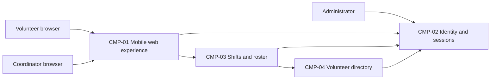

# ARCH-001 — Volunteer shift sign-up for the Riverside Food Bank architecture

## 1. Context and scope

This description examines PRD-001 version 1, status approved, owned by Priya Nair.
The system supports approximately 120 volunteers booking warehouse shifts from mobile
web browsers and one coordinator viewing the daily roster. Sign-in, booking, roster
access, session revocation, and contact-data protection are in scope. Payroll,
donations, and a native mobile application are outside the PRD's scope.

The request explicitly selects PRD-001 and says to proceed without questions.
No inspection scope was named; no application code or configuration was inspected.
No existing ARCH or ADR was found in the contract document directories. Creating a
new architecture description is therefore proposed; the outcome remains unconfirmed.
The components below are a proposed allocation of responsibilities, not accepted
architectural decisions or evidence of an existing implementation.

## 2. Quality drivers

PRD-001#NFR-001 requires administrator revocation of volunteer sessions to take effect
within five minutes. ARCH-001#DEC-02 covers both session creation and enforcement on
authenticated booking requests; selecting a provider alone cannot settle this mechanism.

PRD-001#NFR-002 limits phone-number visibility to the coordinator. Ownership of contact
data and enforcement of access are separate decisions, ARCH-001#DEC-05 and
ARCH-001#DEC-06. Administrator authority to revoke sessions does not imply permission
to view phone numbers.

PRD-001#NFR-003 requires hosted services for the whole product because no on-site
server exists. ARCH-001#DEC-03 therefore affects all functional and non-functional
requirements, including the identity and contact-data capabilities.

The operating context is internal, as explicitly stated in the PRD; the Pilot release
label does not change it. The required quality categories are constraint, security,
and privacy. All are covered by the three NFRs; no required category is missing.
POL-001#SET-01 sets the interview budget to five calls, with zero used under the
request. There is no mandated platform or additional quality-category setting.

## 3. Components

The diagram shows proposed logical components and interactions. It does not commit
to separate services, storage products, or deployment units. ARCH-001#DEC-04 governs
these boundaries; ARCH-001#DEC-05 and ARCH-001#DEC-07 govern the proposed data owners.



```yaml items
components:
  - id: CMP-01
    status: active
    name: "Mobile web experience"
    responsibility: "Proposed browser interface for sign-in, booking and coordinator roster viewing; does not own authoritative records or enforce access by itself."
    owns_data: []
    interacts_with:
      - "CMP-02"
      - "CMP-03"
    deployment: "Open: see DEC-03"
    upstream:
      - {id: PRD-001, item: NFR-001, relation: informed_by, version: 1, hash: null}
      - {id: PRD-001, item: NFR-002, relation: informed_by, version: 1, hash: null}
      - {id: PRD-001, item: NFR-003, relation: informed_by, version: 1, hash: null}
  - id: CMP-02
    status: active
    name: "Identity and sessions"
    responsibility: "Proposed authentication and session-validation capability with administrator revocation; does not own shift bookings or volunteer phone numbers. Provider and revocation mechanism remain open."
    owns_data:
      - "Proposed identity and session lifecycle records, subject to DEC-01, DEC-02 and DEC-04"
    interacts_with:
      - "CMP-01"
      - "CMP-03"
      - "CMP-04"
    deployment: "Open: see DEC-03"
    upstream:
      - {id: PRD-001, item: NFR-001, relation: informed_by, version: 1, hash: null}
      - {id: PRD-001, item: NFR-002, relation: informed_by, version: 1, hash: null}
      - {id: PRD-001, item: NFR-003, relation: informed_by, version: 1, hash: null}
  - id: CMP-03
    status: active
    name: "Shifts and roster"
    responsibility: "Proposed capability for booking open shifts and supplying the daily roster from authoritative bookings; does not own credentials or grant unrestricted contact-data access."
    owns_data:
      - "Proposed shift availability and booking records, subject to DEC-07"
    interacts_with:
      - "CMP-01"
      - "CMP-02"
      - "CMP-04"
    deployment: "Open: see DEC-03"
    upstream:
      - {id: PRD-001, item: NFR-001, relation: informed_by, version: 1, hash: null}
      - {id: PRD-001, item: NFR-002, relation: informed_by, version: 1, hash: null}
      - {id: PRD-001, item: NFR-003, relation: informed_by, version: 1, hash: null}
  - id: CMP-04
    status: active
    name: "Volunteer directory"
    responsibility: "Proposed owner of volunteer contact records and their authorized retrieval; does not own authentication sessions or shift bookings."
    owns_data:
      - "Proposed volunteer profiles and phone numbers, subject to DEC-05"
    interacts_with:
      - "CMP-02"
      - "CMP-03"
    deployment: "Open: see DEC-03"
    upstream:
      - {id: PRD-001, item: NFR-002, relation: informed_by, version: 1, hash: null}
      - {id: PRD-001, item: NFR-003, relation: informed_by, version: 1, hash: null}
```

## 4. Architectural questions

Every question remains blocking and open: no platform is mandated, no decision was
explicitly accepted, and the request excludes decision questions. Notes describe
unselected alternatives for later review, not decisions.

```yaml items
decisions:
  - id: DEC-01
    status: active
    question: "Which identity provider handles volunteer sign-in?"
    blocking: true
    state: open
    resolved_by: []
    notes: "Captures the PRD's NEEDS ADR marker. A managed identity service reduces credential operations; application-owned authentication offers control but adds security maintenance. Selection must support authenticated booking and the revocation requirement; it does not resolve DEC-02."
    upstream:
      - {id: PRD-001, item: FR-001, relation: informed_by, version: 1, hash: null}
      - {id: PRD-001, item: FR-002, relation: informed_by, version: 1, hash: null}
      - {id: PRD-001, item: NFR-001, relation: informed_by, version: 1, hash: null}
  - id: DEC-02
    status: active
    question: "How will administrator revocation stop volunteer sessions working within five minutes?"
    blocking: true
    state: open
    resolved_by: []
    notes: "Central session checks allow prompt invalidation but require an available session authority; bounded token lifetimes require refresh denial and a complete timing bound. All authenticated booking paths must reject revoked sessions within the limit, including any caches."
    upstream:
      - {id: PRD-001, item: FR-001, relation: informed_by, version: 1, hash: null}
      - {id: PRD-001, item: FR-002, relation: informed_by, version: 1, hash: null}
      - {id: PRD-001, item: NFR-001, relation: informed_by, version: 1, hash: null}
  - id: DEC-03
    status: active
    question: "Which hosted deployment topology will run the whole product?"
    blocking: true
    state: open
    resolved_by: []
    notes: "Hosted operation is required, but no host, deployment units or environments have been selected. A consolidated managed application simplifies operation; separately hosted capabilities provide independent scaling with more integration and operational work. This whole-product constraint governs every active requirement."
    upstream:
      - {id: PRD-001, item: FR-001, relation: informed_by, version: 1, hash: null}
      - {id: PRD-001, item: FR-002, relation: informed_by, version: 1, hash: null}
      - {id: PRD-001, item: FR-003, relation: informed_by, version: 1, hash: null}
      - {id: PRD-001, item: NFR-001, relation: informed_by, version: 1, hash: null}
      - {id: PRD-001, item: NFR-002, relation: informed_by, version: 1, hash: null}
      - {id: PRD-001, item: NFR-003, relation: informed_by, version: 1, hash: null}
  - id: DEC-04
    status: active
    question: "What responsibility boundaries will separate the web experience, identity, shifts and volunteer directory?"
    blocking: true
    state: open
    resolved_by: []
    notes: "The CMP items propose logical boundaries only. Modules within an application simplify shared enforcement and transactions; service boundaries permit independent ownership but add network contracts and distributed enforcement. The allocation must consistently support sign-in, booking, roster access, revocation and contact privacy."
    upstream:
      - {id: PRD-001, item: FR-001, relation: informed_by, version: 1, hash: null}
      - {id: PRD-001, item: FR-002, relation: informed_by, version: 1, hash: null}
      - {id: PRD-001, item: FR-003, relation: informed_by, version: 1, hash: null}
      - {id: PRD-001, item: NFR-001, relation: informed_by, version: 1, hash: null}
      - {id: PRD-001, item: NFR-002, relation: informed_by, version: 1, hash: null}
  - id: DEC-05
    status: active
    question: "Which component will own volunteer profile and contact data used by the coordinator?"
    blocking: true
    state: open
    resolved_by: []
    notes: "A dedicated directory makes ownership explicit but requires roster integration; ownership within the shift capability simplifies retrieval but couples contact-data and booking changes. CMP-04 is a proposal. This choice does not decide who may read phone numbers."
    upstream:
      - {id: PRD-001, item: FR-003, relation: informed_by, version: 1, hash: null}
      - {id: PRD-001, item: NFR-002, relation: informed_by, version: 1, hash: null}
  - id: DEC-06
    status: active
    question: "Where will coordinator-only phone-number access be enforced across application and data access paths?"
    blocking: true
    state: open
    resolved_by: []
    notes: "Server-mediated authorization centralizes role checks but requires all access to pass through it; data-layer policies protect direct reads but require reliable role propagation. Volunteer booking responses and coordinator roster access must preserve the same privacy boundary. Administrator revocation privileges do not grant contact visibility."
    upstream:
      - {id: PRD-001, item: FR-002, relation: informed_by, version: 1, hash: null}
      - {id: PRD-001, item: FR-003, relation: informed_by, version: 1, hash: null}
      - {id: PRD-001, item: NFR-002, relation: informed_by, version: 1, hash: null}
  - id: DEC-07
    status: active
    question: "Which component will own authoritative shift availability and booking state?"
    blocking: true
    state: open
    resolved_by: []
    notes: "A single owner for shifts and bookings simplifies agreement between booking and roster; separate owners require an explicit consistency contract. CMP-03 proposes one owner without deciding a storage engine or schema."
    upstream:
      - {id: PRD-001, item: FR-002, relation: informed_by, version: 1, hash: null}
      - {id: PRD-001, item: FR-003, relation: informed_by, version: 1, hash: null}
  - id: DEC-08
    status: active
    question: "How will committed bookings reach the coordinator's roster view?"
    blocking: true
    state: open
    resolved_by: []
    notes: "Reading authoritative bookings directly simplifies consistency; an event-fed roster projection supports independent reads but adds delivery and reconciliation work. The PRD describes a live roster without a measurable freshness target; that product clarification belongs to Priya Nair."
    upstream:
      - {id: PRD-001, item: FR-002, relation: informed_by, version: 1, hash: null}
      - {id: PRD-001, item: FR-003, relation: informed_by, version: 1, hash: null}
```

## 5. Evidence inspected

```yaml items
evidence:
  - id: EVD-01
    status: active
    source: "PRD-001"
    kind: prd
    finding: "Version 1, status approved: requires volunteer sign-in, authenticated shift booking and a coordinator roster; requires five-minute session revocation, coordinator-only phone visibility and hosted services for the whole product. Includes an identity-provider NEEDS ADR marker and specifies internal operating context."
    classification: context
  - id: EVD-02
    status: active
    source: "POL-001#SET-01"
    kind: policy
    finding: "Version 1, status approved: active interview.max_calls setting is 5, overridable by project and local interaction preferences. No project override or local preference was found."
    classification: policy
```

## 6. Deployment

PRD-001#NFR-003 rules out dependence on an on-site server. All proposed server-side
capabilities and persistent data need hosted services; browser clients remain on user
devices. ARCH-001#DEC-03 leaves the host, deployment units, and environments open.
The diagram specifies no deployment separation. Identity-provider hosting also
depends on ARCH-001#DEC-01; no existing infrastructure was inspected or assumed.

## 7. Requirement changes proposed to the PRD owner

- None.

## 8. Open questions

- [NEEDS CLARIFICATION: No inspection scope was named and no application code or configuration was inspected; existing implementation, infrastructure and component reuse suitability are unknown.]
- [NEEDS CLARIFICATION: Priya Nair owns clarification of the live-roster freshness target for PRD-001#FR-003; no timing threshold has been invented.]
- [NEEDS CLARIFICATION: The proposed create outcome has not been confirmed; outcome remains null under the request to proceed without questions.]
- [NEEDS CLARIFICATION: host model/session identity unavailable]

The host supplied the session ID recorded above but did not expose an exact model
ID. The model is recorded as unknown; provenance validation remains unresolved.

## Change Log

| Version | Date | Author | Change | Items affected |
|---|---|---|---|---|
| 1 | 2026-09-28 | codex (session 01a0e9f3-45eb-7980-92e8-3771381ef9b2) | Initial draft for PRD-001 v1. Policy resolution: interview.max_calls=5 (POL-001#SET-01); architecture.mandated_platforms=none (default); quality.required_categories=floor only (default) | all |
| 1 | 2026-09-28 | codex (session 01a0e9f3-45eb-7980-92e8-3771381ef9b2) | Validation unresolved (ERR-05): exact host model identity unavailable. Kept draft with empty approval fields and all decisions open; no ADR or prior approval required restoration. Readiness handoff withheld. Policy resolution: interview.max_calls=5 (POL-001#SET-01); architecture.mandated_platforms=none (default); quality.required_categories=floor only (default) | generated_by; validation |
