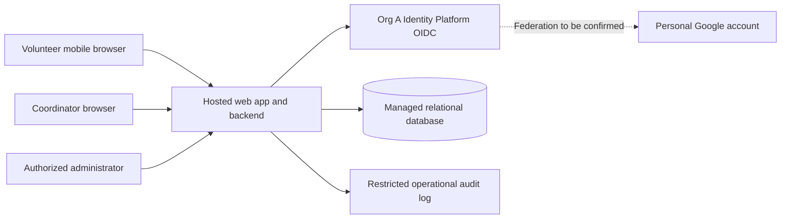

# ARCH-001 — PRD-001 architecture and epic readiness

## 1. Outcome and scope

The proposed pilot uses a hosted mobile web application, one application backend,
and a managed relational database. Sign-in must use Org A Identity Platform
(OIDC). Personal Google accounts must remain supported; federation through that
platform is an unverified integration dependency, not an accepted capability.

No requirement is unconditionally ready for implementation epics: the required
compliance and accessibility categories have no acceptance criteria. Booking,
roster, privacy, and hosting have sufficient architectural direction for epic
drafting, with the gates below carried forward explicitly. Authentication and
revocation need platform evidence before their design can be finalized.

This document defines architecture, proposed verification, and readiness. It does
not approve new product requirements, create epics, or certify implemented behavior.
The approved PRD and policy remain unchanged. Payroll and donations remain out of
scope. Cancellation, waitlists, notifications, and self-service shift administration
are not added to the pilot.

## 2. Basis and work plan

Sources: [PRD-001 v1](../prd/PRD-001.md) and
[POL-001 v3](../policy/POL-001.md). The workspace contains no application code,
repository instructions, architecture templates, or test commands. BRN-001 and the
organization's ADR-104 are referenced by these sources but are not supplied.

Work plan:

1. Resolve applicable policy and identify conflicts before choosing components.
2. Record identity and hosting decisions, system boundaries, and data flows.
3. Map every active requirement to design, verification, and epic gates; validate
   the resulting documents against the supplied sources.

### Effective policy

| Setting | Effective value and source | Effect |
|---|---|---|
| `architecture.mandated_platforms` | Org A Identity Platform (OIDC), POL-001#SET-01; no product override | Constrains FR-001 and NFR-004; use the organization platform, not direct product-to-Google authentication. |
| `quality.required_categories` | compliance, accessibility, POL-001#SET-02; applies to PRD's `internal` context; no product override | Both categories must receive measurable requirements and acceptance evidence across the product. |

The PRD creation log's `mandated_platforms=none` and `floor only` are historical
default resolutions, not current permission to bypass POL-001. Existing security
and privacy requirements still apply. A personal Google account describes the
volunteer's upstream credential; the mandated platform describes the application's
identity authority. These constraints can coexist only if the platform supports
the required federation. No waiver or platform capability is presumed.

## 3. Proposed structure

The browser is untrusted. Only the backend accesses the database, resolves roles,
authorizes requests, and returns permitted fields. Org A owns authentication;
the application owns booking, roster authorization, and application session
enforcement consistent with the platform contract. Coordinator and administrator
are separate privileges: being an administrator does not grant access to phone
numbers. Provisioning and role assignment need an agreed operational owner (G-04).

Use one deployable backend with identity/session, booking, and roster modules.
This is proportionate to approximately 120 volunteers and three daily shifts;
separate services and a message broker are unnecessary for the stated pilot.
The hosted provider and implementation language are left open because no supplied
policy mandates them. Provider selection must satisfy G-02 and G-03 before build
commitments. See [ADR-002](../adr/ADR-002.md).

### Data ownership

| Record | Minimum design fields and invariants |
|---|---|
| Volunteer | Internal ID; unique trusted `(issuer, subject)` binding; display name; active membership. Do not use email as the stable identity key. |
| Volunteer contact | Volunteer ID and phone number, stored separately from general profile projections; available only through coordinator-authorized queries. Source and retention pending G-02/G-04. |
| Role assignment | Principal ID and explicit role; auditable changes; never trust client-provided roles. |
| Shift | ID, start/end instants, food-bank time zone, capacity, booking state. Definitions and authoritative loading process pending G-04. |
| Booking | Shift ID, volunteer ID, creation time; unique pair prevents duplicate bookings. |
| Application session | Opaque session identifier stored as a hash, principal, expiry, revocation state/generation; no identity tokens exposed to browser scripts. Subject to platform contract G-01. |
| Audit event | Actor ID, action, target ID, result, timestamp; omit tokens and phone numbers; access and retention pending G-02. |

### Sign-in and revocation

Use backend-mediated OIDC authorization-code sign-in with PKCE and validated
issuer, audience, signature, state, nonce, and expiry. Accept only the mandated
issuer. Credentials remain with the identity providers. Application cookies are
Secure, HttpOnly, and SameSite, with CSRF protection on state-changing requests.
These are proposed implementation controls, not evidence that the platform's
integration contract has been verified. See [ADR-001](../adr/ADR-001.md).

On every protected request, check current session and principal revocation state
in the authoritative store; do not authorize solely from a long-lived token.
An authorized administrator's revoke-all action atomically invalidates the
volunteer's existing application sessions, including sessions on other instances.
Serialize concurrent session creation/revocation so an old authentication flow
cannot recreate a revoked session. If revocation state cannot be checked, deny
protected access. Recheck authorization before protected data disclosure or a
booking commit. This design targets immediate rejection after acknowledgment,
which is stronger than the PRD's five-minute maximum.

Acceptance must also cover refresh, restored cookies, silent identity-provider
sign-in, and any platform-side revoke action used by the administrator. Whether
revocation requires fresh authentication, disables membership, or only ends
existing sessions needs explicit agreement under G-01; do not silently expand
NFR-001 into permanent account suspension. Previously displayed data cannot be
retracted, but no new protected response may be authorized by a revoked session
after the deadline. No persistent stream is needed for the proposed roster.

### Booking and roster

The volunteer reads available shifts and submits a shift ID. The backend derives
the volunteer ID from the session, checks eligibility, then locks the shift row
in a database transaction. Within that transaction it verifies that booking is
open, checks capacity, and inserts the booking. A uniqueness constraint makes a
retry return the existing booking. A full or closed shift produces an explicit
unavailable result without a partial write. All booking writers must share this
transaction path. G-04 must settle the meaning of open, capacity values, and
booking cutoff before these become final acceptance criteria.

The coordinator selects a local calendar day. The backend converts its boundaries
using the configured food-bank time zone and returns shifts and booked volunteers
from committed data, including empty rosters. Coordinator-only projections may
include phones; volunteer and administrator-only projections never do. Protect
roster responses from shared caches and exclude personal data from telemetry.
Refresh on page load and explicit refresh is the proposed baseline. The PRD's
summary says "live roster" without a freshness bound; G-05 must settle polling or
other updates before a live-update implementation is committed.

### Hosting and operation

Host the web/backend, database, secrets, and audit storage off site. Separate
pilot/test data from production, use least-privilege service access, encrypted
transport and storage, managed backups, and a demonstrated restore. Confirm
backup retention, recovery objectives, region, service ownership, and incident
handling as part of G-02. No numerical availability or recovery target is invented.
Use structured request IDs and aggregate booking/conflict/error counts without
phone numbers or tokens. Define the administrator's recovery procedure for an
identity outage; do not introduce a fallback password sign-in.

Load the Tuesday/Thursday pilot shifts through an agreed controlled operational
process (G-04), then expand the schedule. SM-01 remains measured by the
coordinator's shift log; bookings alone do not prove volunteers attended or that
the 95% target was reached. Validate ASM-01 before pilot rollout.

## 4. Requirement coverage and epic readiness

**Draftable** means design direction is sufficient to draft an epic with explicit
dependencies. **Blocked** means an affected architecture decision or definition
is unresolved. **Ready** would require all listed gates closed. All requirements
inherit G-02 and G-03; these are product-wide gates, including otherwise draftable
work. Status is architectural readiness, not a passing runtime test.

| Requirement | Design / decision | Epic drafting status | Additional gates | Required acceptance evidence (not yet run) |
|---|---|---|---|---|
| FR-001 | Mandated issuer, hosted OIDC backend; ADR-001 | Blocked | G-01, G-04 | Personal Google account completes platform-mediated login; invalid issuer/token/callback is rejected; unapproved membership cannot access booking. |
| FR-002 | Transactional capacity check and unique booking; ADR-002 | Draftable | G-04; depends on FR-001/G-01 | Signed-in volunteer books an open shift; anonymous/closed/full requests fail; concurrent last-slot requests cannot overbook; retry cannot duplicate. |
| FR-003 | Coordinator-only daily roster projection; ADR-002 | Draftable | G-04, G-05; depends on FR-001/G-01 | Authorized coordinator sees committed bookings for the selected local day, including empty shifts; other roles denied; agreed freshness met. |
| NFR-001 | Shared authoritative session invalidation; ADR-001 | Blocked | G-01, G-04 | Revoke multiple sessions across instances; all reject within 300 seconds, including refresh/replay/concurrent-login paths; unauthorized revocation denied; store failure denies access. |
| NFR-002 | Coordinator role and contact-only projection; ADR-002 | Draftable | G-04; depends on FR-001/G-01 | Coordinator sees phone numbers; anonymous, volunteer (including own number), and administrator-only requests cannot retrieve them through any API/UI/cache/log path. |
| NFR-003 | Hosted application, database, secrets, logs, backups; ADR-002 | Draftable | None beyond G-02/G-03 | Deployment inventory and restore exercise demonstrate operation without an on-site server. |
| NFR-004 | Google upstream of Org A issuer; ADR-001 | Blocked | G-01 | Representative personal Google accounts sign in through the mandated platform; product has no direct-Google bypass. |

NFR-003 constrains the whole product, not just sign-in. NFR-004 constrains sign-in
directly, and booking/roster inherit the resulting authentication dependency.
NFR-001 and NFR-002 are cross-cutting security and privacy obligations; future
epics must cite them alongside their functional requirements.

## 5. Gates and resolution evidence

Owners below are proposed responsibility assignments, not evidence of agreement.
No questions were sent and no external owners were contacted.

| Gate | Finding / affected work | Proposed owner | Evidence to close |
|---|---|---|---|
| G-01 | Org A personal-Google federation and revocation contract unknown. FR-001, NFR-001, NFR-004 blocked; authenticated features depend on them. | Org A identity owner + architecture board | Obtain ADR-104 and integration contract; demonstrate personal-account federation, subject mapping, session creation/refresh/logout/revocation behavior and five-minute bound. If unsupported, obtain an authorized requirement or organizational policy change; a product ADR cannot override SET-01. |
| G-02 | Required compliance category absent from PRD; blocks all implementation epics. | Priya Nair + organizational compliance owner | Approve measurable compliance requirements with IDs and acceptance evidence: applicable controls, audit events/access/retention, contact-data lifecycle, hosted service constraints, backup/recovery and operational ownership. Tie architecture and epics to those IDs. The policy rationale is not itself a complete control specification. |
| G-03 | Required accessibility category absent from PRD; blocks all implementation epics. | Priya Nair + accessibility owner | Approve measurable accessibility requirements with IDs, target standard/version/level, supported interaction modes and manual/automated acceptance checks covering sign-in, booking, and roster. No conformance level has been supplied or assumed approved. |
| G-04 | Membership enrollment, role provisioning, phone-data source, shift loading/capacity/cutoff and food-bank time zone unspecified. | Priya Nair + coordinator + operations owner | Record product/operating decisions and acceptance criteria; assign authority to enroll volunteers, assign coordinator/admin roles and seed shifts. Do not infer the site's time zone from the editor environment. |
| G-05 | "Live" roster freshness unspecified. | Priya Nair + coordinator | Approve observable update latency and interaction behavior; choose refresh/polling accordingly and test it. |

Potential epic boundaries after gates close: hosted foundation (NFR-003), identity
and revocation (FR-001/NFR-001/NFR-004), booking (FR-002), and coordinator roster
with restricted contacts (FR-003/NFR-002). These are planning suggestions, not
created epic IDs. Foundation can be drafted now; booking and roster can be drafted
against the interfaces above while preserving their dependencies. Do not label
the product or any implementation epic ready until its global and local gates close.

## 6. Verification and handoff

Document verification is recorded in [VERIFICATION-001](VERIFICATION-001.md),
including exact source/candidate hashes and PASS/BLOCKED/NOT_RUN evidence.
Behavioral tests, a provider integration spike, accessibility assessment, and
compliance acceptance remain future implementation evidence. Before handoff,
reconcile approved gate resolutions into the PRD through its normal review process,
update these draft decisions, and recompute this readiness matrix.
