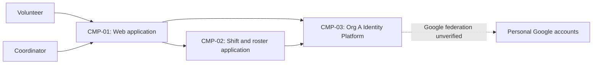

# ARCH-001 — Volunteer shift sign-up for the Riverside Food Bank architecture

## 1. Context and scope

This draft examines approved PRD-001 version 1, owned by Priya Nair: a mobile-first web application for approximately 120 volunteers to sign in and book warehouse shifts, with a daily roster for the coordinator. Payroll and donations are outside scope. The PRD sets operating context to internal; its Pilot release label does not change that context.

The user explicitly selected PRD-001 and requested proceeding without questions. No inspection scope was named and no code or configuration was inspected. No existing ARCH or ADR was found in the contract directories. A new architecture description is proposed; creation of this draft does not confirm the create outcome, so outcome remains null. Only the exact identity-provider question is resolved by approved policy. Other architecture choices remain proposals, and no ADR is written.

## 2. Quality drivers

PRD-001#NFR-001 requires administrator revocation of volunteer sessions to take effect within five minutes. This governs both sign-in and subsequent authenticated booking access; choosing an identity provider alone does not establish revocation behavior.

PRD-001#NFR-002 restricts volunteer phone numbers to the coordinator. Data ownership and authorization must be shared decisions across the roster interface and its data sources. Hiding fields in the browser alone is not sufficient enforcement.

PRD-001#NFR-003 requires hosted services for the whole product. PRD-001#NFR-004 requires personal Google accounts for sign-in. POL-001#SET-01 mandates Org A Identity Platform (OIDC), but supplies no evidence of Google federation or five-minute session revocation. Compatibility of the account constraint with that mandate remains unknown, not an established impossibility.

The internal quality floor is constraint, security and privacy. POL-001#SET-02 adds compliance and accessibility. The PRD covers the first three categories but has no compliance or accessibility NFR or measurable acceptance criteria. Those product questions remain with Priya Nair; this draft does not invent requirements or architectural decisions for them.

## 3. Components

The diagram is a proposed logical decomposition, not an accepted service split. ARCH-001#DEC-04 controls boundaries, ARCH-001#DEC-05 and ARCH-001#DEC-06 control data ownership, and ARCH-001#DEC-09 controls booking-to-roster interaction. Arrows show intended relationships rather than selected protocols. Google federation is conditional on ARCH-001#DEC-03.



```yaml items
components:
  - id: CMP-01
    status: active
    name: "Volunteer and coordinator web application"
    responsibility: "Proposed browser interface for sign-in, booking and daily rosters; does not own authoritative records or enforce phone-number access by itself."
    owns_data: []
    interacts_with:
      - "CMP-02"
      - "CMP-03"
    deployment: "Open: see DEC-08"
    upstream:
      - {id: PRD-001, item: NFR-002, relation: informed_by, version: 1, hash: null}
      - {id: PRD-001, item: NFR-003, relation: informed_by, version: 1, hash: null}
      - {id: PRD-001, item: NFR-004, relation: informed_by, version: 1, hash: null}
  - id: CMP-02
    status: active
    name: "Shift and roster application"
    responsibility: "Proposed application boundary for authenticated booking and coordinator roster access, including phone-number authorization; does not authenticate Google credentials. Boundaries, ownership and internal interaction remain open in DEC-04 through DEC-07 and DEC-09."
    owns_data:
      - "Proposed: authoritative shift and booking records, subject to DEC-05"
      - "Proposed: volunteer profiles, phone numbers and coordinator role assignments, subject to DEC-06"
    interacts_with:
      - "CMP-01"
      - "CMP-03"
    deployment: "Open: see DEC-08"
    upstream:
      - {id: PRD-001, item: NFR-001, relation: informed_by, version: 1, hash: null}
      - {id: PRD-001, item: NFR-002, relation: informed_by, version: 1, hash: null}
      - {id: PRD-001, item: NFR-003, relation: informed_by, version: 1, hash: null}
  - id: CMP-03
    status: active
    name: "Org A Identity Platform (OIDC)"
    responsibility: "Policy-mandated identity and authentication capability; does not own warehouse bookings or determine coordinator access to phone numbers. Google federation and application session revocation are unverified."
    owns_data: []
    interacts_with:
      - "CMP-01"
      - "CMP-02"
      - "Personal Google accounts (conditional; see DEC-03)"
    deployment: "External mandated platform; application integration hosting open in DEC-08"
    upstream:
      - {id: PRD-001, item: NFR-001, relation: informed_by, version: 1, hash: null}
      - {id: PRD-001, item: NFR-003, relation: informed_by, version: 1, hash: null}
      - {id: PRD-001, item: NFR-004, relation: informed_by, version: 1, hash: null}
      - {id: POL-001, item: SET-01, relation: constrains, version: 3, hash: null}
```

## 4. Architectural questions

```yaml items
decisions:
  - id: DEC-01
    status: active
    question: "Which identity provider handles volunteer sign-in?"
    blocking: true
    state: resolved
    resolved_by: [POL-001#SET-01]
    notes: "Org A Identity Platform (OIDC) is mandated by approved POL-001 v3 SET-01. This answers the PRD NEEDS ADR marker only as to provider selection; Google-account compatibility and revocation remain separate open questions."
    upstream:
      - {id: PRD-001, item: FR-001, relation: informed_by, version: 1, hash: null}
      - {id: PRD-001, item: NFR-004, relation: informed_by, version: 1, hash: null}
  - id: DEC-02
    status: active
    question: "How will administrator revocation invalidate volunteer sessions across sign-in and authenticated booking within five minutes?"
    blocking: true
    state: open
    resolved_by: []
    notes: "The mandate specifies a provider, not revocation propagation. Application session validation and identity-platform revocation capabilities are unknown."
    upstream:
      - {id: PRD-001, item: FR-001, relation: informed_by, version: 1, hash: null}
      - {id: PRD-001, item: FR-002, relation: informed_by, version: 1, hash: null}
      - {id: PRD-001, item: NFR-001, relation: informed_by, version: 1, hash: null}
  - id: DEC-03
    status: active
    question: "How will personal Google accounts authenticate through the mandated Org A Identity Platform?"
    blocking: true
    state: open
    resolved_by: []
    notes: "Federation support and permitted configuration are unknown. Direct Google authentication that bypasses the mandated platform cannot be assumed acceptable. See the conditional PRD-owner proposal in section 7."
    upstream:
      - {id: PRD-001, item: FR-001, relation: informed_by, version: 1, hash: null}
      - {id: PRD-001, item: NFR-004, relation: informed_by, version: 1, hash: null}
  - id: DEC-04
    status: active
    question: "What component boundaries will separate the web interface, identity integration, booking and roster responsibilities?"
    blocking: true
    state: open
    resolved_by: []
    notes: "CMP-01 through CMP-03 propose logical responsibilities only. Whether booking and roster share an application boundary or use separate services is undecided."
    upstream:
      - {id: PRD-001, item: FR-001, relation: informed_by, version: 1, hash: null}
      - {id: PRD-001, item: FR-002, relation: informed_by, version: 1, hash: null}
      - {id: PRD-001, item: FR-003, relation: informed_by, version: 1, hash: null}
      - {id: PRD-001, item: NFR-001, relation: informed_by, version: 1, hash: null}
      - {id: PRD-001, item: NFR-002, relation: informed_by, version: 1, hash: null}
  - id: DEC-05
    status: active
    question: "Which component will own authoritative shifts and bookings shared by booking and roster views?"
    blocking: true
    state: open
    resolved_by: []
    notes: "CMP-02 is the proposed owner; no decision establishes the source of truth yet. Table structures and migrations belong to later specifications."
    upstream:
      - {id: PRD-001, item: FR-002, relation: informed_by, version: 1, hash: null}
      - {id: PRD-001, item: FR-003, relation: informed_by, version: 1, hash: null}
  - id: DEC-06
    status: active
    question: "Which component will own volunteer phone numbers and coordinator role assignments?"
    blocking: true
    state: open
    resolved_by: []
    notes: "CMP-02 is a proposed owner only. The identity mandate does not determine ownership of volunteer contact data or application roles."
    upstream:
      - {id: PRD-001, item: FR-003, relation: informed_by, version: 1, hash: null}
      - {id: PRD-001, item: NFR-002, relation: informed_by, version: 1, hash: null}
  - id: DEC-07
    status: active
    question: "Where will coordinator-only authorization for volunteer phone numbers be enforced across data access paths?"
    blocking: true
    state: open
    resolved_by: []
    notes: "The enforcement boundary and source of coordinator authorization are undecided. This protects roster/contact access; no phone-number use is assumed for booking."
    upstream:
      - {id: PRD-001, item: FR-003, relation: informed_by, version: 1, hash: null}
      - {id: PRD-001, item: NFR-002, relation: informed_by, version: 1, hash: null}
  - id: DEC-08
    status: active
    question: "Which hosted topology and deployment units will run the whole product?"
    blocking: true
    state: open
    resolved_by: []
    notes: "Hosted services are required, but the application hosting platform, persistence placement and deployment units have not been selected. No infrastructure was inspected."
    upstream:
      - {id: PRD-001, item: FR-001, relation: informed_by, version: 1, hash: null}
      - {id: PRD-001, item: FR-002, relation: informed_by, version: 1, hash: null}
      - {id: PRD-001, item: FR-003, relation: informed_by, version: 1, hash: null}
      - {id: PRD-001, item: NFR-003, relation: informed_by, version: 1, hash: null}
  - id: DEC-09
    status: active
    question: "How will confirmed bookings reach the coordinator roster across the shared application boundary?"
    blocking: true
    state: open
    resolved_by: []
    notes: "A shared authoritative read model or propagated roster updates are possible shapes; no interaction or consistency contract has been accepted. Exact API fields and product freshness targets are outside this decision."
    upstream:
      - {id: PRD-001, item: FR-002, relation: informed_by, version: 1, hash: null}
      - {id: PRD-001, item: FR-003, relation: informed_by, version: 1, hash: null}
```

## 5. Evidence inspected

```yaml items
evidence:
  - id: EVD-01
    status: active
    source: "PRD-001"
    kind: prd
    finding: "Version 1, status approved: FR-001 sign-in, FR-002 authenticated booking and FR-003 daily coordinator roster; NFR-001 five-minute revocation, NFR-002 coordinator-only phone visibility, NFR-003 hosted services and NFR-004 personal Google accounts; internal context and an identity-provider NEEDS ADR marker."
    classification: context
  - id: EVD-02
    status: active
    source: "POL-001#SET-01"
    kind: policy
    finding: "Version 3, status approved; SET-01 active: mandates Org A Identity Platform (OIDC) for identity and authentication, with no override allowed. Its source names external ADR-104; that ADR was not inspected and is not an independent resolver."
    classification: policy
  - id: EVD-03
    status: active
    source: "POL-001#SET-02"
    kind: policy
    finding: "Version 3, status approved; SET-02 active: adds compliance and accessibility for internal, pilot and production contexts; applies to the PRD internal context."
    classification: policy
```

## 6. Deployment

PRD-001#NFR-003 rules out an on-site server. The web application, application processing and persistent data must use hosted services. ARCH-001#DEC-08 leaves the hosting platform, deployment units and environments open. The mandated identity capability is external to the proposed application boundary; its operating topology and integration capabilities have not been inspected. No hosting provider, database product, service split or environment topology is accepted by this draft.

## 7. Requirement changes proposed to the PRD owner

- Priya Nair — PRD-001#NFR-004 has a potential compatibility conflict with POL-001#SET-01. Proposed clarification: personal Google accounts authenticate through the mandated Org A Identity Platform. Confirm federation support before approving that wording. If it is unsupported, the account requirement or an authorized organization-policy exception needs owner review; this draft neither asserts impossibility nor relaxes the requirement.
- Priya Nair — POL-001#SET-02 requires compliance and accessibility coverage that PRD-001 lacks. Add measurable NFRs for those categories, with applicability and acceptance criteria established by the owner. This is a proposed PRD addition, not a newly invented active requirement.

## 8. Open questions

- [NEEDS CLARIFICATION: No inspection scope was named and no code or configuration was inspected; implemented components, reusable infrastructure and session behavior are unknown.]
- [NEEDS CLARIFICATION: Org A Identity Platform support for personal Google accounts and revocation propagation is unverified; ARCH-001#DEC-02 and ARCH-001#DEC-03 remain open.]
- [NEEDS CLARIFICATION: Component boundaries, authoritative data owners, phone-number authorization, hosting topology and booking-to-roster interaction await decisions in ARCH-001#DEC-04 through ARCH-001#DEC-09.]
- [NEEDS CLARIFICATION: Priya Nair must establish compliance and accessibility requirements to cover the categories added by POL-001#SET-02.]
- [NEEDS CLARIFICATION: The proposed create outcome is unconfirmed; the request to define architecture without questions did not confirm an outcome.]
- [NEEDS CLARIFICATION: host model/session identity unavailable]

## Change Log

| Version | Date | Author | Change | Items affected |
|---|---|---|---|---|
| 1 | 2026-09-28 | codex (session unknown) | Initial draft for PRD-001 v1. Policy resolution: interview.max_calls=8 (default); architecture.mandated_platforms=Org A Identity Platform (OIDC) for identity and authentication (POL-001#SET-01); quality.required_categories=+compliance,+accessibility (POL-001#SET-02) | all |
| 1 | 2026-09-28 | codex (session unknown) | Validation audit: self-check 3 unresolved because exact host model and session identities are unavailable. Retained as draft with empty approval fields; no ADR or decision restoration was needed. Readiness handoff withheld. Policy resolution: interview.max_calls=8 (default); architecture.mandated_platforms=Org A Identity Platform (OIDC) for identity and authentication (POL-001#SET-01); quality.required_categories=+compliance,+accessibility (POL-001#SET-02) | generated_by |
