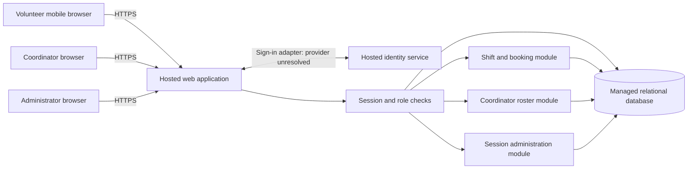

# ADD-001 — Volunteer shift sign-up

## Scope and decision summary

This design covers all six active, current-release requirements in
[PRD-001](../prd/PRD-001.md), version 1. It supports approximately 120 volunteers,
one coordinator, and three warehouse shifts per day through mobile web pages.
Payroll, donations, native apps, notifications, cancellation, waitlists, and a
general scheduling editor are outside this design's scope.

Use one hosted web application with server-side authorization and a managed
relational database. Store bookings, roles, and revocable application sessions
centrally. Keep phone numbers behind a coordinator-only query boundary.

The identity provider remains the one unresolved architectural choice. The PRD
does not establish an existing identity service or which credentials volunteers
can use. [ADR-001](../adr/ADR-001.md) records options and the evidence needed to
resolve this without assuming that smartphone access implies email access.
[ADR-002](../adr/ADR-002.md) defines hosting and booking consistency;
[ADR-003](../adr/ADR-003.md) defines session revocation and phone privacy.
These are authored design artifacts, not records of stakeholder approval.

## Components and trust boundaries

The browser is untrusted. It receives neither database credentials nor provider
secrets. All protected reads and writes pass through the application. Identity
proof does not grant an application role: roles come from the application store,
never browser input. An administrator is not implicitly a coordinator.

| Component | Responsibility | Requirements |
|---|---|---|
| Identity adapter | Map a verified external identity to a provisioned local account; issue a local session | FR-001 |
| Session and role checks | Validate every protected request against authoritative session and role state | FR-001, FR-002, FR-003, NFR-001, NFR-002 |
| Shift and booking module | List open shifts and commit capacity-safe bookings for the caller | FR-002 |
| Roster module | Read daily bookings and coordinator-only contact details | FR-003, NFR-002 |
| Session administration | Let administrators revoke all existing sessions for a volunteer | NFR-001 |
| Hosted app and managed database | Run the whole product without an on-site server | NFR-003, all FRs |

Use a modular monolith: modules are code boundaries, not separate deployments.
There is no queue, distributed cache, offline data store, or event bus in the pilot.

## Data and interfaces

| Record | Minimum fields and invariants |
|---|---|
| Account | Internal ID, display name, unique external issuer/subject mapping, active flag, session generation, latest revocation timestamp |
| Role assignment | Account ID and explicit volunteer, coordinator, or administrator role; trusted provisioning only |
| Session | Hash of opaque session secret, account ID, generation at issuance, expiry; secrets never logged |
| Volunteer contact | Account ID and optional phone number; separate from general account projections |
| Shift | ID, start/end instants, positive capacity, published/open state; configured food-bank timezone defines calendar days |
| Booking | ID, shift ID, volunteer account ID, created timestamp; unique `(shift_id, volunteer_id)` |
| Security audit | Actor/target internal IDs, event type, timestamp, outcome; no phone numbers or session secrets |

The application owns its data. External identity subjects are mapped to stable
internal IDs so changing providers does not require changing booking ownership.
The identity provider need not receive volunteer phone numbers.

The following are logical contracts for epic decomposition, not a commitment to
a framework or an API version:

| Operation | Authorization | Contract |
|---|---|---|
| Start/complete sign-in | Public entry, verified completion | Identity adapter returns a verified account mapping; local session is issued only for an active provisioned account. Exact provider flow is blocked by ADR-001. |
| List open shifts | Signed-in volunteer | Return shift times and available places; never volunteer identities or phone numbers. Availability is advisory until booking commits. |
| Book a shift | Signed-in volunteer | Derive volunteer ID from session; atomically validate open state and remaining capacity, then insert. A repeat request returns the existing booking. |
| Read daily roster | Coordinator | Accept a local calendar date; return shifts and booked volunteer names, with phone numbers when stored. Empty days return an empty roster. |
| Revoke volunteer sessions | Administrator | Atomically increment the target account's session generation; success is returned only after commit. All existing sessions become invalid. |

Unauthenticated or revoked sessions receive an authentication failure; authenticated
callers without the required role receive an authorization failure. A closed/full
shift returns a conflict. A database outage returns an unavailable/retry response;
the application must not claim a booking or revocation succeeded before commit.
State-changing browser requests require CSRF protection. Cookies are Secure,
HttpOnly, and use a SameSite policy compatible with the eventual sign-in flow.

## Booking and roster behavior

For each booking transaction, lock the shift row, check the existing booking,
then check open state, time, and capacity before inserting. All booking writers
must take this lock. The unique booking constraint also protects retries.
Two volunteers competing for the last place must produce one success and one
full-shift conflict. A retry following a lost response must not consume a second
place. Capacity/open-state maintenance must follow the same locking discipline.

Read the roster from committed bookings on the primary database. Refresh on date
selection, manual refresh, and every 30 seconds while the page is visible. Label
the last successful refresh and show failures rather than displaying stale data
as current. Thirty seconds is a proposed design setting, not a PRD service-level
target. Do not use push connections or a roster cache for the pilot.

## Security and hosting constraints

NFR-001 applies to every authenticated route, including booking, roster access,
and session administration. Check session expiry, account state, generation, and
current roles against the primary database on every request. Do not accept an
identity-provider token as a substitute for this check. Do not cache positive
session decisions. Fail closed if authoritative state cannot be read.

After a revocation commit, subsequent checks must reject every previously issued
session. Bound protected request duration to 60 seconds, with cancellation of
unfinished work; there are no long-lived protected streams. This leaves margin
under the PRD's five-minute limit for requests already admitted. A sign-in
attempt begun before revocation must not issue a session using stale generation
state. Fresh sign-in after revocation is allowed: session revocation is not
account suspension. See ADR-003 for race and verification obligations.

NFR-002 applies to all responses, server-rendered pages, errors, logs, telemetry,
and caches. Only the coordinator roster/contact path may select or serialize
phone numbers. Volunteers, including the owner of a phone number, and
administrators without the coordinator role receive no phone field. Do not fetch
phones for unauthorized callers and hide them in the UI. Sensitive responses use
`Cache-Control: no-store`; exclude contact payloads from tracing and analytics.

NFR-003 is product-wide: deploy the web application, primary database, backups,
and identity service on hosted infrastructure. Use HTTPS, a private database
connection, managed secrets, migrations, and a separate nonproduction environment
with synthetic contacts. Only the application service and tightly restricted
maintenance identities access the database. Provide managed backups and verify
restore before the pilot. Provider, region, retention, and recovery objectives
are deployment decisions to record in the hosting epic; no numeric availability,
budget, or recovery guarantee is invented here.

## Assumptions and unresolved inputs

These are explicit design assumptions, not amendments to the approved PRD:

| ID | Input or assumption | Consequence and resolution |
|---|---|---|
| A-01 | An open shift is published, starts in the future, and has remaining capacity. | Use this conservative booking rule in the epic draft; product owner resolves different cutoff rules before stories are finalized. |
| A-02 | Trusted staff provision accounts, roles, shifts/capacities, and existing contact data through a restricted operational import. | Document validation and access in the foundation epic. No public registration or scheduling UI is implied. Never put phone data in source control or import logs. |
| A-03 | One food-bank timezone determines the roster date. | Supply an explicit IANA timezone at deployment; the workspace timezone is not evidence of the food bank's location. |
| A-04 | Coordinator and administrator accounts use the same identity adapter with separate local role assignments. | Provider selection must support staff as well as volunteers. |
| D-01 | Identity provider and usable sign-in method are unresolved. | Blocks FR-001 epic readiness; close ADR-001 with provider and enrollment/recovery evidence. Other epics can use the stable authenticated-account contract, but production integration depends on FR-001. |
| A-05 | The coordinator's shift log remains the SM-01 measurement source. | Booking counts are not attendance. No automatic attendance tracking or claim of meeting the 95% target. |

PRD ASM-01 remains open. Phone/browser access must be validated for pilot rollout;
this does not prevent defining the web architecture. BRN-001 is referenced by
the PRD but absent from this workspace; no additional requirements are inferred
from it. No product-code, repository instructions, test commands, or architecture
templates were present at the time of writing.

## Requirement readiness and epic handoff

**READY** means ready to define an epic using the contracts above, not implemented,
tested, approved, or independently shippable. **BLOCKED** means an unresolved
architectural decision prevents defining the affected behavior. Dependencies are
recorded separately so an unfinished sign-in implementation does not prevent
planning booking and roster work.

| Requirement | Epic readiness | Architecture evidence | Applicable constraints / dependencies | Required implementation evidence |
|---|---|---|---|---|
| FR-001 | BLOCKED | Identity adapter contract; ADR-001 | NFR-001, NFR-002, NFR-003; D-01 | Chosen-provider sign-in, failed/cancelled login, provisioned-account mapping, recovery, and local-session integration |
| FR-002 | READY | Atomic booking flow; ADR-002 | NFR-001 on every request; NFR-002 excludes contacts; NFR-003 hosted storage; FR-001 integration; A-01/A-02 | Last-place concurrency, retry, closed/past/full shift, unauthenticated/revoked-session rejection, no phone leakage |
| FR-003 | READY | Daily roster contract and refresh behavior; ADR-003 | NFR-001 revocation checks; NFR-002 coordinator-only contacts; NFR-003 hosted reads; FR-001 integration and FR-002 data; A-03 | Date/timezone boundaries, committed bookings, empty day, refresh/error state, coordinator-only authorization |
| NFR-001 | READY | Authoritative local session generation; ADR-003 | Cross-cutting to all protected operations; concrete provider integration awaits D-01 | Revoke all browser sessions; replay them against every protected route at and beyond five minutes; test outage and races |
| NFR-002 | READY | Separate contact projection, role checks, no-store/redaction; ADR-003 | Cross-cutting across all FRs and operational data paths | Role matrix including administrator-only and own-phone cases; response/page/error/log/cache inspection |
| NFR-003 | READY | Hosted deployment boundary; ADR-002 | Whole product, including all FRs and both other NFRs | Hosted topology, no on-site dependency, secret/network configuration, migration and restore exercise |

Suggested epic boundaries (planning candidates, not created epics):

1. Hosted foundation and application security: NFR-001, NFR-002, NFR-003; shared
   account/session/role contract, trusted seed/import process, deployment controls.
2. Volunteer sign-in: FR-001 with all NFRs; held for D-01. Provider research and
   a small integration spike can resolve D-01 before drafting the delivery epic.
3. Shift booking: FR-002 with all NFRs; foundation and sign-in are delivery
   dependencies. Drafting may proceed against a test account/session adapter.
4. Coordinator roster: FR-003 with all NFRs; consumes committed booking data and
   coordinator identity. Preserve the PRD's `should` priority.

Do not copy a test identity adapter into a pilot deployment. The first rollout
contains Tuesday/Thursday shifts only; expand the provisioned schedule after
pilot evaluation. The PRD's generated epic map remains untouched.

## Verification status

See [VERIFICATION-001](VERIFICATION-001.md) for checks against these exact files.
Architecture coverage and link checks can pass without demonstrating runtime
compliance. No implementation exists here, so runtime acceptance tests are
NOT_RUN; the identity decision remains BLOCKED.
