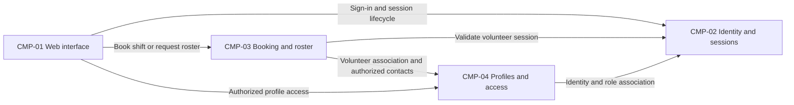

# ARCH-001 — Volunteer shift sign-up for the Riverside Food Bank architecture

## 1. Context and scope

This proposal examines PRD-001 version 1, status approved, owned by Priya Nair.
It covers volunteer sign-in, self-service warehouse shift booking, and the coordinator's daily roster
for about 120 volunteers using mobile web browsers. Payroll, donations and an installed mobile app
are outside the product scope.

The user selected PRD-001 and requested no questions. No inspection scope was named and no code or
configuration was inspected. No existing ARCH, ADR, policy document or local preference was found
at the contract paths. Creation of ARCH-001 is proposed because no ARCH covers the system;
`outcome: null` records that this outcome has not been explicitly confirmed. No architectural choice
is accepted and no ADR is written. The proposed components below are logical responsibilities,
not a commitment to separate services or particular products.

## 2. Quality drivers

PRD-001#NFR-001 requires administrator revocation of volunteer sessions to take effect within five
minutes. Both session issuance and every authenticated booking access path must honor that bound;
provider selection alone cannot establish compliance (ARCH-001#DEC-01 and ARCH-001#DEC-02).

PRD-001#NFR-002 permits only the coordinator to see volunteer phone numbers. Contact ownership,
role authority and enforcement at the data access boundary must therefore be shared across booking
and roster work (ARCH-001#DEC-04 and ARCH-001#DEC-07). Hiding phone numbers in the browser alone
cannot enforce this requirement.

PRD-001#NFR-003 applies hosted services to the whole product. The food bank has no on-site server;
platforms and deployment units remain open in ARCH-001#DEC-03.

The operating context is `internal`, as stated in the PRD; the release label Pilot does not change
that context. Its framework quality floor is constraint, security and privacy, covered respectively
by PRD-001#NFR-003, PRD-001#NFR-001 and PRD-001#NFR-002. No required category is uncovered and no
policy adds categories. Roster freshness is an unanswered product measure, not an invented NFR.

## 3. Components

All ownership and interactions in this diagram are proposed. ARCH-001#DEC-05 covers component
boundaries; ARCH-001#DEC-06 and ARCH-001#DEC-07 cover ownership. ARCH-001#DEC-08 covers the booking
to roster interaction. Phone-bearing responses must pass the coordinator access boundary.



```yaml items
components:
  - id: CMP-01
    status: active
    name: "Volunteer and coordinator web interface"
    responsibility: "Proposed: present mobile sign-in, booking and daily roster views; does not own records or enforce access by hiding fields alone."
    owns_data: []
    interacts_with:
      - "CMP-02"
      - "CMP-03"
      - "CMP-04"
    deployment: "Open: see DEC-03"
    upstream:
      - {id: PRD-001, item: NFR-001, relation: informed_by, version: 1, hash: null}
      - {id: PRD-001, item: NFR-002, relation: informed_by, version: 1, hash: null}
      - {id: PRD-001, item: NFR-003, relation: informed_by, version: 1, hash: null}
  - id: CMP-02
    status: active
    name: "Identity and session capability"
    responsibility: "Proposed: authenticate volunteers and support administrator session revocation; does not own shift bookings. Provider and application session responsibilities await DEC-01 and DEC-02."
    owns_data:
      - "Proposed: identity subjects and authentication state; session authority awaits DEC-02"
    interacts_with:
      - "CMP-01"
      - "CMP-03"
      - "CMP-04"
    deployment: "Open: see DEC-03"
    upstream:
      - {id: PRD-001, item: NFR-001, relation: informed_by, version: 1, hash: null}
      - {id: PRD-001, item: NFR-003, relation: informed_by, version: 1, hash: null}
  - id: CMP-03
    status: active
    name: "Shift booking and roster capability"
    responsibility: "Proposed: accept authorized bookings against open shifts and supply daily rosters from authoritative booking state; does not authenticate users or own volunteer phone numbers."
    owns_data:
      - "Proposed: shift availability and bookings, pending DEC-06"
    interacts_with:
      - "CMP-01"
      - "CMP-02"
      - "CMP-04"
    deployment: "Open: see DEC-03"
    upstream:
      - {id: PRD-001, item: NFR-001, relation: informed_by, version: 1, hash: null}
      - {id: PRD-001, item: NFR-002, relation: informed_by, version: 1, hash: null}
      - {id: PRD-001, item: NFR-003, relation: informed_by, version: 1, hash: null}
  - id: CMP-04
    status: active
    name: "Volunteer profile and access capability"
    responsibility: "Proposed: associate volunteer profiles with identities and expose phone numbers only under coordinator authorization; does not own shift bookings or authentication credentials."
    owns_data:
      - "Proposed: volunteer contact records and role assignments, pending DEC-04 and DEC-07"
    interacts_with:
      - "CMP-01"
      - "CMP-02"
      - "CMP-03"
    deployment: "Open: see DEC-03"
    upstream:
      - {id: PRD-001, item: NFR-002, relation: informed_by, version: 1, hash: null}
      - {id: PRD-001, item: NFR-003, relation: informed_by, version: 1, hash: null}
```

## 4. Architectural questions

```yaml items
decisions:
  - id: DEC-01
    status: active
    question: "Which identity provider handles volunteer sign-in?"
    blocking: true
    state: open
    resolved_by: []
    notes: "PRD-001 section 12 explicitly requires this decision. A managed identity provider reduces credential operations; application-managed identity offers control but increases security responsibilities. Neither option is accepted. Session revocation remains a separate question in DEC-02. Open: no mandate or explicit decision; user requested no questions."
    upstream:
      - {id: PRD-001, item: FR-001, relation: informed_by, version: 1, hash: null}
      - {id: PRD-001, item: FR-002, relation: informed_by, version: 1, hash: null}
      - {id: PRD-001, item: NFR-001, relation: informed_by, version: 1, hash: null}
  - id: DEC-02
    status: active
    question: "How will administrator revocation make every affected volunteer session stop working within five minutes?"
    blocking: true
    state: open
    resolved_by: []
    notes: "Shared session validation must govern both sign-in sessions and authenticated booking requests. A central revocation check provides direct control but adds a runtime dependency; bounded session validity with refresh denial requires proof that every access path meets the five-minute bound. No mechanism is selected. Open: no mandate or explicit decision; user requested no questions."
    upstream:
      - {id: PRD-001, item: FR-001, relation: informed_by, version: 1, hash: null}
      - {id: PRD-001, item: FR-002, relation: informed_by, version: 1, hash: null}
      - {id: PRD-001, item: NFR-001, relation: informed_by, version: 1, hash: null}
  - id: DEC-03
    status: active
    question: "Which hosted deployment topology will run the whole product?"
    blocking: true
    state: open
    resolved_by: []
    notes: "PRD-001#NFR-003 requires hosted services but does not select a platform or deployment units. A hosted application with managed persistence limits operational components; independently hosted capabilities allow separate scaling but add integration and operations work. All functional requirements run within this topology. No platform or topology is selected. Open: no mandate or explicit decision; user requested no questions."
    upstream:
      - {id: PRD-001, item: FR-001, relation: informed_by, version: 1, hash: null}
      - {id: PRD-001, item: FR-002, relation: informed_by, version: 1, hash: null}
      - {id: PRD-001, item: FR-003, relation: informed_by, version: 1, hash: null}
      - {id: PRD-001, item: NFR-003, relation: informed_by, version: 1, hash: null}
  - id: DEC-04
    status: active
    question: "Where will coordinator authorization be enforced to restrict volunteer phone numbers across all read paths?"
    blocking: true
    state: open
    resolved_by: []
    notes: "Application-enforced authorization centralizes access rules; datastore-enforced access can protect direct reads but couples roles and identity to storage policy. Both must prevent phone disclosure through booking and roster responses as well as profile reads. Authentication alone does not grant coordinator access. No enforcement boundary is selected. Open: no mandate or explicit decision; user requested no questions."
    upstream:
      - {id: PRD-001, item: FR-002, relation: informed_by, version: 1, hash: null}
      - {id: PRD-001, item: FR-003, relation: informed_by, version: 1, hash: null}
      - {id: PRD-001, item: NFR-002, relation: informed_by, version: 1, hash: null}
  - id: DEC-05
    status: active
    question: "How will the web, identity, booking and profile responsibilities be partitioned into shared components?"
    blocking: true
    state: open
    resolved_by: []
    notes: "CMP-01 through CMP-04 are a proposed logical decomposition. Application modules offer simpler integration; independently operated services offer isolation with more contracts and operational work. This question concerns responsibility boundaries; DEC-03 separately covers their hosted placement. No boundary is accepted. Open: no mandate or explicit decision; user requested no questions."
    upstream:
      - {id: PRD-001, item: FR-001, relation: informed_by, version: 1, hash: null}
      - {id: PRD-001, item: FR-002, relation: informed_by, version: 1, hash: null}
      - {id: PRD-001, item: FR-003, relation: informed_by, version: 1, hash: null}
      - {id: PRD-001, item: NFR-001, relation: informed_by, version: 1, hash: null}
      - {id: PRD-001, item: NFR-002, relation: informed_by, version: 1, hash: null}
  - id: DEC-06
    status: active
    question: "Which component will own authoritative shift availability and booking records?"
    blocking: true
    state: open
    resolved_by: []
    notes: "A single booking authority can make acceptance and roster reads share one record of bookings; separate scheduling and booking authorities require an agreed consistency contract. The owner must check that a shift is open when accepting a booking. Capacity rules and exact data fields belong to product clarification and later specifications. CMP-03 ownership is proposed only. Open: no mandate or explicit decision; user requested no questions."
    upstream:
      - {id: PRD-001, item: FR-002, relation: informed_by, version: 1, hash: null}
      - {id: PRD-001, item: FR-003, relation: informed_by, version: 1, hash: null}
  - id: DEC-07
    status: active
    question: "Which component will own volunteer contact records and their association with authenticated identities?"
    blocking: true
    state: open
    resolved_by: []
    notes: "An application-owned profile store separates private contacts from identity-provider data; provider-owned profiles reduce duplication but couple contact access to provider capabilities. Booking and roster views need a stable volunteer association without exposing phone numbers. CMP-04 ownership is proposed only. Open: no mandate or explicit decision; user requested no questions."
    upstream:
      - {id: PRD-001, item: FR-001, relation: informed_by, version: 1, hash: null}
      - {id: PRD-001, item: FR-002, relation: informed_by, version: 1, hash: null}
      - {id: PRD-001, item: FR-003, relation: informed_by, version: 1, hash: null}
      - {id: PRD-001, item: NFR-002, relation: informed_by, version: 1, hash: null}
  - id: DEC-08
    status: active
    question: "How will accepted bookings become visible in the coordinator daily roster?"
    blocking: true
    state: open
    resolved_by: []
    notes: "Reading from the booking authority keeps the roster aligned with committed bookings; an event-fed roster projection requires delivery, replay and freshness agreements. The PRD summary asks for a live roster but gives no measurable freshness bound. No interaction contract is selected. Open: no mandate or explicit decision; user requested no questions."
    upstream:
      - {id: PRD-001, item: FR-002, relation: informed_by, version: 1, hash: null}
      - {id: PRD-001, item: FR-003, relation: informed_by, version: 1, hash: null}
```

## 5. Evidence inspected

```yaml items
evidence:
  - id: EVD-01
    status: active
    source: "PRD-001"
    kind: prd
    finding: "Version 1, status approved: FR-001 requires sign-in with an explicit identity-provider NEEDS ADR marker; FR-002 requires authenticated shift booking; FR-003 requires daily rosters. NFR-001 bounds volunteer session revocation to five minutes, NFR-002 restricts phone visibility to the coordinator, and NFR-003 requires hosted services for the entire product. Operating context is internal."
    classification: context
```

## 6. Deployment

PRD-001#NFR-003 rules out an on-site server. Browser access and hosted identity, application and
persistence capabilities form the proposed shape. ARCH-001#DEC-03 leaves the hosting platform,
deployment units and environment arrangement open; ARCH-001#DEC-05 leaves logical component
boundaries open. The Tuesday and Thursday pilot is a rollout sequence, not an approved environment
or infrastructure choice. No current implementation or reusable platform has been established.

## 7. Requirement changes proposed to the PRD owner

- None.

## 8. Open questions

- [NEEDS CLARIFICATION: No inspection scope was supplied and no code was inspected; existing implementation, infrastructure and reuse suitability are unknown.]
- [NEEDS CLARIFICATION: host model/session identity unavailable]
- [NEEDS CLARIFICATION: Priya Nair, the live roster in the PRD-001 summary has no measurable freshness bound for PRD-001#FR-003; this product clarification may constrain ARCH-001#DEC-08.]

## Change Log

| Version | Date | Author | Change | Items affected |
|---|---|---|---|---|
| 1 | 2026-09-28 | codex (session unknown) | Initial draft for PRD-001 v1; create proposed but unconfirmed; all architectural questions remain open. Policy resolution: interview.max_calls=8 (default); architecture.mandated_platforms=none (default); quality.required_categories=floor only (default) | all |
