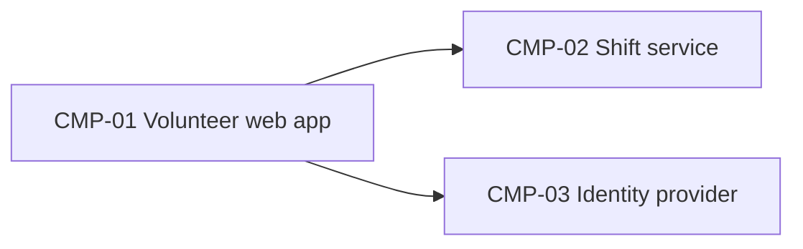

# ARCH-001 — Riverside Food Bank volunteer shift sign-up architecture

## 1. Context and scope

Originally defined against PRD-001 version 1; reviewed for reuse against approved PRD-001 version 2. The PRD change log records only FR-003's priority changing from should to must, with no requirement text changes. Volunteers sign in, book warehouse shifts, and the coordinator sees the roster. The user confirmed reuse on 2026-09-28; no architectural change or ARCH version increment is needed for this priority change. No inspection scope was named, and no code was inspected.

Reuse retains the existing unresolved blocking decision DEC-02. The user's reuse confirmation does not resolve the session-revocation design or establish readiness for work that depends on that decision.

## 2. Quality drivers

NFR-001 (session revocation) and NFR-002 (private phone numbers) drive the design; NFR-003 rules out an on-site server.

## 3. Components



```yaml items
components:
  - id: CMP-01
    status: active
    name: "Volunteer web app"
    responsibility: "Sign-in and booking screens; holds no data of its own"
    owns_data: []
    interacts_with:
      - "CMP-02"
      - "CMP-03"
    deployment: "Static site on the hosting provider"
  - id: CMP-02
    status: active
    name: "Shift service"
    responsibility: "Shifts, bookings and volunteer contact details"
    owns_data:
      - "Shifts and bookings"
      - "Volunteer phone numbers"
    interacts_with:
      - "CMP-01"
    deployment: "One hosted service with its database"
    upstream:
      - {id: PRD-001, item: NFR-002, relation: informed_by, version: 2, hash: null}
  - id: CMP-03
    status: active
    name: "Identity provider"
    responsibility: "Authenticates volunteers and issues sessions"
    owns_data:
      - "Volunteer credentials"
    interacts_with:
      - "CMP-01"
    deployment: "External: Auth0 (ADR-001)"
    upstream:
      - {id: PRD-001, item: NFR-001, relation: informed_by, version: 2, hash: null}
```

## 4. Architectural questions

```yaml items
decisions:
  - id: DEC-01
    status: active
    question: "Which identity provider handles volunteer sign-in?"
    blocking: true
    state: resolved
    resolved_by: [ADR-001]
    notes: null
    upstream:
      - {id: PRD-001, item: FR-001, relation: informed_by, version: 2, hash: null}
  - id: DEC-02
    status: active
    question: "How are a volunteer's sessions revoked within 5 minutes (NFR-001)?"
    blocking: true
    state: open
    resolved_by: []
    notes: null
    upstream:
      - {id: PRD-001, item: FR-001, relation: informed_by, version: 2, hash: null}
      - {id: PRD-001, item: NFR-001, relation: informed_by, version: 2, hash: null}
```

## 5. Evidence inspected

```yaml items
evidence:
  - id: EVD-01
    status: active
    source: "PRD-001"
    kind: prd
    finding: "Version 2, status approved: the change log records only FR-003 priority changing from should to must, with no requirement text changes. Sign-in (FR-001), session revocation (NFR-001), privacy (NFR-002), and hosting (NFR-003) remain applicable. The identity-provider NEEDS ADR marker remains in the PRD; ADR-001 addresses provider selection, while DEC-02 remains blocking and open."
    classification: context
  - id: EVD-02
    status: active
    source: "ADR-001"
    kind: adr
    finding: "Version 1, status accepted: Auth0 handles volunteer sign-in."
    classification: decided
```

## 6. Deployment

The web app and the shift service run on the hosting provider (NFR-003); Auth0 is external.

## 7. Requirement changes proposed to the PRD owner

- None.

## 8. Open questions

- DEC-02 (blocking, open): how are a volunteer's sessions revoked within 5 minutes (PRD-001#NFR-001)? ADR-001 selects the identity provider but does not resolve this decision.

## Change Log

| Version | Date | Author | Change | Items affected |
|---|---|---|---|---|
| 1 | 2026-09-21 | claude-code (session fixture-session) | Initial draft for PRD-001 v1. Policy resolution: interview.max_calls=8 (default); architecture.mandated_platforms=none (default); quality.required_categories=floor only (default) | all |
| 1 | 2026-09-22 | Priya Nair | Approved | status |
| 1 | 2026-09-25 | claude-code (session prior-review-session) | Reviewed against PRD-001 v2: reuse confirmed, no architectural change. Policy resolution: interview.max_calls=8 (default); architecture.mandated_platforms=none (default); quality.required_categories=floor only (default) | none |
| 1 | 2026-09-28 | Codex | User confirmed reuse for PRD-001 v2's FR-003 priority-only change. Refreshed context, evidence, and PRD item references; retained architecture version and existing approval. DEC-02 remains blocking and open; reuse confirmation does not resolve it | EVD-01, PRD references, context, open questions |
