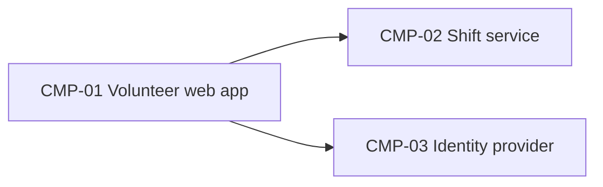

# ARCH-001 — Riverside Food Bank volunteer shift sign-up architecture

## 1. Context and scope

Defined against PRD-001 version 1 (approved): volunteers sign in and book warehouse shifts. Payroll and donations are outside the system. No inspection scope was named, and no code was inspected.

This amendment incorporates accepted ADR-003, which supersedes ADR-002 and requires every service to run on the hosting provider before the back-office server is removed at the end of October. ADR-003 settles hosting only; it does not select the identity provider that replaces the on-premises Keycloak instance. The identity choice is therefore reopened as blocking DEC-01. ADR-001 remains accepted and continues to govern data ownership and storage.

The user confirmed the amend outcome. Version 2 is a draft with a blocking architectural question; version 1's approval remains recorded in the change log.

## 2. Quality drivers

NFR-001 (phone numbers visible only to the coordinator) drives data ownership. ADR-003 constrains all service deployments to the hosting provider; the retiring on-premises server cannot remain a dependency.

## 3. Components



```yaml items
components:
  - id: CMP-01
    status: active
    name: "Volunteer web app"
    responsibility: "Sign-in and booking screens; holds no data of its own"
    owns_data: []
    interacts_with:
      - "CMP-02"
      - "CMP-03"
    deployment: "Static site on the hosting provider"
  - id: CMP-02
    status: active
    name: "Shift service"
    responsibility: "Shifts, bookings and volunteer contact details"
    owns_data:
      - "Shifts and bookings"
      - "Volunteer phone numbers"
    interacts_with:
      - "CMP-01"
    deployment: "Shift service on the hosting provider (ADR-003), with one managed PostgreSQL database owned by the service (ADR-001)"
    upstream:
      - {id: PRD-001, item: NFR-001, relation: informed_by, version: 1, hash: null}
  - id: CMP-03
    status: active
    name: "Identity provider"
    responsibility: "Authenticates volunteers and issues sessions"
    owns_data:
      - "Volunteer credentials"
    interacts_with:
      - "CMP-01"
    deployment: "Hosting provider required by ADR-003; replacement identity provider unresolved (DEC-01)"
```

## 4. Architectural questions

```yaml items
decisions:
  - id: DEC-01
    status: active
    question: "Which identity provider handles volunteer sign-in?"
    blocking: true
    state: open
    resolved_by: []
    notes: "Reopened: ADR-002 is superseded by ADR-003. ADR-003 settles hosting only and explicitly leaves the replacement identity provider undecided; a new identity decision is required for FR-001."
    upstream:
      - {id: PRD-001, item: FR-001, relation: informed_by, version: 1, hash: null}
  - id: DEC-02
    status: active
    question: "Where are shift, booking and contact data stored, and which component owns them?"
    blocking: true
    state: resolved
    resolved_by: [ADR-001]
    notes: null
    upstream:
      - {id: PRD-001, item: FR-002, relation: informed_by, version: 1, hash: null}
      - {id: PRD-001, item: NFR-001, relation: informed_by, version: 1, hash: null}
  - id: DEC-03
    status: active
    question: "Where must services run when the back-office server is retired?"
    blocking: true
    state: resolved
    resolved_by: [ADR-003]
    notes: "Every service must run on the hosting provider. This hosting decision does not resolve DEC-01's identity provider selection."
    upstream:
      - {id: PRD-001, item: FR-001, relation: informed_by, version: 1, hash: null}
      - {id: PRD-001, item: FR-002, relation: informed_by, version: 1, hash: null}
```

## 5. Evidence inspected

```yaml items
evidence:
  - id: EVD-01
    status: active
    source: "PRD-001"
    kind: prd
    finding: "Version 1, status approved: sign-in (FR-001), booking (FR-002) and private phone numbers (NFR-001)."
    classification: context
  - id: EVD-02
    status: active
    source: "ADR-001"
    kind: adr
    finding: "Version 1, status accepted: the shift service owns shift, booking and contact data in one managed PostgreSQL database."
    classification: decided
  - id: EVD-03
    status: active
    source: "ADR-002"
    kind: adr
    finding: "Version 1, status superseded by ADR-003: the former on-premises Keycloak decision no longer resolves DEC-01. Retained as historical context only."
    classification: context
  - id: EVD-04
    status: active
    source: "ADR-003"
    kind: adr
    finding: "Version 1, status accepted: supersedes ADR-002; the back-office server will be removed at the end of October and every service must run on the hosting provider. Hosting only: the replacement identity provider has not been selected."
    classification: decided
```

## 6. Deployment

The target deployment places the web app, shift service and identity service on the hosting provider (ADR-003). The shift service continues to own shift, booking and contact data in one managed PostgreSQL database (ADR-001). No service may depend on the back-office server after its removal at the end of October.

CMP-03 is a logical identity boundary, not a selected product. Its replacement provider and migration approach remain to be decided under DEC-01; ADR-003 does not authorize treating Keycloak or any alternative as the chosen replacement. Sign-in architecture cannot be finalized until that blocking decision is resolved.

## 7. Requirement changes proposed to the PRD owner

- None.

## 8. Open questions

- DEC-01 (blocking; PRD-001#FR-001): Which identity provider replaces the on-premises Keycloak instance within ADR-003's hosting constraint, and how will sign-in transition before the server is removed? Record a new identity ADR to resolve this question. ADR-003 alone cannot resolve it.

## Change Log

| Version | Date | Author | Change | Items affected |
|---|---|---|---|---|
| 1 | 2026-09-21 | claude-code (session fixture-session) | Initial draft for PRD-001 v1. Policy resolution: interview.max_calls=8 (default); architecture.mandated_platforms=none (default); quality.required_categories=floor only (default) | all |
| 1 | 2026-09-22 | Priya Nair | Approved | status |
| 2 | 2026-09-28 | Codex | User-confirmed amend outcome. Incorporated accepted ADR-003's hosting constraint; retained superseded ADR-002 as historical evidence; reopened blocking identity selection because ADR-003 does not decide a replacement. Preserved ADR-001's data decision. Returned the amended version to draft and cleared prior approval metadata. No code inspected or PRD changes proposed. | metadata, CMP-02, CMP-03, DEC-01, DEC-03, EVD-03, EVD-04, context, quality drivers, deployment, open questions |
